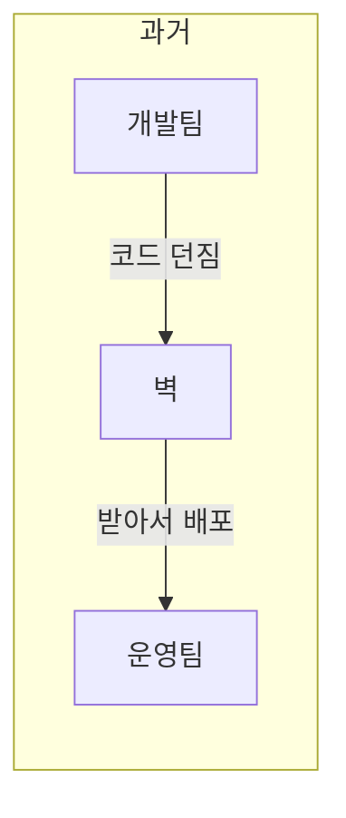
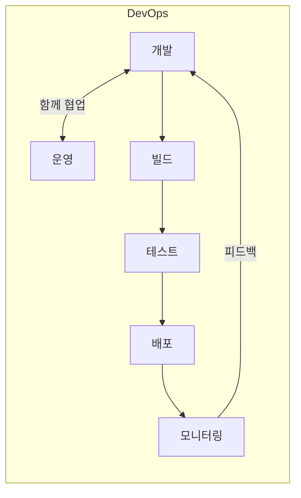
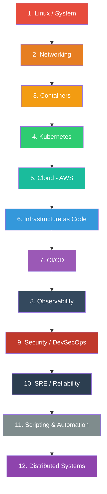
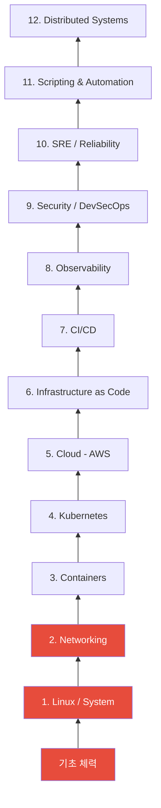
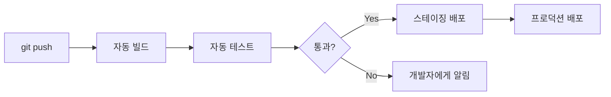
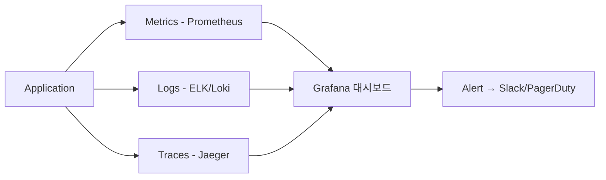

# DevOps 로드맵 Overview

> 이 강의 시리즈를 시작하기 전에, DevOps가 뭔지 그리고 앞으로 뭘 배우게 되는지 전체 그림을 먼저 그려볼게요.

---

## 🎯 이 강의 시리즈는 누구를 위한 건가요?

* 개발은 해봤는데 서버 운영은 처음인 분
* "배포는 어떻게 하는 거지?" 싶었던 분
* DevOps 엔지니어로 커리어를 시작하려는 분
* 이미 일하고 있지만 체계적으로 정리하고 싶은 분

---

## 🧠 DevOps가 뭔가요?

### 한마디로

**개발(Development)과 운영(Operations)을 하나로 연결하는 것**이에요.

### 비유로 이해하기

레스토랑을 생각해보세요.

* **셰프(개발자)** — 요리를 만드는 사람
* **홀 매니저(운영)** — 요리가 손님에게 제대로 전달되고, 주방이 원활하게 돌아가게 하는 사람

예전에는 셰프가 요리만 만들고 던지면, 홀 매니저가 알아서 서빙했어요.
문제가 생기면 "내 요리는 괜찮았는데?" vs "가져온 그대로 냈는데?" 서로 떠넘기기 일쑤였죠.

**DevOps는 셰프와 홀 매니저가 함께 일하는 방식이에요.**
요리를 만드는 과정부터 손님 테이블까지, 전체 흐름을 같이 책임지는 거예요.





---

## 🔍 DevOps 엔지니어는 뭘 하나요?

쉽게 말하면 이런 질문들에 답하는 사람이에요.

| 질문 | DevOps가 하는 일 |
|------|----------------|
| 서버가 갑자기 느려졌어요 | 원인 찾고 해결 (Linux, Monitoring) |
| 코드를 서버에 어떻게 올려요? | 자동 배포 파이프라인 구축 (CI/CD) |
| 사용자가 갑자기 10배 늘었어요 | 자동으로 서버 늘리기 (K8s, Cloud) |
| 서버가 해킹당했어요 | 보안 체계 구축 (Security) |
| 서버비가 너무 많이 나와요 | 비용 최적화 (Cloud, FinOps) |
| 장애가 났는데 원인을 모르겠어요 | 로그/메트릭 분석 (Observability) |
| 서버 100대를 똑같이 세팅해야 해요 | 코드로 인프라 관리 (IaC) |

---

## 🗺️ 전체 로드맵

총 12개 카테고리, 124개 강의로 구성되어 있어요.



### 왜 이 순서인가요?

각 카테고리는 앞의 것을 기반으로 해요. 비유하면 건물을 짓는 것과 같아요.



* **1층 (Linux + Networking)** = 건물의 기초. 이게 없으면 위에 아무것도 못 쌓아요
* **2층 (Containers + Kubernetes)** = 건물의 뼈대. 현대 DevOps의 핵심
* **3층 (Cloud + IaC)** = 건물의 외벽과 설비. 인프라를 코드로 관리
* **4층 (CI/CD)** = 엘리베이터. 코드를 자동으로 위아래로 이동
* **5층 (Observability + Security + SRE)** = 관리실. 건물이 잘 돌아가는지 감시
* **옥상 (Scripting + Distributed Systems)** = 전체를 연결하는 자동화와 설계 원칙

---

## 📦 각 카테고리 미리보기

### 1️⃣ Linux / System (14강)

> 모든 서버의 기본. DevOps의 출발점.

컴퓨터의 운영체제를 이해하는 단계예요. 파일은 어디에 저장되는지, 프로세스는 어떻게 관리하는지, 서버가 느려지면 어디를 봐야 하는지 배워요.

**배우는 것:** 파일 시스템, 권한, 프로세스, systemd, 디스크, 로그, 성능 분석, 커널 내부

**실무 예시:** "서버 디스크가 100%래요!" → `df -h`로 확인 → 큰 로그 파일 찾아서 정리

---

### 2️⃣ Networking (13강)

> 서버끼리 어떻게 대화하는지.

인터넷이 어떻게 동작하는지, 데이터가 어떤 경로로 전달되는지 이해하는 단계예요. DNS, 로드밸런싱, VPN 같은 걸 배워요.

**배우는 것:** TCP/UDP, HTTP, DNS, 로드밸런싱, TLS/인증서, VPN, CDN

**실무 예시:** "사이트가 안 열려요!" → DNS 문제인지 서버 문제인지 `dig`, `curl`로 진단

---

### 3️⃣ Containers (9강)

> 앱을 어디서든 똑같이 실행하는 방법.

"제 컴퓨터에서는 되는데요?" 문제를 해결해주는 기술이에요. Docker를 중심으로 컨테이너의 개념부터 최적화, 보안까지 배워요.

**배우는 것:** Docker, Dockerfile, containerd, 이미지 최적화, 컨테이너 보안

**실무 예시:** 개발자가 만든 앱을 Docker 이미지로 패키징 → 어떤 서버에서든 동일하게 실행

---

### 4️⃣ Kubernetes (19강)

> 컨테이너 수백 개를 자동으로 관리하는 오케스트라 지휘자.

컨테이너가 1개면 Docker로 충분하지만, 수십~수백 개가 되면 누가 관리하나요? Kubernetes가 자동으로 배포, 스케일링, 복구를 해줘요.

**배우는 것:** 클러스터 구조, Pod, Service, Ingress, 오토스케일링, Helm, Service Mesh

**실무 예시:** 트래픽 급증 → K8s가 자동으로 Pod 10개 → 100개로 확장 → 트래픽 줄면 다시 축소

---

### 5️⃣ Cloud - AWS (18강)

> 서버를 직접 사지 않고 빌려 쓰는 방법.

물리 서버를 사서 데이터센터에 넣는 대신, AWS에서 클릭 몇 번으로 서버를 만들고 없앨 수 있어요.

**배우는 것:** EC2, VPC, S3, RDS, Lambda, IAM, 비용 관리, DR

**실무 예시:** 새 서비스 출시 → VPC 설계 → EC2 + RDS 구성 → ALB로 로드밸런싱 → CloudWatch로 모니터링

---

### 6️⃣ Infrastructure as Code (6강)

> 인프라를 코드로 관리하는 방법.

AWS 콘솔에서 클릭으로 서버를 만들면, 누가 뭘 바꿨는지 추적이 안 돼요. 코드로 관리하면 Git처럼 버전 관리가 가능해요.

**배우는 것:** Terraform, Ansible, CloudFormation, Pulumi

**실무 예시:** `terraform apply` 한 줄로 VPC + 서브넷 + EC2 + RDS 한번에 생성

---

### 7️⃣ CI/CD (13강)

> 코드를 자동으로 테스트하고 배포하는 파이프라인.

개발자가 코드를 push하면, 자동으로 빌드 → 테스트 → 배포까지 진행되는 시스템을 만들어요.

**배우는 것:** Git, GitHub Actions, Jenkins, 배포 전략, GitOps, ArgoCD

**실무 예시:** `git push` → 자동 테스트 → Docker 이미지 빌드 → K8s에 canary 배포 → 문제 없으면 전체 배포



---

### 8️⃣ Observability (11강)

> 시스템 안에서 무슨 일이 일어나고 있는지 보는 눈.

서비스가 잘 돌아가는지, 어디가 병목인지, 에러가 어디서 나는지 실시간으로 파악하는 체계를 만들어요.

**배우는 것:** Prometheus, Grafana, ELK, OpenTelemetry, Jaeger, Alerting

**실무 예시:** API 응답 시간이 서서히 느려짐 → Grafana 대시보드에서 발견 → Jaeger로 병목 구간 추적 → DB 쿼리가 원인



---

### 9️⃣ Security / DevSecOps (7강)

> 보안을 나중에 하지 말고, 처음부터 파이프라인에 녹이는 것.

배포 파이프라인 안에 보안 검사를 넣어서, 취약한 코드나 이미지가 프로덕션에 올라가지 못하게 해요.

**배우는 것:** OAuth/OIDC, Vault, 이미지 스캐닝, Supply Chain Security, Policy as Code

**실무 예시:** CI 파이프라인에서 Trivy로 이미지 스캔 → 치명적 취약점 발견 → 배포 자동 차단

---

### 🔟 SRE / Reliability (6강)

> "서비스가 99.9% 안정적으로 돌아가게 하려면?"

서비스 안정성을 숫자로 정의하고, 장애에 체계적으로 대응하고, 장애에서 배우는 문화를 만들어요.

**배우는 것:** SLO/SLI, Incident Management, Postmortem, Chaos Engineering, FinOps, Platform Engineering

**실무 예시:** SLO 99.9% 설정 → 이번 달 에러 버짓 43분 → 남은 버짓 10분 → 이번 주는 위험한 배포 보류

---

### 1️⃣1️⃣ Scripting & Automation (5강)

> 반복 작업을 코드로 자동화하는 능력.

매일 수동으로 하는 작업을 Python이나 Go로 자동화하고, 팀과 효과적으로 협업하는 방법을 배워요.

**배우는 것:** Python, Go, YAML/JSON, Makefile, 기술 문서 작성, Agile

**실무 예시:** 매일 아침 수동으로 하던 로그 정리를 Python 스크립트로 자동화 → cron에 등록 → 매일 새벽 자동 실행

---

### 1️⃣2️⃣ Distributed Systems (2강)

> 여러 서버가 협력할 때 생기는 근본적인 문제와 해결 패턴.

마이크로서비스 환경에서 반드시 마주치는 설계 원칙이에요. 짧지만 모든 카테고리를 관통하는 개념이에요.

**배우는 것:** CAP theorem, consensus, circuit breaker, retry, rate limiting, idempotency

**실무 예시:** 결제 API 타임아웃 → retry 했더니 중복 결제 발생 → idempotency key로 해결

---

## 📊 학습 시간 예상

| 구간 | 카테고리 | 예상 시간 | 난이도 |
|------|---------|----------|--------|
| 기초 | Linux + Networking | 3~4주 | ⭐⭐ |
| 핵심 | Containers + Kubernetes | 4~5주 | ⭐⭐⭐ |
| 인프라 | Cloud + IaC | 3~4주 | ⭐⭐⭐ |
| 파이프라인 | CI/CD | 2~3주 | ⭐⭐ |
| 운영 | Observability + Security + SRE | 3~4주 | ⭐⭐⭐ |
| 마무리 | Scripting + Distributed Systems | 1~2주 | ⭐⭐ |
| **전체** | | **약 16~22주** | |

매일 1~2시간 기준으로 약 4~5개월이면 전체를 한 바퀴 돌 수 있어요.

---

## ⚡ 학습 팁

### 1. 완벽하게 이해하고 넘어가지 마세요
처음에는 70% 이해로 충분해요. 뒤의 내용을 배우면서 앞의 개념이 "아 그래서 그랬구나!" 하고 연결돼요.

### 2. 반드시 직접 해보세요
읽기만 하면 다음 날 잊어버려요. 모든 강의에 실습이 있으니 직접 타이핑하세요.

### 3. 에러를 두려워하지 마세요
에러 메시지를 읽고 해결하는 과정 자체가 DevOps의 핵심이에요. 실무에서 하는 일의 절반은 트러블슈팅이에요.

### 4. 메모하면서 배우세요
"이건 나중에 이럴 때 쓰겠다" 같은 자기만의 메모를 남기세요.

---

## 📝 정리

```
DevOps = 개발 + 운영을 하나로 연결

12개 카테고리:
├── 기초: Linux → Networking
├── 핵심: Containers → Kubernetes
├── 인프라: Cloud → IaC
├── 파이프라인: CI/CD
├── 운영: Observability → Security → SRE
└── 마무리: Scripting → Distributed Systems

총 124개 강의 / 약 4~5개월 분량
순서대로 하면 자연스럽게 연결됨
```

---

## 🔗 다음 강의

다음은 모든 것의 시작점인 **[01-linux/01-filesystem.md — Linux 파일 시스템 구조](./01-linux/01-filesystem.md)** 예요.

서버에 접속하면 가장 먼저 마주치는 것이 파일 시스템이에요. `/etc`는 뭐고 `/var`는 뭔지, 왜 그런 구조인지부터 시작해볼게요.