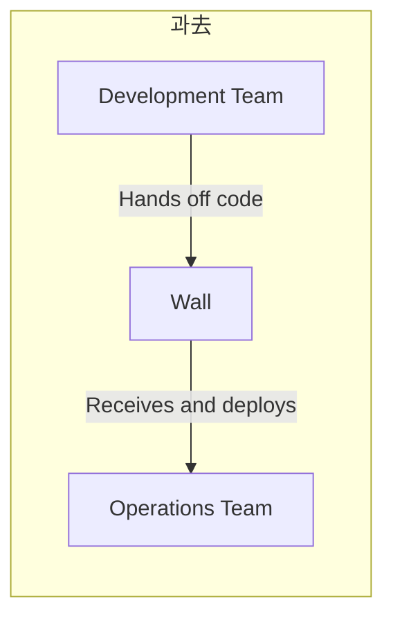
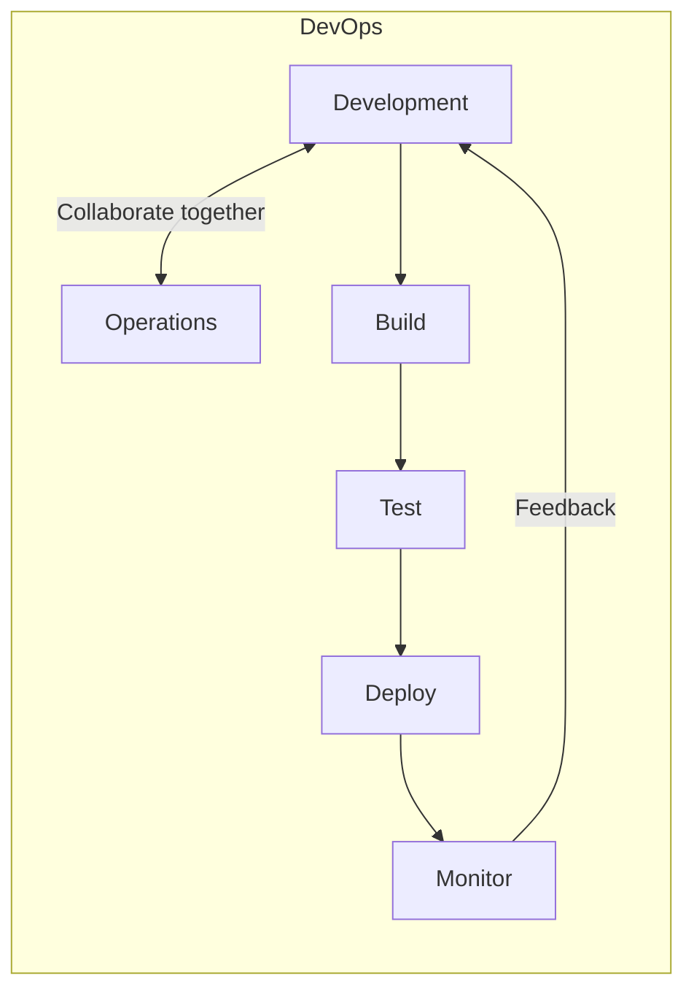
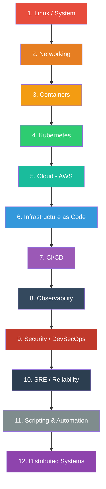
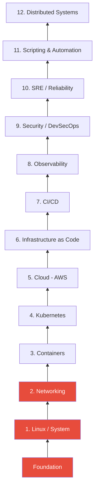
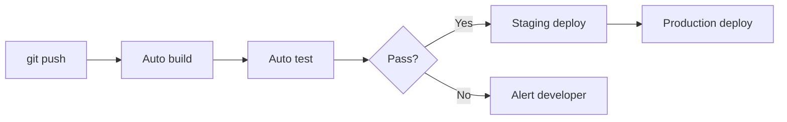
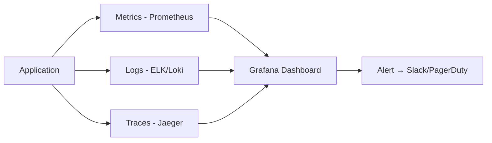

# DevOps Roadmap Overview

> Before you start this lecture series, let's first draw the big picture of what DevOps is and what you'll learn going forward.

---

## 🎯 Who is this lecture series for?

* Those who have development experience but are new to server operations
* Those who wondered "How do we deploy?"
* Those starting a career as a DevOps engineer
* Those already working but want to organize their knowledge systematically

---

## 🧠 What is DevOps?

### In one sentence

**Connecting Development and Operations as one.**

### Understanding through analogy

Think of a restaurant.

* **Chef (developer)** — The person who makes the food
* **Front-of-house manager (operations)** — The person who ensures food is delivered properly to customers and keeps the kitchen running smoothly

In the past, the chef would just make the food and hand it off, and the manager would serve it however they could.
When problems occurred, it was always "My food was fine" vs "I served it as I received it" — blame shifting.

**DevOps is how the chef and manager work together.**
They share responsibility for the entire flow from cooking to the customer's table.





---

## 🔍 What does a DevOps Engineer do?

Simply put, they answer questions like these:

| Question | What DevOps Does |
|----------|------------------|
| The server suddenly got slow | Find and fix the root cause (Linux, Monitoring) |
| How do we get code to the server? | Build an automated deployment pipeline (CI/CD) |
| User count suddenly increased 10x | Automatically scale servers (K8s, Cloud) |
| Server got hacked | Establish a security framework (Security) |
| Server costs are too high | Optimize costs (Cloud, FinOps) |
| There's an outage but we don't know why | Analyze logs and metrics (Observability) |
| We need to configure 100 servers identically | Manage infrastructure as code (IaC) |

---

## 🗺️ Full Roadmap

Structured with 12 categories and 124 lectures total.



### Why this order?

Each category builds on the previous one. It's like building a building.



* **Floor 1 (Linux + Networking)** = The foundation of the building. Without it, you can't build anything on top
* **Floor 2 (Containers + Kubernetes)** = The skeleton of the building. The core of modern DevOps
* **Floor 3 (Cloud + IaC)** = The exterior walls and utilities. Managing infrastructure as code
* **Floor 4 (CI/CD)** = The elevator. Automatically moving code up and down
* **Floor 5 (Observability + Security + SRE)** = The control room. Monitoring that the building operates properly
* **Rooftop (Scripting + Distributed Systems)** = Automation and design principles that connect everything

---

## 📦 Category Previews

### 1️⃣ Linux / System (14 lectures)

> The foundation of all servers. The starting point of DevOps.

This stage is about understanding a computer's operating system. You'll learn where files are stored, how processes are managed, and what to check when a server runs slow.

**What you'll learn:** File systems, permissions, processes, systemd, disks, logs, performance analysis, kernel internals

**Real-world example:** "The server disk is at 100%!" → Check with `df -h` → Find and clean up large log files

---

### 2️⃣ Networking (13 lectures)

> How servers talk to each other.

This stage is about understanding how the internet works and what path data takes to reach its destination. You'll learn about DNS, load balancing, VPN, and more.

**What you'll learn:** TCP/UDP, HTTP, DNS, load balancing, TLS/certificates, VPN, CDN

**Real-world example:** "The site won't load!" → Diagnose with `dig` and `curl` whether it's a DNS or server issue

---

### 3️⃣ Containers (9 lectures)

> A way to run apps identically anywhere.

This technology solves the "It works on my computer" problem. You'll learn Docker, from container concepts to optimization and security.

**What you'll learn:** Docker, Dockerfile, containerd, image optimization, container security

**Real-world example:** Package the app created by developers into a Docker image → Run identically on any server

---

### 4️⃣ Kubernetes (19 lectures)

> An orchestra conductor that automatically manages hundreds of containers.

If you have just one container, Docker is enough. But what if you have dozens to hundreds? Kubernetes automatically handles deployment, scaling, and recovery.

**What you'll learn:** Cluster architecture, Pod, Service, Ingress, auto-scaling, Helm, Service Mesh

**Real-world example:** Traffic surge → K8s automatically scales from 10 Pods → to 100 Pods → shrinks back when traffic decreases

---

### 5️⃣ Cloud - AWS (18 lectures)

> A way to rent servers instead of buying them directly.

Instead of buying physical servers and putting them in a data center, you can create and destroy servers in AWS with just a few clicks.

**What you'll learn:** EC2, VPC, S3, RDS, Lambda, IAM, cost management, DR

**Real-world example:** Launch new service → Design VPC → Set up EC2 + RDS → Load balance with ALB → Monitor with CloudWatch

---

### 6️⃣ Infrastructure as Code (6 lectures)

> A way to manage infrastructure as code.

If you create servers by clicking in the AWS console, there's no way to track who changed what. Managing infrastructure as code allows version control like Git.

**What you'll learn:** Terraform, Ansible, CloudFormation, Pulumi

**Real-world example:** One line `terraform apply` creates VPC + subnets + EC2 + RDS all at once

---

### 7️⃣ CI/CD (13 lectures)

> An automated pipeline that tests and deploys code.

When a developer pushes code, it automatically goes through build → test → deploy. You'll build this kind of system.

**What you'll learn:** Git, GitHub Actions, Jenkins, deployment strategies, GitOps, ArgoCD

**Real-world example:** `git push` → automatic testing → Docker image build → canary deploy to K8s → full deployment if no issues



---

### 8️⃣ Observability (11 lectures)

> The eyes that see what's happening inside the system.

You'll build a system to monitor if the service is running well, where the bottlenecks are, and where errors are occurring in real-time.

**What you'll learn:** Prometheus, Grafana, ELK, OpenTelemetry, Jaeger, Alerting

**Real-world example:** API response time gradually gets slower → Discover in Grafana dashboard → Trace bottleneck with Jaeger → Identify slow DB query as the cause



---

### 9️⃣ Security / DevSecOps (7 lectures)

> Embedding security into the pipeline from the start, not as an afterthought.

You'll integrate security checks into the deployment pipeline so vulnerable code or images can't reach production.

**What you'll learn:** OAuth/OIDC, Vault, image scanning, Supply Chain Security, Policy as Code

**Real-world example:** Scan image with Trivy in CI pipeline → Discover critical vulnerability → Automatically block deployment

---

### 🔟 SRE / Reliability (6 lectures)

> "How do we keep the service running 99.9% reliably?"

You'll define service reliability with numbers, respond to outages systematically, and build a culture of learning from incidents.

**What you'll learn:** SLO/SLI, Incident Management, Postmortem, Chaos Engineering, FinOps, Platform Engineering

**Real-world example:** Set SLO to 99.9% → This month's error budget is 43 minutes → 10 minutes left → Hold off risky deployments this week

---

### 1️⃣1️⃣ Scripting & Automation (5 lectures)

> The ability to automate repetitive tasks with code.

You'll learn to automate daily manual tasks with Python or Go, and how to collaborate effectively with your team.

**What you'll learn:** Python, Go, YAML/JSON, Makefile, technical documentation, Agile

**Real-world example:** Daily manual log cleanup → Automate with Python script → Register in cron → Automatically runs every morning

---

### 1️⃣2️⃣ Distributed Systems (2 lectures)

> Fundamental problems and solution patterns that arise when multiple servers collaborate.

These are design principles you'll inevitably encounter in microservices environments. Though short, they're concepts that cut through all categories.

**What you'll learn:** CAP theorem, consensus, circuit breaker, retry, rate limiting, idempotency

**Real-world example:** Payment API timeout → Retry it and suddenly there's a duplicate charge → Solve with idempotency key

---

## 📊 Estimated Learning Time

| Section | Category | Estimated Time | Difficulty |
|---------|----------|----------------|-----------|
| Foundations | Linux + Networking | 3~4 weeks | ⭐⭐ |
| Core | Containers + Kubernetes | 4~5 weeks | ⭐⭐⭐ |
| Infrastructure | Cloud + IaC | 3~4 weeks | ⭐⭐⭐ |
| Pipeline | CI/CD | 2~3 weeks | ⭐⭐ |
| Operations | Observability + Security + SRE | 3~4 weeks | ⭐⭐⭐ |
| Wrap-up | Scripting + Distributed Systems | 1~2 weeks | ⭐⭐ |
| **Total** | | **About 16~22 weeks** | |

At 1~2 hours per day, you can get through the entire curriculum in about 4~5 months.

---

## ⚡ Learning Tips

### 1. Don't wait to understand everything perfectly
70% understanding is enough at first. As you learn the later material, earlier concepts will click: "Oh, that's why!"

### 2. You must practice hands-on
If you just read, you'll forget by tomorrow. Every lecture has exercises — type them out yourself.

### 3. Don't fear errors
Reading error messages and solving them is the core of DevOps. Half of what you do in real work is troubleshooting.

### 4. Take notes while learning
Write down your own notes like "I'll use this when..." — make it personal.

---

## 📝 Summary

```
DevOps = Connecting Development + Operations as one

12 categories:
├── Foundations: Linux → Networking
├── Core: Containers → Kubernetes
├── Infrastructure: Cloud → IaC
├── Pipeline: CI/CD
├── Operations: Observability → Security → SRE
└── Wrap-up: Scripting → Distributed Systems

124 lectures total / About 4~5 months worth
Follow the order and concepts naturally connect
```

---

## 🔗 Next Lecture

Next is **[01-linux/01-filesystem.md — Linux File System Structure](./01-linux/01-filesystem)** — the starting point of everything.

When you first log into a server, the first thing you encounter is the file system. Let's start by learning what `/etc` and `/var` are and why the structure is organized that way.
