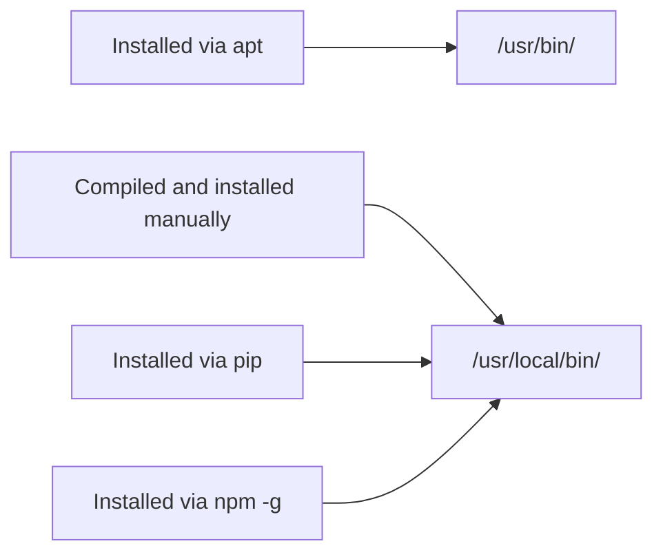
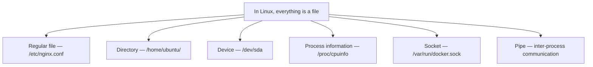

# Linux Filesystem Structure

> When you SSH into a server, the first thing you encounter is the filesystem. "Where is this file?" "What does this folder do?" — If you don't understand this, you'll get lost on the server.

---

## 🎯 Why Do You Need to Know This?

You've SSHed into a server and need to modify a configuration file. But you don't know where it is.

```bash
# This situation happens every day
"Where's the Nginx configuration file?"  → /etc/nginx/
"Where are the log files?"                → /var/log/
"Where did the program I just installed go?" → /usr/bin/ or /usr/local/bin/
"Where are temporary files?"              → /tmp/
```

If you don't understand the filesystem structure, you'll need to search every time, and you might accidentally delete important files. Once you know the structure, you can think, "Oh, this is a configuration file, so it must be under `/etc`" and find it immediately.

---

## 🧠 Core Concepts

### Analogy: An Apartment Building

The Linux filesystem is like an **apartment building**.

* **`/` (root)** = The building itself. The starting point of everything
* **`/etc`** = Management office. All the building's settings and rules are here
* **`/var`** = Mailroom + trash area. Data that continuously changes
* **`/home`** = Individual units (residents' personal spaces)
* **`/tmp`** = Lobby table. A place anyone can temporarily leave things
* **`/usr`** = Common facilities (gym, library). Programs that all residents use
* **`/proc`** = Security monitors. Shows what's happening in the building in real-time

### The Most Important Principle

> **In Linux, everything is a file.**

Hard disk? It's a file (`/dev/sda`). CPU information? It's a file (`/proc/cpuinfo`). Network socket? It's a file. If you remember this principle, Linux becomes much easier.

---

## 🔍 Detailed Explanation

### Complete Directory Structure

```mermaid
flowchart TD
    ROOT["/  (root)"] --> ETC["/etc — Configuration files"]
    ROOT --> VAR["/var — Variable data"]
    ROOT --> HOME["/home — User home directories"]
    ROOT --> USR["/usr — Programs and libraries"]
    ROOT --> TMP["/tmp — Temporary files"]
    ROOT --> PROC["/proc — Process information"]
    ROOT --> DEV["/dev — Device files"]
    ROOT --> BIN["/bin — Essential commands"]
    ROOT --> SBIN["/sbin — System administration commands"]
    ROOT --> OPT["/opt — Third-party software"]
    ROOT --> BOOT["/boot — Boot files"]
    ROOT --> MNT["/mnt — Temporary mount points"]
    ROOT --> SRV["/srv — Service data"]
    ROOT --> SYS["/sys — Kernel/hardware information"]
    ROOT --> RUN["/run — Runtime data"]

    style ROOT fill:#e74c3c,color:#fff
    style ETC fill:#3498db,color:#fff
    style VAR fill:#2ecc71,color:#fff
    style HOME fill:#9b59b6,color:#fff
    style USR fill:#f39c12,color:#fff
    style PROC fill:#1abc9c,color:#fff
```



It looks like a lot, doesn't it? But in DevOps day-to-day work, you'll use only 6-7 of them. Let's go through each one.

---

### `/etc` — The House of Configuration Files

It's easy to remember as **Editable Text Configuration** (this isn't the official etymology, but it works in practice).

All the system's configuration files live here.

```bash
/etc/
├── nginx/              # Nginx web server configuration
│   └── nginx.conf
├── ssh/                # SSH connection settings
│   └── sshd_config
├── hosts               # Domain-IP mapping (simple DNS)
├── hostname            # This server's name
├── passwd              # User list
├── shadow              # User passwords (encrypted)
├── group               # Group list
├── fstab               # Disk mount settings
├── crontab             # Scheduled tasks
├── resolv.conf         # DNS server settings
└── systemd/            # Service management settings
    └── system/
```

```bash
# Commands commonly used in practice

# View Nginx configuration
cat /etc/nginx/nginx.conf

# Check this server's hostname
cat /etc/hostname

# Check DNS settings
cat /etc/resolv.conf

# Check user list
cat /etc/passwd
```

**Practical tip:** Always backup files in `/etc` before modifying them.

```bash
# Always do this before modifying configuration files
sudo cp /etc/nginx/nginx.conf /etc/nginx/nginx.conf.bak

# If something goes wrong after modification
sudo cp /etc/nginx/nginx.conf.bak /etc/nginx/nginx.conf
```

---

### `/var` — Data That Continuously Changes

It stands for **Variable**. Data that constantly changes in size lives here.

```bash
/var/
├── log/                # ⭐ Log files (viewed most frequently)
│   ├── syslog          # System-wide log
│   ├── auth.log        # Login and authentication log
│   ├── nginx/          # Nginx access log
│   │   ├── access.log
│   │   └── error.log
│   └── journal/        # Systemd journal log
├── lib/                # Application runtime data
│   ├── docker/         # Docker image and container data
│   └── mysql/          # MySQL data files
├── cache/              # Cache data
├── spool/              # Queue data (mail, print)
└── tmp/                # Temporary files that survive reboot
```

```bash
# Most common task in practice: viewing logs

# View logs in real-time (tail -f = follow continuously)
tail -f /var/log/syslog

# Last 50 lines of Nginx error log
tail -50 /var/log/nginx/error.log

# Find logs containing "error"
grep "error" /var/log/syslog

# Check how much space the log folder is using
du -sh /var/log/
```

**⚠️ Important production note:** If `/var/log` fills up, the server can crash. This is a very common outage in production.

```bash
# Check disk usage
df -h

# Find which logs are taking up the most space
du -sh /var/log/* | sort -rh | head -10
```

---

### `/home` — User Personal Spaces

Each user's personal folder. Like individual units in an apartment.

```bash
/home/
├── ubuntu/             # ubuntu user's space
│   ├── .bashrc         # Shell configuration (aliases, environment variables)
│   ├── .ssh/           # SSH keys
│   │   ├── id_rsa      # Private key (never share!)
│   │   ├── id_rsa.pub  # Public key
│   │   └── authorized_keys  # List of allowed connection keys
│   └── .profile        # Script executed on login
├── deploy/             # deploy user's space
└── admin/              # admin user's space
```

```bash
# Go to my home directory (3 methods, all equivalent)
cd ~
cd $HOME
cd /home/ubuntu

# View hidden files included (files starting with .)
ls -la ~
```

**Note:** The `root` user's home is not `/home/root` but `/root`. The administrator gets special treatment.

---

### `/usr` — Programs and Libraries

It stands for **Unix System Resources**. Installed programs live here.

```bash
/usr/
├── bin/                # Commands used by ordinary users
│   ├── git
│   ├── python3
│   ├── curl
│   └── vim
├── sbin/               # System administrator commands
├── lib/                # Library files
├── local/              # ⭐ Programs you installed manually
│   ├── bin/            # Manually installed executables
│   └── lib/            # Manually installed libraries
├── share/              # Documentation, manuals
└── include/            # Header files (for development)
```

**The difference between `/usr/bin` and `/usr/local/bin`:**



```bash
# Find where a command is installed
which python3
# /usr/bin/python3

which terraform
# /usr/local/bin/terraform

# Search for commands
whereis nginx
```

---

### `/proc` — Real-time System Information

It stands for **Process**. It's not a real file but a **virtual filesystem** created by the kernel. It exists only in memory, not on disk.

```bash
/proc/
├── cpuinfo             # CPU information
├── meminfo             # Memory information
├── uptime              # Server uptime
├── loadavg             # System load
├── diskstats           # Disk statistics
├── 1/                  # PID 1 process information
│   ├── status          # Process status
│   ├── cmdline         # Execution command
│   └── fd/             # List of open files
├── 1234/               # PID 1234 process information
└── ...
```

```bash
# CPU information (how many cores)
cat /proc/cpuinfo | grep "model name" | head -1
cat /proc/cpuinfo | grep "processor" | wc -l    # Number of cores

# Memory information
cat /proc/meminfo | head -5

# Server uptime
cat /proc/uptime    # In seconds
uptime              # Human-readable format

# System load (1-minute, 5-minute, 15-minute averages)
cat /proc/loadavg
```

**Analogy:** `/proc` is like a car's dashboard. It's not an actual component but a display showing the status of components.

---

### `/dev` — Device Files

It stands for **Device**. Hardware like hard disks, USB drives, and terminals are represented as files.

```bash
/dev/
├── sda                 # First disk entirely
│   ├── sda1            # First partition
│   └── sda2            # Second partition
├── nvme0n1             # NVMe SSD
├── null                # ⭐ Black hole (everything fed into it disappears)
├── zero                # Generates zeros infinitely
├── random              # Random number generator
└── tty                 # Terminal
```

```bash
# Using /dev/null — when you want to discard output
# "I want to execute it but don't need the result"
command_that_prints_a_lot > /dev/null 2>&1

# Check disk list
lsblk
```

**The meaning of "everything is a file":**



---

### `/tmp` — Temporary Files

A temporary storage area readable and writable by anyone. **Disappears after reboot.**

```bash
# Create a temporary file
echo "temporary data" > /tmp/mytest.txt

# After reboot? → Gone!
```

**Practical tip:** If your scripts need temporary files, use `/tmp`, but never store important data here.

---

### `/opt` — Third-Party Software

It stands for **Optional**. Software installed separately, not through the package manager (apt), goes here.

```bash
/opt/
├── datadog-agent/      # Datadog monitoring agent
├── prometheus/         # Prometheus (if installed manually)
└── custom-app/         # Your company's custom application
```

---

### Other Directories Quick Reference

| Directory | Role | Analogy |
|-----------|------|---------|
| `/bin` | Essential commands (`ls`, `cp`, `cat`) | Emergency toolbox |
| `/sbin` | System administration commands (`fdisk`, `iptables`) | Administrator-only toolbox |
| `/boot` | Files needed for booting (kernel image) | Ignition key |
| `/mnt` | Temporary mount points | Temporary parking |
| `/srv` | Service data (web server files, etc.) | Store display shelves |
| `/sys` | Kernel/hardware information (virtual) | Hardware version of `/proc` |
| `/run` | Runtime data after boot (PID files, etc.) | Temporary notepad |

**Note:** In modern Linux (Ubuntu, etc.), `/bin` is a symbolic link to `/usr/bin`, and `/sbin` is a symbolic link to `/usr/sbin`. They're essentially the same place.

```bash
# Verify it
ls -la /bin
# lrwxrwxrwx 1 root root 7 ... /bin -> usr/bin
```

---

## 💻 Practical Exercises

Connect to a server and try these directly.

### Exercise 1: Explore Directory Structure

```bash
# View root directory one level deep
ls -la /

# Check size of each directory
du -sh /* 2>/dev/null | sort -rh | head -10

# Which directory is the largest?
# Usually /usr, /var, /home in that order
```

### Exercise 2: Look at Configuration Files

```bash
# What's this server called?
cat /etc/hostname

# What's the DNS configuration?
cat /etc/resolv.conf

# What users exist?
cat /etc/passwd | head -10

# What services start at boot?
ls /etc/systemd/system/
```

### Exercise 3: Check System Information

```bash
# CPU information
cat /proc/cpuinfo | grep "model name" | head -1

# Total memory
cat /proc/meminfo | grep MemTotal

# Server uptime
uptime

# Current disk usage
df -h
```

### Exercise 4: Trace Command Locations

```bash
# Where is the ls command?
which ls
type ls

# Find all python-related paths
whereis python3

# Check paths registered in PATH
echo $PATH
# /usr/local/sbin:/usr/local/bin:/usr/sbin:/usr/bin:/sbin:/bin

# What PATH means: Commands are searched in these paths in order
```

---

## 🏢 Real-World Scenarios

### Scenario 1: "The server disk is full!"

```bash
# 1. Check overall disk usage
df -h
# /dev/sda1   50G   48G  2G  96% /    ← 96%! Danger!

# 2. Find what's large (from root)
du -sh /* 2>/dev/null | sort -rh | head -5
# 30G   /var         ← Culprit found!

# 3. Dig deeper in /var
du -sh /var/* | sort -rh | head -5
# 25G   /var/log     ← Logs are the problem!

# 4. Which logs are large?
du -sh /var/log/* | sort -rh | head -5
# 20G   /var/log/nginx/access.log   ← This one!

# 5. Clean up old logs (carefully!)
sudo truncate -s 0 /var/log/nginx/access.log
```

### Scenario 2: "Where did this program get installed?"

```bash
# Method 1: which (only finds things in PATH)
which docker
# /usr/bin/docker

# Method 2: dpkg (if installed via apt)
dpkg -L docker-ce | head -20

# Method 3: find (searches everywhere)
sudo find / -name "docker" -type f 2>/dev/null
```

### Scenario 3: Checking a New Server Setup

```bash
# 1. Check OS version
cat /etc/os-release

# 2. Check CPU/memory
nproc                    # CPU core count
free -h                  # Memory

# 3. Check disk
df -h                    # Mounted disks
lsblk                    # All block devices

# 4. Check network
ip addr                  # IP addresses
cat /etc/resolv.conf     # DNS

# 5. Check/set hostname
hostname
```

---

## ⚠️ Common Mistakes

### 1. Running `rm -rf` from `/` (root)

```bash
# ❌ Never do this — entire server is destroyed
sudo rm -rf /

# ❌ Also dangerous — accidentally introducing a space
sudo rm -rf / tmp/mydir    # Deletes '/' AND 'tmp/mydir'!

# ✅ Safe method
sudo rm -rf /tmp/mydir     # Keep the path connected
```

### 2. Not Backing Up Before Modifying `/etc` Files

```bash
# ❌ Modifying directly is risky, recovery is impossible if things break
sudo vim /etc/nginx/nginx.conf

# ✅ Always backup first
sudo cp /etc/nginx/nginx.conf /etc/nginx/nginx.conf.bak.$(date +%Y%m%d)
sudo vim /etc/nginx/nginx.conf

# If something breaks, restore
sudo cp /etc/nginx/nginx.conf.bak.20250312 /etc/nginx/nginx.conf
```

### 3. Not Managing `/var/log` Capacity

```bash
# Logs accumulate → disk 100% → server crashes
# To prevent this, logrotate configuration is essential

# Check logrotate settings
cat /etc/logrotate.conf
ls /etc/logrotate.d/
```

### 4. Storing Important Data in `/tmp`

```bash
# ❌ Disappears after reboot!
cp important_data.sql /tmp/

# ✅ For permanent storage, use home or separate directory
cp important_data.sql /home/ubuntu/backups/
```

### 5. Not Checking PATH When Command is Not Found

```bash
# When you get "command not found", you need to figure out if:
# 1. It's really not installed
# 2. The path just isn't in PATH

# Check PATH
echo $PATH

# Try running with full path
/usr/local/bin/terraform version

# Add to PATH
export PATH=$PATH:/usr/local/bin
# For permanent effect, add to ~/.bashrc
```

---

## 📝 Summary

### Top 6 Directories You Use Every Day

| Directory | In One Word | When Do You Go There? |
|-----------|-------------|----------------------|
| `/etc` | Configuration files | When changing service settings |
| `/var/log` | Logs | When troubleshooting failures |
| `/home` | User home | SSH keys, personal scripts |
| `/usr/bin` | Installed programs | When checking command location |
| `/proc` | System info | When checking CPU/memory |
| `/tmp` | Temporary files | When needing temporary storage |

### Principles to Remember

```
1. Everything in Linux is a file
2. All paths start from / (root)
3. Settings go in /etc, logs in /var/log, programs in /usr/bin
4. /proc and /sys are virtual filesystems (not on disk)
5. Always backup before modifying files
```

---

## 🔗 Next Lesson

The next lesson is **[01-linux/02-permissions.md — File Permissions and ACL](./02-permissions)**.

"Why can't I open this file?" "What's Permission denied?" — Now that you understand the filesystem structure, let's learn the permission system that defines "who can access each file."
