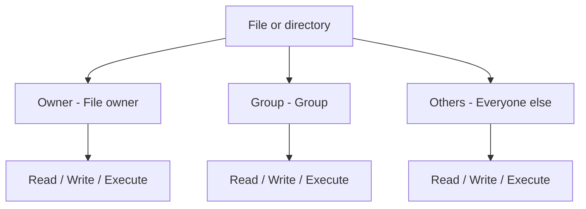
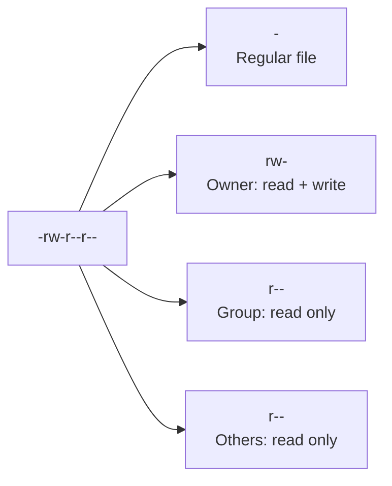
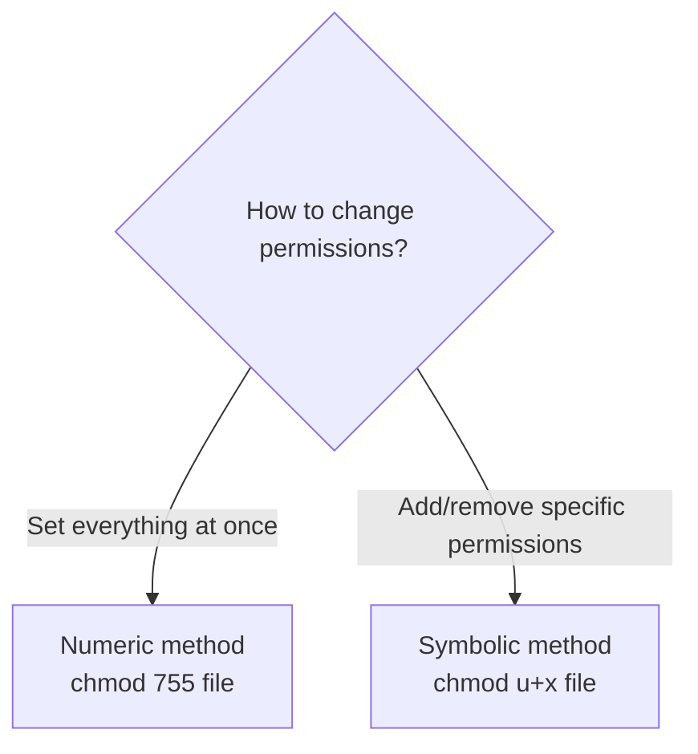
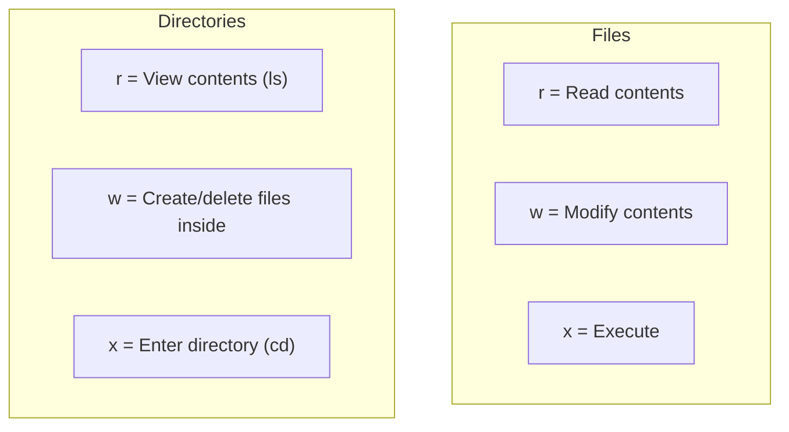
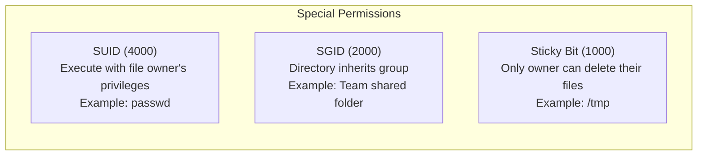
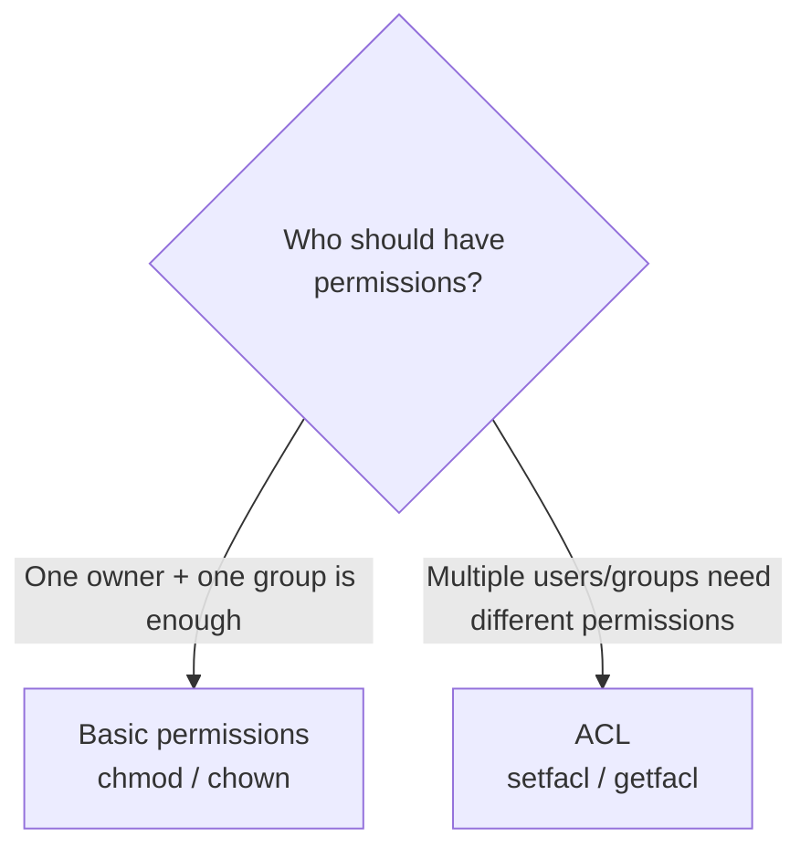

# Linux File Permissions (Permissions / ACL)

> "Permission denied" — one of the most common error messages you'll see in Linux. Let's understand exactly why this happens and how to fix it.

---

## 🎯 Why Do You Need to Know This?

This situation happens every day on servers.

```bash
$ cat /etc/shadow
cat: /etc/shadow: Permission denied

$ ./deploy.sh
bash: ./deploy.sh: Permission denied

$ echo "hello" > /var/log/myapp.log
bash: /var/log/myapp.log: Permission denied
```

If you don't understand permissions, you'll just repeat "it doesn't work," and if you understand them poorly, you'll solve everything with `chmod 777` (opening all permissions), which creates security holes.

**Real-world permission tasks:**
* Grant execute permission to deployment scripts
* Allow applications to write to log files
* SSH key file permissions must be restricted or connection is refused
* Configure Docker socket access permissions
* Limit folder access when multiple teams share a server

---

## 🧠 Core Concepts

### Analogy: Hotel Key Cards

Think about a hotel.

* **Guest (Owner)** — Can access their own room. Can do anything inside.
* **Other guests on the same floor (Group)** — Can use the shared lounge but can't enter other rooms.
* **Outsiders (Others)** — Can only access the lobby.

Linux file permissions work the same way. Every file has **who (Who)** can **do what (What)** defined.



### Three Permissions

| Permission | Character | Number | Meaning on Files | Meaning on Directories |
|-----------|-----------|--------|-----------------|----------------------|
| Read | `r` | 4 | Read file contents | View directory listing (`ls`) |
| Write | `w` | 2 | Modify file contents | Create/delete files in directory |
| Execute | `x` | 1 | Execute file (scripts, etc.) | Enter directory (`cd`) |

---

## 🔍 Detailed Explanation

### How to Read Permissions

```bash
ls -la /etc/nginx/nginx.conf
# -rw-r--r-- 1 root root 1482 Mar 10 09:00 /etc/nginx/nginx.conf
```

Let's break down this output.

```
-  rw-  r--  r--   1   root  root  1482  Mar 10 09:00  nginx.conf
│  │    │    │     │   │     │     │     │              │
│  │    │    │     │   │     │     │     └─ Modified date └─ Filename
│  │    │    │     │   │     │     └─ File size (bytes)
│  │    │    │     │   │     └─ Owning group
│  │    │    │     │   └─ Owner
│  │    │    │     └─ Hard link count
│  │    │    └─ Others permissions: r-- (read only)
│  │    └─ Group permissions: r-- (read only)
│  └─ Owner permissions: rw- (read + write)
└─ File type: - (regular file)
```

**File type characters:**

| Character | Meaning |
|-----------|---------|
| `-` | Regular file |
| `d` | Directory |
| `l` | Symbolic link |
| `b` | Block device (disk) |
| `c` | Character device (terminal) |
| `s` | Socket |



### Representing Permissions Numerically (Octal)

Permissions can also be expressed as numbers. You'll use numbers more often in practice.

```
r = 4
w = 2
x = 1
- = 0

Sum them to express permissions:
rwx = 4+2+1 = 7
rw- = 4+2+0 = 6
r-x = 4+0+1 = 5
r-- = 4+0+0 = 4
--- = 0+0+0 = 0
```

**Commonly used permission numbers:**

| Number | Permission | Meaning | When used? |
|--------|-----------|---------|-----------|
| `755` | `rwxr-xr-x` | Owner full, others read+execute | Executable files, directories |
| `644` | `rw-r--r--` | Owner read+write, others read | Regular configuration files |
| `600` | `rw-------` | Owner read+write only | SSH private keys, secret files |
| `700` | `rwx------` | Owner only, full permissions | Personal script directories |
| `400` | `r--------` | Owner read only | SSH keys (AWS, etc.) |
| `777` | `rwxrwxrwx` | Everyone has all permissions | ⚠️ Almost never use! |

---

### chmod — Change Permissions

**Numeric method (Octal):**

```bash
# Grant execute permission (most common)
chmod 755 deploy.sh
# Owner: rwx, Group: r-x, Others: r-x

# Set SSH key permissions (essential!)
chmod 600 ~/.ssh/id_rsa
# Owner read+write only

# Configuration file
chmod 644 config.yaml
# Owner: read+write, Others: read only
```

**Symbolic method (Character-based):**

```bash
# u=user(owner), g=group, o=others, a=all

# Add execute permission to owner
chmod u+x deploy.sh

# Remove write permission from group
chmod g-w config.yaml

# Remove all permissions from others
chmod o-rwx secret.key

# Grant read permission to everyone
chmod a+r readme.txt

# Multiple changes at once
chmod u+x,g-w,o-rwx script.sh
```

**When to use each method:**



```bash
# Practical example: You created a deployment script but it won't execute

# 1. Check current permissions
ls -la deploy.sh
# -rw-r--r-- 1 ubuntu ubuntu 256 ...   ← No execute permission (x)!

# 2. Add execute permission
chmod +x deploy.sh
# Or
chmod 755 deploy.sh

# 3. Now it's executable
./deploy.sh
```

---

### chown — Change Owner

```bash
# Basic syntax
chown [owner]:[group] [file]

# Change owner to nginx
sudo chown nginx /var/log/myapp.log

# Change both owner and group
sudo chown nginx:nginx /var/log/myapp.log

# Change directory and all files within (-R = recursive)
sudo chown -R ubuntu:ubuntu /home/ubuntu/app/

# Change group only
sudo chown :docker /var/run/docker.sock
```

**Real-world scenario:**

```bash
# When an app can't write to a log file
# 1. Check the log file owner
ls -la /var/log/myapp.log
# -rw-r--r-- 1 root root ...    ← root owns it! App runs as ubuntu

# 2. Change owner to the app's user
sudo chown ubuntu:ubuntu /var/log/myapp.log

# 3. Or solve with group permissions
sudo chown root:appgroup /var/log/myapp.log
sudo chmod 664 /var/log/myapp.log
# Users in appgroup can now write
```

---

### Directory Permission Specifics

The meaning of `r`, `w`, `x` differs for files and directories. This is confusing if you don't know it.



```bash
# Try it yourself

# Without x on a directory, you can't cd into it
mkdir /tmp/testdir
chmod 640 /tmp/testdir    # rw-r----- (no x)
cd /tmp/testdir
# bash: cd: /tmp/testdir: Permission denied

# Without r on a directory, you can't ls it
chmod 710 /tmp/testdir    # rwx--x---
ls /tmp/testdir           # Other users can't ls
cd /tmp/testdir           # But cd works! (because x exists)

# Rule: Directories usually need both r and x
chmod 755 /tmp/testdir    # Typical directory permissions
```

---

### Special Permissions (SUID, SGID, Sticky Bit)

There are 3 additional special permissions beyond basic `rwx`.

#### SUID (Set User ID) — Number: 4000

When executed, the file **runs with the owner's permissions**.

```bash
# Classic example: passwd command
ls -la /usr/bin/passwd
# -rwsr-xr-x 1 root root ...
#    ^
#    s = SUID is set

# When a regular user runs passwd, it:
# Can modify /etc/shadow with root privileges
# (That's why password changes work)
```

#### SGID (Set Group ID) — Number: 2000

When set on a directory, files created inside **inherit the directory's group**.

```bash
# Create a team shared folder
sudo mkdir /shared/team
sudo chown root:devteam /shared/team
sudo chmod 2775 /shared/team
#          ^
#          2 = SGID

# Now whoever creates a file, it belongs to devteam
touch /shared/team/report.txt
ls -la /shared/team/report.txt
# -rw-r--r-- 1 ubuntu devteam ...   ← Group automatically devteam!
```

#### Sticky Bit — Number: 1000

When set on a directory, **only the file owner can delete their own files**.

```bash
# Classic example: /tmp
ls -ld /tmp
# drwxrwxrwt 15 root root ...
#          ^
#          t = Sticky Bit

# Anyone can create files in /tmp
# But can't delete others' files

# Setting Sticky Bit
chmod 1777 /shared/temp
# Or
chmod +t /shared/temp
```



---

### ACL (Access Control List)

Basic `owner/group/others` isn't always enough. Sometimes you need to grant permissions to specific users. That's when ACL comes in.

**Analogy:** Basic permissions divide people into "residents/same floor/outsiders," but ACL lets you say "I'll give unit 304 Mr. Kim a special gym key."

```bash
# View ACL
getfacl /var/log/myapp.log

# Grant read+write to a specific user
sudo setfacl -m u:deploy:rw /var/log/myapp.log

# Grant read to a specific group
sudo setfacl -m g:monitoring:r /var/log/myapp.log

# Check permissions (+ sign means ACL is set)
ls -la /var/log/myapp.log
# -rw-rw-r--+ 1 ubuntu ubuntu ...
#           ^
#           + = ACL exists

# View detailed ACL
getfacl /var/log/myapp.log
# file: var/log/myapp.log
# owner: ubuntu
# group: ubuntu
# user::rw-
# user:deploy:rw-        ← Extra permission for deploy user
# group::r--
# group:monitoring:r--   ← Extra permission for monitoring group
# mask::rw-
# other::r--

# Set default ACL on directory (applies to new files)
sudo setfacl -d -m u:deploy:rwx /var/log/myapp/

# Remove ACL
sudo setfacl -x u:deploy /var/log/myapp.log

# Remove all ACLs
sudo setfacl -b /var/log/myapp.log
```

**When to use ACL:**



---

### umask — Default Permissions

Sets the default permissions for new files and directories.

```bash
# Check current umask
umask
# 0022

# umask calculation:
# File default max permissions:      666 (rw-rw-rw-)
# Directory default max permissions: 777 (rwxrwxrwx)
#
# Actual permissions = Max permissions - umask
#
# With umask 0022:
# File:      666 - 022 = 644 (rw-r--r--)
# Directory: 777 - 022 = 755 (rwxr-xr-x)

# Verify directly
touch /tmp/testfile
mkdir /tmp/testdir
ls -la /tmp/testfile   # -rw-r--r-- (644)
ls -la -d /tmp/testdir # drwxr-xr-x (755)

# Change umask (current session only)
umask 0077   # New files: 600, new directories: 700 (owner only)

# Permanent change: Add to ~/.bashrc
echo "umask 0022" >> ~/.bashrc
```

---

## 💻 Practical Exercises

### Exercise 1: Practice Reading Permissions

```bash
# Look at permissions on several files
ls -la /etc/passwd
ls -la /etc/shadow
ls -la /usr/bin/passwd
ls -la ~/.ssh/

# Answer these questions:
# 1. Can anyone read /etc/passwd?
# 2. Why can't regular users read /etc/shadow?
# 3. Why is there an 's' in /usr/bin/passwd?

# Answers:
# 1. Yes, 644 (rw-r--r--) → Others have r
# 2. 640 (rw-r-----) → Others have no permissions (password hash protection)
# 3. SUID → Regular users can run it with root privileges to change password
```

### Exercise 2: Set Up Deployment Script Permissions

```bash
# Create a deployment script
cat > /tmp/deploy.sh << 'EOF'
#!/bin/bash
echo "Starting deployment..."
echo "Server: $(hostname)"
echo "Time: $(date)"
echo "Deployment complete!"
EOF

# Try to run it
/tmp/deploy.sh
# bash: /tmp/deploy.sh: Permission denied

# Check permissions
ls -la /tmp/deploy.sh
# -rw-r--r--   ← No execute permission (x)!

# Grant execute permission
chmod 755 /tmp/deploy.sh

# Run again
/tmp/deploy.sh
# Starting deployment...
# Server: my-server
# Time: Wed Mar 12 10:00:00 UTC 2025
# Deployment complete!
```

### Exercise 3: SSH Key Permissions (Getting This Wrong Prevents Login)

```bash
# SSH refuses connection if key permissions are too open
# WARNING: UNPROTECTED PRIVATE KEY FILE!
# Permissions 0644 for '/home/ubuntu/.ssh/id_rsa' are too open.

# Correct permissions for SSH files
chmod 700 ~/.ssh              # Directory: owner only
chmod 600 ~/.ssh/id_rsa       # Private key: owner read+write only
chmod 644 ~/.ssh/id_rsa.pub   # Public key: world-readable
chmod 644 ~/.ssh/authorized_keys  # Authorized keys
chmod 644 ~/.ssh/known_hosts  # Known hosts list
chmod 644 ~/.ssh/config       # SSH config

# Set all at once
chmod 700 ~/.ssh && chmod 600 ~/.ssh/id_rsa && chmod 644 ~/.ssh/*.pub
```

### Exercise 4: Create Team Shared Directory

```bash
# Scenario: Team members in devteam group share a directory

# 1. Create the group
sudo groupadd devteam

# 2. Add users to the group
sudo usermod -aG devteam ubuntu
sudo usermod -aG devteam deploy

# 3. Create shared directory
sudo mkdir -p /shared/project

# 4. Set ownership
sudo chown root:devteam /shared/project

# 5. Set SGID + group write permissions
sudo chmod 2775 /shared/project
# 2 = SGID (new files inherit devteam group)
# 775 = rwxrwxr-x

# 6. Verify
ls -ld /shared/project
# drwxrwsr-x 2 root devteam ...
#       ^
#       s = SGID is set

# 7. Test: Files created automatically belong to devteam
touch /shared/project/test.txt
ls -la /shared/project/test.txt
# -rw-r--r-- 1 ubuntu devteam ...   ← Group is devteam!
```

### Exercise 5: ACL Practice

```bash
# Scenario: Allow monitoring user to read app logs

# 1. Create log file
sudo touch /var/log/myapp.log
sudo chown root:root /var/log/myapp.log
sudo chmod 640 /var/log/myapp.log

# 2. Currently monitoring user can't access
# sudo -u monitoring cat /var/log/myapp.log
# Permission denied

# 3. Add read permission via ACL
sudo setfacl -m u:monitoring:r /var/log/myapp.log

# 4. Verify
getfacl /var/log/myapp.log

# 5. Now monitoring user can read
# sudo -u monitoring cat /var/log/myapp.log
# (output successful)
```

---

## 🏢 Real-World Scenarios

### Scenario 1: Docker Permission Problem

```bash
# Docker command fails
docker ps
# Got permission denied while trying to connect to the Docker daemon socket

# Root cause: docker.sock permissions
ls -la /var/run/docker.sock
# srw-rw---- 1 root docker ...

# Solution: Add current user to docker group
sudo usermod -aG docker $USER

# Group membership takes effect on next login
# Or temporarily:
newgrp docker

# Verify
docker ps    # Now it works!
```

### Scenario 2: Nginx Can't Write to Logs

```bash
# Nginx error log shows
# [error] open() "/var/log/nginx/access.log" failed (13: Permission denied)

# Investigate
ls -la /var/log/nginx/
# Nginx usually runs as www-data or nginx user

# Check what user Nginx runs as
ps aux | grep nginx
# www-data  1234  ... nginx: worker process

# Fix
sudo chown -R www-data:www-data /var/log/nginx/
sudo chmod 755 /var/log/nginx/
sudo chmod 644 /var/log/nginx/*.log
```

### Scenario 3: CI/CD Deployment Script Fails

```bash
# Jenkins or GitHub Actions gets
# "Permission denied" error

# Root cause: Script from Git has no execute permission

# Solution 1: Grant permission in pipeline
chmod +x ./scripts/deploy.sh
./scripts/deploy.sh

# Solution 2: Commit execute permission to Git
git update-index --chmod=+x scripts/deploy.sh
git commit -m "Add execute permission to deploy script"
git push
```

### Scenario 4: Container Can't Write to Host Volume

```bash
# Container fails writing to host volume

# Root cause: Container user UID != host file owner UID
# Container: uid=1000 (app)
# Host file: uid=0 (root)

# Solution 1: Fix permissions on host
sudo chown 1000:1000 /data/app-volume/

# Solution 2: Use same UID in Dockerfile
# USER 1000
```

---

## ⚠️ Common Mistakes

### 1. Using `chmod 777` to Solve Everything

```bash
# ❌ Worst habit — creates security holes
chmod 777 /var/www/html/
chmod 777 /etc/myapp.conf
chmod 777 ~/.ssh/id_rsa

# ✅ Grant only necessary minimum permissions
chmod 755 /var/www/html/        # Web directory
chmod 644 /etc/myapp.conf       # Configuration file
chmod 600 ~/.ssh/id_rsa         # SSH private key
```

**Principle: Principle of Least Privilege**
— Give only what's necessary, deny everything else.

### 2. Mistakes When Changing Permissions Recursively

```bash
# ❌ Applies same permission to files and directories
chmod -R 755 /var/www/
# Config files (.env) incorrectly get execute permission!

# ✅ Set files and directories separately
find /var/www/ -type d -exec chmod 755 {} \;   # Directories only
find /var/www/ -type f -exec chmod 644 {} \;   # Files only
```

### 3. Changing Ownership of System Directories

```bash
# ❌ Changing system directory owners breaks services
sudo chown -R ubuntu:ubuntu /etc/
# → Various services fail to start!

# ❌ Never change /tmp, /var ownership carelessly
sudo chown -R ubuntu:ubuntu /var/

# ✅ Only change specific files/directories you've modified
sudo chown ubuntu:ubuntu /etc/myapp/config.yaml
```

### 4. Overusing sudo

```bash
# ❌ Using sudo on every file changes ownership to root
sudo vim /home/ubuntu/app/config.yaml
# → File becomes root-owned, app can't read it!

# ✅ Use sudo only for system files
vim /home/ubuntu/app/config.yaml

# Use sudo only when truly needed for system files
sudo vim /etc/nginx/nginx.conf
```

### 5. Leaving SSH Key Permissions Too Open

```bash
# SSH refuses connection if key permissions are too open
# "WARNING: UNPROTECTED PRIVATE KEY FILE!"

# ❌ Too open
chmod 644 ~/.ssh/id_rsa    # Others can read → refused!

# ✅ Correct
chmod 600 ~/.ssh/id_rsa    # Only owner can read → connection succeeds
```

---

## 📝 Summary

### Permission Quick Reference

```
Read   Write  Execute
 r      w      x
 4      2      1

rwx = 7    rw- = 6    r-x = 5    r-- = 4    --- = 0
```

### Commonly Used Permission Combinations in Practice

| Target | Permission | Command |
|--------|-----------|---------|
| Directory (normal) | 755 | `chmod 755 dir/` |
| Configuration file | 644 | `chmod 644 config.yaml` |
| Secret file | 600 | `chmod 600 secret.key` |
| Executable script | 755 | `chmod 755 deploy.sh` |
| SSH private key | 600 | `chmod 600 ~/.ssh/id_rsa` |
| SSH directory | 700 | `chmod 700 ~/.ssh/` |
| Team shared folder | 2775 | `chmod 2775 /shared/` |

### Core Commands

```bash
chmod [permissions] [file]        # Change permissions
chown [owner]:[group] [file]      # Change owner
ls -la [file]                     # View permissions
getfacl [file]                    # View ACL
setfacl -m [rule] [file]          # Set ACL
umask                             # View default permission mask
```

---

## 🔗 Next Lesson

The next lesson is **[01-linux/03-users-groups.md — User and Group Management](./03-users-groups)**.

You've seen "owner" and "group" in permissions, right? Let's learn how to create and manage users and groups, and how to control server access in real-world scenarios.
