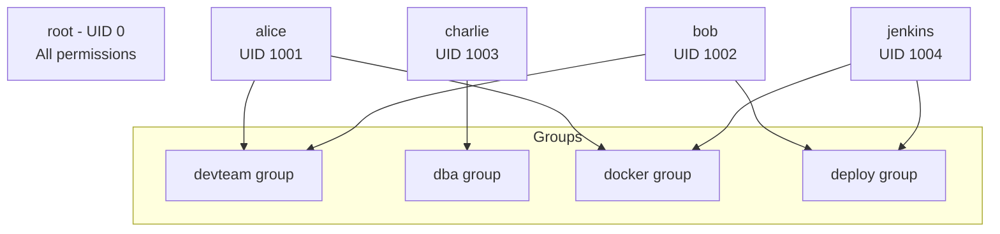
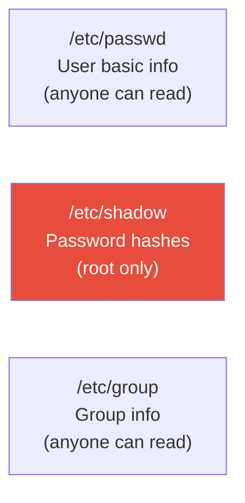
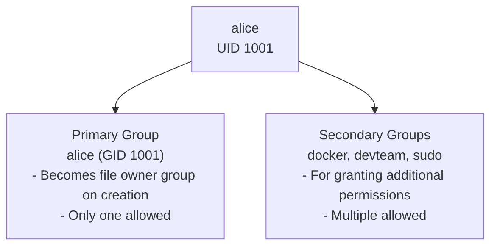
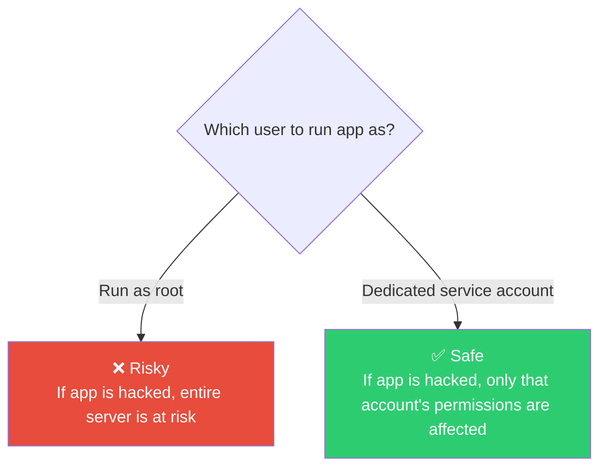

# Linux User and Group Management

> Who can connect to a server, and what can they do — that's what user and group management is about. It's the first gate of security.

---

## 🎯 Why Do You Need to Know This?

These people connect to company servers:

```
• 5 developers — need to deploy app code
• 1 DBA — manage only the database
• Monitoring bot — read logs only
• CI/CD pipeline — run deployment scripts only
• 1 intern — read-only access only
```

If you give the `root` account to everyone, the moment an intern accidentally runs `rm -rf /`, it's over.

**With good user/group management:**
* Everyone gets only the permissions they need (principle of least privilege)
* You can track who did what (audit logs)
* Limit the damage scope from mistakes

---

## 🧠 Core Concepts

### Analogy: Company ID Badge System

Think of a company:

* **User** = An employee with an ID badge. Each has a unique employee ID (UID).
* **Group** = A department. Dev team, ops team, DBA team, etc. Access to certain areas depends on the department.
* **root** = The CEO. Can go anywhere and do anything.

One employee can belong to multiple departments. "Developer AND security team" — same in Linux: one user can belong to multiple groups.



### Two Types of Users

| Type | UID Range | Example | Description |
|------|-----------|---------|-------------|
| System user | 0 ~ 999 | root(0), www-data(33), nobody(65534) | Services run as these; no login |
| Regular user | 1000+ | ubuntu(1000), alice(1001) | Human users who log in |

---

## 🔍 Detailed Explanation

### Where User Information Is Stored

Linux splits user information across 3 files:



#### /etc/passwd — User List

```bash
cat /etc/passwd | head -5
# root:x:0:0:root:/root:/bin/bash
# daemon:x:1:1:daemon:/usr/sbin:/usr/sbin/nologin
# bin:x:2:2:bin:/bin:/usr/sbin/nologin
# www-data:x:33:33:www-data:/var/www:/usr/sbin/nologin
# ubuntu:x:1000:1000:Ubuntu:/home/ubuntu:/bin/bash
```

Let's break down one line:

```
ubuntu : x : 1000 : 1000 : Ubuntu : /home/ubuntu : /bin/bash
  │      │    │      │       │          │              │
  │      │    │      │       │          │              └─ Login shell
  │      │    │      │       │          └─ Home directory
  │      │    │      │       └─ Description (name, memo, etc.)
  │      │    │      └─ Primary group GID
  │      │    └─ User UID
  │      └─ Password (x = stored in /etc/shadow)
  └─ Username
```

**Login Shell Meanings:**

| Shell | Meaning |
|-------|---------|
| `/bin/bash` | Login allowed |
| `/usr/sbin/nologin` | No login (service account only) |
| `/bin/false` | No login (more strict) |

```bash
# View only users who can log in
grep -v "nologin\|false" /etc/passwd | grep -v "^#"
```

#### /etc/shadow — Passwords (Sensitive!)

```bash
sudo cat /etc/shadow | head -3
# root:$6$abc...:19000:0:99999:7:::
# daemon:*:19000:0:99999:7:::
# ubuntu:$6$xyz...:19500:0:99999:7:::
```

```
ubuntu : $6$xyz... : 19500 : 0 : 99999 : 7 : : :
  │        │          │      │     │      │
  │        │          │      │     │      └─ Days warning before expiry
  │        │          │      │     └─ Max days of password use
  │        │          │      └─ Min days between password changes
  │        │          └─ Last password change (days since 1970-01-01)
  │        └─ Encrypted password
  └─ Username
```

**Special Password Field Values:**

| Value | Meaning |
|-------|---------|
| `$6$...` | Password encrypted with SHA-512 |
| `*` | Password login disabled (from creation) |
| `!` | Account locked |
| `!!` | Password not yet set |

#### /etc/group — Group List

```bash
cat /etc/group | grep -E "docker|sudo|dev"
# sudo:x:27:ubuntu
# docker:x:998:ubuntu,deploy
# devteam:x:1001:alice,bob,charlie
```

```
docker : x : 998 : ubuntu,deploy
  │      │    │       │
  │      │    │       └─ Users in the group (comma-separated)
  │      │    └─ Group GID
  │      └─ Password (rarely used)
  └─ Group name
```

---

### User Management Commands

#### useradd — Create User

```bash
# Basic creation (no home directory)
sudo useradd alice

# Create with home directory (almost always use -m in practice)
sudo useradd -m alice

# Full options commonly used in production
sudo useradd -m \
  -s /bin/bash \           # Login shell
  -G docker,devteam \      # Secondary groups
  -c "Alice Kim - Backend Dev" \  # Description
  alice

# Set password
sudo passwd alice
```

**useradd vs adduser:**

```bash
# useradd — low-level command. Must specify all options manually
sudo useradd -m -s /bin/bash alice

# adduser — high-level wrapper. Asks interactively (Debian/Ubuntu)
sudo adduser alice
# Adding user `alice' ...
# New password:
# Full Name []: Alice Kim
# ...

# Production recommendation: useradd in scripts, adduser manually
```

#### usermod — Modify User

```bash
# Add to group (most common option)
sudo usermod -aG docker alice      # Add to docker group
sudo usermod -aG sudo alice        # Grant sudo rights

# ⚠️ Without -a, using -G removes user from existing groups!
# ❌ Dangerous
sudo usermod -G docker alice       # alice's groups become docker only!

# ✅ Safe (a = append)
sudo usermod -aG docker alice      # Keeps existing groups + adds docker

# Change shell
sudo usermod -s /bin/zsh alice

# Change home directory (move existing files too)
sudo usermod -d /home/newalice -m alice

# Rename user
sudo usermod -l newalice alice

# Lock/Unlock account
sudo usermod -L alice    # Lock (adds ! before password)
sudo usermod -U alice    # Unlock
```

#### userdel — Delete User

```bash
# Delete user only (keep home directory)
sudo userdel alice

# Delete user + home directory
sudo userdel -r alice

# Delete fails if user has running processes
# Force delete
sudo userdel -f alice
```

#### Check User Information

```bash
# Who am I
whoami
# ubuntu

# My UID, GID, groups
id
# uid=1000(ubuntu) gid=1000(ubuntu) groups=1000(ubuntu),27(sudo),998(docker)

# Specific user info
id alice
# uid=1001(alice) gid=1001(alice) groups=1001(alice),998(docker),1002(devteam)

# Currently logged-in users
who
w        # More detailed

# User's recent login history
last alice | head -5

# Failed login attempts (audit)
sudo lastb | head -10
```

---

### Group Management Commands

```bash
# Create group
sudo groupadd devteam
sudo groupadd -g 2000 dba    # Specify GID

# Add user to group (2 methods)
sudo usermod -aG devteam alice    # Method 1: usermod
sudo gpasswd -a alice devteam    # Method 2: gpasswd

# Remove user from group
sudo gpasswd -d alice devteam

# Delete group
sudo groupdel devteam

# Check users in group
getent group devteam
# devteam:x:1001:alice,bob,charlie

# Or
grep devteam /etc/group

# List my groups
groups
# ubuntu sudo docker devteam

# List user's groups
groups alice
```

---

### Primary Group vs Secondary Groups

A user has **one primary group** + **multiple secondary groups**.



```bash
# Check alice's groups
id alice
# uid=1001(alice) gid=1001(alice) groups=1001(alice),27(sudo),998(docker)
#                  ^^^^^^^^^^^^                    ^^^^^^^^^^^^^^^^^^^^^^^^
#                  primary group                   secondary groups

# When files are created, primary group is used
touch testfile
ls -la testfile
# -rw-r--r-- 1 alice alice ...
#                    ^^^^^
#                    primary group = alice

# Change primary group
sudo usermod -g devteam alice
# Now files created by alice will have devteam as group
```

---

### sudo — Execute with Admin Privileges

`sudo` lets a regular user temporarily use root privileges.

```bash
# sudo usage
sudo [command]

# Switch to root
sudo -i          # Switch to root's environment (root shell)
sudo su -        # Similar
sudo -s          # Root shell, keep current environment

# Execute command as different user
sudo -u postgres psql    # Run psql as postgres user
sudo -u www-data whoami  # Run whoami as www-data
```

#### sudo Privilege Management — /etc/sudoers

```bash
# ⚠️ Always edit /etc/sudoers with visudo
# If you edit directly with vim and have syntax errors, sudo stops working!
sudo visudo
```

```bash
# /etc/sudoers main content

# root can do everything
root    ALL=(ALL:ALL) ALL

# sudo group members can do everything (password required)
%sudo   ALL=(ALL:ALL) ALL

# Grant specific user specific commands only
deploy  ALL=(ALL) NOPASSWD: /usr/bin/systemctl restart nginx
deploy  ALL=(ALL) NOPASSWD: /usr/bin/docker *

# Grant specific group specific commands (no password)
%devteam ALL=(ALL) NOPASSWD: /usr/bin/docker *
%dba     ALL=(ALL) NOPASSWD: /usr/bin/systemctl restart postgresql
```

**sudoers File Format Explanation:**

```
deploy  ALL=(ALL)  NOPASSWD:  /usr/bin/systemctl restart nginx
 │       │    │        │              │
 │       │    │        │              └─ Allowed command
 │       │    │        └─ Run without password
 │       │    └─ Which user can run as
 │       └─ Which hosts (ALL = all servers)
 └─ Target user for this rule
```

#### Production Recommendation: Use /etc/sudoers.d/

```bash
# Don't edit /etc/sudoers directly; manage as separate files

# sudo config for deploy user
sudo visudo -f /etc/sudoers.d/deploy
# deploy ALL=(ALL) NOPASSWD: /usr/bin/systemctl restart nginx, /usr/bin/docker *

# sudo config for devteam group
sudo visudo -f /etc/sudoers.d/devteam
# %devteam ALL=(ALL) NOPASSWD: /usr/bin/docker *, /usr/bin/kubectl *

# File permissions must be 440
sudo chmod 440 /etc/sudoers.d/deploy
```

---

### Service Accounts (System Account)

Accounts created for **services to run**, not for actual people.

```bash
# Create service account (no login, no home directory)
sudo useradd -r -s /usr/sbin/nologin -M myapp
#             │  │                    │
#             │  │                    └─ Don't create home directory
#             │  └─ Login shell = nologin (SSH forbidden)
#             └─ System account (UID < 1000)

# Run application as service account
sudo -u myapp /opt/myapp/start.sh

# Specify user in systemd service
# /etc/systemd/system/myapp.service
# [Service]
# User=myapp
# Group=myapp
# ExecStart=/opt/myapp/start.sh
```

**Why Do We Need Service Accounts?**



```bash
# Production example: each service runs as different user
ps aux | grep -E "nginx|postgres|redis|docker"
# www-data  1234  nginx: worker process
# postgres  2345  /usr/lib/postgresql/14/bin/postgres
# redis     3456  /usr/bin/redis-server
# root      4567  /usr/bin/dockerd     ← Docker daemon runs as root
```

---

### /etc/login.defs — User Creation Defaults

```bash
cat /etc/login.defs | grep -v "^#" | grep -v "^$" | head -20

# Key settings
# UID_MIN        1000    # Regular user UID starts at
# UID_MAX       60000    # Regular user UID max
# SYS_UID_MIN    100    # System user UID starts at
# GID_MIN        1000    # Regular group GID starts at
# PASS_MAX_DAYS 99999    # Max days of password use
# PASS_MIN_DAYS     0    # Min days between password changes
# PASS_WARN_AGE     7    # Days warning before expiry
# UMASK           022    # Default umask
```

---

### Password Management

```bash
# Set/change password
sudo passwd alice            # Change alice's password
passwd                       # Change my password

# Check password expiry info
sudo chage -l alice
# Last password change                    : Mar 10, 2025
# Password expires                        : never
# Account expires                         : never
# Minimum number of days between password change : 0
# Maximum number of days between password change : 99999

# Set password policy
sudo chage -M 90 alice      # Must change password every 90 days
sudo chage -m 7 alice       # Must keep same password for min 7 days
sudo chage -W 14 alice      # Warn 14 days before expiry
sudo chage -E 2025-12-31 alice  # Set account expiry date

# Force password expiry (must change on next login)
sudo passwd -e alice

# Lock/unlock account
sudo passwd -l alice         # Lock
sudo passwd -u alice         # Unlock
```

---

## 💻 Practice Exercises

### Exercise 1: Basic User/Group Operations

```bash
# 1. Create test user
sudo useradd -m -s /bin/bash -c "Test User" testuser
sudo passwd testuser     # Set password

# 2. Check info
id testuser
grep testuser /etc/passwd
grep testuser /etc/group

# 3. Create group and add user
sudo groupadd testgroup
sudo usermod -aG testgroup testuser

# 4. Verify
groups testuser
# testuser : testuser testgroup

# 5. Cleanup
sudo userdel -r testuser
sudo groupdel testgroup
```

### Exercise 2: Production-Style Server Access Structure

```bash
# Scenario: dev team, dba team, deploy account

# 1. Create groups
sudo groupadd dev
sudo groupadd dba
sudo groupadd deploy

# 2. Create users
sudo useradd -m -s /bin/bash -G dev,docker alice         # Developer
sudo useradd -m -s /bin/bash -G dev,docker bob           # Developer
sudo useradd -m -s /bin/bash -G dba charlie              # DBA
sudo useradd -r -s /usr/sbin/nologin -G deploy deployer  # Deploy account (no login)

# 3. Create work directories
sudo mkdir -p /app/{code,database,deploy}

sudo chown root:dev /app/code
sudo chmod 2775 /app/code            # Dev team write access only

sudo chown root:dba /app/database
sudo chmod 2770 /app/database        # DBA team access only

sudo chown root:deploy /app/deploy
sudo chmod 2775 /app/deploy          # Deploy account write access only

# 4. Verify
ls -la /app/
# drwxrwsr-x 2 root dev      ... code
# drwxrws--- 2 root dba      ... database
# drwxrwsr-x 2 root deploy   ... deploy

# 5. Test (alice is in dev group, can write to /app/code)
sudo -u alice touch /app/code/test.txt     # ✅ Success
sudo -u alice touch /app/database/test.txt # ❌ Permission denied
sudo -u charlie touch /app/database/test.txt # ✅ Success
```

### Exercise 3: Fine-Grained sudo Permissions

```bash
# Scenario: grant deploy user nginx restart only

# 1. Create deploy user (from previous exercise)
sudo useradd -m -s /bin/bash deployer2

# 2. Create sudo config file
sudo visudo -f /etc/sudoers.d/deployer2

# Enter this content:
# deployer2 ALL=(ALL) NOPASSWD: /usr/bin/systemctl restart nginx
# deployer2 ALL=(ALL) NOPASSWD: /usr/bin/systemctl status nginx
# deployer2 ALL=(ALL) NOPASSWD: /usr/bin/systemctl reload nginx

# 3. Set permissions
sudo chmod 440 /etc/sudoers.d/deployer2

# 4. Test
sudo -u deployer2 sudo systemctl status nginx  # ✅ Allowed
sudo -u deployer2 sudo systemctl stop nginx    # ❌ Denied (stop not allowed)
sudo -u deployer2 sudo rm -rf /                # ❌ Denied

# 5. Cleanup
sudo rm /etc/sudoers.d/deployer2
sudo userdel -r deployer2
```

### Exercise 4: Audit Current Server Users

```bash
# When taking over a new server, do this

# 1. List users who can log in
grep -v "nologin\|false\|sync\|halt\|shutdown" /etc/passwd | awk -F: '{print $1, $3, $6, $7}'

# 2. Check who has sudo rights
grep -v "^#" /etc/sudoers 2>/dev/null
ls -la /etc/sudoers.d/
cat /etc/sudoers.d/* 2>/dev/null

# 3. Users in sudo group
getent group sudo

# 4. Currently logged-in users
w
who

# 5. Recent login history
last | head -20

# 6. Find users with SSH keys
for user_home in /home/*/; do
    user=$(basename "$user_home")
    if [ -f "${user_home}.ssh/authorized_keys" ]; then
        count=$(wc -l < "${user_home}.ssh/authorized_keys")
        echo "$user: $count keys"
    fi
done

# 7. Check users with expired passwords
for user in $(awk -F: '$7 !~ /nologin|false/ {print $1}' /etc/passwd); do
    sudo chage -l "$user" 2>/dev/null | grep -q "password must be changed" && echo "⚠️ $user: password change required"
done
```

---

## 🏢 In Production

### Scenario 1: Onboarding a New Team Member

```bash
# New developer "david" joins the team

# 1. Create user
sudo useradd -m -s /bin/bash -c "David Park - Backend Dev" david

# 2. Add to necessary groups
sudo usermod -aG dev david       # Dev team
sudo usermod -aG docker david    # Docker access
sudo usermod -aG sudo david      # sudo rights (if needed)

# 3. Set up SSH keys (use key auth instead of password)
sudo mkdir -p /home/david/.ssh
sudo chmod 700 /home/david/.ssh

# Register david's public key
echo "ssh-rsa AAAA... david@laptop" | sudo tee /home/david/.ssh/authorized_keys
sudo chmod 644 /home/david/.ssh/authorized_keys
sudo chown -R david:david /home/david/.ssh

# 4. Set password policy
sudo chage -M 90 david    # Change password every 90 days

# 5. Verify
id david
groups david
```

### Scenario 2: Handling Departing Employee

```bash
# "eve" is leaving

# 1. Lock account first (immediate access cut-off)
sudo usermod -L eve
sudo passwd -l eve

# 2. Kill current sessions
sudo pkill -u eve

# 3. Invalidate SSH keys
sudo rm /home/eve/.ssh/authorized_keys

# 4. Backup home directory (if needed)
sudo tar czf /backup/eve_home_$(date +%Y%m%d).tar.gz /home/eve/

# 5. Check and backup crontab
sudo crontab -u eve -l > /backup/eve_crontab.txt 2>/dev/null
sudo crontab -u eve -r    # Delete crontab

# 6. Delete account (after retention period)
sudo userdel -r eve

# 7. Find files owned by user (in case files exist elsewhere)
sudo find / -user eve 2>/dev/null
# Or by UID (works even after account deletion)
sudo find / -uid 1005 2>/dev/null
```

### Scenario 3: CI/CD Deployment Account

```bash
# Account for Jenkins/GitHub Actions to deploy to server

# 1. Create service account
sudo useradd -m -s /bin/bash deploy

# 2. Grant minimal sudo permissions
sudo visudo -f /etc/sudoers.d/deploy
# deploy ALL=(ALL) NOPASSWD: /usr/bin/systemctl restart myapp
# deploy ALL=(ALL) NOPASSWD: /usr/bin/systemctl status myapp
# deploy ALL=(ALL) NOPASSWD: /usr/bin/docker pull *
# deploy ALL=(ALL) NOPASSWD: /usr/bin/docker-compose -f /app/docker-compose.yml *

sudo chmod 440 /etc/sudoers.d/deploy

# 3. Set up SSH keys (register CI/CD server's public key)
sudo mkdir -p /home/deploy/.ssh
echo "ssh-rsa AAAA... jenkins@ci-server" | sudo tee /home/deploy/.ssh/authorized_keys
sudo chmod 700 /home/deploy/.ssh
sudo chmod 644 /home/deploy/.ssh/authorized_keys
sudo chown -R deploy:deploy /home/deploy/.ssh

# 4. Deployment directory permissions
sudo chown -R deploy:deploy /app/

# 5. Disable password login (key auth only)
sudo passwd -l deploy    # Lock password (SSH key auth still works)
```

### Scenario 4: Docker Group Permission Management

```bash
# "Docker command doesn't work!" — Most common DevOps permission issue

# Check Docker socket permissions
ls -la /var/run/docker.sock
# srw-rw---- 1 root docker ...   ← docker group only

# Solution: Add user to docker group
sudo usermod -aG docker alice

# ⚠️ Group changes don't apply to current session immediately!
# Method 1: Log out and log back in
exit
ssh alice@server

# Method 2: Start new session (no logout needed)
newgrp docker

# Method 3: Switch user
su - alice

# Verify
groups    # Should show docker
docker ps # Should work
```

---

## ⚠️ Common Mistakes

### 1. Using `-G` instead of `-aG`, losing groups

```bash
# ❌ All existing groups disappear, only docker remains!
sudo usermod -G docker alice
# alice's groups: alice, docker (everything else removed!)

# ✅ -a (append) is mandatory!
sudo usermod -aG docker alice
# alice's groups: alice, sudo, dev, docker (keeps old ones + adds docker)
```

This mistake happens often and requires re-adding removed groups one by one to recover.

### 2. Editing sudoers with vim instead of visudo

```bash
# ❌ Syntax errors make sudo completely non-functional!
sudo vim /etc/sudoers

# ✅ visudo checks syntax before saving
sudo visudo
sudo visudo -f /etc/sudoers.d/myconfig
```

### 3. Unnecessary login shell on service account

```bash
# ❌ Service account with bash allows SSH login
sudo useradd -m -s /bin/bash myapp

# ✅ Service account should use nologin
sudo useradd -r -s /usr/sbin/nologin myapp
```

### 4. Running everything as root

```bash
# ❌ Running app as root creates security risk
sudo ./myapp

# ✅ Run with dedicated service account
sudo -u myapp ./myapp
```

### 5. Forgetting to log back in after group changes

```bash
# You added the group, but "it still doesn't work!"
sudo usermod -aG docker alice

# Check groups, docker isn't showing
groups
# alice sudo dev    ← docker missing!

# Must log back in for change to take effect
exit
ssh alice@server
groups
# alice sudo dev docker    ← now visible!
```

---

## 📝 Summary

### Essential Commands Cheat Sheet

```bash
# Users
useradd -m -s /bin/bash [user]   # Create
usermod -aG [group] [user]       # Add to group (⚠️ -a required!)
userdel -r [user]                # Delete
passwd [user]                    # Change password
id [user]                        # Check info

# Groups
groupadd [group]                 # Create
groupdel [group]                 # Delete
getent group [group]             # Check members
groups [user]                    # Check user's groups

# sudo
visudo                           # Edit sudoers (must use this!)
visudo -f /etc/sudoers.d/[name]  # Manage in separate file

# Query
whoami                           # Current user
who / w                          # Logged-in users
last                             # Login history
```

### Production Checklist

```
✅ Individual account per user (no shared accounts)
✅ Services run with dedicated service accounts
✅ sudo permissions only for necessary commands
✅ SSH key authentication (disable password auth)
✅ Lock departing employees immediately → delete later
✅ Always use -aG when adding groups
✅ Always use visudo to edit sudoers
```

---

## 🔗 Next Lesson

Next is **[01-linux/04-process.md — Process Management](./04-process)**.

When a user runs a program on the server, a "process" is created. We'll learn how processes are born, how they die, and how to handle stuck processes.
