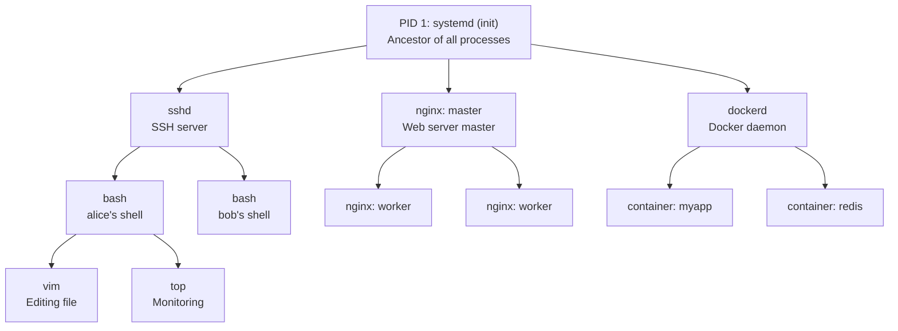
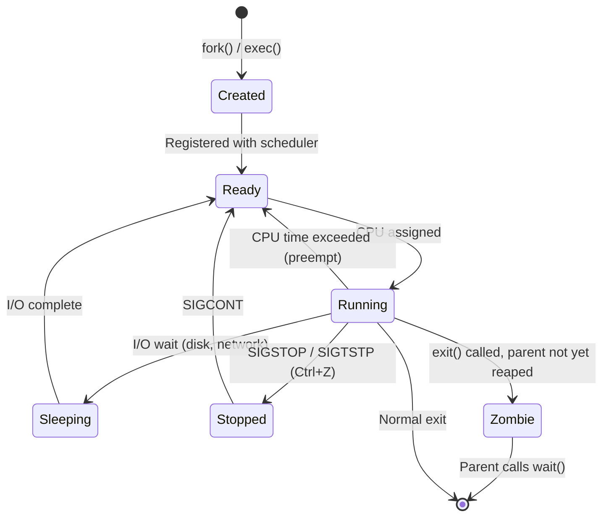
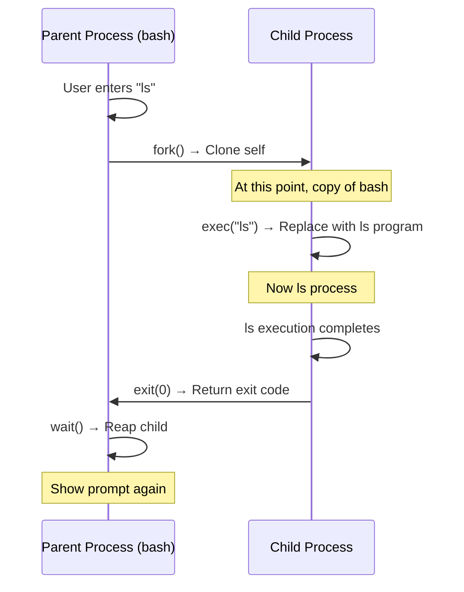
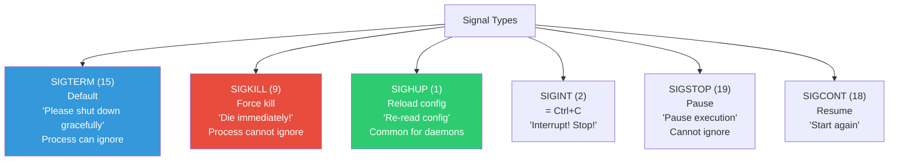
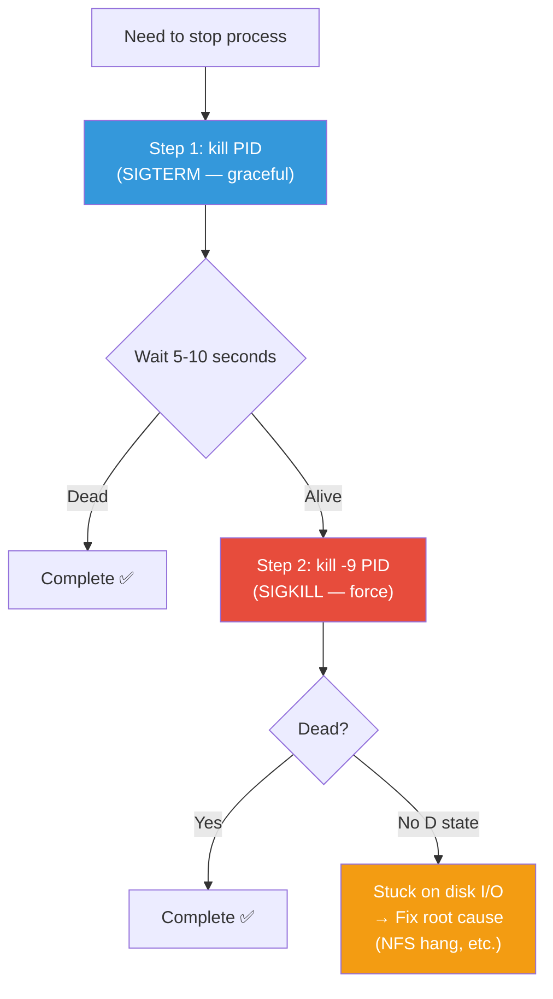
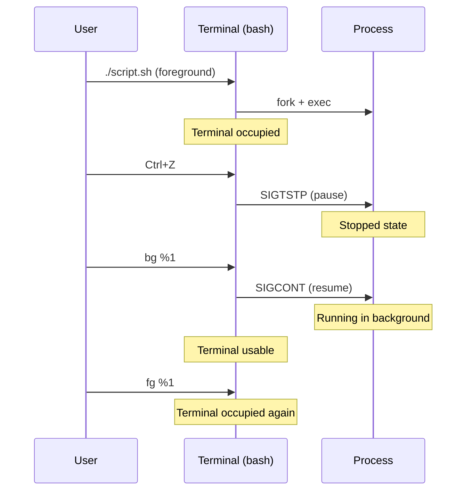
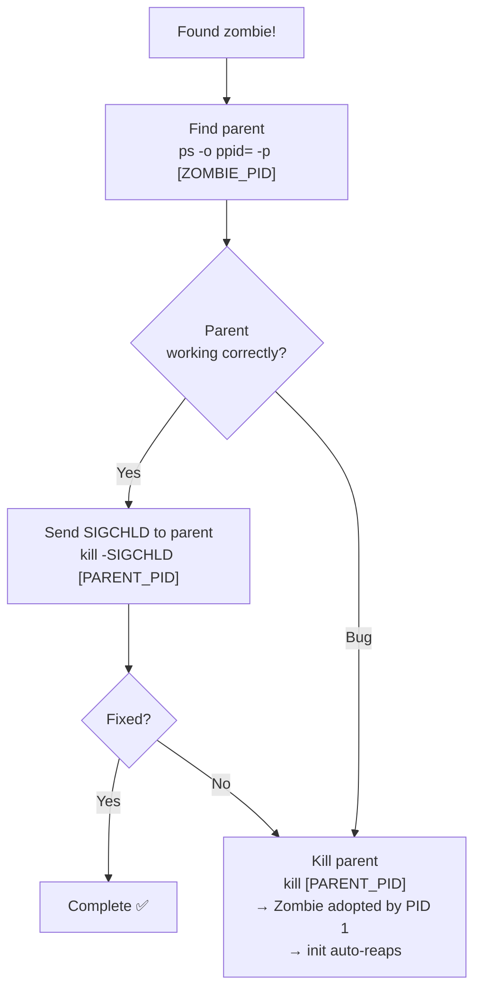

# Linux Process Management (Process Lifecycle / Signals)

> Every program running on a server is a "process". When a process stops, the service dies. When a process goes crazy, the server slows down. Handling processes is a fundamental DevOps survival skill.

---

## 🎯 Why Do You Need to Know This?

These situations happen weekly in production:

```
"Server suddenly got slow"             → Some process eating all CPU
"App isn't responding"                 → Process is hung
"Service won't start after deploy"     → Process dies immediately
"Memory usage keeps growing"           → Process has memory leak
"There are 1000 zombie processes"      → Child processes not cleaned up
```

Understanding processes means you'll know immediately where to look in these situations.

---

## 🧠 Core Concepts

### Analogy: Restaurant Kitchen

Think of a restaurant kitchen:

* **Process** = A chef receiving an order and cooking. One unit of work executing a recipe (program).
* **PID** = Order number. Each dish (process) has a unique number.
* **Parent Process (PPID)** = The person who placed the order. Every dish is made because someone ordered it.
* **Shell** = Order counter. Where customers (users) place orders (commands).
* **Signal** = Chef-to-chef instruction. "Stop!", "Pause a moment!", "Wrap up!"

### Process Hierarchy

All processes in Linux are connected in **parent-child relationships**, like a family tree.



```bash
# View actual process tree
pstree -p
# systemd(1)─┬─sshd(800)─┬─sshd(1234)───bash(1235)───vim(1300)
#             │            └─sshd(1400)───bash(1401)───top(1500)
#             ├─nginx(900)─┬─nginx(901)
#             │             └─nginx(902)
#             ├─dockerd(1000)─┬─containerd-shim(1100)
#             │                └─containerd-shim(1200)
#             └─cron(500)

# View tree for specific process
pstree -p 800
```

---

## 🔍 Detailed Explanation

### Process Lifecycle

Processes are born, work, and die. Understanding this lets you diagnose problems.



**State Explanations:**

| State | `ps` Code | Meaning | Analogy |
|-------|-----------|---------|---------|
| Running | `R` | Executing on CPU | Chef actively cooking |
| Sleeping | `S` | Waiting for something (I/O, etc.) | Waiting for ingredients |
| Disk Sleep | `D` | Waiting for disk I/O (can't kill!) | Waiting for oven (can't interrupt) |
| Stopped | `T` | Paused | Chef taking a break |
| Zombie | `Z` | Finished but parent not cleaning up | Dish finished but no one taking it |

---

### fork() and exec() — How Processes Are Born

In Linux, new processes are always created by **cloning existing process (fork)** then **replacing with different program (exec)**.



```bash
# When you run a command in shell, this happens
ls -la
# 1. bash fork() → Creates child bash
# 2. Child exec("ls") → Becomes ls
# 3. ls finishes → exit
# 4. Parent bash wait() → Reaps child
# 5. Shows prompt again

# Check exit code of previous command
echo $?
# 0     ← Success
# 1     ← General error
# 127   ← Command not found
# 130   ← Killed by Ctrl+C
# 137   ← Killed by kill -9 (128 + 9)
```

---

### ps — View Process List

`ps` is the most basic process inspection command.

```bash
# Current terminal processes only
ps
#   PID TTY          TIME CMD
#  1235 pts/0    00:00:00 bash
#  1400 pts/0    00:00:00 ps

# All processes (most commonly used option)
ps aux
# USER       PID %CPU %MEM    VSZ   RSS TTY      STAT START   TIME COMMAND
# root         1  0.0  0.2 169608 11456 ?        Ss   Mar10   0:08 /sbin/init
# root       800  0.0  0.1  15432  5888 ?        Ss   Mar10   0:00 sshd: /usr/sbin/sshd
# www-data   901  0.0  0.3  55556 14336 ?        S    Mar10   0:15 nginx: worker process
# ubuntu    1235  0.0  0.1   8960  5120 pts/0    Ss   10:00   0:00 -bash
# root      2000  2.5  5.0 712344 204800 ?       Ssl  09:00   1:30 /usr/bin/dockerd
# mysql     3000  1.2 10.0 1234567 409600 ?      Ssl  Mar10  15:00 /usr/sbin/mysqld
# ubuntu    4000 99.0  0.1  10240  4096 pts/1    R+   10:30   5:00 python infinite_loop.py
```

**Column Meanings:**

| Column | Meaning | Watch When |
|--------|---------|-----------|
| USER | User running it | Check which account is running |
| PID | Process ID | Needed for kill |
| %CPU | CPU usage % | High = diagnose needed |
| %MEM | Memory usage % | High = suspect memory leak |
| VSZ | Virtual memory (KB) | Reference only |
| RSS | Actual memory (KB) | Real memory usage |
| STAT | Process state | R, S, D, Z, T, etc. |
| TIME | Cumulative CPU time | How long it's been running |
| COMMAND | Command executed | What the process does |

**Reading STAT Column:**

```
S    = Sleeping (I/O wait) — Normal
Ss   = Sleeping + session leader — Normal
R+   = Running + foreground — Executing
Ssl  = Sleeping + session leader + multi-thread — Normal
D    = Disk sleep — ⚠️ Stuck on I/O (can't kill)
Z    = Zombie — ⚠️ Uncleaned process
T    = Stopped — Paused

After first character:
s = session leader
l = multi-threaded
+ = foreground process group
< = high priority
N = low priority
```

```bash
# Commonly used ps combinations in production

# Sort by CPU usage (highest first)
ps aux --sort=-%cpu | head -10
# USER       PID %CPU %MEM    VSZ   RSS TTY      STAT START   TIME COMMAND
# ubuntu    4000 99.0  0.1  10240  4096 pts/1    R+   10:30   5:00 python infinite_loop.py
# root      2000  2.5  5.0 712344 204800 ?       Ssl  09:00   1:30 /usr/bin/dockerd
# mysql     3000  1.2 10.0 1234567 409600 ?      Ssl  Mar10  15:00 /usr/sbin/mysqld
# ...

# Sort by memory usage (highest first)
ps aux --sort=-%mem | head -10

# Find specific process
ps aux | grep nginx
# root       900  0.0  0.1  10564  5120 ?        Ss   Mar10   0:00 nginx: master process
# www-data   901  0.0  0.3  55556 14336 ?        S    Mar10   0:15 nginx: worker process
# www-data   902  0.0  0.3  55480 14208 ?        S    Mar10   0:14 nginx: worker process
# ubuntu    5000  0.0  0.0   6432   720 pts/0    S+   10:35   0:00 grep nginx
#                                                                    ^^^^^^^^^^^^
#                                                                    grep itself appears!

# Exclude grep from results
ps aux | grep [n]ginx
# Or
ps aux | grep nginx | grep -v grep
# Or (recommended)
pgrep -a nginx
# 900 nginx: master process /usr/sbin/nginx
# 901 nginx: worker process
# 902 nginx: worker process

# See parent-child relationships
ps -ef
# UID        PID  PPID  C STIME TTY          TIME CMD
# root         1     0  0 Mar10 ?        00:00:08 /sbin/init
# root       800     1  0 Mar10 ?        00:00:00 sshd
# root      1234   800  0 10:00 ?        00:00:00 sshd: ubuntu
# ubuntu    1235  1234  0 10:00 pts/0    00:00:00 -bash

# Find parent of specific PID
ps -o ppid= -p 1235
# 1234
```

---

### top / htop — Real-Time Monitoring

If `ps` is a snapshot, `top` is live CCTV.

```bash
# Run top
top

# Example output:
# top - 10:30:00 up 2 days,  3:15,  2 users,  load average: 1.50, 0.80, 0.60
# Tasks: 150 total,   2 running, 147 sleeping,   0 stopped,   1 zombie
# %Cpu(s): 25.0 us,  5.0 sy,  0.0 ni, 68.0 id,  1.0 wa,  0.0 hi,  1.0 si
# MiB Mem :   4096.0 total,    512.0 free,   2048.0 used,   1536.0 buff/cache
# MiB Swap:   2048.0 total,   2000.0 free,     48.0 used.   1800.0 avail Mem
#
#   PID USER      PR  NI    VIRT    RES    SHR S  %CPU  %MEM     TIME+ COMMAND
#  4000 ubuntu    20   0   10240   4096   2048 R  99.0   0.1   5:00.00 python
#  2000 root      20   0  712344 204800  40960 S   2.5   5.0   1:30.00 dockerd
#  3000 mysql     20   0 1234567 409600  20480 S   1.2  10.0  15:00.00 mysqld
#   901 www-data  20   0   55556  14336   8192 S   0.5   0.3   0:15.00 nginx
```

**Top Section Explanation:**

```
load average: 1.50, 0.80, 0.60
              ^^^^  ^^^^  ^^^^
              1min  5min  15min average

# On 4-core CPU:
# 1.50 → 37.5% core utilization (plenty of headroom)
# 4.00 → 100% core utilization (at limit)
# 8.00 → CPU queue forming (slowdown!)

# Rule of thumb: load average ÷ CPU cores
# < 0.7  → Headroom
# 0.7~1.0 → Healthy
# > 1.0  → Overloaded

# Check CPU core count
nproc
# 4
```

```
%Cpu(s): 25.0 us,  5.0 sy,  0.0 ni, 68.0 id,  1.0 wa,  0.0 hi,  1.0 si
         ^^^^^^    ^^^^^^            ^^^^^^    ^^^^^^
         user      system            idle      I/O wait

# us (user): Apps using CPU → High means app is busy
# sy (system): Kernel using CPU → High means many system calls
# id (idle): CPU idle → Higher is better
# wa (I/O wait): Waiting for disk → High means disk bottleneck!
```

**top Shortcuts (while running):**

| Key | Action |
|-----|--------|
| `1` | Split CPU display by core |
| `M` | Sort by memory |
| `P` | Sort by CPU (default) |
| `k` | Kill process (enter PID) |
| `u` | Show only specific user |
| `c` | Toggle full command path |
| `H` | Show threads |
| `q` | Quit |

#### htop — top's Better Version

```bash
# Install
sudo apt install htop    # Ubuntu/Debian
sudo yum install htop    # CentOS/RHEL

# Run
htop
```

Benefits of `htop` over `top`:
* Colorful UI with CPU/memory graphs
* Click to sort columns
* Process tree view (F5)
* Search/filter (F3, F4)
* Select multiple processes and kill together (Space → F9)

---

### kill — Send Signals to Processes

`kill` doesn't "kill" — it **sends signals to processes**.

#### Signal Types



**Complete Signal List:**

```bash
kill -l
#  1) SIGHUP       2) SIGINT       3) SIGQUIT      4) SIGILL
#  5) SIGTRAP      6) SIGABRT      7) SIGBUS       8) SIGFPE
#  9) SIGKILL     10) SIGUSR1     11) SIGSEGV     12) SIGUSR2
# 13) SIGPIPE     14) SIGALRM     15) SIGTERM     17) SIGCHLD
# 18) SIGCONT     19) SIGSTOP     20) SIGTSTP     ...
```

**Commonly Used in Production:**

| Signal | Number | Keyboard | Purpose | Can Process Ignore? |
|--------|--------|----------|---------|-------------------|
| SIGTERM | 15 | — | Graceful shutdown | ✅ Yes |
| SIGKILL | 9 | — | Force kill (last resort) | ❌ No |
| SIGINT | 2 | Ctrl+C | Interrupt (terminal) | ✅ Yes |
| SIGHUP | 1 | — | Reload config | ✅ Yes |
| SIGTSTP | 20 | Ctrl+Z | Pause (terminal) | ✅ Yes |
| SIGSTOP | 19 | — | Force pause | ❌ No |
| SIGCONT | 18 | — | Resume paused process | — |

#### kill Command Usage

```bash
# SIGTERM (15) — Graceful shutdown (always try this first!)
kill 4000
# Or
kill -15 4000
# Or
kill -SIGTERM 4000

# SIGKILL (9) — Force kill (only if SIGTERM doesn't work!)
kill -9 4000
# Or
kill -SIGKILL 4000

# SIGHUP (1) — Reload config (reload without restart)
kill -HUP 900     # Ask nginx master to reload config
# nginx will:
# 1. Read new config file
# 2. Create new worker processes
# 3. Gracefully close existing workers
# → Zero-downtime config update!

# Kill by name (when you don't know PID)
pkill nginx          # Send SIGTERM to nginx
pkill -9 nginx       # Force kill
pkill -u alice       # Kill all processes by user alice

# Exact name match
killall nginx

# Pattern match
pkill -f "python.*infinite_loop"   # Match full command
```

#### Process Termination Sequence (Production Best Practice)



```bash
# Production script: Safe process termination

# Step 1: SIGTERM
kill 4000
echo "Sent SIGTERM. Waiting 10 seconds..."

# Step 2: Wait
sleep 10

# Step 3: If still alive, SIGKILL
if kill -0 4000 2>/dev/null; then
    echo "Still alive. Sending SIGKILL."
    kill -9 4000
else
    echo "Graceful shutdown successful."
fi
```

---

### Foreground vs Background

```bash
# Foreground — Terminal occupied
./long_running_script.sh
# Terminal frozen. Cannot type other commands.
# Ctrl+C → Kill process
# Ctrl+Z → Pause process (Stopped)

# Background — Terminal free
./long_running_script.sh &
# [1] 5000    ← Job number 1, PID 5000
# Terminal remains usable

# List background jobs
jobs
# [1]+  Running                 ./long_running_script.sh &
# [2]-  Stopped                 vim config.yaml

# Foreground → Background switch
./long_running_script.sh     # Running...
# Ctrl+Z                     # Pause
# [1]+  Stopped
bg %1                        # Resume in background
# [1]+ ./long_running_script.sh &

# Background → Foreground switch
fg %1                        # Bring job 1 to foreground

# Keep running after SSH disconnect
nohup ./long_running_script.sh &
# nohup: ignoring input and appending output to 'nohup.out'
# [1] 5000
# → Process continues even if SSH disconnects
# → Output saved to nohup.out

# Or use disown
./long_running_script.sh &
disown %1    # Detach from current shell → survives SSH disconnect
```



---

### Zombie Processes

Child process finished but parent didn't reap it with `wait()`.

**Analogy:** Food is ready (child exits) but the server never picks it up. The table (PID) stays occupied.

```bash
# Find zombie processes
ps aux | grep Z
#   PID USER  ... STAT ...  COMMAND
# 6000 root  ...  Z   ...  [myapp] <defunct>
#                  ^                ^^^^^^^^^
#                  zombie!          "dead" marker

# Count zombies
ps aux | awk '$8 ~ /Z/ {count++} END {print count}'
# 3

# Or check in top
top
# Tasks: 150 total, 2 running, 147 sleeping, 0 stopped, 1 zombie
#                                                        ^^^^^^^^
```

**Handling Zombie Processes:**



```bash
# 1. Find zombie's parent
ps -o pid,ppid,stat,cmd -p 6000
#   PID  PPID STAT CMD
#  6000  5500    Z [myapp] <defunct>
# → Parent is PID 5500

# 2. Send SIGCHLD (tell parent to reap child)
kill -SIGCHLD 5500

# 3. If not fixed, kill parent
kill 5500
# → Zombie gets adopted by PID 1 (systemd)
# → systemd auto-reaps it
```

**Is Zombie Dangerous?**

Zombies themselves don't use CPU or memory. But they occupy PIDs, so if thousands accumulate, no new processes can be created.

---

### /proc/[PID] — Process Details

```bash
# If nginx master has PID 900

# Process status
cat /proc/900/status
# Name:   nginx
# Umask:  0022
# State:  S (sleeping)
# Tgid:   900
# Pid:    900
# PPid:   1
# Uid:    0       0       0       0
# Gid:    0       0       0       0
# Threads:        1
# VmPeak:   10564 kB
# VmRSS:     5120 kB

# Full command executed
cat /proc/900/cmdline | tr '\0' ' '
# nginx: master process /usr/sbin/nginx -g daemon on; master_process on;

# Open files
ls -la /proc/900/fd/
# lr-x------ 1 root root 64 ... 0 -> /dev/null
# l-wx------ 1 root root 64 ... 1 -> /var/log/nginx/access.log
# l-wx------ 1 root root 64 ... 2 -> /var/log/nginx/error.log
# lrwx------ 1 root root 64 ... 6 -> socket:[12345]
# → Shows files/sockets being used

# Environment variables
cat /proc/900/environ | tr '\0' '\n'
# PATH=/usr/local/sbin:/usr/local/bin:...
# HOME=/root
# ...

# Memory map
cat /proc/900/maps | head -10

# Resource limits
cat /proc/900/limits
# Limit                     Soft Limit  Hard Limit  Units
# Max open files            1024        1048576     files
# Max processes             7823        7823        processes
```

---

## 💻 Practice Exercises

### Exercise 1: Basic Process Exploration

```bash
# 1. My terminal's process
echo "My PID: $$"
echo "Parent PID: $PPID"

# 2. Total process count
ps aux | wc -l

# 3. Top 5 CPU consumers
ps aux --sort=-%cpu | head -6

# 4. Top 5 memory consumers
ps aux --sort=-%mem | head -6

# 5. Process tree
pstree -p | head -30

# 6. Specific process info
ps -fp $(pgrep -o sshd)
```

### Exercise 2: Signal Hands-On

```bash
# 1. Create test process
cat > /tmp/test_process.sh << 'EOF'
#!/bin/bash
echo "PID: $$"
echo "Started. Use Ctrl+C or kill to stop."

# SIGTERM handler
trap "echo '  Got SIGTERM! Cleaning up...'; sleep 2; echo 'Cleanup done. Exiting.'; exit 0" SIGTERM
# SIGHUP handler
trap "echo '  Got SIGHUP! Reloading config.'" SIGHUP
# SIGINT handler (Ctrl+C)
trap "echo '  Got SIGINT(Ctrl+C)! Exiting.'; exit 0" SIGINT

count=0
while true; do
    count=$((count + 1))
    echo "Working... ($count)"
    sleep 3
done
EOF
chmod +x /tmp/test_process.sh

# 2. Terminal 1: Run it
/tmp/test_process.sh
# PID: 7000
# Started. Use Ctrl+C or kill to stop.
# Working... (1)
# Working... (2)

# 3. Terminal 2: Send signals

# SIGHUP
kill -HUP 7000
# Terminal 1: "Got SIGHUP! Reloading config."

# SIGTERM
kill 7000
# Terminal 1: "Got SIGTERM! Cleaning up..."
#            "Cleanup done. Exiting."

# 4. Test SIGKILL
/tmp/test_process.sh &
# [1] 7100

kill -9 7100
# → Dies immediately (handlers don't run — no cleanup!)
# → This is why SIGKILL is last resort
```

### Exercise 3: Foreground/Background Switching

```bash
# 1. Run in foreground
sleep 300

# 2. Ctrl+Z to pause
# [1]+  Stopped                 sleep 300

# 3. Move to background
bg %1
# [1]+ sleep 300 &

# 4. List jobs
jobs
# [1]+  Running                 sleep 300 &

# 5. Bring back to foreground
fg %1

# 6. Ctrl+C to stop

# 7. Test nohup
nohup sleep 600 &
# [1] 8000
exit              # Close terminal
# Log back in
ps aux | grep "sleep 600"
# → Still running!
```

### Exercise 4: Create and Fix Zombies

```bash
# Script that creates a zombie
cat > /tmp/make_zombie.sh << 'EOF'
#!/bin/bash
echo "Parent PID: $$"

# Create child but don't wait for it
bash -c 'echo "Child PID: $$"; exit 0' &

echo "Child created, waiting 30 seconds without reaping..."
sleep 30
# → During these 30 seconds, child is zombie
echo "Parent exiting"
EOF
chmod +x /tmp/make_zombie.sh

# Run it
/tmp/make_zombie.sh &

# Check for zombie
sleep 2
ps aux | grep Z
# → Shows <defunct> = zombie!

# Parent exits → zombie auto-reaped by systemd
```

---

## 🏢 In Production

### Scenario 1: Server Got Slow — Find Culprit

```bash
# Step 1: Check overall system
top
# load average: 8.50, 7.20, 5.00  ← 4 cores but load 8.5? Overloaded!
# %Cpu(s): 95.0 us ← Apps using almost all CPU

# Step 2: Find CPU hog
ps aux --sort=-%cpu | head -5
#   PID USER     %CPU %MEM COMMAND
#  4000 ubuntu   98.0  0.1 python infinite_loop.py    ← Culprit!
#  2000 root      2.0  5.0 /usr/bin/dockerd

# Step 3: Investigate the process
cat /proc/4000/cmdline | tr '\0' ' '
# python /home/ubuntu/infinite_loop.py

ls -la /proc/4000/cwd
# /home/ubuntu/project    ← Working directory

cat /proc/4000/status | grep -E "Name|State|Threads|VmRSS"
# Name:   python
# State:  R (running)
# Threads:        1
# VmRSS:     4096 kB

# Step 4: Take action
kill 4000         # Try SIGTERM first
sleep 5
kill -9 4000      # Force kill if needed
```

### Scenario 2: D State (Uninterruptible Sleep) Process

```bash
# D state can't be killed, even with kill -9!
ps aux | grep " D "
#  PID USER   STAT COMMAND
# 9000 root     D  /usr/bin/rsync -a /mnt/nfs/...

# D = stuck on I/O (disk, network)
# Usually caused by NFS hang, disk failure

# Check what it's waiting for
cat /proc/9000/wchan
# nfs_wait_on_request    ← NFS not responding

# Solution: Fix the root cause, not the process
# 1. Check NFS server
# 2. Check network
# 3. Last resort: lazy unmount
sudo umount -l /mnt/nfs
```

### Scenario 3: Zero-Downtime Nginx Config Reload

```bash
# Instead of restart (brief outage), use SIGHUP (graceful)

# 1. Edit config
sudo vim /etc/nginx/nginx.conf

# 2. Test syntax first!
sudo nginx -t
# nginx: the configuration file /etc/nginx/nginx.conf syntax is ok
# nginx: configuration file /etc/nginx/nginx.conf test is successful

# 3. Zero-downtime reload
sudo kill -HUP $(cat /var/run/nginx.pid)
# Or
sudo nginx -s reload
# Or
sudo systemctl reload nginx

# What happens:
# 1. Master re-reads config
# 2. Spawns new workers with new config
# 3. Old workers finish current requests then exit
# → Clients never notice!
```

### Scenario 4: App Dies on Startup — Find Why

```bash
# App starts then immediately dies

# 1. Check recent kernel messages
dmesg | grep -i "killed\|oom" | tail -5
# [12345.678] Out of memory: Killed process 5000 (myapp)
# → OOM Killer terminated it for memory shortage!

# 2. Track resource usage
pidstat -p $(pgrep myapp) 1
# 10:30:01   UID  PID    %usr  %system  %guest  %CPU   Command
# 10:30:02  1000  5000   45.0     5.0     0.0   50.0   myapp
# 10:30:03  1000  5000   48.0     6.0     0.0   54.0   myapp

# 3. Memory trend
while true; do
    ps -o pid,rss,vsz,cmd -p $(pgrep myapp) 2>/dev/null
    sleep 5
done
# RSS climbing steadily? Memory leak!

# 4. If systemd service, check logs
journalctl -u myapp --since "1 hour ago" | tail -30
```

---

## ⚠️ Common Mistakes

### 1. Blindly Using kill -9

```bash
# ❌ SIGKILL prevents cleanup
kill -9 5000
# → Temp files not deleted
# → DB connections not closed
# → Logs not flushed
# → Lock files not removed (next startup fails)

# ✅ SIGTERM first, then SIGKILL
kill 5000
sleep 5
kill -0 5000 2>/dev/null && kill -9 5000
```

### 2. Trusting PID Files Blindly

```bash
# ❌ PID file might be stale
kill $(cat /var/run/nginx.pid)
# → Old process exits, PID freed
# → Different process gets that PID!
# → You kill the wrong thing!

# ✅ Verify PID + process name
PID=$(cat /var/run/nginx.pid)
if ps -p $PID -o comm= | grep -q nginx; then
    kill $PID
else
    echo "PID $PID is not nginx!"
fi

# Or use name-based (safer)
pkill nginx
```

### 3. Panic When Ctrl+C Doesn't Work

```bash
# Some processes ignore SIGINT (Ctrl+C)

# Methods:
# 1. Try Ctrl+\ (SIGQUIT — creates core dump)
# 2. Kill from different terminal
# 3. Ctrl+Z (pause) → kill %1 from different terminal
```

### 4. Forgetting nohup for Long-Running Tasks

```bash
# ❌ SSH disconnects = process dies
./long_script.sh &
exit    # → long_script.sh dies too

# ✅ Survive SSH disconnect
nohup ./long_script.sh &
# Or
./long_script.sh &
disown %1
# Or (best) use tmux/screen
```

### 5. Trying to kill Zombies

```bash
# ❌ Zombie is already dead, kill doesn't help
kill -9 6000    # Effects nothing

# ✅ Kill parent (zombie gets adopted → auto-reaped)
PPID=$(ps -o ppid= -p 6000)
kill $PPID
```

---

## 📝 Summary

### Process States at a Glance

```
R (Running)  — Executing → Normal
S (Sleeping) — Waiting → Normal
D (Disk)     — I/O stuck → kill -9 won't work! Fix cause
T (Stopped)  — Paused → Resume with SIGCONT
Z (Zombie)   — Dead but not reaped → Fix parent
```

### Signal Cheat Sheet

```
kill PID           → SIGTERM (15) — Graceful (always try first!)
kill -9 PID        → SIGKILL (9)  — Force (last resort)
kill -HUP PID      → SIGHUP (1)   — Config reload
Ctrl+C             → SIGINT (2)   — Interrupt
Ctrl+Z             → SIGTSTP (20) — Pause
```

### Essential Commands

```bash
ps aux                    # All processes
ps aux --sort=-%cpu       # By CPU
ps aux --sort=-%mem       # By memory
pgrep -a [name]           # Search by name
top / htop                # Real-time
pstree -p                 # Tree view
kill / pkill / killall    # Send signals
jobs / bg / fg            # Job control
nohup [cmd] &             # Survive disconnects
```

---

## 🔗 Next Lesson

Next is **[01-linux/05-systemd.md — systemd and Service Management](./05-systemd)**.

Managing processes manually has limits. "Restart Nginx if it crashes", "Start this service on boot" — that's what systemd does. It's the core of modern Linux service management.
