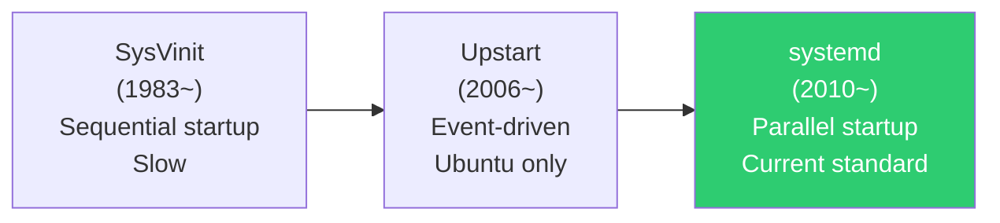
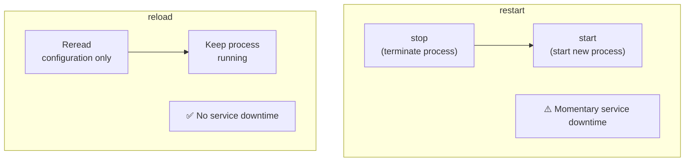
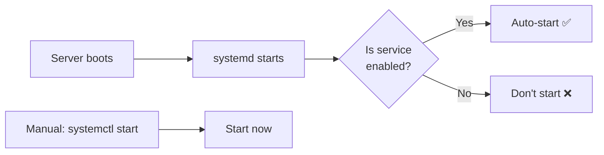
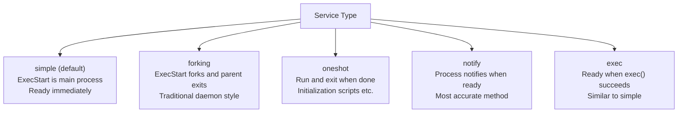
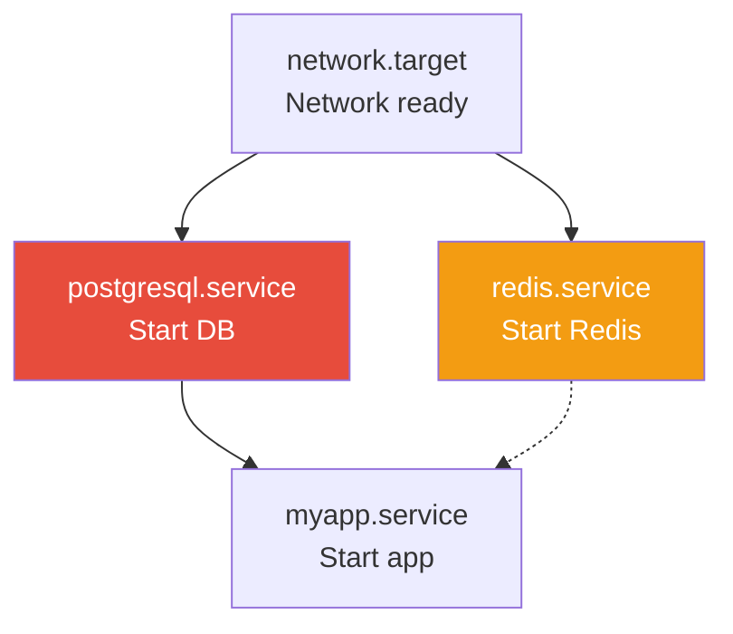

# systemd and Service Management

> "We rebooted the server and Nginx won't start", "Can the app automatically restart if it crashes?" — systemd solves these problems. It's the core system for managing services in modern Linux.

---

## 🎯 Why Do You Need to Know This?

It's daily work in DevOps operations.

```
"Please restart Nginx"                  → systemctl restart nginx
"Start the app automatically on boot"   → systemctl enable myapp
"Restart the app if it crashes"         → Restart=always configuration
"Why won't the service start?"          → systemctl status + journalctl
"Register our app as a system service"  → Write a .service file
```

Without systemd knowledge, you need to ask someone else just to restart a service. With it, you can manage service lifecycle yourself.

---

## 🧠 Core Concepts

### Analogy: Building Management System

Think of an apartment building's automated management system.

* **systemd** = Central building management system. Manages power, water, elevators, and security for everything
* **Service** = Each facility. Elevators, boilers, CCTV, etc.
* **Unit** = Individual managed objects. Not just services, but also timers, sockets, mounts, etc.
* **systemctl** = The remote control administrators use. "Turn on elevator", "Check boiler status", etc.

This management system:
* When building power comes on (boot), it starts necessary facilities in order
* If a facility fails (process crashes), it automatically restarts it
* If one facility depends on another (DB → App), it manages the order

### History of init Systems



Currently, most Linux distributions (Ubuntu, CentOS, Debian, Fedora, RHEL) use systemd.

```bash
# Check current init system
ps -p 1 -o comm=
# systemd

# Check systemd version
systemd --version
# systemd 249 (249.11-0ubuntu3)
```

---

## 🔍 Detailed Explanation

### Unit Types

The objects that systemd manages are called **Units**. It doesn't just manage services.

| Unit Type | Extension | Role | Examples |
|-----------|-----------|------|----------|
| Service | `.service` | Process/daemon management | nginx.service, docker.service |
| Timer | `.timer` | Scheduled tasks (cron replacement) | backup.timer |
| Socket | `.socket` | Socket activation | docker.socket |
| Mount | `.mount` | Filesystem mounting | home.mount |
| Target | `.target` | Unit groups (runlevels) | multi-user.target |
| Path | `.path` | File/directory monitoring | myapp-config.path |
| Slice | `.slice` | Resource groups (cgroup) | user.slice |

In practice, you'll work with `.service` and `.timer` 95% of the time.

---

### systemctl — Service Management Remote Control

#### Basic Commands

```bash
# Start service
sudo systemctl start nginx

# Stop service
sudo systemctl stop nginx

# Restart service (stop → start)
sudo systemctl restart nginx

# Reload service (reread configuration, keep process alive)
sudo systemctl reload nginx

# Reload or restart (reload if possible, otherwise restart)
sudo systemctl reload-or-restart nginx
```

**restart vs reload:**



```bash
# Nginx example
# reload: Master process reads new config, creates new workers, old workers terminate gracefully
# → No client disconnections!

# restart: All processes die and restart
# → Momentary unavailability

# Conclusion: Try reload first when changing configuration!
sudo systemctl reload nginx
```

#### Automatic Startup on Boot

```bash
# Enable automatic startup on boot
sudo systemctl enable nginx
# Created symlink /etc/systemd/system/multi-user.target.wants/nginx.service
#                 → /lib/systemd/system/nginx.service

# Disable automatic startup
sudo systemctl disable nginx
# Removed /etc/systemd/system/multi-user.target.wants/nginx.service

# Enable + start immediately (one command)
sudo systemctl enable --now nginx

# Disable + stop immediately (one command)
sudo systemctl disable --now nginx

# Check if automatic startup is enabled
systemctl is-enabled nginx
# enabled
```



#### Check Service Status

```bash
systemctl status nginx
# ● nginx.service - A high performance web server and a reverse proxy server
#      Loaded: loaded (/lib/systemd/system/nginx.service; enabled; vendor preset: enabled)
#      Active: active (running) since Wed 2025-03-12 09:00:00 UTC; 5h ago
#        Docs: man:nginx(8)
#     Process: 850 ExecStartPre=/usr/sbin/nginx -t -q -g daemon on; master_process on; (code=exited, status=0/SUCCESS)
#    Main PID: 900 (nginx)
#       Tasks: 3 (limit: 4915)
#      Memory: 8.5M
#         CPU: 150ms
#      CGroup: /system.slice/nginx.service
#              ├─900 "nginx: master process /usr/sbin/nginx -g daemon on; master_process on;"
#              ├─901 "nginx: worker process"
#              └─902 "nginx: worker process"
#
# Mar 12 09:00:00 server01 systemd[1]: Starting A high performance web server...
# Mar 12 09:00:00 server01 systemd[1]: Started A high performance web server.
```

**Output Explanation:**

```
● (green dot)    → Running normally
● (red dot)      → Failed/abnormal
○ (white dot)    → Inactive (stopped)

Loaded: loaded (/lib/systemd/system/nginx.service; enabled; ...)
        ^^^^^^^  ^^^^^^^^^^^^^^^^^^^^^^^^^^^^^^^^^^^^^  ^^^^^^^
        Success  Unit file path                         Auto-start on boot

Active: active (running) since Wed 2025-03-12 09:00:00 UTC; 5h ago
        ^^^^^^^^^^^^^^^^
        Status: running

Main PID: 900 (nginx)    → Main process PID
Tasks: 3                 → Number of threads/processes
Memory: 8.5M             → Memory usage
CPU: 150ms               → Cumulative CPU time
CGroup: ...              → Process tree
```

**Active Status Types:**

| Status | Meaning |
|--------|---------|
| `active (running)` | Running normally |
| `active (exited)` | Completed execution (oneshot type) |
| `active (waiting)` | Waiting for events |
| `inactive (dead)` | Stopped |
| `failed` | Failed (error occurred) |
| `activating` | Starting up |
| `deactivating` | Stopping |

#### View Service List

```bash
# Running services only
systemctl list-units --type=service --state=running
# UNIT                     LOAD   ACTIVE SUB     DESCRIPTION
# docker.service           loaded active running Docker Application Container Engine
# nginx.service            loaded active running A high performance web server
# sshd.service             loaded active running OpenBSD Secure Shell server
# systemd-journald.service loaded active running Journal Service
# ...

# Find failed services (diagnose issues first!)
systemctl list-units --type=service --state=failed
# UNIT              LOAD   ACTIVE SUB    DESCRIPTION
# myapp.service     loaded failed failed My Application
# 0 loaded units listed.

# Or simply
systemctl --failed
#   UNIT              LOAD   ACTIVE SUB    DESCRIPTION
# ● myapp.service     loaded failed failed My Application

# All services (active + inactive)
systemctl list-units --type=service --all

# Services enabled to start on boot
systemctl list-unit-files --type=service --state=enabled
# UNIT FILE                  STATE   VENDOR PRESET
# docker.service             enabled enabled
# nginx.service              enabled enabled
# sshd.service               enabled enabled
```

---

### Unit File Structure (.service)

A unit file is the "instruction manual" for a service. It defines how to start it, when to restart it, and under what conditions to run it.

#### Unit File Locations

```bash
# System defaults (installed by packages) — Don't edit these!
/lib/systemd/system/

# Created/modified by administrators — Create files here!
/etc/systemd/system/

# Runtime (temporary, disappears after reboot)
/run/systemd/system/

# Priority: /etc > /run > /lib
# → If a file with the same name exists in /etc, it takes priority over /lib
```

```bash
# Check a service's unit file location
systemctl show nginx.service -p FragmentPath
# FragmentPath=/lib/systemd/system/nginx.service

# View unit file contents
systemctl cat nginx.service
# Or
cat /lib/systemd/system/nginx.service
```

#### Unit File Structure Explained

```ini
# /etc/systemd/system/myapp.service

#==========================================================
# [Unit] section: What this service "is" and "when it starts"
#==========================================================
[Unit]
# Service description
Description=My Application Server

# Documentation link (optional)
Documentation=https://myapp.example.com/docs

# Dependencies: Start after these services
After=network.target docker.service postgresql.service

# Hard dependency: Don't start without this
Requires=postgresql.service

# Soft dependency: Nice to have but not required
Wants=redis.service

#==========================================================
# [Service] section: "How to run it"
#==========================================================
[Service]
# Service type
Type=simple

# User/group to run as
User=myapp
Group=myapp

# Working directory
WorkingDirectory=/opt/myapp

# Environment variables
Environment=NODE_ENV=production
Environment=PORT=3000
# Or read from environment file
EnvironmentFile=/opt/myapp/.env

# Command to run before startup
ExecStartPre=/usr/bin/echo "Starting myapp..."

# Main execution command
ExecStart=/usr/bin/node /opt/myapp/server.js

# Reload command (executed on systemctl reload)
ExecReload=/bin/kill -HUP $MAINPID

# Stop command (optional, sends SIGTERM if not specified)
ExecStop=/bin/kill -SIGTERM $MAINPID

# ⭐ Restart policy
Restart=always
RestartSec=5

# Startup timeout (fail if doesn't start within this time)
TimeoutStartSec=30

# Stop timeout (force kill if doesn't stop within this time)
TimeoutStopSec=30

# Resource limits
LimitNOFILE=65536
LimitNPROC=4096

# Logging configuration
StandardOutput=journal
StandardError=journal
SyslogIdentifier=myapp

#==========================================================
# [Install] section: "How to enable on boot"
#==========================================================
[Install]
# When enabled, link to this target
WantedBy=multi-user.target
```

#### Service Type Kinds



| Type | Use Case | Examples |
|------|----------|----------|
| `simple` | Most applications | Node.js, Python, Go apps |
| `forking` | Traditional daemons (fork then parent exits) | Nginx (PIDFile required), Apache |
| `oneshot` | One-time tasks | Initialization scripts, DB migrations |
| `notify` | Apps that directly report readiness | Apps with systemd notification support |

```bash
# Nginx's actual unit file (forking type)
systemctl cat nginx.service
# [Service]
# Type=forking
# PIDFile=/run/nginx.pid
# ExecStartPre=/usr/sbin/nginx -t -q -g 'daemon on;'
# ExecStart=/usr/sbin/nginx -g 'daemon on;'
# ExecReload=/bin/kill -s HUP $MAINPID
# ExecStop=-/sbin/start-stop-daemon --quiet --stop --retry QUIT/5 --pidfile /run/nginx.pid

# Docker's actual unit file (notify type)
systemctl cat docker.service
# [Service]
# Type=notify
# ExecStart=/usr/bin/dockerd -H fd://
# ExecReload=/bin/kill -s HUP $MAINPID
# Restart=always
# RestartSec=2
```

#### Restart Policy

```bash
# Restart options and behavior

# always — Restart no matter what (most common)
Restart=always

# on-failure — Restart only on error (exit code ≠ 0)
Restart=on-failure

# on-abnormal — Restart only on signal/timeout
Restart=on-abnormal

# no — Don't restart (default)
Restart=no
```

| Exit Reason | `always` | `on-failure` | `on-abnormal` | `no` |
|-----------|----------|-------------|---------------|------|
| Clean exit (exit 0) | ✅ Restart | ❌ | ❌ | ❌ |
| Error exit (exit 1) | ✅ Restart | ✅ Restart | ❌ | ❌ |
| Signal (SIGKILL etc.) | ✅ Restart | ✅ Restart | ✅ Restart | ❌ |
| Timeout | ✅ Restart | ✅ Restart | ✅ Restart | ❌ |

```bash
# Configure restart interval
RestartSec=5          # Restart after 5 seconds

# Restart limits (prevent infinite restarts)
StartLimitIntervalSec=300   # Within 300 seconds (5 minutes)
StartLimitBurst=5           # Allow up to 5 restarts
# → If more than 5 restarts in 5 minutes, stop restarting
```

---

### Dependency Management (After, Requires, Wants)

Define service startup order and interdependencies.



```ini
[Unit]
# After: Define startup order (start after these)
After=network.target postgresql.service redis.service

# Requires: Hard dependency (this stops when dependency stops)
Requires=postgresql.service
# → If postgresql stops, myapp also stops

# Wants: Soft dependency (continues even if dependency not available)
Wants=redis.service
# → myapp starts even without redis (can function without cache)
```

```bash
# Check dependencies
systemctl list-dependencies nginx.service
# nginx.service
# ● ├─system.slice
# ● ├─sysinit.target
# ● │ ├─dev-hugepages.mount
# ● │ ├─dev-mqueue.mount
# ...

# Reverse dependencies (what depends on this service)
systemctl list-dependencies nginx.service --reverse
```

---

### Editing Existing Unit Files (Override)

If you directly edit `/lib/systemd/system/` files installed by packages, they'll be overwritten on package updates. Use **override** instead.

```bash
# Create override file (opens editor)
sudo systemctl edit nginx.service
# → Creates /etc/systemd/system/nginx.service.d/override.conf

# Override content example (override only desired sections)
[Service]
# Add memory limit
MemoryMax=512M
# Change restart policy
Restart=always
RestartSec=10
# Add environment variable
Environment=WORKER_PROCESSES=4
```

```bash
# If you want to replace entire unit file
sudo systemctl edit --full nginx.service
# → Creates /etc/systemd/system/nginx.service (full copy)

# View override
systemctl cat nginx.service
# Shows original content + override content together

# Delete override
sudo rm -rf /etc/systemd/system/nginx.service.d/
sudo systemctl daemon-reload
```

---

### daemon-reload — Apply Unit File Changes

After modifying unit files, you must run `daemon-reload` for systemd to recognize changes.

```bash
# ⚠️ After modifying unit files, always run this!
sudo systemctl daemon-reload

# Then restart the service
sudo systemctl restart myapp.service

# What happens if you don't daemon-reload?
# Warning: The unit file, source configuration file or drop-ins of myapp.service
# changed on disk. Run 'systemctl daemon-reload' to reload units.
```

---

### journalctl — View Service Logs

systemd manages all service logs through a unified system called **journal**.

```bash
# Specific service logs (most common!)
journalctl -u nginx.service
# Mar 12 09:00:00 server01 systemd[1]: Starting A high performance web server...
# Mar 12 09:00:00 server01 nginx[900]: nginx: the configuration file syntax is ok
# Mar 12 09:00:00 server01 systemd[1]: Started A high performance web server.

# Recent logs only (last 50 lines)
journalctl -u nginx.service -n 50

# Real-time logs (like tail -f)
journalctl -u nginx.service -f
# → Shows new logs as they arrive (Ctrl+C to exit)

# Logs since specific time
journalctl -u myapp.service --since "2025-03-12 10:00:00"
journalctl -u myapp.service --since "1 hour ago"
journalctl -u myapp.service --since "today"
journalctl -u myapp.service --since "yesterday" --until "today"

# Error logs only (filter by priority)
journalctl -u myapp.service -p err
# priority types: emerg, alert, crit, err, warning, notice, info, debug

# Logs since last boot
journalctl -u myapp.service -b

# Output as JSON (for parsing)
journalctl -u myapp.service -o json-pretty | head -30

# Check journal disk usage
journalctl --disk-usage
# Archived and active journals take up 256.0M in the file system.

# Clean up old logs
sudo journalctl --vacuum-time=7d    # Delete logs older than 7 days
sudo journalctl --vacuum-size=500M  # Keep only 500MB
```

---

## 💻 Practice Exercises

### Exercise 1: Basic Service Status Check/Control

```bash
# 1. Check Nginx status
systemctl status nginx
# → Check active status, PID, memory, recent logs

# 2. Stop
sudo systemctl stop nginx
systemctl status nginx
# → Active: inactive (dead)

# 3. Start
sudo systemctl start nginx
systemctl status nginx
# → Active: active (running)

# 4. Restart (stop + start)
sudo systemctl restart nginx

# 5. Reload (keep process alive, just reload configuration)
sudo systemctl reload nginx

# 6. Check auto-start on boot
systemctl is-enabled nginx
# enabled

# 7. Disable auto-start
sudo systemctl disable nginx
systemctl is-enabled nginx
# disabled

# 8. Re-enable
sudo systemctl enable nginx
```

### Exercise 2: Create Custom Service (Simple Web Server)

```bash
# 1. Create simple app
sudo mkdir -p /opt/myapp
cat << 'EOF' | sudo tee /opt/myapp/server.sh
#!/bin/bash
echo "MyApp starting on port 8080..."
echo "PID: $$"

# Signal handler (graceful shutdown)
cleanup() {
    echo "Shutting down gracefully..."
    exit 0
}
trap cleanup SIGTERM SIGINT

# Simple HTTP server (Python)
python3 -m http.server 8080 &
CHILD_PID=$!

# Exit when child process dies
wait $CHILD_PID
EOF
sudo chmod +x /opt/myapp/server.sh

# 2. Create service user
sudo useradd -r -s /usr/sbin/nologin myapp

# 3. Create unit file
cat << 'EOF' | sudo tee /etc/systemd/system/myapp.service
[Unit]
Description=My Custom Application
After=network.target
Documentation=https://example.com

[Service]
Type=simple
User=myapp
Group=myapp
WorkingDirectory=/opt/myapp

ExecStart=/opt/myapp/server.sh

Restart=always
RestartSec=5

StandardOutput=journal
StandardError=journal
SyslogIdentifier=myapp

# Security hardening
NoNewPrivileges=true
ProtectSystem=strict
ProtectHome=true
ReadWritePaths=/opt/myapp

[Install]
WantedBy=multi-user.target
EOF

# 4. daemon-reload
sudo systemctl daemon-reload

# 5. Start service
sudo systemctl start myapp
systemctl status myapp
# ● myapp.service - My Custom Application
#    Active: active (running) since ...
#    Main PID: 12345 (server.sh)

# 6. Check logs
journalctl -u myapp -n 10
# Mar 12 10:30:00 server01 myapp[12345]: MyApp starting on port 8080...
# Mar 12 10:30:00 server01 myapp[12345]: PID: 12345
# Mar 12 10:30:00 server01 myapp[12345]: Serving HTTP on 0.0.0.0 port 8080

# 7. Test access
curl http://localhost:8080

# 8. Enable auto-start on boot
sudo systemctl enable myapp

# 9. Cleanup (after practice)
sudo systemctl disable --now myapp
sudo rm /etc/systemd/system/myapp.service
sudo systemctl daemon-reload
sudo userdel myapp
sudo rm -rf /opt/myapp
```

### Exercise 3: Test Auto-Restart

```bash
# 1. Check myapp status (should be running from exercise 2)
systemctl status myapp
# Main PID: 12345

# 2. Force kill the process
sudo kill -9 12345

# 3. Check after 5 seconds for auto-restart
sleep 6
systemctl status myapp
# Active: active (running)
# Main PID: 12400    ← PID changed! Restarted with new process

# 4. Check restart record
journalctl -u myapp --since "2 minutes ago"
# ... myapp.service: Main process exited, code=killed, status=9/KILL
# ... myapp.service: Failed with result 'signal'.
# ... myapp.service: Scheduled restart job, restart counter is at 1.
# ... myapp.service: Started My Custom Application.
```

### Exercise 4: Unit File Override

```bash
# 1. Add memory limit to Nginx via override
sudo systemctl edit nginx.service

# Type in editor:
# [Service]
# MemoryMax=256M

# 2. Apply
sudo systemctl daemon-reload
sudo systemctl restart nginx

# 3. Verify
systemctl show nginx.service | grep MemoryMax
# MemoryMax=268435456    ← 256MB

# 4. Check override file location
ls -la /etc/systemd/system/nginx.service.d/
# override.conf

cat /etc/systemd/system/nginx.service.d/override.conf
# [Service]
# MemoryMax=256M

# 5. Cleanup
sudo rm -rf /etc/systemd/system/nginx.service.d/
sudo systemctl daemon-reload
sudo systemctl restart nginx
```

### Exercise 5: Practical journalctl Usage

```bash
# 1. Find failed services
systemctl --failed

# 2. View error logs for specific service
journalctl -u myapp -p err --since "today"

# 3. View logs from multiple services simultaneously
journalctl -u nginx -u myapp -f

# 4. View logs for specific PID
journalctl _PID=12345

# 5. Check kernel messages (OOM Killer etc.)
journalctl -k | grep -i "oom\|killed"

# 6. List boots
journalctl --list-boots
#  0 abc123 Wed 2025-03-12 09:00:00 — Wed 2025-03-12 14:30:00
# -1 def456 Tue 2025-03-11 08:00:00 — Tue 2025-03-11 23:59:59

# 7. View logs from previous boot
journalctl -b -1
```

---

## 🏢 Real-World Scenarios

### Scenario 1: App Won't Start After Deployment

```bash
# 1. Check status
systemctl status myapp
# ● myapp.service - My Application
#    Active: failed (Result: exit-code) since ...
#    Process: 5000 ExecStart=/opt/myapp/start.sh (code=exited, status=1/FAILURE)

# 2. Check logs (identify root cause)
journalctl -u myapp -n 30
# Mar 12 10:30:00 server01 myapp[5000]: Error: Cannot find module 'express'
# → node_modules missing!

# 3. Fix the issue
cd /opt/myapp && npm install

# 4. Start again
sudo systemctl start myapp
systemctl status myapp
# Active: active (running)

# 5. Reset failure counter (if stuck due to repeated failures)
sudo systemctl reset-failed myapp
```

### Scenario 2: Real Production Service Unit File

```ini
# /etc/systemd/system/production-api.service
# Production setup structure

[Unit]
Description=Production API Server
After=network-online.target postgresql.service
Wants=network-online.target
Requires=postgresql.service

[Service]
Type=simple
User=api
Group=api
WorkingDirectory=/opt/api

# Environment file (secrets etc.)
EnvironmentFile=/opt/api/.env

ExecStartPre=/opt/api/healthcheck-deps.sh
ExecStart=/opt/api/bin/server
ExecReload=/bin/kill -HUP $MAINPID

# Restart policy
Restart=always
RestartSec=5
StartLimitIntervalSec=300
StartLimitBurst=5

# Timeouts
TimeoutStartSec=60
TimeoutStopSec=30

# Resource limits
LimitNOFILE=65536
LimitNPROC=4096
MemoryMax=1G

# Security hardening
NoNewPrivileges=true
ProtectSystem=strict
ProtectHome=true
PrivateTmp=true
ReadWritePaths=/opt/api/logs /opt/api/tmp

# Logging
StandardOutput=journal
StandardError=journal
SyslogIdentifier=production-api

[Install]
WantedBy=multi-user.target
```

```bash
# Security hardening options explained:
# NoNewPrivileges=true  → Process cannot gain higher privileges
# ProtectSystem=strict  → Mount entire / as read-only
# ProtectHome=true      → Block access to /home, /root, /run/user
# PrivateTmp=true       → Isolate /tmp from other services
# ReadWritePaths=...    → Only these paths are writable
```

### Scenario 3: Zero-Downtime Deployment

```bash
# Graceful restart deployment script example

#!/bin/bash
set -e

echo "=== Deployment Start ==="

# 1. Deploy new code
cd /opt/api
git pull origin main

# 2. Install dependencies
npm install --production

# 3. Database migrations
npm run migrate

# 4. Graceful restart
# → Try reload first, then restart if needed
sudo systemctl reload-or-restart production-api

# 5. Verify status
sleep 3
if systemctl is-active production-api; then
    echo "=== Deployment Successful ==="
else
    echo "=== Deployment Failed! Rollback Required ==="
    journalctl -u production-api -n 20
    exit 1
fi
```

### Scenario 4: Resolve Service Boot Order Issues

```bash
# Problem: App starts before DB and gets connection errors

# Check logs
journalctl -u myapp -b
# Error: Connection refused to postgresql:5432
# → DB not ready yet when app started

# Solution: Add dependency to unit file
sudo systemctl edit myapp.service
# [Unit]
# After=postgresql.service
# Requires=postgresql.service

sudo systemctl daemon-reload
sudo systemctl restart myapp

# Verify: Check startup sequence visualization
systemd-analyze plot > /tmp/boot-plot.svg
# → SVG file visualizes service startup order during boot
```

---

## ⚠️ Common Mistakes

### 1. Forgetting daemon-reload

```bash
# ❌ Restart immediately after editing unit file
sudo vim /etc/systemd/system/myapp.service
sudo systemctl restart myapp
# Warning: The unit file changed on disk. Run 'systemctl daemon-reload'.
# → Changes won't be applied!

# ✅ Always run daemon-reload first
sudo vim /etc/systemd/system/myapp.service
sudo systemctl daemon-reload       # ← Do this first!
sudo systemctl restart myapp
```

### 2. Directly Editing /lib/systemd/system/

```bash
# ❌ Package updates will overwrite changes
sudo vim /lib/systemd/system/nginx.service

# ✅ Use override instead
sudo systemctl edit nginx.service
# Changes saved to /etc/systemd/system/nginx.service.d/override.conf
```

### 3. Wrong Service Type

```bash
# ❌ Using Type=simple for a daemonizing app
# → systemd won't track the child process properly
# → Service appears to start but is actually not running correctly

[Service]
Type=simple               # Wrong!
ExecStart=/usr/sbin/nginx  # nginx forks and parent exits

# ✅ Use Type=forking for daemonizing apps
[Service]
Type=forking
PIDFile=/run/nginx.pid
ExecStart=/usr/sbin/nginx

# ✅ Or use foreground mode if supported (recommended)
[Service]
Type=simple
ExecStart=/usr/sbin/nginx -g 'daemon off;'
```

### 4. Using Shell Features in ExecStart

```bash
# ❌ Pipes, redirections, variable expansion don't work
[Service]
ExecStart=/opt/myapp/start.sh | tee /var/log/myapp.log    # ❌ Pipes don't work
ExecStart=/opt/myapp/start.sh > /var/log/myapp.log         # ❌ Redirection doesn't work

# ✅ Explicitly invoke shell if needed
[Service]
ExecStart=/bin/bash -c '/opt/myapp/start.sh | tee /var/log/myapp.log'

# ✅ Or let journal handle logging (recommended)
[Service]
ExecStart=/opt/myapp/start.sh
StandardOutput=journal
StandardError=journal
```

### 5. Service Stuck Due to Restart Limit

```bash
# Status shows restart limit reached
systemctl status myapp
# Active: failed (Result: start-limit-hit)
# → Too many restarts in short time, limit kicked in

# Solution: Reset failure counter
sudo systemctl reset-failed myapp
sudo systemctl start myapp

# Root cause fix: Investigate why it keeps crashing
journalctl -u myapp --since "10 minutes ago"
```

---

## 📝 Summary

### systemctl Cheat Sheet

```bash
# Service control
systemctl start [service]           # Start
systemctl stop [service]            # Stop
systemctl restart [service]         # Restart
systemctl reload [service]          # Reload config (no downtime)
systemctl reload-or-restart [service] # Try reload, fallback to restart

# Boot configuration
systemctl enable [service]          # Enable auto-start on boot
systemctl disable [service]         # Disable auto-start
systemctl enable --now [service]    # Enable + start now

# Status check
systemctl status [service]          # Detailed status
systemctl is-active [service]       # Is running? (for scripts)
systemctl is-enabled [service]      # Auto-start enabled? (for scripts)
systemctl --failed                  # List failed services

# Unit files
systemctl cat [service]             # View unit file
systemctl edit [service]            # Edit override
systemctl daemon-reload             # Apply file changes (essential!)
systemctl reset-failed [service]    # Reset failure counter

# Logs
journalctl -u [service]             # View service logs
journalctl -u [service] -f          # Real-time logs
journalctl -u [service] -n 50      # Last 50 lines
journalctl -u [service] -p err     # Errors only
journalctl -u [service] --since "1 hour ago"
```

### Unit File Core Structure

```
[Unit]
Description=Description
After=Dependencies (startup order)
Requires=Hard dependencies (must exist)
Wants=Soft dependencies (optional)

[Service]
Type=simple|forking|oneshot|notify
User=User to run as
ExecStart=Command to run
Restart=always|on-failure|no
RestartSec=Restart wait seconds

[Install]
WantedBy=multi-user.target
```

---

## 🔗 Next Lesson

Next is **[01-linux/06-cron.md — cron and Timers](./06-cron)**.

"Clean up logs every day at 3 AM", "Back up database every Monday", "Check server status every 5 minutes" — we'll learn how to automate these recurring tasks. We'll cover both traditional cron and modern systemd timers.
