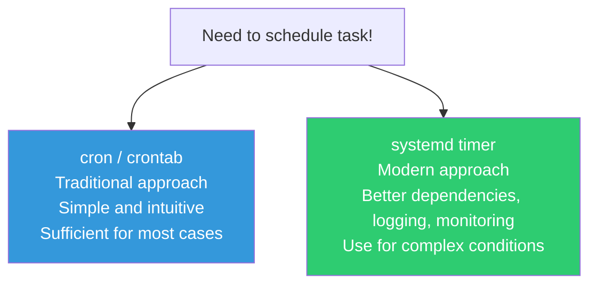
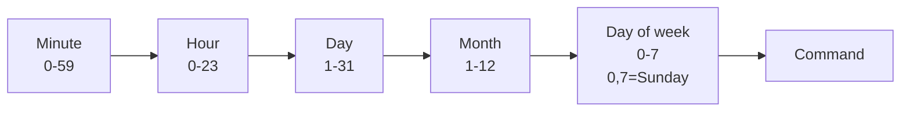
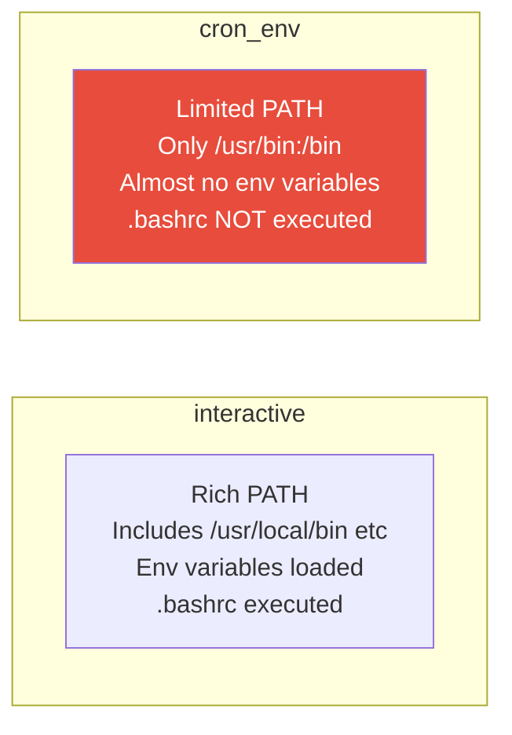

# cron and Timers (Scheduled Tasks)

> "Clean up logs at 3 AM every day", "Back up the database every Monday", "Check server status every 5 minutes" — doing these repetitive tasks manually results in mistakes and lost sleep. cron does it for you.

---

## 🎯 Why Do You Need to Know This?

Scheduled task automation is the foundation of DevOps.

```
Common scheduled tasks in real production:
• Log file cleanup/compression           → Every day early morning
• Database backups                       → Daily/weekly
• SSL certificate renewal checks         → Daily
• Disk space check + alerts              → Every hour
• Temporary file cleanup                 → Daily
• Monitoring data collection             → Every minute/5 minutes
• Old Docker image cleanup               → Weekly
• Security update checks                 → Daily
```

Without cron? You'd need to wake up at 3 AM every day to clean logs manually. cron never sleeps and never forgets.

---

## 🧠 Core Concepts

### Analogy: Programmable Alarm Clock

cron is a **programmable alarm clock**.

* Regular alarm: "Ring at 7 AM every day"
* cron: "Run this script at 3 AM every day"
* cron: "Run this backup command at midnight every Monday"
* cron: "Run server health check every 5 minutes"

### cron vs systemd timer

Two ways to schedule tasks.



| Comparison | cron | systemd timer |
|--------|------|---------------|
| Configuration difficulty | Easy (one line) | Complex (two files) |
| Logging | Requires separate setup | Automatic journalctl |
| Dependencies | None | After, Requires possible |
| Monitoring | Difficult | systemctl easy |
| Retry on failure | Not available | Configurable |
| Recommended for | Simple recurring tasks | Service integration, precise control |

**Real-world conclusion:** Simple tasks use cron, complex tasks use systemd timer. cron is enough for 80% of cases.

---

## 🔍 Detailed Explanation — cron

### crontab Basics

```bash
# View my crontab
crontab -l
# no crontab for ubuntu    ← None yet

# Edit my crontab
crontab -e
# (editor opens)

# View another user's crontab (root only)
sudo crontab -u deploy -l

# Delete my crontab (careful!)
crontab -r
```

### cron Expression (★ Core)

cron time expressions use 5 fields. This is essentially cron's entire syntax.

```
┌───────────── Minute (0-59)
│ ┌───────────── Hour (0-23)
│ │ ┌───────────── Day (1-31)
│ │ │ ┌───────────── Month (1-12)
│ │ │ │ ┌───────────── Day of week (0-7, 0 and 7 = Sunday)
│ │ │ │ │
│ │ │ │ │
* * * * *  command
```



### Special Characters

| Character | Meaning | Example |
|-----------|---------|---------|
| `*` | Every time | `* * * * *` = every minute |
| `,` | Multiple values | `1,15,30 * * * *` = at 1, 15, 30 minutes |
| `-` | Range | `9-17 * * * *` = 9 AM to 5 PM every hour |
| `/` | Interval | `*/5 * * * *` = every 5 minutes |

### Learning by Examples (Most Important!)

```bash
# ──────────────────────────────────
# Basic patterns
# ──────────────────────────────────

# Run every minute
* * * * *  /opt/scripts/check.sh

# Run every hour at :00
0 * * * *  /opt/scripts/hourly.sh

# Run every day at 3 AM
0 3 * * *  /opt/scripts/daily-backup.sh

# Run every day at midnight
0 0 * * *  /opt/scripts/midnight.sh

# ──────────────────────────────────
# Day of week / month specifications
# ──────────────────────────────────

# Every Monday at 9 AM
0 9 * * 1  /opt/scripts/weekly-report.sh

# Weekdays (Mon-Fri) at 9 AM
0 9 * * 1-5  /opt/scripts/weekday.sh

# Every Sunday at 2 AM
0 2 * * 0  /opt/scripts/sunday-cleanup.sh

# First day of month at 1 AM
0 1 1 * *  /opt/scripts/monthly.sh

# Quarterly (1st, 4th, 7th, 10th months) at 1 AM
0 1 1 1,4,7,10 *  /opt/scripts/quarterly.sh

# ──────────────────────────────────
# Intervals (/)
# ──────────────────────────────────

# Every 5 minutes
*/5 * * * *  /opt/scripts/every5min.sh

# Every 10 minutes
*/10 * * * *  /opt/scripts/every10min.sh

# Every 2 hours
0 */2 * * *  /opt/scripts/every2hours.sh

# Every 30 minutes
*/30 * * * *  /opt/scripts/every30min.sh

# ──────────────────────────────────
# Complex examples
# ──────────────────────────────────

# Weekdays 9 AM to 6 PM, every hour
0 9-18 * * 1-5  /opt/scripts/business-hours.sh

# Twice daily: 6 AM and 6 PM
0 6,18 * * *  /opt/scripts/twice-daily.sh

# 1st and 15th of each month at 3 AM
0 3 1,15 * *  /opt/scripts/bimonthly.sh
```

**Hard to remember?** Check here: https://crontab.guru

```bash
# Quick reference for common patterns

# Min Hour Day Month DOW   Meaning
  *   *    *    *     *     Every minute
  0   *    *    *     *     Every hour
  0   0    *    *     *     Every day midnight
  0   3    *    *     *     Every day at 3 AM
 */5  *    *    *     *     Every 5 minutes
  0  */2   *    *     *     Every 2 hours
  0   9    *    *    1-5    Weekdays at 9 AM
  0   2    *    *     0     Every Sunday at 2 AM
  0   1    1    *     *     Monthly at 1 AM
  0   0    1    1     *     Yearly at midnight Jan 1st
```

---

### crontab File Format

```bash
crontab -e
```

```bash
# /tmp/crontab.ubuntu (edited with crontab -e)

# ──────────────────────────────────
# Environment variables (set at top)
# ──────────────────────────────────
SHELL=/bin/bash
PATH=/usr/local/sbin:/usr/local/bin:/usr/sbin:/usr/bin:/sbin:/bin
MAILTO=admin@example.com    # Email errors here (empty = no email)

# ──────────────────────────────────
# Task list
# ──────────────────────────────────

# Every day at 3 AM — Clean logs
0 3 * * *  /opt/scripts/cleanup-logs.sh >> /var/log/cron-cleanup.log 2>&1

# Every day at 2 AM — Database backup
0 2 * * *  /opt/scripts/db-backup.sh >> /var/log/cron-backup.log 2>&1

# Every 5 minutes — Health check
*/5 * * * *  /opt/scripts/health-check.sh >> /var/log/cron-health.log 2>&1

# Every Sunday at 4 AM — Docker cleanup
0 4 * * 0  docker system prune -af >> /var/log/cron-docker.log 2>&1

# Monthly on 1st — SSL certificate renewal
0 1 1 * *  certbot renew --quiet >> /var/log/cron-certbot.log 2>&1
```

**What `>> /var/log/xxx.log 2>&1` means:**

```bash
>> /var/log/cron-backup.log    # Append standard output to log file
2>&1                           # Also include error output (2=stderr, 1=stdout)

# Without this:
# → cron tries to email output
# → If mail not configured, output disappears
# → You won't know if an error occurred!
```

---

### System cron (/etc/crontab, /etc/cron.d/)

Separate from user crontab, there's a system-wide scheduled task system.

```bash
# System crontab (has user field)
cat /etc/crontab
# SHELL=/bin/sh
# PATH=/usr/local/sbin:/usr/local/bin:/sbin:/bin:/usr/sbin:/usr/bin
#
# m h dom mon dow user  command
# 17 *  * * *  root  cd / && run-parts --report /etc/cron.hourly
# 25 6  * * *  root  test -x /usr/sbin/anacron || { cd / && run-parts --report /etc/cron.daily; }
# 47 6  * * 7  root  test -x /usr/sbin/anacron || { cd / && run-parts --report /etc/cron.weekly; }
# 52 6  1 * *  root  test -x /usr/sbin/anacron || { cd / && run-parts --report /etc/cron.monthly; }
```

```bash
# System cron directory structure
/etc/
├── crontab          # System crontab (has user field)
├── cron.d/          # Tasks installed by packages
│   ├── certbot      # Let's Encrypt auto-renewal
│   └── logrotate    # Log rotation
├── cron.hourly/     # Scripts run every hour
├── cron.daily/      # Scripts run every day
├── cron.weekly/     # Scripts run every week
└── cron.monthly/    # Scripts run every month
```

```bash
# Add task directly to /etc/cron.d/
# (Note: has user field, different from crontab -e)
cat /etc/cron.d/myapp-backup
# SHELL=/bin/bash
# PATH=/usr/local/sbin:/usr/local/bin:/usr/sbin:/usr/bin:/sbin:/bin
#
# Run database backup every day at 2 AM as deploy user
# Min Hour Day Month DOW User      Command
  0   2    *    *     *   deploy   /opt/scripts/db-backup.sh >> /var/log/db-backup.log 2>&1

# Add script to /etc/cron.daily/ (runs once per day)
sudo cp /opt/scripts/cleanup.sh /etc/cron.daily/cleanup
sudo chmod +x /etc/cron.daily/cleanup
# → Runs once daily automatically (exact time determined by anacron)
```

**crontab -e vs /etc/cron.d/ difference:**

| Item | `crontab -e` | `/etc/cron.d/` |
|------|-------------|----------------|
| User field | None (runs as editing user) | Required (specify user) |
| File location | `/var/spool/cron/crontabs/[user]` | `/etc/cron.d/[name]` |
| Use case | Personal tasks | System/package tasks |
| Version control | Difficult | File-based, Git-compatible |
| Real-world recommendation | Temporary/personal | Production (manage as IaC) |

---

### The cron Environment Trap

cron runs in a **completely different environment** than when you're logged in. This causes most cron problems.



```bash
# ❌ Works in terminal but not in cron
*/5 * * * *  docker ps > /tmp/docker-status.txt
# cron: docker: command not found
# → cron's PATH may not include /usr/bin/docker!

# ✅ Solution 1: Use absolute path (most reliable!)
*/5 * * * *  /usr/bin/docker ps > /tmp/docker-status.txt

# ✅ Solution 2: Set PATH in crontab header
PATH=/usr/local/sbin:/usr/local/bin:/usr/sbin:/usr/bin:/sbin:/bin
*/5 * * * *  docker ps > /tmp/docker-status.txt

# ✅ Solution 3: Load environment in script
*/5 * * * *  /opt/scripts/check-docker.sh

# check-docker.sh contents:
#!/bin/bash
source /etc/environment      # Load system environment
source /home/ubuntu/.bashrc  # Load user environment
docker ps > /tmp/docker-status.txt
```

```bash
# Check what PATH cron actually uses
# Add this to crontab:
* * * * *  env > /tmp/cron-env.txt

# Check after 1 minute
cat /tmp/cron-env.txt
# HOME=/home/ubuntu
# LOGNAME=ubuntu
# PATH=/usr/bin:/bin          ← Very limited!
# SHELL=/bin/sh               ← Not bash, just sh!
# → That's why we set SHELL=/bin/bash in crontab header
```

---

### Check cron Logs

```bash
# View cron execution logs (Ubuntu)
grep CRON /var/log/syslog | tail -20
# Mar 12 03:00:01 server01 CRON[12345]: (ubuntu) CMD (/opt/scripts/cleanup-logs.sh >> /var/log/cron-cleanup.log 2>&1)
# Mar 12 03:00:01 server01 CRON[12346]: (root) CMD (/opt/scripts/db-backup.sh >> /var/log/cron-backup.log 2>&1)

# Or using journalctl
journalctl -u cron --since "today" | tail -20

# CentOS/RHEL:
cat /var/log/cron | tail -20

# Check task output logs
# → If you redirected with >> /var/log/xxx.log 2>&1
cat /var/log/cron-backup.log
```

---

## 🔍 Detailed Explanation — systemd timer

Some cases call for systemd timer instead of cron. Especially useful for service integration.

### Create Timer (Requires Two Files)

systemd timer uses a `.timer` file and `.service` file as a pair.

```bash
# 1. Service file: The actual task to run
cat << 'EOF' | sudo tee /etc/systemd/system/db-backup.service
[Unit]
Description=Database Backup

[Service]
Type=oneshot
User=deploy
ExecStart=/opt/scripts/db-backup.sh
StandardOutput=journal
StandardError=journal
EOF

# 2. Timer file: When to run it
cat << 'EOF' | sudo tee /etc/systemd/system/db-backup.timer
[Unit]
Description=Run DB Backup Daily

[Timer]
# Run daily at 2 AM
OnCalendar=*-*-* 02:00:00

# If server was off, run task immediately after boot (catch missed runs)
Persistent=true

# Add random delay up to 5 minutes (prevent simultaneous runs on multiple servers)
RandomizedDelaySec=300

[Install]
WantedBy=timers.target
EOF

# 3. Enable
sudo systemctl daemon-reload
sudo systemctl enable --now db-backup.timer

# 4. Check timer status
systemctl status db-backup.timer
# ● db-backup.timer - Run DB Backup Daily
#      Loaded: loaded (/etc/systemd/system/db-backup.timer; enabled)
#      Active: active (waiting) since Wed 2025-03-12 10:00:00 UTC
#     Trigger: Thu 2025-03-13 02:00:00 UTC; 15h left     ← Next run time!
#    Triggers: ● db-backup.service

# 5. List all timers
systemctl list-timers --all
# NEXT                        LEFT       LAST                        PASSED    UNIT                ACTIVATES
# Thu 2025-03-13 02:00:00 UTC 15h left   Wed 2025-03-12 02:00:30 UTC 8h ago    db-backup.timer     db-backup.service
# Thu 2025-03-13 00:00:00 UTC 13h left   Wed 2025-03-12 00:00:00 UTC 10h ago   logrotate.timer     logrotate.service
# ...

# 6. Run manually now (for testing)
sudo systemctl start db-backup.service
journalctl -u db-backup.service -n 10

# 7. Check last execution result
systemctl status db-backup.service
# ● db-backup.service - Database Backup
#    Active: inactive (dead) since ... ; 8h ago
#    Process: 5000 ExecStart=/opt/scripts/db-backup.sh (code=exited, status=0/SUCCESS)
#                                                                    ^^^^^^^^^^^^^^^^
#                                                                    Success!
```

### OnCalendar Expression

systemd timer uses human-readable time expressions, unlike cron.

```bash
# Format: day-of-week year-month-day hour:minute:second

# Every day at 3 AM
OnCalendar=*-*-* 03:00:00

# Every hour at :00
OnCalendar=*-*-* *:00:00
# Or
OnCalendar=hourly

# Every minute
OnCalendar=*-*-* *:*:00
# Or
OnCalendar=minutely

# Every Monday at 9 AM
OnCalendar=Mon *-*-* 09:00:00

# Weekdays (Mon-Fri) at 9 AM
OnCalendar=Mon..Fri *-*-* 09:00:00

# First day of month at 1 AM
OnCalendar=*-*-01 01:00:00

# Every Sunday at 2 AM
OnCalendar=Sun *-*-* 02:00:00

# Every 15 minutes
OnCalendar=*-*-* *:00,15,30,45:00

# Predefined keywords
OnCalendar=minutely     # Every minute
OnCalendar=hourly       # Every hour
OnCalendar=daily        # Every day at midnight
OnCalendar=weekly       # Every Monday at midnight
OnCalendar=monthly      # Monthly on 1st at midnight
OnCalendar=yearly       # Yearly Jan 1st at midnight
```

```bash
# Test if expression is correct
systemd-analyze calendar "Mon..Fri *-*-* 09:00:00"
#   Original form: Mon..Fri *-*-* 09:00:00
#  Normalized form: Mon..Fri *-*-* 09:00:00
#     Next elapse: Thu 2025-03-13 09:00:00 UTC
#        (in UTC): Thu 2025-03-13 09:00:00 UTC
#        From now: 22h left

systemd-analyze calendar "daily"
#   Original form: daily
#  Normalized form: *-*-* 00:00:00
#     Next elapse: Thu 2025-03-13 00:00:00 UTC
```

### Relative Time Timers

Instead of calendar-based times, you can use relative times.

```ini
[Timer]
# Run 5 minutes after boot
OnBootSec=5min

# Run every hour after the last execution
OnUnitActiveSec=1h

# Start 1 minute after boot, then every 30 minutes
OnBootSec=1min
OnUnitActiveSec=30min
```

---

### logrotate — Log Rotation (Classic cron Usage)

logrotate is a classic system tool that runs via cron. It prevents log files from growing infinitely.

```bash
# Check logrotate configuration
cat /etc/logrotate.conf
# weekly                    ← Default rotation interval
# rotate 4                  ← Keep 4 backups
# create                    ← Create new file after rotation
# include /etc/logrotate.d  ← Include individual configs

# Individual service configs
ls /etc/logrotate.d/
# apt  dpkg  nginx  rsyslog  ...

cat /etc/logrotate.d/nginx
# /var/log/nginx/*.log {
#     daily                  ← Rotate daily
#     missingok              ← Don't error if file missing
#     rotate 14              ← Keep 14 days worth
#     compress               ← gzip compress
#     delaycompress          ← Don't compress the previous rotation yet
#     notifempty             ← Don't rotate empty files
#     create 0640 www-data adm  ← New file permissions
#     sharedscripts          ← Run postrotate script once
#     postrotate             ← Command to run after rotation
#         [ -f /var/run/nginx.pid ] && kill -USR1 $(cat /var/run/nginx.pid)
#     endscript
# }
```

```bash
# Create custom logrotate config for your app
cat << 'EOF' | sudo tee /etc/logrotate.d/myapp
/var/log/myapp/*.log {
    daily
    rotate 30
    compress
    delaycompress
    missingok
    notifempty
    create 0644 myapp myapp
    postrotate
        systemctl reload myapp 2>/dev/null || true
    endscript
}
EOF

# Test logrotate (dry run, no actual execution)
sudo logrotate -d /etc/logrotate.d/myapp
# reading config file /etc/logrotate.d/myapp
# Handling 1 logs
# rotating pattern: /var/log/myapp/*.log  after 1 days (30 rotations)
# ...

# Force logrotate execution
sudo logrotate -f /etc/logrotate.d/myapp

# Check rotation results
ls -la /var/log/myapp/
# -rw-r--r-- 1 myapp myapp    0 Mar 12 03:00 app.log         ← New file
# -rw-r--r-- 1 myapp myapp 50K Mar 11 03:00 app.log.1        ← Yesterday's
# -rw-r--r-- 1 myapp myapp 20K Mar 10 03:00 app.log.2.gz     ← Earlier (compressed)
# -rw-r--r-- 1 myapp myapp 18K Mar  9 03:00 app.log.3.gz
```

---

## 💻 Practice Exercises

### Exercise 1: Basic crontab Usage

```bash
# 1. Register task that runs every minute
crontab -e

# Add this line:
* * * * *  echo "$(date) - cron test" >> /tmp/cron-test.log

# 2. Wait 1-2 minutes

# 3. Check log
cat /tmp/cron-test.log
# Wed Mar 12 10:31:00 UTC 2025 - cron test
# Wed Mar 12 10:32:00 UTC 2025 - cron test

# 4. Check cron execution log
grep CRON /var/log/syslog | tail -5
# Mar 12 10:31:01 server01 CRON[12345]: (ubuntu) CMD (echo "$(date) - cron test" >> /tmp/cron-test.log)

# 5. Cleanup
crontab -e    # Delete the added line
rm /tmp/cron-test.log
```

### Exercise 2: Real Production Backup Script + cron

```bash
# 1. Create backup script
sudo mkdir -p /opt/scripts
cat << 'SCRIPT' | sudo tee /opt/scripts/simple-backup.sh
#!/bin/bash
set -euo pipefail

# Configuration
BACKUP_DIR="/tmp/backups"
DATE=$(date +%Y%m%d_%H%M%S)
LOG_FILE="/var/log/backup.log"

# Create backup directory
mkdir -p "$BACKUP_DIR"

# Start log
echo "[$DATE] Backup started" | tee -a "$LOG_FILE"

# Back up /etc directory
tar czf "$BACKUP_DIR/etc_backup_$DATE.tar.gz" /etc/ 2>/dev/null
echo "[$DATE] /etc backup complete: etc_backup_$DATE.tar.gz" | tee -a "$LOG_FILE"

# Delete backups older than 7 days
find "$BACKUP_DIR" -name "*.tar.gz" -mtime +7 -delete
echo "[$DATE] Deleted backups older than 7 days" | tee -a "$LOG_FILE"

echo "[$DATE] Backup complete!" | tee -a "$LOG_FILE"
echo "---" >> "$LOG_FILE"
SCRIPT

sudo chmod +x /opt/scripts/simple-backup.sh

# 2. Manual test first (important!)
sudo /opt/scripts/simple-backup.sh
# [20250312_103000] Backup started
# [20250312_103000] /etc backup complete: etc_backup_20250312_103000.tar.gz
# [20250312_103000] Deleted backups older than 7 days
# [20250312_103000] Backup complete!

# 3. Check backup file
ls -lh /tmp/backups/
# -rw-r--r-- 1 root root 1.5M ... etc_backup_20250312_103000.tar.gz

# 4. Register in cron (every day at 2 AM)
sudo crontab -e
# Add:
# 0 2 * * *  /opt/scripts/simple-backup.sh >> /var/log/cron-backup.log 2>&1

# 5. Verify registration
sudo crontab -l
```

### Exercise 3: Create systemd timer

```bash
# 1. Service file
cat << 'EOF' | sudo tee /etc/systemd/system/disk-check.service
[Unit]
Description=Disk Usage Check

[Service]
Type=oneshot
ExecStart=/bin/bash -c 'echo "=== $(date) ===" && df -h | grep -E "^/dev" && echo "---"'
StandardOutput=journal
StandardError=journal
EOF

# 2. Timer file (every 30 minutes)
cat << 'EOF' | sudo tee /etc/systemd/system/disk-check.timer
[Unit]
Description=Run Disk Check Every 30 Minutes

[Timer]
OnCalendar=*-*-* *:00,30:00
Persistent=true

[Install]
WantedBy=timers.target
EOF

# 3. Enable
sudo systemctl daemon-reload
sudo systemctl enable --now disk-check.timer

# 4. Check timer status
systemctl list-timers | grep disk-check
# Thu 2025-03-12 11:00:00 UTC  25min left  ...  disk-check.timer  disk-check.service

# 5. Run manually (test)
sudo systemctl start disk-check.service

# 6. View logs
journalctl -u disk-check.service --since "5 minutes ago"
# Mar 12 10:35:00 server01 bash[12345]: === Wed Mar 12 10:35:00 UTC 2025 ===
# Mar 12 10:35:00 server01 bash[12345]: /dev/sda1       50G   15G   33G  32% /
# Mar 12 10:35:00 server01 bash[12345]: ---

# 7. Cleanup
sudo systemctl disable --now disk-check.timer
sudo rm /etc/systemd/system/disk-check.{service,timer}
sudo systemctl daemon-reload
```

### Exercise 4: Compare cron vs systemd timer

```bash
# Same task two ways: "Record disk usage every hour"

# === cron approach ===
crontab -e
# 0 * * * *  df -h > /tmp/disk-cron-$(date +\%Y\%m\%d\%H).txt 2>&1

# === systemd timer approach ===
# (Similar to exercise 3, but change OnCalendar=hourly)

# Experience the differences:
# cron: Must manage logs yourself
# timer: journalctl -u disk-check shows everything

# cron: Hard to know if it failed
# timer: systemctl status disk-check shows success/failure

# cron: One-liner → Simple
# timer: Two files → More complex but manageable
```

---

## 🏢 Real-World Scenarios

### Scenario 1: Automated Disk Space Alerts

```bash
# Script that alerts to Slack when disk > 80%
cat << 'SCRIPT' | sudo tee /opt/scripts/disk-alert.sh
#!/bin/bash
THRESHOLD=80
HOSTNAME=$(hostname)

df -h | grep "^/dev" | while read line; do
    usage=$(echo "$line" | awk '{print $5}' | tr -d '%')
    mount=$(echo "$line" | awk '{print $6}')

    if [ "$usage" -gt "$THRESHOLD" ]; then
        message="⚠️ [$HOSTNAME] Disk Alert: $mount usage ${usage}%"
        echo "$message"

        # Send to Slack (replace with your webhook URL)
        # curl -s -X POST -H 'Content-type: application/json' \
        #     --data "{\"text\":\"$message\"}" \
        #     https://hooks.slack.com/services/YOUR/WEBHOOK/URL
    fi
done
SCRIPT
sudo chmod +x /opt/scripts/disk-alert.sh

# Register in cron (every hour)
# 0 * * * *  /opt/scripts/disk-alert.sh >> /var/log/disk-alert.log 2>&1
```

### Scenario 2: Automated Docker Image Cleanup

```bash
# Remove unused Docker images/containers
cat << 'SCRIPT' | sudo tee /opt/scripts/docker-cleanup.sh
#!/bin/bash
set -euo pipefail

LOG="/var/log/docker-cleanup.log"
echo "=== $(date) Docker cleanup started ===" >> "$LOG"

# Remove stopped containers
docker container prune -f >> "$LOG" 2>&1

# Delete dangling images (untagged)
docker image prune -f >> "$LOG" 2>&1

# Remove unused volumes
docker volume prune -f >> "$LOG" 2>&1

# Delete images unused for 7+ days
docker image prune -a --filter "until=168h" -f >> "$LOG" 2>&1

echo "=== $(date) Docker cleanup complete ===" >> "$LOG"
SCRIPT
sudo chmod +x /opt/scripts/docker-cleanup.sh

# Register in cron (every Sunday at 4 AM)
# 0 4 * * 0  /opt/scripts/docker-cleanup.sh
```

### Scenario 3: SSL Certificate Auto-Renewal

```bash
# Let's Encrypt certificate renewal + Nginx reload
cat << 'SCRIPT' | sudo tee /opt/scripts/renew-cert.sh
#!/bin/bash
set -euo pipefail

LOG="/var/log/cert-renewal.log"
echo "=== $(date) Certificate renewal check ===" >> "$LOG"

# Attempt renewal
certbot renew --quiet >> "$LOG" 2>&1

# Reload Nginx if renewal succeeded
if [ $? -eq 0 ]; then
    systemctl reload nginx >> "$LOG" 2>&1
    echo "Nginx reloaded" >> "$LOG"
fi

echo "=== Complete ===" >> "$LOG"
SCRIPT
sudo chmod +x /opt/scripts/renew-cert.sh

# Register in cron (every day at 1 AM)
# 0 1 * * *  /opt/scripts/renew-cert.sh
```

### Scenario 4: Manage cron Tasks as Infrastructure-as-Code

```bash
# Real-world: Don't edit crontab -e directly
# Instead manage in /etc/cron.d/ and commit to Git

cat << 'EOF' | sudo tee /etc/cron.d/myapp-jobs
# myapp scheduled tasks
# Managed by: devops-team / Last updated: 2025-03-12

SHELL=/bin/bash
PATH=/usr/local/sbin:/usr/local/bin:/usr/sbin:/usr/bin:/sbin:/bin

# Database backup (every day at 2 AM)
0 2 * * *  deploy  /opt/scripts/db-backup.sh >> /var/log/cron/db-backup.log 2>&1

# Log cleanup (every day at 3 AM)
0 3 * * *  root    /opt/scripts/cleanup-logs.sh >> /var/log/cron/cleanup.log 2>&1

# Server health check (every 5 minutes)
*/5 * * * *  monitoring  /opt/scripts/health-check.sh >> /var/log/cron/health.log 2>&1

# Docker cleanup (every Sunday at 4 AM)
0 4 * * 0  root    /opt/scripts/docker-cleanup.sh >> /var/log/cron/docker.log 2>&1
EOF

sudo chmod 644 /etc/cron.d/myapp-jobs
# → Commit this file to Git for version control!
```

---

## ⚠️ Common Mistakes

### 1. PATH Issues in cron

```bash
# ❌ Works in terminal but not cron
* * * * *  docker ps > /tmp/test.txt
# → "docker: command not found"

# ✅ Use absolute path
* * * * *  /usr/bin/docker ps > /tmp/test.txt

# ✅ Or set PATH in crontab header
PATH=/usr/local/sbin:/usr/local/bin:/usr/sbin:/usr/bin:/sbin:/bin
* * * * *  docker ps > /tmp/test.txt
```

### 2. Not Redirecting Output

```bash
# ❌ Output location unknown
0 3 * * *  /opt/scripts/backup.sh

# → cron tries to email output
# → If mail not configured, output is lost
# → You won't know if there was an error!

# ✅ Always redirect to log file
0 3 * * *  /opt/scripts/backup.sh >> /var/log/cron/backup.log 2>&1

# Create log directory first:
sudo mkdir -p /var/log/cron
```

### 3. Missing Execute Permission on Script

```bash
# ❌ No execute permission
0 3 * * *  /opt/scripts/backup.sh
# → Permission denied

# ✅ Grant execute permission
chmod +x /opt/scripts/backup.sh

# Or explicitly specify interpreter
0 3 * * *  /bin/bash /opt/scripts/backup.sh >> /var/log/cron/backup.log 2>&1
```

### 4. Not Escaping % Character

```bash
# ❌ % is interpreted as newline in crontab!
* * * * *  echo "$(date +%Y%m%d)" > /tmp/test.txt
# → Only "date +" runs, rest becomes stdin

# ✅ Escape % as \%
* * * * *  echo "$(date +\%Y\%m\%d)" > /tmp/test.txt

# ✅ Or use script file (recommended)
* * * * *  /opt/scripts/my-task.sh
# → % works normally inside script file
```

### 5. Accidental crontab -r

```bash
# ❌ crontab -r = DELETE ALL! (r is right next to e)
crontab -r    # All cron tasks gone!

# ✅ Backup habit
crontab -l > ~/crontab-backup-$(date +%Y%m%d).txt
crontab -e    # Edit safely

# ✅ Or use /etc/cron.d/ file management (Git-protected)
# → No risk of accidental deletion
```

---

## 📝 Summary

### cron Expression Quick Reference

```
*  *  *  *  *   command
min hr day mon dow

Min: 0-59    Hr: 0-23    Day: 1-31    Mon: 1-12    DOW: 0-7 (0,7=Sun)

*     = every time
*/5   = every 5 units
1,15  = at 1 and 15
9-17  = from 9 to 17
```

### Production Checklist

```
✅ Use absolute paths (or set PATH in crontab header)
✅ Set SHELL=/bin/bash explicitly
✅ Redirect output to log file (>> /var/log/xxx.log 2>&1)
✅ Verify script has execute permission (chmod +x)
✅ Test script manually before registering in cron
✅ Escape % characters (use \% or script file)
✅ Manage production cron in /etc/cron.d/ (Git-managed)
✅ Set up logrotate for cron log files
```

### cron vs systemd timer Decision Guide

```
Simple recurring tasks        → cron
Logging/monitoring important → systemd timer
Service dependencies exist   → systemd timer
Retry on failure needed      → systemd timer
One-liner task              → cron
Team familiar with cron     → cron
```

---

## 🔗 Next Lesson

Next is **[01-linux/07-disk.md — Disk Management (LVM / RAID)](./07-disk)**.

"Disk is full!" — what do you do? Learn disk addition, partition management, and flexible capacity adjustment with LVM. EBS volume expansion in cloud environments ultimately relies on these same principles.
