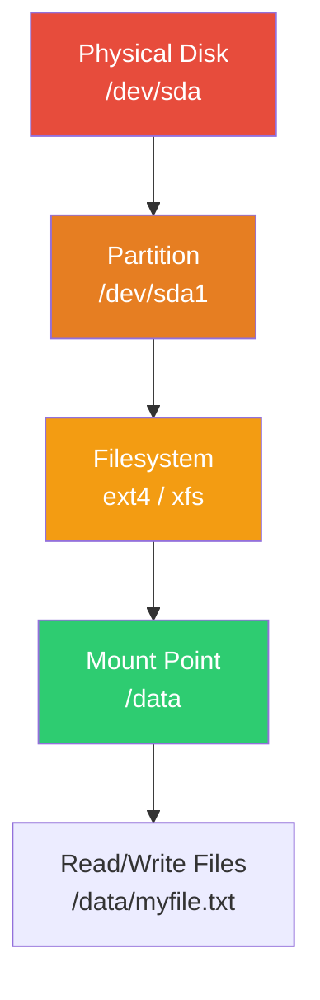
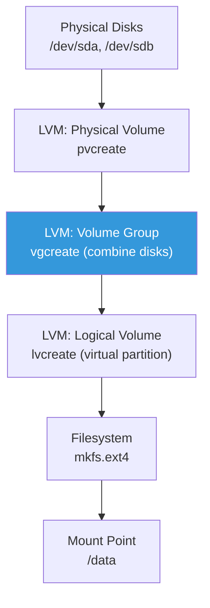
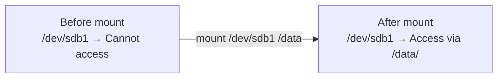
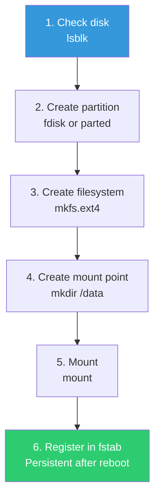
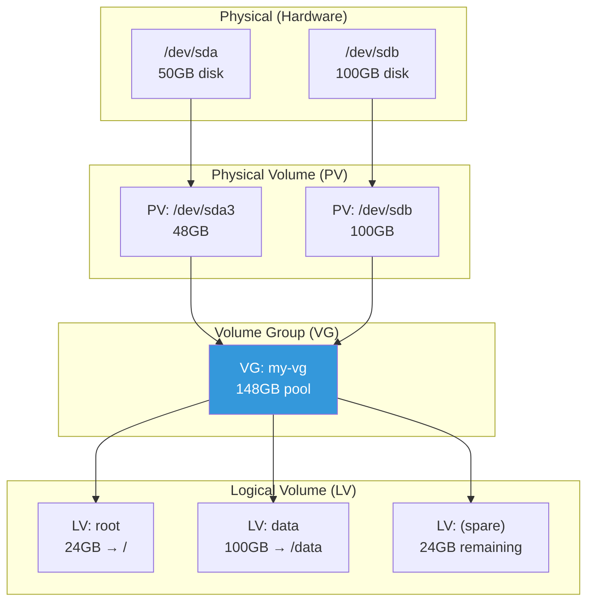
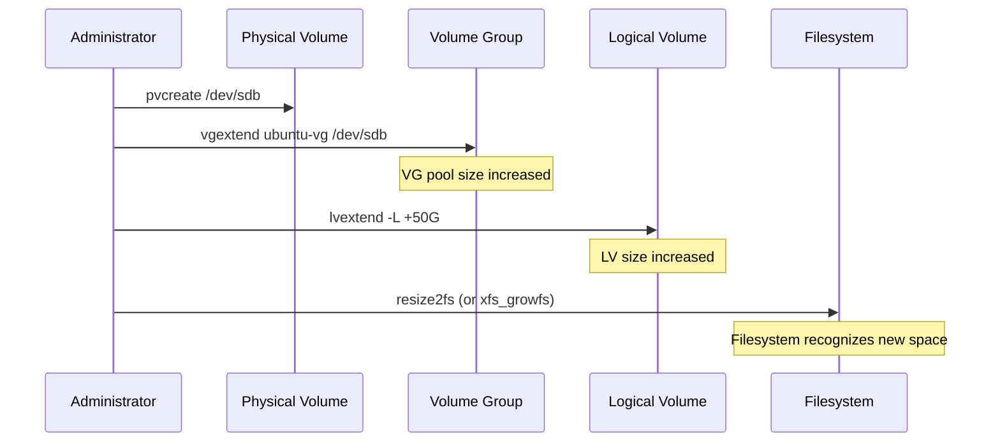
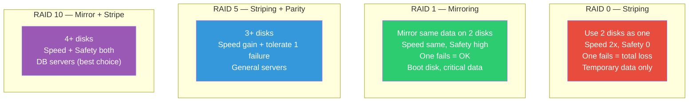

# Disk Management (Filesystems / LVM / RAID)

> "The disk is at 100%!" — You'll hear this a hundred times in your DevOps career. When you understand how to add disks, partition them, and manage them flexibly with LVM, you can handle these situations calmly.

---

## 🎯 Why Should You Know This?

```
Real-world disk tasks:
• "Disk is full!" → Find the cause and free up space
• Add new disk → Partition, format, mount
• Expand disk capacity → Grow volumes without downtime using LVM
• AWS EBS volume addition/expansion → Still Linux disk management at the OS level
• Data safety → Prepare for disk failures using RAID
• Performance issues → Diagnose disk I/O bottlenecks
```

In the cloud era, you still need to understand disk management. Even when you increase EBS volume size in AWS, you still need to expand the partition and resize the filesystem inside the OS.

---

## 🧠 Core Concepts

### Analogy: Warehouse Management

Disk management is like **managing a warehouse**.

* **Physical disk (sda, nvme0n1)** = Empty warehouse building
* **Partition (sda1, sda2)** = Dividing the warehouse with partitions
* **Filesystem (ext4, xfs)** = Installing shelves in each section. You need shelves to organize items (files)
* **Mount** = Installing a door (path) to each section to make it accessible
* **LVM** = Movable walls that partition flexibly. You can change section sizes dynamically
* **RAID** = Operating two identical warehouses, so one burning down doesn't hurt

### Flow from Disk to File





---

## 🔍 Detailed Explanation

### Checking Disks and Partitions

#### lsblk — List block devices (start here!)

```bash
lsblk
# NAME        MAJ:MIN RM   SIZE RO TYPE MOUNTPOINTS
# sda           8:0    0    50G  0 disk
# ├─sda1        8:1    0     1M  0 part            ← BIOS boot partition
# ├─sda2        8:2    0     2G  0 part /boot      ← Boot partition
# └─sda3        8:3    0    48G  0 part
#   └─ubuntu--vg-ubuntu--lv
#                     253:0    0    24G  0 lvm  /   ← LVM root
# sdb           8:16   0   100G  0 disk             ← New disk added (unused)
# sr0          11:0    1  1024M  0 rom              ← CD-ROM (ignore)

# More detailed information
lsblk -f
# NAME                      FSTYPE      LABEL UUID                                 MOUNTPOINTS
# sda
# ├─sda1
# ├─sda2                    ext4              xxxx-yyyy-zzzz                         /boot
# └─sda3                    LVM2_member       aaaa-bbbb-cccc
#   └─ubuntu--vg-ubuntu--lv ext4              dddd-eeee-ffff                         /
# sdb                                                                                ← No filesystem!
```

**How to read the output:**

| Column | Meaning |
|--------|---------|
| NAME | Device name |
| SIZE | Capacity |
| TYPE | disk (disk), part (partition), lvm (logical volume) |
| MOUNTPOINTS | Mounted path (empty if not mounted) |
| FSTYPE | Filesystem type (ext4, xfs, etc.) |

#### df — Check disk usage

```bash
df -h
# Filesystem                         Size  Used Avail Use% Mounted on
# /dev/mapper/ubuntu--vg-ubuntu--lv   24G   12G   11G  53% /
# /dev/sda2                          2.0G  200M  1.6G  12% /boot
# tmpfs                              2.0G     0  2.0G   0% /dev/shm
# tmpfs                              400M  1.1M  399M   1% /run

# -h: Human-readable units (GB, MB)
# -T: Show filesystem types
df -hT
# Filesystem                         Type  Size  Used Avail Use% Mounted on
# /dev/mapper/ubuntu--vg-ubuntu--lv  ext4   24G   12G   11G  53% /
# /dev/sda2                          ext4  2.0G  200M  1.6G  12% /boot

# Inode usage (file count limit)
df -i
# Filesystem                          Inodes IUsed   IFree IUse% Mounted on
# /dev/mapper/ubuntu--vg-ubuntu--lv  1572864 85432 1487432    6% /
```

#### du — Directory usage

```bash
# Current directory and subdirectories
du -sh *
# 1.5G  logs
# 500M  data
# 200M  backups

# Find large directories under /var
du -sh /var/* 2>/dev/null | sort -rh | head -10
# 8.0G  /var/log
# 3.5G  /var/lib
# 1.0G  /var/cache
# ...

# Limit depth (1 level only)
du -h --max-depth=1 /var/ | sort -rh
# 13G   /var/
# 8.0G  /var/log
# 3.5G  /var/lib
# 1.0G  /var/cache

# Find files larger than 100MB
find / -type f -size +100M 2>/dev/null | head -10
# /var/log/nginx/access.log
# /var/lib/docker/overlay2/...
```

---

### Filesystems (ext4 vs xfs)

A filesystem determines how files are organized and stored on disk — it's the "organization method".

| Comparison | ext4 | xfs |
|------------|------|-----|
| Default OS | Ubuntu, Debian | CentOS, RHEL, Amazon Linux |
| Max file size | 16TB | 8EB (virtually unlimited) |
| Max volume size | 1EB | 8EB |
| Can shrink? | ✅ Yes | ❌ No (expand only) |
| Large file performance | Moderate | Excellent |
| Stability | Very high | Very high |
| Production recommendation | General purpose (default) | Large data, databases |

```bash
# Check current filesystem
df -T /
# Filesystem                        Type  Size  Used Avail Use% Mounted on
# /dev/mapper/ubuntu--vg-ubuntu--lv ext4   24G   12G   11G  53% /

# Or:
mount | grep "on / "
# /dev/mapper/ubuntu--vg-ubuntu--lv on / type ext4 (rw,relatime)
```

---

### mount / umount — Mounting and Unmounting

**Mounting** connects a disk (partition) to a directory so you can use it.



```bash
# Mount (connect disk to directory)
sudo mkdir -p /data
sudo mount /dev/sdb1 /data

# Verify mount
mount | grep sdb
# /dev/sdb1 on /data type ext4 (rw,relatime)

df -h /data
# Filesystem      Size  Used Avail Use% Mounted on
# /dev/sdb1       100G  2.0G   93G   3% /data

# Unmount (disconnect)
sudo umount /data
# Or by device:
sudo umount /dev/sdb1

# ⚠️ If you get "target is busy" error:
# → Someone is using that directory
lsof +f -- /data    # Check who's using it
fuser -mv /data     # Show processes

# Force unmount (caution!)
sudo umount -l /data    # Lazy unmount (disconnect when done)
sudo umount -f /data    # Force (NFS etc.)
```

#### /etc/fstab — Auto-mount after reboot

The `mount` command only lasts until reboot. For permanent mounting, register in `/etc/fstab`.

```bash
cat /etc/fstab
# <device>                                  <mount point>  <type>  <options>       <dump> <pass>
# /dev/mapper/ubuntu--vg-ubuntu--lv         /              ext4    defaults        0      1
# /dev/sda2                                 /boot          ext4    defaults        0      2
# UUID=xxxx-yyyy-zzzz                       /data          ext4    defaults        0      2
```

```
Field descriptions:
device      → Device (/dev/sdX or UUID preferred)
mount point → Directory to mount to
type        → Filesystem type (ext4, xfs)
options     → Mount options (defaults is standard)
dump        → Backup flag (0 = no)
pass        → fsck check order (0=no, 1=root, 2=others)
```

```bash
# Safe way to add to fstab:

# 1. Get UUID (device names can change, UUID doesn't!)
blkid /dev/sdb1
# /dev/sdb1: UUID="abcd-1234-efgh-5678" TYPE="ext4"

# 2. Backup fstab!
sudo cp /etc/fstab /etc/fstab.bak

# 3. Add to fstab
echo 'UUID=abcd-1234-efgh-5678  /data  ext4  defaults  0  2' | sudo tee -a /etc/fstab

# 4. Test before reboot (MUST do this!)
sudo mount -a
# If no errors, you're good. If errors appear, fix fstab!

# ⚠️ Wrong fstab can break server boot!
# → Always backup and test with mount -a!
```

**Key mount options:**

| Option | Meaning |
|--------|---------|
| `defaults` | rw, suid, dev, exec, auto, nouser, async combination |
| `noatime` | Don't record access time (performance gain) |
| `nofail` | Boot continues even if mount fails (important for cloud!) |
| `ro` | Read-only |
| `noexec` | Prevent executing files (security) |

```bash
# Recommended fstab settings for cloud
UUID=abcd-1234  /data  ext4  defaults,nofail,noatime  0  2
#                                     ^^^^^^ ^^^^^^^^
#                                     Boot OK  Better
#                                     on fail  performance
```

---

### Adding a New Disk (Complete Flow)

Here's the complete process for adding a new disk. AWS EBS addition follows the same steps.



```bash
# === Scenario: Mount 100GB /dev/sdb disk to /data ===

# 1. Check disk
lsblk
# sdb    8:16   0  100G  0 disk    ← New disk confirmed

# 2. Create partition (use entire disk as one partition)
sudo parted /dev/sdb --script mklabel gpt
sudo parted /dev/sdb --script mkpart primary ext4 0% 100%

# Verify
lsblk
# sdb    8:16   0  100G  0 disk
# └─sdb1 8:17   0  100G  0 part   ← Partition created

# 3. Create filesystem (format)
sudo mkfs.ext4 /dev/sdb1
# mke2fs 1.46.5 (30-Dec-2021)
# Creating filesystem with 26214144 4k blocks and 6553600 inodes
# ...
# Writing superblocks and filesystem accounting information: done

# Or with xfs:
# sudo mkfs.xfs /dev/sdb1

# 4. Create mount point
sudo mkdir -p /data

# 5. Mount
sudo mount /dev/sdb1 /data

# Verify
df -h /data
# Filesystem      Size  Used Avail Use% Mounted on
# /dev/sdb1        98G   60M   93G   1% /data

# 6. Register in fstab (persist across reboots)
UUID=$(blkid -s UUID -o value /dev/sdb1)
echo "UUID=$UUID  /data  ext4  defaults,nofail  0  2" | sudo tee -a /etc/fstab

# 7. Test fstab
sudo umount /data
sudo mount -a
df -h /data    # Verify mount again
```

---

### LVM (Logical Volume Manager) — Flexible Disk Management

LVM lets you adjust partition sizes freely. You can expand existing volumes by adding new disks.

#### LVM Architecture



**Analogy:**
* **PV (Physical Volume)** = Each warehouse building
* **VG (Volume Group)** = Multiple buildings combined into one large logistics zone
* **LV (Logical Volume)** = Flexible space division within the zone. Push walls to adjust size!

#### LVM Commands — Checking Status

```bash
# Check Physical Volumes
sudo pvs
# PV         VG        Fmt  Attr PSize   PFree
# /dev/sda3  ubuntu-vg lvm2 a--  <48.00g 24.00g

sudo pvdisplay
# --- Physical volume ---
# PV Name               /dev/sda3
# VG Name               ubuntu-vg
# PV Size               <48.00 GiB
# PE Size               4.00 MiB
# Total PE              12287
# Free PE               6144
# Allocated PE          6143

# Check Volume Groups
sudo vgs
# VG        #PV #LV #SN Attr   VSize   VFree
# ubuntu-vg   1   1   0 wz--n- <48.00g 24.00g

sudo vgdisplay
# --- Volume group ---
# VG Name               ubuntu-vg
# VG Size               <48.00 GiB
# Free  PE / Size       6144 / 24.00 GiB    ← 24GB available!

# Check Logical Volumes
sudo lvs
# LV        VG        Attr       LSize  Pool
# ubuntu-lv ubuntu-vg -wi-ao---- 24.00g

sudo lvdisplay
# --- Logical volume ---
# LV Path                /dev/ubuntu-vg/ubuntu-lv
# LV Name                ubuntu-lv
# VG Name                ubuntu-vg
# LV Size                24.00 GiB
```

#### LVM — Expanding Volume (Most Common Operation!)

```bash
# === Scenario: Root (/) partition full, need to expand ===

# 1. Check current state
df -h /
# Filesystem                         Size  Used Avail Use% Mounted on
# /dev/mapper/ubuntu--vg-ubuntu--lv   24G   22G   800M  97% /    ← 97%! Danger!

# 2. Check available space in VG
sudo vgs
# VG        VSize   VFree
# ubuntu-vg <48.00g 24.00g    ← 24GB available!

# 3. Expand LV (when VG has space)
# Add 10GB
sudo lvextend -L +10G /dev/ubuntu-vg/ubuntu-lv
# Size of logical volume ubuntu-vg/ubuntu-lv changed from 24.00 GiB to 34.00 GiB.

# Or use all remaining space
# sudo lvextend -l +100%FREE /dev/ubuntu-vg/ubuntu-lv

# 4. Expand filesystem (just expanding LV isn't enough! Filesystem must also expand)
# For ext4:
sudo resize2fs /dev/ubuntu-vg/ubuntu-lv
# resize2fs 1.46.5 (30-Dec-2021)
# Filesystem at /dev/ubuntu-vg/ubuntu-lv is mounted on /; on-line resizing required
# Resizing the filesystem on /dev/ubuntu-vg/ubuntu-lv to 8912896 (4k) blocks.
# The filesystem on /dev/ubuntu-vg/ubuntu-lv is now 8912896 (4k) blocks long.

# For xfs:
# sudo xfs_growfs /

# 5. Verify
df -h /
# Filesystem                         Size  Used Avail Use% Mounted on
# /dev/mapper/ubuntu--vg-ubuntu--lv   34G   22G   11G  67% /    ← Down to 67%!

# ⭐ One-command option: lvextend + resize2fs
sudo lvextend -L +10G --resizefs /dev/ubuntu-vg/ubuntu-lv
#                      ^^^^^^^^^^
#                      Expand filesystem too!
```

#### LVM — Add New Disk to Expand VG

```bash
# === Scenario: VG has no free space, need to add new disk ===

# 1. Check new disk
lsblk
# sdb    8:16   0  100G  0 disk    ← New disk

# 2. Create PV
sudo pvcreate /dev/sdb
# Physical volume "/dev/sdb" successfully created.

# 3. Add PV to existing VG
sudo vgextend ubuntu-vg /dev/sdb
# Volume group "ubuntu-vg" successfully extended

# 4. Check VG (capacity increased!)
sudo vgs
# VG        VSize    VFree
# ubuntu-vg <148.00g <124.00g    ← 100GB added!

# 5. Expand LV
sudo lvextend -L +50G --resizefs /dev/ubuntu-vg/ubuntu-lv

# 6. Verify
df -h /
```



#### LVM — Create New Logical Volume

```bash
# === Scenario: Create separate LV for /data ===

# 1. Check VG free space
sudo vgs
# VG        VFree
# ubuntu-vg 74.00g

# 2. Create new LV
sudo lvcreate -L 50G -n data ubuntu-vg
# Logical volume "data" created.

# 3. Create filesystem
sudo mkfs.ext4 /dev/ubuntu-vg/data

# 4. Mount
sudo mkdir -p /data
sudo mount /dev/ubuntu-vg/data /data

# 5. Register in fstab
echo '/dev/ubuntu-vg/data  /data  ext4  defaults,nofail  0  2' | sudo tee -a /etc/fstab

# 6. Verify
df -h /data
lsblk
```

---

### RAID — Preparing for Disk Failures

RAID combines multiple disks to improve **data safety** or **performance**.



| RAID | Min Disks | Capacity | Fault Tolerance | Performance | Use Case |
|------|-----------|----------|-----------------|-------------|----------|
| RAID 0 | 2 | 100% | None | Read/write fast | Temp data, cache |
| RAID 1 | 2 | 50% | 1 disk | Read fast | Boot, critical data |
| RAID 5 | 3 | (N-1)/N | 1 disk | Read fast | General servers |
| RAID 6 | 4 | (N-2)/N | 2 disks | Read fast | Large storage |
| RAID 10 | 4 | 50% | 1 per pair | Both fast | DB, high-performance |

```bash
# Software RAID (mdadm) example — RAID 1

# 1. Create RAID
sudo mdadm --create /dev/md0 --level=1 --raid-devices=2 /dev/sdb /dev/sdc

# 2. Check RAID status
cat /proc/mdstat
# md0 : active raid1 sdc[1] sdb[0]
#       104320 blocks super 1.2 [2/2] [UU]
#                                      ^^
#                                      U=healthy, _=failed

sudo mdadm --detail /dev/md0
# Number   Major   Minor   RaidDevice State
#    0       8       16        0      active sync   /dev/sdb
#    1       8       32        1      active sync   /dev/sdc

# 3. Filesystem + mount (same as regular disk)
sudo mkfs.ext4 /dev/md0
sudo mkdir -p /data
sudo mount /dev/md0 /data
```

**RAID in real-world:**
* **Cloud (AWS, GCP)**: You rarely set up hardware RAID. EBS itself is replicated
* **On-premises**: Configure hardware RAID with RAID controller at server purchase
* **Why learn it**: Understanding RAID helps you design cloud storage properly

---

### Check Disk I/O

```bash
# iostat — Disk I/O statistics
iostat -x 1 3
# Device  r/s   w/s   rkB/s   wkB/s  await  %util
# sda     5.0  20.0   100.0   500.0   2.50   15.0
# sdb     0.5   1.0    10.0    20.0   1.00    2.0

# Key metrics:
# r/s, w/s     → Read/write requests per second
# rkB/s, wkB/s → Read/write data per second
# await        → Average response time (ms) → High = slow!
# %util        → Disk utilization → Close to 100% = bottleneck!

# iotop — Which process uses I/O heavily
sudo iotop
# Total DISK READ:  10.00 M/s | Total DISK WRITE:  50.00 M/s
#   PID  USER     DISK READ  DISK WRITE  COMMAND
#  3000  mysql     5.00 M/s   40.00 M/s  mysqld          ← DB is the culprit!
#  5000  ubuntu    3.00 M/s    5.00 M/s  rsync

# If not installed:
sudo apt install iotop     # Ubuntu
sudo yum install iotop     # CentOS
```

### Inode Exhaustion

Sometimes disk space is available but you can't create files. Inodes are exhausted.

**Analogy:** The warehouse has space, but you've run out of shelf labels (inodes). Can't register new items.

```bash
# Check inode usage
df -i
# Filesystem                          Inodes  IUsed   IFree IUse% Mounted on
# /dev/mapper/ubuntu--vg-ubuntu--lv  1572864 1572000    864  100% /
#                                                              ^^^
#                                                              100% inodes! Can't create files!

# Find which directory has many files
for dir in /var /tmp /home /opt; do
    echo -n "$dir: "
    find "$dir" -type f 2>/dev/null | wc -l
done
# /var: 1200000    ← Culprit!

# Dig deeper
find /var -type f 2>/dev/null | awk -F/ '{print "/"$2"/"$3}' | sort | uniq -c | sort -rn | head -5
# 1100000 /var/spool
#   50000 /var/log
# → /var/spool has 1.1M small files!

# Common causes: mail queue, session files, temporary cache files
```

---

## 💻 Lab Exercises

### Lab 1: Understand Disk Status

```bash
# Steps to assess disk status on a new server

# 1. Block device list
lsblk

# 2. Disk usage
df -hT

# 3. Where is space used
du -h --max-depth=1 / 2>/dev/null | sort -rh | head -10

# 4. Inode status
df -i

# 5. LVM usage
sudo pvs 2>/dev/null
sudo vgs 2>/dev/null
sudo lvs 2>/dev/null

# 6. RAID usage
cat /proc/mdstat

# 7. Check fstab
cat /etc/fstab
```

### Lab 2: Find Large Files/Directories (Incident Response)

```bash
# "Disk is at 97%!" situation

# 1. Overall status
df -h

# 2. Find large directories
sudo du -h --max-depth=2 / 2>/dev/null | sort -rh | head -20

# 3. Find files larger than 100MB
sudo find / -type f -size +100M -exec ls -lh {} \; 2>/dev/null | sort -k5 -rh | head -10

# 4. Find large files created in last 24 hours (when something spikes)
sudo find / -type f -size +50M -mtime -1 2>/dev/null | head -10

# 5. If deleted but space not freed (open file issue)
sudo lsof +L1 | head -10
# COMMAND  PID  USER  FD  SIZE  NAME (deleted)
# nginx   901  www   3w  5.0G  /var/log/nginx/access.log (deleted)
# → Process still holds deleted file!
# → Restart process to reclaim space

sudo systemctl restart nginx
df -h    # Verify space freed
```

### Lab 3: LVM Expansion Practice

```bash
# Check current LVM status
sudo vgs
sudo lvs
df -h /

# If VG has free space, expand LV
sudo lvextend -L +5G --resizefs /dev/ubuntu-vg/ubuntu-lv

# Verify
df -h /
```

---

## 🏢 Real-World Scenarios

### Scenario 1: AWS EBS Volume Expansion

```bash
# After expanding EBS volume from 50GB to 100GB in AWS console:
# What to do in the server:

# 1. Verify disk change recognition
lsblk
# xvda    202:0    0  100G  0 disk           ← 100GB recognized
# └─xvda1 202:1    0   50G  0 part /         ← Partition still 50GB!

# 2. Expand partition (growpart)
sudo growpart /dev/xvda 1
# CHANGED: partition=1 start=2048 old: size=104855519 new: size=209713119

lsblk
# xvda    202:0    0  100G  0 disk
# └─xvda1 202:1    0  100G  0 part /         ← Partition now 100GB!

# 3. Expand filesystem
# For ext4:
sudo resize2fs /dev/xvda1

# For xfs:
# sudo xfs_growfs /

# 4. Verify
df -h /
# Filesystem  Size  Used Avail Use% Mounted on
# /dev/xvda1   97G   20G   73G  22% /         ← 100GB reflected!
```

### Scenario 2: Add Data Disk (AWS EBS)

```bash
# After attaching new EBS volume to server:

# 1. Check new disk
lsblk
# xvdf    202:80   0  200G  0 disk    ← New disk!

# 2. Verify if already formatted (in case reusing old volume)
sudo file -s /dev/xvdf
# /dev/xvdf: data    ← "data" means empty disk

# 3. Create filesystem
sudo mkfs.ext4 /dev/xvdf
# (Can format entire disk without partition)

# 4. Mount
sudo mkdir -p /data
sudo mount /dev/xvdf /data

# 5. Register in fstab (nofail is essential! Prevents boot issues if EBS disconnects)
UUID=$(blkid -s UUID -o value /dev/xvdf)
echo "UUID=$UUID  /data  ext4  defaults,nofail  0  2" | sudo tee -a /etc/fstab

# 6. Test
sudo umount /data
sudo mount -a
df -h /data
```

### Scenario 3: Disk Full Emergency Response

```bash
# === Emergency: Disk 100%! Service down! ===

# Step 1: Immediate check
df -h
# /dev/sda1  50G  50G  0  100% /

# Step 2: Quick space recovery (emergency measures)

# Method 1: Clear large log file (truncate instead of delete!)
sudo truncate -s 0 /var/log/nginx/access.log
# → Keeps file but empties content (process restart not needed)

# Method 2: Clean apt cache
sudo apt clean    # Delete package cache (hundreds of MB to GB)

# Method 3: Clean old journald logs
sudo journalctl --vacuum-size=100M

# Method 4: Docker cleanup (if using Docker)
sudo docker system prune -af

# Step 3: Find root cause
du -h --max-depth=2 / 2>/dev/null | sort -rh | head -20

# Step 4: Prevent recurrence
# → Set up logrotate
# → Monitor disk capacity + set alerts
# → Expand disk if needed (LVM or EBS)
```

---

## ⚠️ Common Mistakes

### 1. Break Server Boot by Editing fstab Wrong

```bash
# ❌ fstab typo → Server won't boot → Can't SSH!

# ✅ Prevention:
# 1. Always backup
sudo cp /etc/fstab /etc/fstab.bak

# 2. Test with mount -a
sudo mount -a    # If no errors, OK. If errors, fix first!

# 3. Use nofail option (boot continues even if mount fails)
UUID=xxx  /data  ext4  defaults,nofail  0  2

# If server won't boot:
# → AWS: Stop instance → Attach root volume to another instance → Fix fstab
# → On-premises: Boot to recovery mode → Fix fstab
```

### 2. Expand LV but Not Filesystem

```bash
# ❌ LV expanded but df shows no change
sudo lvextend -L +10G /dev/ubuntu-vg/ubuntu-lv
df -h /    # No change!

# ✅ Must expand filesystem too
sudo resize2fs /dev/ubuntu-vg/ubuntu-lv   # ext4
# Or:
sudo xfs_growfs /                          # xfs

# ✅ Or do both in one command (--resizefs)
sudo lvextend -L +10G --resizefs /dev/ubuntu-vg/ubuntu-lv
```

### 3. Delete File with rm but Space Doesn't Free Up

```bash
# ❌ File deleted but space not freed if process holds it open
sudo rm /var/log/nginx/access.log    # 5GB file
df -h    # No change!?

# Reason: nginx still has file open, so it's not actually deleted
sudo lsof | grep deleted | grep nginx
# nginx 901 www 3w REG 8,1 5368709120 (deleted)

# ✅ Solution:
# Method 1: Restart process
sudo systemctl restart nginx

# Method 2: Truncate instead of delete (no restart needed)
sudo truncate -s 0 /var/log/nginx/access.log
```

### 4. Use Device Name in fstab

```bash
# ❌ Device names can change after reboot!
/dev/sdb1  /data  ext4  defaults  0  2
# → sdb might become sdc!

# ✅ Use UUID (never changes)
UUID=abcd-1234-efgh-5678  /data  ext4  defaults,nofail  0  2

# Get UUID:
blkid /dev/sdb1
```

---

## 📝 Summary

### Disk Management Cheatsheet

```bash
# Checking
lsblk                    # Block device list
lsblk -f                 # With filesystem info
df -hT                   # Disk usage + type
du -sh /path/*           # Directory size
df -i                    # Inode usage
blkid                    # UUID

# Add new disk
sudo parted /dev/sdb --script mklabel gpt
sudo parted /dev/sdb --script mkpart primary ext4 0% 100%
sudo mkfs.ext4 /dev/sdb1
sudo mount /dev/sdb1 /data

# LVM
sudo pvs / vgs / lvs               # Status
sudo pvcreate /dev/sdb              # Create PV
sudo vgextend my-vg /dev/sdb        # Expand VG
sudo lvextend -L +10G --resizefs /dev/my-vg/data  # Expand LV + filesystem
sudo lvcreate -L 50G -n data my-vg  # Create new LV

# Emergency response
sudo truncate -s 0 /path/to/big.log # Empty log file
sudo apt clean                       # Delete apt cache
sudo journalctl --vacuum-size=100M   # Clean journal
```

### Key Things to Remember

```
1. Check disk status in order: lsblk → df -h → du -sh
2. Always backup fstab before editing + test with mount -a
3. Use UUID in fstab, not device names
4. Expand filesystem after expanding LV (or use --resizefs)
5. Truncate is safer than delete for big log files
6. Use nofail in fstab for cloud environments
```

---

## 🔗 Next Lecture

Next is **[01-linux/08-log.md — Log Management (syslog / journald)](./08-log)**.

"Want to know what happened on your server? Look at logs" — Logs are your server's black box. Learn how to manage and analyze logs effectively using syslog, journald, log rotation, and more.
