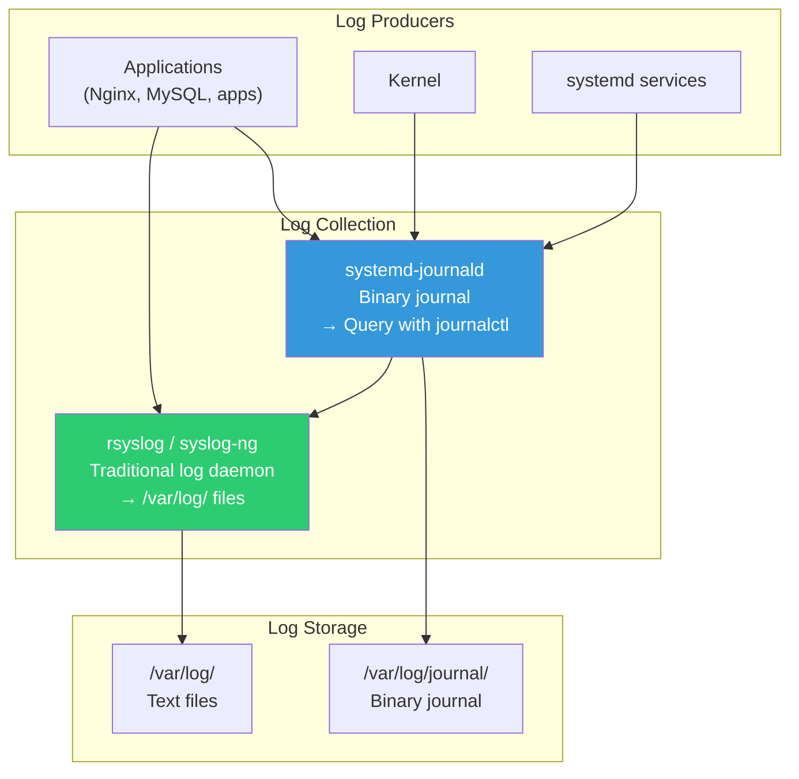
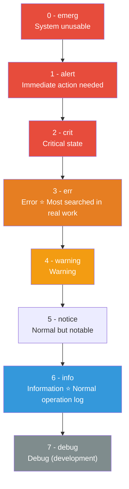
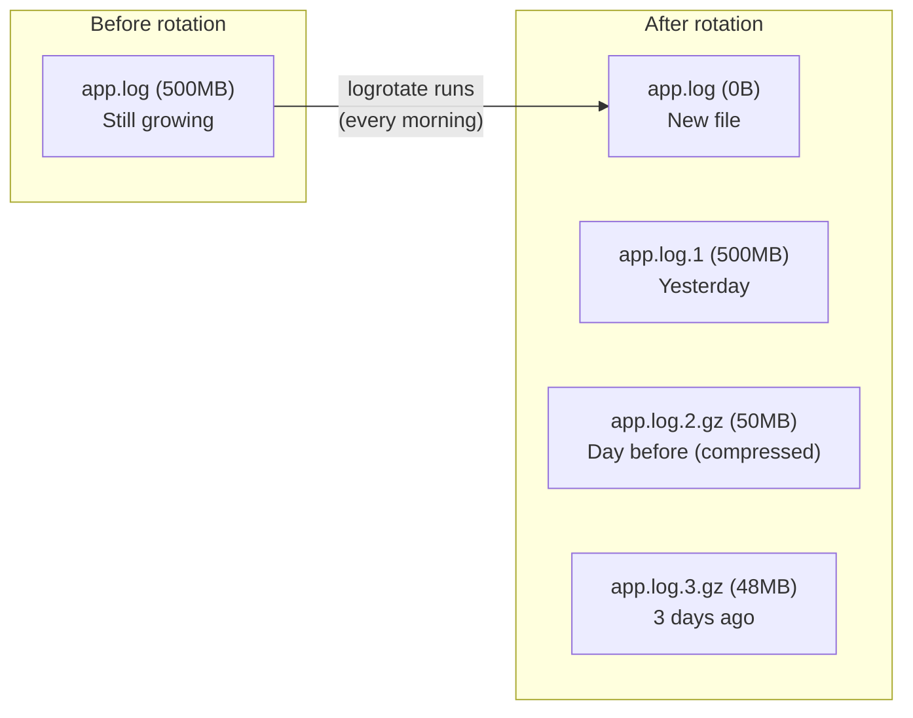
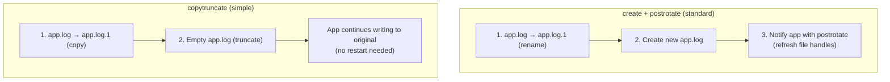

# Log Management (syslog / journald / log rotation)

> When something breaks on your server, the first thing you do is "look at the logs". Logs are your server's black box and CCTV. Master reading and managing logs, and you'll find the cause of 80% of issues.

---

## 🎯 Why Should You Know This?

```
Real-world log situations:
• "Site won't load"          → Check Nginx error log
• "App keeps crashing"       → Check app logs + systemd journal
• "Who accessed the server?" → Check auth.log (authentication log)
• "When did it slow down?"    → Track using log timestamps
• "Disk is full"             → Check if log files grew too large
• "Security audit needed"    → Logs must be retained for compliance
```

Without understanding logs, you can only say "I don't know" during incidents. With logs, you can say "DB connection dropped at 10:23, timeout was the cause."

---

## 🧠 Core Concepts

### Analogy: Building's CCTV + Log Book

* **Logs** = Record of everything that happens on the server: event log + CCTV footage
* **syslog** = Traditional handwritten log system. Each department (service) submits its log to the office (log file)
* **journald** = Modern digital CCTV system. All records stored in central database. Searching is easy
* **log rotation** = Compress old CCTV footage and delete very old ones

### Linux Log System Architecture



**On modern Linux (Ubuntu 20+, CentOS 7+), both work together:**
* journald receives all logs first
* rsyslog pulls logs from journald and writes to `/var/log/` files
* Result: same logs visible via both `journalctl` and `/var/log/` files

---

## 🔍 Detailed Explanation

### /var/log/ — Log File Directory

```bash
ls -la /var/log/
# -rw-r-----  1 syslog adm    125000 Mar 12 14:30 auth.log
# -rw-r-----  1 syslog adm     85000 Mar 12 14:30 syslog
# -rw-r-----  1 syslog adm     42000 Mar 12 14:30 kern.log
# -rw-r--r--  1 root   root    15000 Mar 12 09:00 dpkg.log
# -rw-r--r--  1 root   utmp   292000 Mar 12 14:25 wtmp
# -rw-r--r--  1 root   utmp    10000 Mar 12 14:25 btmp
# -rw-r-----  1 syslog adm     65000 Mar 11 14:30 syslog.1
# -rw-r-----  1 syslog adm      8000 Mar 10 14:30 syslog.2.gz
# drwxr-xr-x  2 root   root     4096 Mar 12 09:00 nginx/
# drwxr-x---  2 root   adm      4096 Mar 12 09:00 apache2/
# drwxrwx---  2 mysql  mysql    4096 Mar 12 09:00 mysql/
# drwx------  2 root   root     4096 Mar 12 09:00 journal/
```

#### Key Log Files

| File | Content | When to Check |
|------|---------|---------------|
| `syslog` | System-wide logs (comprehensive) | When something is wrong, check first |
| `auth.log` | Login, sudo, SSH authentication | Security check, "who accessed?" |
| `kern.log` | Kernel messages | OOM Killer, hardware errors |
| `dpkg.log` | Package install/remove history | "When did I install this?" |
| `wtmp` | Successful login record (binary) | View with `last` command |
| `btmp` | Failed login record (binary) | View with `lastb` command |
| `dmesg` | Kernel messages during boot | Hardware recognition issues |
| `nginx/access.log` | Nginx access log | Traffic analysis, error tracing |
| `nginx/error.log` | Nginx error log | Web server troubleshooting |
| `mysql/error.log` | MySQL error log | Database troubleshooting |

```bash
# View each log file

# System-wide log (last 20 lines)
tail -20 /var/log/syslog

# View logs in real-time (shows new logs as they arrive)
tail -f /var/log/syslog

# Multiple logs in real-time
tail -f /var/log/syslog /var/log/auth.log

# Login history
last | head -10
# ubuntu   pts/0    10.0.0.5     Wed Mar 12 10:00   still logged in
# ubuntu   pts/0    10.0.0.5     Tue Mar 11 09:00 - 18:00  (09:00)
# reboot   system boot  5.15.0-91-generi Wed Mar 10 08:00   still running

# Failed login attempts (SSH brute force check)
sudo lastb | head -10
# admin    ssh:notty    185.220.101.42   Wed Mar 12 09:15 - 09:15  (00:00)
# root     ssh:notty    103.145.12.88    Wed Mar 12 09:14 - 09:14  (00:00)
# → Repeated IPs = brute force attack!

# Boot messages
dmesg | tail -20
# Or:
dmesg | grep -i error
```

---

### syslog — Traditional Log System

#### syslog Components

Every syslog message has **facility (source)** and **severity (level)**.

**Facility (Where is the log from?):**

| Facility | Meaning |
|----------|---------|
| `kern` | Kernel |
| `user` | User programs |
| `mail` | Mail system |
| `daemon` | System daemon |
| `auth` | Authentication/security |
| `syslog` | syslog itself |
| `cron` | cron daemon |
| `local0~7` | User-defined (for apps) |

**Severity (How serious?):**



#### rsyslog Configuration

```bash
# rsyslog config file
cat /etc/rsyslog.conf

# Main rules (which logs go where)
cat /etc/rsyslog.d/50-default.conf
# auth,authpriv.*                 /var/log/auth.log      ← Authentication log
# *.*;auth,authpriv.none          /var/log/syslog        ← Everything else
# kern.*                          /var/log/kern.log      ← Kernel log
# cron.*                          /var/log/cron.log      ← cron log

# Format: facility.severity  /path/to/logfile
# auth.*       = all levels of auth
# *.err        = all facilities at err level and above
# *.*;auth.none = all logs except auth
```

#### Send App Logs to syslog

```bash
# Use logger command to send messages to syslog
logger "Deployment complete: myapp v2.1.0"
# → Gets recorded in /var/log/syslog

logger -p local0.info "App started"
logger -p local0.err "DB connection failed"
logger -t myapp "Health check passed"

# Verify
grep myapp /var/log/syslog
# Mar 12 14:30:00 server01 myapp: Health check passed

# Use in scripts
#!/bin/bash
logger -t deploy "Deployment starting: $APP_NAME"
# ... deployment work ...
if [ $? -eq 0 ]; then
    logger -t deploy -p local0.info "Deployment succeeded"
else
    logger -t deploy -p local0.err "Deployment failed!"
fi
```

---

### journald — systemd's Log System

journald is the modern log system that works with systemd. Stored in binary format, queried with `journalctl`.

#### journalctl Basics

```bash
# All logs (newest at bottom)
journalctl

# Recent logs (most common usage)
journalctl -n 50        # Last 50 lines
journalctl -n 100       # Last 100 lines

# Reverse order (newest at top)
journalctl -r | head -20

# Real-time logs (like tail -f)
journalctl -f

# No pager, print once (good for scripts)
journalctl --no-pager -n 20
```

#### Service-specific Logs (★ Most Used!)

```bash
# Logs from specific service
journalctl -u nginx
journalctl -u docker
journalctl -u sshd

# Specific service, last 30 lines
journalctl -u nginx -n 30

# Real-time logs from specific service
journalctl -u myapp -f

# Multiple services simultaneously
journalctl -u nginx -u myapp -f

# Example output
journalctl -u nginx -n 10
# Mar 12 09:00:00 server01 systemd[1]: Starting A high performance web server...
# Mar 12 09:00:00 server01 nginx[900]: nginx: the configuration file syntax is ok
# Mar 12 09:00:00 server01 systemd[1]: Started A high performance web server.
# Mar 12 10:15:30 server01 nginx[901]: 10.0.0.5 - - [12/Mar/2025:10:15:30 +0000] "GET / HTTP/1.1" 200
# Mar 12 10:15:31 server01 nginx[901]: 10.0.0.5 - - [12/Mar/2025:10:15:31 +0000] "GET /api HTTP/1.1" 500
#                                                                                                      ^^^
#                                                                                                      500 error!
```

#### Time Filters

```bash
# Logs after specific time
journalctl --since "2025-03-12 10:00:00"
journalctl --since "1 hour ago"
journalctl --since "today"
journalctl --since "yesterday"

# Time range
journalctl --since "2025-03-12 10:00" --until "2025-03-12 12:00"
journalctl --since "2 hours ago" --until "1 hour ago"

# Since current boot (if server restarted after incident)
journalctl -b        # Current boot
journalctl -b -1     # Previous boot (before restart)

# Boot list
journalctl --list-boots
#  0 abc123 Wed 2025-03-12 09:00:00 UTC — Wed 2025-03-12 14:30:00 UTC
# -1 def456 Tue 2025-03-11 08:00:00 UTC — Wed 2025-03-12 08:59:59 UTC
```

#### Priority (Severity) Filters

```bash
# Errors and above (err, crit, alert, emerg)
journalctl -p err
journalctl -u myapp -p err

# Warnings and above
journalctl -p warning

# Specific range
journalctl -p err..crit

# Example output
journalctl -p err --since "today" --no-pager
# Mar 12 10:15:31 server01 myapp[5000]: ERROR: Database connection timeout
# Mar 12 10:15:32 server01 myapp[5000]: ERROR: Failed to process request
# Mar 12 10:20:00 server01 kernel: Out of memory: Killed process 5000 (myapp)
```

#### Output Format

```bash
# Short format (default)
journalctl -u nginx -n 3
# Mar 12 09:00:00 server01 nginx[900]: started

# Verbose format
journalctl -u nginx -n 1 -o verbose
# Wed 2025-03-12 09:00:00.123456 UTC [s=abc; i=1; b=def; ...]
#     _TRANSPORT=stdout
#     _SYSTEMD_UNIT=nginx.service
#     _PID=900
#     _COMM=nginx
#     MESSAGE=started
#     PRIORITY=6
#     ...

# JSON format (for parsing, useful in scripts)
journalctl -u nginx -n 1 -o json-pretty
# {
#     "_HOSTNAME" : "server01",
#     "_SYSTEMD_UNIT" : "nginx.service",
#     "MESSAGE" : "started",
#     "PRIORITY" : "6",
#     "__REALTIME_TIMESTAMP" : "1710234000123456",
#     ...
# }

# Message only (for grep combinations)
journalctl -u nginx -o cat -n 5
# started
# 10.0.0.5 - - "GET / HTTP/1.1" 200
# 10.0.0.5 - - "GET /api HTTP/1.1" 500
```

#### Other Useful Filters

```bash
# Logs from specific PID
journalctl _PID=5000

# Logs from specific user
journalctl _UID=1000

# Logs from specific executable
journalctl _COMM=python3

# Kernel messages only
journalctl -k
journalctl -k | grep -i "oom\|error\|fail"

# Disk usage
journalctl --disk-usage
# Archived and active journals take up 256.0M in the file system.
```

---

### Log Analysis Tools (grep, awk, sed)

Looking at logs manually has limits. Combining text tools gives powerful analysis.

#### grep — Find Patterns in Logs

```bash
# Basic: Find lines with pattern
grep "error" /var/log/syslog
grep "ERROR" /var/log/myapp/app.log

# Case-insensitive
grep -i "error" /var/log/syslog

# Exclude pattern
grep -v "healthcheck" /var/log/nginx/access.log
# → Skip health check logs (too many)

# Multiple patterns
grep -E "error|fail|timeout" /var/log/syslog

# Show surrounding lines (context)
grep -A 3 "ERROR" /var/log/myapp/app.log    # After: 3 lines after
grep -B 3 "ERROR" /var/log/myapp/app.log    # Before: 3 lines before
grep -C 3 "ERROR" /var/log/myapp/app.log    # Context: 3 lines before and after

# Count matches only
grep -c "error" /var/log/syslog
# 42

# Show line numbers
grep -n "error" /var/log/syslog
# 150:Mar 12 10:15:31 server01 myapp: error connecting to DB
# 230:Mar 12 10:20:00 server01 myapp: error timeout

# Recursive search in directory
grep -r "password" /etc/ 2>/dev/null
grep -rl "error" /var/log/    # Files only

# Regular expressions
grep -E "^Mar 12 1[0-2]:" /var/log/syslog    # 10:00-12:59 logs
grep -E "\b5[0-9]{2}\b" /var/log/nginx/access.log  # HTTP 5xx errors
```

#### awk — Extract and Analyze Log Fields

```bash
# Nginx access log format:
# 10.0.0.5 - - [12/Mar/2025:10:15:30 +0000] "GET /api HTTP/1.1" 200 1234
# $1=IP    $7=URL  $9=status_code  $10=bytes

# Extract status codes
awk '{print $9}' /var/log/nginx/access.log | head -10
# 200
# 200
# 304
# 500
# 200

# Count status codes (very useful!)
awk '{print $9}' /var/log/nginx/access.log | sort | uniq -c | sort -rn
#  15234 200
#   2100 304
#    456 404
#     23 500    ← 23 server errors!
#      5 502

# Request count by IP (who's accessing a lot?)
awk '{print $1}' /var/log/nginx/access.log | sort | uniq -c | sort -rn | head -10
#  5000 10.0.0.5
#  3200 10.0.0.10
#  1500 185.220.101.42    ← External IP many times = possible attack!

# Find 500 errors and which URLs (which endpoints failing?)
awk '$9 == 500 {print $7}' /var/log/nginx/access.log | sort | uniq -c | sort -rn
#   15 /api/users
#    5 /api/orders
#    3 /api/payments

# Requests by hour (traffic pattern)
awk '{print $4}' /var/log/nginx/access.log | cut -d: -f2 | sort | uniq -c
#   500 08
#  1200 09
#  2500 10    ← Peak at 10:00
#  2300 11
#  1800 12

# Specific time + 500 errors
awk '$4 ~ /12\/Mar\/2025:10/ && $9 == 500' /var/log/nginx/access.log
```

#### sed — Transform Log Text

```bash
# Mask IP addresses (privacy protection)
sed 's/[0-9]\{1,3\}\.[0-9]\{1,3\}\.[0-9]\{1,3\}\.[0-9]\{1,3\}/xxx.xxx.xxx.xxx/g' /var/log/nginx/access.log

# Extract specific time range
sed -n '/12\/Mar\/2025:10:00/,/12\/Mar\/2025:11:00/p' /var/log/nginx/access.log

# Reformat timestamps
sed 's/\[\([^]]*\)\]/\1/' /var/log/nginx/access.log | head -3
```

#### Real-World Log Analysis Pipelines

```bash
# "Top 5 URLs with 500 errors in last hour"
grep "$(date -d '1 hour ago' '+%d/%b/%Y:%H')" /var/log/nginx/access.log \
    | awk '$9 == 500 {print $7}' \
    | sort | uniq -c | sort -rn | head -5
#   15 /api/users
#    8 /api/orders
#    3 /api/search

# "Extract requests from specific IP"
grep "185.220.101.42" /var/log/nginx/access.log | tail -20

# "Most common error types in app logs"
grep -i "error" /var/log/myapp/app.log \
    | sed 's/.*ERROR: //' \
    | sort | uniq -c | sort -rn | head -5
#   45 Database connection timeout
#   23 Redis connection refused
#   12 File not found: /uploads/missing.jpg

# "SSH brute force detection"
grep "Failed password" /var/log/auth.log \
    | awk '{print $(NF-3)}' \
    | sort | uniq -c | sort -rn | head -10
#  520 185.220.101.42
#  340 103.145.12.88
#   25 10.0.0.15
```

---

### Log Rotation — Manage Growing Logs

Logs grow endlessly without management. logrotate automatically compresses old logs and deletes very old ones.

#### logrotate Operation



```
Rotation steps:
1. app.log.3.gz → Delete (if rotate=3)
2. app.log.2.gz → app.log.3.gz
3. app.log.1    → app.log.2.gz (compress)
4. app.log      → app.log.1
5. Create new app.log (empty)
6. Run postrotate script (notify service)
```

#### logrotate Configuration

```bash
# Default configuration
cat /etc/logrotate.conf
# weekly                # Default rotation interval
# rotate 4              # Keep 4 backups
# create                # Create new file after rotation
# compress              # gzip compression
# include /etc/logrotate.d

# Service-specific configs
ls /etc/logrotate.d/
# alternatives  apt  dpkg  nginx  rsyslog  ufw  ...

cat /etc/logrotate.d/nginx
# /var/log/nginx/*.log {
#     daily
#     missingok
#     rotate 14
#     compress
#     delaycompress
#     notifempty
#     create 0640 www-data adm
#     sharedscripts
#     postrotate
#         if [ -d /etc/logrotate.d/nginx ]; then
#             /usr/sbin/invoke-rc.d nginx rotate >/dev/null 2>&1
#         fi
#     endscript
# }
```

**Key Options:**

| Option | Meaning |
|--------|---------|
| `daily` / `weekly` / `monthly` | Rotation interval |
| `rotate N` | Keep N backups (delete rest) |
| `compress` | gzip compression |
| `delaycompress` | Don't compress previous file (stability) |
| `missingok` | No error if file missing |
| `notifempty` | Don't rotate if empty |
| `create 0640 user group` | New file permissions/owner |
| `copytruncate` | Copy file then truncate (no restart needed) |
| `sharedscripts` | Run postrotate once |
| `postrotate` / `endscript` | Commands to run after rotation |
| `size 100M` | Rotate if larger than 100MB |
| `maxsize 500M` | Rotate regardless of interval if exceeds |
| `dateext` | Add date to filename |

#### Create Custom logrotate Configuration

```bash
# Our app's logrotate config
cat << 'EOF' | sudo tee /etc/logrotate.d/myapp
/var/log/myapp/*.log {
    daily                    # Rotate daily
    rotate 30                # Keep 30 days
    compress                 # Compress
    delaycompress            # Don't compress previous
    missingok                # OK if missing
    notifempty               # Don't rotate if empty
    create 0644 myapp myapp  # New file permissions
    dateext                  # Add date to filename
    dateformat -%Y%m%d       # Date format

    postrotate
        # Notify app that log file changed
        systemctl reload myapp 2>/dev/null || true
    endscript
}
EOF

# For fast-rotating logs (size-based)
cat << 'EOF' | sudo tee /etc/logrotate.d/myapp-fast
/var/log/myapp/debug.log {
    size 100M                # Rotate if exceeds 100MB
    rotate 5                 # Keep 5 backups
    compress
    missingok
    notifempty
    copytruncate             # Rotate without restart
}
EOF
```

```bash
# Test logrotate (simulation, doesn't actually rotate)
sudo logrotate -d /etc/logrotate.d/myapp
# reading config file /etc/logrotate.d/myapp
# Handling 1 logs
# rotating pattern: /var/log/myapp/*.log after 1 days (30 rotations)
# ...
# rotating log /var/log/myapp/app.log, log->rotateCount is 30
# dateext suffix '-20250312'
# ...

# Force rotation (for testing)
sudo logrotate -f /etc/logrotate.d/myapp

# Force all logrotate configs
sudo logrotate -f /etc/logrotate.conf

# logrotate state file (last run time)
cat /var/lib/logrotate/status
# logrotate state -- version 2
# "/var/log/syslog" 2025-3-12-6:25:7
# "/var/log/nginx/access.log" 2025-3-12-6:25:7
```

#### `copytruncate` vs `postrotate`



```bash
# If app supports SIGHUP to reopen log files → use postrotate
# If app doesn't → use copytruncate

# copytruncate risk: Short window between copy and truncate where logs are lost
# Usually acceptable for most uses, but avoid in financial/critical apps
```

---

### journald Persistent Storage

By default, journald loses logs after reboot in some distros. Setup persistence.

```bash
# Check current storage mode
cat /etc/systemd/journald.conf | grep Storage
# #Storage=auto
# auto: Persistent if /var/log/journal/ exists, else volatile

# Enable persistent storage
sudo mkdir -p /var/log/journal
sudo systemd-tmpfiles --create --prefix /var/log/journal
sudo systemctl restart systemd-journald

# Or set explicitly in config
sudo sed -i 's/#Storage=auto/Storage=persistent/' /etc/systemd/journald.conf
sudo systemctl restart systemd-journald

# Set size limits
sudo vim /etc/systemd/journald.conf
# [Journal]
# Storage=persistent
# SystemMaxUse=500M        # Max 500MB total
# SystemMaxFileSize=50M    # Max 50MB per file
# MaxRetentionSec=1month   # Keep 1 month

sudo systemctl restart systemd-journald

# Manual cleanup
sudo journalctl --vacuum-size=200M    # Keep only 200MB
sudo journalctl --vacuum-time=7d      # Delete older than 7 days
sudo journalctl --vacuum-files=10     # Keep only 10 files
```

---

## 💻 Lab Exercises

### Lab 1: Log File Exploration

```bash
# 1. What's in /var/log
ls -lhS /var/log/ | head -15    # By size

# 2. Recent syslog
tail -20 /var/log/syslog

# 3. SSH access history
grep "Accepted" /var/log/auth.log | tail -5
# Mar 12 10:00:00 server01 sshd[1234]: Accepted publickey for ubuntu from 10.0.0.5

# 4. Kernel errors
dmesg | grep -i -E "error|fail|warn" | tail -10

# 5. Login history
last | head -10
```

### Lab 2: journalctl Real-World Practice

```bash
# 1. Errors since boot
journalctl -b -p err --no-pager

# 2. SSH service logs since today
journalctl -u sshd --since "today" -n 20

# 3. Real-time system logs (open Terminal 1, SSH in Terminal 2)
# Terminal 1:
journalctl -f
# Then SSH from another terminal and watch logs appear

# 4. Kernel messages (OOM etc.)
journalctl -k --since "today" | grep -i "oom\|kill\|error"

# 5. JSON output (for script parsing)
journalctl -u sshd -n 3 -o json-pretty
```

### Lab 3: Log Analysis Pipeline

```bash
# If Nginx installed (or similar access logs)

# 1. Status code distribution
awk '{print $9}' /var/log/nginx/access.log 2>/dev/null | sort | uniq -c | sort -rn

# 2. Requests by hour
awk '{print $4}' /var/log/nginx/access.log 2>/dev/null | cut -d: -f2 | sort | uniq -c

# 3. Find patterns in error logs
grep -i "error" /var/log/syslog | awk '{print $5}' | sort | uniq -c | sort -rn | head -10

# If no Nginx, practice with syslog:
# 4. Service counts in syslog
awk '{print $5}' /var/log/syslog | cut -d'[' -f1 | sort | uniq -c | sort -rn | head -10
# 1500 systemd
#  800 CRON
#  300 sshd
#  100 nginx
```

### Lab 4: Create logrotate Configuration

```bash
# 1. Create test log file
sudo mkdir -p /var/log/testapp
for i in $(seq 1 1000); do
    echo "$(date) - Log entry $i" | sudo tee -a /var/log/testapp/test.log > /dev/null
done
ls -lh /var/log/testapp/test.log

# 2. Create logrotate config
cat << 'EOF' | sudo tee /etc/logrotate.d/testapp
/var/log/testapp/*.log {
    size 10K
    rotate 3
    compress
    missingok
    notifempty
    copytruncate
    dateext
}
EOF

# 3. Simulate
sudo logrotate -d /etc/logrotate.d/testapp

# 4. Force rotation
sudo logrotate -f /etc/logrotate.d/testapp

# 5. Check results
ls -lh /var/log/testapp/
# test.log              ← New (empty or small)
# test.log-20250312     ← Yesterday
# test.log-20250311.gz  ← Day before (compressed)

# 6. Cleanup
sudo rm /etc/logrotate.d/testapp
sudo rm -rf /var/log/testapp
```

---

## 🏢 Real-World Scenarios

### Scenario 1: Find Incident Root Cause Using Logs

```bash
# "API returned 500 errors starting at 10:30"

# Step 1: Find errors in app logs
journalctl -u myapp --since "10:25" --until "10:35" -p err
# Mar 12 10:28:00 myapp[5000]: ERROR: Redis connection refused
# Mar 12 10:28:01 myapp[5000]: ERROR: Cache miss, falling back to DB
# Mar 12 10:28:05 myapp[5000]: ERROR: Database connection pool exhausted
# Mar 12 10:30:00 myapp[5000]: CRITICAL: All DB connections in use

# Step 2: Why did Redis fail?
journalctl -u redis --since "10:20" --until "10:30"
# Mar 12 10:27:55 redis[3000]: Out of memory
# Mar 12 10:27:55 redis[3000]: Can't save in background: fork: Cannot allocate memory

# Step 3: Check system logs
journalctl -k --since "10:25" --until "10:30"
# Mar 12 10:27:54 kernel: redis-server invoked oom-killer
# → OOM Killer killed Redis!

# Step 4: Find memory leak
journalctl -u myapp --since "09:00" | grep -i "memory\|heap"

# Conclusion: Memory leak → OOM → Redis killed → Cache miss → DB overloaded → 500 errors
```

### Scenario 2: Detect SSH Brute Force Attack

```bash
# Analyze failed SSH attempts

# 1. Count failures
grep "Failed password" /var/log/auth.log | wc -l
# 15420   ← Under attack!

# 2. Which IPs are attacking
grep "Failed password" /var/log/auth.log \
    | awk '{print $(NF-3)}' \
    | sort | uniq -c | sort -rn | head -5
#  8200 185.220.101.42
#  4300 103.145.12.88
#  2100 45.227.254.20

# 3. Which usernames are targeted
grep "Failed password" /var/log/auth.log \
    | awk '{print $(NF-5)}' \
    | sort | uniq -c | sort -rn | head -5
#  6000 root
#  3000 admin
#  2000 ubuntu
#  1000 test

# 4. Response: Block the IPs
sudo iptables -A INPUT -s 185.220.101.42 -j DROP
# Or install fail2ban for auto-blocking
```

### Scenario 3: Prepare for Log Centralization

```bash
# For collecting logs from multiple servers

# On log collection server (rsyslog):
# /etc/rsyslog.conf
# module(load="imtcp")
# input(type="imtcp" port="514")

# On app servers (send logs remotely):
# /etc/rsyslog.d/remote.conf
# *.* @@log-server:514    # TCP
# *.* @log-server:514     # UDP

sudo systemctl restart rsyslog

# In production, setup usually continues to:
# rsyslog → Fluentd/Fluentbit → Elasticsearch → Kibana
# Or:
# journald → Fluentbit → Loki → Grafana
# (Covered in observability section)
```

### Scenario 4: Create Log-Based Alerts

```bash
# Alert when error rate spikes

cat << 'SCRIPT' | sudo tee /opt/scripts/log-alert.sh
#!/bin/bash
# Check errors in last 5 minutes

ERROR_COUNT=$(journalctl -u myapp --since "5 minutes ago" -p err --no-pager 2>/dev/null | wc -l)

if [ "$ERROR_COUNT" -gt 10 ]; then
    MESSAGE="⚠️ [$(hostname)] myapp errors spiked! ${ERROR_COUNT} in last 5 min"
    echo "$MESSAGE"

    # Send Slack alert (update webhook URL)
    # curl -s -X POST -H 'Content-type: application/json' \
    #     --data "{\"text\":\"$MESSAGE\"}" \
    #     https://hooks.slack.com/services/YOUR/WEBHOOK/URL
fi
SCRIPT
sudo chmod +x /opt/scripts/log-alert.sh

# Run every 5 minutes with cron
# */5 * * * *  /opt/scripts/log-alert.sh >> /var/log/log-alert.log 2>&1
```

---

## ⚠️ Common Mistakes

### 1. Delete Log Files but Don't Set Up logrotate

```bash
# ❌ Manually delete → Logs fill up again quickly
sudo rm /var/log/nginx/access.log
# → Tomorrow it's full again

# ✅ Set up logrotate
# Check /etc/logrotate.d/nginx and apply
```

### 2. Forget to Notify Service After Log Rotation

```bash
# ❌ Log rotated but service still writes to old file
# → app.log.1 keeps growing, new app.log empty

# ✅ Use postrotate to notify service
# postrotate
#     systemctl reload myapp
# endscript

# Or use copytruncate (no restart)
```

### 3. Don't Manage journald Disk Usage

```bash
# journal can consume lots of space
journalctl --disk-usage
# Archived and active journals take up 2.5G in the file system.

# ✅ Set size limits
sudo vim /etc/systemd/journald.conf
# SystemMaxUse=500M

# ✅ Or periodically clean
sudo journalctl --vacuum-size=500M
```

### 4. Expose Sensitive Data in Logs

```bash
# ❌ Passwords, tokens in logs
# ERROR: DB connection failed with password=MySecret123

# ✅ Mask sensitive data in app
# ERROR: DB connection failed with password=***

# Already logged? Mask it
sed -i 's/password=[^ ]*/password=***/g' /var/log/myapp/app.log
```

### 5. Use grep + tail to Monitor Real-Time Logs

```bash
# ❌ Slow and inefficient
tail -f /var/log/syslog | grep error

# ✅ Use journalctl filters (faster)
journalctl -u myapp -p err -f

# ✅ Or awk for complex filters
tail -f /var/log/nginx/access.log | awk '$9 >= 500'
```

---

## 📝 Summary

### Log Commands Cheatsheet

```bash
# === File-based logs ===
tail -f /var/log/syslog              # Real-time view
tail -20 /var/log/auth.log           # Last 20 lines
grep "error" /var/log/syslog         # Pattern search
grep -C 3 "ERROR" /var/log/app.log   # With 3 lines before/after

# === journalctl ===
journalctl -u [service]              # Service logs
journalctl -u [service] -f           # Real-time
journalctl -u [service] -p err       # Errors only
journalctl -u [service] -n 50        # Last 50 lines
journalctl --since "1 hour ago"      # Time filter
journalctl -b                        # Since boot
journalctl -k                        # Kernel messages

# === Log analysis ===
awk '{print $9}' access.log | sort | uniq -c | sort -rn   # Status distribution
awk '{print $1}' access.log | sort | uniq -c | sort -rn   # Requests by IP
grep -c "error" syslog                                     # Error count

# === logrotate ===
sudo logrotate -d /etc/logrotate.d/myapp   # Test (simulate)
sudo logrotate -f /etc/logrotate.d/myapp   # Force run
```

### Order to Check Logs During Incident

```
1. systemctl status [service]        → Service status + recent logs
2. journalctl -u [service] -p err    → Error logs
3. journalctl -k                     → OOM, hardware errors
4. /var/log/syslog                   → System-wide logs
5. /var/log/[service]/error.log      → Service-specific errors
6. dmesg                             → Boot/kernel errors
```

---

## 🔗 Next Lecture

Next is **[01-linux/09-network-commands.md — Network Commands (iproute2 / ss / tcpdump / iptables)](./09-network-commands)**.

Check your server's network status, which ports are open, where traffic goes, what firewall rules are set — Master essential Linux network commands for DevOps.
