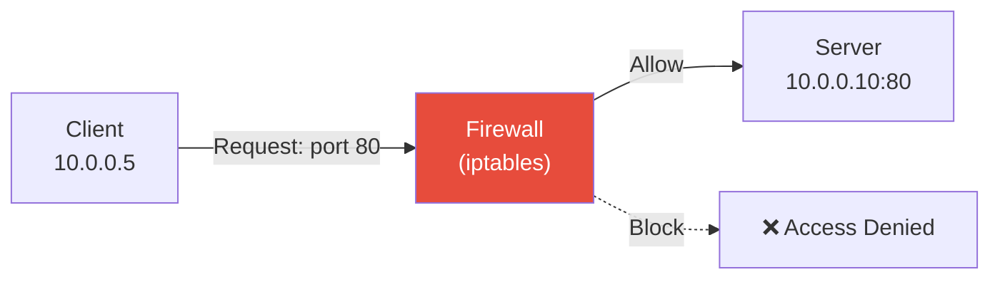
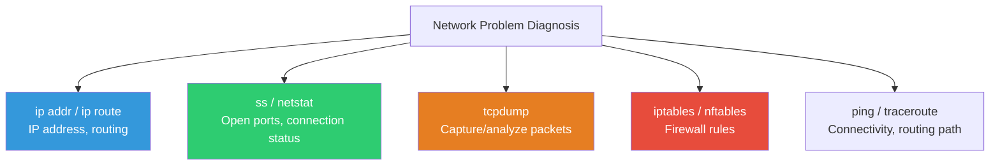
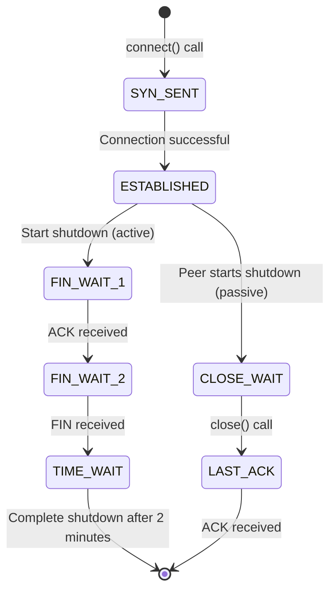
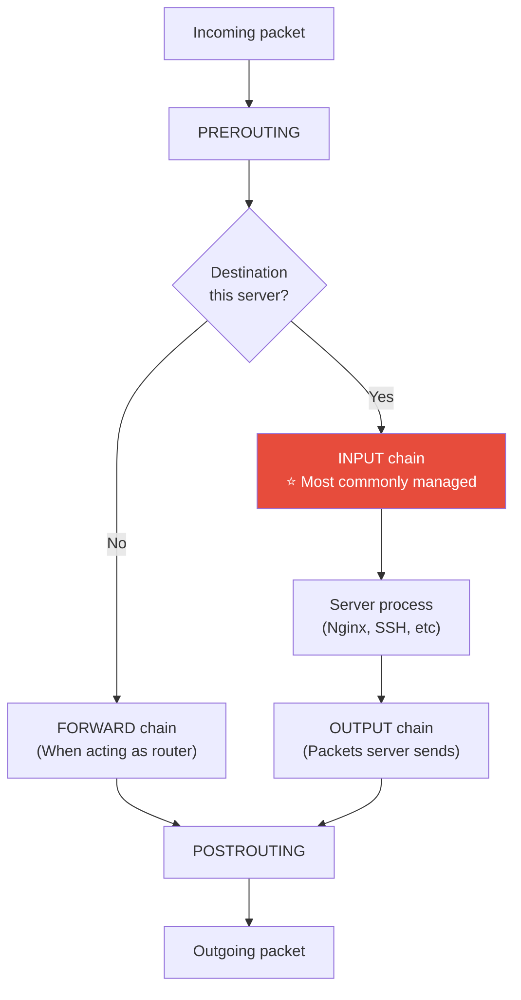
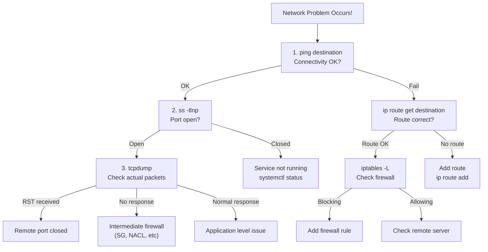

# Network Commands (iproute2 / ss / tcpdump / iptables)

> "How servers communicate with the outside world through networks" — What's the server's IP, which ports are open, where do packets go, and what is the firewall blocking? Without this knowledge, you're helpless when network issues occur.

---

## 🎯 Why Do You Need to Know This?

```
These situations happen weekly in real-world work:
• "App can't connect to DB"            → Check if port is open (ss)
• "Can't access from outside"           → Check firewall rules (iptables)
• "What's this server's IP?"            → ip addr
• "Communication between servers is slow" → Analyze packets with tcpdump
• "Traffic suddenly spiked"             → Check which IP/port it's from
• "Suspicious connection on server"     → Check current connections (ss)
```

The commands covered in this lecture are diagnostic tools for network problems. Like a doctor using a stethoscope, blood pressure gauge, and X-ray.

---

## 🧠 Core Concepts

### Analogy: Road Traffic System

Let me explain server networking using a **road traffic system** analogy.

* **IP Address** = Building address. "Seoul, Gangnam-gu, Teheran-ro 123"
* **Port** = Room number in the building. "123 **port 80** (web server), **port 22** (SSH), **port 3306** (MySQL)"
* **Routing** = Navigation. The path packets take to reach their destination
* **Firewall (iptables)** = Building security guard. "Room 80 visitors OK, room 3306 internal only OK"
* **tcpdump** = Road CCTV. Records all passing cars (packets)



### Command Map



---

## 🔍 Detailed Explanation

### ip — Network Interface/Routing Management (iproute2)

The `ip` command is the modern replacement for the legacy `ifconfig` tool. It essentially handles all network configuration.

#### ip addr — Check IP Address

```bash
ip addr
# 1: lo: <LOOPBACK,UP,LOWER_UP> mtu 65536 qdisc noqueue state UNKNOWN
#     link/loopback 00:00:00:00:00:00 brd 00:00:00:00:00:00
#     inet 127.0.0.1/8 scope host lo
#     inet6 ::1/128 scope host
#
# 2: eth0: <BROADCAST,MULTICAST,UP,LOWER_UP> mtu 9001 qdisc fq_codel state UP
#     link/ether 0a:1b:2c:3d:4e:5f brd ff:ff:ff:ff:ff:ff
#     inet 10.0.1.50/24 brd 10.0.1.255 scope global dynamic eth0
#     inet6 fe80::81b:2cff:fe3d:4e5f/64 scope link

# Brief view (recommended)
ip -brief addr
# lo        UNKNOWN  127.0.0.1/8 ::1/128
# eth0      UP       10.0.1.50/24 fe80::81b:2cff:fe3d:4e5f/64

# Specific interface only
ip addr show eth0
```

**Output Interpretation:**

```
eth0: <BROADCAST,MULTICAST,UP,LOWER_UP>
                              ^^  ^^^^^^^^
                              UP=Active  LOWER_UP=Cable connected

inet 10.0.1.50/24 brd 10.0.1.255 scope global dynamic eth0
     ^^^^^^^^^^^  ^^               ^^^^^^
     IP/Subnet    CIDR notation    global=External communication possible

link/ether 0a:1b:2c:3d:4e:5f
           ^^^^^^^^^^^^^^^^^^^
           MAC address
```

```bash
# Comparison with legacy commands
ip addr          ← Current (recommended)
ifconfig         ← Legacy (deprecated)

# Add/remove IP (temporary, disappears after reboot)
sudo ip addr add 10.0.1.100/24 dev eth0
sudo ip addr del 10.0.1.100/24 dev eth0

# Bring interface up/down
sudo ip link set eth0 up
sudo ip link set eth0 down
```

#### ip route — Routing Table

```bash
ip route
# default via 10.0.1.1 dev eth0 proto dhcp src 10.0.1.50 metric 100
# 10.0.1.0/24 dev eth0 proto kernel scope link src 10.0.1.50
# 172.17.0.0/16 dev docker0 proto kernel scope link src 172.17.0.1

# How to read:
# default via 10.0.1.1     → Default gateway is 10.0.1.1
# 10.0.1.0/24 dev eth0     → 10.0.1.x range communicates directly via eth0
# 172.17.0.0/16 dev docker0 → Docker network via docker0 interface

# Check route to specific destination
ip route get 8.8.8.8
# 8.8.8.8 via 10.0.1.1 dev eth0 src 10.0.1.50 uid 1000
# → To reach 8.8.8.8, go via gateway 10.0.1.1 on eth0

ip route get 10.0.1.100
# 10.0.1.100 dev eth0 src 10.0.1.50 uid 1000
# → Same subnet, direct communication without gateway

# Add/delete routes (temporary)
sudo ip route add 192.168.1.0/24 via 10.0.1.1
sudo ip route del 192.168.1.0/24
```

#### ip neigh — ARP Table (Neighboring Devices)

```bash
ip neigh
# 10.0.1.1 dev eth0 lladdr 0a:ff:ff:ff:ff:01 REACHABLE
# 10.0.1.20 dev eth0 lladdr 0a:1b:2c:3d:4e:60 STALE
# 10.0.1.30 dev eth0 lladdr 0a:1b:2c:3d:4e:70 REACHABLE

# States:
# REACHABLE → Recently successful communication
# STALE     → No communication for a while (still valid)
# FAILED    → Connection failure
```

---

### ss — Socket/Port Status Check (★ Used Very Frequently)

`ss` is the modern replacement for the legacy `netstat` command. It shows which ports are open and who is connected.

#### Check Open Ports (Listen State)

```bash
# TCP ports in LISTEN state (most common combination!)
ss -tlnp
# State   Recv-Q  Send-Q  Local Address:Port  Peer Address:Port  Process
# LISTEN  0       511     0.0.0.0:80           0.0.0.0:*          users:(("nginx",pid=900,fd=6))
# LISTEN  0       128     0.0.0.0:22           0.0.0.0:*          users:(("sshd",pid=800,fd=3))
# LISTEN  0       4096    127.0.0.1:3306       0.0.0.0:*          users:(("mysqld",pid=3000,fd=22))
# LISTEN  0       511     0.0.0.0:443          0.0.0.0:*          users:(("nginx",pid=900,fd=7))
# LISTEN  0       4096    0.0.0.0:9090         0.0.0.0:*          users:(("prometheus",pid=4000,fd=8))
# LISTEN  0       4096    127.0.0.1:6379       0.0.0.0:*          users:(("redis-server",pid=3500,fd=6))
```

**Option Meanings:**

| Option | Meaning |
|--------|---------|
| `-t` | TCP only |
| `-u` | UDP only |
| `-l` | LISTEN state only (server role) |
| `-n` | Show as numbers (no port name resolution) |
| `-p` | Show process information |
| `-a` | All states (LISTEN + ESTABLISHED + ...) |

```bash
# Output interpretation
# LISTEN  0  511  0.0.0.0:80  0.0.0.0:*  users:(("nginx",pid=900,fd=6))
#                 ^^^^^^^^^
#                 0.0.0.0 = Accept connections from all IPs
#                 127.0.0.1 = Accept connections from localhost only

# Meaning:
# 0.0.0.0:80     → Accessible from outside (Nginx web server)
# 0.0.0.0:22     → Accessible from outside (SSH)
# 127.0.0.1:3306 → MySQL only from localhost (external blocked) ✅ Safe
# 127.0.0.1:6379 → Redis only from localhost ✅ Safe
```

#### Check Current Connection Status

```bash
# All TCP connections
ss -tnp
# State       Recv-Q  Send-Q  Local Address:Port  Peer Address:Port   Process
# ESTAB       0       0       10.0.1.50:22        10.0.0.5:54321      users:(("sshd",pid=1234,fd=4))
# ESTAB       0       0       10.0.1.50:80        10.0.0.100:34567    users:(("nginx",pid=901,fd=10))
# ESTAB       0       0       10.0.1.50:80        10.0.0.101:45678    users:(("nginx",pid=901,fd=11))
# ESTAB       0       36      10.0.1.50:54000     10.0.2.10:3306      users:(("myapp",pid=5000,fd=15))
# TIME-WAIT   0       0       10.0.1.50:80        10.0.0.102:56789

# How to read:
# ESTAB 10.0.1.50:22 ← 10.0.0.5:54321     → Someone is connected via SSH
# ESTAB 10.0.1.50:80 ← 10.0.0.100:34567   → Web client connected
# ESTAB 10.0.1.50:54000 → 10.0.2.10:3306  → Our app is connected to DB

# Count connections by state
ss -tn | awk '{print $1}' | sort | uniq -c | sort -rn
#  150 ESTAB
#   30 TIME-WAIT
#    5 CLOSE-WAIT
#    2 SYN-SENT
#    1 State

# Connection count for specific port
ss -tn state established '( dport = :80 or sport = :80 )' | wc -l
# 150

# Connection count by IP (DDoS detection)
ss -tn state established | awk '{print $5}' | cut -d: -f1 | sort | uniq -c | sort -rn | head -10
#   50 10.0.0.100
#   45 10.0.0.101
#   30 10.0.0.102
#    5 185.220.101.42    ← Many external IPs = suspicious!
```

**TCP Connection State Explanation:**



| State | Meaning | If Many? |
|-------|---------|----------|
| `ESTABLISHED` | Normal active connection | Normal (proportional to traffic) |
| `TIME_WAIT` | Waiting after closure (2 min) | Frequent connection establish/teardown |
| `CLOSE_WAIT` | Peer closed but I haven't | ⚠️ App bug! Socket leak |
| `SYN_SENT` | Attempting connection | Peer server not responding |
| `SYN_RECV` | Waiting for connection acceptance | Possible SYN flood attack |

```bash
# ⚠️ Many CLOSE_WAIT means app not closing sockets!
ss -tn state close-wait | wc -l
# 500   ← If many, check app code

# Many TIME_WAIT (usually normal)
ss -tn state time-wait | wc -l
# 3000  ← If very many, tune kernel parameters
```

#### Find Process Using Specific Port

```bash
# Who's using port 80?
ss -tlnp | grep :80
# LISTEN  0  511  0.0.0.0:80  0.0.0.0:*  users:(("nginx",pid=900,fd=6))

# Or with lsof for more details
sudo lsof -i :80
# COMMAND  PID     USER   FD   TYPE DEVICE SIZE/OFF NODE NAME
# nginx    900     root    6u  IPv4  12345      0t0  TCP *:http (LISTEN)
# nginx    901 www-data   10u  IPv4  12346      0t0  TCP 10.0.1.50:http->10.0.0.100:34567 (ESTABLISHED)

# Port 3306 (MySQL)
sudo lsof -i :3306
# COMMAND  PID  USER   FD   TYPE DEVICE NAME
# mysqld  3000 mysql   22u  IPv4  23456  TCP 127.0.0.1:mysql (LISTEN)
# myapp   5000 myapp   15u  IPv4  34567  TCP 10.0.1.50:54000->10.0.2.10:mysql (ESTABLISHED)

# "Why is this port already in use?" — Service startup failure
sudo lsof -i :8080
# → Another process is already using 8080
```

---

### netstat — Legacy (Reference Only)

`netstat` is legacy but still seen often, so it's good to know.

```bash
# Nearly identical functionality to ss
netstat -tlnp      # Same as ss -tlnp
netstat -an         # Same as ss -an

# May not be installed
sudo apt install net-tools    # Ubuntu
sudo yum install net-tools    # CentOS

# ss ↔ netstat correspondence:
# ss -tlnp   =  netstat -tlnp    (listening ports)
# ss -tnp    =  netstat -tnp     (connection status)
# ss -s      =  netstat -s       (statistics)
```

---

### ping — Check Connectivity

```bash
# Basic ping (Ctrl+C to stop)
ping 10.0.2.10
# PING 10.0.2.10 (10.0.2.10) 56(84) bytes of data.
# 64 bytes from 10.0.2.10: icmp_seq=1 ttl=64 time=0.523 ms
# 64 bytes from 10.0.2.10: icmp_seq=2 ttl=64 time=0.412 ms
# 64 bytes from 10.0.2.10: icmp_seq=3 ttl=64 time=0.389 ms
# ^C
# --- 10.0.2.10 ping statistics ---
# 3 packets transmitted, 3 received, 0% packet loss, time 2003ms
# rtt min/avg/max/mdev = 0.389/0.441/0.523/0.058 ms

# Limit attempts
ping -c 3 10.0.2.10           # Send only 3 times and stop

# Set timeout
ping -c 3 -W 2 10.0.2.10     # Wait 2 seconds for response

# Meaning if ping doesn't work:
# 1. Remote server is down
# 2. Network is disconnected
# 3. Firewall blocking ICMP (AWS default!)
# → Ping failure doesn't mean server is dead

# Test external DNS (internet connectivity test)
ping -c 3 8.8.8.8           # Google DNS
ping -c 3 1.1.1.1           # Cloudflare DNS
```

---

### tcpdump — Packet Capture/Analysis (★ Advanced Debugging)

`tcpdump` is a powerful tool to see actual packets traversing the network. It's the "ultimate weapon" for network problem diagnosis.

```bash
# Installation
sudo apt install tcpdump    # Ubuntu

# Basic: capture all packets (caution: lots of data!)
sudo tcpdump -i eth0
# tcpdump: verbose output suppressed, use -v for more detail
# 14:30:00.123456 IP 10.0.0.5.54321 > 10.0.1.50.80: Flags [S], seq 1234567890
# 14:30:00.123500 IP 10.0.1.50.80 > 10.0.0.5.54321: Flags [S.], seq 9876543210, ack 1234567891
# 14:30:00.123800 IP 10.0.0.5.54321 > 10.0.1.50.80: Flags [.], ack 9876543211
# → TCP 3-way handshake! (SYN → SYN-ACK → ACK)
```

**Flags Meaning:**

| Flag | Meaning |
|------|---------|
| `[S]` | SYN (start connection) |
| `[S.]` | SYN-ACK (accept connection) |
| `[.]` | ACK |
| `[P.]` | PUSH-ACK (send data) |
| `[F.]` | FIN-ACK (close connection) |
| `[R.]` | RST-ACK (forceful close/reject) |

#### tcpdump Filters (Essential!)

```bash
# Specific port only
sudo tcpdump -i eth0 port 80
sudo tcpdump -i eth0 port 443

# Specific host only
sudo tcpdump -i eth0 host 10.0.2.10

# Specific host on specific port
sudo tcpdump -i eth0 host 10.0.2.10 and port 3306

# Specify source or destination
sudo tcpdump -i eth0 src 10.0.0.5           # Source IP
sudo tcpdump -i eth0 dst port 80            # Destination port 80

# Multiple conditions combined
sudo tcpdump -i eth0 'host 10.0.2.10 and (port 3306 or port 6379)'

# ICMP only (ping)
sudo tcpdump -i eth0 icmp

# DNS only
sudo tcpdump -i eth0 port 53
```

#### tcpdump Useful Options

```bash
# Show packet contents (ASCII)
sudo tcpdump -i eth0 -A port 80 | head -30
# 14:30:01.234 IP 10.0.0.5.54321 > 10.0.1.50.80: Flags [P.], ...
# GET /api/health HTTP/1.1
# Host: myapp.example.com
# User-Agent: curl/7.68.0
# Accept: */*

# Packet contents (HEX + ASCII)
sudo tcpdump -i eth0 -XX port 80

# Limit count
sudo tcpdump -i eth0 -c 10 port 80    # Capture 10 and stop

# Save to file (analyze later with Wireshark)
sudo tcpdump -i eth0 -w /tmp/capture.pcap port 80
# Ctrl+C to stop

# Read saved file
sudo tcpdump -r /tmp/capture.pcap | head -20

# Detailed timestamps
sudo tcpdump -i eth0 -tttt port 80
# 2025-03-12 14:30:01.234567 IP 10.0.0.5.54321 > 10.0.1.50.80: ...

# Skip DNS resolution (faster)
sudo tcpdump -i eth0 -nn port 80
# -nn: Show IPs as numbers, ports as numbers
```

#### tcpdump Practical Examples

```bash
# === Observe TCP 3-way handshake ===
# Terminal 1: Start tcpdump
sudo tcpdump -i eth0 -nn port 80 -c 10

# Terminal 2: HTTP request
curl http://10.0.1.50/

# Terminal 1 output:
# 14:30:00.001 IP 10.0.0.5.54321 > 10.0.1.50.80: Flags [S]        ← SYN
# 14:30:00.001 IP 10.0.1.50.80 > 10.0.0.5.54321: Flags [S.]       ← SYN-ACK
# 14:30:00.002 IP 10.0.0.5.54321 > 10.0.1.50.80: Flags [.]        ← ACK
# 14:30:00.002 IP 10.0.0.5.54321 > 10.0.1.50.80: Flags [P.]       ← HTTP GET
# 14:30:00.003 IP 10.0.1.50.80 > 10.0.0.5.54321: Flags [P.]       ← HTTP Response
# 14:30:00.003 IP 10.0.0.5.54321 > 10.0.1.50.80: Flags [.]        ← ACK
# 14:30:00.004 IP 10.0.0.5.54321 > 10.0.1.50.80: Flags [F.]       ← FIN (close)
# 14:30:00.004 IP 10.0.1.50.80 > 10.0.0.5.54321: Flags [F.]       ← FIN-ACK
# 14:30:00.005 IP 10.0.0.5.54321 > 10.0.1.50.80: Flags [.]        ← ACK

# === Diagnose DB connection failure ===
sudo tcpdump -i eth0 -nn host 10.0.2.10 and port 3306 -c 5

# Normal: SYN → SYN-ACK → ACK (3-way handshake)
# Port closed: SYN → RST (immediate reject)
# Firewall block: SYN → (no response) → SYN retry ... (timeout)
# Server down: SYN → (no response)

# === Find RST packets (connection rejection) ===
sudo tcpdump -i eth0 -nn 'tcp[tcpflags] & tcp-rst != 0'
```

---

### iptables — Firewall Rules (★ Security Essential)

iptables is Linux's standard firewall. It defines which traffic to allow and which to block.

#### Understand iptables Structure



**In real work, 95% of the time you only deal with the INPUT chain.** "What traffic incoming to this server do we allow and what do we block?"

#### Check Current iptables Rules

```bash
sudo iptables -L -n -v
# Chain INPUT (policy ACCEPT 0 packets, 0 bytes)
#  pkts bytes target     prot opt in     out     source               destination
#  1.5M  120M ACCEPT     all  --  lo     *       0.0.0.0/0            0.0.0.0/0
#  250K   20M ACCEPT     all  --  *      *       0.0.0.0/0            0.0.0.0/0   state RELATED,ESTABLISHED
#  5000  300K ACCEPT     tcp  --  *      *       0.0.0.0/0            0.0.0.0/0   tcp dpt:22
#  100K   50M ACCEPT     tcp  --  *      *       0.0.0.0/0            0.0.0.0/0   tcp dpt:80
#  80K    40M ACCEPT     tcp  --  *      *       0.0.0.0/0            0.0.0.0/0   tcp dpt:443
#     0     0 DROP       all  --  *      *       0.0.0.0/0            0.0.0.0/0
#
# Chain FORWARD (policy ACCEPT)
# ...
# Chain OUTPUT (policy ACCEPT)
# ...

# View with line numbers
sudo iptables -L INPUT -n -v --line-numbers
# num  pkts bytes target  prot opt in  out  source    destination
# 1    1.5M  120M ACCEPT  all  --  lo  *    0.0.0.0/0 0.0.0.0/0
# 2    250K   20M ACCEPT  all  --  *   *    0.0.0.0/0 0.0.0.0/0  state RELATED,ESTABLISHED
# 3    5000  300K ACCEPT  tcp  --  *   *    0.0.0.0/0 0.0.0.0/0  tcp dpt:22
# 4    100K   50M ACCEPT  tcp  --  *   *    0.0.0.0/0 0.0.0.0/0  tcp dpt:80
# 5    80K    40M ACCEPT  tcp  --  *   *    0.0.0.0/0 0.0.0.0/0  tcp dpt:443
# 6       0     0 DROP    all  --  *   *    0.0.0.0/0 0.0.0.0/0
```

**How to Read:**

```
Rules are matched top to bottom in order!
1. Loopback allowed — Server's own communication
2. Established connections allowed — Maintain existing sessions
3. TCP port 22 (SSH) allowed
4. TCP port 80 (HTTP) allowed
5. TCP port 443 (HTTPS) allowed
6. Everything else blocked (DROP)
```

#### Add/Delete iptables Rules

```bash
# === Add rules ===

# Allow SSH (port 22)
sudo iptables -A INPUT -p tcp --dport 22 -j ACCEPT

# Allow HTTP/HTTPS
sudo iptables -A INPUT -p tcp --dport 80 -j ACCEPT
sudo iptables -A INPUT -p tcp --dport 443 -j ACCEPT

# Allow specific IP only
sudo iptables -A INPUT -p tcp -s 10.0.0.0/24 --dport 3306 -j ACCEPT
# → MySQL (3306) only from 10.0.0.x range

# Block specific IP
sudo iptables -A INPUT -s 185.220.101.42 -j DROP

# Allow loopback (required!)
sudo iptables -A INPUT -i lo -j ACCEPT

# Keep established sessions (required!)
sudo iptables -A INPUT -m state --state RELATED,ESTABLISHED -j ACCEPT

# Block everything else
sudo iptables -A INPUT -j DROP

# === Delete rules ===

# Delete by line number
sudo iptables -D INPUT 6    # Delete rule 6

# Delete by condition (use -D instead of -A)
sudo iptables -D INPUT -s 185.220.101.42 -j DROP

# Reset all (caution!)
sudo iptables -F          # Delete all rules
sudo iptables -P INPUT ACCEPT    # Set default policy to ACCEPT (else server inaccessible!)
```

#### Production-Ready Basic Firewall Setup

```bash
#!/bin/bash
# Basic firewall setup script

# Reset existing rules
sudo iptables -F
sudo iptables -X

# Default policy: block incoming, allow outgoing
sudo iptables -P INPUT DROP
sudo iptables -P FORWARD DROP
sudo iptables -P OUTPUT ACCEPT

# Allow loopback (required!)
sudo iptables -A INPUT -i lo -j ACCEPT

# Keep established sessions (required!)
sudo iptables -A INPUT -m state --state RELATED,ESTABLISHED -j ACCEPT

# Allow SSH (⚠️ Skip this and server becomes inaccessible!)
sudo iptables -A INPUT -p tcp --dport 22 -j ACCEPT

# Allow HTTP/HTTPS
sudo iptables -A INPUT -p tcp --dport 80 -j ACCEPT
sudo iptables -A INPUT -p tcp --dport 443 -j ACCEPT

# Allow specific ports for internal network only
sudo iptables -A INPUT -p tcp -s 10.0.0.0/16 --dport 3306 -j ACCEPT    # MySQL
sudo iptables -A INPUT -p tcp -s 10.0.0.0/16 --dport 6379 -j ACCEPT    # Redis
sudo iptables -A INPUT -p tcp -s 10.0.0.0/16 --dport 9090 -j ACCEPT    # Prometheus

# Allow ping (optional)
sudo iptables -A INPUT -p icmp --icmp-type echo-request -j ACCEPT

# Logging (record blocked packets)
sudo iptables -A INPUT -j LOG --log-prefix "IPT-DROP: " --log-level 4
sudo iptables -A INPUT -j DROP

echo "Firewall setup complete"
sudo iptables -L -n -v
```

#### Persist iptables Rules

```bash
# iptables rules disappear after reboot!

# Ubuntu: iptables-persistent package
sudo apt install iptables-persistent
sudo netfilter-persistent save      # Save current rules
sudo netfilter-persistent reload    # Load saved rules

# Save location
cat /etc/iptables/rules.v4

# CentOS/RHEL:
sudo service iptables save
# Or
sudo iptables-save > /etc/sysconfig/iptables
```

---

### nftables — iptables Successor (Reference)

Modern Linux is replacing iptables with nftables. However, most environments still use iptables syntax, so learn iptables first.

```bash
# View nftables rules
sudo nft list ruleset

# iptables compatibility mode (iptables commands translate to nftables)
# Most modern distributions have iptables as an nftables wrapper
iptables --version
# iptables v1.8.7 (nf_tables)    ← Running on nft backend
```

---

### Real-World Combination: Problem Diagnosis Flow



---

## 💻 Practice Examples

### Practice 1: Understand Current Network Status

```bash
# Sequence to understand network state on a new server

# 1. Check IP addresses
ip -brief addr

# 2. Check default gateway
ip route | grep default

# 3. Check DNS
cat /etc/resolv.conf

# 4. Test internet connectivity
ping -c 3 8.8.8.8

# 5. Check open ports
ss -tlnp

# 6. Check firewall rules
sudo iptables -L -n -v

# 7. Check current connections
ss -tn | head -20
```

### Practice 2: Diagnose Port Connectivity

```bash
# Scenario: "App can't connect to DB (10.0.2.10:3306)"

# 1. Can we ping the DB server?
ping -c 3 10.0.2.10

# 2. Can we establish TCP connection to DB port?
# (using telnet or nc)
nc -zv 10.0.2.10 3306
# Connection to 10.0.2.10 3306 port [tcp/mysql] succeeded!    ← OK
# Or
# nc: connect to 10.0.2.10 port 3306 (tcp) failed: Connection refused   ← Failed

# Timeout possible
timeout 3 bash -c 'echo > /dev/tcp/10.0.2.10/3306' && echo "OK" || echo "FAIL"

# 3. Verify at packet level (tcpdump)
sudo tcpdump -i eth0 -nn host 10.0.2.10 and port 3306 -c 5
# SYN → RST: Port closed or firewall blocking
# SYN → SYN-ACK: Connection successful

# 4. Check local firewall
sudo iptables -L -n | grep 3306
```

### Practice 3: Observe HTTP Traffic with tcpdump

```bash
# Terminal 1: Start tcpdump
sudo tcpdump -i eth0 -A -nn port 80 -c 20

# Terminal 2: HTTP request
curl http://localhost/

# Terminal 1 observations:
# → SYN, SYN-ACK, ACK (3-way handshake)
# → HTTP GET request headers visible in ASCII
# → HTTP 200 response
# → FIN (connection close)
```

### Practice 4: Simple Firewall Rule Setup

```bash
# ⚠️ Be careful not to block SSH!

# Backup current rules
sudo iptables-save > /tmp/iptables-backup.txt

# Test adding rule (block specific IP)
sudo iptables -A INPUT -s 192.168.99.99 -j DROP

# Verify
sudo iptables -L INPUT -n --line-numbers

# Delete
sudo iptables -D INPUT -s 192.168.99.99 -j DROP

# Restore if mistake (reset only needed changes)
sudo iptables-restore < /tmp/iptables-backup.txt
```

---

## 🏢 Real-World Scenarios

### Scenario 1: "Server Can't Call External API"

```bash
# 1. Check DNS
nslookup api.external.com
# Or
dig api.external.com

# 2. Test connectivity
curl -v https://api.external.com/health
# * Trying 203.0.113.50:443...
# * connect to 203.0.113.50 port 443 failed: Connection timed out
# → Connection itself fails

# 3. Check routing
ip route get 203.0.113.50

# 4. Check outbound firewall
sudo iptables -L OUTPUT -n -v

# 5. Analyze packets
sudo tcpdump -i eth0 -nn host 203.0.113.50 -c 10
# Only SYN, no response → Firewall (SG, NACL) blocking
# → Check AWS Security Group outbound rules!
```

### Scenario 2: Discover CLOSE_WAIT Socket Leak

```bash
# During monitoring, notice CLOSE_WAIT increasing
ss -tn state close-wait | wc -l
# 500 → 1 hour later → 1200 → 2 hours later → 2000

# Find which process
ss -tnp state close-wait | awk '{print $NF}' | sort | uniq -c | sort -rn
#  1800 users:(("myapp",pid=5000,fd=xxx))
#   200 users:(("other",pid=6000,fd=xxx))

# Check which connections
ss -tnp state close-wait | grep myapp | awk '{print $5}' | sort | uniq -c | sort -rn
#  1500 10.0.2.10:3306     ← DB connection!
#   300 10.0.3.10:6379     ← Redis connection!

# Root cause: App not closing DB/Redis connections after use
# Solution: Check app code for connection pool config, fix missing close()
# Temporary: Restart app
sudo systemctl restart myapp
```

### Scenario 3: Network Debugging in AWS

```bash
# In AWS, there's more than iptables to check:
# 1. Security Group (instance-level firewall)
# 2. NACL (subnet-level firewall)
# 3. Route Table (VPC routing)

# What you can do inside the server:
# 1. Check local firewall
sudo iptables -L -n -v

# 2. Check port listening
ss -tlnp | grep 8080

# 3. Verify packets reach server (tcpdump)
sudo tcpdump -i eth0 -nn port 8080 -c 5
# → No packets: Security Group or NACL issue
# → Packets but RST: Service problem
# → Packets and response sent but client can't receive: Outbound rule issue
```

---

## ⚠️ Common Mistakes

### 1. Block SSH First in iptables

```bash
# ❌ Order mistake causes SSH inaccessible!
sudo iptables -P INPUT DROP        # Set default to block
# → SSH allow rule not added yet, connection drops!

# ✅ Safe order
sudo iptables -A INPUT -p tcp --dport 22 -j ACCEPT    # 1. Allow SSH first
sudo iptables -A INPUT -m state --state RELATED,ESTABLISHED -j ACCEPT  # 2. Keep existing
# ... add other rules ...
sudo iptables -P INPUT DROP    # 3. Last, change default policy
```

### 2. Not Understand 0.0.0.0 vs 127.0.0.1 Difference

```bash
# 0.0.0.0:3306  → Accessible from all interfaces (external too!)  ⚠️ Potentially risky
# 127.0.0.1:3306 → Accessible from localhost only  ✅ Safe

# Check if DB is exposed externally
ss -tlnp | grep 3306
# 0.0.0.0:3306   ← External access possible! Need config change
# 127.0.0.1:3306 ← Local only OK

# Check MySQL bind address
grep bind-address /etc/mysql/mysql.conf.d/mysqld.cnf
# bind-address = 127.0.0.1    ← Should be this for safety
```

### 3. Run tcpdump Without Filters

```bash
# ❌ Capture all packets → Huge amount + impacts performance
sudo tcpdump -i eth0

# ✅ Always use filters
sudo tcpdump -i eth0 -nn port 80 -c 50
```

### 4. Ignore iptables Rule Order

```bash
# iptables matches top to bottom! Order matters greatly!

# ❌ DROP before ACCEPT means ACCEPT never reached
sudo iptables -A INPUT -j DROP
sudo iptables -A INPUT -p tcp --dport 80 -j ACCEPT    # ← Never reached!

# ✅ Allow rules first, DROP last
sudo iptables -A INPUT -p tcp --dport 80 -j ACCEPT    # Allow first
sudo iptables -A INPUT -j DROP                          # Block rest
```

### 5. Don't Save iptables Rules

```bash
# ❌ Work hard setting rules, server reboots and they vanish!
# → iptables rules only exist in memory

# ✅ Always save
sudo netfilter-persistent save     # Ubuntu
sudo service iptables save          # CentOS
```

---

## 📝 Summary

### Command Cheat Sheet

```bash
# === IP / Routing ===
ip -brief addr                     # Check IP addresses
ip route                           # Routing table
ip route get [destination]         # Check route to destination
ip neigh                           # ARP table (neighbors)

# === Ports / Connections ===
ss -tlnp                           # Listening ports (most used!)
ss -tnp                            # Current connection status
ss -tn state close-wait            # CLOSE_WAIT only
sudo lsof -i :[port]              # Process using port

# === Connectivity Test ===
ping -c 3 [destination]            # ICMP connectivity
nc -zv [destination] [port]        # TCP port test
curl -v http://[destination]/      # HTTP connectivity test

# === Packet Analysis ===
sudo tcpdump -i eth0 -nn port [port] -c 20    # Capture packets
sudo tcpdump -i eth0 -nn host [IP]             # Specific IP
sudo tcpdump -i eth0 -w /tmp/capture.pcap      # Save to file

# === Firewall ===
sudo iptables -L -n -v --line-numbers          # View rules
sudo iptables -A INPUT -p tcp --dport [port] -j ACCEPT  # Allow
sudo iptables -A INPUT -s [IP] -j DROP                  # Block
sudo netfilter-persistent save                           # Persist
```

### Network Troubleshooting Sequence

```
1. ping destination          → Can connect?
2. ip route get destination  → Route correct?
3. ss -tlnp                  → Port open?
4. iptables -L               → Firewall not blocking?
5. tcpdump                   → Check actual packets
6. curl / nc                 → Application level test
```

---

## 🔗 Next Lecture

Next is **[01-linux/10-ssh.md — SSH / bastion / tunneling](./10-ssh)**.

SSH is the most fundamental way to access servers. From key authentication and configuration optimization to bastion hosts and SSH tunneling — we'll cover everything you use daily in SSH.
