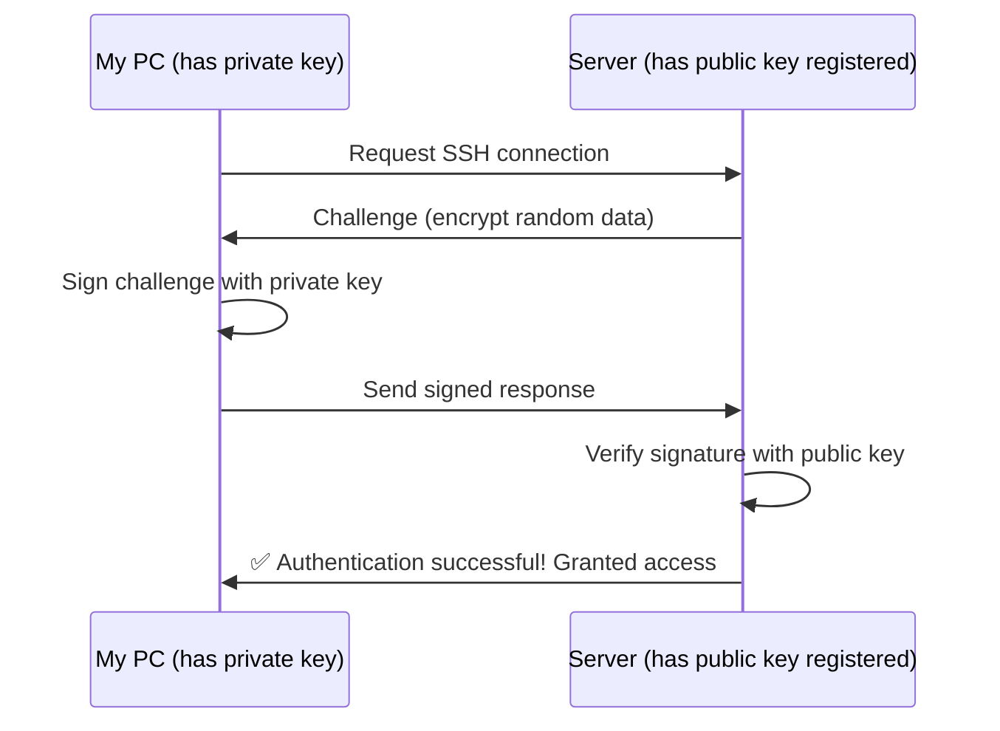
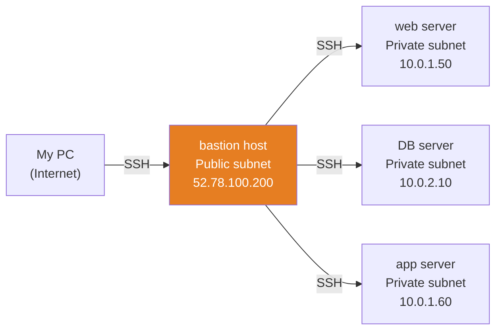
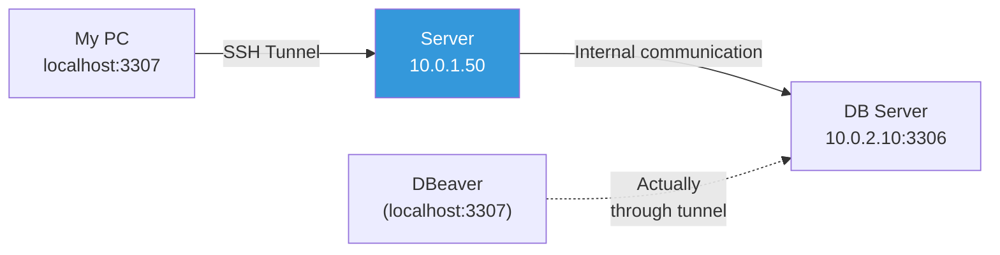
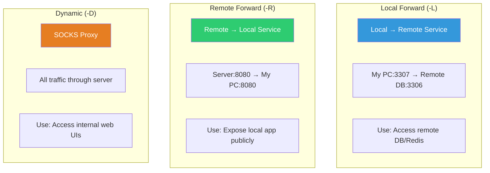

# SSH / bastion host / tunneling

> SSH is the most fundamental way to access servers. It's a command you use dozens of times daily, yet improper configuration can lead to security incidents. This is a double-edged sword. From SSH key authentication and config optimization to bastion host access and tunneling — we'll cover everything you need in real-world work.

---

## 🎯 Why Do You Need to Know This?

```
Common tasks DevOps does with SSH:
• Connect to server for troubleshooting           → ssh user@server
• Repeat tasks across multiple servers            → SSH config + scripts
• Access servers in private subnets               → Via bastion host
• Connect to remote DB from localhost             → SSH tunneling
• Git push/pull                                   → SSH key authentication
• Deploy to server from CI/CD                     → Automated SSH access
• Manage servers with Ansible                     → SSH as transport layer
```

Password authentication is insecure and annoying to type repeatedly. Proper SSH key authentication is **both secure and convenient**.

---

## 🧠 Core Concepts

### Analogy: House Key System

SSH key authentication is a **lock and key** system.

* **Private Key** = Your house key. Only you should have it. Losing it is serious!
* **Public Key** = The lock. You install it on servers you want to access. You can use the same lock on multiple servers.
* **Authentication Process** = The server checks "Does this lock match your key?"



**Password vs SSH Key:**

| Comparison | Password | SSH Key |
|------------|----------|---------|
| Security | Vulnerable to brute force | Inaccessible without key |
| Convenience | Type every time | Set once, automatic |
| Automation | Risky to embed password in scripts | Safe with key file |
| Real-world | ❌ Almost never used | ✅ Standard |

---

## 🔍 Detailed Explanation

### SSH Key Generation

```bash
# Key generation (most common method)
ssh-keygen -t ed25519 -C "alice@company.com"
# Generating public/private ed25519 key pair.
# Enter file in which to save the key (/home/alice/.ssh/id_ed25519): [Enter]
# Enter passphrase (empty for no passphrase): [password or Enter]
# Enter same passphrase again:
# Your identification has been saved in /home/alice/.ssh/id_ed25519
# Your public key has been saved in /home/alice/.ssh/id_ed25519.pub
# The key fingerprint is:
# SHA256:abcdefghijklmnop alice@company.com

# RSA method (legacy system compatibility)
ssh-keygen -t rsa -b 4096 -C "alice@company.com"
```

**Key Type Comparison:**

| Type | Command | Security | Compatibility | Recommend |
|------|---------|----------|-------------------|-----------|
| ed25519 | `ssh-keygen -t ed25519` | Best | Modern servers | ⭐ Recommended |
| RSA 4096 | `ssh-keygen -t rsa -b 4096` | High | Almost all servers | Legacy use |
| ECDSA | `ssh-keygen -t ecdsa` | High | Most | OK |

```bash
# View generated files
ls -la ~/.ssh/
# -rw-------  1 alice alice  464 Mar 12 10:00 id_ed25519      ← Private key (600 required!)
# -rw-r--r--  1 alice alice  104 Mar 12 10:00 id_ed25519.pub  ← Public key

# View public key content
cat ~/.ssh/id_ed25519.pub
# ssh-ed25519 AAAAC3NzaC1lZDI1NTE5AAAAIBxxxxxxxxxxxxxxxxxxxxxxxxxxxxxx alice@company.com
# ^^^^^^^^^^^                                                          ^^^^^^^^^^^^^^^^^
# Key type                                                               Comment

# Never share the private key!
# Public key is safe to share freely.
```

### Register Public Key on Server

```bash
# Method 1: ssh-copy-id (easiest)
ssh-copy-id -i ~/.ssh/id_ed25519.pub ubuntu@10.0.1.50
# /usr/bin/ssh-copy-id: INFO: Source of key(s) to be installed: "/home/alice/.ssh/id_ed25519.pub"
# ubuntu@10.0.1.50's password: [Enter password]
# Number of key(s) added: 1

# Method 2: Manual copy
cat ~/.ssh/id_ed25519.pub | ssh ubuntu@10.0.1.50 "mkdir -p ~/.ssh && chmod 700 ~/.ssh && cat >> ~/.ssh/authorized_keys && chmod 644 ~/.ssh/authorized_keys"

# Method 3: Edit on server directly
# After connecting to server:
echo "ssh-ed25519 AAAAC3NzaC... alice@company.com" >> ~/.ssh/authorized_keys

# Now access is password-free!
ssh ubuntu@10.0.1.50
# → Connects immediately (no password prompt)
```

### SSH File Permissions (Incorrect Permissions = No Access!)

```bash
# Client (my PC)
chmod 700 ~/.ssh                 # Directory
chmod 600 ~/.ssh/id_ed25519      # Private key ⭐
chmod 644 ~/.ssh/id_ed25519.pub  # Public key
chmod 644 ~/.ssh/config          # SSH config
chmod 644 ~/.ssh/known_hosts     # Known hosts

# Server
chmod 700 ~/.ssh                    # Directory
chmod 644 ~/.ssh/authorized_keys    # Registered public keys
# ⚠️ authorized_keys at 600 also works but 644 is standard

# Wrong permissions cause this error:
# @@@@@@@@@@@@@@@@@@@@@@@@@@@@@@@@@@@@@@@@@@@@@@@@@@@@@@@@@@@
# @         WARNING: UNPROTECTED PRIVATE KEY FILE!          @
# @@@@@@@@@@@@@@@@@@@@@@@@@@@@@@@@@@@@@@@@@@@@@@@@@@@@@@@@@@@
# Permissions 0644 for '/home/alice/.ssh/id_ed25519' are too open.
```

---

### Basic SSH Connection

```bash
# Basic format
ssh [user]@[host]

# Examples
ssh ubuntu@10.0.1.50
ssh root@server01.example.com

# Specify port (default 22)
ssh -p 2222 ubuntu@10.0.1.50

# Specify key
ssh -i ~/.ssh/mykey.pem ubuntu@10.0.1.50

# Run command and exit
ssh ubuntu@10.0.1.50 "uptime"
#  14:30:00 up 2 days, 5:30, 1 user, load average: 0.50, 0.30, 0.20

ssh ubuntu@10.0.1.50 "df -h | grep '^/dev'"
# /dev/sda1  50G  15G  33G  32% /

# Run multiple commands
ssh ubuntu@10.0.1.50 "hostname && uptime && df -h /"

# Run script file remotely
ssh ubuntu@10.0.1.50 'bash -s' < local_script.sh

# Copy files (scp)
scp local_file.txt ubuntu@10.0.1.50:/tmp/
scp ubuntu@10.0.1.50:/var/log/syslog /tmp/remote_syslog.log
scp -r local_dir/ ubuntu@10.0.1.50:/opt/    # Copy directory

# Copy files (rsync, more efficient)
rsync -avz local_dir/ ubuntu@10.0.1.50:/opt/app/
rsync -avz ubuntu@10.0.1.50:/var/log/ /tmp/remote_logs/
```

---

### ~/.ssh/config — SSH Config File (★ Productivity Multiplier)

Typing `ssh -i ~/.ssh/mykey.pem -p 2222 ubuntu@10.0.1.50` every time is too long. With config file shortcuts, it becomes `ssh web01`.

```bash
# ~/.ssh/config example
cat ~/.ssh/config
```

```bash
# ────────────────────────────────────
# Global settings (apply to all hosts)
# ────────────────────────────────────
Host *
    ServerAliveInterval 60          # Send keepalive every 60 seconds (prevent disconnection)
    ServerAliveCountMax 3           # Drop connection after 3 no-response
    AddKeysToAgent yes              # Auto-add key to ssh-agent
    StrictHostKeyChecking ask       # Verify fingerprint on first connection

# ────────────────────────────────────
# Individual server settings
# ────────────────────────────────────

# Web server
Host web01
    HostName 10.0.1.50
    User ubuntu
    Port 22
    IdentityFile ~/.ssh/id_ed25519

# DB server
Host db01
    HostName 10.0.2.10
    User admin
    Port 22
    IdentityFile ~/.ssh/id_ed25519

# Production bastion (jump server)
Host bastion-prod
    HostName 52.78.100.200
    User ec2-user
    Port 22
    IdentityFile ~/.ssh/prod-key.pem

# Private server via bastion (⭐ ProxyJump)
Host prod-web01
    HostName 10.0.1.50              # Private IP
    User ubuntu
    IdentityFile ~/.ssh/prod-key.pem
    ProxyJump bastion-prod          # Go through bastion!

Host prod-db01
    HostName 10.0.2.10
    User ubuntu
    IdentityFile ~/.ssh/prod-key.pem
    ProxyJump bastion-prod

# AWS EC2 (pem key)
Host aws-dev
    HostName ec2-12-34-56-78.ap-northeast-2.compute.amazonaws.com
    User ec2-user
    IdentityFile ~/.ssh/aws-dev-key.pem

# Wildcard (pattern matching)
Host prod-*
    User ubuntu
    IdentityFile ~/.ssh/prod-key.pem
    ProxyJump bastion-prod
```

```bash
# Connection becomes simple after config setup!

# Before:
ssh -i ~/.ssh/prod-key.pem -o ProxyCommand="ssh -W %h:%p -i ~/.ssh/prod-key.pem ec2-user@52.78.100.200" ubuntu@10.0.1.50

# After config:
ssh prod-web01
# Done!

# scp also works with aliases
scp file.txt prod-web01:/tmp/

# rsync also works
rsync -avz ./deploy/ prod-web01:/opt/app/
```

---

### bastion host (Jump Server)

You can't directly access servers in private subnets. You go through a bastion host in a public subnet.



**Why use bastion?**
* Private servers unreachable from internet (secure!)
* Only bastion exposed publicly → Minimize attack surface
* All access logs on bastion → Auditable

#### 3 Connection Methods

```bash
# Method 1: Double SSH (manual)
ssh ec2-user@52.78.100.200        # Connect to bastion
ssh ubuntu@10.0.1.50               # From bastion, connect to internal server
# → Tedious and requires key on bastion (security risk)

# Method 2: ProxyJump (recommended! ⭐)
ssh -J ec2-user@52.78.100.200 ubuntu@10.0.1.50
# → Goes through bastion but key only on my PC!
# → SSH config with ProxyJump makes it even simpler

# Method 3: ProxyCommand (legacy)
ssh -o ProxyCommand="ssh -W %h:%p ec2-user@52.78.100.200" ubuntu@10.0.1.50
```

```bash
# SSH config setup (as shown above):
Host bastion-prod
    HostName 52.78.100.200
    User ec2-user
    IdentityFile ~/.ssh/prod-key.pem

Host prod-web01
    HostName 10.0.1.50
    User ubuntu
    IdentityFile ~/.ssh/prod-key.pem
    ProxyJump bastion-prod

# Connection:
ssh prod-web01
# → Automatically goes bastion → internal server!

# File copy via bastion:
scp file.txt prod-web01:/tmp/
rsync -avz ./app/ prod-web01:/opt/app/
```

#### Strengthen Bastion Host Security

```bash
# Settings required on bastion server:

# 1. Allow only SSH key authentication (disable password login)
# /etc/ssh/sshd_config:
# PasswordAuthentication no
# PubkeyAuthentication yes

# 2. Block root login
# PermitRootLogin no

# 3. Allow only specific users
# AllowUsers ec2-user admin

# 4. Check access logs
grep "Accepted" /var/log/auth.log | tail -10
# Mar 12 10:00:00 bastion sshd[1234]: Accepted publickey for ec2-user from 203.0.113.5 port 54321
# Mar 12 10:05:00 bastion sshd[1235]: Accepted publickey for ec2-user from 203.0.113.5 port 54322
```

---

### SSH Tunneling (Port Forwarding)

SSH tunneling forwards traffic from one port through an SSH connection to another service. Useful for bypassing firewalls or safely accessing remote services locally.

#### Local Port Forwarding (Most Common!)

**"Connect local port to remote service"**



```bash
# Format: ssh -L [local_port]:[destination]:[destination_port] [server]

# Example 1: Access remote DB locally
ssh -L 3307:10.0.2.10:3306 ubuntu@10.0.1.50
# → localhost:3307 connects to 10.0.2.10:3306 (MySQL)

# In another terminal:
mysql -h 127.0.0.1 -P 3307 -u dbuser -p
# → Actually connecting to remote DB!

# Example 2: Access remote Redis
ssh -L 6380:10.0.3.10:6379 ubuntu@10.0.1.50
# → localhost:6380 connects to remote Redis

redis-cli -h 127.0.0.1 -p 6380

# Example 3: Access remote web admin console
ssh -L 9090:localhost:9090 ubuntu@10.0.1.50
# → localhost:9090 in browser connects to server's Prometheus UI

# Open tunnel in background (no shell needed)
ssh -L 3307:10.0.2.10:3306 -N -f ubuntu@10.0.1.50
# -N: Don't run remote command
# -f: Background

# Verify tunnel
ss -tlnp | grep 3307
# LISTEN  0  128  127.0.0.1:3307  0.0.0.0:*  users:(("ssh",pid=5000,fd=5))

# Close tunnel
kill $(lsof -t -i :3307)
```

#### Tunneling via Bastion

```bash
# Tunnel to private DB through bastion
ssh -L 3307:10.0.2.10:3306 -J ec2-user@52.78.100.200 ubuntu@10.0.1.50

# With SSH config:
ssh -L 3307:10.0.2.10:3306 prod-web01

# Or configure tunnel in config:
# ~/.ssh/config add:
# Host prod-db-tunnel
#     HostName 10.0.1.50
#     User ubuntu
#     IdentityFile ~/.ssh/prod-key.pem
#     ProxyJump bastion-prod
#     LocalForward 3307 10.0.2.10:3306
#     LocalForward 6380 10.0.3.10:6379

# Then:
ssh prod-db-tunnel
# → Auto-opens bastion → opens DB/Redis tunnels!
```

#### Remote Port Forwarding

**"Connect remote port to local service"** — Expose your local service to external access.

```bash
# Format: ssh -R [remote_port]:[local_destination]:[local_port] [server]

# Example: Expose local dev app (8080) to server
ssh -R 8080:localhost:8080 ubuntu@10.0.1.50
# → Server can access localhost:8080 and reach your local 8080

# Real use: Webhook testing, demo sharing
# (Usually use ngrok or similar instead)
```

#### Dynamic Port Forwarding (SOCKS Proxy)

```bash
# Use SSH as SOCKS5 proxy
ssh -D 1080 ubuntu@10.0.1.50
# → localhost:1080 becomes SOCKS5 proxy
# → Set browser proxy to localhost:1080
# → All web traffic goes through server

# Real use: Access internal web UIs
# (Grafana, Prometheus, Kibana on internal network only)
```



---

### SSH Server Configuration (/etc/ssh/sshd_config)

Strengthen security with SSH server-side configuration.

```bash
sudo vim /etc/ssh/sshd_config
```

```bash
# ─── Security Essential Settings ───

# Enable SSH key authentication
PubkeyAuthentication yes

# Disable password authentication (⭐ Most important!)
PasswordAuthentication no

# Block root login
PermitRootLogin no
# Or allow key auth only
# PermitRootLogin prohibit-password

# Block empty passwords
PermitEmptyPasswords no

# ─── Access Control ───

# Allow only specific users
AllowUsers ubuntu deploy
# Or specific groups
AllowGroups ssh-users

# ─── Performance/Stability ───

# Connection timeout
LoginGraceTime 30           # Drop if no auth within 30 seconds
MaxAuthTries 3              # Max 3 auth attempts
ClientAliveInterval 300     # Keepalive every 5 minutes
ClientAliveCountMax 2       # Drop after 2 no-response

# ─── Change Port (Optional) ───
# Port 2222                 # Use different port instead of 22 (avoid scan)

# ─── Additional Security ───
X11Forwarding no            # Disable X11 forwarding
AllowTcpForwarding yes      # Allow tunneling (if needed)
MaxSessions 5               # Limit concurrent sessions
```

```bash
# After config changes, always test!

# 1. Check syntax
sudo sshd -t
# (No output if OK = no errors)

# 2. Restart SSH (current session stays)
sudo systemctl restart sshd

# 3. ⚠️ Test from NEW terminal! (Don't close current!)
# New terminal:
ssh ubuntu@10.0.1.50
# If it works, good. If not, revert in current session!
```

---

### ssh-agent — Key Management

If you set a passphrase on your key, you'd need to enter it each time. ssh-agent remembers for you.

```bash
# Start ssh-agent (usually auto-running)
eval "$(ssh-agent -s)"
# Agent pid 12345

# Register key
ssh-add ~/.ssh/id_ed25519
# Enter passphrase for /home/alice/.ssh/id_ed25519: [Enter]
# Identity added: /home/alice/.ssh/id_ed25519 (alice@company.com)

# View registered keys
ssh-add -l
# 256 SHA256:abcdefg... alice@company.com (ED25519)

# Register multiple keys
ssh-add ~/.ssh/prod-key.pem
ssh-add ~/.ssh/github-key

# Remove key
ssh-add -d ~/.ssh/id_ed25519    # Specific key
ssh-add -D                       # All keys

# macOS: Persist to keychain
ssh-add --apple-use-keychain ~/.ssh/id_ed25519
```

### SSH Agent Forwarding

When jumping through bastion to internal servers, use **my PC's key without uploading to bastion**.

```bash
# Enable agent forwarding
ssh -A ec2-user@bastion
# → bastion can access my PC's ssh-agent
# → bastion doesn't need key files to access internal servers!

ssh ubuntu@10.0.1.50    # From bastion, use my PC's key

# SSH config:
Host bastion-prod
    HostName 52.78.100.200
    User ec2-user
    ForwardAgent yes        # ← Agent forwarding

# ⚠️ Security caution: Use only on trusted servers!
# If bastion is hacked, attacker can use your keys
# → ProxyJump is safer alternative!
```

---

### Session Recording (Access Logging)

Record who accessed server and what they did.

```bash
# Method 1: script command (simplest)
# Auto-record session on login
# /etc/profile.d/session-record.sh:
if [ -n "$SSH_CONNECTION" ] && [ -z "$SESSION_RECORDED" ]; then
    export SESSION_RECORDED=1
    LOGDIR="/var/log/sessions"
    mkdir -p "$LOGDIR"
    LOGFILE="$LOGDIR/$(whoami)_$(date +%Y%m%d_%H%M%S)_$$.log"
    script -q -a "$LOGFILE"
    exit
fi

# Method 2: auditd (Linux audit system)
# Audit SSH logins
sudo auditctl -w /var/log/auth.log -p wa -k ssh_logins

# Audit command execution
sudo auditctl -a always,exit -F arch=b64 -S execve -k commands

# View audit logs
sudo ausearch -k commands --start today

# Method 3: AWS SSM Session Manager (cloud recommended)
# → Access without SSH, web console/CLI
# → Auto-record all sessions to CloudWatch/S3
# → No bastion needed
```

---

## 💻 Practice Examples

### Practice 1: SSH Key Generation and Connection

```bash
# 1. Generate key
ssh-keygen -t ed25519 -C "devops-practice" -f ~/.ssh/practice_key
# Passphrase: blank (for practice)

# 2. Verify key
ls -la ~/.ssh/practice_key*
# -rw-------  1 alice alice 464 ... practice_key
# -rw-r--r--  1 alice alice 104 ... practice_key.pub

# 3. View public key
cat ~/.ssh/practice_key.pub

# 4. (Local test) Register with self
cat ~/.ssh/practice_key.pub >> ~/.ssh/authorized_keys

# 5. Test self-connection
ssh -i ~/.ssh/practice_key localhost "echo 'SSH key auth success!'"
# SSH key auth success!

# 6. Cleanup
sed -i '/devops-practice/d' ~/.ssh/authorized_keys
rm ~/.ssh/practice_key*
```

### Practice 2: SSH Config Setup

```bash
# 1. Create config file
cat << 'EOF' > ~/.ssh/config
Host *
    ServerAliveInterval 60
    ServerAliveCountMax 3

Host myserver
    HostName 127.0.0.1
    User $(whoami)
    Port 22
    IdentityFile ~/.ssh/id_ed25519
EOF

chmod 644 ~/.ssh/config

# 2. Test alias connection
ssh myserver "hostname"

# 3. Example: Multiple servers
cat << 'EOF' >> ~/.ssh/config

# Host web01
#     HostName 10.0.1.50
#     User ubuntu
#
# Host web02
#     HostName 10.0.1.51
#     User ubuntu
#
# Host db01
#     HostName 10.0.2.10
#     User admin
EOF
```

### Practice 3: Experience SSH Tunneling

```bash
# Test tunneling with local web server

# Terminal 1: Start local web server (port 8888)
python3 -m http.server 8888
# Serving HTTP on 0.0.0.0 port 8888 ...

# Terminal 2: Tunnel another port (9999 → 8888)
ssh -L 9999:localhost:8888 localhost -N
# (Keep running, Ctrl+C stops)

# Terminal 3: Access via tunnel
curl http://localhost:9999
# → Port 8888 content visible through 9999!

# Verify tunnel with ss
ss -tlnp | grep 9999
# LISTEN  0  128  127.0.0.1:9999  0.0.0.0:*  users:(("ssh",...))
```

### Practice 4: Run Commands Across Multiple Servers

```bash
# Run commands on multiple servers via SSH config

# servers.txt file
cat << 'EOF' > /tmp/servers.txt
web01
web02
web03
EOF

# Run uptime on all servers
while read server; do
    echo "=== $server ==="
    ssh "$server" "uptime" 2>/dev/null || echo "  Connection failed"
done < /tmp/servers.txt

# Check disk usage on all servers
while read server; do
    echo "=== $server ==="
    ssh "$server" "df -h / | tail -1" 2>/dev/null || echo "  Connection failed"
done < /tmp/servers.txt

# Parallel execution (faster)
cat /tmp/servers.txt | xargs -I{} -P 5 ssh {} "hostname && uptime"
```

---

## 🏢 Real-World Scenarios

### Scenario 1: Set Up New Server Access

```bash
# When you create new EC2 instance in AWS

# 1. Set key permissions
chmod 400 ~/Downloads/new-server-key.pem
mv ~/Downloads/new-server-key.pem ~/.ssh/

# 2. Test connection
ssh -i ~/.ssh/new-server-key.pem ec2-user@52.78.200.100
# The authenticity of host '52.78.200.100' can't be established.
# ED25519 key fingerprint is SHA256:xxxxx
# Are you sure you want to continue connecting (yes/no)? yes

# 3. Add to SSH config
cat << 'EOF' >> ~/.ssh/config

Host new-server
    HostName 52.78.200.100
    User ec2-user
    IdentityFile ~/.ssh/new-server-key.pem
EOF

# 4. Now simple connection
ssh new-server

# 5. Disable password auth (security)
ssh new-server "sudo sed -i 's/^PasswordAuthentication yes/PasswordAuthentication no/' /etc/ssh/sshd_config"
ssh new-server "sudo systemctl restart sshd"
```

### Scenario 2: Access Production DB Locally (Tunneling)

```bash
# Situation: Production RDS not directly accessible (private subnet)
# Solution: bastion → app server → RDS tunnel

# 1. Open tunnel
ssh -L 5433:prod-rds.cluster-abc123.ap-northeast-2.rds.amazonaws.com:5432 prod-web01 -N -f

# 2. Connect from localhost
psql -h localhost -p 5433 -U myuser -d mydb
# → Actually connected to production RDS!

# 3. Use with GUI tools (DBeaver, DataGrip)
# Host: localhost
# Port: 5433
# → Browse production DB through tunnel

# 4. Close tunnel when done
kill $(lsof -t -i :5433)
```

### Scenario 3: Deploy from CI/CD via SSH

```bash
# GitHub Actions example deploying via SSH

# 1. Add SSH key to GitHub Secrets
# Settings → Secrets → SSH_PRIVATE_KEY

# 2. Workflow file (.github/workflows/deploy.yml):
# jobs:
#   deploy:
#     steps:
#       - name: Setup SSH
#         run: |
#           mkdir -p ~/.ssh
#           echo "${{ secrets.SSH_PRIVATE_KEY }}" > ~/.ssh/deploy_key
#           chmod 600 ~/.ssh/deploy_key
#           ssh-keyscan -H 10.0.1.50 >> ~/.ssh/known_hosts
#
#       - name: Deploy
#         run: |
#           ssh -i ~/.ssh/deploy_key ubuntu@10.0.1.50 "cd /opt/app && git pull && systemctl restart myapp"

# Register public key on server (deploy user):
# Done once, then CI/CD can deploy without password
```

### Scenario 4: Debug SSH Connection Problems

```bash
# "SSH connection won't work!" debugging sequence

# 1. Try verbose mode first (most important!)
ssh -vvv ubuntu@10.0.1.50

# Look for in output:
# debug1: Connecting to 10.0.1.50 port 22.        ← Attempting connection
# debug1: Connection established.                   ← TCP success?
# debug1: Offering public key: /home/alice/.ssh/id_ed25519  ← Offering key
# debug1: Server accepts key: /home/alice/.ssh/id_ed25519   ← Server accepts?
# debug1: Authentication succeeded (publickey).    ← Auth success?

# 2. Connection itself failing (Connection timed out / refused)
ping -c 3 10.0.1.50                  # Network connectivity
nc -zv 10.0.1.50 22                  # Port 22 open?
sudo iptables -L -n | grep 22       # Firewall check

# 3. Key rejected (Permission denied)
ssh -vvv ubuntu@10.0.1.50 2>&1 | grep "Offering\|Server accepts\|Authentication"
# → Public key not registered on server, or
# → Wrong permissions (chmod 600), or
# → Using wrong key (-i to specify key)

# 4. Check on server side
sudo tail -f /var/log/auth.log
# Try connection, see real-time errors
# "Authentication refused: bad ownership or modes for directory /home/ubuntu/.ssh"
# → Permission issue!
```

---

## ⚠️ Common Mistakes

### 1. Private Key Permissions Too Open

```bash
# ❌
-rw-r--r-- id_ed25519    # 644 → SSH rejects!

# ✅
-rw------- id_ed25519    # 600
chmod 600 ~/.ssh/id_ed25519
```

### 2. Don't Test Key Before Disabling Password Auth

```bash
# ❌ Disable password before testing key auth
# → Can't access server! Console access only

# ✅ Sequence:
# 1. Register SSH key
# 2. Test key in NEW terminal (current session OK!)
# 3. Only then set PasswordAuthentication no
# 4. Restart sshd
# 5. Test again with key in new terminal
```

### 3. Ignore known_hosts Warning

```bash
# This warning:
# @@@@@@@@@@@@@@@@@@@@@@@@@@@@@@@@@@@@@@@@@@@@@@@@@@@@@@@@@@@
# @ WARNING: REMOTE HOST IDENTIFICATION HAS CHANGED!       @
# @@@@@@@@@@@@@@@@@@@@@@@@@@@@@@@@@@@@@@@@@@@@@@@@@@@@@@@@@@@

# Means: Server fingerprint changed from before
# Reason 1: Server reinstalled → Normal
# Reason 2: Man-in-the-middle attack → Dangerous!

# If server reinstalled:
ssh-keygen -R 10.0.1.50    # Delete old fingerprint
ssh ubuntu@10.0.1.50        # Register new one

# ❌ Don't habitually use StrictHostKeyChecking=no
ssh -o StrictHostKeyChecking=no ubuntu@10.0.1.50    # Security risk!
```

### 4. Upload Private Key to Bastion

```bash
# ❌ Copy private key to bastion
scp ~/.ssh/id_ed25519 bastion:/home/ec2-user/.ssh/
# → If bastion is hacked, your key is stolen!

# ✅ Use ProxyJump (key stays on my PC)
ssh -J bastion-prod prod-web01
# → Key never touches bastion
```

### 5. Type Long Commands Without SSH Config

```bash
# ❌ Type this every time
ssh -i ~/.ssh/prod-key.pem -o ProxyCommand="ssh -W %h:%p -i ~/.ssh/prod-key.pem ec2-user@52.78.100.200" ubuntu@10.0.1.50

# ✅ SSH config setup once:
ssh prod-web01
```

---

## 📝 Summary

### SSH Cheat Sheet

```bash
# === Key Management ===
ssh-keygen -t ed25519 -C "email"        # Generate key
ssh-copy-id -i ~/.ssh/key.pub user@host # Register public key
ssh-add ~/.ssh/key                       # Add to agent
ssh-add -l                               # List registered keys

# === Connection ===
ssh user@host                            # Basic
ssh -i key.pem user@host                 # Specify key
ssh -p 2222 user@host                    # Specify port
ssh -J bastion user@internal             # Via bastion
ssh user@host "command"                  # Run remote command

# === Tunneling ===
ssh -L local_port:destination:port server           # Local forward
ssh -R remote_port:destination:port server          # Remote forward
ssh -D 1080 server                                   # SOCKS proxy
ssh -L 3307:db:3306 -N -f server                    # Background tunnel

# === File Transfer ===
scp file user@host:/path                 # Copy file
rsync -avz dir/ user@host:/path/         # Sync (efficient)

# === Debugging ===
ssh -vvv user@host                       # Verbose logs
```

### SSH Security Checklist

```
✅ Use ed25519 or RSA 4096 key
✅ Private key permissions 600, .ssh directory 700
✅ PasswordAuthentication no (server)
✅ PermitRootLogin no (server)
✅ Manage access with SSH config
✅ When using bastion, use ProxyJump (don't upload key)
✅ Test key auth before disabling password auth
✅ After config changes, test in new terminal before closing current
```

---

## 🔗 Next Lecture

Next is **[01-linux/11-bash-scripting.md — bash scripting / shell pipeline](./11-bash-scripting)**.

We'll combine all the Linux commands you've learned to create automation scripts. Automating repetitive work is the core of DevOps.
