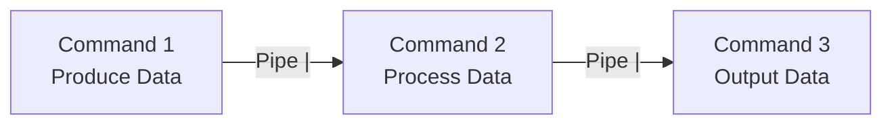
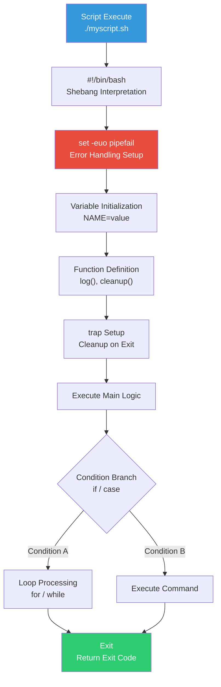
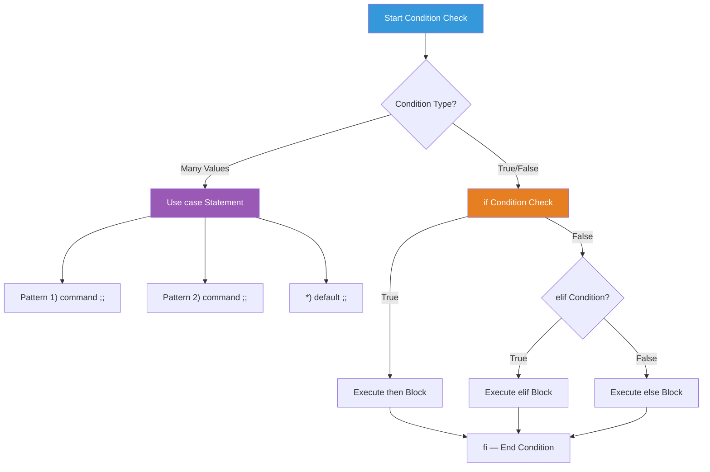
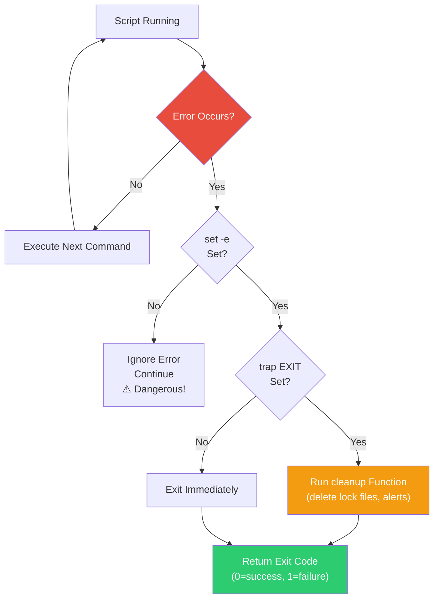

# Bash Scripting / Shell Pipeline

> Typing out each command one at a time has its limits. What if you need to perform the same operation on 10 servers? What if there's a task you repeat daily? Scripts solve this problem in one go. DevOps automation begins here.

---

## 🎯 Why Should You Know This?

```
Real-world automation tasks with scripts:
• Server health checks (disk, memory, processes)    → health-check.sh
• Log cleanup + old file deletion                  → cleanup.sh
• Deployment scripts (pull code → build → restart) → deploy.sh
• DB backup + S3 upload                            → backup.sh
• Execute commands on multiple servers simultaneously → multi-exec.sh
• Environment variable setup / initialization       → setup.sh
• Monitoring + alerting (notify Slack if disk >80%) → alert.sh
```

Bash scripting is "creating programs by combining Linux commands." It's not a new programming language—it's a combination of the commands you've already learned.

---

## 🧠 Core Concepts

### Analogy: Recipe vs. Cooking on the Fly

* **Running commands directly** = A chef improvising while cooking
* **Script** = A written recipe. Anyone can follow it and repeat it consistently

### Pipeline — Connecting Commands with Pipes



```bash
# The pipe (|) passes the output of the previous command as input to the next

# Example: process list → filter for nginx → count lines
ps aux | grep nginx | grep -v grep | wc -l
# 3
```

---

## 🔍 Detailed Explanation — Shell Pipeline

Before learning scripting, you must understand the pipeline—how to connect commands. This is bash's true power.

### Pipe (`|`)

```bash
# Pass output from one command as input to the next
cat /var/log/syslog | grep error | wc -l
# 42

# Real-world examples:

# Top 5 processes consuming the most memory
ps aux --sort=-%mem | head -6
# USER  PID  %CPU %MEM  VSZ    RSS   ... COMMAND
# mysql 3000  1.2 10.0  123456 40960 ... mysqld
# root  2000  2.5  5.0  71234  20480 ... dockerd
# ...

# Top 10 error frequencies in logs
cat /var/log/syslog | awk '{print $5}' | cut -d'[' -f1 | sort | uniq -c | sort -rn | head -10
#  1500 systemd
#   800 CRON
#   300 sshd

# Find partitions with disk usage over 80%
df -h | awk 'NR>1 {gsub(/%/,"",$5); if($5>80) print $0}'
# /dev/sda1  50G  45G  3.0G  94% /

# Current connected IP list
ss -tn | awk 'NR>1 {print $5}' | cut -d: -f1 | sort -u
# 10.0.0.5
# 10.0.0.10
# 10.0.0.100
```

### Redirection (`>`, `>>`, `<`, `2>`)

```bash
# > : save output to file (overwrite)
echo "hello" > /tmp/test.txt
cat /tmp/test.txt
# hello

# >> : append output to file
echo "world" >> /tmp/test.txt
cat /tmp/test.txt
# hello
# world

# < : use file as input
wc -l < /etc/passwd
# 35

# 2> : redirect error output to file
find / -name "*.conf" 2> /tmp/errors.txt    # errors to file, results to screen

# 2>&1 : merge error output with standard output
find / -name "*.conf" > /tmp/all.txt 2>&1   # both results and errors to file

# /dev/null : discard output (black hole)
find / -name "*.conf" 2>/dev/null            # ignore errors
command > /dev/null 2>&1                     # discard all output (common in cron)
```

### Command Chaining (`&&`, `||`, `;`)

```bash
# && : execute next only if previous succeeds
mkdir /tmp/newdir && echo "Directory created successfully"
# Directory created successfully

# || : execute next only if previous fails
mkdir /tmp/newdir || echo "Directory already exists"
# Directory already exists

# ; : execute sequentially regardless of success/failure
echo "start"; sleep 1; echo "end"
# start
# (after 1 second)
# end

# Real-world combination
cd /opt/app && git pull && npm install && systemctl restart myapp || echo "Deployment failed!"
# → If any step fails, the rest won't run and displays "Deployment failed!"
```

### Substitution (`$()`, `` ` ` ``)

```bash
# $() : use command result as a variable (recommended)
echo "Current date: $(date)"
# Current date: Wed Mar 12 14:30:00 UTC 2025

echo "Current user: $(whoami)"
# Current user: ubuntu

echo "Process count: $(ps aux | wc -l)"
# Process count: 150

# Store in variable
HOSTNAME=$(hostname)
IP=$(ip -4 addr show eth0 | grep inet | awk '{print $2}' | cut -d/ -f1)
echo "Server: $HOSTNAME ($IP)"
# Server: web01 (10.0.1.50)

# Nesting is possible (backticks cannot be nested)
echo "Large files: $(find /var/log -type f -size +100M -exec ls -lh {} \; 2>/dev/null | awk '{print $5, $9}')"
```

### xargs — Convert Pipe Data to Arguments

```bash
# Convert piped data into command arguments

# Find and delete .tmp files in /tmp
find /tmp -name "*.tmp" -mtime +7 | xargs rm -f

# Ping multiple servers (servers.txt contains IP list)
cat servers.txt | xargs -I{} ping -c 1 {} 2>/dev/null

# Parallel execution (-P option)
cat servers.txt | xargs -I{} -P 5 ssh {} "uptime"
# → Execute 5 at a time

# Apply grep to found files
find /etc -name "*.conf" | xargs grep "listen" 2>/dev/null

# Process line by line
echo -e "file1\nfile2\nfile3" | xargs -I{} echo "Processing: {}"
# Processing: file1
# Processing: file2
# Processing: file3
```

---

## 🔍 Detailed Explanation — Bash Scripting

### Bash Script Execution Flow

When a script runs, it processes top-to-bottom sequentially. Seeing the entire flow visually makes it easier to understand.



### Basic Script Structure

```bash
#!/bin/bash
# ↑ shebang: tells the system to execute this script with bash

# Explanatory comments
# Author: DevOps Team
# Purpose: Server health check

# Stop immediately on error (essential in production!)
set -euo pipefail

# Variables
NAME="hello"
echo "$NAME"
```

**Each option in `set -euo pipefail`:**

| Option | Meaning | Without it? |
|--------|---------|------------|
| `-e` | Exit immediately on error | Errors are ignored and execution continues (dangerous!) |
| `-u` | Error if undefined variable is used | Treats as empty value (source of bugs) |
| `-o pipefail` | Detects errors in middle of pipe | Only the last command status matters |

```bash
# Dangerous example without -e
#!/bin/bash
cd /nonexistent/directory    # Fails but continues!
rm -rf *                     # Deletes all files in current dir (/)!!! 😱

# With -e
#!/bin/bash
set -e
cd /nonexistent/directory    # Fails → script stops immediately ✅
rm -rf *                     # This line never executes
```

### Variables

```bash
#!/bin/bash

# Variable declaration (no spaces around =!)
NAME="ubuntu"
PORT=8080
LOG_DIR="/var/log/myapp"

# ❌ This is wrong
# NAME = "ubuntu"    # Error! No spaces allowed

# Use variables ($ or ${})
echo "User: $NAME"
echo "Port: ${PORT}"
echo "Logs: ${LOG_DIR}/app.log"

# ${} is necessary when variable boundary is ambiguous
FILE="report"
echo "${FILE}_2025.txt"    # report_2025.txt
echo "$FILE_2025.txt"      # empty (looks for FILE_2025 variable!)

# Environment variables (export)
export APP_ENV="production"
# → accessible in child processes

# Default values
DB_HOST="${DB_HOST:-localhost}"     # Use localhost if DB_HOST is empty
DB_PORT="${DB_PORT:-3306}"         # Use 3306 if DB_PORT is empty

# Read-only variables
readonly VERSION="1.0.0"
# VERSION="2.0.0"    # Error! Cannot change

# Special variables
echo "Script name: $0"
echo "First argument: $1"
echo "Second argument: $2"
echo "All arguments: $@"
echo "Number of arguments: $#"
echo "Previous command exit code: $?"
echo "Current PID: $$"
```

### Conditional Statements (if)

Seeing the branching flow visually makes it easier to understand when to use if/elif/else versus case.



```bash
#!/bin/bash

# Basic format
if [ condition ]; then
    # When true
elif [ condition2 ]; then
    # When condition2 is true
else
    # When all conditions are false
fi

# === String Comparison ===
NAME="ubuntu"

if [ "$NAME" = "ubuntu" ]; then
    echo "You are an Ubuntu user"
fi

if [ "$NAME" != "root" ]; then
    echo "You are not root"
fi

if [ -z "$NAME" ]; then    # True if empty
    echo "Name is empty"
fi

if [ -n "$NAME" ]; then    # True if not empty
    echo "Name: $NAME"
fi

# === Numeric Comparison ===
COUNT=10

if [ "$COUNT" -eq 10 ]; then echo "It is 10"; fi     # equal
if [ "$COUNT" -ne 5 ]; then echo "Not 5"; fi         # not equal
if [ "$COUNT" -gt 5 ]; then echo "Greater than 5"; fi   # greater than
if [ "$COUNT" -lt 20 ]; then echo "Less than 20"; fi # less than
if [ "$COUNT" -ge 10 ]; then echo "10 or more"; fi       # greater or equal
if [ "$COUNT" -le 10 ]; then echo "10 or less"; fi       # less or equal

# === File Checking ===
if [ -f "/etc/nginx/nginx.conf" ]; then
    echo "Nginx config file exists"
fi

if [ -d "/var/log/nginx" ]; then
    echo "Nginx log directory exists"
fi

if [ ! -f "/opt/app/config.yaml" ]; then
    echo "Config file is missing!"
    exit 1
fi

# File check types
# -f : File exists and is a regular file
# -d : Directory exists
# -e : File or directory exists
# -r : Have read permission
# -w : Have write permission
# -x : Have execute permission
# -s : File size greater than 0 (not empty)

# === [[ ]] Advanced Conditions (bash-specific, recommended) ===
# Pattern matching
if [[ "$NAME" == ubuntu* ]]; then
    echo "Starts with ubuntu"
fi

# Regular expressions
if [[ "$NAME" =~ ^[a-z]+$ ]]; then
    echo "Consists of lowercase letters only"
fi

# AND / OR
if [[ "$NAME" = "ubuntu" && "$COUNT" -gt 5 ]]; then
    echo "Both conditions met"
fi

if [[ "$NAME" = "root" || "$COUNT" -gt 100 ]]; then
    echo "At least one is true"
fi
```

### Loops (for, while)

```bash
#!/bin/bash

# === for Loop ===

# Iterate through list
for server in web01 web02 web03 db01; do
    echo "Processing: $server"
done
# Processing: web01
# Processing: web02
# Processing: web03
# Processing: db01

# Range
for i in {1..5}; do
    echo "Number: $i"
done

# C-style
for ((i=0; i<5; i++)); do
    echo "Index: $i"
done

# Iterate through files
for file in /var/log/*.log; do
    SIZE=$(du -sh "$file" 2>/dev/null | awk '{print $1}')
    echo "$file: $SIZE"
done
# /var/log/auth.log: 125K
# /var/log/syslog: 85K
# ...

# Iterate through command results
for pid in $(pgrep nginx); do
    echo "Nginx PID: $pid"
done

# === while Loop ===

# Basic
COUNT=0
while [ $COUNT -lt 5 ]; do
    echo "Count: $COUNT"
    COUNT=$((COUNT + 1))
done

# Read file line by line (very common!)
while IFS= read -r line; do
    echo "Server: $line"
    ssh "$line" "uptime" 2>/dev/null || echo "  Connection failed"
done < servers.txt

# Infinite loop (monitoring)
while true; do
    echo "$(date) - Disk: $(df -h / | tail -1 | awk '{print $5}')"
    sleep 60
done

# Read from pipe
ps aux | while read -r line; do
    cpu=$(echo "$line" | awk '{print $3}')
    if (( $(echo "$cpu > 50" | bc -l) )); then
        echo "High CPU: $line"
    fi
done
```

### Functions

```bash
#!/bin/bash

# Function definition
log_info() {
    echo "[$(date '+%Y-%m-%d %H:%M:%S')] [INFO] $1"
}

log_error() {
    echo "[$(date '+%Y-%m-%d %H:%M:%S')] [ERROR] $1" >&2
}

check_disk() {
    local threshold=${1:-80}    # local: function-scoped variable
    local usage

    usage=$(df -h / | tail -1 | awk '{gsub(/%/,""); print $5}')

    if [ "$usage" -gt "$threshold" ]; then
        log_error "Disk usage ${usage}% (threshold: ${threshold}%)"
        return 1
    else
        log_info "Disk healthy: ${usage}%"
        return 0
    fi
}

check_service() {
    local service=$1

    if systemctl is-active "$service" > /dev/null 2>&1; then
        log_info "$service: running ✅"
        return 0
    else
        log_error "$service: stopped ❌"
        return 1
    fi
}

# Call functions
log_info "Starting server health check"
check_disk 80
check_service nginx
check_service docker
log_info "Check complete"

# Output:
# [2025-03-12 14:30:00] [INFO] Starting server health check
# [2025-03-12 14:30:00] [INFO] Disk healthy: 53%
# [2025-03-12 14:30:00] [INFO] nginx: running ✅
# [2025-03-12 14:30:00] [INFO] docker: running ✅
# [2025-03-12 14:30:00] [INFO] Check complete
```

### Argument Processing

```bash
#!/bin/bash
# deploy.sh — deployment script

set -euo pipefail

# Print usage
usage() {
    cat << EOF
Usage: $0 [options]

Options:
  -e, --env ENV      Environment (dev|staging|prod) [required]
  -b, --branch NAME  Branch name (default: main)
  -r, --restart       Restart service
  -h, --help          Help message

Examples:
  $0 -e staging -b feature/new-api -r
  $0 --env prod --branch main
EOF
    exit 1
}

# Default values
ENV=""
BRANCH="main"
RESTART=false

# Parse arguments
while [[ $# -gt 0 ]]; do
    case $1 in
        -e|--env)
            ENV="$2"
            shift 2
            ;;
        -b|--branch)
            BRANCH="$2"
            shift 2
            ;;
        -r|--restart)
            RESTART=true
            shift
            ;;
        -h|--help)
            usage
            ;;
        *)
            echo "Unknown option: $1"
            usage
            ;;
    esac
done

# Validate required arguments
if [ -z "$ENV" ]; then
    echo "Error: -e (environment) option is required!"
    usage
fi

if [[ "$ENV" != "dev" && "$ENV" != "staging" && "$ENV" != "prod" ]]; then
    echo "Error: Environment must be dev, staging, or prod."
    exit 1
fi

echo "Environment: $ENV"
echo "Branch: $BRANCH"
echo "Restart: $RESTART"

# Execution:
# ./deploy.sh -e staging -b feature/new-api -r
# Environment: staging
# Branch: feature/new-api
# Restart: true
```

### Error Handling

The execution flow when an error occurs in a script should be clear.



```bash
#!/bin/bash
set -euo pipefail

# trap: cleanup when script exits
cleanup() {
    local exit_code=$?
    echo "Running cleanup..."
    rm -f /tmp/myapp_deploy.lock
    if [ $exit_code -ne 0 ]; then
        echo "⚠️ Script exited with error (exit code: $exit_code)"
        # Slack notification, etc.
    fi
}
trap cleanup EXIT

# trap: handle Ctrl+C
trap 'echo "Interrupted!"; exit 130' INT

# Prevent duplicate execution (lock file)
LOCK_FILE="/tmp/myapp_deploy.lock"
if [ -f "$LOCK_FILE" ]; then
    echo "Already running! (lock: $LOCK_FILE)"
    exit 1
fi
touch "$LOCK_FILE"

# Ignore error but continue
result=$(some_command 2>/dev/null) || true
# → In -e environment, add || true to ignore errors

# Handle specific errors
if ! systemctl restart nginx; then
    echo "Nginx restart failed! Rolling back..."
    # Rollback logic
    exit 1
fi
```

---

## 💻 Practice Exercises

### Exercise 1: Pipeline Practice

```bash
# 1. List bash users from /etc/passwd
grep "/bin/bash" /etc/passwd | cut -d: -f1
# root
# ubuntu
# alice

# 2. Count sessions per logged-in user
who | awk '{print $1}' | sort | uniq -c | sort -rn
#  3 ubuntu
#  1 alice

# 3. Error count by time of day from logs
grep -i "error" /var/log/syslog | awk '{print $3}' | cut -d: -f1 | sort | uniq -c
#  5 09
# 12 10
#  3 11

# 4. Top 5 largest files
find /var -type f -exec du -h {} \; 2>/dev/null | sort -rh | head -5
```

### Exercise 2: Server Health Check Script

```bash
cat << 'SCRIPT' > /tmp/health-check.sh
#!/bin/bash
set -euo pipefail

echo "========================================"
echo " Server Status Report — $(date)"
echo " Host: $(hostname)"
echo "========================================"

echo ""
echo "--- CPU / Memory ---"
echo "Load Average: $(cat /proc/loadavg | awk '{print $1, $2, $3}')"
echo "CPU Cores: $(nproc)"
FREE_OUTPUT=$(free -m)
TOTAL_MEM=$(echo "$FREE_OUTPUT" | awk '/Mem:/ {print $2}')
USED_MEM=$(echo "$FREE_OUTPUT" | awk '/Mem:/ {print $3}')
echo "Memory: ${USED_MEM}MB / ${TOTAL_MEM}MB ($(( USED_MEM * 100 / TOTAL_MEM ))%)"

echo ""
echo "--- Disk ---"
df -h | grep "^/dev" | while read -r line; do
    USAGE=$(echo "$line" | awk '{gsub(/%/,""); print $5}')
    MOUNT=$(echo "$line" | awk '{print $6}')
    if [ "$USAGE" -gt 80 ]; then
        echo "⚠️  $MOUNT: ${USAGE}% (warning!)"
    else
        echo "✅ $MOUNT: ${USAGE}%"
    fi
done

echo ""
echo "--- Service Status ---"
for svc in sshd cron; do
    if systemctl is-active "$svc" > /dev/null 2>&1; then
        echo "✅ $svc: running"
    else
        echo "❌ $svc: stopped"
    fi
done

echo ""
echo "--- Network ---"
echo "IP: $(ip -4 addr show eth0 2>/dev/null | grep inet | awk '{print $2}' || echo 'N/A')"
echo "Open ports:"
ss -tlnp 2>/dev/null | grep LISTEN | awk '{print "  " $4}' | head -10

echo ""
echo "--- Recent Logins ---"
last -5 2>/dev/null | head -5

echo ""
echo "========================================"
echo " Check Complete"
echo "========================================"
SCRIPT

chmod +x /tmp/health-check.sh
/tmp/health-check.sh
```

### Exercise 3: Deployment Script (Production-Style)

```bash
cat << 'SCRIPT' > /tmp/deploy-example.sh
#!/bin/bash
set -euo pipefail

# ─── Configuration ───
APP_DIR="/opt/myapp"
BACKUP_DIR="/opt/backups"
LOG_FILE="/var/log/deploy.log"
SERVICE_NAME="myapp"
BRANCH="${1:-main}"
TIMESTAMP=$(date +%Y%m%d_%H%M%S)

# ─── Functions ───
log() {
    echo "[$(date '+%Y-%m-%d %H:%M:%S')] $1" | tee -a "$LOG_FILE"
}

rollback() {
    log "⚠️ Starting rollback..."
    if [ -d "${BACKUP_DIR}/${SERVICE_NAME}_latest" ]; then
        rm -rf "$APP_DIR"
        cp -r "${BACKUP_DIR}/${SERVICE_NAME}_latest" "$APP_DIR"
        systemctl restart "$SERVICE_NAME" 2>/dev/null || true
        log "Rollback complete"
    else
        log "Rollback failed: No backup available"
    fi
}

cleanup() {
    local exit_code=$?
    rm -f /tmp/deploy.lock
    if [ $exit_code -ne 0 ]; then
        log "❌ Deployment failed (exit: $exit_code)"
        rollback
    fi
}
trap cleanup EXIT

# ─── Start ───
log "========== Deployment Start: $BRANCH =========="

# Prevent duplicate runs
if [ -f /tmp/deploy.lock ]; then
    log "Deployment already in progress!"
    exit 1
fi
touch /tmp/deploy.lock

# 1. Backup
log "Step 1: Create backup"
mkdir -p "$BACKUP_DIR"
if [ -d "$APP_DIR" ]; then
    cp -r "$APP_DIR" "${BACKUP_DIR}/${SERVICE_NAME}_latest"
    log "  Backup complete: ${BACKUP_DIR}/${SERVICE_NAME}_latest"
else
    log "  App directory not found. Skipping."
fi

# 2. Update code
log "Step 2: Update code ($BRANCH)"
if [ -d "$APP_DIR/.git" ]; then
    cd "$APP_DIR"
    git fetch origin
    git checkout "$BRANCH"
    git pull origin "$BRANCH"
    log "  Git pull complete"
else
    log "  Not a Git repository. Skipping."
fi

# 3. Install dependencies (example)
log "Step 3: Install dependencies"
# cd "$APP_DIR" && npm install --production 2>&1 | tail -3
log "  (Simulation) Dependency installation complete"

# 4. Restart service
log "Step 4: Restart service"
# sudo systemctl restart "$SERVICE_NAME"
log "  (Simulation) Service restart complete"

# 5. Health check
log "Step 5: Health check"
sleep 2
# if ! curl -sf http://localhost:8080/health > /dev/null; then
#     log "Health check failed!"
#     exit 1
# fi
log "  (Simulation) Health check passed"

log "========== ✅ Deployment Success! =========="
SCRIPT

chmod +x /tmp/deploy-example.sh
/tmp/deploy-example.sh feature/test
```

### Exercise 4: Log Analysis Script

```bash
cat << 'SCRIPT' > /tmp/log-analyzer.sh
#!/bin/bash
set -euo pipefail

# Nginx access log analyzer
LOG_FILE="${1:-/var/log/nginx/access.log}"

if [ ! -f "$LOG_FILE" ]; then
    echo "Log file not found: $LOG_FILE"
    echo "Usage: $0 [log_file_path]"
    exit 1
fi

TOTAL=$(wc -l < "$LOG_FILE")

echo "===== Nginx Log Analysis ====="
echo "File: $LOG_FILE"
echo "Total Requests: $TOTAL"
echo ""

echo "--- Status Code Distribution ---"
awk '{print $9}' "$LOG_FILE" | sort | uniq -c | sort -rn | head -10
echo ""

echo "--- Top 10 Source IPs ---"
awk '{print $1}' "$LOG_FILE" | sort | uniq -c | sort -rn | head -10
echo ""

echo "--- Top 10 Requested URLs ---"
awk '{print $7}' "$LOG_FILE" | sort | uniq -c | sort -rn | head -10
echo ""

echo "--- Requests by Hour ---"
awk '{print $4}' "$LOG_FILE" | cut -d: -f2 | sort | uniq -c | sort -k2n
echo ""

ERROR_COUNT=$(awk '$9 >= 500' "$LOG_FILE" | wc -l)
ERROR_RATE=$(echo "scale=2; $ERROR_COUNT * 100 / $TOTAL" | bc 2>/dev/null || echo "N/A")
echo "--- 5xx Errors ---"
echo "Count: $ERROR_COUNT / $TOTAL (${ERROR_RATE}%)"

if [ "$ERROR_COUNT" -gt 0 ]; then
    echo ""
    echo "5xx Error URLs:"
    awk '$9 >= 500 {print $9, $7}' "$LOG_FILE" | sort | uniq -c | sort -rn | head -5
fi
SCRIPT

chmod +x /tmp/log-analyzer.sh
# Run: /tmp/log-analyzer.sh /var/log/nginx/access.log
```

---

## 🏢 In Production

### Scenario 1: Execute Command on Multiple Servers

```bash
#!/bin/bash
# multi-exec.sh — execute command on multiple servers

SERVERS=("web01" "web02" "web03" "db01")
COMMAND="${1:-uptime}"

echo "Command: $COMMAND"
echo "Servers: ${SERVERS[*]}"
echo "─────────────────────"

for server in "${SERVERS[@]}"; do
    echo "[$server]"
    ssh "$server" "$COMMAND" 2>&1 | sed 's/^/  /'
    echo ""
done

# Run:
# ./multi-exec.sh "df -h / | tail -1"
# [web01]
#   /dev/sda1  50G  15G  33G  32% /
# [web02]
#   /dev/sda1  50G  20G  28G  42% /
# ...
```

### Scenario 2: DB Backup + S3 Upload

```bash
#!/bin/bash
set -euo pipefail

# Configuration
DB_HOST="localhost"
DB_NAME="myapp_production"
DB_USER="backup_user"
S3_BUCKET="s3://mycompany-backups/database"
BACKUP_DIR="/tmp/db-backups"
DATE=$(date +%Y%m%d_%H%M%S)
BACKUP_FILE="${BACKUP_DIR}/${DB_NAME}_${DATE}.sql.gz"

log() { echo "[$(date '+%H:%M:%S')] $1"; }

# Cleanup trap
cleanup() {
    rm -f "${BACKUP_DIR}/${DB_NAME}_${DATE}.sql"
    [ $? -ne 0 ] && log "❌ Backup failed!"
}
trap cleanup EXIT

mkdir -p "$BACKUP_DIR"

# 1. Dump
log "Starting DB dump: $DB_NAME"
mysqldump -h "$DB_HOST" -u "$DB_USER" "$DB_NAME" | gzip > "$BACKUP_FILE"
log "Dump complete: $(du -h "$BACKUP_FILE" | awk '{print $1}')"

# 2. Upload to S3
log "Starting S3 upload"
aws s3 cp "$BACKUP_FILE" "${S3_BUCKET}/${DB_NAME}_${DATE}.sql.gz"
log "S3 upload complete"

# 3. Delete old local backups (7+ days)
find "$BACKUP_DIR" -name "*.sql.gz" -mtime +7 -delete
log "Old local backups cleaned"

log "✅ Backup success: ${DB_NAME}_${DATE}.sql.gz"
```

### Scenario 3: Disk/Memory Alert

```bash
#!/bin/bash
# alert.sh — resource alerting script (run every 5 minutes via cron)

DISK_THRESHOLD=80
MEM_THRESHOLD=90
HOSTNAME=$(hostname)
ALERTS=""

# Check disk
while read -r line; do
    usage=$(echo "$line" | awk '{gsub(/%/,""); print $5}')
    mount=$(echo "$line" | awk '{print $6}')
    if [ "$usage" -gt "$DISK_THRESHOLD" ]; then
        ALERTS="${ALERTS}💾 Disk ${mount}: ${usage}%\n"
    fi
done < <(df -h | grep "^/dev")

# Check memory
MEM_USAGE=$(free | awk '/Mem:/ {printf "%.0f", $3/$2*100}')
if [ "$MEM_USAGE" -gt "$MEM_THRESHOLD" ]; then
    ALERTS="${ALERTS}🧠 Memory: ${MEM_USAGE}%\n"
fi

# Send alerts
if [ -n "$ALERTS" ]; then
    MESSAGE="⚠️ [$HOSTNAME] Resource Warning\n${ALERTS}"
    echo -e "$MESSAGE"

    # Slack alert
    # curl -s -X POST -H 'Content-type: application/json' \
    #     --data "{\"text\":\"$(echo -e "$MESSAGE")\"}" \
    #     "$SLACK_WEBHOOK_URL"
fi
```

---

## ⚠️ Common Mistakes

### 1. Not Using `set -euo pipefail`

```bash
# ❌ Errors continue to execute
#!/bin/bash
cd /wrong/path       # Fails
rm -rf *              # Deletes from unintended location!

# ✅ Errors stop execution
#!/bin/bash
set -euo pipefail
cd /wrong/path       # Fails → script stops!
```

### 2. Not Quoting Variables with Spaces

```bash
# ❌ Spaces cause splitting
FILE="my file.txt"
rm $FILE              # rm my file.txt → deletes two files!

# ✅ Quote variables
rm "$FILE"            # rm "my file.txt" → deletes one file
```

### 3. Adding Spaces Around `=`

```bash
# ❌
NAME = "ubuntu"      # Error! No spaces around =

# ✅
NAME="ubuntu"

# But inside [ ] spaces are required!
if [ "$NAME" = "ubuntu" ]; then    # ✅ Spaces required
```

### 4. Adding Script to Cron Without Testing

```bash
# ❌ Script added to cron without manual testing
# → PATH issues, permission issues, etc.

# ✅ Always test manually first
bash /opt/scripts/backup.sh
echo $?   # 0 = success

# Then add to cron
```

### 5. Using `rm` Without Variable Validation

```bash
# ❌ Dangerous if variable is empty!
DIR=""
rm -rf ${DIR}/*      # rm -rf /* !!!

# ✅ Validate variables
set -u               # Error if undefined variable used
DIR="/opt/app/temp"
if [ -z "$DIR" ]; then
    echo "DIR is empty!"
    exit 1
fi
rm -rf "${DIR:?DIR variable is empty!}"/*
# → Stops with error message if DIR is empty
```

---

## 📝 Summary

### Pipeline Cheat Sheet

```bash
|       # previous output → next input
>       # output to file (overwrite)
>>      # output to file (append)
2>      # error to file
2>&1    # merge error with output
&&      # run next if previous succeeds
||      # run next if previous fails
$()     # command substitution
```

### Script Template

```bash
#!/bin/bash
set -euo pipefail

# === Configuration ===
LOG_FILE="/var/log/myscript.log"
LOCK_FILE="/tmp/myscript.lock"

# === Functions ===
log() { echo "[$(date '+%Y-%m-%d %H:%M:%S')] $1" | tee -a "$LOG_FILE"; }

cleanup() {
    rm -f "$LOCK_FILE"
    [ $? -ne 0 ] && log "Script failed"
}
trap cleanup EXIT

# === Prevent duplicate execution ===
[ -f "$LOCK_FILE" ] && { log "Already running"; exit 1; }
touch "$LOCK_FILE"

# === Main Logic ===
log "Starting"
# ... work ...
log "Complete"
```

### Production Essential Rules

```
1. Always use set -euo pipefail
2. Always quote variables: "$variable"
3. Use absolute paths (for cron compatibility)
4. Test manually before running
5. Always log (tee -a)
6. Prevent duplicate execution (lock file)
7. Use trap for cleanup (temp files)
8. Validate variables before rm
```

---

## 🔗 Next Lesson

Next is **[01-linux/12-performance.md — Performance Analysis (top / vmstat / iostat / sar / perf)](./12-performance)**.

You'll learn how to find the bottleneck when "the server is slow." Is it CPU, memory, disk, or network? We'll practice real performance analysis tools.
