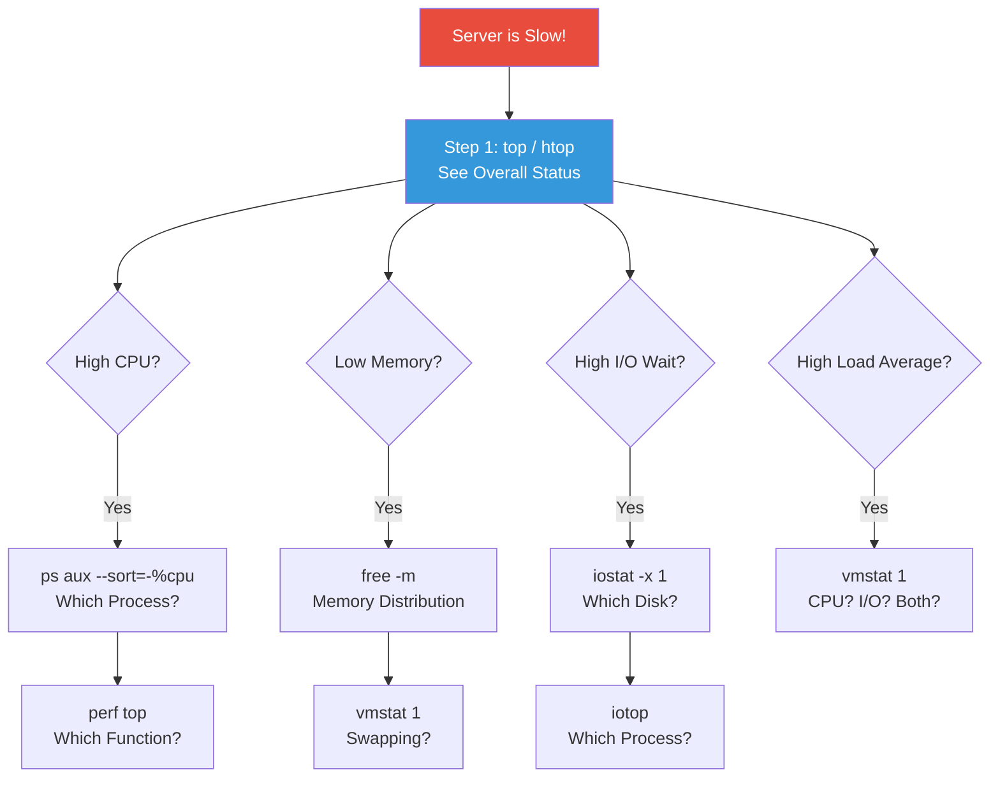
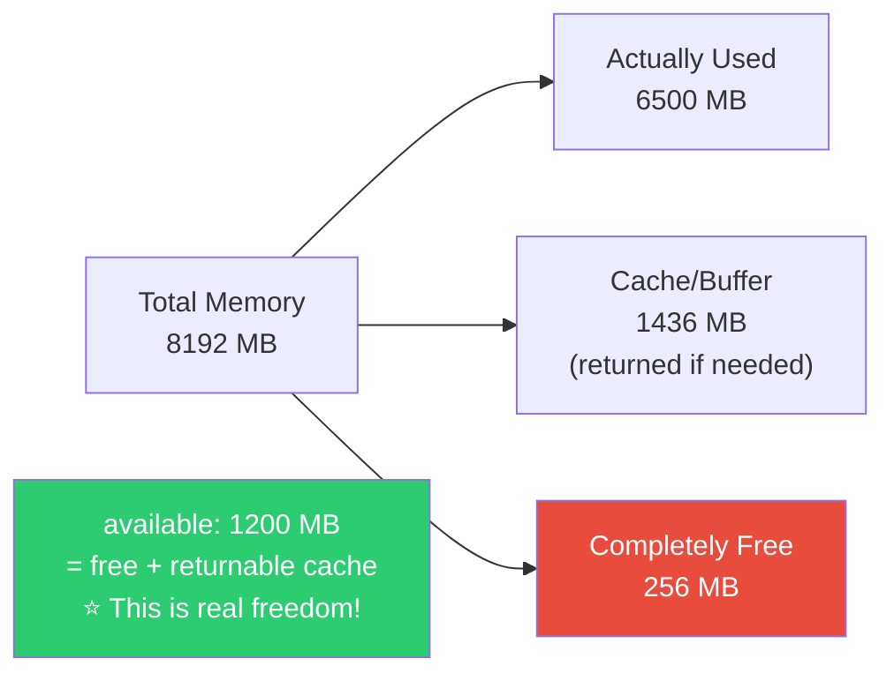
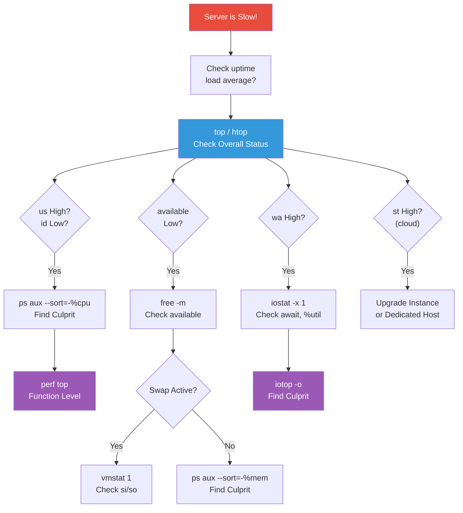
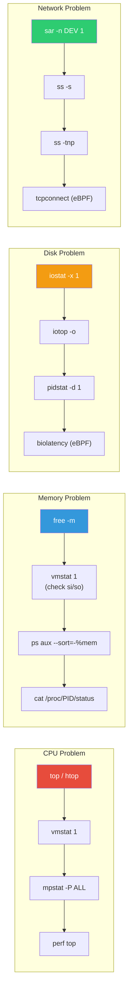

# Performance Analysis (top / vmstat / iostat / sar / perf / eBPF)

> "The server is slow" — Without knowing what to check, DevOps can't do anything. Is it CPU, memory, disk, or network? Performance analysis is identifying the root cause quickly.

---

## 🎯 Why Should You Know This?

```
Real causes behind "server is slow":
• CPU 100% → infinite loop? Too much computation?
• Memory shortage → is OOM Killer killing processes?
• Disk I/O bottleneck → log files too large or DB query surge?
• Network saturation → traffic spike?
• Process waiting → connection pool exhausted? Lock contention?
```

"It's slow" is a symptom. Performance analysis tools are diagnostic equipment that find the root cause.

---

## 🧠 Core Concepts

### Analogy: Hospital Diagnosis

Server performance analysis is like a medical diagnosis.

* **Patient (Server)**: "I feel bad (it's slow)"
* **Doctor (DevOps)**: Can't tell from symptoms alone, need tests

| Hospital Diagnosis | Server Diagnosis | Tool |
|-----------|----------|------|
| Thermometer | System-wide status | `top` / `htop` |
| Blood pressure | CPU/memory snapshot | `vmstat` |
| X-ray | Disk I/O status | `iostat` |
| Medical history | Resource history over time | `sar` |
| MRI (detailed exam) | Function/code level analysis | `perf` / eBPF |

### Performance Diagnosis Flow



---

## 🔍 Detailed Explanation

### top / htop — See Overall Status At a Glance (★ Always First)

We covered top in 04-process.md, but let's dive deeper from a performance analysis perspective.

```bash
top
# top - 14:30:00 up 5 days, 3:15, 2 users, load average: 4.50, 3.80, 2.60
# Tasks: 200 total,   3 running, 196 sleeping,   0 stopped,   1 zombie
# %Cpu(s): 65.0 us, 10.0 sy,  0.0 ni, 15.0 id,  8.0 wa,  0.0 hi,  2.0 si,  0.0 st
# MiB Mem :   8192.0 total,    256.0 free,   6500.0 used,   1436.0 buff/cache
# MiB Swap:   4096.0 total,   3000.0 free,   1096.0 used.   1200.0 avail Mem
#
#   PID USER      PR  NI    VIRT    RES    SHR S  %CPU  %MEM     TIME+ COMMAND
#  5000 mysql     20   0 2048000  1.2G   50M  S  85.0  15.0  120:00.0 mysqld
#  6000 ubuntu    20   0  500000  200M   10M  R  45.0   2.4   30:00.0 python3
#  2000 root      20   0  712344  200M   40M  S  10.0   2.4   15:00.0 dockerd
#  7000 www-data  20   0   55000   14M    8M  S   5.0   0.2    5:00.0 nginx
```

#### Interpreting the Top Section (System Summary)

```bash
# ─── load average ───
# load average: 4.50, 3.80, 2.60
#               ^^^^  ^^^^  ^^^^
#               1min  5min  15min

# On a 4-core CPU server:
# 4.50 / 4 = 1.125 → slightly overloaded (>1.0)
# Trend: 4.50 → 3.80 → 2.60 (decreasing → recently loaded but improving)

# How to interpret load average:
# load / CPU core count
# < 0.7  : Comfortable
# 0.7~1.0: Normal
# 1.0~2.0: Overloaded (noticeable slowdown)
# > 2.0  : Critical (immediate action needed)

# Check CPU core count
nproc
# 4
```

```bash
# ─── CPU Line ───
# %Cpu(s): 65.0 us, 10.0 sy, 0.0 ni, 15.0 id, 8.0 wa, 0.0 hi, 2.0 si, 0.0 st

# us (user)    = 65.0% → applications using CPU heavily
# sy (system)  = 10.0% → kernel (system calls) using CPU
# ni (nice)    = 0.0%  → processes with modified priority
# id (idle)    = 15.0% → idle CPU → only 15% remaining!
# wa (iowait)  = 8.0%  → ⚠️ waiting for disk I/O → disk bottleneck suspected!
# hi (hardware irq) = 0.0%  → hardware interrupts
# si (software irq) = 2.0%  → software interrupts (network, etc.)
# st (steal)   = 0.0%  → VM CPU stolen by host → important in cloud!
```

**What each high indicator means:**

| Indicator | When High | Cause | Action |
|-----------|-----------|-------|--------|
| `us` | App using lots of CPU | Infinite loop, complex computation | Profile app code |
| `sy` | Kernel busy | Excessive syscalls, context switching | Reduce process count |
| `wa` | Disk wait | Slow disk, excessive I/O | iostat → replace SSD, optimize queries |
| `st` | VM CPU stolen | Host overload (noisy neighbor) | Upgrade instance type |

```bash
# ─── Memory Line ───
# MiB Mem:  8192.0 total,  256.0 free,  6500.0 used,  1436.0 buff/cache
# MiB Swap: 4096.0 total, 3000.0 free,  1096.0 used.  1200.0 avail Mem

# Even if free is low, if buff/cache is high you may be okay!
# Linux aggressively uses free memory for caching → real available is "avail Mem"

# avail Mem: 1200.0 MiB → truly usable memory
# Swap used: 1096.0 MiB → ⚠️ over 1GB swap → memory shortage!
```

#### Viewing CPU Per-Core in top

```bash
# While running top, press '1' key:
# %Cpu0: 95.0 us,  3.0 sy,  0.0 ni,  2.0 id,  0.0 wa   ← Core 0: almost 100%!
# %Cpu1: 10.0 us,  5.0 sy,  0.0 ni, 80.0 id,  5.0 wa
# %Cpu2: 12.0 us,  3.0 sy,  0.0 ni, 82.0 id,  3.0 wa
# %Cpu3:  8.0 us,  2.0 sy,  0.0 ni, 88.0 id,  2.0 wa

# → One core at 95% full load
# → Likely a single-threaded app monopolizing CPU
# (Node.js, Python with GIL only use single core)
```

---

### free — Memory Status

```bash
free -m
#               total        used        free      shared  buff/cache   available
# Mem:           8192        6500         256          50        1436        1200
# Swap:          4096        1096        3000

free -h
#               total        used        free      shared  buff/cache   available
# Mem:          8.0Gi       6.3Gi       256Mi        50Mi       1.4Gi       1.2Gi
# Swap:         4.0Gi       1.1Gi       2.9Gi
```

**How to read it:**



```bash
# Key: even if free is low, if available is sufficient you're okay!

# ❌ Incorrect judgment
# "Only 256MB free! Memory shortage!"
# → No! buff/cache 1436MB can be returned if needed

# ✅ Correct judgment
# "available is 1200MB → still have headroom"
# "available is <100MB → memory shortage!"

# ⚠️ Also check swap
# Swap used: 1096MB → memory shortage, using disk as memory
# → Very slow! Need more memory
```

```bash
# Find processes using lots of memory
ps aux --sort=-%mem | head -10
#  PID USER  %MEM    RSS COMMAND
# 5000 mysql 15.0  1.2G  mysqld        ← 1.2GB!
# 6000 ubuntu 2.4  200M  python3
# 2000 root   2.4  200M  dockerd

# RSS (Resident Set Size) = actual physical memory used
# VSZ (Virtual Size) = virtual memory (looks big but different from actual)
# → Look at RSS!

# Detailed memory of specific process
cat /proc/5000/status | grep -E "VmRSS|VmSize|VmSwap"
# VmSize:  2048000 kB    ← virtual memory
# VmRSS:   1228800 kB    ← actual memory (1.2GB)
# VmSwap:    51200 kB    ← swapped out amount
```

---

### vmstat — CPU / Memory / I/O Overview (★ Critical Tool)

vmstat shows system state numerically at 1-second intervals. Great for seeing trends.

```bash
vmstat 1 5    # 1-second interval, 5 times
# procs -----------memory---------- ---swap-- -----io---- -system-- ------cpu-----
#  r  b   swpd   free   buff  cache   si   so    bi    bo   in   cs us sy id wa st
#  3  1 1096000 256000  50000 1400000   0    5   100  2000 5000 8000 65 10 15  8  2
#  2  0 1096000 260000  50000 1400000   0    0    50  1500 4800 7500 60  8 22  8  2
#  4  2 1096500 250000  50000 1400000  10   20   200  3000 5500 9000 70 12 8  10  0
#  2  0 1096500 255000  50000 1400000   0    0    80  1800 4500 7000 55  8 30  5  2
#  1  0 1096500 260000  50000 1400000   0    0    30  1200 4000 6500 40  5 50  3  2
```

**Column explanations:**

```
# === procs ===
# r : processes waiting to run (CPU queue)
#     → if r > CPU cores, CPU bottleneck!
# b : processes waiting for I/O (disk queue)
#     → if b > 0 consistently, disk bottleneck!

# === memory (KB) ===
# swpd  : swap being used
# free  : free memory
# buff  : buffer (block device cache)
# cache : cache (file system cache)

# === swap ===
# si : swapped from disk to memory (KB/s)
# so : swapped from memory to disk (KB/s)
#      → if si, so consistently positive, critical memory shortage!

# === io ===
# bi : blocks read from disk
# bo : blocks written to disk

# === system ===
# in : interrupts per second
# cs : context switches per second
#      → if very high, too many processes causing overhead

# === cpu ===
# us sy id wa st → same as top's CPU line
```

**Identifying bottlenecks with vmstat:**

```bash
# CPU bottleneck: r high, us high, id low
#  r  b   ... us sy id wa
#  8  0   ... 90  5  3  2     ← r=8 (4 cores, 8 waiting), us=90%, id=3%

# Memory bottleneck: si/so consistently positive
#  ... si   so ...
#  ... 500 1000 ...    ← swap constantly occurring! shortage

# Disk bottleneck: b high, wa high
#  r  b   ... wa
#  1  5   ... 30    ← b=5 (5 processes waiting for disk), wa=30%

# Normal: r low, id high, si/so=0
#  r  b   ... si  so ... us sy id wa
#  0  0   ...  0   0 ... 10  3 85  2    ← comfortable
```

---

### iostat — Disk I/O Analysis (★ Diagnose Disk Bottleneck)

```bash
# Installation (sysstat package)
sudo apt install sysstat    # Ubuntu
sudo yum install sysstat    # CentOS

# Basic usage
iostat -x 1 3    # extended, 1-second interval, 3 times
# Device     r/s     w/s   rkB/s   wkB/s  rrqm/s  wrqm/s  await  r_await  w_await  svctm  %util
# sda       50.0   200.0  2000.0 10000.0     5.0    30.0    5.0     2.0      6.0    1.0   25.0
# sdb        2.0    10.0    80.0   500.0     0.0     2.0    1.0     1.0      1.0    0.5    1.0
# nvme0n1  100.0   500.0  5000.0 25000.0    10.0    50.0    0.5     0.3      0.5    0.1    8.0
```

**Key metrics:**

| Metric | Meaning | Warning Threshold |
|--------|---------|------------------|
| `r/s` | read requests per second | depends on disk type |
| `w/s` | write requests per second | depends on disk type |
| `rkB/s` | data read per second | - |
| `wkB/s` | data written per second | - |
| `await` | average response time (ms) | ⭐ HDD: >20ms, SSD: >5ms |
| `r_await` | read response time | - |
| `w_await` | write response time | - |
| `%util` | disk utilization | ⭐ >80% is bottleneck! |

```bash
# Interpretation example

# sda: await=5.0, %util=25.0
# → response 5ms, usage 25% → normal

# If you see this:
# sda: await=50.0, %util=98.0
# → response 50ms! usage 98%! → severe disk bottleneck!

# Find which process causes high I/O:
sudo iotop -o    # -o: show only processes with I/O
# Total DISK READ:  10.00 M/s | Total DISK WRITE:  50.00 M/s
#   PID  USER     DISK READ  DISK WRITE  COMMAND
#  5000  mysql     8.00 M/s   40.00 M/s  mysqld          ← DB is culprit!
#  8000  root      1.00 M/s    5.00 M/s  rsync
#  9000  ubuntu    0.50 M/s    3.00 M/s  python3

# Track I/O of specific process
pidstat -d 1 5    # disk I/O, 1-second interval, 5 times
#  PID   kB_rd/s   kB_wr/s  Command
# 5000   8000.00  40000.00  mysqld
# 8000   1000.00   5000.00  rsync
```

---

### sar — Query Historical Performance Data (★ Time-based Trends)

sar automatically collects and stores system performance data. You can analyze past events like "why was the server slow at 10am yesterday?"

```bash
# sysstat package automatically collects every 10 minutes
# Data location: /var/log/sysstat/ or /var/log/sa/

# ─── CPU usage ───
sar -u 1 5    # current CPU, 1-second interval, 5 times
# 14:30:01     CPU     %user   %nice   %system   %iowait   %steal   %idle
# 14:30:02     all     65.00    0.00     10.00      8.00     0.00    17.00
# 14:30:03     all     60.00    0.00      8.00      7.00     0.00    25.00
# 14:30:04     all     70.00    0.00     12.00     10.00     0.00     8.00
# 14:30:05     all     55.00    0.00      8.00      5.00     0.00    32.00
# 14:30:06     all     40.00    0.00      5.00      3.00     0.00    52.00
# Average:     all     58.00    0.00      8.60      6.60     0.00    26.80

# ─── Today's CPU record ───
sar -u
# 00:00:01     CPU     %user   %nice   %system   %iowait   %steal   %idle
# 00:10:01     all      5.00    0.00      2.00      1.00     0.00    92.00
# 00:20:01     all      3.00    0.00      1.00      0.50     0.00    95.50
# ...
# 10:00:01     all     45.00    0.00      8.00      5.00     0.00    42.00    ← goes up at 10am
# 10:10:01     all     65.00    0.00     10.00      8.00     0.00    17.00    ← peak at 10:10am
# 10:20:01     all     70.00    0.00     12.00     10.00     0.00     8.00    ← even higher!
# ...

# ─── Historical data ───
sar -u -f /var/log/sysstat/sa11    # data from the 11th (sa = day number)
# Or
sar -u -1    # yesterday (-1 = 1 day ago)
```

```bash
# ─── Memory usage ───
sar -r 1 3
# 14:30:01  kbmemfree  kbavail  kbmemused  %memused  kbbuffers  kbcached
# 14:30:02     256000  1200000    6500000     79.35      50000   1400000
# 14:30:03     260000  1210000    6496000     79.30      50000   1400000

# ─── Swap usage ───
sar -S 1 3
# 14:30:01  kbswpfree  kbswpused  %swpused  kbswpcad
# 14:30:02    3000000    1096000     26.76         0

# ─── Disk I/O ───
sar -d 1 3
# 14:30:01     DEV       tps    rkB/s    wkB/s    dkB/s  areq-sz    aqu-sz    await   %util
# 14:30:02     sda     250.00  2000.00 10000.00     0.00    48.00      1.25     5.00   25.00

# ─── Network ───
sar -n DEV 1 3
# 14:30:01    IFACE   rxpck/s  txpck/s  rxkB/s   txkB/s
# 14:30:02     eth0   5000.00  4500.00  3000.00  2500.00
# 14:30:02       lo    100.00   100.00    50.00    50.00

# ─── Load average ───
sar -q 1 3
# 14:30:01   runq-sz  plist-sz  ldavg-1  ldavg-5 ldavg-15  blocked
# 14:30:02         3       200     4.50     3.80     2.60        1

# ─── Context switching ───
sar -w 1 3
# 14:30:01    proc/s   cswch/s
# 14:30:02     50.00   8000.00
```

**Real-world time-based analysis:**

```bash
# "Server was slow yesterday between 10am-12pm, what was it?"

# 1. Check CPU
sar -u -s 10:00:00 -e 12:00:00 -1
# → iowait 30%? → disk issue

# 2. Check disk
sar -d -s 10:00:00 -e 12:00:00 -1
# → %util 95%? → disk saturation

# 3. Check memory
sar -r -s 10:00:00 -e 12:00:00 -1
# → %memused 95%? → memory shortage

# 4. Check network
sar -n DEV -s 10:00:00 -e 12:00:00 -1
# → rxkB/s 10x normal? → traffic spike
```

---

### perf — Process/Function Level Analysis (Advanced)

perf can analyze "which function is using CPU" down to code level.

```bash
# Installation
sudo apt install linux-tools-common linux-tools-$(uname -r)    # Ubuntu

# ─── perf top: real-time CPU function analysis ───
sudo perf top
# Overhead  Shared Object      Symbol
#   25.00%  mysqld             [.] row_search_mvcc
#   12.00%  mysqld             [.] buf_page_get_gen
#    8.00%  libc.so.6          [.] __memmove_avx_unaligned
#    5.00%  [kernel]           [k] _raw_spin_lock
#    3.00%  python3.10         [.] _PyEval_EvalFrameDefault

# → mysqld's row_search_mvcc function uses 25% of CPU
# → Database query optimization needed!

# ─── perf stat: process statistics ───
sudo perf stat -p 5000 sleep 10    # analyze PID 5000 for 10 seconds
#  Performance counter stats for process id '5000':
#       15,000.00 msec task-clock            # 1.500 CPUs utilized
#          50,000      context-switches      # 3.333 K/sec
#           2,000      cpu-migrations        # 0.133 K/sec
#         500,000      page-faults           # 33.333 K/sec
#  45,000,000,000      cycles                # 3.000 GHz
#  30,000,000,000      instructions          # 0.67 insn per cycle
#                                             # ^^^^ low = many cache misses

# ─── perf record + report: profile recording ───
# Profile specific process for 30 seconds
sudo perf record -p 5000 -g sleep 30
# [ perf record: Woken up 10 times to write data ]
# [ perf record: Captured and wrote 5.000 MB perf.data ]

# Analyze results
sudo perf report
# Overhead  Command  Shared Object  Symbol
#   25.00%  mysqld   mysqld         [.] row_search_mvcc
#   12.00%  mysqld   mysqld         [.] buf_page_get_gen
#   ...

# Visualize with flamegraph (very useful!)
# → Covered in 07-ci/cd FlameGraph tools
```

---

### eBPF-based Profiling (Reference)

eBPF safely runs programs inside the kernel. Increasingly used for performance analysis.

```bash
# Install bcc-tools (eBPF tool suite)
sudo apt install bpfcc-tools    # Ubuntu

# ─── execsnoop: trace all executing processes ───
sudo execsnoop-bpfcc
# PCOMM  PID    PPID   RET ARGS
# curl   12345  1234     0 /usr/bin/curl http://localhost/health
# bash   12346  800      0 /bin/bash /opt/scripts/check.sh
# grep   12347  12346    0 /usr/bin/grep error /var/log/syslog

# ─── biolatency: disk I/O latency distribution ───
sudo biolatency-bpfcc
#      usecs     : count     distribution
#          0 -> 1 : 500      |***                             |
#          2 -> 3 : 2000     |*************                   |
#          4 -> 7 : 5000     |**********************************|
#          8 -> 15: 3000     |********************             |
#         16 -> 31: 1000     |*******                          |
#         32 -> 63: 200      |*                                |
#        64 -> 127: 50       |                                 |
#       128 -> 255: 10       |                                 |  ← 128ms+! slow I/O

# ─── tcpconnect: trace TCP connections ───
sudo tcpconnect-bpfcc
# PID    COMM         IP  SADDR           DADDR           DPORT
# 5000   myapp        4   10.0.1.50       10.0.2.10       3306
# 5000   myapp        4   10.0.1.50       10.0.3.10       6379
# → see where app connects in real-time

# ─── opensnoop: trace file opens ───
sudo opensnoop-bpfcc
# PID    COMM         FD  ERR PATH
# 5000   myapp         5    0 /opt/myapp/config.yaml
# 5000   myapp         6    0 /var/log/myapp/app.log
# 901    nginx         7    0 /var/log/nginx/access.log
```

---

## 💻 Practice Exercises

### Exercise 1: Basic Performance Diagnosis

```bash
# Assume server is slow and follow diagnosis sequence

# Step 1: Overall status
uptime
# 14:30:00 up 5 days, load average: 4.50, 3.80, 2.60
# → load 4.5, CPU 4 cores → 1.125 overloaded

# Step 2: CPU/memory/process check
top -bn1 | head -20
# → check %Cpu(s): us, wa
# → which process has high %CPU

# Step 3: Memory details
free -m
# → check available, swap

# Step 4: Disk
iostat -x 1 3
# → check %util, await

# Step 5: Time-based trends
sar -u | tail -20
# → when did CPU spike start
```

### Exercise 2: Create CPU Load and Diagnose

```bash
# Generate CPU load (testing)
# stress 2 cores
stress --cpu 2 --timeout 30 &
# Or without stress tool:
yes > /dev/null &
yes > /dev/null &

# Observe in another terminal

# Check with top
top
# → yes processes show high CPU

# Check with vmstat
vmstat 1 10
# → r increases, us goes high, id goes low

# Cleanup
killall yes 2>/dev/null
killall stress 2>/dev/null
```

### Exercise 3: Memory Pressure Observation

```bash
# Monitor memory continuously
watch -n 1 'free -m | head -3; echo "---"; vmstat 1 1 | tail -1'

# In another terminal, memory-consuming task
# (large file read, etc.)
dd if=/dev/zero of=/tmp/bigfile bs=1M count=500

# Watch buff/cache change in first terminal
# → Linux using file cache for memory

# Cleanup
rm /tmp/bigfile
```

### Exercise 4: Disk I/O Observation

```bash
# Monitor iostat real-time
iostat -x 1

# In another terminal, generate disk I/O
dd if=/dev/zero of=/tmp/iotest bs=1M count=500

# Observe iostat:
# → wkB/s increases
# → %util increases
# → which disk has I/O

# Cleanup
rm /tmp/iotest
```

---

## 🏢 In Production

### Scenario 1: "Server got slow starting 10am"

```bash
# 1. Check current status
uptime
top -bn1 | head -5

# 2. Check historical data for exact timing
sar -u -s 09:00:00 -e 12:00:00
# 09:50:01  %user  %system  %iowait  %idle
#             10       3        2       85     ← normal
# 10:00:01    45       8        5       42     ← goes up!
# 10:10:01    65      10        8       17     ← peak
# 10:20:01    70      12       10        8     ← critical

# → CPU jumped at 10am. iowait up to 10%

# 3. Find culprit process (current basis)
ps aux --sort=-%cpu | head -5
# mysql  5000 85.0% ...  mysqld

# 4. Check database queries
# → 10am likely when batch queries started
# → check app logs, slow query log

# 5. If disk issue
sar -d -s 10:00:00 -e 11:00:00
# → %util 95%? → disk saturation
iostat -x 1 5    # current status
iotop -o         # which process?
```

### Scenario 2: OOM Killer Triggered

```bash
# App suddenly died, cause unknown

# 1. Check kernel log for OOM
dmesg | grep -i "oom\|killed" | tail -10
# [12345.678] Out of memory: Killed process 5000 (myapp) total-vm:4096000kB, anon-rss:3500000kB
# → OOM Killer killed myapp! 3.5GB in use

# 2. When it happened
journalctl -k --since "today" | grep -i oom
# Mar 12 10:15:30 kernel: myapp invoked oom-killer: gfp_mask=0x...

# 3. Memory state at that time
sar -r -s 10:00:00 -e 10:20:00
# → %memused likely reached 99%

# 4. Immediate response
# Restart service
sudo systemctl restart myapp

# Long-term fix:
# Memory leak in code, or need more memory
# Set memory limit in systemd to protect other services
# MemoryMax=2G
```

### Scenario 3: Cloud VM steal time Check

```bash
# Server intermittently slow on AWS EC2

top
# %Cpu(s): 30.0 us,  5.0 sy,  0.0 ni, 50.0 id,  2.0 wa,  0.0 hi,  1.0 si, 12.0 st
#                                                                              ^^^^
#                                                                              st=12%!

# st (steal) = CPU time stolen by host from this VM
# → Another VM on same physical server using CPU heavily
# → "noisy neighbor" problem

# Solutions:
# 1. Upgrade instance type (t2 → m5, etc.)
# 2. Use dedicated host
# 3. Check CPU credits (t2/t3 instances)

# Track steal time trend with sar
sar -u | awk '{print $1, $NF, $(NF-1)}'    # time, idle, steal
```

---

## ⚠️ Common Mistakes

### 1. Judging Memory Shortage by `free` Alone

```bash
# ❌ "Only 256MB free! Server in danger!"
free -m
# Mem:  8192  6500  256  50  1436  1200

# ✅ Look at available (1200MB)
# Linux aggressively caches free memory
# If available is sufficient, normal
```

### 2. Judging CPU Shortage by Load Average Only

```bash
# ❌ "load average 4.0, so CPU shortage!"
# → Could be high due to I/O wait, not CPU

# ✅ Separate r and b with vmstat
vmstat 1 3
#  r  b  ...
#  1  3  ...    ← r=1 (CPU queue small), b=3 (I/O queue large)
#  → disk bottleneck, not CPU!
```

### 3. Single Snapshot Judgment

```bash
# ❌ Check top once: "CPU 90%!"
# → Could be momentary spike

# ✅ Observe trends with vmstat or sar
vmstat 1 10    # 10-second observation → sustained high?
sar -u         # all-day trend
```

### 4. Panicking at %util 100%

```bash
# ❌ "%util 100%! Disk dying!"
# → SSD with high %util but low await is often fine
# (NVMe with multiple queues, %util doesn't reflect actual load)

# ✅ Check await too
# %util=95%, await=2ms → SSD, probably fine
# %util=95%, await=50ms → real bottleneck!
```

### 5. Not Enabling sar Data Collection

```bash
# sar without data = no historical analysis possible!

# Verify sysstat enabled
systemctl status sysstat
# → check if enabled

# If disabled:
sudo systemctl enable --now sysstat

# Check collection interval (default 10 minutes)
cat /etc/cron.d/sysstat
# */10 * * * * root /usr/lib/sysstat/sa1 1 1
```

---

## 📝 Summary

### Performance Analysis Tools Cheat Sheet

```bash
# === Overall Status ===
top / htop                # real-time process monitoring
uptime                    # load average

# === CPU ===
vmstat 1                  # CPU usage + r (CPU queue) + b (I/O queue)
sar -u                    # CPU time-based record
mpstat -P ALL 1           # per-core CPU (same as top '1')

# === Memory ===
free -m                   # memory status (watch available!)
vmstat 1                  # si/so (swap occurrence)
sar -r                    # memory time-based record

# === Disk ===
iostat -x 1               # disk I/O (await, %util)
iotop -o                  # process I/O breakdown
sar -d                    # disk time-based record

# === Network ===
sar -n DEV 1              # network traffic
ss -s                     # socket statistics

# === Process ===
ps aux --sort=-%cpu       # sorted by CPU
ps aux --sort=-%mem       # sorted by memory
pidstat -u 1              # process CPU
pidstat -d 1              # process I/O

# === Advanced ===
perf top                  # function-level CPU analysis
perf record -g -p PID     # profile recording
strace -p PID             # system call tracing
```

### Troubleshooting Decision Tree

When "server is slow" — which tool to use in what order?



### Tool Selection Guide

Different tools for different resource bottlenecks.



### Quick Bottleneck Reference

```
CPU Bottleneck:   vmstat r high, us high, id low
Memory Bottleneck: free available low, vmstat si/so positive, swap active
Disk Bottleneck:   vmstat b high, wa high, iostat await/util high
Network:           sar -n DEV → check bandwidth
```

---

## 🔗 Next Lesson

Next is **[01-linux/13-kernel.md — Kernel Internals (cgroups / namespaces / sysctl / ulimit)](./13-kernel)**.

Learn how Docker and Kubernetes internally isolate containers using cgroups and namespaces—the fundamental technologies. You'll also learn kernel parameter tuning with sysctl and ulimit.
