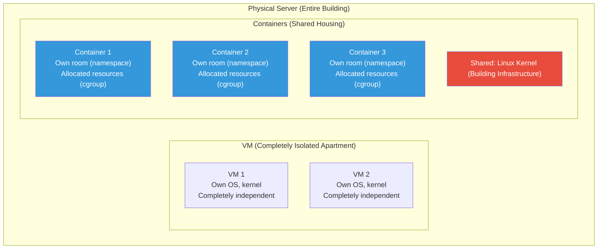
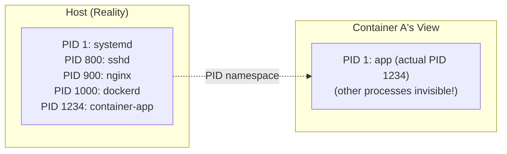
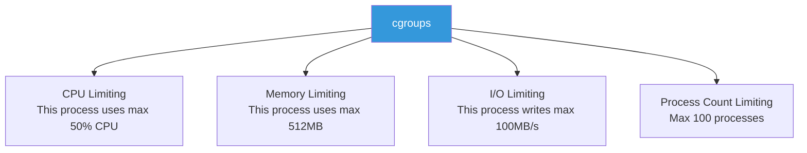
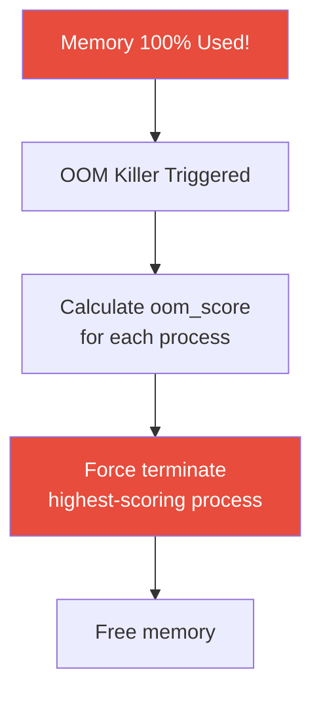

# Kernel Internals (cgroups / namespaces / sysctl / ulimit)

> Have you ever wondered how Docker isolates processes? The secret lies in the Linux kernel. Two technologies — cgroups and namespaces — form the foundation of containers. When you add kernel parameter tuning with sysctl and ulimit to this knowledge, you can understand your servers at a much deeper level.

---

## 🎯 Why You Need to Know This

```
Understanding these concepts unlocks:
• How Docker containers are isolated                          → namespaces
• How CPU/memory limits are enforced on containers            → cgroups
• The mechanics of Kubernetes resource requests/limits        → cgroups
• Resolving "Too many open files" errors                      → ulimit
• Server tuning (max connections, file descriptors, etc.)     → sysctl
• Why OOM Killer terminates applications                      → memory management
• Why the host is invisible from inside containers            → namespaces
```

Many things that feel "magical" when using Docker/Kubernetes are actually just Linux kernel features. Understanding them enables you to diagnose container issues at the root level.

---

## 🧠 Core Concepts

### Analogy: Apartments vs Studio vs Shared Housing



* **namespaces** = Individual rooms. Can't see neighboring rooms (isolation)
* **cgroups** = Resource quotas for utilities. Prevents one room from monopolizing resources (resource limiting)

These two technologies combined create **containers**.

---

## 🔍 Detailed Explanation

### namespaces — Process Isolation

A namespace is a technology that separates the **world a process sees**. Even though processes run on the same server, they exist in different worlds.

#### Types of Namespaces

| Namespace | Isolates | Effect |
|-----------|----------|--------|
| **PID** | Process IDs | Container starts at PID 1. Other container/host processes invisible |
| **Network** | Network stack | Each container has own IP, ports, routing |
| **Mount** | Filesystem mounts | Each container has own filesystem view |
| **UTS** | Hostname | Each container can have different hostname |
| **User** | User/group IDs | Container root is regular user on host |
| **IPC** | Inter-process communication | Shared memory, semaphores isolated |
| **Cgroup** | cgroup view | Container sees only its own cgroup |



#### Exploring Namespaces Directly

```bash
# Check host namespaces
ls -la /proc/1/ns/
# lrwxrwxrwx 1 root root 0 ... cgroup -> 'cgroup:[4026531835]'
# lrwxrwxrwx 1 root root 0 ... ipc -> 'ipc:[4026531839]'
# lrwxrwxrwx 1 root root 0 ... mnt -> 'mnt:[4026531840]'
# lrwxrwxrwx 1 root root 0 ... net -> 'net:[4026531840]'
# lrwxrwxrwx 1 root root 0 ... pid -> 'pid:[4026531836]'
# lrwxrwxrwx 1 root root 0 ... user -> 'user:[4026531837]'
# lrwxrwxrwx 1 root root 0 ... uts -> 'uts:[4026531838]'

# Check Docker container namespace
CONTAINER_PID=$(docker inspect --format '{{.State.Pid}}' mycontainer)
ls -la /proc/$CONTAINER_PID/ns/
# → Numbers differ from host! = in different namespace

# Compare PID namespace between host and container
readlink /proc/1/ns/pid
# pid:[4026531836]        ← Host
readlink /proc/$CONTAINER_PID/ns/pid
# pid:[4026532200]        ← Container (different number!)
```

#### Hands-on Practice: unshare

```bash
# unshare: Execute command in new namespace (experience isolation without Docker!)

# PID namespace isolation
sudo unshare --pid --fork --mount-proc bash
# Inside new bash:
ps aux
#  PID USER  COMMAND
#    1 root  bash          ← Starts at PID 1! Other processes invisible!
#    2 root  ps aux
exit

# UTS (hostname) namespace isolation
sudo unshare --uts bash
hostname container-test
hostname
# container-test           ← Hostname changed!
exit
hostname
# web01                    ← Host hostname unchanged!

# Network namespace isolation
sudo unshare --net bash
ip addr
# 1: lo: <LOOPBACK> ...
# → No eth0! Isolated network!
exit
```

---

### cgroups — Resource Limiting

cgroups (Control Groups) is a technology that limits resources — CPU, memory, disk I/O, network — for process groups.

#### What cgroups Do



#### cgroups in Docker

```bash
# Apply resource limits to Docker container
docker run -d \
    --name myapp \
    --cpus="1.5" \           # CPU capped at 1.5 cores
    --memory="512m" \        # Memory capped at 512MB
    --memory-swap="1g" \     # Memory+swap capped at 1GB
    --pids-limit=100 \       # Max 100 processes
    myapp:latest

# Check limits
docker stats myapp
# CONTAINER  CPU %  MEM USAGE / LIMIT   MEM %   PIDS
# myapp      45.0%  300MiB / 512MiB     58.59%    25

# Check actual cgroup files (created by Docker)
CONTAINER_ID=$(docker inspect --format '{{.Id}}' myapp)

# cgroup v2 (modern distributions)
cat /sys/fs/cgroup/system.slice/docker-${CONTAINER_ID}.scope/memory.max
# 536870912     ← 512MB (bytes)

cat /sys/fs/cgroup/system.slice/docker-${CONTAINER_ID}.scope/cpu.max
# 150000 100000  ← Can use 150000 out of 100000 microseconds = 1.5 cores
```

#### cgroups in Kubernetes

```yaml
# Setting resources in Kubernetes Pod → enforced via cgroups
apiVersion: v1
kind: Pod
spec:
  containers:
  - name: myapp
    resources:
      requests:        # Guaranteed minimum
        cpu: "500m"    # 0.5 cores
        memory: "256Mi"
      limits:          # Hard maximum
        cpu: "1000m"   # 1 core
        memory: "512Mi"
```

```bash
# Verify on K8s node (while Pod is running)
# Find Pod cgroup path
find /sys/fs/cgroup -name "*myapp*" -type d 2>/dev/null

# Check memory limit
cat /sys/fs/cgroup/kubepods/pod-xxxx/memory.max
# 536870912   ← 512Mi

# Check current memory usage
cat /sys/fs/cgroup/kubepods/pod-xxxx/memory.current
# 200000000   ← ~200MB in use
```

#### Creating cgroups Manually (for Understanding)

```bash
# Based on cgroup v2 (Ubuntu 22+, modern distributions)

# 1. Create cgroup directory
sudo mkdir /sys/fs/cgroup/mytest

# 2. Set memory limit (100MB)
echo 104857600 | sudo tee /sys/fs/cgroup/mytest/memory.max
# 104857600  ← 100MB

# 3. Add process to this cgroup
echo $$ | sudo tee /sys/fs/cgroup/mytest/cgroup.procs
# → Current shell now has 100MB memory limit

# 4. Verify
cat /sys/fs/cgroup/mytest/memory.current
# 5000000   ← ~5MB in use

# 5. Cleanup (leave cgroup)
echo $$ | sudo tee /sys/fs/cgroup/cgroup.procs
sudo rmdir /sys/fs/cgroup/mytest
```

---

### Process Scheduler

With 4 CPU cores and 100 processes, the scheduler decides who gets CPU time first.

```bash
# Check process priorities
ps -eo pid,ni,pri,comm | head -10
#   PID  NI PRI COMMAND
#     1   0  20 systemd
#   800   0  20 sshd
#   900   0  20 nginx
#  5000   0  20 mysqld

# NI (nice): -20(highest priority) to 19(lowest), default 0
# PRI (priority): Higher = higher priority

# Change nice value (lower priority)
nice -n 10 /opt/scripts/heavy-task.sh
# → This script runs with lower priority than others

# Change nice for running process
renice 10 -p 5000     # Set PID 5000 nice to 10 (lower priority)
renice -5 -p 5000     # Set nice to -5 (higher priority, requires root)
sudo renice -10 -p 5000  # Very high priority

# Practical use: backups and batch jobs get low priority
# to minimize impact on actual services
nice -n 15 /opt/scripts/db-backup.sh
ionice -c 3 /opt/scripts/db-backup.sh    # Also lower I/O priority
```

**Scheduling Policies:**

| Policy | Use Case | Command |
|--------|----------|---------|
| `SCHED_OTHER` | Default (CFS — fair scheduling) | Most processes |
| `SCHED_FIFO` | Real-time (FIFO) | Real-time systems |
| `SCHED_RR` | Real-time (Round-robin) | Real-time systems |
| `SCHED_BATCH` | Batch jobs | CPU-intensive batch |
| `SCHED_IDLE` | Lowest priority | System idle only |

```bash
# Check current scheduling policy
chrt -p 5000
# pid 5000's current scheduling policy: SCHED_OTHER
# pid 5000's current scheduling priority: 0

# Set as batch job
sudo chrt -b 0 /opt/scripts/batch-job.sh
```

---

### Memory Management — OOM Killer, swap

#### OOM Killer (Out of Memory Killer)

When memory is completely exhausted, the Linux kernel automatically kills processes. This is OOM Killer.



```bash
# Check if OOM Killer was triggered
dmesg | grep -i "oom\|killed"
# [12345.678] Out of memory: Killed process 5000 (myapp) total-vm:4096000kB
# [12345.678] oom_reaper: reaped process 5000 (myapp), now anon-rss:0kB

journalctl -k | grep -i oom
# Mar 12 10:15:30 kernel: myapp invoked oom-killer: gfp_mask=0x...
# Mar 12 10:15:30 kernel: Out of memory: Killed process 5000 (myapp)

# Check OOM score for process (higher = killed first)
cat /proc/5000/oom_score
# 500

# Top 10 processes by OOM score
for pid in $(ls /proc/ | grep -E '^[0-9]+$'); do
    score=$(cat /proc/$pid/oom_score 2>/dev/null) || continue
    name=$(cat /proc/$pid/comm 2>/dev/null) || continue
    [ "$score" -gt 0 ] && echo "$score $pid $name"
done | sort -rn | head -10
# 800 5000 mysqld          ← First candidate for killing
# 500 6000 myapp
# 200 2000 dockerd
# 100 901  nginx
```

```bash
# Protect from OOM Killer

# Adjust OOM score for specific process
# oom_score_adj: -1000(never kill) to 1000(kill first)

# Protect critical process (e.g., database)
echo -1000 | sudo tee /proc/5000/oom_score_adj
# → mysqld protected from OOM Killer

# In systemd service
# /etc/systemd/system/mydb.service
# [Service]
# OOMScoreAdjust=-900     ← Almost never killed

# Kill less critical processes first (to protect others)
echo 500 | sudo tee /proc/8000/oom_score_adj
# → Batch job killed first, protecting other services
```

#### swap Management

swap uses disk as memory when RAM is insufficient. Slower but prevents OOM.

```bash
# Check swap status
swapon --show
# NAME      TYPE SIZE  USED PRIO
# /swapfile file   4G  1.1G   -2

free -h | grep Swap
# Swap:         4.0Gi       1.1Gi       2.9Gi

# Check processes using swap
for pid in $(ls /proc/ | grep -E '^[0-9]+$'); do
    swap=$(awk '/VmSwap/ {print $2}' /proc/$pid/status 2>/dev/null)
    name=$(cat /proc/$pid/comm 2>/dev/null)
    [ -n "$swap" ] && [ "$swap" -gt 0 ] && echo "${swap}kB $pid $name"
done | sort -rn | head -10
# 512000kB 5000 mysqld     ← 500MB swapped out
# 102400kB 6000 myapp
```

```bash
# swappiness: How aggressively kernel uses swap
cat /proc/sys/vm/swappiness
# 60    ← Default (0-100)

# 60 = moderate swap usage
# 10 = minimize swap (database servers recommended)
#  0 = avoid swap when possible (sufficient memory available)

# Temporary change
sudo sysctl vm.swappiness=10

# Permanent change
echo "vm.swappiness=10" | sudo tee -a /etc/sysctl.d/99-custom.conf
sudo sysctl -p /etc/sysctl.d/99-custom.conf
```

```bash
# Add swap file (emergency situation)

# 1. Create swap file (2GB)
sudo fallocate -l 2G /swapfile2
sudo chmod 600 /swapfile2
sudo mkswap /swapfile2
# Setting up swapspace version 1, size = 2 GiB

# 2. Activate swap
sudo swapon /swapfile2

# 3. Verify
swapon --show
free -h

# 4. Make persistent across reboots
echo '/swapfile2 none swap sw 0 0' | sudo tee -a /etc/fstab

# Disable swap (after adding sufficient RAM)
sudo swapoff /swapfile2
sudo rm /swapfile2
# Also remove from fstab
```

---

### sysctl — Kernel Parameter Tuning (★ Production Essential)

sysctl allows real-time modification of kernel behavior. It's central to server tuning.

```bash
# Check current settings
sysctl -a | wc -l
# 1200+    ← 1200+ kernel parameters!

# Check specific value
sysctl net.core.somaxconn
# net.core.somaxconn = 4096

# Change value (temporary, reverts after reboot)
sudo sysctl net.core.somaxconn=65535

# Or
echo 65535 | sudo tee /proc/sys/net/core/somaxconn
```

#### Essential Production Parameters

```bash
# Create configuration file
sudo vim /etc/sysctl.d/99-custom.conf
```

```bash
# ─── Network Tuning ───

# TCP listen queue size (essential for Nginx, high-traffic servers)
net.core.somaxconn = 65535

# TCP connection reuse (reduce TIME_WAIT)
net.ipv4.tcp_tw_reuse = 1

# TCP keepalive (detect idle connections)
net.ipv4.tcp_keepalive_time = 600       # Start keepalive after 600 seconds
net.ipv4.tcp_keepalive_intvl = 60       # Check every 60 seconds
net.ipv4.tcp_keepalive_probes = 5       # Drop after 5 no-response checks

# SYN flood protection
net.ipv4.tcp_syncookies = 1
net.ipv4.tcp_max_syn_backlog = 65535

# Local port range (for many outbound connections)
net.ipv4.ip_local_port_range = 1024 65535

# TCP memory buffers
net.core.rmem_max = 16777216            # Receive buffer max
net.core.wmem_max = 16777216            # Send buffer max

# ─── Filesystem ───

# Maximum open files (system-wide)
fs.file-max = 2097152

# inotify limits (file monitoring tools)
fs.inotify.max_user_watches = 524288
fs.inotify.max_user_instances = 512

# ─── Memory ───

# Minimize swap usage (database servers)
vm.swappiness = 10

# Prevent OOM Killer panic
vm.panic_on_oom = 0

# Dirty page ratio (disk write timing)
vm.dirty_ratio = 20                     # Cache up to 20% of memory
vm.dirty_background_ratio = 5           # Background flush at 5%

# ─── IP Forwarding (Docker, K8s required) ───
net.ipv4.ip_forward = 1
net.bridge.bridge-nf-call-iptables = 1
```

```bash
# Apply
sudo sysctl -p /etc/sysctl.d/99-custom.conf
# net.core.somaxconn = 65535
# net.ipv4.tcp_tw_reuse = 1
# ...

# Verify
sysctl net.core.somaxconn
# net.core.somaxconn = 65535
```

**Docker/Kubernetes Essential sysctl:**

```bash
# Required for Docker/K8s to work properly
cat /etc/sysctl.d/99-kubernetes.conf
# net.bridge.bridge-nf-call-iptables = 1
# net.bridge.bridge-nf-call-ip6tables = 1
# net.ipv4.ip_forward = 1

# Without these, K8s Pod-to-Pod communication fails!
# kubeadm init also verifies these settings
```

---

### ulimit — Per-Process Resource Limits

ulimit limits resources at **user/process level**. While sysctl is system-wide, ulimit is per-process.

```bash
# Check current limits
ulimit -a
# core file size          (blocks, -c) 0
# data seg size           (kbytes, -d) unlimited
# scheduling priority             (-e) 0
# file size               (blocks, -f) unlimited
# pending signals                 (-i) 15421
# max locked memory       (kbytes, -l) 65536
# max memory size         (kbytes, -m) unlimited
# open files                      (-n) 1024        ← ⭐ Most common issue!
# pipe size            (512 bytes, -p) 8
# POSIX message queues     (bytes, -q) 819200
# real-time priority              (-r) 0
# stack size              (kbytes, -s) 8192
# cpu time               (seconds, -t) unlimited
# max user processes              (-u) 15421
# virtual memory          (kbytes, -v) unlimited
# file locks                      (-x) unlimited
```

#### "Too many open files" Error (Most Common!)

```bash
# Ever seen this error?
# "Too many open files"
# "socket: too many open files"
# "can't open file: Too many open files"

# Check current open files
cat /proc/sys/fs/file-nr
# 5000  0  2097152
# ^^^^     ^^^^^^^
# Current  System max

# Open files for specific process
ls /proc/5000/fd | wc -l
# 1020    ← Nearly at 1024 limit!

# Check process limits
cat /proc/5000/limits | grep "Max open files"
# Max open files            1024                 1048576              files
#                           ^^^^                 ^^^^^^^
#                           soft limit           hard limit

# ⚠️ 1024 is default but too low for web servers/databases/app servers!
```

#### Changing ulimit

```bash
# Temporary change (current session only)
ulimit -n 65535          # Open files
ulimit -u 65535          # Processes

# Permanent change: /etc/security/limits.conf
sudo vim /etc/security/limits.conf
```

```bash
# /etc/security/limits.conf
# <domain>  <type>  <item>   <value>

# All users
*          soft    nofile   65535
*          hard    nofile   65535
*          soft    nproc    65535
*          hard    nproc    65535

# Specific users
nginx      soft    nofile   65535
nginx      hard    nofile   65535
mysql      soft    nofile   65535
mysql      hard    nofile   65535
deploy     soft    nofile   65535
deploy     hard    nofile   65535

# Root
root       soft    nofile   65535
root       hard    nofile   65535
```

```bash
# soft limit: Default applied (user can increase)
# hard limit: Maximum allowed (only root can change)

# Verify (requires re-login!)
exit
ssh ubuntu@server
ulimit -n
# 65535
```

#### ulimit for systemd Services

```bash
# systemd services read configuration differently!
# They don't use /etc/security/limits.conf

# /etc/systemd/system/nginx.service.d/override.conf
# [Service]
# LimitNOFILE=65535
# LimitNPROC=65535

sudo systemctl daemon-reload
sudo systemctl restart nginx

# Verify
cat /proc/$(pgrep -o nginx)/limits | grep "Max open files"
# Max open files            65535                65535                files
```

---

## 💻 Hands-on Labs

### Lab 1: Exploring Namespace Isolation

```bash
# PID namespace isolation
sudo unshare --pid --fork --mount-proc bash

# Inside isolated environment:
ps aux
# PID 1 is bash! Host processes invisible
hostname
# Same as host (UTS namespace not isolated)

exit
# Return to host

# Isolate multiple namespaces (similar to containers)
sudo unshare --pid --fork --mount-proc --uts --net bash

# Inside isolated environment:
hostname test-container
hostname
# test-container
ip addr
# Only loopback (no eth0!)
ps aux
# PID starts from 1

exit
```

### Lab 2: cgroup Memory Limits

```bash
# Experience memory limits with Docker
docker run -it --rm --memory=50m ubuntu bash

# Inside container:
# Check memory limit
cat /sys/fs/cgroup/memory.max
# 52428800   ← 50MB

# Run memory-intensive command
dd if=/dev/zero of=/dev/null bs=1M &
# → May hit OOM limit and process killed

# From another terminal, check stats
docker stats
# CONTAINER  MEM USAGE / LIMIT  MEM %
# ...        48MiB / 50MiB      96.00%

exit
```

### Lab 3: sysctl Tuning

```bash
# Check current value
sysctl net.core.somaxconn
# net.core.somaxconn = 4096

# Temporary change
sudo sysctl net.core.somaxconn=65535

# Verify
sysctl net.core.somaxconn
# net.core.somaxconn = 65535

# Revert
sudo sysctl net.core.somaxconn=4096

# Permanent via config file
echo "net.core.somaxconn = 65535" | sudo tee /etc/sysctl.d/99-test.conf
sudo sysctl -p /etc/sysctl.d/99-test.conf

# Cleanup
sudo rm /etc/sysctl.d/99-test.conf
sudo sysctl net.core.somaxconn=4096
```

### Lab 4: ulimit Experience

```bash
# 1. Check current open file limit
ulimit -n
# 1024

# 2. Increase temporarily
ulimit -n 4096

# 3. Verify
ulimit -n
# 4096

# 4. Check open files for current shell
ls /proc/$$/fd | wc -l    # Current shell's open files

# 5. Reproduce "Too many open files"
ulimit -n 20    # Set very low
for i in $(seq 1 30); do
    exec {fd}>/tmp/test_$i.tmp
done
# bash: /tmp/test_21.tmp: Too many open files   ← Triggered!

# Cleanup
rm /tmp/test_*.tmp
```

---

## 🏢 Real-world Scenarios

### Scenario 1: Nginx "Too many open files"

```bash
# Found in Nginx error log
# [alert] 901#901: *50000 socket() failed (24: Too many open files)

# 1. Check Nginx process limits
cat /proc/$(pgrep -o nginx)/limits | grep "Max open files"
# Max open files            1024                 1024                files
# → 1024! Insufficient for high traffic

# 2. Check current open files
ls /proc/$(pgrep -o nginx)/fd | wc -l
# 1020   ← At limit!

# 3. Fix: Increase Nginx service ulimit
sudo systemctl edit nginx
# [Service]
# LimitNOFILE=65535

# 4. Also increase in Nginx config
sudo vim /etc/nginx/nginx.conf
# worker_rlimit_nofile 65535;
# events {
#     worker_connections 16384;
# }

# 5. Apply changes
sudo systemctl daemon-reload
sudo systemctl restart nginx

# 6. Verify
cat /proc/$(pgrep -o nginx)/limits | grep "Max open files"
# Max open files            65535                65535                files  ✅
```

### Scenario 2: K8s Node Setup with sysctl

```bash
# Required kernel settings for K8s nodes

cat << 'EOF' | sudo tee /etc/sysctl.d/99-kubernetes.conf
# K8s Required
net.bridge.bridge-nf-call-iptables = 1
net.bridge.bridge-nf-call-ip6tables = 1
net.ipv4.ip_forward = 1

# Network tuning
net.core.somaxconn = 65535
net.ipv4.tcp_max_syn_backlog = 65535
net.ipv4.ip_local_port_range = 1024 65535

# Filesystem
fs.file-max = 2097152
fs.inotify.max_user_watches = 524288
fs.inotify.max_user_instances = 512

# Memory
vm.swappiness = 10
vm.max_map_count = 262144    # Elasticsearch requirement
EOF

sudo sysctl -p /etc/sysctl.d/99-kubernetes.conf

# Load br_netfilter module (required for bridge sysctl)
sudo modprobe br_netfilter
echo br_netfilter | sudo tee /etc/modules-load.d/br_netfilter.conf
```

### Scenario 3: Container OOMKilled

```bash
# K8s Pod keeps dying with OOMKilled

# 1. Check Pod status
kubectl describe pod myapp-pod
# Containers:
#   myapp:
#     State:      Waiting
#       Reason:   CrashLoopBackOff
#     Last State: Terminated
#       Reason:   OOMKilled          ← Memory exceeded!
#       Exit Code: 137               ← 128 + 9 (SIGKILL)

# 2. Check resource limits
kubectl get pod myapp-pod -o jsonpath='{.spec.containers[0].resources}'
# {"limits":{"memory":"256Mi"},"requests":{"memory":"128Mi"}}
# → App using more than 256Mi limit

# 3. Check actual usage
kubectl top pod myapp-pod
# NAME         CPU(cores)   MEMORY(bytes)
# myapp-pod    100m         250Mi          ← Nearly at 256Mi limit

# 4. Solution: Increase memory limit
# Edit spec.containers[0].resources.limits.memory: "512Mi"

# Or fix memory leak in app
# Java: -Xmx setting, Go: pprof analysis, Python: memory_profiler
```

---

## ⚠️ Common Mistakes

### 1. Setting ulimit in /etc/security/limits.conf but forgetting systemd services

```bash
# ❌ Changed limits.conf but ulimit not applied to Nginx!
# → systemd services don't read limits.conf

# ✅ Set in systemd service instead
# LimitNOFILE=65535
```

### 2. Editing /etc/sysctl.conf directly

```bash
# ❌ Direct edit (may be overwritten by package updates)
sudo vim /etc/sysctl.conf

# ✅ Create separate file in /etc/sysctl.d/
sudo vim /etc/sysctl.d/99-custom.conf
# → Higher number = higher priority
```

### 3. Disabling swap completely

```bash
# ❌ "swap is slow, disable it!"
sudo swapoff -a
# → System kills processes immediately on OOM!

# ✅ DB servers: Lower swappiness (10 or so)
# ✅ General servers: Maintain moderate swap (buffer against OOM)
# ✅ K8s nodes: Disable swap (kubelet requirement)
#    → But latest K8s supports swap

# For K8s nodes only
sudo swapoff -a
sudo sed -i '/swap/d' /etc/fstab
```

### 4. Over-protecting processes with OOM adjustment

```bash
# ❌ Protecting everything with -1000
echo -1000 | sudo tee /proc/*/oom_score_adj
# → When memory runs out, no process to kill = system hangs!

# ✅ Protect only critical services, leave others default
echo -900 | sudo tee /proc/$(pgrep mysqld)/oom_score_adj    # DB protected
# Others remain at 0 → proper cleanup under memory pressure
```

### 5. Forgetting bridge-nf-call-iptables

```bash
# ❌ K8s/Docker Pod-to-Pod communication fails
# → bridge traffic bypasses iptables

# ✅ Always set
sudo modprobe br_netfilter
sudo sysctl net.bridge.bridge-nf-call-iptables=1
sudo sysctl net.bridge.bridge-nf-call-ip6tables=1
```

---

## 📝 Summary

### Docker/K8s and Kernel Relationship

```
Docker Container = namespaces (isolation) + cgroups (limits) + Union FS (filesystem)

namespaces:  PID, Network, Mount, UTS, User, IPC, Cgroup
cgroups:     CPU, Memory, I/O, PIDs limiting

K8s resources.limits → cgroups
K8s Pod isolation → namespaces
K8s NetworkPolicy → network namespace + iptables
```

### Kernel Tuning Cheat Sheet

```bash
# === sysctl ===
sysctl -a | grep [keyword]                # Search current values
sudo sysctl [key]=[value]                # Temporary change
echo "[key] = [value]" | sudo tee /etc/sysctl.d/99-custom.conf  # Permanent
sudo sysctl -p /etc/sysctl.d/99-custom.conf                      # Apply

# === ulimit ===
ulimit -a                                # Check current limits
ulimit -n 65535                          # Open files (temporary)
/etc/security/limits.conf                # Permanent (login users)
systemd: LimitNOFILE=65535               # For services

# === OOM ===
dmesg | grep -i oom                      # Check OOM occurrences
cat /proc/[PID]/oom_score                # OOM score
echo -900 > /proc/[PID]/oom_score_adj    # Protect process

# === swap ===
swapon --show                            # Check swap status
sysctl vm.swappiness=10                  # Minimize swap
```

### Essential Production Configuration

```
Server setup must include:
✅ fs.file-max = 2097152
✅ net.core.somaxconn = 65535
✅ vm.swappiness = 10 (database servers)
✅ ulimit nofile = 65535 (per service)
✅ net.ipv4.ip_forward = 1 (Docker/K8s)
✅ net.bridge.bridge-nf-call-iptables = 1 (K8s)
```

---

## 🔗 Next Lecture

Next is **[01-linux/14-security.md — Security (SELinux / AppArmor / seccomp)](./14-security)**.

We'll explore the final defense layer of Linux system security: SELinux, AppArmor, and seccomp. These are foundational container security technologies. This completes the 01-linux category!
