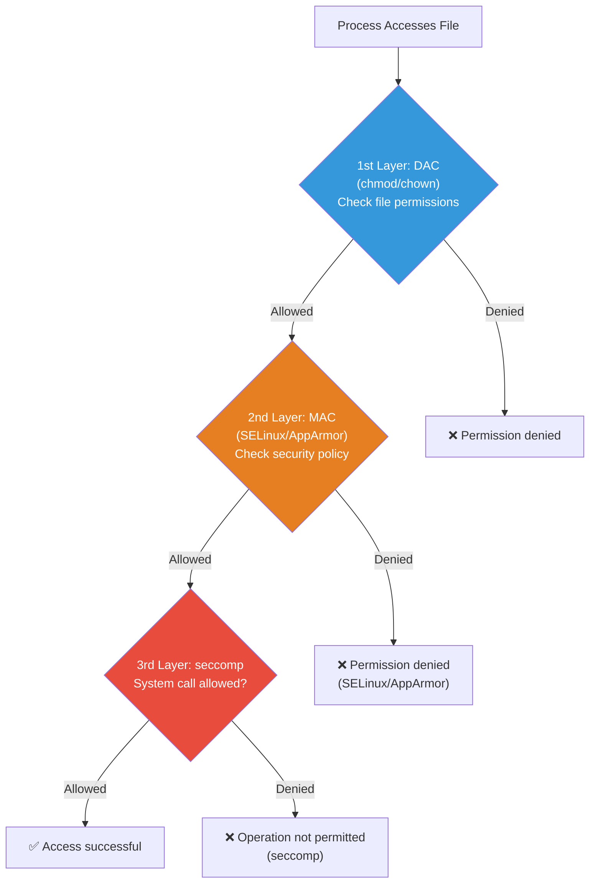
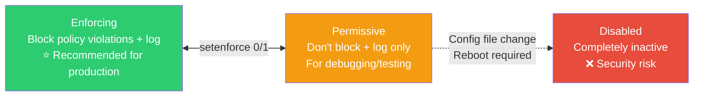
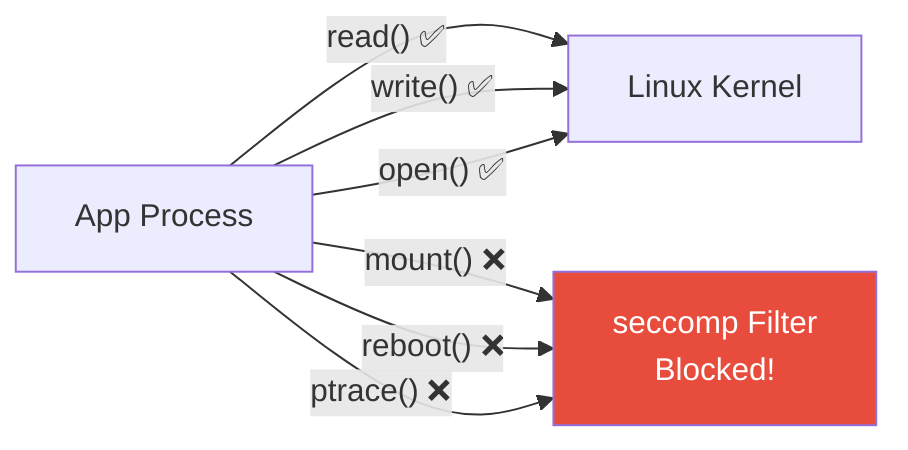
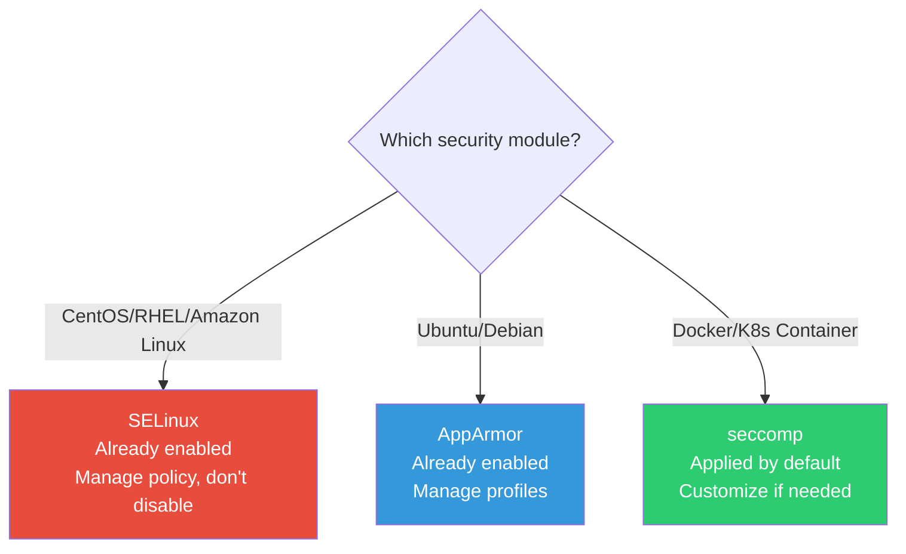

# Linux Security (SELinux / AppArmor / seccomp)

> Your server was compromised. The attacker gained root. Can you still limit the damage? SELinux, AppArmor, and seccomp are the **last line of defense**. They restrict what processes can do, making root compromise far less catastrophic.

---

## 🎯 Why You Need to Know This

```
Real-world situations where these technologies matter:
• "App can't read files" → SELinux/AppArmor may be blocking
• "System call not allowed in container" → seccomp profile blocking
• Docker/K8s security hardening → seccomp, AppArmor profiles
• Security audits/compliance → "Is MAC (Mandatory Access Control) enabled?"
• CIS Benchmark checks → Verify SELinux/AppArmor enabled
```

Many junior DevOps engineers encounter SELinux errors and disable it with `setenforce 0` — opening a security hole. Proper understanding lets you solve issues without compromising security.

---

## 🧠 Core Concepts

### Analogy: Security Clearance System

Let's compare Linux security to a **military classified facility**.

* **Basic Permissions (chmod/chown)** = Access badges. "This person can enter this room" — DAC (Discretionary Access Control)
* **SELinux / AppArmor** = Security clearance. Even with badge, wrong clearance = denied entry — MAC (Mandatory Access Control)
* **seccomp** = Behavioral restrictions. Inside the building, "no phone use," "no USB," specific action rules



**DAC vs MAC:**

| Comparison | DAC (Basic Permissions) | MAC (SELinux/AppArmor) |
|------------|-------------------------|------------------------|
| Who sets? | File owner | System administrator (policy) |
| Can root bypass? | ✅ Root bypasses all | ❌ Root still restricted by policy |
| Analogy | Door lock (key = access) | Security clearance (clearance required even with key) |

---

## 🔍 Detailed Explanation — SELinux

### What is SELinux?

**Security-Enhanced Linux**. Developed by NSA (US National Security Agency), it's enabled by default on Red Hat-based systems (CentOS, RHEL, Fedora, Amazon Linux).

Every process and file gets a **security label**, and access is controlled by **policies**.

```bash
# Check SELinux status
getenforce
# Enforcing    ← Active (blocks + logs)
# Permissive   ← Audit mode (logs only, doesn't block)
# Disabled     ← Inactive

sestatus
# SELinux status:                 enabled
# SELinuxfs mount:                /sys/fs/selinux
# SELinux root directory:         /etc/selinux
# Loaded policy name:             targeted
# Current mode:                   enforcing
# Mode from config file:          enforcing
```

### SELinux Modes



```bash
# Switch modes (temporary, reverts after reboot)
sudo setenforce 0    # Switch to Permissive
sudo setenforce 1    # Switch to Enforcing

# Permanent change (/etc/selinux/config)
# SELINUX=enforcing    ← enforcing / permissive / disabled
# SELINUXTYPE=targeted  ← targeted(default) / mls

# ⚠️ Switching Disabled → Enforcing requires reboot and relabeling
# → Can take 30+ minutes if many files
```

### SELinux Security Context (Labels)

```bash
# Check file security context (-Z option)
ls -laZ /var/www/html/index.html
# -rw-r--r--. root root unconfined_u:object_r:httpd_sys_content_t:s0 index.html
#                        ^^^^^^^^^^^^^^^^^^^^^^^^^^^^^^^^^^^^^^^^
#                        SELinux security context

# Format: user:role:type:level
# user:  unconfined_u (unrestricted user)
# role:  object_r (typical for files)
# type:  httpd_sys_content_t ← ⭐ Most important!
# level: s0 (MLS level)

# Process security context
ps auxZ | grep nginx
# system_u:system_r:httpd_t:s0  root  900 ... nginx: master process
#                   ^^^^^^^^
#                   httpd_t type

# Key: httpd_t process can access httpd_sys_content_t files
# → Policy permits this access
```

### Solving SELinux Issues

```bash
# === Most Common Scenario: Nginx Can't Read Files ===

# Error message
# nginx: [error] open() "/var/www/myapp/index.html" failed (13: Permission denied)

# Check permissions → they're fine
ls -la /var/www/myapp/index.html
# -rw-r--r-- 1 root root ... index.html    ← Permissions OK

# Fastest way to confirm SELinux is the cause:
# Temporarily switch to Permissive
sudo setenforce 0
# Try accessing → works? SELinux was the issue!
sudo setenforce 1    # Switch back to Enforcing

# Check SELinux logs
sudo ausearch -m avc -ts recent
# type=AVC msg=audit(1710234000.123:456): avc:  denied  { read } for
#   pid=900 comm="nginx" name="index.html"
#   scontext=system_u:system_r:httpd_t:s0
#   tcontext=unconfined_u:object_r:default_t:s0
#                                   ^^^^^^^^^
#                                   default_t! Not httpd_sys_content_t!
#   tclass=file permissive=0

# Root cause: File type is default_t → Nginx (httpd_t) can't access

# Solution: Change file type to httpd_sys_content_t
sudo semanage fcontext -a -t httpd_sys_content_t "/var/www/myapp(/.*)?"
sudo restorecon -Rv /var/www/myapp/
# Relabeled /var/www/myapp/index.html from default_t to httpd_sys_content_t

# Verify
ls -Z /var/www/myapp/index.html
# ... httpd_sys_content_t ...   ← Changed!
# → Nginx can now read it!
```

```bash
# Easier method: audit2allow (auto-generate permission rules)
sudo ausearch -m avc -ts recent | audit2allow -M myfix
# ******************** IMPORTANT ***********************
# To make this policy package active, execute:
# sudo semodule -i myfix.pp

sudo semodule -i myfix.pp    # Apply rules

# ⚠️ audit2allow is convenient but can weaken security if misused
# → Always review generated rules first
sudo ausearch -m avc -ts recent | audit2allow -a
# → Check what will be allowed before applying
```

### Commonly Used SELinux Commands

```bash
# Boolean (enable/disable features)
# Allow Nginx to make network connections (for proxying)
sudo setsebool -P httpd_can_network_connect on

# List Booleans
getsebool -a | grep httpd
# httpd_can_network_connect --> on
# httpd_can_network_connect_db --> off
# httpd_enable_homedirs --> off
# ...

# Allow database connections
sudo setsebool -P httpd_can_network_connect_db on

# Configure ports (Nginx on port 8080)
sudo semanage port -l | grep http_port_t
# http_port_t  tcp  80, 443, 488, 8008, 8009, 8443

sudo semanage port -a -t http_port_t -p tcp 8080
# → Add port 8080 to http type

# Restore file labels (reset to default policy)
sudo restorecon -Rv /var/www/

# Relabel entire system (time-consuming)
sudo touch /.autorelabel
sudo reboot
```

---

## 🔍 Detailed Explanation — AppArmor

### What is AppArmor?

AppArmor is the standard on Ubuntu/Debian. Simpler than SELinux.

**Differences:**
* SELinux: Every file has a label → label-based access control (complex, precise)
* AppArmor: Each program has a profile → path-based access control (simple, intuitive)

```bash
# Check AppArmor status
sudo aa-status
# apparmor module is loaded.
# 35 profiles are loaded.
# 35 profiles are in enforce mode.
#    /snap/snapd/21759/usr/lib/snapd/snap-confine
#    /usr/bin/evince
#    /usr/lib/NetworkManager/nm-dhcp-client.action
#    /usr/sbin/mysqld
#    docker-default
#    ...
# 0 profiles are in complain mode.
# 15 processes have profiles defined.
# 15 processes are in enforce mode.
# 0 processes are in complain mode.
# 0 processes are unconfined but have a profile defined.
```

### AppArmor Modes

| Mode | SELinux Equivalent | Behavior |
|------|-------------------|----------|
| enforce | Enforcing | Block violations + log |
| complain | Permissive | Log only (don't block) |
| unconfined | — | No profile (no restrictions) |

```bash
# Switch profile to complain mode (for debugging)
sudo aa-complain /usr/sbin/nginx

# Switch profile to enforce mode (production)
sudo aa-enforce /usr/sbin/nginx

# Disable profile
sudo aa-disable /usr/sbin/nginx
```

### AppArmor Profile Structure

```bash
# Profile locations
ls /etc/apparmor.d/
# usr.sbin.mysqld
# usr.sbin.nginx
# docker-default
# ...

# Example Nginx profile
cat /etc/apparmor.d/usr.sbin.nginx
```

```bash
# /etc/apparmor.d/usr.sbin.nginx

#include <tunables/global>

/usr/sbin/nginx {
    #include <abstractions/base>
    #include <abstractions/nameservice>

    # Executable
    /usr/sbin/nginx mr,              # Read + memory map

    # Configuration files
    /etc/nginx/** r,                 # Read recursively

    # Log files
    /var/log/nginx/** w,             # Write logs
    /var/log/nginx/ r,               # Read log directory

    # Web content
    /var/www/** r,                   # Read web content
    /usr/share/nginx/** r,           # Read Nginx defaults

    # PID file
    /run/nginx.pid rw,               # Read/write PID

    # Networking
    network inet stream,             # TCP sockets
    network inet6 stream,            # IPv6 TCP

    # System calls
    capability net_bind_service,     # Bind to ports < 1024
    capability setuid,               # Change UID (worker process)
    capability setgid,               # Change GID
    capability dac_override,         # Override DAC (when root)

    # Block: Everything not listed above is denied!
}
```

**Permission Symbols:**

| Symbol | Meaning |
|--------|---------|
| `r` | Read |
| `w` | Write |
| `a` | Append |
| `m` | Memory map (executables) |
| `k` | File locking |
| `l` | Symbolic link |
| `ix` | Execute inherited |
| `px` | Execute with profile switch |
| `ux` | Execute unrestricted |

### Solving AppArmor Issues

```bash
# "App can't read file" → Check if AppArmor is blocking

# 1. Check AppArmor logs
sudo dmesg | grep -i "apparmor.*denied"
# [12345.678] audit: type=1400 audit(1710234000.123:456):
#   apparmor="DENIED" operation="open"
#   profile="/usr/sbin/nginx"
#   name="/opt/myapp/static/logo.png"
#   requested_mask="r" denied_mask="r"
#   ^^^^^^^^                 ^^^^^^^^
#   Read requested           Read denied

# Or via journalctl
journalctl -k | grep DENIED | tail -10

# 2. Temporarily switch to complain mode for testing
sudo aa-complain /usr/sbin/nginx
# → Try accessing → works? AppArmor was blocking!

# 3. Add path to profile
sudo vim /etc/apparmor.d/usr.sbin.nginx
# /opt/myapp/** r,    ← Add this line

# 4. Reload profile
sudo apparmor_parser -r /etc/apparmor.d/usr.sbin.nginx

# 5. Switch back to enforce
sudo aa-enforce /usr/sbin/nginx

# 6. Verify
curl http://localhost/static/logo.png    # Now works!
```

```bash
# Auto-generate profile (aa-genprof)
# Observes app activity and creates profile automatically

sudo aa-genprof /opt/myapp/server
# Setting /opt/myapp/server to complain mode.
# Please start the application in another window and exercise its
# functionality now.
# ...
# (Run app in another terminal, use various features)
# ...
# (Return, press 'S' to save, 'F' to finish)

# Check generated profile
cat /etc/apparmor.d/opt.myapp.server
```

### Docker and AppArmor

```bash
# Docker applies docker-default AppArmor profile by default

# Check profile on container
docker inspect mycontainer | grep AppArmorProfile
# "AppArmorProfile": "docker-default"

# Apply custom profile
docker run --security-opt apparmor=my-custom-profile myimage

# Run without AppArmor (⚠️ Security risk!)
docker run --security-opt apparmor=unconfined myimage
```

---

## 🔍 Detailed Explanation — seccomp

### What is seccomp?

**Secure Computing Mode**. Restricts which **system calls (syscalls)** processes can use. Linux has 300+ syscalls, but most apps only need a fraction.



**Analogy:** Like restricting employee tools — "Excel OK, but command-line forbidden" — you restrict which syscalls an app can use.

### Docker's seccomp

Docker blocks ~44 dangerous syscalls by default.

```bash
# Key syscalls Docker's default profile blocks:
# - mount          (filesystem mounting)
# - umount         (filesystem unmounting)
# - ptrace         (debug/trace other processes)
# - reboot         (system reboot)
# - swapon/swapoff (swap management)
# - init_module    (load kernel module)
# - delete_module  (remove kernel module)
# - settimeofday   (change system time)
# - clock_settime  (change system clock)
# - keyctl         (kernel key management)

# → mount or reboot in container = blocked!
```

```bash
# Check seccomp in container
docker run --rm alpine grep Seccomp /proc/self/status
# Seccomp:        2
# Seccomp_filters:        1

# Values mean:
# 0 = seccomp disabled
# 1 = strict mode (read, write, exit, sigreturn only)
# 2 = filter mode (custom filter applied) ← Docker default
```

### Creating seccomp Profiles

```json
{
    "defaultAction": "SCMP_ACT_ERRNO",
    "architectures": ["SCMP_ARCH_X86_64"],
    "syscalls": [
        {
            "names": [
                "read", "write", "open", "close",
                "stat", "fstat", "lstat",
                "poll", "lseek", "mmap",
                "mprotect", "munmap", "brk",
                "ioctl", "access", "pipe",
                "select", "sched_yield",
                "socket", "connect", "accept",
                "sendto", "recvfrom",
                "bind", "listen",
                "clone", "fork", "execve",
                "exit", "exit_group",
                "getpid", "getuid",
                "arch_prctl", "futex",
                "set_tid_address",
                "set_robust_list",
                "epoll_create", "epoll_ctl", "epoll_wait"
            ],
            "action": "SCMP_ACT_ALLOW"
        }
    ]
}
```

```bash
# Save custom profile
sudo tee /etc/docker/seccomp/custom.json << 'EOF'
{
    "defaultAction": "SCMP_ACT_ERRNO",
    "syscalls": [
        {
            "names": ["read","write","open","close","stat","fstat",
                       "mmap","mprotect","munmap","brk","socket",
                       "connect","accept","bind","listen","sendto",
                       "recvfrom","clone","execve","exit","exit_group",
                       "getpid","getuid","epoll_create","epoll_ctl",
                       "epoll_wait","futex","set_tid_address",
                       "set_robust_list","arch_prctl","poll","lseek",
                       "ioctl","access","pipe","select","fcntl",
                       "openat","newfstatat","getcwd","chdir",
                       "getdents64","dup2","nanosleep","clock_gettime",
                       "sched_yield","sigaltstack","rt_sigaction",
                       "rt_sigprocmask","rt_sigreturn","gettid",
                       "setsockopt","getsockopt","getpeername",
                       "getsockname","writev","readv","pread64",
                       "getrandom","madvise","sysinfo","uname"],
            "action": "SCMP_ACT_ALLOW"
        }
    ]
}
EOF

# Run container with custom profile
docker run --security-opt seccomp=/etc/docker/seccomp/custom.json myimage

# Run without seccomp (⚠️ Security risk! Debugging only)
docker run --security-opt seccomp=unconfined myimage
```

### seccomp in Kubernetes

```yaml
# Apply seccomp profile to K8s Pod
apiVersion: v1
kind: Pod
metadata:
  name: secure-pod
spec:
  securityContext:
    seccompProfile:
      type: RuntimeDefault    # Use container runtime's default profile
  containers:
  - name: myapp
    image: myapp:latest
    securityContext:
      allowPrivilegeEscalation: false
      readOnlyRootFilesystem: true
      runAsNonRoot: true
      runAsUser: 1000
```

```bash
# seccomp Profile Types (Kubernetes)

# RuntimeDefault: Container runtime's default profile (containerd/CRI-O)
# → Similar to Docker's default
# → Sufficient for most apps

# Localhost: Custom profile stored on node
# seccompProfile:
#   type: Localhost
#   localhostProfile: profiles/custom.json
# → References /var/lib/kubelet/seccomp/profiles/custom.json

# Unconfined: Disable seccomp
# → Debugging only! Never production!
```

---

## 🔍 SELinux vs AppArmor vs seccomp Comparison

| Aspect | SELinux | AppArmor | seccomp |
|--------|---------|----------|---------|
| Common OS | RHEL, CentOS, Fedora, Amazon Linux | Ubuntu, Debian, SUSE | All Linux |
| Control Method | Label-based | Path-based | Syscall-based |
| Controls | Files, processes, network, ports | Files, network, capability | Syscalls only |
| Complexity | High | Medium | Low |
| Learning Curve | Steep | Moderate | Medium |
| Docker Default | ❌ (separate setup) | ✅ docker-default | ✅ default profile |
| K8s Support | ✅ | ✅ | ✅ |



---

## 💻 Hands-on Labs

### Lab 1: Check Active Security Modules

```bash
# Determine which security modules are active

# SELinux (CentOS/RHEL)
getenforce 2>/dev/null || echo "SELinux not found"

# AppArmor (Ubuntu/Debian)
sudo aa-status 2>/dev/null || echo "AppArmor not found"

# seccomp support
grep CONFIG_SECCOMP /boot/config-$(uname -r) 2>/dev/null
# CONFIG_SECCOMP=y
# CONFIG_SECCOMP_FILTER=y

# Or check current shell
grep Seccomp /proc/self/status
# Seccomp:        0      ← Current shell not using seccomp
# Seccomp_filters: 0
```

### Lab 2: Observe AppArmor Profiles (Ubuntu)

```bash
# 1. Check active profiles
sudo aa-status

# 2. Count enforce mode profiles
sudo aa-status | grep "profiles are in enforce"

# 3. Check Docker's default profile
docker run --rm alpine cat /proc/self/attr/current 2>/dev/null
# docker-default (enforce)

# 4. Check AppArmor logs
sudo dmesg | grep -i apparmor | tail -5

# 5. Optional: Try switching a profile to complain mode (if available)
# sudo aa-complain /usr/sbin/nginx
# sudo aa-enforce /usr/sbin/nginx
```

### Lab 3: See seccomp Blocking

```bash
# Experience what seccomp blocks

# 1. Default profile: mount is blocked
docker run --rm alpine mount -t tmpfs tmpfs /mnt 2>&1
# mount: permission denied (are you root?)
# → seccomp blocked mount syscall!

# 2. Without seccomp: mount works
docker run --rm --security-opt seccomp=unconfined alpine mount -t tmpfs tmpfs /mnt
echo $?
# 0  ← Success!

# 3. Default profile also blocks unshare
docker run --rm alpine unshare --pid --fork bash -c "echo hello" 2>&1
# Operation not permitted

# 4. Unconfined allows it
docker run --rm --security-opt seccomp=unconfined alpine unshare --pid --fork sh -c "echo hello"
# hello
```

### Lab 4: K8s seccomp Status

```bash
# Check seccomp on K8s Pod

kubectl run test-pod --image=alpine --rm -it --restart=Never -- \
    grep Seccomp /proc/self/status
# Seccomp:        2              ← Filter mode applied
# Seccomp_filters: 1

# Apply security context
cat << 'EOF' | kubectl apply -f -
apiVersion: v1
kind: Pod
metadata:
  name: secure-test
spec:
  securityContext:
    seccompProfile:
      type: RuntimeDefault
    runAsNonRoot: true
    runAsUser: 1000
  containers:
  - name: test
    image: alpine
    command: ["sh", "-c", "id && grep Seccomp /proc/self/status && sleep 30"]
    securityContext:
      allowPrivilegeEscalation: false
      readOnlyRootFilesystem: true
EOF

kubectl logs secure-test
# uid=1000 gid=0(root) groups=0(root)
# Seccomp:        2
# Seccomp_filters: 1

kubectl delete pod secure-test
```

---

## 🏢 Real-world Scenarios

### Scenario 1: "SELinux is Blocking Me" (Fix Without Disabling!)

```bash
# ❌ Wrong approach
sudo setenforce 0
# "Works!" → But security is compromised

# ✅ Correct approach

# 1. Find root cause in logs
sudo ausearch -m avc -ts recent | tail -20
# denied { read } ... scontext=httpd_t tcontext=default_t

# 2. Fix file labels
sudo restorecon -Rv /var/www/myapp/

# 3. If needed, add label rule
sudo semanage fcontext -a -t httpd_sys_content_t "/opt/myapp(/.*)?"
sudo restorecon -Rv /opt/myapp/

# 4. For network access, enable Boolean
sudo setsebool -P httpd_can_network_connect on

# 5. For custom ports
sudo semanage port -a -t http_port_t -p tcp 8080

# 6. Last resort: Generate rules from audit log
sudo ausearch -m avc -ts recent | audit2allow -M myfix
sudo semodule -i myfix.pp
```

### Scenario 2: Harden Docker Container Security

```bash
# Production container with comprehensive security

docker run -d \
    --name secure-app \
    --read-only \                              # Read-only filesystem
    --tmpfs /tmp:rw,noexec,nosuid,size=100m \ # /tmp writable but no execute
    --security-opt no-new-privileges:true \    # Block privilege escalation
    --security-opt seccomp=default \           # Default seccomp
    --security-opt apparmor=docker-default \   # Default AppArmor
    --cap-drop ALL \                           # Drop all capabilities
    --cap-add NET_BIND_SERVICE \               # Add only needed capability
    --user 1000:1000 \                         # Non-root user
    --memory 512m \                            # Memory limit
    --cpus 1.0 \                               # CPU limit
    --pids-limit 100 \                         # Process limit
    myapp:latest
```

### Scenario 3: CIS Benchmark Security Verification

```bash
# Check items from CIS Benchmark

# 1. Verify SELinux/AppArmor enabled
getenforce 2>/dev/null    # Should be Enforcing
sudo aa-status 2>/dev/null | grep "profiles are in enforce"

# 2. Disable unnecessary services
systemctl list-unit-files --state=enabled --type=service
# → Disable services you don't need

# 3. Prevent root login
grep "^PermitRootLogin" /etc/ssh/sshd_config
# PermitRootLogin no

# 4. Password policy
grep "^PASS_MAX_DAYS" /etc/login.defs
# PASS_MAX_DAYS   90

# 5. Filesystem security
mount | grep -E "nosuid|noexec|nodev"
# /tmp should have nosuid, noexec, nodev

# 6. Kernel security parameters
sysctl net.ipv4.conf.all.send_redirects
# net.ipv4.conf.all.send_redirects = 0  ← Should be 0

sysctl net.ipv4.conf.all.accept_redirects
# net.ipv4.conf.all.accept_redirects = 0  ← Should be 0
```

---

## ⚠️ Common Mistakes

### 1. Disabling SELinux/AppArmor Entirely

```bash
# ❌ "It's blocking me, just disable it"
sudo setenforce 0
# or
sudo systemctl disable apparmor

# ✅ Check logs and fix underlying issue
sudo ausearch -m avc -ts recent    # SELinux logs
sudo dmesg | grep DENIED           # AppArmor logs
```

### 2. Using --privileged on Every Container

```bash
# ❌ privileged = disable all security (seccomp, AppArmor, capabilities)
docker run --privileged myimage
# → Container can do almost anything on host!

# ✅ Add only required permissions
docker run --cap-add SYS_PTRACE myimage    # Only needed capability
docker run --security-opt seccomp=custom.json myimage  # Custom syscalls
```

### 3. Running with Unrestricted seccomp

```bash
# ❌
docker run --security-opt seccomp=unconfined myimage
# → mount, reboot, and other dangerous syscalls allowed

# ✅ Maintain default profile
docker run myimage    # Default seccomp automatically applied
```

### 4. Blindly Using audit2allow

```bash
# ❌ Generate and apply rules without understanding
sudo ausearch -m avc | audit2allow -M fixall
sudo semodule -i fixall.pp
# → Allows unnecessary permissions, weakens security

# ✅ Check what rules are generated first
sudo ausearch -m avc -ts recent | audit2allow -a
# allow httpd_t default_t:file { read open getattr };
# → "Is this actually needed?" before applying

# Better: Fix file labels instead
sudo restorecon -Rv /path/to/files
```

### 5. Running Containers as root

```bash
# ❌ Dockerfile without USER → runs as root
FROM ubuntu
RUN apt-get update && apt-get install -y myapp
CMD ["myapp"]    # root execution!

# ✅ Create non-root user
FROM ubuntu
RUN apt-get update && apt-get install -y myapp && \
    groupadd -r appuser && useradd -r -g appuser appuser
USER appuser
CMD ["myapp"]    # appuser execution
```

---

## 📝 Summary

### Security Commands Cheat Sheet

```bash
# === SELinux (CentOS/RHEL) ===
getenforce                          # Check status
sestatus                            # Detailed status
setenforce 0 / 1                    # Permissive / Enforcing (temporary)
ls -Z / ps auxZ                     # View security context
ausearch -m avc -ts recent          # Check denial logs
restorecon -Rv /path                # Restore labels
semanage fcontext -a -t TYPE PATH   # Add label rule
setsebool -P BOOL on/off            # Set Boolean
semanage port -a -t TYPE -p tcp PORT # Allow port

# === AppArmor (Ubuntu/Debian) ===
aa-status                           # Check status
aa-enforce /path/to/binary          # Enforce mode
aa-complain /path/to/binary         # Complain mode
aa-disable /path/to/binary          # Disable
apparmor_parser -r /etc/apparmor.d/PROFILE  # Reload
dmesg | grep DENIED                 # Check denial logs

# === seccomp ===
grep Seccomp /proc/self/status      # Check status
docker run --security-opt seccomp=PROFILE  # Apply to Docker
# K8s: spec.securityContext.seccompProfile.type: RuntimeDefault
```

### Security Checklist

```
✅ SELinux/AppArmor in enforce mode (don't disable!)
✅ Docker containers run as non-root
✅ Avoid --privileged flag (add only needed capabilities)
✅ Maintain default seccomp profile
✅ Monitor security module logs regularly
✅ Before disabling: Check logs and fix root cause
```

---

## 🔗 Next Lecture

🎉 **01-Linux Category Complete!**

Through 14 lectures, you've covered everything from Linux fundamentals through kernel internals to security. You now have the foundation to understand nearly everything running on servers.

Next: **[02-networking/01-osi-tcp-udp.md — Network Fundamentals (OSI / TCP / UDP)](../02-networking/01-osi-tcp-udp)**

Learn how servers communicate — the foundational network protocols. Now that you understand Linux, it's time to understand how Linux servers connect with each other and the world!
