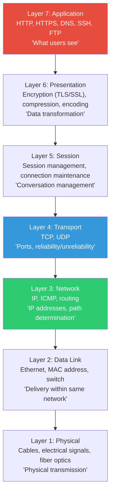
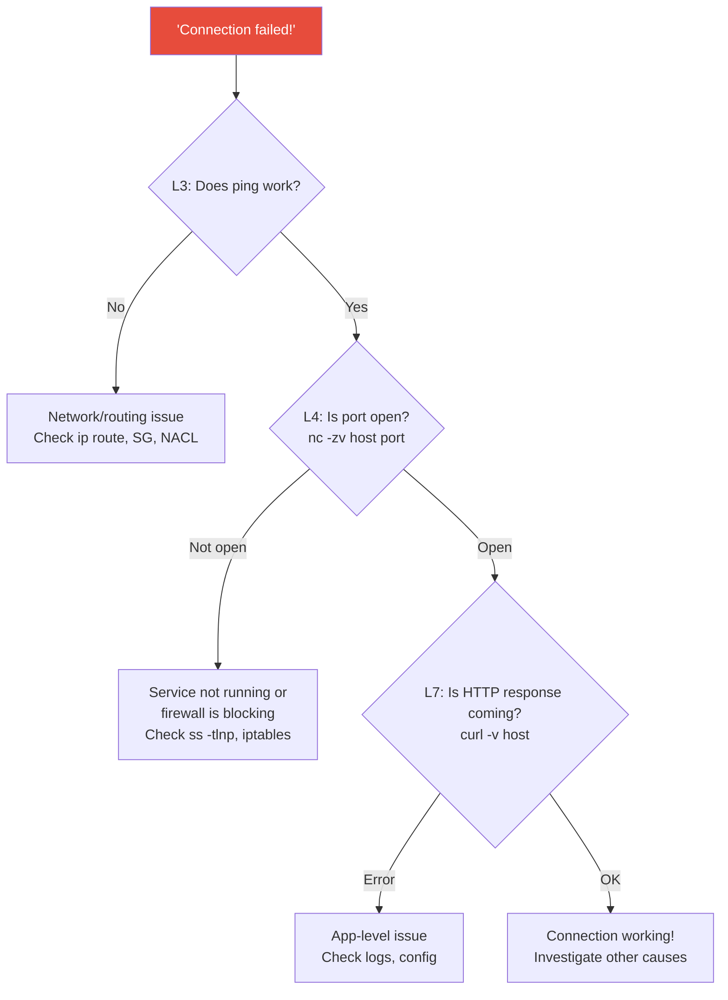
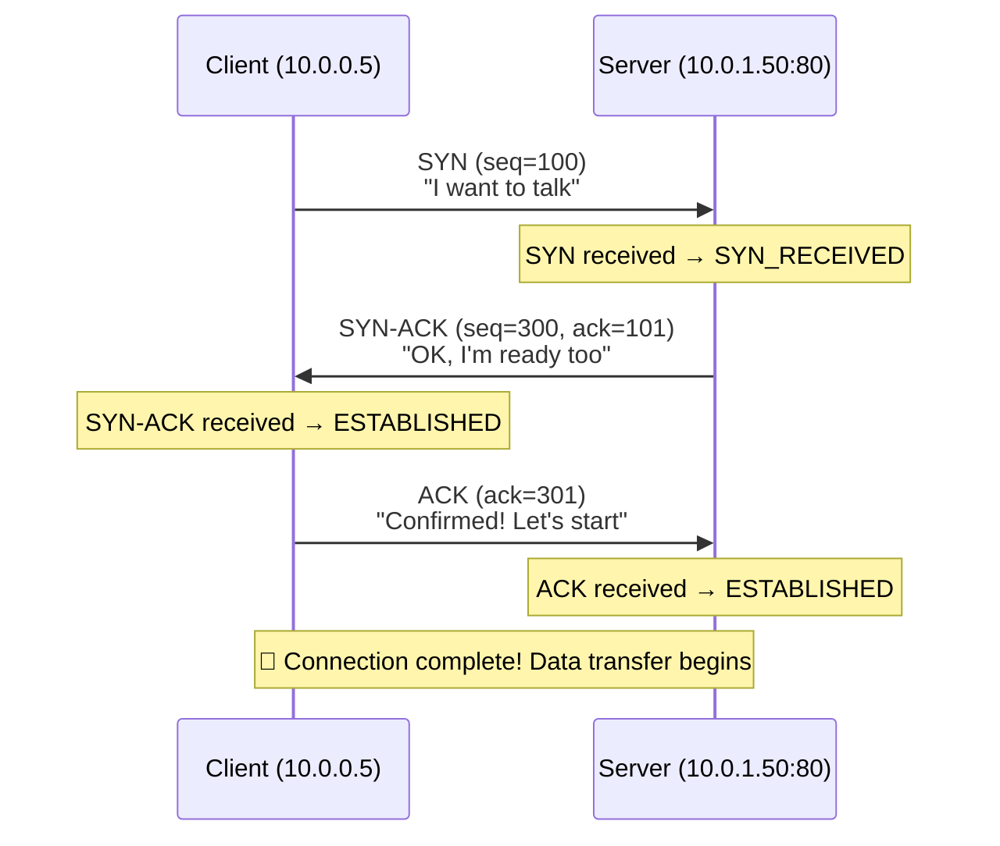
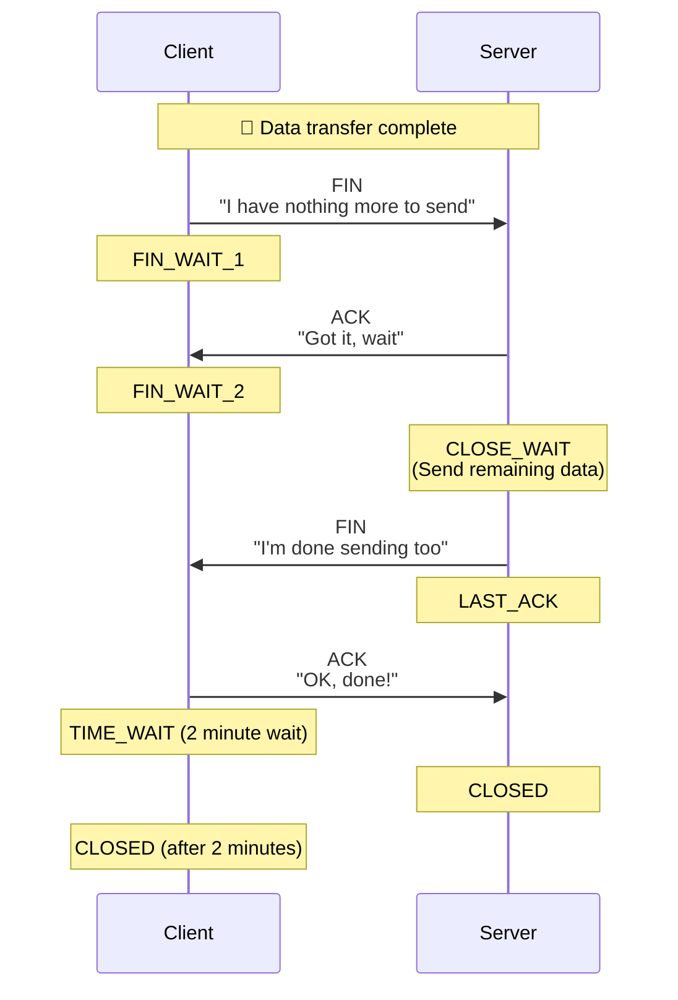
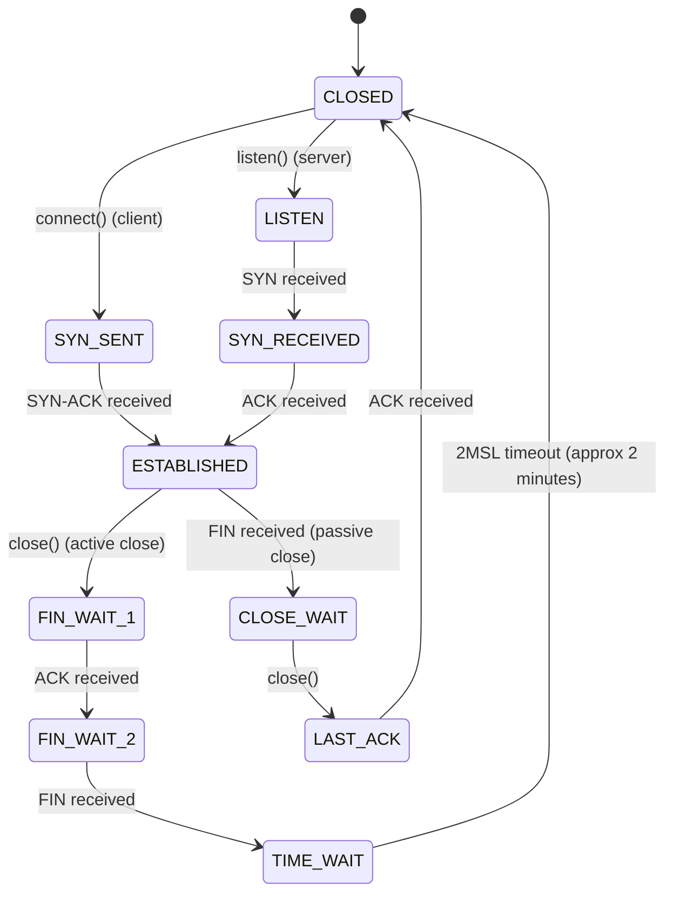
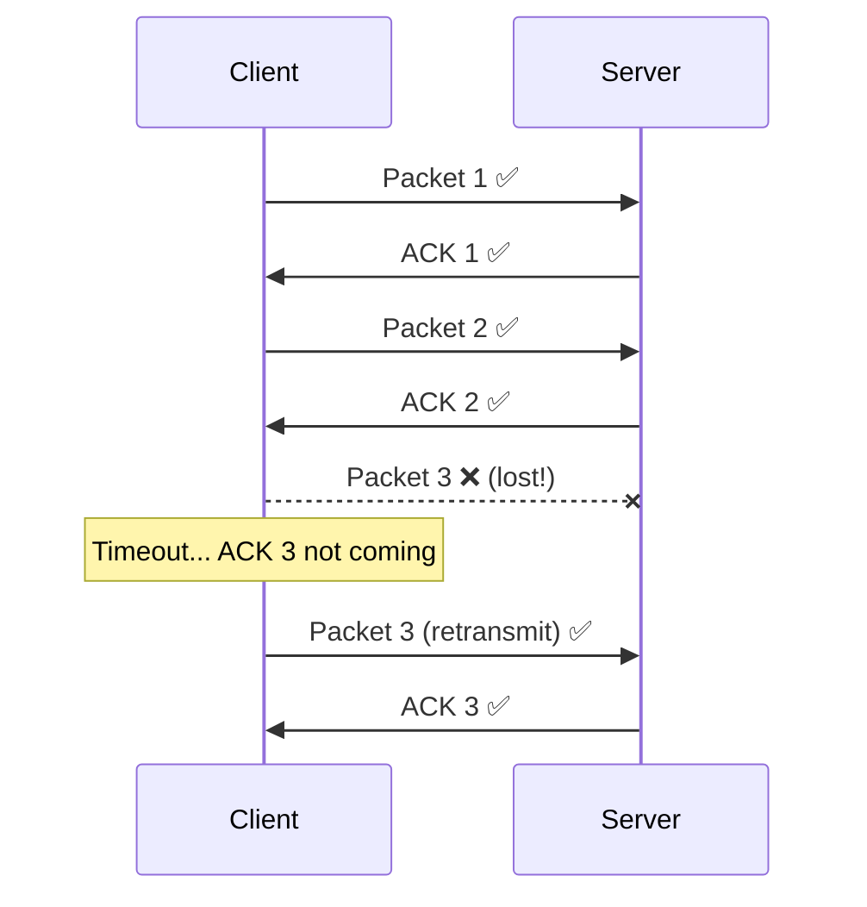
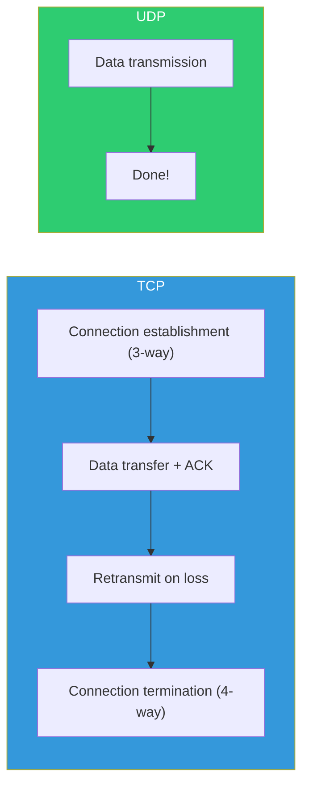
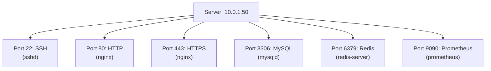
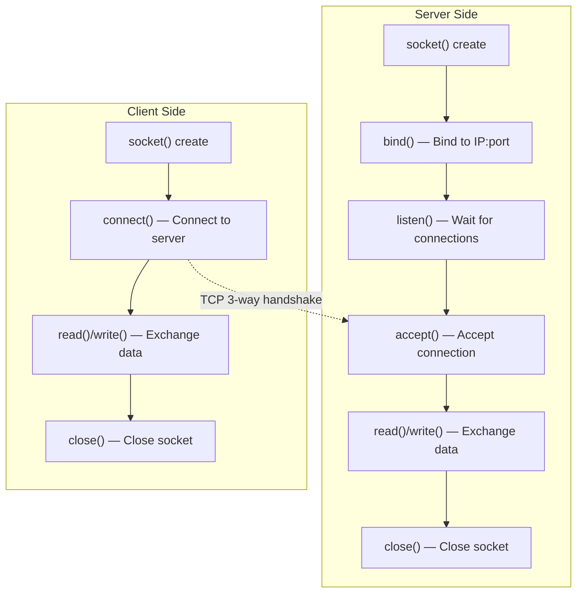

# Network Fundamentals (OSI / TCP / UDP / ports / sockets)

> Servers don't exist in isolation. They constantly communicate with other servers, clients, databases, and external APIs. Let's explore the fundamental principles of how this communication happens. Without understanding this, when network failures occur, you won't even know what's going wrong.

---

## 🎯 Why Do You Need to Know This?

```
Moments in practice when network knowledge is essential:
• "The app can't connect to the database"        → Is it a TCP connection issue? Is the port not open?
• "Packets are occasionally being lost"          → Understand TCP vs UDP characteristics
• "Is the load balancer L4 or L7?"              → Understand OSI layers
• "TIME_WAIT sockets are piling up"            → Understand TCP connection states
• "Server-to-server communication is slow"       → Diagnose which layer has the bottleneck
```

In the [previous lecture (Linux network commands)](../01-linux/09-network-commands), we learned tools like `ss`, `tcpdump`, and `ping`. This time, we're learning the **meaning** of the information those tools display.

---

## 🧠 Core Concepts

### Analogy: Parcel Delivery System

Let me explain networks using a **parcel delivery system analogy**.

* **IP address** = Delivery address (123 Teheran-ro, Gangnam-gu, Seoul)
* **Port (Port)** = Recipient at that address (123 Main St **Web Server Kim**, **Database Lee**)
* **TCP** = Registered mail. Requires recipient's signature to complete. Slow but reliable
* **UDP** = Regular mail. Just send it. Fast but doesn't guarantee delivery
* **Socket (Socket)** = Parcel delivery counter. The actual pathway to send and receive parcels
* **OSI Model** = Dividing the entire parcel delivery process (receipt → packing → labeling → truck → delivery) into 7 stages

---

## 🔍 Detailed Explanation — OSI Model

### OSI 7 Layers

The OSI model divides network communication into 7 layers. In practice, you don't need to memorize every detail of each layer, but you should be able to identify **which layer a problem originates from**.



**Layers that DevOps typically works with:**

| Layer | DevOps Knowledge | Related Tools/Technologies |
|-------|------------------|---------------------------|
| **L7 (Application)** | HTTP status codes, DNS lookups, APIs | curl, dig, Nginx, ALB |
| **L4 (Transport)** | TCP/UDP, ports, connection states | ss, netstat, NLB, iptables |
| **L3 (Network)** | IP, routing, subnets | ip route, ping, traceroute, VPC |
| **L2 (Data Link)** | MAC, ARP (indirectly) | ip neigh, switches |

```bash
# Tools for diagnosing problems at each layer

# L1/L2: Physical connection, MAC
ip link show eth0                     # Interface status (UP?)
ethtool eth0                          # Link speed, cable status
ip neigh                              # ARP table

# L3: IP, routing
ping -c 3 10.0.2.10                   # Can reach IP?
traceroute 10.0.2.10                  # Trace path
ip route get 10.0.2.10                # Check routing

# L4: TCP/UDP, ports
ss -tlnp                              # Open ports
nc -zv 10.0.2.10 3306                 # Test TCP port connection
tcpdump -i eth0 port 80               # Capture packets

# L7: Application
curl -v http://10.0.2.10/api/health   # HTTP request/response
dig example.com                        # DNS lookup
```

### Troubleshooting Connection Problems by Layer



### TCP/IP 4 Layers (Practical Model)

The OSI 7 layers are theoretical, but in practice, we reference the **TCP/IP 4 layers** more often.

```
OSI 7 Layers         TCP/IP 4 Layers
─────────           ────────────
7. Application  ┐
6. Presentation ├── Application     (HTTP, DNS, SSH, TLS)
5. Session      ┘
4. Transport    ─── Transport       (TCP, UDP)
3. Network      ─── Internet        (IP, ICMP)
2. Data Link    ┐
1. Physical     ┘── Network Access  (Ethernet, WiFi)
```

---

## 🔍 Detailed Explanation — TCP

### What is TCP?

**Transmission Control Protocol**. Delivers data **reliably and in order**. It's used for most communications including web, databases, SSH, etc.

**TCP Characteristics:**
* **Connection-oriented** — Establishes connection before communication
* **Reliable** — Retransmits if packets are lost
* **Ordered** — Arrives in the order sent
* **Flow Control** — Adapts to the speed the receiver can handle
* **Congestion Control** — Reduces speed when network is congested

### TCP 3-Way Handshake (Connection Establishment)

This is the 3-step process TCP goes through before starting communication. The SYN, SYN-ACK, and ACK we saw in [tcpdump](../01-linux/09-network-commands) are exactly this.



**Analogy:** It's like making a phone call.
1. **SYN** → "Hello?" (calling)
2. **SYN-ACK** → "Yes, hello?" (answering)
3. **ACK** → "Can you hear me? Go ahead" (confirmation)

```bash
# Observe actual 3-way handshake with tcpdump
sudo tcpdump -i eth0 -nn port 80 -c 5

# Output:
# 14:30:00.001 IP 10.0.0.5.54321 > 10.0.1.50.80: Flags [S], seq 100
# 14:30:00.001 IP 10.0.1.50.80 > 10.0.0.5.54321: Flags [S.], seq 300, ack 101
# 14:30:00.002 IP 10.0.0.5.54321 > 10.0.1.50.80: Flags [.], ack 301
#                                                         ^^^
#                                                   [S]=SYN [S.]=SYN-ACK [.]=ACK
```

### TCP 4-Way Handshake (Connection Termination)

When closing a connection, there are 4 steps.



### Complete TCP Connection State Flow

This is the complete picture of the states we saw with `ss` in the [previous lecture](../01-linux/09-network-commands).



**States to focus on in practice:**

| State | Meaning | If many? | Action |
|-------|---------|----------|--------|
| `ESTABLISHED` | Normal connection | Normal (proportional to traffic) | — |
| `TIME_WAIT` | 2 minute wait after close | Frequent connections | sysctl tuning |
| `CLOSE_WAIT` | Remote closed, but I didn't | ⚠️ **App bug!** | Fix code |
| `SYN_RECEIVED` | Waiting for connection acceptance | ⚠️ SYN flood attack? | syncookies |

```bash
# Count connections by state
ss -tan | awk '{print $1}' | sort | uniq -c | sort -rn
#  200 ESTAB
#   50 TIME-WAIT
#    5 CLOSE-WAIT      ← Watch out if present!
#    2 LISTEN
#    1 State

# Sysctl tuning for TIME_WAIT
# (See previous lecture: ../01-linux/13-kernel)
sudo sysctl net.ipv4.tcp_tw_reuse=1        # Reuse TIME_WAIT sockets
sudo sysctl net.ipv4.tcp_fin_timeout=30     # FIN_WAIT_2 timeout (default 60s→30s)

# If CLOSE_WAIT accumulates → App isn't calling close() on socket
# → Check app code for connection close!
```

### TCP Retransmission and Timeouts

TCP automatically retransmits packets if they're lost. This is the core of "reliability".



```bash
# Kernel parameters related to TCP retransmission
sysctl net.ipv4.tcp_retries2
# 15    ← Max 15 retransmission attempts (approx 13~30 min)

# Check retransmission statistics
ss -ti
# ESTAB  ... rto:200 rtt:0.5/0.25 ... retrans:0/3
#             ^^^                       ^^^^^^^^^
#             Retransmission timeout(ms) Current/total retrans count

# Find connections with high retransmission
ss -ti | grep retrans | grep -v "retrans:0/0"
# → High retrans value indicates network quality issue
```

---

## 🔍 Detailed Explanation — UDP

### What is UDP?

**User Datagram Protocol**. Delivers data **quickly and simply**. Unlike TCP, it doesn't establish connections or retransmit.

**UDP Characteristics:**
* **Connectionless** — Transmit immediately without connection
* **Unreliable** — Won't retransmit if lost
* **No ordering** — May arrive in different order than sent
* **Fast** — No connection or confirmation process
* **Lightweight** — Header is 8 bytes (TCP is 20~60 bytes)

### TCP vs UDP Comparison

| Comparison | TCP | UDP |
|------------|-----|-----|
| Connection | Connection-oriented (handshake) | Connectionless |
| Reliability | Guaranteed (retransmit) | Not guaranteed |
| Ordering | Guaranteed | Not guaranteed |
| Speed | Relatively slow | Fast |
| Overhead | Large (20~60B header) | Small (8B header) |
| Flow/Congestion Control | Yes | No |
| Use Cases | HTTP, SSH, DB, file transfer | DNS, video streaming, games, VoIP |



**Analogy:**
* **TCP** = Registered mail. Delivery confirmation, resend on damage, trackable. Slow but reliable.
* **UDP** = Flyer distribution. Just throw it! Can't help if missed. Fast and can do in bulk.

### Where UDP is Used

```bash
# DNS (port 53) — Fast lookup is important
dig google.com
# Response should be fast, so UDP! (Large responses switch to TCP)

# DHCP (ports 67, 68) — Automatic IP assignment
# Requests are sent before having an IP, so UDP!

# NTP (port 123) — Time synchronization
# Accurate time is important, so lightweight UDP!

# Video streaming, voice calls (RTP)
# One lost packet just causes slight interruption. Retransmit would be slower!

# Remote syslog (port 514)
# One lost log isn't critical, so fast UDP

# Check open UDP ports
ss -ulnp
# State  Recv-Q  Send-Q  Local Address:Port  Process
# UNCONN 0       0       127.0.0.53%lo:53     users:(("systemd-resolve",...))
# UNCONN 0       0       0.0.0.0:68           users:(("dhclient",...))
# UNCONN 0       0       0.0.0.0:123          users:(("ntpd",...))
```

---

## 🔍 Detailed Explanation — Ports (Ports)

### What is a Port?

If IP address is the building address, port is the **room number inside the building**. For multiple services to run simultaneously on one server (IP), they must be distinguished by ports.



### Port Ranges

| Range | Name | Description |
|-------|------|-------------|
| 0~1023 | Well-known Ports | Standard services. Only root can bind |
| 1024~49151 | Registered Ports | Apps register and use |
| 49152~65535 | Dynamic/Ephemeral Ports | Clients use temporarily |

### Common Port Numbers (★ Must memorize!)

| Port | Protocol | Service | Practice Frequency |
|------|----------|---------|-------------------|
| 22 | TCP | SSH | ⭐⭐⭐⭐⭐ |
| 80 | TCP | HTTP | ⭐⭐⭐⭐⭐ |
| 443 | TCP | HTTPS | ⭐⭐⭐⭐⭐ |
| 53 | TCP/UDP | DNS | ⭐⭐⭐⭐ |
| 3306 | TCP | MySQL | ⭐⭐⭐⭐ |
| 5432 | TCP | PostgreSQL | ⭐⭐⭐⭐ |
| 6379 | TCP | Redis | ⭐⭐⭐⭐ |
| 27017 | TCP | MongoDB | ⭐⭐⭐ |
| 9090 | TCP | Prometheus | ⭐⭐⭐ |
| 3000 | TCP | Grafana | ⭐⭐⭐ |
| 8080 | TCP | Alternative HTTP / App server | ⭐⭐⭐ |
| 8443 | TCP | Alternative HTTPS | ⭐⭐⭐ |
| 2379 | TCP | etcd (K8s) | ⭐⭐⭐ |
| 6443 | TCP | K8s API Server | ⭐⭐⭐ |
| 10250 | TCP | kubelet | ⭐⭐⭐ |
| 25 | TCP | SMTP (mail) | ⭐⭐ |
| 5672 | TCP | RabbitMQ | ⭐⭐ |
| 9092 | TCP | Kafka | ⭐⭐ |
| 9200 | TCP | Elasticsearch | ⭐⭐ |

```bash
# Port name ↔ number mapping file
grep -E "^(ssh|http|https|mysql|postgresql|redis)" /etc/services
# ssh             22/tcp
# http            80/tcp
# https           443/tcp
# mysql           3306/tcp
# postgresql      5432/tcp

# Practical commands to check ports
ss -tlnp                              # Open TCP ports
ss -ulnp                              # Open UDP ports
sudo lsof -i :80                      # Process using port 80
nc -zv 10.0.2.10 3306                  # Test remote port connection
```

### Ephemeral Ports (Client Ports)

When a client connects to a server, the client side also uses a port. This is called an **ephemeral (temporary) port**.

```bash
# Example: My PC (10.0.0.5) connecting to web server (10.0.1.50:80)
# Connection: 10.0.0.5:54321 → 10.0.1.50:80
#                     ^^^^^
#                     ephemeral port (kernel assigns randomly)

# Current system's ephemeral port range
cat /proc/sys/net/ipv4/ip_local_port_range
# 32768   60999

# Heavy connections can exhaust ephemeral ports
# To expand the range:
sudo sysctl net.ipv4.ip_local_port_range="1024 65535"

# Count current ephemeral ports in use
ss -tan | awk '{print $4}' | grep -oP ':\K[0-9]+' | awk '$1>32767' | wc -l
# 150    ← 150 in use
```

---

## 🔍 Detailed Explanation — Sockets (Sockets)

### What is a Socket?

A socket is the **endpoint of network communication**. A program must open a socket to send and receive data over the network.

**Socket = IP address + Port number + Protocol (TCP/UDP) combination**

```bash
# A TCP connection is defined by a socket pair:
# (Client IP:port, Server IP:port)
# Example: (10.0.0.5:54321, 10.0.1.50:80)

# Multiple clients can connect to the same server port!
# (10.0.0.5:54321, 10.0.1.50:80)  ← Client A
# (10.0.0.5:54322, 10.0.1.50:80)  ← Client A's another connection
# (10.0.0.10:60000, 10.0.1.50:80) ← Client B
# → Thousands of connections possible on one server port!
```

### Socket Lifecycle



```bash
# Observe server socket states with ss

# LISTEN socket: Server waiting for connections
ss -tlnp
# State   Local Address:Port    Process
# LISTEN  0.0.0.0:80             nginx      ← bind() + listen() complete

# ESTAB socket: Exchanging data
ss -tnp
# State   Local Address:Port    Peer Address:Port   Process
# ESTAB   10.0.1.50:80          10.0.0.5:54321      nginx   ← After accept()

# Number of open sockets for process
ls /proc/$(pgrep -o nginx)/fd | wc -l
# 150

# Socket error: "Too many open files"
# → Check ulimit! (See ../01-linux/13-kernel)
```

### Unix Sockets (Local Communication)

For process-to-process communication on the same server, you can use **Unix sockets** instead of TCP/UDP. They're faster and have less overhead.

```bash
# Check Unix sockets
ss -xlnp
# Netid  State   Recv-Q  Send-Q  Local Address:Port  Process
# u_str  LISTEN  0       128     /var/run/docker.sock         users:(("dockerd",...))
# u_str  LISTEN  0       128     /run/php/php-fpm.sock        users:(("php-fpm",...))
# u_str  LISTEN  0       128     /var/run/mysqld/mysqld.sock  users:(("mysqld",...))

# Call Docker API with curl via Unix socket
curl --unix-socket /var/run/docker.sock http://localhost/containers/json | python3 -m json.tool

# Nginx connecting to PHP-FPM via Unix socket (faster than TCP)
# Nginx config:
# fastcgi_pass unix:/run/php/php-fpm.sock;
#
# vs TCP connection:
# fastcgi_pass 127.0.0.1:9000;
```

---

## 💻 Practice Examples

### Practice 1: Observe TCP 3-Way Handshake

```bash
# Terminal 1: Start tcpdump
sudo tcpdump -i lo -nn port 8080 -c 10

# Terminal 2: Run simple server
python3 -m http.server 8080 &

# Terminal 3: Connect
curl http://localhost:8080/

# Observe in Terminal 1:
# [S]   → SYN (start connection)
# [S.]  → SYN-ACK (accept connection)
# [.]   → ACK (confirm, handshake complete)
# [P.]  → PUSH-ACK (HTTP GET request)
# [P.]  → PUSH-ACK (HTTP 200 response)
# [F.]  → FIN (start closing)
# [.]   → ACK
# [F.]  → FIN
# [.]   → ACK

# Cleanup
kill %1
```

### Practice 2: Observe TCP Connection States

```bash
# 1. Check distribution of connection states
ss -tan | awk 'NR>1 {print $1}' | sort | uniq -c | sort -rn
#  200 ESTAB
#   50 TIME-WAIT
#    5 LISTEN

# 2. See which addresses TIME_WAIT sockets connected to
ss -tan state time-wait | awk '{print $4, $5}' | head -10

# 3. Count connections to specific server
ss -tan | grep "10.0.2.10" | awk '{print $1}' | sort | uniq -c
#  10 ESTAB
#   3 TIME-WAIT

# 4. Check for CLOSE_WAIT (app bug!)
ss -tan state close-wait
# If results appear, that process code needs review
```

### Practice 3: Port Scanning and Connection Testing

```bash
# 1. Check open ports on this server
ss -tlnp
# Which ports are open, what processes?

# 2. Test specific port on remote server
nc -zv localhost 22
# Connection to localhost 22 port [tcp/ssh] succeeded!

nc -zv localhost 3306 2>&1
# nc: connect to localhost port 3306 (tcp) failed: Connection refused
# → MySQL not running or not bound

# 3. Scan multiple ports at once
for port in 22 80 443 3306 5432 6379 8080 9090; do
    nc -zv -w 2 localhost $port 2>&1 | grep -E "succeeded|refused|timed"
done
# localhost 22 port [tcp/ssh] succeeded!
# localhost 80 port [tcp/http] succeeded!
# localhost 443 (tcp) failed: Connection refused
# ...

# 4. Test UDP port (different from TCP!)
nc -zuv localhost 53
# Connection to localhost 53 port [tcp/domain] succeeded!
```

### Practice 4: Understanding Sockets and Process Relationships

```bash
# 1. Number of sockets Nginx has open
NGINX_PID=$(pgrep -o nginx)
ls /proc/$NGINX_PID/fd 2>/dev/null | wc -l
# 50

# 2. Check what types of fd
ls -la /proc/$NGINX_PID/fd/ 2>/dev/null | head -10
# lr-x------ ... 0 -> /dev/null
# l-wx------ ... 1 -> /var/log/nginx/access.log
# l-wx------ ... 2 -> /var/log/nginx/error.log
# lrwx------ ... 6 -> socket:[12345]          ← Network socket!
# lrwx------ ... 7 -> socket:[12346]

# 3. More details with lsof
sudo lsof -p $NGINX_PID -i 2>/dev/null | head -10
# nginx 900 root  6u IPv4 12345 0t0 TCP *:http (LISTEN)
# nginx 901 www   10u IPv4 23456 0t0 TCP 10.0.1.50:http->10.0.0.5:54321 (ESTABLISHED)

# 4. Overall system socket statistics
ss -s
# Total: 500
# TCP:   350 (estab 200, closed 50, orphaned 5, timewait 50)
# UDP:   10
# RAW:   0
```

---

## 🏢 In Real Practice

### Scenario 1: "App Can't Connect to Database"

```bash
# Step 1: Can network reach DB server? (L3)
ping -c 3 10.0.2.10
# 64 bytes from 10.0.2.10: icmp_seq=1 ttl=64 time=0.5ms    ← OK

# Step 2: Is DB port open? (L4)
nc -zv 10.0.2.10 3306
# Connection to 10.0.2.10 3306 port [tcp/mysql] succeeded!   ← OK
# Or
# nc: connect to 10.0.2.10 port 3306 (tcp) failed: Connection refused  ← Failed!

# If failed, check:
# a. Is DB service running?
ssh 10.0.2.10 "ss -tlnp | grep 3306"
# LISTEN 0  128  127.0.0.1:3306  ...
#                ^^^^^^^^^
#                127.0.0.1! Only bound to localhost!

# b. Change DB binding address
# /etc/mysql/mysql.conf.d/mysqld.cnf
# bind-address = 0.0.0.0    # Allow all IPs
# Or
# bind-address = 10.0.2.10  # Specific IP only

# c. Check firewall
# Server side: iptables
ssh 10.0.2.10 "sudo iptables -L INPUT -n | grep 3306"
# Cloud: Verify 3306 in Security Group

# Step 3: Test app-level connection (L7)
mysql -h 10.0.2.10 -u myuser -p
# ERROR 1045 (28000): Access denied for user 'myuser'@'10.0.1.50'
# → Network works but DB auth issue!
```

### Scenario 2: TIME_WAIT Socket Explosion

```bash
# Situation: Server slows down, new connections fail
ss -tan state time-wait | wc -l
# 28000   ← 28,000! Ephemeral port nearly exhausted

# Cause: App repeatedly makes and breaks short connections
# HTTP Keep-Alive not used, or connection pool not used

# Immediate action: Kernel parameter tuning
sudo sysctl net.ipv4.tcp_tw_reuse=1              # Reuse TIME_WAIT sockets
sudo sysctl net.ipv4.ip_local_port_range="1024 65535"  # Expand port range
sudo sysctl net.ipv4.tcp_fin_timeout=15           # Reduce FIN timeout

# Root solution:
# 1. Enable HTTP Keep-Alive (Nginx)
#    keepalive_timeout 65;
#
# 2. Use DB/Redis connection pool
#    → Establish connections once, reuse them
#
# 3. Configure keepalive on upstream (Nginx → app server)
#    upstream backend {
#        server 10.0.1.60:8080;
#        keepalive 32;
#    }
```

### Scenario 3: Understanding L4 vs L7 Load Balancer Difference

```bash
# Common interview/practice question:
# "What's the difference between L4 and L7 load balancers?"

# L4 (Transport layer):
# → Look only at IP + port, distribute packets
# → Pass TCP connections themselves (packet-level)
# → Fast but can't see HTTP content
# → AWS NLB, HAProxy (TCP mode)

# L7 (Application layer):
# → Look at HTTP headers, URLs, cookies, distribute based on content
# → "If URL is /api/*, send to backend A; if /static/*, send to backend B"
# → TLS termination, HTTP redirects, authentication possible
# → AWS ALB, Nginx, HAProxy (HTTP mode)

# Summary:
# L4: Look at envelope (IP+port), deliver
# L7: Open envelope, look at letter content (HTTP), deliver

# → More details in next lecture (02-http) and 06-load-balancing.md!
```

### Scenario 4: Detecting SYN Flood Attack

```bash
# If SYN_RECEIVED state is abnormally high, suspect attack
ss -tan state syn-recv | wc -l
# 5000   ← Abnormal!

# Check attacking IPs
ss -tan state syn-recv | awk '{print $5}' | cut -d: -f1 | sort | uniq -c | sort -rn | head
#  2000 185.220.101.42
#  1500 103.145.12.88
#  1000 45.227.254.20

# Response: Enable SYN cookies
sudo sysctl net.ipv4.tcp_syncookies=1    # Already enabled by default

# Increase backlog
sudo sysctl net.ipv4.tcp_max_syn_backlog=65535
sudo sysctl net.core.somaxconn=65535

# Block specific IP
sudo iptables -A INPUT -s 185.220.101.42 -j DROP
```

---

## ⚠️ Common Mistakes

### 1. Assuming server is dead when ping fails

```bash
# ❌ Server doesn't respond to ping, must be dead!
ping 10.0.1.50
# 100% packet loss

# → AWS Security Group might be blocking ICMP!
# → Verify more accurately with TCP port
nc -zv 10.0.1.50 22    # Check SSH port
# Connection succeeded!  ← Server is alive!
```

### 2. Not understanding 0.0.0.0 vs 127.0.0.1

```bash
# 0.0.0.0:3306  → Accessible from all interfaces (including external!)
# 127.0.0.1:3306 → Only accessible from localhost (this server)

# ❌ DB open on 0.0.0.0 = external access possible! (Security risk)
ss -tlnp | grep 3306
# LISTEN  0.0.0.0:3306    ← Dangerous!

# ✅ Only accessible from localhost
# bind-address = 127.0.0.1
ss -tlnp | grep 3306
# LISTEN  127.0.0.1:3306  ← Safe
```

### 3. Mistaking CLOSE_WAIT for network problem

```bash
# ❌ "Is network broken?"
# → CLOSE_WAIT is not a network problem, it's an app bug!
# → Remote sent FIN, but our app didn't call close()

# ✅ Check app code for socket/connection close
# connection.close() or use try-with-resources
```

### 4. Not memorizing port numbers and looking them up every time

```bash
# Learning basic ports speeds up debugging:
# Minimum: 22(SSH), 80(HTTP), 443(HTTPS),
# 3306(MySQL), 5432(PostgreSQL), 6379(Redis),
# 53(DNS), 6443(K8s API)
```

### 5. Testing TCP services with UDP tools (and vice versa)

```bash
# ❌ Testing UDP service with TCP tool
nc -zv 10.0.1.50 53
# Connection refused    ← DNS not working?

# ✅ UDP requires -u option!
nc -zuv 10.0.1.50 53
# Connection succeeded!  ← DNS uses UDP 53!

# Same with ss
ss -tlnp   # TCP only
ss -ulnp   # UDP only
ss -tulnp  # Both
```

---

## 📝 Summary

### OSI Model Quick Reference

```
L7 Application  — HTTP, DNS, SSH           → curl, dig
L4 Transport    — TCP, UDP, ports           → ss, nc, tcpdump
L3 Network      — IP, routing               → ping, traceroute, ip route
L2 Data Link    — MAC, Ethernet             → ip neigh
L1 Physical     — Cables                    → ethtool
```

### TCP vs UDP At a Glance

```
TCP: Connection-oriented, reliable, ordered, slow  → HTTP, SSH, DB, file transfer
UDP: Connectionless, unreliable, unordered, fast  → DNS, streaming, games, NTP
```

### Essential Port Numbers

```
22=SSH  53=DNS  80=HTTP  443=HTTPS
3306=MySQL  5432=PostgreSQL  6379=Redis
6443=K8s API  9090=Prometheus  8080=Alt HTTP
```

### Connection Troubleshooting Order

```
1. ping (L3 connectivity)
2. nc -zv host port (L4 port)
3. curl -v (L7 application)
4. tcpdump (packet-level verification)
```

---

## 🔗 Next Lecture

Next is **[02-networking/02-http](./02-http)** — HTTP Ecosystem (HTTP/1.1 ~ HTTP/3 / QUIC / gRPC / WebSocket).

We'll explore **HTTP protocol** running on top of TCP/UDP. HTTP status codes, headers, Keep-Alive, version differences, gRPC and WebSocket — a complete understanding of web-based service communication protocols.
