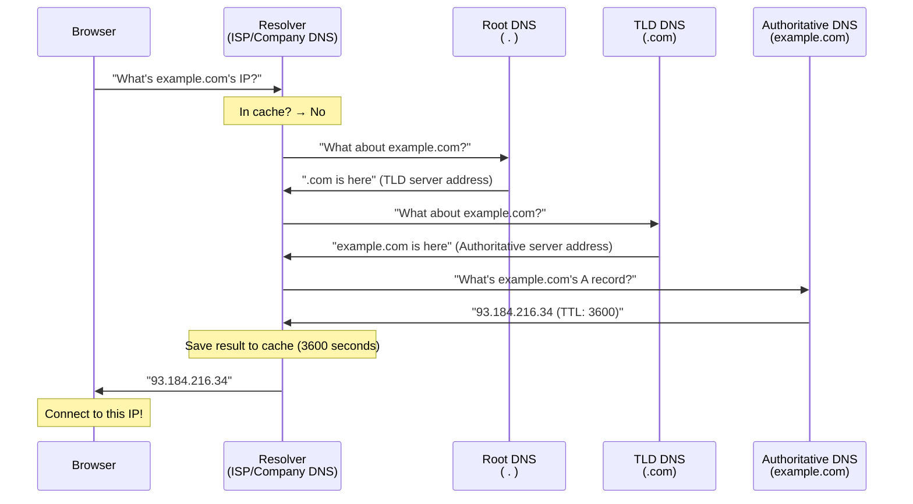
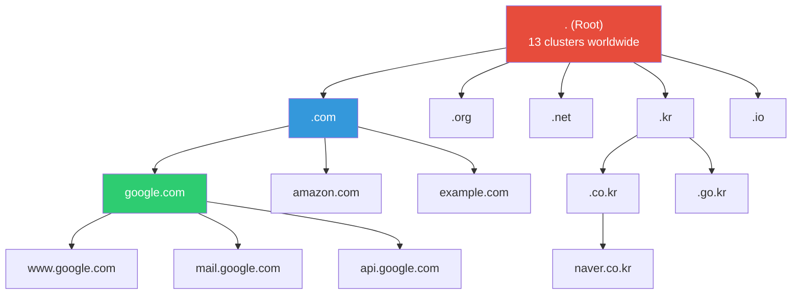
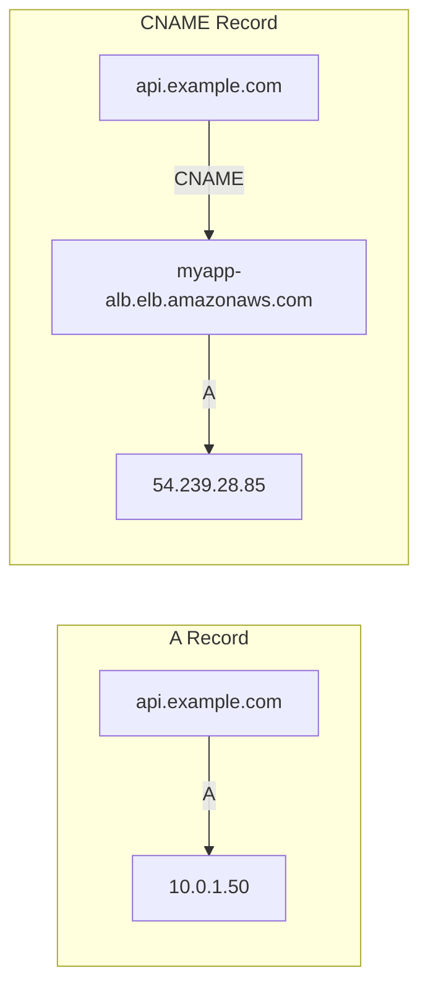
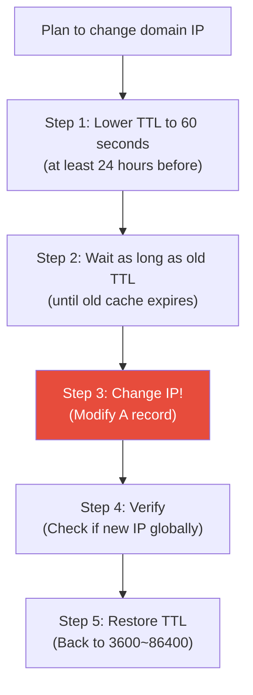
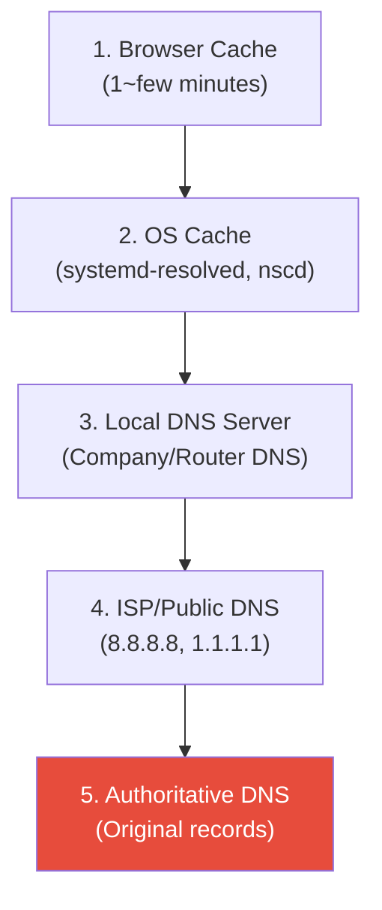

# DNS (recursive resolver / authoritative / record types / caching)

> When you type `google.com` in a browser, how does it find the server? DNS is the internet's phone book. It converts domain names to IP addresses. Without DNS, the internet doesn't work. When DNS is slow, everything slows down.

---

## 🎯 Why Do You Need to Know This?

```
DNS-related work in practice:
• Register/configure domain for new service              → Add A, CNAME records
• "Site won't open"                                     → Diagnose DNS or server problem
• Domain migration/change                                → TTL strategy, record change
• Email sending issues                                   → MX, SPF, DKIM, DMARC records
• SSL certificate issuance                              → DNS validation (TXT record)
• CDN / Load Balancing                                   → CNAME, weighted routing
• "DNS isn't propagating"                               → Understand TTL, cache, propagation
• Internal service discovery                            → Private DNS, CoreDNS
```

---

## 🧠 Core Concepts

### Analogy: Phone Directory + Information Desk

Let me explain DNS using a **phone directory system analogy**.

* **Domain name** = Person's name ("Google Kim")
* **IP address** = Phone number ("142.250.196.110")
* **DNS server** = Information desk. "What's Kim Google's phone number?" gets the answer
* **DNS cache** = Note of recently asked numbers. Next time someone asks, quick answer
* **TTL** = How long the note is valid. "This number works for 1 hour" (expire and ask again)

### Complete DNS Lookup Flow



---

## 🔍 Detailed Explanation — DNS Structure

### DNS Hierarchical Structure

DNS is structured like a tree. Root at very top, then TLDs below, then each domain below that.



```
Read domain name from right to left:
www.api.example.com.
 ^   ^    ^      ^  ^
 |   |    |      |  └─ Root (usually omitted)
 |   |    |      └─ TLD (Top-Level Domain)
 |   |    └─ Second-Level Domain (SLD)
 |   └─ Subdomain
 └─ Subdomain
```

### DNS Server Types

| Server | Role | Analogy | Example |
|--------|------|---------|---------|
| **Recursive Resolver** | Agent finding on client's behalf | Secretary ("I'll find it for you") | 8.8.8.8 (Google), 1.1.1.1 (Cloudflare), ISP DNS |
| **Root DNS** | Top-level. Tells where TLD servers are | Central information desk | 13 worldwide (a~m.root-servers.net) |
| **TLD DNS** | Manages .com, .net, etc. domains | Regional information desk | Verisign (.com), KISA (.kr) |
| **Authoritative DNS** | Holds actual domain records | Actual phone directory | Route53, Cloudflare DNS, Gabia |

```bash
# Follow each step directly (+trace option)
dig +trace example.com

# .                        518400  IN  NS  a.root-servers.net.   ← Root
# .                        518400  IN  NS  b.root-servers.net.
# ...
# com.                     172800  IN  NS  a.gtld-servers.net.   ← TLD (.com)
# com.                     172800  IN  NS  b.gtld-servers.net.
# ...
# example.com.             172800  IN  NS  a.iana-servers.net.   ← Authoritative
# example.com.             172800  IN  NS  b.iana-servers.net.
# ...
# example.com.             86400   IN  A   93.184.216.34         ← Final answer!
```

---

### DNS Record Types (★ Core!)

DNS records hold "information about this domain". There are many types, all used in practice.

#### A Record — Domain → IPv4

Most basic record. Maps domain to IPv4 address.

```bash
dig A example.com +short
# 93.184.216.34

dig A example.com
# ;; ANSWER SECTION:
# example.com.        86400   IN  A   93.184.216.34
#                      ^^^^^       ^   ^^^^^^^^^^^^^
#                      TTL(sec)    type  IP address

# Multiple A records (round-robin load balancing)
dig A google.com +short
# 142.250.196.110
# 142.250.196.113
# 142.250.196.100
# 142.250.196.101
# → Client picks one randomly
```

#### AAAA Record — Domain → IPv6

```bash
dig AAAA google.com +short
# 2404:6800:4004:820::200e
```

#### CNAME Record — Domain → Another Domain (Alias)

```bash
dig CNAME www.example.com +short
# example.com.
# → www.example.com is an alias for example.com

# Common real-world patterns:
# CDN connection
# cdn.mysite.com → d1234567.cloudfront.net
#
# Load balancer connection
# api.mysite.com → myapp-alb-123456.ap-northeast-2.elb.amazonaws.com
#
# SaaS service connection
# status.mysite.com → mycompany.statuspage.io
```

**A vs CNAME:**



```bash
# CNAME Important Notes:
# 1. Can't use CNAME for zone apex (root domain)!
#    ❌ example.com → CNAME → something.else.com
#    ✅ www.example.com → CNAME → something.else.com
#    ✅ example.com → A → 10.0.1.50
#
# 2. Route53's Alias record can connect ALB at zone apex! (AWS-specific)
#    example.com → Alias → myapp-alb.elb.amazonaws.com
```

#### MX Record — Mail Server

```bash
dig MX gmail.com +short
# 5 gmail-smtp-in.l.google.com.
# 10 alt1.gmail-smtp-in.l.google.com.
# 20 alt2.gmail-smtp-in.l.google.com.
# 30 alt3.gmail-smtp-in.l.google.com.
# 40 alt4.gmail-smtp-in.l.google.com.
# ^
# Priority (lower = try first)

# When email is sent to alice@gmail.com:
# 1. Query gmail.com's MX record
# 2. Try priority 5 server first: gmail-smtp-in.l.google.com
# 3. If fails, try priority 10 server
```

#### TXT Record — Text Information

General-purpose record for various uses.

```bash
dig TXT example.com +short
# "v=spf1 include:_spf.google.com ~all"
# "google-site-verification=abc123..."

# Main uses:
# 1. SPF (email spam prevention) — List servers that can send mail from this domain
# "v=spf1 include:_spf.google.com include:amazonses.com ~all"

# 2. DKIM (email signature verification)
# selector._domainkey.example.com → "v=DKIM1; p=MIGfMA0GCSqGSIb3..."

# 3. DMARC (email policy)
# _dmarc.example.com → "v=DMARC1; p=reject; rua=mailto:dmarc@example.com"

# 4. Domain ownership verification (SSL cert, Google Search Console, etc.)
# "google-site-verification=abc123..."

# 5. Let's Encrypt DNS validation
# _acme-challenge.example.com → "AbCdEfGhIjKlMnOpQrStUvWxYz"
```

#### SRV Record — Service Location

Tells where specific service is hosted and on what port.

```bash
dig SRV _sip._tcp.example.com +short
# 10 60 5060 sipserver.example.com.
# ^  ^  ^    ^
# priority weight port host

# Real-world uses:
# Kubernetes service discovery
# _http._tcp.myservice.default.svc.cluster.local
# → Returns Pod's IP and port

# Usually you don't set these manually,
# K8s CoreDNS generates them automatically
```

#### NS Record — Nameserver Delegation

```bash
dig NS example.com +short
# a.iana-servers.net.
# b.iana-servers.net.
# → These servers manage this domain's DNS

# Real-world: Changing nameserver when migrating domain
# Example: Migrate from Gabia to Route53
# In Gabia management panel, change NS to Route53's NS:
# ns-123.awsdns-45.com.
# ns-678.awsdns-90.net.
# ns-111.awsdns-22.org.
# ns-333.awsdns-44.co.uk.
```

#### PTR Record — IP → Domain (Reverse)

```bash
# Forward: Domain → IP (A record)
dig A example.com +short
# 93.184.216.34

# Reverse: IP → Domain (PTR record)
dig -x 93.184.216.34 +short
# → What domain is this IP? (used by email spam filters)

# Real-world: If mail server's PTR isn't set, might be classified as spam
```

#### Record Type Summary

| Type | Purpose | Example | Practice Frequency |
|------|---------|---------|-------------------|
| **A** | Domain → IPv4 | example.com → 10.0.1.50 | ⭐⭐⭐⭐⭐ |
| **AAAA** | Domain → IPv6 | example.com → 2001:db8::1 | ⭐⭐ |
| **CNAME** | Domain → Another domain | www → example.com | ⭐⭐⭐⭐⭐ |
| **MX** | Mail server | example.com → mail.example.com | ⭐⭐⭐ |
| **TXT** | Text (SPF, DKIM, validation) | "v=spf1 ..." | ⭐⭐⭐⭐ |
| **NS** | Nameserver | example.com → ns1.route53.com | ⭐⭐⭐ |
| **SRV** | Service location (host+port) | _sip._tcp → host:5060 | ⭐⭐ |
| **PTR** | IP → Domain (reverse) | 10.0.1.50 → example.com | ⭐⭐ |
| **SOA** | Domain management info | Serial, refresh period, etc. | ⭐ |
| **CAA** | Certificate authority | "0 issue letsencrypt.org" | ⭐⭐ |

---

### DNS Caching and TTL

#### TTL (Time To Live)

TTL is how long DNS cache is valid. During TTL, same question gets cached answer.

```bash
dig example.com
# example.com.   86400   IN  A  93.184.216.34
#                 ^^^^^
#                 TTL = 86400 seconds = 24 hours

# High TTL (example: 86400 = 24 hours):
# ✅ DNS lookups reduced → Faster
# ❌ Changes take time to reflect → Might go to old IP for 24 hours

# Low TTL (example: 60 = 1 minute):
# ✅ Changes reflect quickly
# ❌ DNS lookups increase slightly → Marginally slower
```

#### DNS Change TTL Strategy (★ Real Practice Core!)



```bash
# Real-world example: Server migration

# 1. Check current TTL
dig example.com | grep -E "^example"
# example.com.  86400  IN  A  10.0.1.50    ← TTL 24 hours

# 2. Lower TTL to 60 seconds (in Route53, Cloudflare, etc.)
# A record TTL: 86400 → 60

# 3. Wait 24 hours (for old cache to update)
# (Global DNS caches update with new TTL=60)

# 4. Change IP!
# A record: 10.0.1.50 → 10.0.2.100

# 5. Verify
dig example.com +short
# 10.0.2.100    ← New IP!

# 6. Verify globally (multiple DNS servers)
dig @8.8.8.8 example.com +short      # Google DNS
dig @1.1.1.1 example.com +short      # Cloudflare DNS
dig @208.67.222.222 example.com +short  # OpenDNS

# 7. After stabilization, restore TTL
# A record TTL: 60 → 3600 (or 86400)
```

#### DNS Cache Layers



```bash
# Check/clear OS DNS cache

# Ubuntu (systemd-resolved)
resolvectl statistics
# Cache: 150 hits, 50 misses

# Clear cache
sudo resolvectl flush-caches
resolvectl statistics
# Cache: 0 hits, 0 misses    ← Cleared

# macOS
sudo dscacheutil -flushcache; sudo killall -HUP mDNSResponder

# Windows
ipconfig /flushdns
```

---

### DNS Debugging Tools

#### dig — Swiss Army Knife of DNS Queries (★ Used most)

```bash
# Basic query
dig example.com
# ;; QUESTION SECTION:
# ;example.com.                   IN  A
#
# ;; ANSWER SECTION:
# example.com.            86400   IN  A  93.184.216.34
#
# ;; Query time: 15 msec         ← Response time
# ;; SERVER: 127.0.0.53#53(127.0.0.53)  ← DNS server used
# ;; WHEN: Wed Mar 12 14:30:00 UTC 2025
# ;; MSG SIZE  rcvd: 56

# Just the IP, simple
dig example.com +short
# 93.184.216.34

# Specific record type
dig MX gmail.com +short
dig TXT example.com +short
dig NS example.com +short
dig CNAME www.example.com +short
dig AAAA google.com +short

# Query specific DNS server
dig @8.8.8.8 example.com +short         # Google DNS
dig @1.1.1.1 example.com +short         # Cloudflare DNS
dig @ns-123.awsdns-45.com example.com   # Specific Authoritative server

# Trace entire query process
dig +trace example.com

# Reverse query (IP → domain)
dig -x 8.8.8.8 +short
# dns.google.

# Query all records
dig example.com ANY +short
# (some DNS servers block ANY queries)

# Show response time only
dig example.com | grep "Query time"
# ;; Query time: 15 msec
```

#### nslookup — Simple Query (Legacy)

```bash
nslookup example.com
# Server:         127.0.0.53
# Address:        127.0.0.53#53
#
# Non-authoritative answer:
# Name:   example.com
# Address: 93.184.216.34

# Use specific DNS server
nslookup example.com 8.8.8.8

# Specify record type
nslookup -type=MX gmail.com
nslookup -type=TXT example.com

# dig is more detailed and better for scripting, so dig recommended!
```

#### host — Concise Query

```bash
host example.com
# example.com has address 93.184.216.34
# example.com has IPv6 address 2606:2800:220:1:248:1893:25c8:1946
# example.com mail is handled by 0 .

host -t MX gmail.com
# gmail.com mail is handled by 5 gmail-smtp-in.l.google.com.
# gmail.com mail is handled by 10 alt1.gmail-smtp-in.l.google.com.
```

---

### /etc/resolv.conf — DNS Client Configuration

```bash
cat /etc/resolv.conf
# nameserver 127.0.0.53          ← Local DNS resolver (systemd-resolved)
# options edns0 trust-ad
# search ec2.internal             ← Domain search suffix

# Meaning of search:
# ping web01 → First tries web01.ec2.internal
# → If not found, tries web01. (FQDN)

# Check actual upstream DNS (when using systemd-resolved)
resolvectl status
# Link 2 (eth0)
#     Current DNS Server: 10.0.0.2          ← Actual DNS server
#     DNS Servers: 10.0.0.2
#     DNS Domain: ec2.internal
```

### /etc/hosts — Local DNS Override

```bash
cat /etc/hosts
# 127.0.0.1   localhost
# 127.0.1.1   myserver
#
# # Custom mapping (takes priority over DNS!)
# 10.0.1.50   api.internal.mycompany.com
# 10.0.2.10   db.internal.mycompany.com

# Real-world uses:
# 1. Test before DNS change
#    → Add new IP to /etc/hosts and test connection
# 2. Map internal service names (small environment)
# 3. Temporary workaround if DNS fails

# Note: /etc/hosts only applies to this server!
# To apply to other servers, use DNS server

# Check lookup order
cat /etc/nsswitch.conf | grep hosts
# hosts: files dns
#        ^^^^^
#        files(/etc/hosts) first → If not found, use dns
```

---

### DNS Propagation (Spreading)

Even after changing DNS records, it doesn't reflect worldwide instantly. Each cache layer expires based on TTL.

```bash
# Check propagation status

# 1. Check multiple public DNS servers
for dns in 8.8.8.8 1.1.1.1 208.67.222.222 9.9.9.9; do
    echo -n "$dns: "
    dig @$dns example.com +short
done
# 8.8.8.8: 93.184.216.34
# 1.1.1.1: 93.184.216.34
# 208.67.222.222: 93.184.216.34
# 9.9.9.9: 93.184.216.34

# 2. Check directly on Authoritative server (original)
AUTH_NS=$(dig NS example.com +short | head -1)
dig @$AUTH_NS example.com +short
# → This is the most accurate current value

# 3. Online tool: https://www.whatsmydns.net/
# → See propagation status on map worldwide

# Reasons for slow propagation:
# 1. If old TTL was high, must wait that time
# 2. Some ISP DNS ignore TTL and cache longer
# 3. Browser/OS cache also separate
```

---

## 💻 Practice Examples

### Practice 1: Basic dig Usage

```bash
# 1. Query A record
dig google.com +short
dig naver.com +short

# 2. Trace CNAME
dig www.github.com
# → Read CNAME → github.com → A record in order

# 3. Mail server (MX)
dig MX gmail.com +short
dig MX naver.com +short

# 4. TXT record (SPF, etc.)
dig TXT google.com +short

# 5. Nameserver (NS)
dig NS google.com +short

# 6. Trace entire query process
dig +trace google.com

# 7. Use specific DNS server
dig @8.8.8.8 google.com +short
dig @1.1.1.1 google.com +short

# Different results? → Propagating or using GeoDNS
```

### Practice 2: Compare DNS Response Times

```bash
# Compare response times across public DNSes
for dns in 8.8.8.8 8.8.4.4 1.1.1.1 1.0.0.1 208.67.222.222 9.9.9.9; do
    time=$(dig @$dns google.com +stats 2>/dev/null | grep "Query time" | awk '{print $4}')
    echo "DNS $dns: ${time}ms"
done
# DNS 8.8.8.8: 5ms
# DNS 8.8.4.4: 6ms
# DNS 1.1.1.1: 3ms           ← Cloudflare fastest
# DNS 1.0.0.1: 3ms
# DNS 208.67.222.222: 12ms
# DNS 9.9.9.9: 8ms

# Same query twice (cache effect)
dig @8.8.8.8 google.com | grep "Query time"
# ;; Query time: 15 msec      ← First (cache miss)
dig @8.8.8.8 google.com | grep "Query time"
# ;; Query time: 1 msec       ← Second (cache hit!)
```

### Practice 3: Override DNS with /etc/hosts

```bash
# 1. Check current google.com IP
dig google.com +short
# 142.250.196.110

# 2. Override in /etc/hosts
echo "127.0.0.1 test.google.com" | sudo tee -a /etc/hosts

# 3. Verify
ping -c 1 test.google.com
# PING test.google.com (127.0.0.1) ← /etc/hosts takes priority!

# 4. Cleanup
sudo sed -i '/test.google.com/d' /etc/hosts
```

### Practice 4: Simulate DNS Propagation

```bash
# Query same domain across multiple DNS servers to check propagation
DOMAIN="example.com"
DNS_SERVERS="8.8.8.8 1.1.1.1 208.67.222.222 9.9.9.9"

echo "=== $DOMAIN DNS Propagation Check ==="
for dns in $DNS_SERVERS; do
    result=$(dig @$dns $DOMAIN +short 2>/dev/null | head -1)
    ttl=$(dig @$dns $DOMAIN 2>/dev/null | grep -E "^$DOMAIN" | awk '{print $2}')
    echo "DNS $dns: IP=$result TTL=$ttl"
done
# DNS 8.8.8.8: IP=93.184.216.34 TTL=3500
# DNS 1.1.1.1: IP=93.184.216.34 TTL=82400
# → Different TTL means each DNS cached at different time
```

---

## 🏢 In Real Practice

### Scenario 1: Configure Domain for New Service (Route53)

```bash
# Setting up api.mycompany.com for new service

# 1. Check current domain's nameserver
dig NS mycompany.com +short
# ns-123.awsdns-45.com.    ← Using Route53

# 2. Add record in Route53
# A record: api.mycompany.com → ALB (Alias)
# Or
# CNAME: api.mycompany.com → myapp-alb-123.ap-northeast-2.elb.amazonaws.com

# 3. Verify (directly on Authoritative server)
dig @ns-123.awsdns-45.com api.mycompany.com +short
# → ALB IP should appear

# 4. Check on public DNS (wait for propagation)
dig @8.8.8.8 api.mycompany.com +short
# → Might need to wait for TTL

# 5. Test access
curl -v https://api.mycompany.com/health
```

### Scenario 2: "Site Won't Open" — Is It DNS or Server?

```bash
# 1. Can DNS be resolved?
dig mysite.com +short
# (nothing) ← DNS problem!
# Or
# 10.0.1.50         ← DNS OK, server problem

# If DNS doesn't work:
# a. Check nameserver
dig NS mysite.com +short
# (empty = nameserver not set)

# b. Check on Authoritative directly
dig @ns-xxx.awsdns-xx.com mysite.com +short
# → If empty here too, record doesn't exist

# c. Check /etc/resolv.conf
cat /etc/resolv.conf
# If nameserver empty or wrong, DNS fails

# 2. If DNS works but server doesn't:
dig mysite.com +short
# 10.0.1.50    ← IP found

nc -zv 10.0.1.50 443    # Test HTTPS port
curl -v https://mysite.com   # Test actual access
# → Follow troubleshooting from [previous lecture](../01-linux/09-network-commands) for L3~L7
```

### Scenario 3: SSL Certificate DNS Validation (Let's Encrypt)

```bash
# To issue wildcard cert from Let's Encrypt, DNS validation needed

# 1. certbot requests TXT record
# _acme-challenge.mysite.com → "AbCdEfGhIjKlMnOpQrStUvWxYz"

# 2. Add TXT record in DNS (Route53, etc.)
# Name: _acme-challenge.mysite.com
# Type: TXT
# Value: "AbCdEfGhIjKlMnOpQrStUvWxYz"

# 3. Verify propagation
dig TXT _acme-challenge.mysite.com +short
# "AbCdEfGhIjKlMnOpQrStUvWxYz"  ← Success!

# 4. certbot completes validation → Issues certificate

# Automate DNS validation (Route53 + certbot)
sudo certbot certonly \
    --dns-route53 \
    -d "*.mysite.com" \
    -d "mysite.com"
# → Route53 API automatically adds/removes TXT record
```

### Scenario 4: Email Sending Issues (SPF/DKIM/DMARC)

```bash
# "Emails from our service go to spam"

# 1. Check SPF
dig TXT mycompany.com +short | grep spf
# "v=spf1 include:_spf.google.com include:amazonses.com ~all"
# → Google Workspace + SES allowed to send

# Without SPF → Classified as spam!
# Fix: Add SPF TXT record
# "v=spf1 include:_spf.google.com include:amazonses.com -all"

# 2. Check DKIM
dig TXT google._domainkey.mycompany.com +short
# → DKIM signing key should appear

# 3. Check DMARC
dig TXT _dmarc.mycompany.com +short
# "v=DMARC1; p=quarantine; rua=mailto:dmarc-reports@mycompany.com"

# 4. Comprehensive test
# → https://mxtoolbox.com/ - enter domain to check all
```

---

## ⚠️ Common Mistakes

### 1. Changing DNS Without Lowering TTL First

```bash
# ❌ TTL is 86400 (24 hours), change IP directly
# → Traffic goes to old IP for up to 24 hours!

# ✅ Lower TTL to 60 seconds at least 24 hours before
# → Change only after old cache expires
# → New IP propagates within 1 minute
```

### 2. Using CNAME at Zone Apex

```bash
# ❌
# example.com → CNAME → myapp-alb.elb.amazonaws.com
# (RFC violation! Can't coexist with other records)

# ✅ Method 1: A record with direct IP
# example.com → A → 54.239.28.85

# ✅ Method 2: Route53 Alias (AWS-specific)
# example.com → Alias → myapp-alb.elb.amazonaws.com
# (Acts like A record while connecting like CNAME)

# ✅ Method 3: Cloudflare CNAME Flattening
# example.com → CNAME (auto-converts to A)
```

### 3. Forgetting About DNS Cache

```bash
# ❌ "Changed DNS, why isn't it working?"
# → Cache exists at multiple layers!

# ✅ Check in order:
# 1. On Authoritative (original)
dig @ns-xxx.awsdns-xx.com mysite.com +short

# 2. On public DNS (propagation check)
dig @8.8.8.8 mysite.com +short

# 3. Clear local cache
sudo resolvectl flush-caches    # Ubuntu
# Or browser cache
```

### 4. Shutting Down Old Server Immediately After DNS Change

```bash
# ❌ Change DNS to new server, immediately stop old one
# → Traffic arriving at old IP during TTL gets error!

# ✅ Keep old server running for TTL × 2 or more
# Or redirect from old to new
```

### 5. Using Public DNS for Internal Services

```bash
# ❌ Access internal microservice via public domain
# user-service.mycompany.com → routes through internet → slow + security risk

# ✅ Use Private DNS
# AWS Route53 Private Hosted Zone
# Or CoreDNS (Kubernetes internal)
# user-service.default.svc.cluster.local → 10.0.1.50 (direct internal)
```

---

## 📝 Summary

### DNS Debugging Cheatsheet

```bash
dig example.com +short                  # A record (basic)
dig CNAME www.example.com +short        # CNAME
dig MX example.com +short              # Mail server
dig TXT example.com +short             # TXT (SPF, etc.)
dig NS example.com +short              # Nameserver
dig @8.8.8.8 example.com +short        # Specific DNS server
dig +trace example.com                  # Full query process
dig -x 8.8.8.8 +short                  # Reverse (IP→domain)
nslookup example.com                    # Simple query
host example.com                        # Concise query
resolvectl flush-caches                 # Clear DNS cache
```

### DNS Record Type Quick Reference

```
A     = Domain → IPv4
AAAA  = Domain → IPv6
CNAME = Domain → Another domain (alias)
MX    = Mail server
TXT   = Text (SPF, DKIM, validation)
NS    = Nameserver
SRV   = Service location (host+port)
PTR   = IP → Domain (reverse)
```

### DNS Change Checklist

```
✅ Lower TTL to 60 seconds 24+ hours before change
✅ Wait for old TTL to expire (cache refresh)
✅ Change record
✅ Verify on Authoritative DNS
✅ Check propagation on multiple public DNSes
✅ Keep old server running TTL × 2 or more
✅ After stabilization, restore TTL to normal
```

---

## 🔗 Next Lecture

Next is **[04-network-structure](./04-network-structure)** — Network Structure (CIDR / subnetting / routing / NAT).

How are IP addresses systematically divided? What is subnetting? How does routing work? — Essential foundations for VPC design and network architecture.
