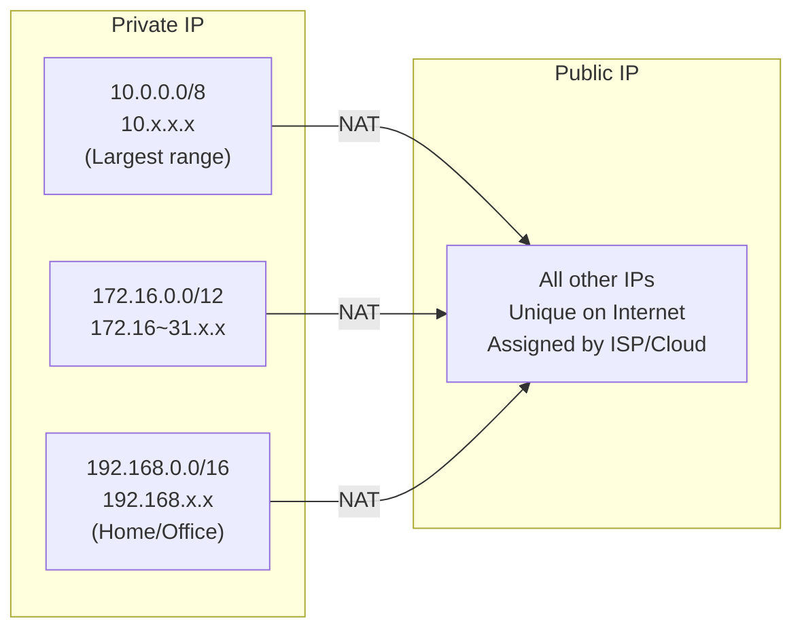
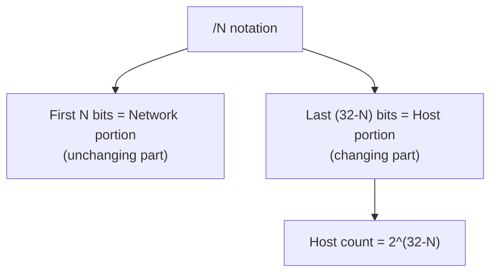
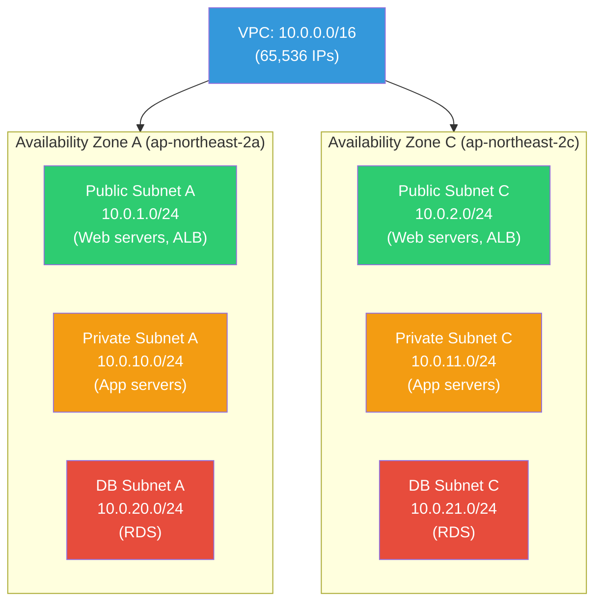
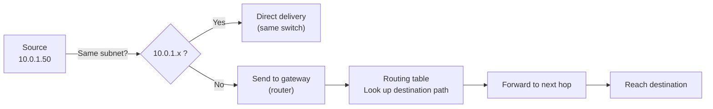
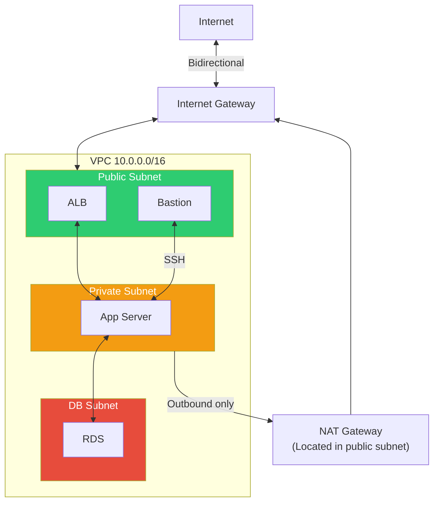
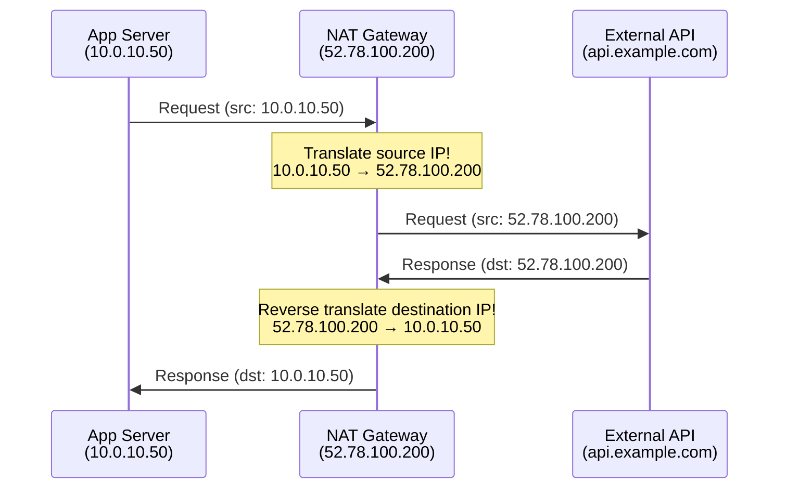

# Network Structure (CIDR / subnetting / routing / NAT)

> To design an AWS VPC, to understand Kubernetes Pod networking, you need to know "what does 10.0.1.0/24 mean?" This lecture covers the fundamentals of network design — how to systematically divide IP addresses, what path packets take to reach their destination, and what NAT is.

---

## 🎯 Why Do You Need to Know This?

```
Moments when you need these concepts in practice:
• AWS VPC subnet design                    → "Public 10.0.1.0/24, Private 10.0.2.0/24"
• Understanding K8s Pod networking          → "Pod CIDR: 172.20.0.0/16"
• "Two servers can't communicate"           → Are they on the same subnet? Is routing set up?
• Firewall rules (Security Groups)          → "Allow only from 10.0.0.0/16"
• NAT Gateway costs are high               → What is NAT and why do we need it?
• Understanding Docker networking           → "172.17.0.0/16 bridge network"
• VPN setup                                → "Office 192.168.0.0/24 ↔ VPC 10.0.0.0/16"
```

In the [previous lecture](./01-osi-tcp-udp), we learned that IP operates at L3 (Network layer). This time, we'll dive deep into how IP addresses are systematically managed.

---

## 🧠 Core Concepts

### Analogy: City Address System

Let's think of the IP address system like a **city address**.

* **IP Address** = Detailed address (Seoul, Gangnam-gu, Teheran-ro 123)
* **Subnet** = Neighborhood. Within the same neighborhood (subnet), you can visit directly
* **Subnet Mask (/24 etc)** = Neighborhood boundary. "Teheran-ro 1-255 is one neighborhood"
* **Router/Gateway** = Post office at the neighborhood entrance. To go to another neighborhood, you must go through the post office
* **NAT** = A switchboard operator converting internal ID numbers to official phone numbers
* **CIDR** = A flexible system for dividing neighborhoods. "This neighborhood has 256 houses, that one has 64"

---

## 🔍 Detailed Explanation — IP Address

### IPv4 Address Structure

```
192.168.1.100
 │   │   │  │
 8bit 8bit 8bit 8bit  = 32 bits total

Each octet: 0~255
Full range: 0.0.0.0 ~ 255.255.255.255
Total IP count: 2^32 = ~4.3 billion
```

```bash
# Check your server's IP (review: ../01-linux/09-network-commands)
ip -4 addr show eth0
# inet 10.0.1.50/24 brd 10.0.1.255 scope global eth0
#      ^^^^^^^^^^
#      IP: 10.0.1.50
#      Subnet: /24

# In binary form (for understanding)
# 10.0.1.50 =
# 00001010.00000000.00000001.00110010
# Network portion | Host portion
# (If /24, the first 24 bits are network)
```

### Private IP vs Public IP



| Type | Range | Purpose | Internet Access |
|------|-------|---------|-----------------|
| **Private IP** | 10.0.0.0/8 | Large internal (AWS VPC, enterprise) | Requires NAT |
| **Private IP** | 172.16.0.0/12 | Medium internal (Docker default) | Requires NAT |
| **Private IP** | 192.168.0.0/16 | Small (home, office) | Requires NAT |
| **Public IP** | Others | Direct Internet communication | Direct access |
| **Loopback** | 127.0.0.0/8 | Self | — |

```bash
# Common IP ranges in practice
# 10.0.0.0/16    → AWS VPC default
# 172.17.0.0/16  → Docker default bridge
# 172.20.0.0/16  → K8s Pod network
# 192.168.0.0/24 → Office/home router
# 100.64.0.0/10  → CGNAT (ISP internal)
```

### Special IP Addresses

```bash
# Useful special addresses to know
0.0.0.0         # "All interfaces" (server binding), "default route" (routing)
127.0.0.1       # Loopback (self) = localhost
255.255.255.255 # Broadcast (send to entire network)
169.254.x.x     # Link-local (auto-assigned if DHCP fails)

# AWS special addresses
169.254.169.254 # EC2 metadata service
10.0.0.2        # VPC DNS server (VPC CIDR +2)
```

---

## 🔍 Detailed Explanation — CIDR

### What is CIDR?

**Classless Inter-Domain Routing**. A flexible way to divide IP addresses. The `/number` indicates how many bits are the network portion.

```
10.0.1.0/24
^^^^^^^^ ^^
IP Address  Subnet Mask (first 24 bits are network portion)

/24 = First 24 bits are network → Last 8 bits are host
    = 2^8 = 256 IPs (usable: 254)
    = 10.0.1.0 ~ 10.0.1.255
```

### CIDR Calculation Method



### CIDR Reference Table (★ Core! Consult frequently)

| CIDR | Subnet Mask | IP Count | Usable IPs | Range Example (10.0.0.0) | Purpose |
|------|-------------|----------|-----------|-------------------------|---------|
| `/32` | 255.255.255.255 | 1 | 1 | 10.0.0.0 only | Single host |
| `/28` | 255.255.255.240 | 16 | 14 | 10.0.0.0~15 | Small subnet |
| `/27` | 255.255.255.224 | 32 | 30 | 10.0.0.0~31 | Small subnet |
| `/26` | 255.255.255.192 | 64 | 62 | 10.0.0.0~63 | Small subnet |
| `/25` | 255.255.255.128 | 128 | 126 | 10.0.0.0~127 | Medium subnet |
| `/24` | 255.255.255.0 | 256 | 254 | 10.0.0.0~255 | ⭐ Most common |
| `/22` | 255.255.252.0 | 1,024 | 1,022 | 10.0.0.0~10.0.3.255 | K8s node subnet |
| `/20` | 255.255.240.0 | 4,096 | 4,094 | 10.0.0.0~10.0.15.255 | Large subnet |
| `/16` | 255.255.0.0 | 65,536 | 65,534 | 10.0.0.0~10.0.255.255 | ⭐ VPC default |
| `/8` | 255.0.0.0 | 16,777,216 | 16,777,214 | 10.0.0.0~10.255.255.255 | Large network |

```bash
# Why "usable IPs" is 2-5 less than total:
# Network address (first): 10.0.1.0 → Represents the network itself
# Broadcast address (last): 10.0.1.255 → Used for broadcasting
# → /24 has 256 - 2 = 254 usable

# AWS reserves 3 additional per VPC subnet:
# 10.0.1.0   → Network address
# 10.0.1.1   → VPC router
# 10.0.1.2   → DNS server
# 10.0.1.3   → AWS reserved
# 10.0.1.255 → Broadcast
# → AWS /24 subnet actually has: 251 usable IPs
```

### CIDR Calculation in Practice

```bash
# "How many IPs in 10.0.1.0/24?"
# /24 → Host bits = 32 - 24 = 8
# IP count = 2^8 = 256
# Usable = 256 - 2 = 254 (AWS: 251)

# "How many IPs in 172.20.0.0/16?"
# /16 → Host bits = 32 - 16 = 16
# IP count = 2^16 = 65,536

# "What is the range of 10.0.0.128/25?"
# /25 → Host bits = 7 → 2^7 = 128 IPs
# Start: 10.0.0.128
# End: 10.0.0.128 + 128 - 1 = 10.0.0.255
# → 10.0.0.128 ~ 10.0.0.255

# Quick calculation tips:
# /24 = 256 IPs, /25 = 128 IPs, /26 = 64 IPs, /27 = 32 IPs, /28 = 16 IPs
# → Each increase in / cuts the size in half!

# ipcalc tool for calculation (install: sudo apt install ipcalc)
ipcalc 10.0.1.0/24
# Network:   10.0.1.0/24
# Netmask:   255.255.255.0 = 24
# Broadcast: 10.0.1.255
# Address space: Private Use
# HostMin:   10.0.1.1
# HostMax:   10.0.1.254
# Hosts/Net: 254

ipcalc 10.0.0.0/22
# Network:   10.0.0.0/22
# Netmask:   255.255.252.0 = 22
# Broadcast: 10.0.3.255
# HostMin:   10.0.0.1
# HostMax:   10.0.3.254
# Hosts/Net: 1022
```

### "Does this IP belong in this subnet?"

```bash
# Does 10.0.1.50 belong in 10.0.1.0/24?
# Range: 10.0.1.0~10.0.1.255 → 10.0.1.50 is included! ✅

# Does 10.0.2.50 belong in 10.0.1.0/24?
# Range: 10.0.1.0~10.0.1.255 → 10.0.2.50 is NOT included! ❌
# → Different subnet! Requires going through router

# Does 10.0.1.50 belong in 10.0.0.0/16?
# Range: 10.0.0.0~10.0.255.255 → 10.0.1.50 is included! ✅

# Why this matters in practice:
# Security Group rule: "Allow traffic from 10.0.0.0/16"
# → Traffic from 10.0.1.50? → Allow! (belongs to 10.0.0.0/16)
# → Traffic from 10.1.0.50? → Block! (not in 10.0.0.0/16)
```

---

## 🔍 Detailed Explanation — Subnetting

### What is Subnetting?

Dividing one large network into multiple smaller networks.

**Why divide subnets?**
* **Security**: Separate web servers and DB with access control
* **Management**: Organize by purpose (public, private, DB, etc)
* **Performance**: Reduce broadcast domain
* **Availability**: Isolate by AZ (availability zone)

### AWS VPC Subnet Design Example (★ Core in practice!)



```bash
# Practical subnet design pattern (AWS)

# VPC: 10.0.0.0/16 (65,536 IPs)

# === Public Subnets (direct internet access) ===
# 10.0.1.0/24  → Public AZ-a (ALB, Bastion, NAT Gateway)
# 10.0.2.0/24  → Public AZ-c
# 10.0.3.0/24  → Public AZ-b (if needed)

# === Private Subnets (App servers, no direct internet) ===
# 10.0.10.0/24 → Private AZ-a (App servers, ECS/EKS)
# 10.0.11.0/24 → Private AZ-c
# 10.0.12.0/24 → Private AZ-b (if needed)

# === DB Subnets (DB only, stricter access control) ===
# 10.0.20.0/24 → DB AZ-a (RDS)
# 10.0.21.0/24 → DB AZ-c

# === K8s (needs many Pod IPs) ===
# 10.0.100.0/22 → EKS Pod AZ-a (1,024 IPs)
# 10.0.104.0/22 → EKS Pod AZ-c (1,024 IPs)

# In this design:
# Public subnet servers → Can communicate directly with Internet
# Private subnet servers → Can access Internet only via NAT Gateway
# DB subnet → No internet access, accessible only from app servers
```

### Choosing Subnet Size

```bash
# Select CIDR based on number of IPs needed per subnet

# Small (Bastion, NAT GW, etc): /28 (16 IPs) or /27 (32 IPs)
# Web/App servers: /24 (256 IPs) → Most common
# EKS/ECS (many containers): /22 (1,024 IPs) or /20 (4,096 IPs)
# Entire VPC: /16 (65,536 IPs) → Spacious!

# ⚠️ Changing subnet size later requires deletion and recreation!
# → Important to plan generously from the start
# → If /24 is insufficient, add a new /22 or /20 subnet instead

# ⚠️ Overlapping VPC CIDR breaks VPC Peering!
# VPC A: 10.0.0.0/16
# VPC B: 10.0.0.0/16  ← Overlaps! Peering won't work!
# VPC B: 10.1.0.0/16  ← OK! Peering possible
```

---

## 🔍 Detailed Explanation — Routing

### What is Routing?

Determining which path a packet takes from source to destination. It's like mail traveling through distribution centers.



### Routing Table

```bash
# Check Linux routing table
ip route
# default via 10.0.1.1 dev eth0 proto dhcp src 10.0.1.50 metric 100
# 10.0.1.0/24 dev eth0 proto kernel scope link src 10.0.1.50
# 172.17.0.0/16 dev docker0 proto kernel scope link src 172.17.0.1

# How to read:
# default via 10.0.1.1
# → If destination is unknown, send to gateway 10.0.1.1
# → Default route to the Internet

# 10.0.1.0/24 dev eth0
# → 10.0.1.x range: direct communication via eth0 (same subnet)

# 172.17.0.0/16 dev docker0
# → Docker network: via docker0 interface
```

```bash
# Check route to specific destination
ip route get 8.8.8.8
# 8.8.8.8 via 10.0.1.1 dev eth0 src 10.0.1.50 uid 1000
# → To reach 8.8.8.8: via gateway 10.0.1.1 through eth0

ip route get 10.0.1.100
# 10.0.1.100 dev eth0 src 10.0.1.50 uid 1000
# → 10.0.1.100 is on the same subnet, direct (no gateway)

ip route get 10.0.2.10
# 10.0.2.10 via 10.0.1.1 dev eth0 src 10.0.1.50 uid 1000
# → 10.0.2.10 is on a different subnet, must use gateway
```

### traceroute — Path Tracing

Shows all routers that a packet passes through to reach its destination.

```bash
traceroute 8.8.8.8
# traceroute to 8.8.8.8 (8.8.8.8), 30 hops max, 60 byte packets
#  1  10.0.1.1 (10.0.1.1)  0.5 ms  0.4 ms  0.3 ms      ← Gateway
#  2  10.0.0.1 (10.0.0.1)  1.0 ms  0.9 ms  0.8 ms      ← VPC router
#  3  52.93.x.x (52.93.x.x)  2.0 ms  1.5 ms  1.8 ms    ← AWS internal
#  4  100.100.x.x (100.100.x.x)  3.0 ms  2.5 ms  2.8 ms
#  5  72.14.x.x (72.14.x.x)  4.0 ms  3.5 ms  3.8 ms   ← Enter Google network
#  6  8.8.8.8 (8.8.8.8)  5.0 ms  4.5 ms  4.8 ms        ← Arrived!

# Each line is one "hop" = going through a router
# ms = round-trip time (3 measurements)
# * = no response (firewall blocking or ICMP disabled)

# Identify bottlenecks in the path
traceroute -n api.example.com
# -n: skip DNS lookups (faster)

# If hop 5 suddenly jumps to 50ms → bottleneck between hops 4-5!
```

### AWS VPC Routing Table

```bash
# Routing in AWS VPC is managed by "Route Table"

# Public subnet's routing table:
# Destination     Target
# 10.0.0.0/16     local           ← Internal VPC: direct
# 0.0.0.0/0       igw-xxxx        ← Everything else: Internet Gateway
#                                    (Internet access enabled!)

# Private subnet's routing table:
# Destination     Target
# 10.0.0.0/16     local           ← Internal VPC: direct
# 0.0.0.0/0       nat-xxxx        ← Everything else: NAT Gateway
#                                    (Outbound only!)

# DB subnet's routing table:
# Destination     Target
# 10.0.0.0/16     local           ← VPC internal only!
#                                    (No internet access!)
```



---

## 🔍 Detailed Explanation — NAT

### What is NAT?

**Network Address Translation**. Converts private IPs to public IPs. This is what your home router does when you use the Internet.



**Why do we need NAT?**
* Private IPs (10.x.x.x) don't work on the Internet
* Servers in private subnets calling external APIs or downloading packages need NAT
* NAT hides internal servers' private IPs from the outside (security!)

### NAT Types

| Type | Description | Example |
|------|-------------|---------|
| **SNAT** (Source NAT) | Translate source IP | Internal → External (NAT Gateway) |
| **DNAT** (Destination NAT) | Translate destination IP | External → Internal (port forwarding) |
| **PAT** (Port Address Translation) | Translate IP + port | Multiple internal IPs share one public IP |
| **1:1 NAT** | One private IP = one public IP | Elastic IP |

```bash
# Check NAT in Linux (iptables)
sudo iptables -t nat -L -n -v
# Chain PREROUTING (policy ACCEPT)
# Chain POSTROUTING (policy ACCEPT)
#  pkts bytes target     prot opt in  out  source       destination
#  5000 300K  MASQUERADE all  --  *   eth0 172.17.0.0/16 0.0.0.0/0
#             ^^^^^^^^^^
#             Docker converts container private IP to host IP (SNAT)

# Why Docker containers can access Internet:
# Container (172.17.0.2) → NAT (MASQUERADE) → Host IP → Internet
```

### AWS NAT Gateway

```bash
# Role of NAT Gateway:
# Private subnet → (NAT GW) → Internet Gateway → Internet
# → Only outbound possible! Inbound not possible!

# NAT Gateway costs:
# Per hour + data transfer (per GB) → Costs add up!
# → Reduce unnecessary outbound traffic (Docker pull caching, etc)

# If internet access needed without NAT Gateway:
# 1. VPC Endpoint (For S3, DynamoDB, etc AWS services)
# 2. PrivateLink (For other AWS services)
# → Reduces NAT costs! (Details in Cloud AWS lecture)
```

---

## 💻 Lab Examples

### Lab 1: Understanding Your Server's Network Structure

```bash
# 1. Check IP address and subnet
ip -4 addr show
# inet 10.0.1.50/24 brd 10.0.1.255 scope global eth0
# → IP: 10.0.1.50, Subnet: /24, Range: 10.0.1.0~255

# 2. Check gateway
ip route | grep default
# default via 10.0.1.1 dev eth0

# 3. Check other hosts on same subnet
ip neigh
# 10.0.1.1 dev eth0 lladdr 0a:ff:ff:ff:ff:01 REACHABLE    ← Gateway
# 10.0.1.20 dev eth0 lladdr 0a:1b:2c:3d:4e:60 STALE       ← Other server

# 4. Check DNS server
resolvectl status 2>/dev/null | grep "DNS Servers" || cat /etc/resolv.conf
```

### Lab 2: CIDR Calculation Practice

```bash
# Install ipcalc if needed
sudo apt install ipcalc 2>/dev/null || sudo yum install ipcalc 2>/dev/null

# 1. /24 subnet
ipcalc 10.0.1.0/24
# Network:   10.0.1.0/24
# HostMin:   10.0.1.1
# HostMax:   10.0.1.254
# Hosts/Net: 254

# 2. /22 subnet (K8s sized)
ipcalc 10.0.100.0/22
# Network:   10.0.100.0/22
# HostMin:   10.0.100.1
# HostMax:   10.0.103.254
# Hosts/Net: 1022

# 3. /28 subnet (very small)
ipcalc 10.0.1.0/28
# Network:   10.0.1.0/28
# HostMin:   10.0.1.1
# HostMax:   10.0.1.14
# Hosts/Net: 14

# 4. Does this IP belong in this subnet?
ipcalc 10.0.1.50/24
# 10.0.1.50 belongs to 10.0.1.0/24 ✅

# Direct calculation practice:
# What is the range of 10.0.0.0/20?
# /20 → Host bits = 12 → 2^12 = 4096
# Range: 10.0.0.0 ~ 10.0.15.255
ipcalc 10.0.0.0/20
# HostMax: 10.0.15.254  ← Correct!
```

### Lab 3: Understanding Routing Table

```bash
# 1. Current routing table
ip route

# 2. Check path to each destination
ip route get 10.0.1.100    # Same subnet → Direct
ip route get 10.0.2.10     # Different subnet → Via gateway
ip route get 8.8.8.8       # Internet → Via default gateway

# 3. Trace the path with traceroute
traceroute -n 8.8.8.8

# 4. Compare hop counts
traceroute -n 10.0.1.100   # Same subnet → 1 hop
traceroute -n 10.0.2.10    # Different subnet → 2-3 hops
traceroute -n 8.8.8.8      # Internet → Many hops
```

### Lab 4: Docker Networking and NAT

```bash
# If Docker is installed:

# 1. Check Docker networks
docker network ls
# NETWORK ID   NAME     DRIVER  SCOPE
# abc123       bridge   bridge  local
# def456       host     host    local
# ghi789       none     null    local

# 2. Inspect bridge network details
docker network inspect bridge | grep -A 5 "IPAM"
# "Subnet": "172.17.0.0/16",
# "Gateway": "172.17.0.1"

# 3. Check host's docker0 interface
ip addr show docker0
# inet 172.17.0.1/16    ← Docker network gateway

# 4. Docker path in routing table
ip route | grep docker
# 172.17.0.0/16 dev docker0 proto kernel scope link src 172.17.0.1

# 5. Check NAT rules (Docker-created)
sudo iptables -t nat -L POSTROUTING -n -v | grep docker
# MASQUERADE  all  --  *   !docker0  172.17.0.0/16  0.0.0.0/0
# → When Docker containers (172.17.x.x) go outbound, NAT to host IP

# 6. Check container's external IP
docker run --rm alpine wget -qO- ifconfig.me
# 52.78.100.200    ← Host's public IP appears (NAT applied!)
```

---

## 🏢 In Practice?

### Scenario 1: VPC Subnet Design

```bash
# Request: Design AWS VPC for a new project

# === Requirements ===
# - Web servers (Public)
# - App servers (Private)
# - DB (Private, stricter)
# - 2 AZs (High availability)
# - K8s planned (Many Pod IPs needed)

# === Design ===
# VPC: 10.0.0.0/16

# Public Subnets (ALB, Bastion, NAT GW)
# 10.0.1.0/24  → pub-a (251 IPs)
# 10.0.2.0/24  → pub-c (251 IPs)

# Private Subnets (App servers)
# 10.0.10.0/24 → pri-a (251 IPs)
# 10.0.11.0/24 → pri-c (251 IPs)

# DB Subnets
# 10.0.20.0/24 → db-a (251 IPs)
# 10.0.21.0/24 → db-c (251 IPs)

# EKS Pod Subnets (spacious!)
# 10.0.100.0/20 → eks-a (4,094 IPs)
# 10.0.116.0/20 → eks-c (4,094 IPs)

# Remaining IPs: 10.0.0.0/16 = 65,536 - used ≈ Plenty left!
# → Room for future subnet additions!

# ⚠️ Design considerations:
# 1. VPC CIDR hard to change later → Make it spacious /16
# 2. Pair subnets per AZ
# 3. K8s needs min /22 or larger (many Pod IPs)
# 4. Avoid CIDR overlap with other VPCs (breaks Peering)
```

### Scenario 2: "Two servers can't communicate"

```bash
# App server (10.0.10.50) can't connect to DB (10.0.20.10)

# 1. Verify same VPC
# 10.0.10.50 → 10.0.0.0/16
# 10.0.20.10 → 10.0.0.0/16
# → Same VPC! ✅

# 2. Check routing
ip route get 10.0.20.10
# 10.0.20.10 via 10.0.10.1 dev eth0
# → Routes through gateway OK ✅

# 3. Test ping
ping -c 3 10.0.20.10
# PING 10.0.20.10: 3 packets transmitted, 0 received, 100% packet loss
# → Not connecting! ❌

# 4. Check Security Group (most common cause!)
# Does DB's Security Group allow inbound from app subnet (10.0.10.0/24) on port 3306?

# → Add Inbound Rule:
# Type: MySQL/Aurora
# Port: 3306
# Source: 10.0.10.0/24 (or app server's SG)

# 5. Check NACL (next most common cause)
# Is inbound/outbound 3306 allowed on DB subnet's NACL?

# 6. Test again
nc -zv 10.0.20.10 3306
# Connection succeeded! ✅
```

### Scenario 3: VPC CIDR Overlap Problem

```bash
# Situation: Trying to Peer VPC A (Production) with VPC B (Staging) but it fails

# VPC A: 10.0.0.0/16
# VPC B: 10.0.0.0/16  ← Overlaps! Peering impossible!

# Solution 1: Recreate VPC B with different CIDR
# VPC B: 10.1.0.0/16  ← Now OK!

# Solution 2: Add Secondary CIDR
# Add 100.64.0.0/16 as Secondary CIDR to VPC B
# → Peering possible with secondary ranges

# Prevention: Plan CIDR across organization
# Production:  10.0.0.0/16
# Staging:     10.1.0.0/16
# Development: 10.2.0.0/16
# Shared Services: 10.10.0.0/16
# Office VPN:  192.168.0.0/16

# → Document this plan and share with team!
```

### Scenario 4: Reducing NAT Gateway Costs

```bash
# "NAT Gateway costs are $200/month!"

# Analyze: What traffic is going through NAT?
# → Turn on VPC Flow Logs to check

# Cost reduction methods:

# 1. S3 access → Use VPC Endpoint (Gateway)
# → S3 traffic bypasses NAT, reaches S3 directly
# → Free!

# 2. ECR/DynamoDB, etc → Use VPC Endpoint (Interface)
# → Cheaper than NAT

# 3. Docker image caching
# → Use ECR Pull Through Cache
# → Caches Docker Hub images in ECR

# 4. Package mirroring
# → Set up apt/yum mirror internally

# 5. Multi-AZ NAT Gateway
# → Each AZ has its own NAT GW reduces cross-AZ costs
# → But NAT GW itself costs increase... tradeoff!
```

---

## ⚠️ Common Mistakes

### 1. Confusing /16 and /24

```bash
# ❌ "Doesn't /24 cover the whole 10.0.x.x range?"
# → No! Only 10.0.0.0~10.0.0.255! (256 IPs)

# /24 = 10.0.0.0 ~ 10.0.0.255  (256 IPs)
# /16 = 10.0.0.0 ~ 10.0.255.255 (65,536 IPs)
# /8  = 10.0.0.0 ~ 10.255.255.255 (16,777,216 IPs)

# Larger number = smaller range!
# /32 = 1 IP, /24 = 256 IPs, /16 = 65,536 IPs, /8 = 16,777,216 IPs
```

### 2. Making VPC CIDR Too Small

```bash
# ❌ Create VPC with /24 (256 IPs)
# → Run out of IPs when adding more subnets!
# → K8s needs thousands of Pod IPs

# ✅ Make VPC /16 (65,536 IPs) spaciously
# → Hard to change later, so plan big!
```

### 3. Confusing Subnet and Security Group

```bash
# Subnet ≠ Security Group!

# Subnet: IP range (where to place things)
# Security Group: Firewall rules (what traffic to allow)

# Even on same subnet, if SG blocks, no communication!
# Different subnet but SG allows + routing exists → can communicate!
```

### 4. Forgetting NAT Gateway for Private Subnets

```bash
# ❌ Private subnet servers can't access Internet
# → apt update, Docker pull, external API calls all fail!

# ✅ Create NAT Gateway in public subnet
# → Add 0.0.0.0/0 → NAT GW route in private subnet's routing table
```

### 5. Discovering CIDR Overlap Too Late

```bash
# ❌ Running VPCs with overlapping CIDRs, discover during Peering/VPN setup
# → Changing VPC CIDR is very difficult and risky

# ✅ Maintain organization-wide CIDR plan
# Production:  10.0.0.0/16
# Staging:     10.1.0.0/16
# Development: 10.2.0.0/16
# Office VPN:  192.168.0.0/16

# → Document and share with team!
```

---

## 📝 Summary

### CIDR Quick Reference

```
/32 = 1 IP        /28 = 16 IPs       /24 = 256 IPs
/22 = 1,024 IPs   /20 = 4,096 IPs    /16 = 65,536 IPs
/8 = 16,777,216 IPs

Larger / number = smaller range!
Each decrease in / doubles the IP count!
```

### Private IP Ranges

```
10.0.0.0/8       → Large scale (AWS VPC, enterprises)
172.16.0.0/12    → Medium scale (Docker default)
192.168.0.0/16   → Small scale (home, office)
```

### VPC Design Checklist

```
✅ VPC CIDR /16 (spacious)
✅ CIDR doesn't overlap with other VPCs/office
✅ Separate public/private/DB subnets
✅ Pair subnets per AZ
✅ K8s sized /22 or larger
✅ NAT Gateway (or VPC Endpoint) for private subnets
✅ Document organization-wide CIDR plan
```

### Debugging Commands

```bash
ip addr               # My IP + subnet
ip route              # Routing table
ip route get [dest]   # Route to specific destination
traceroute -n [dest]  # Trace path
ipcalc [CIDR]         # CIDR calculation
ping [dest]           # Connection test
```

---

## 🔗 Next Lecture

Next is **[05-tls-certificate](./05-tls-certificate)** — TLS / Certificates / mTLS.

What's the S in HTTPS? How does the lock icon in browser address bar work? TLS encryption, SSL certificates, Let's Encrypt auto-renewal, and mTLS between services — learn everything about secure communication.
