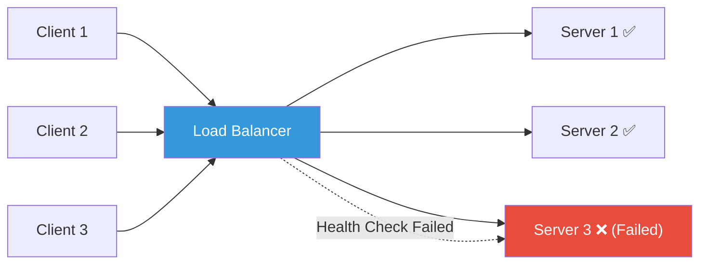
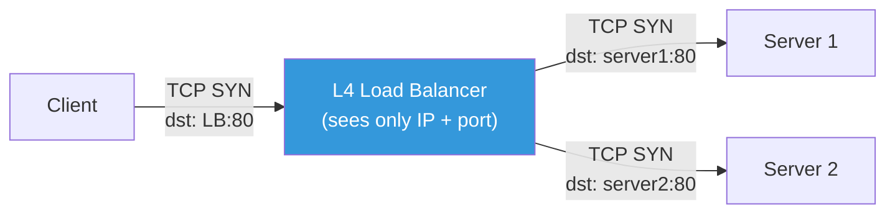
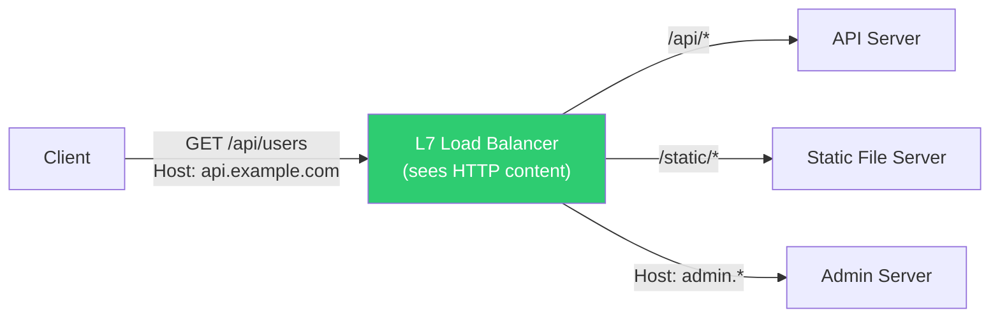
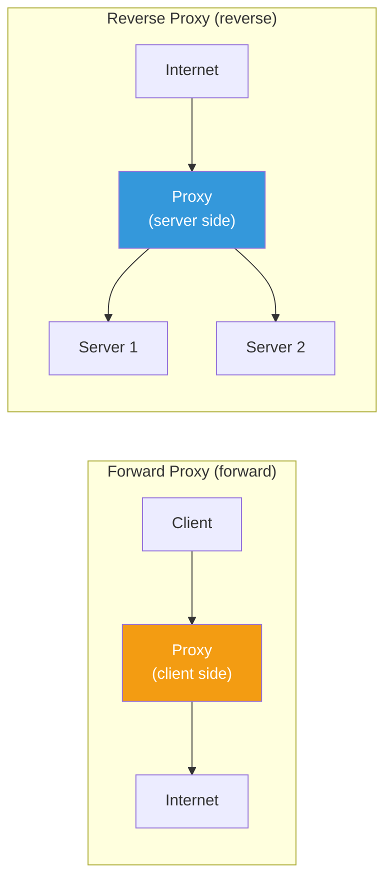
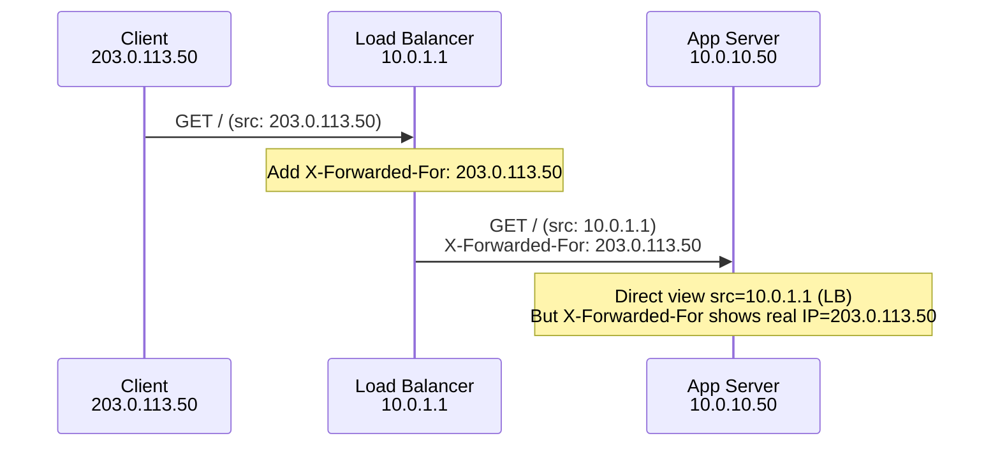
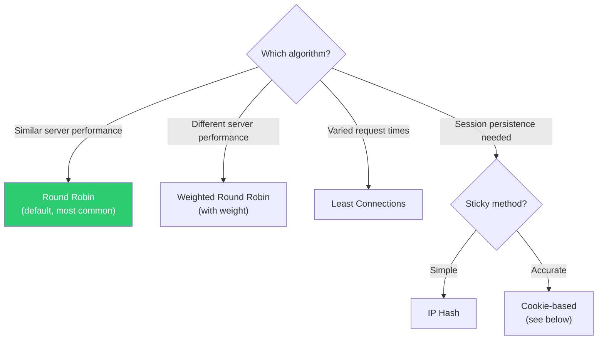
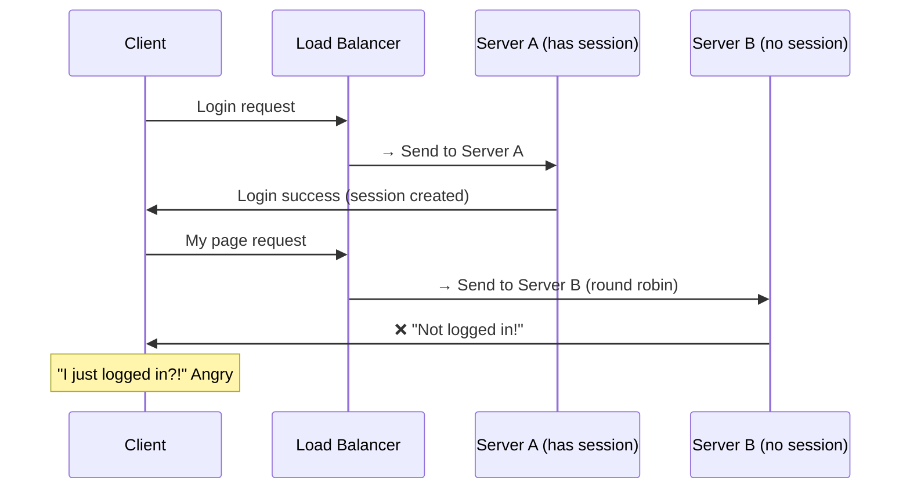
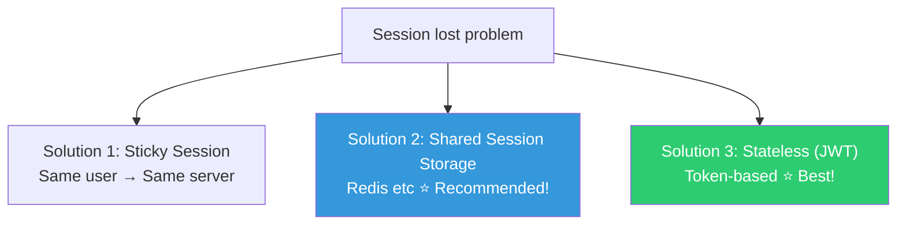
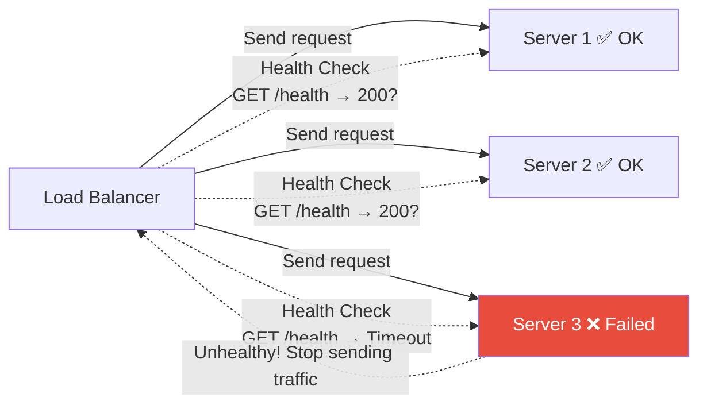
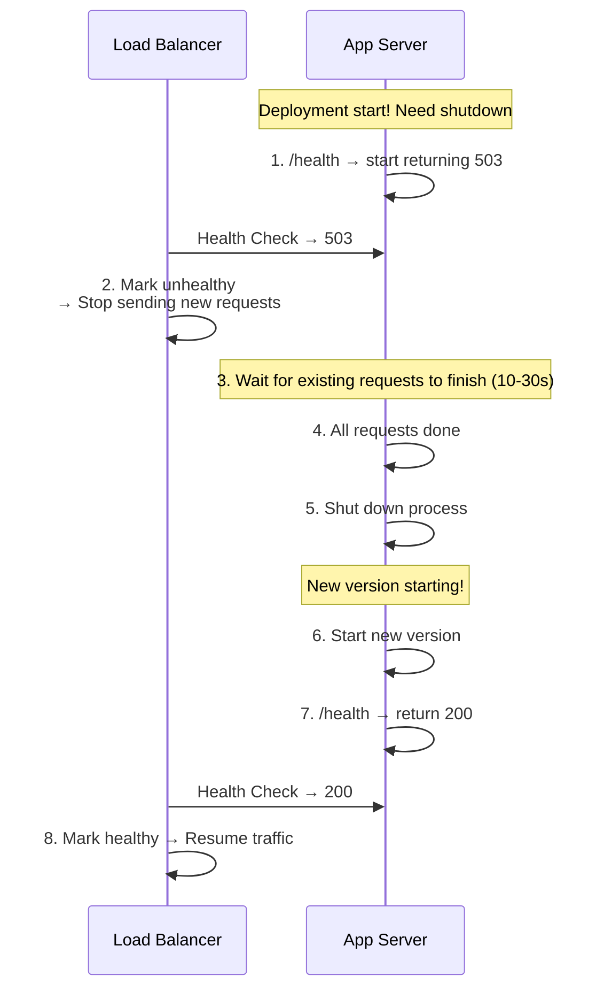

# Load Balancing (L4 vs L7 / reverse proxy / sticky sessions / health check)

> One server is fine for 100 users. But 100,000 users? One server can't handle it. Load balancers distribute traffic across multiple servers. A core concept in both interviews and production.

---

## 🎯 Why Do You Need to Know This?

```
Real-world load balancer tasks:
• ALB vs NLB which one to use?                    → Understand L4 vs L7
• "Traffic only goes to certain servers"          → Understand distribution algorithms
• "Login state keeps getting lost"                → Sticky session setup
• "502 errors during deployments"                 → Health check + graceful shutdown
• Using Nginx as reverse proxy                    → proxy_pass configuration
• What do K8s Service/Ingress do internally?      → Load balancing principles
```

In [the previous lecture](./01-osi-tcp-udp), we learned L4 (Transport) and L7 (Application), and in [HTTP lecture](./02-http), we learned about 502/503/504 differences. Now let's dive deep into the **load balancer** sitting between them.

---

## 🧠 Core Concepts

### Analogy: Bank Numbering System

Think of load balancer like a **bank's numbering system**.

* **Load Balancer** = Number dispenser. When customers arrive, directs them to empty windows (servers)
* **Backend Servers** = Each window. Processes actual requests
* **Distribution Algorithm** = Number distribution method. "Sequential" vs "to least busy window" vs "regular customer to same window"
* **Health Check** = Regularly check if windows are open (servers alive). Don't send to closed windows
* **Sticky Session** = "Started paperwork at window 3, so always go back to window 3"



---

## 🔍 Detailed Explanation — L4 vs L7

### L4 Load Balancing (Transport Layer)

Works at **TCP/UDP level**. Only looks at IP and port, ignores packet content (HTTP etc).



**Characteristics:**
* Doesn't open packets → **Very fast**
* Passes TCP connection itself (packet forwarding)
* Doesn't know HTTP headers, URL, cookies
* Doesn't terminate TLS (passthrough)

**Use cases:**
* Extreme performance needed
* Non-HTTP protocols (TCP/UDP)
* TLS passthrough (backend handles TLS)
* DB, Redis, non-HTTP services
* gRPC, WebSocket, etc

### L7 Load Balancing (Application Layer)

Works at **HTTP level**. Reads request URL, headers, cookies — **content-aware routing**.



**Characteristics:**
* Parses HTTP request → URL, headers, cookies based routing
* Terminates TLS (decrypts)
* Can modify requests/responses (add headers, redirect)
* Slower than L4 but much more flexible

**Use cases:**
* URL-based routing (`/api` → backend A, `/web` → backend B)
* Host-based routing (`api.example.com` → A, `www.example.com` → B)
* Cookie/header-based routing (A/B testing, canary deployment)
* TLS termination + HTTP/2
* WebSocket proxy
* WAF (Web Application Firewall) integration
* CORS, auth etc HTTP-level handling

### L4 vs L7 Comparison (★ Common interview question!)

| Item | L4 (Transport) | L7 (Application) |
|------|----------------|-------------------|
| Analogy | Look at envelope surface, deliver | Open envelope, read letter, deliver |
| Layer | TCP/UDP | HTTP/HTTPS |
| Sees | IP, port | URL, headers, cookies, host |
| Speed | Very fast | Relatively slow |
| URL-based routing | ❌ | ✅ |
| TLS termination | ❌ (passthrough) | ✅ |
| Header modification | ❌ | ✅ |
| Protocols | TCP, UDP, all protocols | HTTP, HTTPS, WebSocket |
| AWS | **NLB** | **ALB** |
| Others | HAProxy TCP mode | HAProxy HTTP mode, Nginx, Envoy |

```bash
# AWS Selection Guide

# Use ALB (L7):
# ✅ Regular web services (HTTP/HTTPS)
# ✅ URL/host-based routing needed
# ✅ TLS termination + ACM certs
# ✅ WebSocket support needed
# ✅ WAF integration needed

# Use NLB (L4):
# ✅ Ultra-high performance (millions RPS)
# ✅ Non-HTTP protocols (gRPC, MQTT, game servers)
# ✅ Fixed IP needed (Elastic IP available)
# ✅ TLS passthrough needed
# ✅ Very low latency critical
```

---

## 🔍 Detailed Explanation — Reverse Proxy

### What is Reverse Proxy?

Server that **relays between client and backend servers**. Load balancer is one function of reverse proxy.



**What reverse proxy does:**
* **Load Balancing** — Distribute to multiple backends
* **TLS Termination** — HTTPS → HTTP conversion (backend uses HTTP)
* **Caching** — Cache frequently requested responses
* **Compression** — Compress responses with gzip
* **Security** — Hide backend servers, don't expose directly
* **Serve Static Files** — Reduce backend load
* **Rate Limiting** — Block excessive requests
* **Add Headers** — X-Real-IP, X-Forwarded-For, etc

### Nginx Reverse Proxy (★ Most commonly used in practice)

```bash
# /etc/nginx/conf.d/myapp.conf

# Upstream (backend server group)
upstream backend {
    # Load balancing algorithm (default: round-robin)
    # least_conn;           # Least active connections
    # ip_hash;              # Client IP based (sticky)
    # hash $request_uri;    # URL based

    server 10.0.10.50:8080 weight=3;   # Weight 3 (higher priority)
    server 10.0.10.51:8080 weight=1;   # Weight 1
    server 10.0.10.52:8080 backup;     # Backup (only if others fail)

    # Keep-Alive (reuse upstream connections)
    keepalive 32;
}

server {
    listen 443 ssl http2;
    server_name myapp.example.com;

    # TLS config (see 05-tls-certificate)
    ssl_certificate     /etc/letsencrypt/live/myapp.example.com/fullchain.pem;
    ssl_certificate_key /etc/letsencrypt/live/myapp.example.com/privkey.pem;

    # Proxy config
    location / {
        proxy_pass http://backend;

        # Forward original client info (⭐ Essential!)
        proxy_set_header Host $host;
        proxy_set_header X-Real-IP $remote_addr;
        proxy_set_header X-Forwarded-For $proxy_add_x_forwarded_for;
        proxy_set_header X-Forwarded-Proto $scheme;

        # Keep-Alive
        proxy_http_version 1.1;
        proxy_set_header Connection "";

        # Timeouts
        proxy_connect_timeout 10s;    # Backend connection timeout
        proxy_read_timeout 60s;       # Wait for backend response
        proxy_send_timeout 60s;       # Send request to backend
    }

    # URL-based routing (L7 power!)
    location /api/ {
        proxy_pass http://api-backend;
    }

    location /static/ {
        alias /var/www/static/;       # Serve static files directly from Nginx
        expires 30d;                   # Browser cache 30 days
    }

    # WebSocket proxy (see 02-http lecture)
    location /ws/ {
        proxy_pass http://backend;
        proxy_http_version 1.1;
        proxy_set_header Upgrade $http_upgrade;
        proxy_set_header Connection "upgrade";
        proxy_read_timeout 86400s;    # 24 hours (long connection)
    }
}

# HTTP → HTTPS redirect
server {
    listen 80;
    server_name myapp.example.com;
    return 301 https://$host$request_uri;
}
```

```bash
# Test config + apply
sudo nginx -t
# nginx: configuration file /etc/nginx/nginx.conf syntax is ok

sudo systemctl reload nginx

# Verify proxy works
curl -I https://myapp.example.com
# HTTP/2 200
# server: nginx/1.24.0     ← Nginx responds (reverse proxy)

# Check headers received by backend (backend app logs)
# X-Real-IP: 203.0.113.50      ← Actual client IP
# X-Forwarded-For: 203.0.113.50
# X-Forwarded-Proto: https
# Host: myapp.example.com
```

### X-Forwarded-For Header (Track Client IP)

When going through reverse proxy, backend sees **proxy's IP not client's**. This header carries original client IP.



```bash
# App reads client IP correctly:
# ❌ request.remote_addr → 10.0.1.1 (LB's IP)
# ✅ request.headers['X-Forwarded-For'] → 203.0.113.50 (real client)

# ⚠️ X-Forwarded-For can be spoofed by client!
# Only trust if coming through trusted proxy

# Nginx: Trust specific proxy range
# set_real_ip_from 10.0.0.0/16;    # Trust VPC range
# real_ip_header X-Forwarded-For;
# real_ip_recursive on;
```

---

## 🔍 Detailed Explanation — Distribution Algorithms

### Round Robin (Default)

```bash
# Distribute in order
# Request 1 → Server A
# Request 2 → Server B
# Request 3 → Server C
# Request 4 → Server A (restart)

# Nginx config (default, no config needed)
upstream backend {
    server 10.0.10.50:8080;
    server 10.0.10.51:8080;
    server 10.0.10.52:8080;
}

# ✅ Good when server performance is similar
# ❌ Bad when servers have different performance (slow servers get same load)
```

### Weighted Round Robin (With Weight)

```bash
# Distribute proportionally by weight
# weight=3 server gets 3x more requests

upstream backend {
    server 10.0.10.50:8080 weight=5;    # 50%
    server 10.0.10.51:8080 weight=3;    # 30%
    server 10.0.10.52:8080 weight=2;    # 20%
}

# ✅ Good when servers have different performance (powerful server gets more)
# ✅ Canary deployment (new server weight=1, old weight=9 → gradually increase)
```

### Least Connections (Least Active)

```bash
# Send to server with fewest active connections

upstream backend {
    least_conn;
    server 10.0.10.50:8080;
    server 10.0.10.51:8080;
    server 10.0.10.52:8080;
}

# ✅ Good when request processing time varies (some slow requests)
# ✅ WebSocket with long connections
```

### IP Hash (Client IP Based)

```bash
# Same client always goes to same server

upstream backend {
    ip_hash;
    server 10.0.10.50:8080;
    server 10.0.10.51:8080;
    server 10.0.10.52:8080;
}

# ✅ Simple sticky session
# ❌ Behind NAT, many users same IP → overloaded one server
# ❌ Adding/removing servers causes redistribution
```

### Algorithm Selection Guide



---

## 🔍 Detailed Explanation — Sticky Session

### Why Sticky Session is Needed



If session data is only in server memory, sending request to different server loses session.

### Solutions



**Recommendation order:**
1. **Stateless (JWT)** — No server sessions. Info in token. Best!
2. **Shared Session (Redis)** — All servers read from same Redis. Works from any server
3. **Sticky Session** — Last resort. Server failure loses session, unbalanced load

### Sticky Session Implementation

```bash
# === Nginx: Cookie-based Sticky ===
upstream backend {
    # Nginx Plus (commercial) supports sticky cookie
    # sticky cookie srv_id expires=1h domain=.example.com path=/;

    # Open-source Nginx uses ip_hash or hash workaround
    ip_hash;
    server 10.0.10.50:8080;
    server 10.0.10.51:8080;
}

# === AWS ALB: Sticky Session ===
# Target Group → Attributes → Stickiness
# - Application-based cookie (app sets cookie)
# - Duration-based cookie (ALB auto-sets cookie, 1s~7d)
# → AWSALB cookie auto-added

# === HAProxy: Cookie-based ===
# backend servers
#     cookie SERVERID insert indirect nocache
#     server web1 10.0.10.50:8080 check cookie web1
#     server web2 10.0.10.51:8080 check cookie web2
```

---

## 🔍 Detailed Explanation — Health Check

### Why Health Check is Needed

Dead server but load balancer doesn't know → sends requests → errors.



### Health Check Types

| Type | Method | L4/L7 | Accuracy |
|------|--------|-------|----------|
| **TCP Check** | Try TCP connection to port | L4 | Basic (port only) |
| **HTTP Check** | HTTP request → check status code | L7 | High (app level) |
| **Custom Check** | Specific endpoint + response content | L7 | Highest |

### Nginx Health Check

```bash
# Nginx open-source: Passive Health Check (judges by response errors)
upstream backend {
    server 10.0.10.50:8080 max_fails=3 fail_timeout=30s;
    server 10.0.10.51:8080 max_fails=3 fail_timeout=30s;
    #                      ^^^^^^^^^^^ ^^^^^^^^^^^^^^^^
    #                      3 failures → mark "down"
    #                      For 30s, don't send requests
}

# max_fails=3:   3 consecutive error responses → mark "down"
# fail_timeout=30s: Don't send for 30s → after 30s, retry

# Nginx Plus (commercial): Active Health Check
# upstream backend {
#     zone backend 64k;
#     server 10.0.10.50:8080;
#     server 10.0.10.51:8080;
# }
# location / {
#     proxy_pass http://backend;
#     health_check interval=5s fails=3 passes=2 uri=/health;
# }
```

### Design App's Health Check Endpoint

```bash
# Good health check endpoint design

# === Basic (Liveness) — "Are you alive?" ===
# GET /health → 200 OK
# → App process is running, OK
# → DB not connected OK (app itself is alive)

# === Detailed (Readiness) — "Ready for requests?" ===
# GET /ready → 200 OK or 503 Service Unavailable
# → Check dependencies: DB, Redis, external APIs
# → If not ready → 503 → LB won't send traffic

# Response example:
curl http://localhost:8080/health
# {"status": "ok"}

curl http://localhost:8080/ready
# {
#   "status": "ok",
#   "checks": {
#     "database": {"status": "ok", "latency_ms": 5},
#     "redis": {"status": "ok", "latency_ms": 2},
#     "disk": {"status": "ok", "free_gb": 25}
#   }
# }

# When DB is down:
curl http://localhost:8080/ready
# HTTP/1.1 503 Service Unavailable
# {
#   "status": "error",
#   "checks": {
#     "database": {"status": "error", "message": "connection refused"},
#     "redis": {"status": "ok", "latency_ms": 2}
#   }
# }
```

### AWS ALB/NLB Health Check

```bash
# ALB Health Check (L7)
# Protocol: HTTP
# Path: /health
# Port: 8080
# Healthy threshold: 3      ← 3 consecutive successes → healthy
# Unhealthy threshold: 2    ← 2 consecutive failures → unhealthy
# Timeout: 5s               ← No response in 5s → fail
# Interval: 30s             ← Check every 30s
# Success codes: 200        ← 200 = success

# NLB Health Check (L4)
# Protocol: TCP (or HTTP)
# Port: 8080
# → TCP: just check if port connects
# → HTTP: check path returns 200

# Check health status (AWS CLI)
aws elbv2 describe-target-health \
    --target-group-arn arn:aws:elasticloadbalancing:...:targetgroup/my-tg/...
# {
#   "TargetHealthDescriptions": [
#     {
#       "Target": {"Id": "i-0abc123", "Port": 8080},
#       "HealthCheckPort": "8080",
#       "TargetHealth": {"State": "healthy"}              ← ✅
#     },
#     {
#       "Target": {"Id": "i-0def456", "Port": 8080},
#       "TargetHealth": {
#         "State": "unhealthy",                            ← ❌
#         "Reason": "Target.ResponseCodeMismatch",
#         "Description": "Health checks failed with these codes: [502]"
#       }
#     }
#   ]
# }
```

### Health Check During Deployment (Graceful Shutdown)

Abruptly stopping server mid-request causes errors. **Graceful shutdown** is safer.



```bash
# K8s Graceful Shutdown example
# (Details in 04-kubernetes, preview here)

# Pod spec:
# spec:
#   terminationGracePeriodSeconds: 30    ← 30s to clean up
#   containers:
#   - name: myapp
#     lifecycle:
#       preStop:
#         exec:
#           command: ["sh", "-c", "sleep 10"]  ← Time for LB to update
#     readinessProbe:
#       httpGet:
#         path: /ready
#         port: 8080

# Sequence:
# 1. K8s sends SIGTERM to Pod
# 2. preStop hook runs (sleep 10) → LB can update
# 3. readiness probe fails → Removed from Service
# 4. App handles SIGTERM, finishes existing requests
# 5. 30s(terminationGracePeriodSeconds) timeout, then SIGKILL
```

---

## 🔍 Detailed Explanation — HAProxy

### HAProxy Basic Configuration

HAProxy is load balancing specialist software. Supports both L4 and L7.

```bash
# /etc/haproxy/haproxy.cfg

global
    log /dev/log local0
    maxconn 50000
    daemon

defaults
    log     global
    mode    http                  # L7 mode (tcp for L4)
    option  httplog
    option  dontlognull
    timeout connect 5s
    timeout client  30s
    timeout server  30s
    retries 3

# Frontend (where clients connect)
frontend http_front
    bind *:80
    bind *:443 ssl crt /etc/ssl/certs/mysite.pem

    # HTTP → HTTPS redirect
    http-request redirect scheme https unless { ssl_fc }

    # URL-based routing
    acl is_api path_beg /api
    acl is_static path_beg /static

    use_backend api_servers if is_api
    use_backend static_servers if is_static
    default_backend web_servers

# Backend (actual server groups)
backend web_servers
    balance roundrobin
    option httpchk GET /health        # L7 Health Check
    http-check expect status 200

    server web1 10.0.10.50:8080 check inter 5s fall 3 rise 2
    server web2 10.0.10.51:8080 check inter 5s fall 3 rise 2
    server web3 10.0.10.52:8080 check inter 5s fall 3 rise 2 backup

backend api_servers
    balance leastconn
    option httpchk GET /api/health

    server api1 10.0.10.60:8080 check
    server api2 10.0.10.61:8080 check

backend static_servers
    balance roundrobin
    server static1 10.0.10.70:80 check

# Stats page (monitoring)
listen stats
    bind *:8404
    stats enable
    stats uri /stats
    stats refresh 10s
    stats auth admin:password
```

```bash
# HAProxy management
sudo haproxy -c -f /etc/haproxy/haproxy.cfg    # Validate config
sudo systemctl reload haproxy                     # Reload without downtime

# Stats page
curl -u admin:password http://localhost:8404/stats
# → Open in browser: each server status, request count, response time, etc

# Runtime management via socket
echo "show stat" | sudo socat stdio /var/run/haproxy.sock
# → CSV format statistics

# Maintenance mode (stop sending traffic)
echo "set server web_servers/web1 state drain" | sudo socat stdio /var/run/haproxy.sock
# → Don't send new requests to web1 (keep existing connections)

# Recover
echo "set server web_servers/web1 state ready" | sudo socat stdio /var/run/haproxy.sock
```

### Nginx vs HAProxy

| Item | Nginx | HAProxy |
|------|-------|---------|
| Main purpose | Web server + reverse proxy | Load balancer specialist |
| L4 | ⚠️ (stream module) | ✅ Native |
| L7 | ✅ | ✅ |
| Static file serving | ✅ (strong) | ❌ |
| Active Health Check | ❌ (Plus only) | ✅ (free) |
| Stats/monitoring | Basic | ✅ (detailed stats page) |
| Reload | ✅ (no downtime) | ✅ (no downtime) |
| Best for | Web server + proxy combo | Pure load balancer |

```bash
# Common production setups:

# 1. Nginx only (small~medium)
#    → Web server + reverse proxy + load balancer all-in-one

# 2. ALB + Nginx (AWS)
#    → ALB: external traffic distribution + TLS termination
#    → Nginx: app-level routing + static files

# 3. HAProxy + Nginx (on-premises)
#    → HAProxy: load balancing specialist
#    → Nginx: web server on each host
```

---

## 💻 Lab Examples

### Lab 1: Nginx Reverse Proxy Setup

```bash
# 1. Start 2 simple backend servers
python3 -c "
import http.server, socketserver
class H(http.server.SimpleHTTPRequestHandler):
    def do_GET(self):
        self.send_response(200)
        self.end_headers()
        self.wfile.write(b'Server A (port 8081)')
socketserver.TCPServer(('', 8081), H).serve_forever()
" &

python3 -c "
import http.server, socketserver
class H(http.server.SimpleHTTPRequestHandler):
    def do_GET(self):
        self.send_response(200)
        self.end_headers()
        self.wfile.write(b'Server B (port 8082)')
socketserver.TCPServer(('', 8082), H).serve_forever()
" &

# 2. Nginx load balancer config
cat << 'EOF' | sudo tee /etc/nginx/conf.d/lb-test.conf
upstream test_backend {
    server 127.0.0.1:8081;
    server 127.0.0.1:8082;
}

server {
    listen 9090;
    location / {
        proxy_pass http://test_backend;
    }
}
EOF

sudo nginx -t && sudo systemctl reload nginx

# 3. Test — alternates (Round Robin)
for i in $(seq 1 6); do
    curl -s http://localhost:9090
    echo ""
done
# Server A (port 8081)
# Server B (port 8082)
# Server A (port 8081)
# Server B (port 8082)
# Server A (port 8081)
# Server B (port 8082)

# 4. Cleanup
sudo rm /etc/nginx/conf.d/lb-test.conf
sudo systemctl reload nginx
kill %1 %2 2>/dev/null
```

### Lab 2: Experience Health Check

```bash
# From Lab 1, kill one server:

# Kill Server A
kill %1

# Send requests:
for i in $(seq 1 4); do
    curl -s http://localhost:9090 2>/dev/null || echo "ERROR"
    echo ""
done
# ERROR                    ← Request to Server A failed
# Server B (port 8082)     ← Request to Server B succeeded
# ERROR
# Server B (port 8082)

# With health check config in Nginx (max_fails):
# After failures → auto exclude Server A
# Without → keeps sending to failed server!
```

### Lab 3: Weight Configuration

```bash
# Different weights = different traffic ratios

# upstream test_backend {
#     server 127.0.0.1:8081 weight=3;  # 75%
#     server 127.0.0.1:8082 weight=1;  # 25%
# }

# Used in canary deployment:
# New version weight=1, old weight=9
# → 10% traffic to new → gradually increase if OK
```

---

## 🏢 In Practice?

### Scenario 1: "502 errors during deployment"

```bash
# Root cause: Server shutting down, LB still sending traffic

# Solution 1: Graceful Shutdown
# When app gets SIGTERM:
# 1. Change health check to return 503
# 2. Wait for existing requests to finish (10-30s)
# 3. Exit

# Solution 2: preStop hook (K8s)
# lifecycle:
#   preStop:
#     exec:
#       command: ["sleep", "10"]

# Solution 3: ALB deregistration delay
# Target Group → Attributes → Deregistration delay: 30s
# → Keeps existing connections for 30s during removal

# Solution 4: Manage upstream in Nginx
# Before deployment: remove server from upstream
# → Deploy
# → Re-add to upstream
```

### Scenario 2: ALB vs NLB Selection

```bash
# === Situation 1: Regular web service ===
# → Choose ALB
# Reasons: URL routing, TLS(ACM), WebSocket, WAF

# === Situation 2: Game server (TCP/UDP) ===
# → Choose NLB
# Reasons: TCP/UDP, ultra-low latency, fixed IP

# === Situation 3: gRPC service ===
# → ALB (HTTP/2 native since 2020) or NLB (TLS passthrough)
# ALB: gRPC native
# NLB: backend handles TLS + HTTP/2

# === Situation 4: Need fixed IP ===
# → NLB (Elastic IP available)
# ALB: IP changes! (use domain only)
# → If partner needs "whitelist by IP", must use NLB

# === Situation 5: Internal service ===
# → Internal ALB or Internal NLB
# → "Internal" option: only accessible within VPC
```

### Scenario 3: Track Client IP Behind Load Balancer

```bash
# "All IPs in logs are 10.0.1.x!" (LB's IP)

# Root cause: App sees direct connection IP (LB's)

# Solution: Use X-Forwarded-For header

# 1. Nginx forwards header
# proxy_set_header X-Forwarded-For $proxy_add_x_forwarded_for;

# 2. App reads header
# Python Flask:  request.headers.get('X-Forwarded-For')
# Node.js:       req.headers['x-forwarded-for']
# Java Spring:   request.getHeader("X-Forwarded-For")

# 3. Log original IP in Nginx
# log_format main '$http_x_forwarded_for - $remote_user [$time_local] '
#                 '"$request" $status $body_bytes_sent';
# access_log /var/log/nginx/access.log main;

# ALB: Auto-adds X-Forwarded-For header
# App just needs to read it!
```

---

## ⚠️ Common Mistakes

### 1. No Health Check

```bash
# ❌ LB sends traffic to dead servers
upstream backend {
    server 10.0.10.50:8080;
    server 10.0.10.51:8080;
}

# ✅ Always use health check
upstream backend {
    server 10.0.10.50:8080 max_fails=3 fail_timeout=30s;
    server 10.0.10.51:8080 max_fails=3 fail_timeout=30s;
}
```

### 2. Using Sticky Session Everywhere

```bash
# ❌ "Session problem, use sticky!"
# → Server fails → session lost; unbalanced load

# ✅ Proper solutions
# 1. JWT token (Stateless) — best
# 2. Redis (Shared session) — any server works
# 3. Sticky — only as last resort
```

### 3. Trusting X-Forwarded-For Blindly

```bash
# ❌ Client can spoof X-Forwarded-For header
curl -H "X-Forwarded-For: 1.2.3.4" http://myapp.com
# → App thinks 1.2.3.4 is client!

# ✅ Only trust from trusted proxies
# Nginx:
# set_real_ip_from 10.0.0.0/16;
# real_ip_header X-Forwarded-For;
```

### 4. ALB Health Check on / Path

```bash
# ❌ / might be heavy page → slow health check
# Health Check Path: /

# ✅ Lightweight dedicated endpoint
# Health Check Path: /health
# → Just returns 200 OK, no DB query
```

### 5. Missing proxy_set_header

```bash
# ❌ Host header not forwarded
location / {
    proxy_pass http://backend;
    # Missing Host header!
}

# ✅ Essential headers
location / {
    proxy_pass http://backend;
    proxy_set_header Host $host;
    proxy_set_header X-Real-IP $remote_addr;
    proxy_set_header X-Forwarded-For $proxy_add_x_forwarded_for;
    proxy_set_header X-Forwarded-Proto $scheme;
}
```

---

## 📝 Summary

### L4 vs L7 Quick Reference

```
L4 (Transport): Sees IP + port only. Very fast. TCP/UDP.
                AWS NLB, HAProxy TCP mode
                → Non-HTTP, ultra-performance, fixed IP needed

L7 (Application): Sees HTTP content. URL/header/cookie routing.
                  AWS ALB, Nginx, HAProxy HTTP mode
                  → Regular web services, URL routing, TLS termination
```

### Distribution Algorithms

```
Round Robin:       Sequential (default, most cases work)
Weighted:          Proportional ratio (different performance)
Least Connections: Most available (varied request times)
IP Hash:           Same IP → Same server (simple sticky)
```

### Nginx Proxy Essential Config

```bash
proxy_pass http://backend;
proxy_set_header Host $host;
proxy_set_header X-Real-IP $remote_addr;
proxy_set_header X-Forwarded-For $proxy_add_x_forwarded_for;
proxy_set_header X-Forwarded-Proto $scheme;
proxy_http_version 1.1;
proxy_set_header Connection "";
```

### Health Check Checklist

```
✅ Implement /health endpoint (lightweight, just 200 OK)
✅ Implement /ready endpoint (check dependencies)
✅ Configure LB health check (interval, threshold)
✅ Implement graceful shutdown (SIGTERM handling)
✅ Set deregistration delay on LB during deployment
```

---

## 🔗 Next Lecture

Next is **[07-nginx-haproxy](./07-nginx-haproxy)** — Nginx / HAProxy Production Configuration.

You've learned the basics. Next lecture covers production-level Nginx and HAProxy configuration: rate limiting, caching, gzip compression, logging, performance tuning — complete real-world setup.
