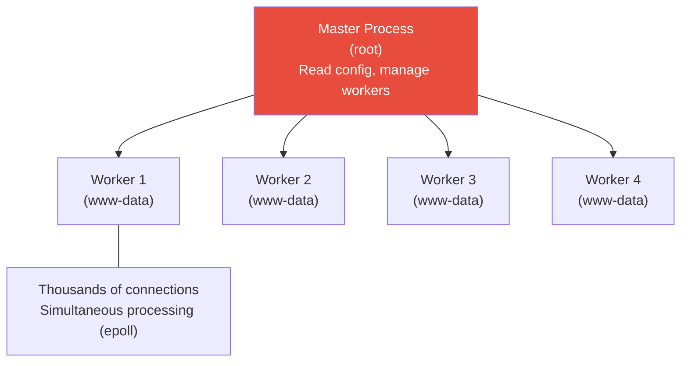
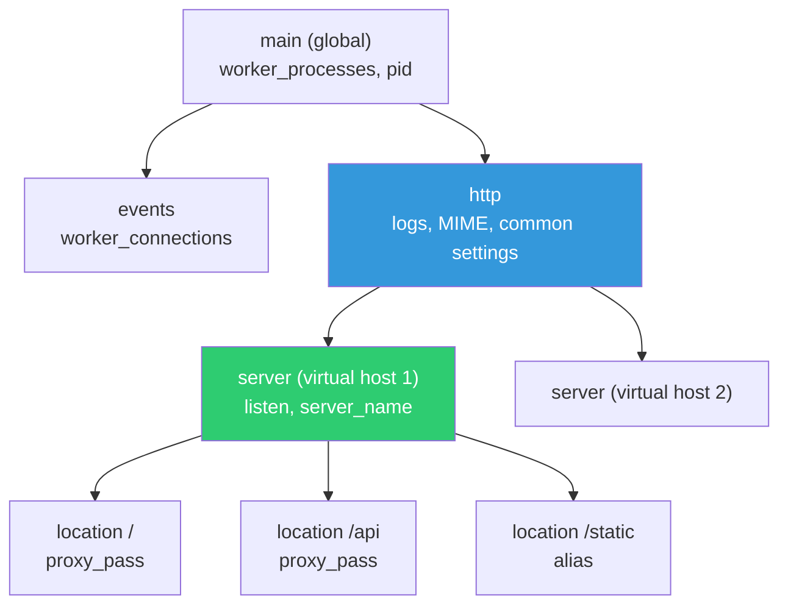
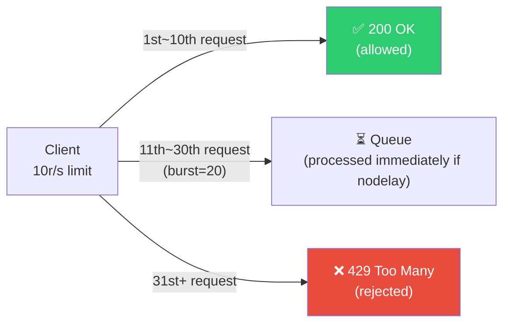

# Nginx / HAProxy Production Configuration

> In the [previous lecture](./06-load-balancing), we learned the principles of load balancing. This time, we'll dive deep into Nginx and HAProxy at a **production level**. Rate limiting, caching, gzip compression, logging, performance tuning — we'll complete production-ready configurations you can use immediately.

---

## 🎯 Why Do You Need to Know This?

```
What DevOps engineers do with Nginx/HAProxy:
• Reverse proxy + load balancing              → Used daily
• HTTPS/TLS termination                       → Certificate setup
• Rate limiting (blocking excessive requests)  → DDoS defense, API protection
• gzip compression (reducing response size)    → Performance improvement
• Caching (reducing repeated requests)         → Backend load reduction
• Access logs + error log management           → Incident tracking
• Performance tuning (worker, connection)      → Handling large-scale traffic
• Multiple service routing (by domain/path)    → Microservices gateway
```

---

## 🧠 Core Concepts

### Nginx Architecture

Nginx uses an **event-driven** architecture. Unlike Apache, it doesn't create a process/thread for each request. Instead, a small number of workers handle thousands of connections asynchronously.



```bash
# Check processes
ps aux | grep nginx
# root      900  ... nginx: master process /usr/sbin/nginx
# www-data  901  ... nginx: worker process
# www-data  902  ... nginx: worker process
# www-data  903  ... nginx: worker process
# www-data  904  ... nginx: worker process
# → 1 master + 4 workers (as many as CPU cores)
```

---

## 🔍 Detailed Explanation — Nginx Configuration Structure

### Configuration File Location

```bash
/etc/nginx/
├── nginx.conf                  # ⭐ Main config (global)
├── conf.d/                     # ⭐ Per-site config (add here!)
│   ├── default.conf
│   └── myapp.conf
├── sites-available/            # Site config (Ubuntu style)
│   └── default
├── sites-enabled/              # Active sites (symlinks)
│   └── default -> ../sites-available/default
├── mime.types                  # MIME type definitions
├── modules-enabled/            # Enabled modules
└── snippets/                   # Reusable config snippets
    └── ssl-params.conf
```

### nginx.conf Structure

```bash
# /etc/nginx/nginx.conf — Overall structure

# === Global context ===
user www-data;                           # Worker execution user
worker_processes auto;                   # Number of workers (auto = CPU cores)
pid /run/nginx.pid;
worker_rlimit_nofile 65535;             # Max files per worker (ulimit)

# === Events context ===
events {
    worker_connections 16384;            # Simultaneous connections per worker
    multi_accept on;                     # Accept multiple connections at once
    use epoll;                           # Best performance on Linux
}

# === HTTP context ===
http {
    # MIME types
    include /etc/nginx/mime.types;
    default_type application/octet-stream;

    # Basic performance settings
    sendfile on;                         # Kernel-level file transmission (fast)
    tcp_nopush on;                       # Send header+body in one packet
    tcp_nodelay on;                      # Send small packets immediately
    keepalive_timeout 65;                # Keep-Alive duration
    types_hash_max_size 2048;

    # Logging
    access_log /var/log/nginx/access.log;
    error_log /var/log/nginx/error.log;

    # Per-site configuration
    include /etc/nginx/conf.d/*.conf;
    include /etc/nginx/sites-enabled/*;
}
```

### Configuration Block Hierarchy



---

### Production Nginx Configuration (★ Complete Production Version)

```bash
# /etc/nginx/conf.d/myapp.conf — Production-ready configuration

# ─── Upstream (backend servers) ───
upstream app_backend {
    least_conn;                                # Distribute to servers with fewest connections
    server 10.0.10.50:8080 max_fails=3 fail_timeout=30s;
    server 10.0.10.51:8080 max_fails=3 fail_timeout=30s;
    server 10.0.10.52:8080 max_fails=3 fail_timeout=30s backup;
    keepalive 32;                              # Upstream Keep-Alive
}

# ─── Rate Limiting Zone Definition ───
limit_req_zone $binary_remote_addr zone=api_limit:10m rate=10r/s;
limit_req_zone $binary_remote_addr zone=login_limit:10m rate=1r/s;
#              ^^^^^^^^^^^^^^^^^^^       ^^^^^^^^^ ^^^  ^^^^^^^^
#              Client IP based            Zone name  Memory  Rate allowed

limit_conn_zone $binary_remote_addr zone=conn_limit:10m;

# ─── HTTP → HTTPS Redirect ───
server {
    listen 80;
    server_name myapp.example.com;
    return 301 https://$host$request_uri;
}

# ─── Main Server Block ───
server {
    listen 443 ssl http2;
    server_name myapp.example.com;

    # ─── TLS Configuration (see ./05-tls-certificate) ───
    ssl_certificate     /etc/letsencrypt/live/myapp.example.com/fullchain.pem;
    ssl_certificate_key /etc/letsencrypt/live/myapp.example.com/privkey.pem;
    ssl_protocols TLSv1.2 TLSv1.3;
    ssl_ciphers ECDHE-ECDSA-AES128-GCM-SHA256:ECDHE-RSA-AES128-GCM-SHA256:ECDHE-ECDSA-AES256-GCM-SHA384:ECDHE-RSA-AES256-GCM-SHA384;
    ssl_prefer_server_ciphers off;
    ssl_session_cache shared:SSL:10m;
    ssl_session_timeout 1d;
    ssl_stapling on;
    ssl_stapling_verify on;

    # ─── Security Headers ───
    add_header Strict-Transport-Security "max-age=31536000; includeSubDomains" always;
    add_header X-Frame-Options "SAMEORIGIN" always;
    add_header X-Content-Type-Options "nosniff" always;
    add_header X-XSS-Protection "1; mode=block" always;
    add_header Referrer-Policy "strict-origin-when-cross-origin" always;

    # ─── gzip Compression ───
    gzip on;
    gzip_vary on;
    gzip_proxied any;
    gzip_comp_level 4;                         # 1~9 (4 balances performance/compression)
    gzip_min_length 256;                       # Don't compress files under 256 bytes
    gzip_types
        text/plain
        text/css
        text/xml
        text/javascript
        application/json
        application/javascript
        application/xml
        application/rss+xml
        image/svg+xml;

    # ─── Logging Configuration ───
    access_log /var/log/nginx/myapp.access.log combined buffer=16k flush=5s;
    error_log  /var/log/nginx/myapp.error.log warn;

    # ─── Client Settings ───
    client_max_body_size 50m;                  # Max upload size
    client_body_timeout 30s;                   # Body receive timeout
    client_header_timeout 10s;                 # Header receive timeout
    send_timeout 30s;                          # Response transmission timeout

    # ─── Proxy Default Settings ───
    proxy_http_version 1.1;
    proxy_set_header Host $host;
    proxy_set_header X-Real-IP $remote_addr;
    proxy_set_header X-Forwarded-For $proxy_add_x_forwarded_for;
    proxy_set_header X-Forwarded-Proto $scheme;
    proxy_set_header Connection "";
    proxy_connect_timeout 10s;
    proxy_read_timeout 60s;
    proxy_send_timeout 60s;
    proxy_buffering on;
    proxy_buffer_size 4k;
    proxy_buffers 8 4k;

    # ─── Main App ───
    location / {
        proxy_pass http://app_backend;

        # Rate Limiting: 10 req/sec, burst up to 20
        limit_req zone=api_limit burst=20 nodelay;
        limit_req_status 429;                  # Return 429 Too Many Requests on excess
    }

    # ─── API ───
    location /api/ {
        proxy_pass http://app_backend;
        limit_req zone=api_limit burst=20 nodelay;
        limit_conn conn_limit 50;              # Limit concurrent connections to 50 per IP
    }

    # ─── Login (stricter limit) ───
    location /api/auth/login {
        proxy_pass http://app_backend;
        limit_req zone=login_limit burst=5 nodelay;   # 1 req/sec, burst 5
        limit_req_status 429;
    }

    # ─── Static Files (served directly by Nginx) ───
    location /static/ {
        alias /var/www/myapp/static/;
        expires 30d;                           # Browser cache 30 days
        add_header Cache-Control "public, immutable";
        access_log off;                        # Don't log static file requests
    }

    # ─── Health Check ───
    location /health {
        proxy_pass http://app_backend;
        access_log off;                        # Exclude health check logs (too frequent)
    }

    # ─── WebSocket ───
    location /ws/ {
        proxy_pass http://app_backend;
        proxy_http_version 1.1;
        proxy_set_header Upgrade $http_upgrade;
        proxy_set_header Connection "upgrade";
        proxy_read_timeout 86400s;
    }

    # ─── Proxy Cache (optional) ───
    location /api/public/ {
        proxy_pass http://app_backend;
        proxy_cache my_cache;
        proxy_cache_valid 200 10m;             # Cache 200 responses for 10 minutes
        proxy_cache_valid 404 1m;
        proxy_cache_use_stale error timeout updating;
        add_header X-Cache-Status $upstream_cache_status;
    }

    # ─── Error Pages ───
    error_page 502 503 504 /50x.html;
    location = /50x.html {
        root /var/www/error-pages;
        internal;
    }

    # ─── Security: Block Hidden Files ───
    location ~ /\. {
        deny all;
        access_log off;
        log_not_found off;
    }
}
```

---

### Rate Limiting Details



```bash
# Understanding Rate Limiting

# rate=10r/s → 10 requests allowed per second (100ms intervals)
# burst=20 → Additional 20 requests allowed in queue
# nodelay → Process queued requests immediately without delay

# Without nodelay:
# → Excess requests stack up in queue, processed one per 100ms
# → Users experience slow responses

# With nodelay:
# → Requests within burst are processed immediately, beyond burst returns 429
# → Usually better to use nodelay

# Rate Limiting Test
# Send 30 requests rapidly
for i in $(seq 1 30); do
    code=$(curl -s -o /dev/null -w "%{http_code}" https://myapp.example.com/api/test)
    echo "Request $i: $code"
done
# Request 1: 200
# ...
# Request 10: 200
# Request 11: 200   ← within burst range
# ...
# Request 30: 200   ← end of burst range
# Request 31: 429   ← limit exceeded! Too Many Requests

# View rate limiting in error log
grep "limiting requests" /var/log/nginx/myapp.error.log
# ... limiting requests, excess: 20.500 by zone "api_limit" ...
```

```bash
# Advanced Rate Limiting Patterns

# Limit by API key instead of IP
# map $http_x_api_key $api_key_limit {
#     default $binary_remote_addr;
#     "~.+"   $http_x_api_key;
# }
# limit_req_zone $api_key_limit zone=api_key:10m rate=100r/s;

# Exempt specific IPs from rate limiting (internal servers, monitoring, etc.)
# geo $limit {
#     default 1;
#     10.0.0.0/16 0;     # Internal VPC not limited
#     127.0.0.1 0;
# }
# map $limit $limit_key {
#     0 "";
#     1 $binary_remote_addr;
# }
# limit_req_zone $limit_key zone=api_limit:10m rate=10r/s;
```

---

### gzip Compression Details

```bash
# Why gzip is important
# JSON response 100KB → after gzip 15KB (85% reduction!)
# → Network transmission time greatly reduced → Better user experience

# Check gzip compression
curl -H "Accept-Encoding: gzip" -sI https://myapp.example.com/api/data
# Content-Encoding: gzip     ← Compressed!
# Content-Length: 1500        ← Original 10000 → 1500

# Compression test
curl -s https://myapp.example.com/api/data | wc -c
# 10000     ← Uncompressed size

curl -s -H "Accept-Encoding: gzip" https://myapp.example.com/api/data | wc -c
# 1500      ← Compressed size (85% reduction!)

# gzip_comp_level Guide:
# 1 = Minimal compression, fast
# 4 = Balance (⭐ recommended)
# 9 = Maximum compression, slow (uses lots of CPU)
# → 4~6 is usually sufficient. 9 is rarely used.

# ⚠️ Don't gzip already-compressed files!
# Images (jpg, png), videos, zip files won't compress much and waste CPU
# → Don't add image/jpeg, image/png etc. to gzip_types!
```

---

### Nginx Logging Configuration

```bash
# Basic log format
# 10.0.0.5 - - [12/Mar/2025:14:30:00 +0000] "GET /api/users HTTP/1.1" 200 1234 "-" "curl/7.81.0"

# Custom log format (production recommended)
log_format main_ext
    '$remote_addr - $remote_user [$time_local] '
    '"$request" $status $body_bytes_sent '
    '"$http_referer" "$http_user_agent" '
    'rt=$request_time '                        # ⭐ Request processing time
    'ua=$upstream_addr '                       # ⭐ Which backend received it
    'us=$upstream_status '                     # ⭐ Backend response code
    'ut=$upstream_response_time '              # ⭐ Backend response time
    'cs=$upstream_cache_status';               # Cache hit/miss

access_log /var/log/nginx/myapp.access.log main_ext buffer=16k flush=5s;

# Output example:
# 10.0.0.5 - - [12/Mar/2025:14:30:00 +0000] "GET /api/users HTTP/1.1" 200 1234
#   "-" "curl/7.81.0" rt=0.050 ua=10.0.10.50:8080 us=200 ut=0.048 cs=-

# Useful log analysis (see ../01-linux/08-log)

# Find slow requests (1+ seconds)
awk '$0 ~ /rt=[0-9]+\.[0-9]+/ {
    match($0, /rt=([0-9]+\.[0-9]+)/, a);
    if (a[1]+0 > 1.0) print a[1], $0
}' /var/log/nginx/myapp.access.log | sort -rn | head -10

# HTTP status code distribution
awk '{print $9}' /var/log/nginx/myapp.access.log | sort | uniq -c | sort -rn | head
#  15000 200
#   2000 304
#    500 404
#     20 502
#     10 429

# Extract only 5xx errors
awk '$9 >= 500' /var/log/nginx/myapp.access.log | tail -20

# Requests by hour
awk '{print $4}' /var/log/nginx/myapp.access.log | cut -d: -f2 | sort | uniq -c
```

```bash
# Exclude specific paths from logging (too many health check logs)
location /health {
    proxy_pass http://app_backend;
    access_log off;                # Don't log health checks
}

# Conditional logging (only 4xx, 5xx in separate file)
map $status $loggable {
    ~^[45] 1;
    default 0;
}
access_log /var/log/nginx/myapp.error-only.log main_ext if=$loggable;
```

---

### Nginx Proxy Caching

```bash
# Define cache zone in http block of nginx.conf
proxy_cache_path /var/cache/nginx/my_cache
    levels=1:2                    # Directory depth
    keys_zone=my_cache:10m        # Cache key memory (10MB ≈ 80,000 keys)
    max_size=1g                   # Max disk usage
    inactive=60m                  # Delete if not accessed for 60 minutes
    use_temp_path=off;

# Use in server block
location /api/public/ {
    proxy_pass http://app_backend;

    proxy_cache my_cache;
    proxy_cache_valid 200 10m;          # Cache 200 responses for 10 minutes
    proxy_cache_valid 404 1m;           # Cache 404 for 1 minute (reduce backend load)
    proxy_cache_key "$scheme$request_method$host$request_uri";
    proxy_cache_use_stale error timeout updating http_500 http_502 http_503;
    #                      ^^^^^^^^^^^^^^^^^^^^^^^^^^^^^^^^^^^^^^^^^^^^^^^^^^
    #                      Show stale cache even if backend fails!

    add_header X-Cache-Status $upstream_cache_status;
    # HIT = Response from cache
    # MISS = No cache, fetched from backend
    # EXPIRED = Cache expired, fetched fresh from backend
    # STALE = Backend failed, serving stale cache
}

# Check cache status
curl -I https://myapp.example.com/api/public/data
# X-Cache-Status: MISS      ← First request: no cache

curl -I https://myapp.example.com/api/public/data
# X-Cache-Status: HIT       ← Second: from cache!

# Manually clear cache
sudo rm -rf /var/cache/nginx/my_cache/*
# Or with Nginx Plus: proxy_cache_purge
```

---

### Nginx Performance Tuning

```bash
# /etc/nginx/nginx.conf — Performance tuning essentials

# === Worker Settings ===
worker_processes auto;              # As many as CPU cores (usually auto)
worker_rlimit_nofile 65535;         # Max open files per worker
                                    # (see ../01-linux/13-kernel for ulimit)

events {
    worker_connections 16384;       # Simultaneous connections per worker
    multi_accept on;                # Accept multiple connections at once
    use epoll;                      # Linux-optimized event model
}

# Max simultaneous connections possible:
# = worker_processes × worker_connections
# = 4 × 16384 = 65,536 concurrent connections!

# === HTTP Performance Settings ===
http {
    sendfile on;                    # Send files directly from kernel (fast)
    tcp_nopush on;                  # Send header+body in one packet
    tcp_nodelay on;                 # Disable Nagle algorithm (reduce delay)

    keepalive_timeout 65;           # Client Keep-Alive duration
    keepalive_requests 1000;        # Max requests per Keep-Alive connection

    # Buffer sizes (defaults usually OK)
    client_body_buffer_size 16k;
    client_header_buffer_size 1k;
    large_client_header_buffers 4 8k;

    # Timeouts
    client_body_timeout 30s;
    client_header_timeout 10s;
    send_timeout 30s;
    reset_timedout_connection on;   # Immediately close timed-out connections

    # File cache (for serving static files)
    open_file_cache max=10000 inactive=20s;
    open_file_cache_valid 30s;
    open_file_cache_min_uses 2;
}
```

```bash
# Check current Nginx connection status

# Enable stub_status module (built-in by default)
# server {
#     listen 8080;
#     location /nginx_status {
#         stub_status on;
#         allow 10.0.0.0/16;    # Only from internal network
#         deny all;
#     }
# }

curl http://localhost:8080/nginx_status
# Active connections: 150
# server accepts handled requests
#  50000 50000 200000
# Reading: 5 Writing: 20 Waiting: 125

# Active connections: Current active connections
# Reading: Connections reading request headers
# Writing: Connections sending responses
# Waiting: Connections waiting for Keep-Alive (idle)
# → If Waiting dominates, normal (idle connections)
# → If Reading/Writing high, high traffic
```

---

## 🔍 Detailed Explanation — HAProxy Production Use

### HAProxy Production Configuration

```bash
# /etc/haproxy/haproxy.cfg

global
    log /dev/log local0
    log /dev/log local1 notice
    maxconn 100000                          # Global max connections
    user haproxy
    group haproxy
    daemon

    # TLS settings
    ssl-default-bind-ciphers ECDHE-ECDSA-AES128-GCM-SHA256:ECDHE-RSA-AES128-GCM-SHA256
    ssl-default-bind-options ssl-min-ver TLSv1.2
    tune.ssl.default-dh-param 2048

defaults
    log     global
    mode    http
    option  httplog
    option  dontlognull
    option  forwardfor                      # Add X-Forwarded-For
    option  http-server-close               # Reuse server connections

    timeout connect 5s
    timeout client  30s
    timeout server  30s
    timeout http-request 10s                # Request header receive timeout
    timeout http-keep-alive 10s
    timeout queue 30s                       # Queue timeout

    retries 3

    # Default error pages
    errorfile 502 /etc/haproxy/errors/502.http
    errorfile 503 /etc/haproxy/errors/503.http

# ─── Frontend ───
frontend http_front
    bind *:80
    bind *:443 ssl crt /etc/ssl/certs/myapp.pem alpn h2,http/1.1

    # HTTP → HTTPS redirect
    http-request redirect scheme https unless { ssl_fc }

    # Add headers
    http-request set-header X-Forwarded-Proto https if { ssl_fc }
    http-response set-header Strict-Transport-Security "max-age=31536000"

    # Rate Limiting (stick table)
    stick-table type ip size 100k expire 30s store http_req_rate(10s)
    http-request track-sc0 src
    http-request deny deny_status 429 if { sc_http_req_rate(0) gt 100 }
    #                                      ^^^^^^^^^^^^^^^^^^^^^^^^^^
    #                                      Return 429 if >100 requests in 10s

    # ACL (conditional routing)
    acl is_api path_beg /api
    acl is_static path_beg /static
    acl is_websocket hdr(Upgrade) -i WebSocket
    acl is_admin hdr(Host) -i admin.example.com

    use_backend api_servers if is_api
    use_backend static_servers if is_static
    use_backend ws_servers if is_websocket
    use_backend admin_servers if is_admin
    default_backend web_servers

# ─── Backend: Web Servers ───
backend web_servers
    balance roundrobin
    option httpchk GET /health
    http-check expect status 200

    # Server list
    server web1 10.0.10.50:8080 check inter 5s fall 3 rise 2 weight 3
    server web2 10.0.10.51:8080 check inter 5s fall 3 rise 2 weight 3
    server web3 10.0.10.52:8080 check inter 5s fall 3 rise 2 backup
    #                           ^^^^^  ^^^^^^^  ^^^^^^ ^^^^^
    #                           check  5s check 3 fails 2 successes to recover

# ─── Backend: API Servers ───
backend api_servers
    balance leastconn
    option httpchk GET /api/health
    http-check expect status 200

    # gzip compression
    compression algo gzip
    compression type application/json text/plain text/css

    server api1 10.0.10.60:8080 check
    server api2 10.0.10.61:8080 check

# ─── Backend: WebSocket ───
backend ws_servers
    balance source                          # IP hash (WebSocket needs sticky)
    timeout tunnel 1h                       # Long-lived WebSocket connections
    server ws1 10.0.10.70:8080 check
    server ws2 10.0.10.71:8080 check

# ─── Backend: Static Files ───
backend static_servers
    balance roundrobin
    server static1 10.0.10.80:80 check

# ─── Backend: Admin Pages ───
backend admin_servers
    balance roundrobin
    # IP restrictions
    acl allowed_ip src 10.0.0.0/16 192.168.0.0/24
    http-request deny unless allowed_ip
    server admin1 10.0.10.90:8080 check

# ─── Statistics Page ───
listen stats
    bind *:8404
    stats enable
    stats uri /stats
    stats refresh 10s
    stats auth admin:SecurePassword123
    stats admin if TRUE                     # Runtime management enabled
```

### HAProxy Operations Commands

```bash
# Validate configuration
sudo haproxy -c -f /etc/haproxy/haproxy.cfg
# Configuration file is valid

# Graceful reload (no downtime)
sudo systemctl reload haproxy

# Statistics API (socket)
echo "show stat" | sudo socat stdio /var/run/haproxy.sock | column -t -s,
# pxname     svname  status  weight  act  ...
# web_servers web1   UP      3       Y
# web_servers web2   UP      3       Y
# web_servers web3   UP      0       Y    ← backup

# Check server status
echo "show servers state" | sudo socat stdio /var/run/haproxy.sock

# Drain mode (stop accepting new requests, keep existing connections)
echo "set server web_servers/web1 state drain" | sudo socat stdio /var/run/haproxy.sock
# → Set drain before deployment → deploy → set ready

# Recover server
echo "set server web_servers/web1 state ready" | sudo socat stdio /var/run/haproxy.sock

# Change weight in real-time (canary deployment)
echo "set server web_servers/web1 weight 1" | sudo socat stdio /var/run/haproxy.sock
# → Reduce from weight=3 to 1 → traffic drops to 33%

# Check session count
echo "show sess" | sudo socat stdio /var/run/haproxy.sock | wc -l
```

### HAProxy Statistics Page

```bash
# Visit http://server:8404/stats in browser
# Or via curl
curl -u admin:SecurePassword123 http://localhost:8404/stats

# What you can see on the stats page:
# - Each server status (UP/DOWN/DRAIN)
# - Current connections, sessions
# - Request count, error count
# - Response time (average, max)
# - Bytes transferred
# - Health Check status
# → Can also collect with Prometheus exporter and view in Grafana
# → Detailed in 08-observability
```

---

## 💻 Practice Examples

### Practice 1: Experience Nginx Rate Limiting

```bash
# 1. Set up rate limiting
cat << 'NGINX' | sudo tee /etc/nginx/conf.d/ratelimit-test.conf
limit_req_zone $binary_remote_addr zone=test_limit:10m rate=2r/s;

server {
    listen 9091;
    location / {
        limit_req zone=test_limit burst=5 nodelay;
        limit_req_status 429;
        return 200 "OK\n";
    }
}
NGINX

sudo nginx -t && sudo systemctl reload nginx

# 2. Test: Send 20 requests rapidly
for i in $(seq 1 20); do
    code=$(curl -s -o /dev/null -w "%{http_code}" http://localhost:9091/)
    echo "Request $i: $code"
done
# Request 1: 200
# Request 2: 200
# ...
# Request 7: 200     ← rate 2 + burst 5 = 7 total OK
# Request 8: 429     ← exceeded! Too Many Requests
# Request 9: 429

# 3. Cleanup
sudo rm /etc/nginx/conf.d/ratelimit-test.conf
sudo systemctl reload nginx
```

### Practice 2: Verify gzip Compression Effect

```bash
# 1. Create large JSON file
python3 -c "
import json
data = {'users': [{'id': i, 'name': f'User {i}', 'email': f'user{i}@example.com', 'bio': 'A' * 200} for i in range(100)]}
print(json.dumps(data))
" > /tmp/big.json

# 2. Check file size
ls -lh /tmp/big.json
# About 30KB

# 3. Compare gzip compression
wc -c < /tmp/big.json
# 30000   ← Original

gzip -c /tmp/big.json | wc -c
# 3500    ← After gzip (~88% reduction!)

# → When Nginx gzip is enabled, this happens automatically!
rm /tmp/big.json
```

### Practice 3: Analyze Nginx Logs

```bash
# If access.log exists:

# 1. HTTP status code distribution
awk '{print $9}' /var/log/nginx/access.log 2>/dev/null | sort | uniq -c | sort -rn | head -5

# 2. Requests with long processing time (rt= field if present)
grep "rt=" /var/log/nginx/access.log 2>/dev/null | \
    sed 's/.*rt=\([0-9.]*\).*/\1/' | \
    sort -rn | head -5

# 3. Request count by IP
awk '{print $1}' /var/log/nginx/access.log 2>/dev/null | sort | uniq -c | sort -rn | head -5

# 4. Check 429 (rate limited) requests
grep '" 429 ' /var/log/nginx/access.log 2>/dev/null | wc -l
```

---

## 🏢 In Real Practice?

### Scenario 1: Design API Rate Limiting

```bash
# "We need to add rate limiting to the API, how should we configure it?"

# Step-by-step design:

# 1. Limit per endpoint
# /api/public/*     → No auth, 30r/s per IP
# /api/auth/login   → Login attempts, 5r/min per IP (brute-force prevention)
# /api/*            → Authenticated, 100r/s per API key

limit_req_zone $binary_remote_addr zone=public:10m rate=30r/s;
limit_req_zone $binary_remote_addr zone=login:10m rate=5r/m;
limit_req_zone $http_x_api_key zone=authenticated:10m rate=100r/s;

# 2. Custom 429 response message
error_page 429 = @rate_limit_exceeded;
location @rate_limit_exceeded {
    default_type application/json;
    return 429 '{"error": "Too many requests. Please try again later."}';
}

# 3. Monitor
# → Collect 429 response count via Prometheus → Grafana dashboard
# → Alert on threshold exceeded (Slack, etc.)
```

### Scenario 2: Zero-Downtime Deployment with HAProxy

```bash
#!/bin/bash
# Zero-downtime deployment script using HAProxy

HAPROXY_SOCK="/var/run/haproxy.sock"
BACKEND="web_servers"
SERVERS=("web1" "web2")

for server in "${SERVERS[@]}"; do
    echo "=== Starting deployment for $server ==="

    # 1. Set server to drain mode (stop accepting new requests)
    echo "set server $BACKEND/$server state drain" | socat stdio $HAPROXY_SOCK
    echo "  Drain mode set"

    # 2. Wait for existing connections to complete
    sleep 10
    echo "  Waiting for existing connections to complete"

    # 3. Deploy (update app on server)
    ssh $server "cd /opt/app && git pull && npm install && systemctl restart myapp"
    echo "  App updated"

    # 4. Wait for health check
    for i in $(seq 1 30); do
        if curl -sf http://$server:8080/health > /dev/null; then
            echo "  Health check passed"
            break
        fi
        sleep 1
    done

    # 5. Re-enable server
    echo "set server $BACKEND/$server state ready" | socat stdio $HAPROXY_SOCK
    echo "  Server re-enabled"

    echo "=== Deployment for $server complete ==="
    sleep 5    # Stabilize before next server
done

echo "Complete deployment finished!"
```

### Scenario 3: Diagnose Nginx Performance Issues

```bash
# "Nginx is slow!" - Diagnosis procedure

# 1. Check current connection status
curl -s http://localhost:8080/nginx_status
# Active connections: 15000     ← Too many?
# Reading: 500 Writing: 2000 Waiting: 12500

# 2. Verify worker settings
grep -E "worker_processes|worker_connections" /etc/nginx/nginx.conf
# worker_processes 4;
# worker_connections 1024;      ← 4 × 1024 = 4,096 → Can't handle 15,000!

# Solution: Increase worker_connections
# worker_connections 16384;     ← 4 × 16384 = 65,536

# 3. Check ulimit (see ../01-linux/13-kernel)
cat /proc/$(pgrep -o nginx)/limits | grep "Max open files"
# Max open files  1024  1024  ← Too low!

# Solution: systemd override
sudo systemctl edit nginx
# [Service]
# LimitNOFILE=65535

# 4. Check kernel parameters
sysctl net.core.somaxconn
# 128    ← Too low!

# Solution:
sudo sysctl net.core.somaxconn=65535

# 5. Check error logs
tail -20 /var/log/nginx/error.log
# worker_connections are not enough    ← Connection limit!
# 768 open() "/var/log/nginx/access.log" failed (24: Too many open files) ← ulimit!
```

---

## ⚠️ Common Mistakes

### 1. Leaving worker_connections at Default

```bash
# ❌ Default 768 or 1024 → Not enough for high traffic!
events {
    worker_connections 768;
}

# ✅ Production should be much higher
events {
    worker_connections 16384;
}
# + worker_rlimit_nofile 65535;
# + Must also increase ulimit!
```

### 2. Repeating proxy_set_header in Every Location

```bash
# ❌ Same headers repeated in each location
location /api { proxy_set_header Host $host; proxy_set_header X-Real-IP $remote_addr; ... }
location /web { proxy_set_header Host $host; proxy_set_header X-Real-IP $remote_addr; ... }

# ✅ Set once in server block → inherited by all locations
server {
    proxy_set_header Host $host;
    proxy_set_header X-Real-IP $remote_addr;
    proxy_set_header X-Forwarded-For $proxy_add_x_forwarded_for;

    location /api { proxy_pass http://api_backend; }
    location /web { proxy_pass http://web_backend; }
}
```

### 3. Ignoring BREACH Attack When Using gzip + TLS

```bash
# ⚠️ HTTPS + gzip = Vulnerable to BREACH attack
# (Compressed responses with secrets can leak via size differences)

# Most cases have low practical risk, but if security critical:
# - Exclude sensitive dynamic responses from gzip
# - Randomize CSRF tokens per request
# - Just gzip static files (usually sufficient)
```

### 4. Using Restart Instead of Reload in HAProxy

```bash
# ❌ restart → Brief connection drops!
sudo systemctl restart haproxy

# ✅ reload → Keep existing connections while applying new config
sudo systemctl reload haproxy

# Same for Nginx!
sudo systemctl reload nginx    # ✅
sudo systemctl restart nginx   # ❌ (only when necessary)
```

### 5. Exposing Nginx Version in Error Pages

```bash
# ❌ 502 error shows "nginx/1.24.0" → Leaks server info!

# ✅ Custom error page
error_page 502 503 504 /50x.html;
location = /50x.html {
    root /var/www/error-pages;
    internal;
}

# ✅ Hide server version
server_tokens off;
# → Shows nothing (or just "nginx") instead of full version
```

---

## 📝 Summary

### Nginx Production Checklist

```
✅ worker_processes auto + worker_connections 16384
✅ worker_rlimit_nofile 65535 + systemd LimitNOFILE
✅ TLS 1.2+ / HSTS / security headers
✅ gzip enabled (text/json/css/js)
✅ Rate limiting (API, login separate)
✅ proxy_set_header (Host, X-Real-IP, X-Forwarded-For, X-Forwarded-Proto)
✅ Upstream keepalive + health check (max_fails)
✅ Custom log format (request_time, upstream info)
✅ Custom error pages + server_tokens off
✅ Serve static files directly + cache headers
✅ Health check path: access_log off
```

### Nginx vs HAProxy Selection

```
Nginx:    Web server + proxy hybrid, static file serving needed, small-medium scale
HAProxy:  Pure load balancer, detailed stats, runtime management, L4 needed, large scale
Both:     Use together (HAProxy front + Nginx per server)
AWS:      ALB/NLB alternative (reduces management burden)
```

### Essential Commands

```bash
sudo nginx -t                    # Validate configuration
sudo systemctl reload nginx      # Graceful reload
curl -I http://localhost:8080/nginx_status  # Connection status

sudo haproxy -c -f /etc/haproxy/haproxy.cfg  # Validate configuration
sudo systemctl reload haproxy    # Graceful reload
echo "show stat" | socat stdio /var/run/haproxy.sock  # Check status
```

---

## 🔗 Next Lecture

Next is **[08-debugging](./08-debugging)** — Network debugging in practice (ping / traceroute / tcpdump / wireshark / curl / telnet).

We'll leverage all the networking knowledge learned so far and practice **systematically finding problems in real incident scenarios**.
