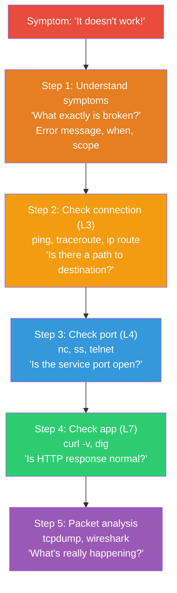
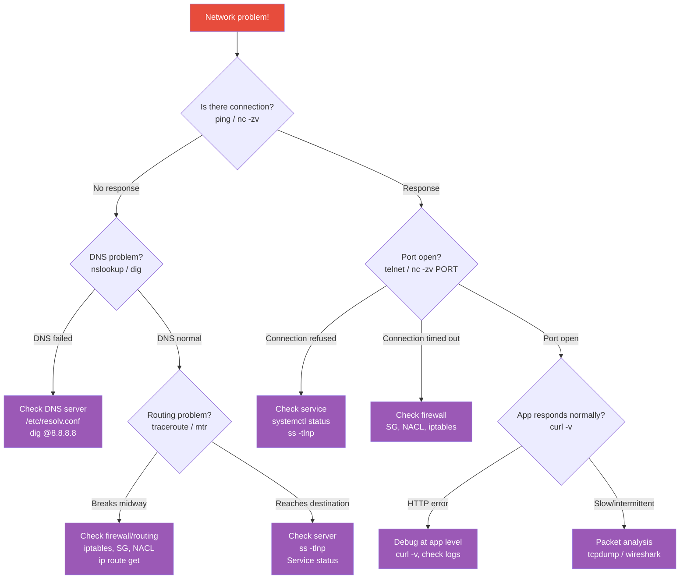
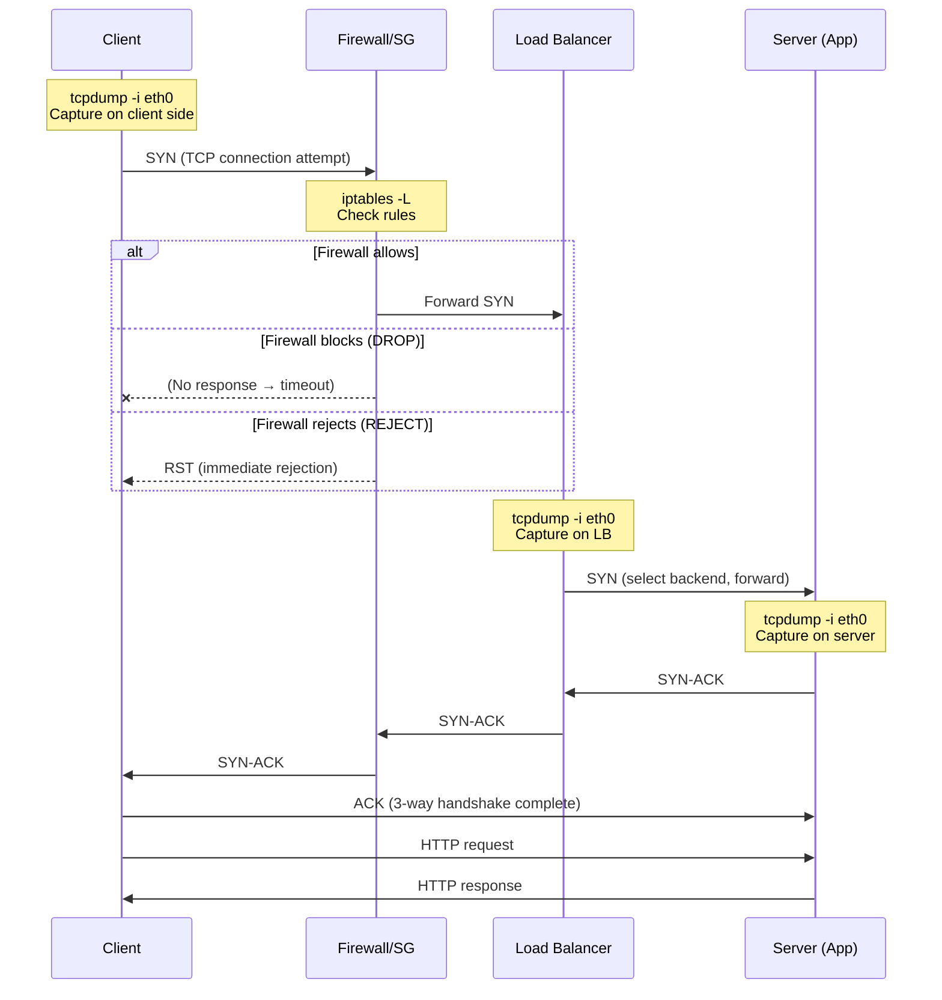

# Network Debugging in Practice (ping / traceroute / tcpdump / wireshark / curl / telnet)

> We'll now apply all the network knowledge learned so far to **systematically finding problems in real incident scenarios**. Network debugging is a core DevOps survival skill. It's the ability to turn "it doesn't work" into "here's the root cause".

---

## 🎯 Why Do You Need to Know This?

```
Moments when network debugging is needed in real work:
• "The site won't load!"                        → DNS? Server? Network? App?
• "App can't connect to DB"                     → Port? Firewall? Routing?
• "Suddenly got slow"                           → Where's the delay?
• "Timeouts happening intermittently"           → Packet loss? Retransmission? Server overload?
• "External API calls failing"                  → DNS? TLS? Firewall? API down?
• "Can't access from specific IP only"          → Routing? SG? ACL?
```

In previous lectures, we covered each tool individually. This time, we focus on **the order and combination** of these tools to diagnose problems.

---

## 🧠 Core Concepts

### Analogy: Medical Diagnosis Process

Network debugging is like **a doctor's diagnosis**.

1. **Inquiry** = Understanding symptoms ("When started? What error?")
2. **Vitals/BP** = Basic tests (ping, curl)
3. **Blood test** = Detailed tests (ss, traceroute)
4. **CT/MRI** = Precise tests (tcpdump, wireshark)

The key is doing them **in order**. You don't do an MRI without first checking symptoms.

### Debugging Layer Model



### Network Debugging Decision Tree

When unsure which tool to use first, follow this decision tree.



### Packet Capture Flow (by Network Path)

Understanding the actual path packets take from client to server, and where to capture tcpdump at each stage, makes debugging much easier.



### Protocol-Specific Debugging Flow

Network problems use different tools depending on the layer. Understanding which protocol layer has the problem is key.

```mermaid
flowchart LR
    subgraph L3["L3: Network"]
        PING["ping"]
        TRACE["traceroute"]
        MTR["mtr"]
        ROUTE["ip route"]
    end

    subgraph L4["L4: Transport"]
        NC["nc -zv"]
        SS["ss -tlnp"]
        TELNET["telnet"]
    end

    subgraph L7["L7: Application"]
        CURL["curl -v"]
        DIG["dig"]
        OPENSSL["openssl s_client"]
    end

    subgraph DEEP["Packet Analysis"]
        TCPDUMP["tcpdump"]
        WIRESHARK["wireshark"]
    end

    L3 -->|"Path OK?"| L4
    L4 -->|"Port OK?"| L7
    L7 -->|"Still broken?"| DEEP

    style L3 fill:#f39c12,color:#fff
    style L4 fill:#3498db,color:#fff
    style L7 fill:#2ecc71,color:#fff
    style DEEP fill:#9b59b6,color:#fff
```



---

## 🔍 Detailed Explanation — 5-Step Debugging Framework

### Step 1: Understanding Symptoms

This is the most important but most often skipped step. You can't debug from just "it doesn't work".

```bash
# Must confirm:
# 1. What's the exact error message?
#    "Connection refused" vs "Connection timed out" vs "Name resolution failed"
#    → Each has completely different causes!

# 2. When did it start?
#    → After deployment? Config change? Spontaneous?

# 3. Is it broken everywhere or just somewhere?
#    → Server A → B works, but C → B doesn't?
#    → Works internally but not externally?

# 4. Always broken or intermittent?
#    → Always: configuration/network issue
#    → Intermittent: load, packet loss, timeout

# Meaning of each error message:
# "Connection refused"       → Server reached, but port has no service
# "Connection timed out"     → Firewall blocked or server not responding
# "No route to host"        → Routing problem
# "Name or service not known" → DNS problem
# "SSL certificate problem"  → Certificate issue
# "502 Bad Gateway"          → Proxy backend issue
```

---

### Step 2: Check Connection (L3 — Network)

**"Is there a path to the destination?"**

#### ping

```bash
# Basic connectivity test
ping -c 3 10.0.2.10
# PING 10.0.2.10 (10.0.2.10) 56(84) bytes of data.
# 64 bytes from 10.0.2.10: icmp_seq=1 ttl=64 time=0.523 ms
# 64 bytes from 10.0.2.10: icmp_seq=2 ttl=64 time=0.412 ms
# 64 bytes from 10.0.2.10: icmp_seq=3 ttl=64 time=0.389 ms
#
# --- 10.0.2.10 ping statistics ---
# 3 packets transmitted, 3 received, 0% packet loss, time 2003ms
# rtt min/avg/max/mdev = 0.389/0.441/0.523/0.058 ms
```

**Interpreting ping results:**

| Result | Meaning | Next Step |
|--------|---------|-----------|
| Normal response | L3 connection OK | → Step 3 (check port) |
| 100% packet loss, "timed out" | Firewall or server down | → traceroute, check firewall |
| "No route to host" | Routing problem | → `ip route get` check |
| "Network unreachable" | Network config issue | → `ip addr`, `ip route` check |
| Some loss (30% etc.) | Network unstable | → mtr for per-hop check |
| Response but slow (>50ms internal) | Network congestion | → traceroute for bottleneck |

```bash
# ⚠️ No ping doesn't mean server is dead!
# AWS Security Group blocking ICMP will make ping fail
# → Test with TCP port instead

# TCP connection test instead of ping
nc -zv -w 3 10.0.2.10 22
# Connection to 10.0.2.10 22 port [tcp/ssh] succeeded!
# → Ping fails but SSH works = Only ICMP is blocked
```

#### traceroute — Trace the Path

```bash
# See which path packets take to the destination
traceroute -n 10.0.2.10
#  1  10.0.1.1    0.5 ms   0.4 ms   0.3 ms      ← Gateway (normal)
#  2  10.0.0.1    1.0 ms   0.9 ms   0.8 ms      ← VPC router (normal)
#  3  10.0.2.10   1.5 ms   1.2 ms   1.3 ms      ← Destination reached! ✅

# Problem case:
traceroute -n api.example.com
#  1  10.0.1.1     0.5 ms   0.4 ms   0.3 ms
#  2  10.0.0.1     1.0 ms   0.9 ms   0.8 ms
#  3  52.93.x.x    2.0 ms   1.5 ms   1.8 ms
#  4  * * *                                       ← No response!
#  5  * * *
#  6  * * *
# → Blocked at hop 4! Firewall or routing issue there

# TCP traceroute (when ICMP is blocked)
sudo traceroute -n -T -p 443 api.example.com
# → Use TCP SYN instead of ICMP (works even if ICMP blocked)
```

#### mtr — ping + traceroute Combined (Real-time)

```bash
# Observe latency/loss per hop in real-time
mtr -n --report -c 20 10.0.2.10
# HOST                    Loss%  Snt   Last   Avg  Best  Wrst StDev
# 1. 10.0.1.1              0.0%   20    0.5   0.4   0.3   0.8   0.1
# 2. 10.0.0.1              0.0%   20    1.0   0.9   0.7   1.5   0.2
# 3. 52.93.x.x             5.0%   20    2.0   2.5   1.5   8.0   1.5  ← 5% loss!
# 4. 10.0.2.10             5.0%   20    2.5   2.8   2.0   9.0   1.8

# Loss% nonzero on hop → Packet loss in that segment
# Avg jumping up on hop → Latency in that segment
# Wrst (worst) very high on hop → Intermittent latency

# Install
sudo apt install mtr    # Ubuntu
```

#### ip route — Check Routing

```bash
# "Is there a route from this server to the destination?"
ip route get 10.0.2.10
# 10.0.2.10 via 10.0.1.1 dev eth0 src 10.0.1.50
# → Via 10.0.1.1 gateway through eth0 ✅

ip route get 192.168.100.1
# RTNETLINK answers: Network is unreachable
# → No route to this destination! ❌
# → Need to add route or enable VPN
```

---

### Step 3: Check Port (L4 — Transport)

**"Is the service port open?"**

#### nc (netcat) — TCP/UDP Port Test

```bash
# TCP port connection test (most commonly used!)
nc -zv 10.0.2.10 3306
# Connection to 10.0.2.10 3306 port [tcp/mysql] succeeded!    ← Open ✅

nc -zv 10.0.2.10 3306
# nc: connect to 10.0.2.10 port 3306 (tcp) failed: Connection refused  ← Closed ❌

nc -zv -w 5 10.0.2.10 3306
# nc: connect to 10.0.2.10 port 3306 (tcp) failed: Connection timed out ← Firewall blocked 🔒
#      ^^^^
#      -w 5: 5 second timeout

# Interpreting results:
# "succeeded"         → Port open, service running
# "Connection refused" → No service on port (service not started)
# "timed out"         → Firewall is blocking (DROP)

# Test multiple ports at once
for port in 22 80 443 3306 5432 6379 8080; do
    result=$(nc -zv -w 2 10.0.2.10 $port 2>&1)
    if echo "$result" | grep -q "succeeded"; then
        echo "✅ $port OPEN"
    elif echo "$result" | grep -q "refused"; then
        echo "❌ $port CLOSED (no service)"
    else
        echo "🔒 $port FILTERED (firewall blocked)"
    fi
done
# ✅ 22 OPEN
# ✅ 80 OPEN
# ✅ 443 OPEN
# ❌ 3306 CLOSED (no service)
# 🔒 5432 FILTERED (firewall blocked)
# ❌ 6379 CLOSED (no service)
# ✅ 8080 OPEN

# UDP port test (-u option)
nc -zuv -w 3 10.0.2.10 53
# Connection to 10.0.2.10 53 port [udp/domain] succeeded!
```

#### telnet — Interactive Port Test

```bash
# Connect to port and test data transmission
telnet 10.0.2.10 80
# Trying 10.0.2.10...
# Connected to 10.0.2.10.          ← Connection successful!
# Escape character is '^]'.

# Type HTTP request manually
GET / HTTP/1.1
Host: 10.0.2.10

# HTTP/1.1 200 OK                   ← Got response!
# Content-Type: text/html
# ...

# Exit: Ctrl+] then quit

# If telnet not installed
sudo apt install telnet    # Ubuntu

# In practice, nc is used more often (better for scripts)
```

#### ss — Check Port on Server Side

```bash
# "Is the server really listening on this port?" (SSH to server first)

# Check listening ports (review ../01-linux/09-network-commands)
ss -tlnp
# State   Recv-Q  Send-Q  Local Address:Port  Process
# LISTEN  0       511     0.0.0.0:80           users:(("nginx",...))
# LISTEN  0       128     0.0.0.0:22           users:(("sshd",...))
# LISTEN  0       4096    127.0.0.1:3306       users:(("mysqld",...))
#                         ^^^^^^^^^
#                         127.0.0.1 = local only! Can't access from outside!

# Finding "Connection refused" source:
# 1. Port not listening at all → Service not started
ss -tlnp | grep 3306
# (nothing) → MySQL not running!
systemctl status mysql

# 2. Listening on 127.0.0.1 instead of 0.0.0.0
ss -tlnp | grep 3306
# LISTEN  127.0.0.1:3306 → Local only!
# → Need to change MySQL config to bind-address

# Check active connections
ss -tnp | grep 3306
# ESTAB  10.0.1.50:54321  10.0.2.10:3306  users:(("myapp",...))
# → myapp is connected to DB
```

---

### Step 4: Check App (L7 — Application)

**"Is HTTP response normal?"**

#### curl — Core HTTP Debugging Tool (★)

```bash
# === Basic debugging (-v: verbose) ===
curl -v https://api.example.com/health 2>&1
# *   Trying 93.184.216.34:443...                  ← DNS resolved IP
# * Connected to api.example.com (93.184.216.34) port 443  ← TCP connected
# * SSL connection using TLSv1.3                   ← TLS version
# * Server certificate:
# *  subject: CN=api.example.com                   ← Certificate info
# *  expire date: May 30 2025                      ← Expiration
# > GET /health HTTP/1.1                           ← Request
# > Host: api.example.com
# > User-Agent: curl/7.81.0
# > Accept: */*
# >
# < HTTP/1.1 200 OK                                ← Response status
# < Content-Type: application/json
# < Content-Length: 15
# <
# {"status":"ok"}                                   ← Response body

# === If failure at each step ===

# DNS failure:
# * Could not resolve host: api.example.com
# → DNS problem! Check with dig (see ./03-dns)

# TCP connection failure:
# * connect to 93.184.216.34 port 443 failed: Connection refused
# → Port not open or firewall

# * connect to 93.184.216.34 port 443 failed: Connection timed out
# → Firewall is DROP blocking

# TLS failure:
# * SSL certificate problem: certificate has expired
# → Certificate expired! (see ./05-tls-certificate)

# HTTP error:
# < HTTP/1.1 502 Bad Gateway
# → Proxy backend issue (see ./02-http)
```

```bash
# === Time Measurement (per segment) ===
curl -w "\
DNS:         %{time_namelookup}s\n\
TCP Connect: %{time_connect}s\n\
TLS:         %{time_appconnect}s\n\
First Byte:  %{time_starttransfer}s\n\
Total:       %{time_total}s\n\
HTTP Code:   %{http_code}\n\
Size:        %{size_download} bytes\n" \
    -o /dev/null -s https://api.example.com/data

# DNS:         0.012s        ← DNS lookup time
# TCP Connect: 0.025s        ← TCP connection (= DNS + TCP handshake)
# TLS:         0.080s        ← TLS handshake complete
# First Byte:  0.250s        ← TTFB: Time to first byte (server response)
# Total:       0.300s        ← Complete time
# HTTP Code:   200
# Size:        1234 bytes

# Interpreting each segment:
# DNS slow (>100ms)     → DNS server issue, cache miss
# TCP slow (>50ms internal) → Network latency, routing issue
# TLS slow (>200ms)     → TLS version, certificate chain issue
# TTFB slow (>1s)       → ⭐ Server processing slow! (DB query etc.)
# Total - TTFB large gap  → Response size large or bandwidth limited
```

```bash
# === Useful curl Options ===

# Status code only
curl -s -o /dev/null -w "%{http_code}" https://api.example.com
# 200

# Headers only
curl -I https://api.example.com
# HTTP/2 200
# content-type: application/json
# ...

# Follow redirects
curl -L http://example.com

# Set timeout
curl --connect-timeout 5 --max-time 30 https://api.example.com

# Request specific IP (bypass DNS)
curl --resolve api.example.com:443:10.0.1.50 https://api.example.com
# → Force api.example.com to resolve to 10.0.1.50

# Ignore self-signed certificate
curl -k https://self-signed.example.com

# POST + JSON
curl -X POST -H "Content-Type: application/json" \
    -d '{"key": "value"}' https://api.example.com/data

# Specific response header
curl -sI https://example.com | grep -i "x-cache\|server\|content-encoding"
```

#### dig — DNS Debugging

```bash
# When DNS is suspected (see DNS lecture ./03-dns for more)

# Basic lookup
dig api.example.com +short
# 10.0.1.50

# No response?
dig api.example.com +short
# (empty result)
# → Record doesn't exist or DNS server problem

# Query specific DNS server
dig @8.8.8.8 api.example.com +short    # Google DNS
dig @1.1.1.1 api.example.com +short    # Cloudflare DNS
# → Works on public DNS but not local DNS? → Local DNS problem

# Check response time
dig api.example.com | grep "Query time"
# ;; Query time: 150 msec    ← 150ms is slow!

# If DNS is slow:
# 1. Change DNS server in /etc/resolv.conf
# 2. Check local DNS cache
# 3. DNS server itself may have issues (ISP, etc.)
```

---

### Step 5: Packet Analysis (Final Resort)

**"What's really happening?"**

#### tcpdump — CLI Packet Capture

```bash
# Basic usage (detailed in ../01-linux/09-network-commands)

# Capture packets for specific host + port
sudo tcpdump -i eth0 -nn host 10.0.2.10 and port 3306 -c 20

# === Normal TCP connection ===
# 14:30:00.001 10.0.1.50.54321 > 10.0.2.10.3306: Flags [S], seq 100     ← SYN
# 14:30:00.002 10.0.2.10.3306 > 10.0.1.50.54321: Flags [S.], seq 200, ack 101  ← SYN-ACK
# 14:30:00.002 10.0.1.50.54321 > 10.0.2.10.3306: Flags [.], ack 201    ← ACK
# → 3-way handshake successful! ✅

# === Connection Refused ===
# 14:30:00.001 10.0.1.50.54321 > 10.0.2.10.3306: Flags [S], seq 100     ← SYN
# 14:30:00.002 10.0.2.10.3306 > 10.0.1.50.54321: Flags [R.], seq 0, ack 101  ← RST!
# → No service on port (RST = Reset) ❌

# === Connection Timed Out (Firewall DROP) ===
# 14:30:00.001 10.0.1.50.54321 > 10.0.2.10.3306: Flags [S], seq 100     ← SYN
# 14:30:01.001 10.0.1.50.54321 > 10.0.2.10.3306: Flags [S], seq 100     ← SYN (retransmit)
# 14:30:03.001 10.0.1.50.54321 > 10.0.2.10.3306: Flags [S], seq 100     ← SYN (retransmit again)
# → Send SYN but no response = Firewall is DROP 🔒

# === Connection after handshake timeout (server not responding) ===
# (3-way handshake successful first)
# 14:30:00.003 10.0.1.50.54321 > 10.0.2.10.3306: Flags [P.], ...        ← Send data
# (no response... retransmission starts)
# 14:30:00.200 10.0.1.50.54321 > 10.0.2.10.3306: Flags [P.], ...        ← Retransmit
# 14:30:00.600 10.0.1.50.54321 > 10.0.2.10.3306: Flags [P.], ...        ← Retransmit
# → Connected but server not processing (app-level issue)
```

```bash
# Practical tcpdump patterns per use case

# View HTTP request/response content
sudo tcpdump -i eth0 -A -nn port 80 -c 20
# → -A: ASCII output (HTTP headers visible)

# Only GET requests
sudo tcpdump -i eth0 -A -nn 'tcp port 80 and (tcp[((tcp[12:1] & 0xf0) >> 2):4] = 0x47455420)'
# → Capture only "GET " (0x47455420)

# Only RST packets (find connection rejections)
sudo tcpdump -i eth0 -nn 'tcp[tcpflags] & tcp-rst != 0'

# Only SYN (find new connection attempts)
sudo tcpdump -i eth0 -nn 'tcp[tcpflags] & tcp-syn != 0 and tcp[tcpflags] & tcp-ack == 0'

# Find retransmission packets
sudo tcpdump -i eth0 -nn 'tcp[tcpflags] & tcp-syn != 0' | grep -v "ack"

# Save to file (analyze later with Wireshark)
sudo tcpdump -i eth0 -w /tmp/capture.pcap -nn host 10.0.2.10 -c 1000
# → Capture 1000 packets then exit

# Read saved file
sudo tcpdump -r /tmp/capture.pcap -nn | head -20
```

#### Wireshark — GUI Packet Analysis

```bash
# Wireshark is a GUI tool, used on local PC

# Server: capture → Local: download → Local PC: analyze with Wireshark
# 1. Server captures
sudo tcpdump -i eth0 -w /tmp/capture.pcap -nn port 80 -c 500

# 2. Download to local
scp server:/tmp/capture.pcap ~/Downloads/

# 3. Open with Wireshark
# wireshark ~/Downloads/capture.pcap

# Useful Wireshark filters:
# http                          → Only HTTP packets
# tcp.port == 3306              → Only MySQL packets
# ip.addr == 10.0.2.10          → Specific IP
# tcp.flags.reset == 1          → Only RST packets
# tcp.analysis.retransmission   → Only retransmission packets (⭐ useful!)
# http.response.code == 500     → Only HTTP 500 errors
# tcp.time_delta > 1            → Packets with 1+ sec delay

# Wireshark tips:
# - "Follow TCP Stream" → See full conversation of one TCP connection
# - "Statistics > Conversations" → Traffic stats per IP/port
# - "Statistics > IO Graph" → Traffic by time graph
# - Color: Red = error/retransmission, Black = RST
```

---

## 🔍 Real-World Debugging Scenarios

### Scenario 1: "The Site Won't Load!" (Complete Systematic Diagnosis)

```bash
# ========================================
# Report: https://myapp.example.com won't load
# ========================================

# === Step 1: Understand Symptoms ===
curl -v https://myapp.example.com 2>&1 | tail -5
# * connect to 10.0.1.50 port 443 failed: Connection timed out
# → "Connection timed out" = Firewall blocked or server not responding

# === Step 2: Check L3 Connection ===
# Is DNS working?
dig myapp.example.com +short
# 10.0.1.50    ← DNS is fine ✅

# Can we reach the server?
ping -c 3 10.0.1.50
# 100% packet loss  ← ping fails (might be ICMP blocked)

# Check with TCP instead
nc -zv -w 5 10.0.1.50 22
# Connection to 10.0.1.50 22 port [tcp/ssh] succeeded!
# → Server is alive! SSH works! ✅

# === Step 3: Check L4 Port ===
nc -zv -w 5 10.0.1.50 443
# nc: connect to 10.0.1.50 port 443 (tcp) failed: Connection timed out
# → 443 port is closed or firewall blocked! ❌

# SSH to server and check
ssh ubuntu@10.0.1.50

# Check if 443 is listening
ss -tlnp | grep 443
# LISTEN  0  511  0.0.0.0:443  ... nginx
# → Nginx is listening on 443! ✅

# → Server has port open, but external can't reach = Firewall!

# === Step 4: Check Firewall ===
# Server iptables
sudo iptables -L INPUT -n | grep 443
# (nothing) → No iptables rule for 443!

# Solution:
sudo iptables -A INPUT -p tcp --dport 443 -j ACCEPT
# Or open in AWS Security Group

# === Step 5: Verify Fix ===
curl -sI https://myapp.example.com
# HTTP/2 200
# → Fixed! ✅
```

### Scenario 2: "App Can't Connect to DB — Intermittent Failures"

```bash
# ========================================
# Report: App logs show "Connection timed out to DB" intermittently
# ========================================

# === Step 1: Understand Symptoms ===
# Check app logs
journalctl -u myapp --since "1 hour ago" | grep -i "timeout\|refused\|error" | tail -10
# 10:15:30 ERROR: Connection to 10.0.2.10:5432 timed out after 5000ms
# 10:15:35 ERROR: Connection to 10.0.2.10:5432 timed out after 5000ms
# 10:20:00 INFO: Connected to database successfully
# → Intermittent! Failed at 10:15, then succeeded at 10:20

# === Step 2: Check Current Connection State ===
# How many connections from app to DB?
ss -tn | grep 10.0.2.10:5432 | wc -l
# 95    ← Using 95 connections out of limit

# Check DB max connections
ssh 10.0.2.10 "psql -c 'SHOW max_connections;'"
# max_connections: 100
# → Only 100 allowed, 95 in use! Getting close!

# === Step 3: Observe Connection Trend ===
# Monitor connections every 10 seconds
while true; do
    count=$(ss -tn | grep 10.0.2.10:5432 | wc -l)
    echo "$(date +%H:%M:%S) Connections: $count"
    sleep 10
done
# 10:30:00 Connections: 95
# 10:30:10 Connections: 98
# 10:30:20 Connections: 100   ← At limit!
# 10:30:30 Connections: 100   ← New connections fail → timeout!
# 10:30:40 Connections: 92    ← Some returned

# === Step 4: Check with tcpdump ===
sudo tcpdump -i eth0 -nn host 10.0.2.10 and port 5432 -c 30
# SYN → (no response) → SYN retransmit → SYN retransmit...
# → DB hit max_connections, can't accept new ones!

# === Step 5: Solution ===
# Option 1: Increase DB max_connections
# postgresql.conf: max_connections = 200

# Option 2: Reduce app connection pool
# → Server count 3 × pool 50 = 150 → Exceeds 100!
# → Reduce pool to 30: 3 × 30 = 90 → OK

# Option 3: Add connection pooler (PgBouncer)
# → App → PgBouncer → DB (efficient sharing)

# Check for CLOSE_WAIT (app not closing connections?)
ss -tn state close-wait | grep 5432 | wc -l
# 20 ← If high, app might have bug in connection.close()!
```

### Scenario 3: "External API Call is Slow"

```bash
# ========================================
# Report: Payment API call takes 3 seconds (normally 200ms)
# ========================================

# === Step 1: Measure per-segment timing ===
curl -w "\
DNS:         %{time_namelookup}s\n\
TCP:         %{time_connect}s\n\
TLS:         %{time_appconnect}s\n\
First Byte:  %{time_starttransfer}s\n\
Total:       %{time_total}s\n" \
    -o /dev/null -s https://payment-api.example.com/charge

# DNS:         0.010s       ← Normal
# TCP:         0.025s       ← Normal
# TLS:         0.080s       ← Normal
# First Byte:  3.200s       ← ⚠️ TTFB is 3.2 seconds! Server slow!
# Total:       3.250s

# → DNS, TCP, TLS all fast. Server processing is slow!
# → Payment API server issue

# === Step 2: Repeated measurements ===
for i in $(seq 1 5); do
    ttfb=$(curl -w "%{time_starttransfer}" -o /dev/null -s https://payment-api.example.com/charge)
    echo "Attempt $i: TTFB=${ttfb}s"
done
# Attempt 1: TTFB=3.200s
# Attempt 2: TTFB=0.180s    ← Sometimes normal!
# Attempt 3: TTFB=3.100s
# Attempt 4: TTFB=0.190s
# Attempt 5: TTFB=3.500s
# → Intermittent! Half slow, half normal

# === Step 3: Check if DNS returns multiple IPs ===
dig payment-api.example.com +short
# 203.0.113.10
# 203.0.113.11
# → 2 IPs! One normal, one slow!

# Test each IP directly
curl -w "%{time_starttransfer}s" -o /dev/null -s \
    --resolve payment-api.example.com:443:203.0.113.10 \
    https://payment-api.example.com/charge
# 0.180s    ← .10 is normal!

curl -w "%{time_starttransfer}s" -o /dev/null -s \
    --resolve payment-api.example.com:443:203.0.113.11 \
    https://payment-api.example.com/charge
# 3.200s    ← .11 is slow!

# → Report to payment API team about .11 server!
# → Temporary workaround: Add .10 only to /etc/hosts
echo "203.0.113.10 payment-api.example.com" | sudo tee -a /etc/hosts
```

### Scenario 4: "502 Errors After Deployment"

```bash
# ========================================
# Report: 502 errors for 10-20 seconds after each deployment
# ========================================

# === Step 1: Capture packets during deployment ===
# Terminal 1: Start tcpdump
sudo tcpdump -i eth0 -nn port 8080 -c 50 -w /tmp/deploy-debug.pcap

# Terminal 2: Run deployment
# ...

# Analyze capture
sudo tcpdump -r /tmp/deploy-debug.pcap -nn | grep -E "Flags \[R\]|Flags \[S\]"
# 14:30:15 10.0.1.1.xxxxx > 10.0.10.50.8080: Flags [S]    ← SYN
# 14:30:15 10.0.10.50.8080 > 10.0.1.1.xxxxx: Flags [R.]   ← RST!
# → Backend sends RST = App restarting!

# === Step 2: Root Cause ===
# Deployment: stop → deploy → start
# Gap between stop and start = 10-20 seconds
# During gap, Nginx tries to connect → Connection refused → 502

# === Step 3: Solution ===

# Option 1: Add health check to upstream
upstream backend {
    server 10.0.10.50:8080 max_fails=2 fail_timeout=30s;
    server 10.0.10.51:8080 max_fails=2 fail_timeout=30s;
}
# → If one server fails, route to other

# Option 2: Rolling restart (one at a time)
# Server A: stop → deploy → start → health check pass
# Then: Server B: stop → deploy → start → health check pass

# Option 3: Graceful shutdown (see ./06-load-balancing)
# App receives SIGTERM → Complete in-flight requests → Exit
```

### Scenario 5: "Only Specific User Can't Access"

```bash
# ========================================
# Report: User from 203.0.113.100 can't access, others can
# ========================================

# === Step 1: Confirm specific IP ===
# "User from 203.0.113.100 can't access"

# === Step 2: Check if request reaches server ===
# Check Nginx logs for that IP
grep "203.0.113.100" /var/log/nginx/access.log | tail -5
# (nothing) → Requests don't reach server!

# === Step 3: Check tcpdump ===
sudo tcpdump -i eth0 -nn src host 203.0.113.100 -c 20
# (no packets) → Server doesn't receive packets from that IP!

# === Step 4: Possible Causes ===
# a. Security Group blocking?
#    → Check SG inbound rules include 0.0.0.0/0 or that IP range

# b. NACL blocking?
#    → NACL is stateless! Check both inbound + outbound
#    → Check if deny rule matches before allow rule

# c. User network issue?
#    → Ask user to run traceroute
#    → See where connection breaks

# d. ISP blocking?
#    → Only that ISP blocked? → ISP issue

# e. iptables on server?
sudo iptables -L INPUT -n -v | grep 203.0.113
#  500 30000 DROP  all  --  *  *  203.0.113.0/24  0.0.0.0/0
# → This IP range is blocked! ❌

# Fix: Remove the blocking rule
sudo iptables -D INPUT -s 203.0.113.0/24 -j DROP
```

---

## 💻 Practice Examples

### Practice 1: Systematic Debugging Exercise

```bash
# Practice debugging procedure locally

# 1. Check DNS
dig google.com +short

# 2. Check ping
ping -c 3 $(dig google.com +short | head -1)

# 3. Check port
nc -zv google.com 443 -w 3

# 4. Check HTTP
curl -v https://google.com 2>&1 | grep -E "^\*|^[<>]"

# 5. Measure time
curl -w "DNS:%{time_namelookup}s TCP:%{time_connect}s TTFB:%{time_starttransfer}s Total:%{time_total}s\n" \
    -o /dev/null -s https://google.com
```

### Practice 2: Port Scan Script

```bash
#!/bin/bash
# port-check.sh — Service status check script

TARGET="${1:-localhost}"
PORTS="22 80 443 3306 5432 6379 8080 9090"

echo "=== Port Status Check for $TARGET ==="
echo ""

for port in $PORTS; do
    result=$(nc -zv -w 2 "$TARGET" "$port" 2>&1)
    if echo "$result" | grep -q "succeeded"; then
        service=$(grep -w "$port/tcp" /etc/services 2>/dev/null | awk '{print $1}' | head -1)
        echo "✅ $port ($service)"
    elif echo "$result" | grep -q "refused"; then
        echo "❌ $port (no service)"
    else
        echo "🔒 $port (blocked/timeout)"
    fi
done

# Usage:
# ./port-check.sh 10.0.2.10
```

### Practice 3: Observe tcpdump Patterns

```bash
# 1. Start tcpdump (terminal 1)
sudo tcpdump -i lo -nn port 8080 -c 20

# 2. Start simple server (terminal 2)
python3 -m http.server 8080 &

# 3. Send request (terminal 3)
curl http://localhost:8080/

# 4. Observe tcpdump (terminal 1)
# [S] → [S.] → [.] → [P.] → [P.] → [F.] → [.] → [F.] → [.]
# SYN → SYN-ACK → ACK → data → response → FIN → ACK → FIN → ACK

# 5. Kill server and request again (observe RST)
kill %1
curl http://localhost:8080/ 2>&1
# curl: (7) Failed to connect to localhost port 8080: Connection refused

# tcpdump:
# [S] → [R.] (RST)    ← Service gone, immediate rejection!
```

---

## ⚠️ Common Mistakes

### 1. Trusting ping Alone

```bash
# ❌ "ping fails so server is dead!"
# → AWS SG blocks ICMP, so ping fails
# → But server might be alive!

# ✅ Test with TCP port
nc -zv -w 3 10.0.1.50 22    # SSH
nc -zv -w 3 10.0.1.50 443   # HTTPS
```

### 2. Not Distinguishing "Connection refused" vs "timed out"

```bash
# "Connection refused" = Reached server, but no service on port
# → Service not started → Check systemctl

# "Connection timed out" = Can't reach server (firewall DROP)
# → Check firewall (SG, NACL, iptables)
# → Check routing

# These have completely different causes!
```

### 3. Ignoring DNS Cache

```bash
# ❌ "Changed DNS but still seeing old IP!"
dig mysite.com +short
# → Old IP still showing (cached)

# ✅ Clear DNS cache
sudo resolvectl flush-caches

# Check other DNS servers
dig @8.8.8.8 mysite.com +short
dig @1.1.1.1 mysite.com +short

# Check authoritative
dig @ns-xxx.awsdns-xx.com mysite.com +short
```

### 4. Running tcpdump Without Filters

```bash
# ❌ Capture all packets → Overwhelming output + performance impact
sudo tcpdump -i eth0

# ✅ Always use filters + limit
sudo tcpdump -i eth0 -nn host 10.0.2.10 and port 3306 -c 50
#                     ^^^^                              ^^^^^^
#                     Numeric output                    50 packets only
```

### 5. Not Using curl -v

```bash
# ❌ Error alone gives no hint
curl https://api.example.com
# curl: (35) error:... SSL routines...

# ✅ -v shows the problem
curl -v https://api.example.com 2>&1
# * SSL certificate problem: certificate has expired
# → Immediately clear: Certificate expired!
```

---

## 🏢 Real-World Scenarios

### Scenario A: Production Inter-Service Communication Failure

```bash
# ========================================
# Report: Service A → Service B call suddenly broken
# ========================================

# Timeline:
# 14:00 Working fine
# 14:15 Infrastructure team doing "SG rule cleanup"
# 14:20 "Connection timed out to 10.0.2.50:8080" errors

# === Step 1: Understand Symptoms ===
curl -v http://10.0.2.50:8080/health 2>&1
# * connect to 10.0.2.50 port 8080 failed: Connection timed out
# → "timed out" = Firewall is DROP

# === Step 2: Check L3 ===
ping -c 3 10.0.2.50
# → ICMP blocked (AWS default)

nc -zv -w 3 10.0.2.50 22
# Connection succeeded!  → Server alive

nc -zv -w 3 10.0.2.50 8080
# Connection timed out   → Only 8080 blocked!

# === Step 3: Check SG ===
# → Infrastructure team deleted 8080 inbound rule!
# → Re-add 8080 inbound from service A's SG

# === Lesson ===
# SG changes need impact analysis before execution
# Verify after: nc -zv to test port
```

### Scenario B: DNS Cache Issues

```bash
# ========================================
# Report: After domain migration, some servers still use old IP
# ========================================

# Situation:
# api.myservice.com IP changed: 10.0.1.50 → 10.0.2.100
# Server A: Uses new IP ✅
# Server B: Still uses old IP ❌

# === Check Server B ===
dig api.myservice.com +short
# 10.0.1.50    ← Still old!

# Check authoritative:
dig @ns-123.awsdns-xx.com api.myservice.com +short
# 10.0.2.100   ← New IP, DNS is updated!

# → Server B has stale local cache!

# === Solution ===
# Clear systemd-resolved cache
sudo resolvectl flush-caches
resolvectl statistics
# Cache: 0/0 hit/miss    ← Cache cleared

dig api.myservice.com +short
# 10.0.2.100   ← New IP! ✅

# === Lesson ===
# Before migration: Lower TTL from 3600 to 60
# Then migrate IP
# Then restore TTL after
```

### Scenario C: MTU Mismatch

```bash
# ========================================
# Report: VPN users can access small files but large pages timeout
# ========================================

# Symptoms:
# - Small API response (KB): Works
# - Large page (images, JSON): Hangs
# - ping works, curl connects but times out

# === Test with different packet sizes ===
# Small packets: OK
ping -c 3 -s 500 10.0.1.50
# 3 packets transmitted, 3 received, 0% packet loss ✅

# Large packets: Fails!
ping -c 3 -s 1400 -M do 10.0.1.50
# Frag needed and DF set (mtu = 1300)
# → MTU is 1300, can't send 1400!

# === Root Cause ===
# VPN tunnel reduces MTU to 1300
# Server sends 1500-byte packets
# DF (Don't Fragment) set → packets dropped!

# === Solution ===
# Option 1: Reduce server MTU
sudo ip link set dev eth0 mtu 1300

# Option 2: TCP MSS clamping (better)
sudo iptables -t mangle -A FORWARD \
    -p tcp --tcp-flags SYN,RST SYN \
    -j TCPMSS --clamp-mss-to-pmtu
# → Auto-adjust MSS during TCP handshake

# === Lesson ===
# "Works for small, fails for large" = Suspect MTU
# VPN/tunnel reduces MTU due to overhead
```

---

## 📝 Summary

### 5-Step Debugging Framework

```
1. Understand symptoms   → Error message, when, scope
2. Check L3 connection   → ping, traceroute, mtr, ip route
3. Check L4 port         → nc -zv, ss -tlnp, telnet
4. Check L7 app          → curl -v, dig, openssl
5. Analyze packets       → tcpdump, wireshark
```

### Error Quick Reference

```
"Connection refused"       → Service not started (port not open)
"Connection timed out"     → Firewall DROP or server not responding
"No route to host"        → Routing problem
"Name resolution failed"   → DNS problem
"SSL certificate problem"  → Certificate expired/chain issue
"502 Bad Gateway"          → Proxy backend issue
"504 Gateway Timeout"      → Proxy backend slow
```

### Essential Commands

```bash
# Check connection
ping -c 3 HOST                    # L3 basic test
traceroute -n HOST                # Trace path
mtr -n --report HOST              # ping + traceroute combined

# Check port
nc -zv -w 3 HOST PORT             # TCP port test
ss -tlnp                          # Server listening ports

# Check HTTP
curl -v URL                       # Detailed HTTP
curl -w "TTFB:%{time_starttransfer}s Total:%{time_total}s\n" -o /dev/null -s URL

# Check DNS
dig DOMAIN +short                 # DNS lookup
dig @8.8.8.8 DOMAIN +short       # Specific DNS

# Packet analysis
sudo tcpdump -i eth0 -nn host HOST and port PORT -c 50
sudo tcpdump -i eth0 -w /tmp/capture.pcap       # Save
```

---

## 🔗 Next Lecture

Next is **[09-network-security](./09-network-security)** — Network security (WAF / DDoS Defense / Zero Trust).

We've learned how to diagnose networks. Now let's learn how to **protect** them. Web attacks (SQL Injection, XSS), DDoS defense, and modern Zero Trust architecture.
