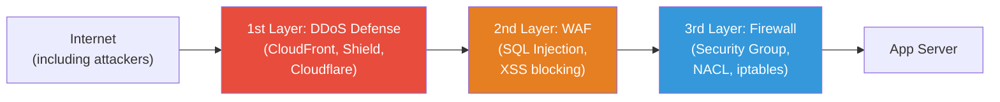
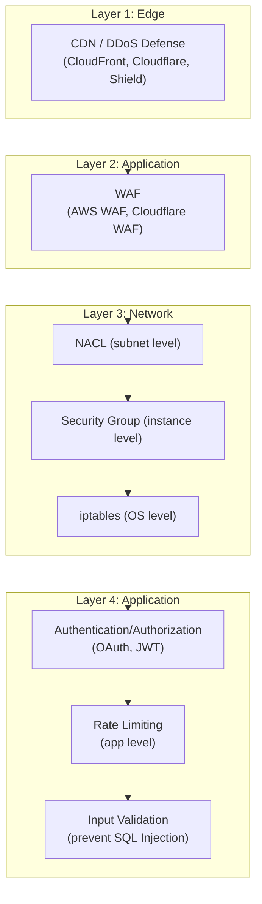
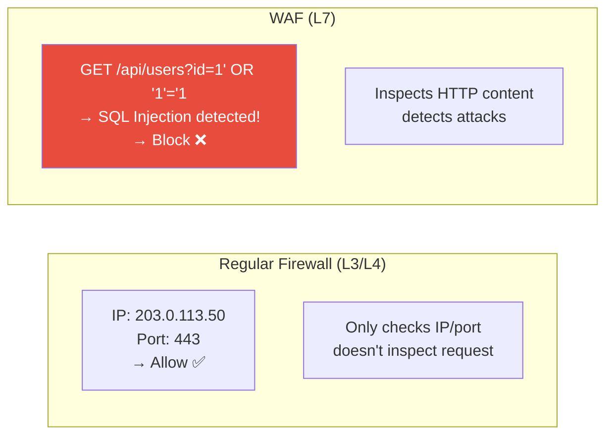
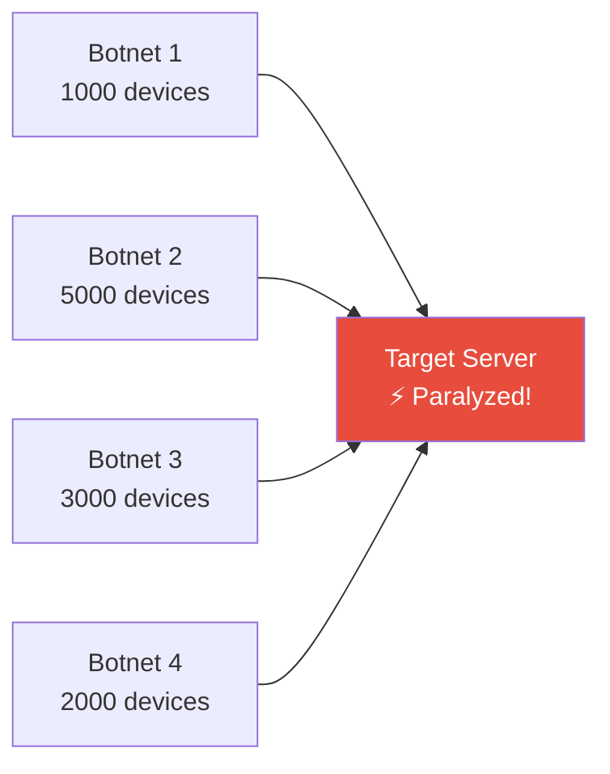
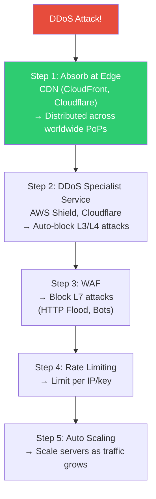
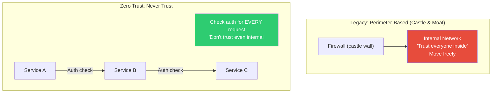

# Network Security (WAF / DDoS Defense / Zero Trust)

> Once you connect a server to the internet, attacks begin. SQL Injection, XSS, DDoS — without blocking these attacks, you face data breaches, service outages, and damaged trust. We learned how to diagnose networks in the [previous lecture](./08-debugging). Now we'll learn how to **protect** them.

---

## 🎯 Why Do You Need to Know This?

```
Real-world network security tasks:
• "Strange requests flooding the server"          → DDoS? Scanning? Bots?
• "Must block SQL Injection attacks"              → WAF setup
• "Security audit requires Zero Trust"            → Architecture migration
• "Rate limiting isn't stopping this attack"      → DDoS defense layers
• "Need to control internal service access"       → Zero Trust
• "AWS SG / NACL configuration"                   → Cloud network security
```

---

## 🧠 Core Concepts

### Analogy: Building Security System

Let's compare network security to **building security**.

* **Firewall (Security Group, NACL, iptables)** = Building entrance. Only authorized people enter
* **WAF (Web Application Firewall)** = Security checkpoint inside building. Searches visitors' bags for weapons
* **DDoS Defense** = Road control outside building. Prevents thousands from blocking the entrance
* **Zero Trust** = "Even inside building, always check ID". Don't trust internal employees without verification



### Defense in Depth Model

Security requires **multiple layers**. If one is breached, the next blocks.



---

## 🔍 Detailed Explanation — WAF (Web Application Firewall)

### What is WAF?

WAF inspects the **content** of HTTP requests and blocks malicious ones. Regular firewalls (L3/L4) only see IP and port, but WAF operates at **L7 (HTTP)**.



### Attack Types WAF Blocks

| Attack | Description | Example |
|--------|-------------|---------|
| **SQL Injection** | Malicious SQL inserted in DB query | `?id=1' OR '1'='1` |
| **XSS** | Malicious script injection | `<script>alert('hack')</script>` |
| **Path Traversal** | Access server files | `../../etc/passwd` |
| **Command Injection** | OS command insertion | `; rm -rf /` |
| **Bot/Scraping** | Automated bulk requests | Crawlers, scanners |
| **Protocol Violation** | Malformed HTTP | Bad headers, huge requests |
| **Scanner Detection** | Block vulnerability scanners | Nmap, Nikto, sqlmap |

```bash
# SQL Injection example
# Normal: GET /api/users?id=123
# Attack: GET /api/users?id=123' OR '1'='1' --
#       → DB leaks all user data!

# XSS example
# Normal: POST /comment {"text": "good article"}
# Attack: POST /comment {"text": "<script>steal_cookies()</script>"}
#       → Other users' cookies stolen!

# Path Traversal example
# Normal: GET /files/report.pdf
# Attack: GET /files/../../../etc/passwd
#       → Server password file accessed!
```

### AWS WAF Setup

```bash
# AWS WAF structure:
# Web ACL → Rule Group → Rules → Conditions

# 1. Use AWS Managed Rules (easiest! ⭐)
aws wafv2 create-web-acl \
    --name "myapp-waf" \
    --scope REGIONAL \
    --default-action '{"Allow":{}}' \
    --rules '[
        {
            "Name": "AWS-AWSManagedRulesCommonRuleSet",
            "Priority": 1,
            "Statement": {
                "ManagedRuleGroupStatement": {
                    "VendorName": "AWS",
                    "Name": "AWSManagedRulesCommonRuleSet"
                }
            },
            "OverrideAction": {"None": {}},
            "VisibilityConfig": {
                "SampledRequestsEnabled": true,
                "CloudWatchMetricsEnabled": true,
                "MetricName": "AWSCommonRules"
            }
        },
        {
            "Name": "AWS-AWSManagedRulesSQLiRuleSet",
            "Priority": 2,
            "Statement": {
                "ManagedRuleGroupStatement": {
                    "VendorName": "AWS",
                    "Name": "AWSManagedRulesSQLiRuleSet"
                }
            },
            "OverrideAction": {"None": {}},
            "VisibilityConfig": {
                "SampledRequestsEnabled": true,
                "CloudWatchMetricsEnabled": true,
                "MetricName": "AWSSQLiRules"
            }
        }
    ]'

# Key AWS Managed Rule Groups:
# AWSManagedRulesCommonRuleSet    → General web attacks (XSS, Path Traversal)
# AWSManagedRulesSQLiRuleSet      → SQL Injection
# AWSManagedRulesKnownBadInputsRuleSet → Known malicious inputs
# AWSManagedRulesBotControlRuleSet     → Bot detection/blocking
# AWSManagedRulesAmazonIpReputationList → Block malicious IPs

# 2. Link WAF to ALB
# AWS Console: ALB → Integrations → AWS WAF → Select Web ACL
# Or CLI:
aws wafv2 associate-web-acl \
    --web-acl-arn arn:aws:wafv2:ap-northeast-2:123456:regional/webacl/myapp-waf/xxx \
    --resource-arn arn:aws:elasticloadbalancing:ap-northeast-2:123456:loadbalancer/app/my-alb/xxx
```

### WAF Custom Rules

```bash
# Rate Limiting rule (block if >1000 requests per 5 minutes)
# → Blocks before reaching Nginx rate limiting (./07-nginx-haproxy)

# Protect specific paths
# /admin/* → Only allow from specific IPs

# Block specific countries
# GeoMatch: CN, RU → Block requests from these countries

# Check custom headers
# X-API-Key header required, block if missing

# Monitor WAF logs (S3 or CloudWatch)
# → See which requests are blocked
# → Check for False Positives (legitimate requests blocked)
```

### Cloudflare WAF

```bash
# Cloudflare offers DNS + CDN + WAF + DDoS in one

# Advantages:
# ✅ Very easy setup (dashboard clicks)
# ✅ Managed rules auto-update
# ✅ DDoS defense included
# ✅ Basic WAF in free plan
# ✅ Global CDN + security

# How to use:
# 1. Change domain NS to Cloudflare
# 2. Enable WAF rules in dashboard
# 3. Set SSL mode to Full (Strict)

# Cloudflare vs AWS WAF:
# Cloudflare: Easy setup, strong DDoS, manages DNS too
# AWS WAF: Deep AWS integration, fine-grained customization
# → Can use both! (Cloudflare → ALB + AWS WAF)
```

---

## 🔍 Detailed Explanation — DDoS Defense

### What is DDoS?

**Distributed Denial of Service** — Thousands to millions of devices send simultaneous requests, paralyzing the service.



### DDoS Attack Types

| Layer | Attack | Description | Defense |
|-------|--------|-------------|---------|
| **L3/L4** | SYN Flood | Massive SYN packets → exhaust connection table | SYN cookies, firewall |
| **L3/L4** | UDP Flood | Massive UDP packets → exhaust bandwidth | Bandwidth filtering, CDN |
| **L3/L4** | ICMP Flood | Massive ping → exhaust bandwidth | Block ICMP |
| **L7** | HTTP Flood | Massive HTTP requests → app overload | WAF, Rate Limiting |
| **L7** | Slowloris | Keep many slow connections open | Timeout settings |
| **DNS** | DNS Amplification | Reflect DNS responses at target | Source IP validation |

### DDoS Defense Strategy



### AWS DDoS Defense

```bash
# === AWS Shield ===

# Shield Standard (free, auto-enabled)
# → Applied to all AWS resources automatically
# → L3/L4 DDoS defense (SYN flood, UDP flood, etc.)

# Shield Advanced (paid, $3000/month)
# → Stronger defense + 24/7 DRT (DDoS Response Team)
# → L7 DDoS defense
# → Cost protection (scaling costs during attack reimbursed)
# → Real-time attack visibility

# === CloudFront + WAF Combination (most common) ===
# CloudFront (CDN) → WAF → ALB → App Server
#
# CloudFront does:
# - Absorb traffic at worldwide edge locations
# - Cache static content (reduce origin load)
# - Terminate TLS at edge
# - Geographic restrictions (block countries)
#
# WAF does:
# - Block L7 attacks (SQL Injection, XSS)
# - Rate Limiting
# - Bot detection

# === SYN Flood Defense (Linux server level) ===
# (see ../01-linux/13-kernel)
sudo sysctl net.ipv4.tcp_syncookies=1           # Enable SYN cookies
sudo sysctl net.ipv4.tcp_max_syn_backlog=65535   # SYN queue size
sudo sysctl net.core.somaxconn=65535             # Connection queue size

# Detect SYN Flood
ss -tan state syn-recv | wc -l
# 5000 → Abnormal! SYN flood suspected

# Identify attacking IPs
ss -tan state syn-recv | awk '{print $5}' | cut -d: -f1 | sort | uniq -c | sort -rn | head
#  2000 185.220.101.42
#  1500 103.145.12.88
```

### DDoS Response Checklist

```bash
# === Emergency Response ===

# 1. Confirm attack
# - CloudWatch: Request count surge, 5xx errors surge
# - Server: CPU/memory/network maxed
# - Logs: Repetitive request patterns

# 2. Immediate action
# a. If using CloudFront/Cloudflare → Confirm auto-defense active
# b. Strengthen WAF Rate Limiting
# c. Block attacking IP ranges

# 3. Server-level defense
# Block attacking IPs with iptables
sudo iptables -A INPUT -s 185.220.101.0/24 -j DROP
sudo iptables -A INPUT -s 103.145.12.0/24 -j DROP

# Or use ipset (faster than iptables)
sudo apt install ipset
sudo ipset create blacklist hash:net
sudo ipset add blacklist 185.220.101.0/24
sudo ipset add blacklist 103.145.12.0/24
sudo iptables -A INPUT -m set --match-set blacklist src -j DROP

# 4. Scaling
# Auto Scaling adds servers, but DDoS traffic scaling = cost explosion!
# → Block at edge (CDN, WAF) first!

# 5. Post-analysis
# - Analyze attack pattern (IPs, User-Agent, request pattern)
# - Strengthen WAF rules
# - Improve defense
```

### Slowloris Defense (Nginx)

```bash
# Slowloris: Keep connections alive very slowly to exhaust server connections

# Nginx is naturally resistant (event-driven)
# But add settings for extra protection:

# /etc/nginx/nginx.conf
client_header_timeout 10s;     # Header receive timeout (default 60s → 10s)
client_body_timeout 10s;       # Body receive timeout
send_timeout 10s;              # Response send timeout
keepalive_timeout 15s;         # Reduce Keep-Alive duration

# Rate Limiting (see ./07-nginx-haproxy)
limit_conn_zone $binary_remote_addr zone=conn_limit:10m;
limit_conn conn_limit 20;      # Limit concurrent connections to 20 per IP
```

---

## 🔍 Detailed Explanation — Zero Trust

### Legacy Model vs Zero Trust



**Legacy Model Problems:**
* Once inside VPN, access everywhere
* Vulnerable to internal attackers (or compromised accounts)
* Unclear "internal" boundary in cloud/remote work

**Zero Trust Principles:**
1. **Never Trust, Always Verify** — Every request must be authenticated
2. **Least Privilege** — Grant only minimum required access
3. **Assume Breach** — Defend assuming already compromised

### Zero Trust Implementation Elements

```bash
# === 1. Micro-Segmentation ===
# Fine-grained control of service-to-service communication
# - K8s NetworkPolicy (see ../04-kubernetes/15-security)
# - Segment SGs by service

# Example: App server accesses only DB, DB accessed only by app
# SG-app: outbound → SG-db:5432
# SG-db:  inbound ← SG-app:5432
# → If app compromised, can't access other services

# === 2. Service-to-Service Authentication (mTLS) ===
# (see ./05-tls-certificate)
# Encrypt + authenticate all service-to-service communication
# → Istio handles automatically

# === 3. User Authentication ===
# SSO + MFA (Multi-Factor Authentication)
# - OAuth 2.0 / OIDC
# - Device authentication (MDM)
# - Location/time-based access control

# === 4. Network Access ===
# Replace VPN with Zero Trust Network Access (ZTNA)
# - Google BeyondCorp
# - Cloudflare Access
# - Tailscale, WireGuard
# → Access specific services without VPN
```

### AWS Zero Trust Implementation

```bash
# 1. Fine-grained Security Groups
# ❌ One SG with all rules
# ✅ Service-specific SGs → Minimal permissions

# SG: app-server
#   Inbound: SG-alb:80 (only from ALB)
#   Outbound: SG-db:5432, SG-redis:6379

# SG: database
#   Inbound: SG-app:5432 (only from app!)
#   Outbound: (none needed)

# SG: alb
#   Inbound: 0.0.0.0/0:443 (external HTTPS)
#   Outbound: SG-app:80

# 2. VPC Endpoints (AWS service access without internet)
# S3, DynamoDB, ECR accessed from within VPC
# → No NAT Gateway needed + security improved

# 3. IAM Role-Based Access (not human keys)
# - Assign IAM Role to EC2
# - Pod gets IAM Role (IRSA - IAM Roles for Service Accounts)
# - Temporary credentials via STS AssumeRole

# 4. Systems Manager Session Manager
# → SSH-less server access
# → All sessions logged (CloudTrail + S3)
# → Port 22 not needed

# Access server via Session Manager
aws ssm start-session --target i-0abc123def456
# → Browser or CLI access without SSH key!
```

---

## 🔍 Detailed Explanation — Practical Security Setup

### AWS Security Group vs NACL

```bash
# === Security Group (SG) — Instance-Level Firewall ===
# - Stateful: Allow inbound → outbound response auto-allowed
# - Allow rules only (no deny)
# - Apply immediately

# Production SG design example:

# [SG: alb-sg]
# Inbound:  0.0.0.0/0 TCP 443 (HTTPS from anywhere)
# Outbound: sg-app TCP 8080

# [SG: app-sg]
# Inbound:  sg-alb TCP 8080 (ALB only!)
#           sg-bastion TCP 22 (bastion for SSH)
# Outbound: sg-db TCP 5432
#           sg-redis TCP 6379
#           0.0.0.0/0 TCP 443 (external API calls)

# [SG: db-sg]
# Inbound:  sg-app TCP 5432 (app only!)
# Outbound: (none — stateful auto-handles response)

# [SG: bastion-sg]
# Inbound:  office_IP/32 TCP 22 (office only)
# Outbound: sg-app TCP 22

# ✅ SG can reference other SGs!
# → IPs change, SG references remain valid
# → This is SG's most powerful feature!

# === NACL — Subnet-Level Firewall ===
# - Stateless: Need separate inbound/outbound rules!
# - Both allow + deny rules
# - Rules evaluated in number order (first match wins)

# NACL example (public subnet):
# Inbound:
#  100  ALLOW  TCP  443   0.0.0.0/0    (HTTPS)
#  110  ALLOW  TCP  80    0.0.0.0/0    (HTTP)
#  120  ALLOW  TCP  22    203.0.113.0/24 (office SSH)
#  130  ALLOW  TCP  1024-65535  0.0.0.0/0  (ephemeral ports — for responses!)
#  *    DENY   ALL  ALL   0.0.0.0/0    (deny rest)

# Outbound:
#  100  ALLOW  TCP  443   0.0.0.0/0    (HTTPS response)
#  110  ALLOW  TCP  80    0.0.0.0/0    (HTTP response)
#  120  ALLOW  TCP  1024-65535  0.0.0.0/0  (ephemeral — response!)
#  *    DENY   ALL  ALL   0.0.0.0/0

# ⚠️ Most common NACL mistake:
# Forget ephemeral ports in outbound → responses don't go back!
```

**SG vs NACL Comparison:**

| Item | Security Group | NACL |
|------|----------------|------|
| Level | Instance (ENI) | Subnet |
| Stateful | ✅ (response auto-allowed) | ❌ (separate rules needed) |
| Rule Type | Allow only | Allow + Deny |
| Rule Evaluation | All rules evaluated | Number order (first match) |
| Application | Assign to instance | Auto-apply to subnet |
| SG Reference | ✅ (other SG as source) | ❌ (IP/CIDR only) |
| Real-world Use | ⭐⭐⭐⭐⭐ | ⭐⭐ (additional defense) |

```bash
# Practical recommendation:
# Manage with SG (99% of cases)
# NACL as additional layer only (default + emergency IP blocks)

# ❌ Duplicate rules in both SG + NACL → Management nightmare
# ✅ SG primary defense, NACL extra layer
```

### SSH Security Hardening

```bash
# /etc/ssh/sshd_config (basic covered in ../01-linux/10-ssh, here's hardening)

# 1. Disable password auth
PasswordAuthentication no

# 2. Block root login
PermitRootLogin no

# 3. Key auth only
PubkeyAuthentication yes

# 4. Specific users only
AllowUsers ubuntu deploy

# 5. Change port (optional, obscures from scanning)
# Port 2222

# 6. Auth attempt limits
MaxAuthTries 3
LoginGraceTime 30

# 7. Disable X11/Agent forwarding (if unused)
X11Forwarding no
AllowAgentForwarding no

# 8. Enhanced logging
LogLevel VERBOSE

# Apply changes
sudo sshd -t && sudo systemctl reload sshd

# Monitor SSH access
# Failed attempts
grep "Failed password\|Invalid user" /var/log/auth.log | tail -10

# Successful logins
grep "Accepted" /var/log/auth.log | tail -10

# fail2ban auto-blocks repeat failures
sudo apt install fail2ban
# → Automatically blocks IP after repeated failed login attempts

# Check fail2ban status
sudo fail2ban-client status sshd
# Status for the jail: sshd
# |- Filter
# |  |- Currently failed: 3
# |  |- Total failed:     150
# |  `- File list:        /var/log/auth.log
# `- Actions
#    |- Currently banned: 5
#    |- Total banned:     25
#    `- Banned IP list:   185.220.101.42 103.145.12.88 ...

# View banned IPs
sudo fail2ban-client status sshd | grep "Banned IP"
# Banned IP list: 185.220.101.42 103.145.12.88
```

---

## 💻 Practice Examples

### Practice 1: Attack Simulation and Defense

```bash
# ⚠️ Test only on your own servers! Attacking others' servers is illegal!

# 1. SQL Injection Simulation (see what attack looks like)
# Normal request:
curl "http://localhost:8080/api/users?id=1"
# {"user": {"id": 1, "name": "alice"}}

# SQL Injection attempt:
curl "http://localhost:8080/api/users?id=1'%20OR%20'1'='1"
# With WAF: → 403 Forbidden
# Without WAF: → All user data leaked!

# 2. Rate Limiting Test
for i in $(seq 1 50); do
    code=$(curl -s -o /dev/null -w "%{http_code}" http://localhost:8080/api/data)
    [ "$code" = "429" ] && echo "Request $i: 429 (blocked!)" && break
    echo "Request $i: $code"
done

# 3. SYN Flood Simulation (test environment only!)
# hping3 --flood --rand-source -S -p 80 localhost
# → NEVER do this on production or others' servers!

# Monitor SYN state
watch -n 1 'ss -tan state syn-recv | wc -l'
```

### Practice 2: fail2ban Setup

```bash
# 1. Install
sudo apt install fail2ban

# 2. Configure SSH jail
cat << 'EOF' | sudo tee /etc/fail2ban/jail.local
[sshd]
enabled = true
port = ssh
filter = sshd
logpath = /var/log/auth.log
maxretry = 5          # 5 failed attempts
findtime = 600        # Within 10 minutes
bantime = 3600        # Ban for 1 hour
EOF

# 3. Start
sudo systemctl enable --now fail2ban

# 4. Check status
sudo fail2ban-client status
# Number of jail: 1
# Jail list: sshd

sudo fail2ban-client status sshd

# 5. Manually block/unblock IP
sudo fail2ban-client set sshd banip 203.0.113.100
sudo fail2ban-client set sshd unbanip 203.0.113.100

# 6. Check logs
tail -20 /var/log/fail2ban.log
# INFO [sshd] Ban 185.220.101.42
# INFO [sshd] Unban 185.220.101.42 (bantime expired)
```

### Practice 3: Security Group Design Exercise

```bash
# Paper exercise (can practice in AWS Console)

# Setup:
# ALB → App Servers (2x) → RDS (PostgreSQL)
# Bastion → App Server SSH

# SG Design:
# 1. sg-alb:     in: 0.0.0.0/0:443, out: sg-app:8080
# 2. sg-app:     in: sg-alb:8080, sg-bastion:22, out: sg-db:5432, 0.0.0.0/0:443
# 3. sg-db:      in: sg-app:5432
# 4. sg-bastion: in: office_IP:22, out: sg-app:22

# Validation Questions:
# Q: Can external user access DB directly? → ❌ sg-db only allows sg-app
# Q: Can app access internet? → ✅ out: 0.0.0.0/0:443
# Q: Can bastion access DB? → ❌ sg-db only allows sg-app
```

---

## 🏢 Real-World Scenarios

### Scenario 1: DDoS Attack Emergency Response

```bash
# 1. Attack detected
# CloudWatch: 5xx error rate 50%+ surge!
# Server: CPU 100%, network saturated

# 2. Check logs quickly
awk '{print $1}' /var/log/nginx/access.log | sort | uniq -c | sort -rn | head -5
#  50000 185.220.101.42       ← One IP with 50k requests!
#  30000 103.145.12.88
#  20000 45.227.254.20
#   1000 203.0.113.50         ← Legitimate user

# 3. Emergency block
# Option 1: iptables
sudo iptables -A INPUT -s 185.220.101.0/24 -j DROP
sudo iptables -A INPUT -s 103.145.12.0/24 -j DROP

# Option 2: Nginx deny
# location / {
#     deny 185.220.101.0/24;
#     deny 103.145.12.0/24;
#     allow all;
# }

# Option 3: Strengthen AWS WAF Rate Limiting
# 5 minutes 100 requests → 5 minutes 20 requests (temporary)

# Option 4: Cloudflare "Under Attack Mode"
# → JavaScript challenge auto-blocks bots

# 4. Post-analysis
# - Analyze attack pattern (User-Agent, request pattern)
# - Add pattern to WAF rules
# - Plan defense improvements
```

### Scenario 2: WAF False Positive

```bash
# "Legitimate request blocked by WAF!"
# → False Positive (overkill)

# 1. Find blocked request in WAF logs
# AWS WAF logs (S3 or CloudWatch):
# {
#   "action": "BLOCK",
#   "terminatingRuleId": "AWSManagedRulesCommonRuleSet",
#   "ruleGroupList": [{
#     "terminatingRule": {
#       "ruleId": "CrossSiteScripting_BODY"  ← XSS rule triggered
#     }
#   }],
#   "httpRequest": {
#     "uri": "/api/posts",
#     "body": "content=<b>Hello</b>"  ← HTML tag detected as XSS!
#   }
# }

# 2. Fix: Switch rule to Count mode (log but don't block)
# AWS Console: WAF → Web ACL → Rule → Override → Count

# Or exclude specific path from rule
# Scope-down statement: Skip XSS rule for /api/posts path

# 3. Strengthen app-level input validation
# Don't rely on WAF alone!
# - Escape user input
# - Add Content Security Policy header
```

### Scenario 3: Zero Trust Migration

```bash
# "Migrate from VPN-based to Zero Trust"

# Step 1: Introduce SSM Session Manager (replace SSH)
# → Eliminate need for bastion
# → Close port 22
# → All sessions logged

# Step 2: Segment SGs by service
# → One large SG → Service-specific SGs
# → Minimal inter-service permissions

# Step 3: Use IAM Roles instead of keys
# → Server gets IAM Role (temporary credentials)
# → Pod gets IRSA
# → STS AssumeRole for temporary access

# Step 4: Add service-to-service mTLS
# → Istio handles encryption + authentication
# → All service communication encrypted + verified

# Step 5: Replace VPN with ZTNA
# → Cloudflare Access or Tailscale
# → SSO + MFA required
# → Device authentication
# → Location-based access control
```

---

## ⚠️ Common Mistakes

### 1. WAF Enabled But Never Checked Logs

```bash
# ❌ Turn on WAF and forget
# → False Positives blocking legitimate users without knowing!
# → Attacks passing through undetected!

# ✅ Regularly review WAF logs
# → Check Block/Count ratio
# → Validate no False Positives
# → Watch for new attack patterns
```

### 2. Excessive 0.0.0.0/0 in Security Groups

```bash
# ❌ 0.0.0.0/0 in every SG inbound
# → Everyone can access everything = firewall pointless!

# ✅ Allow only from necessary sources
# ALB-SG: 0.0.0.0/0:443 OK
# Others: Restrict with SG references or specific CIDR
```

### 3. Forget NACL Statelessness

```bash
# ❌ Only configure NACL inbound, skip outbound
# → "Works in SG but broken in NACL!"

# ✅ NACL is stateless! Configure both directions
# Outbound: Allow ephemeral ports (1024-65535) for responses!
```

### 4. Try DDoS Defense Only at Server Level

```bash
# ❌ Defend only with iptables
# → Network saturates before reaching server!

# ✅ Defend at edge (CDN, CloudFront, Cloudflare)
# → Server level is backup only
```

### 5. Never Update Security Rules

```bash
# ❌ Make rules once, never touch them
# → Departing employees' IPs still allowed
# → Unused ports still open

# ✅ Regular security audit (quarterly)
# → Remove unused SG rules
# → Update WAF rules
# → Review access logs
# → Run vulnerability scans
```

---

## 📝 Summary

### Defense Layers Quick Reference

```
1st Layer (Edge):     CDN + DDoS Defense (CloudFront, Cloudflare, Shield)
2nd Layer (App):      WAF (SQL Injection, XSS, Bot blocking)
3rd Layer (Network):  SG + NACL + iptables (IP/port control)
4th Layer (App):      Auth/AuthZ + Rate Limiting + Input Validation
```

### Security Group Design Principles

```
✅ Segment SGs by service
✅ Use SG references for service-to-service (not IP)
✅ Only ALB allows 0.0.0.0/0, rest restricted
✅ SSH from bastion only (or use SSM)
✅ DB accessed only by app SG
```

### DDoS Response Checklist

```
✅ CDN (CloudFront/Cloudflare) in front
✅ AWS Shield Standard (auto-enabled)
✅ WAF Rate Limiting configured
✅ SYN cookies + backlog tuning
✅ Auto Scaling enabled
✅ Emergency IP block procedure documented
✅ Slack/PagerDuty alerts configured
```

### Zero Trust Checklist

```
✅ VPN → SSM Session Manager (or ZTNA)
✅ Service-specific minimal SGs
✅ IAM Role-based (not keys)
✅ Service-to-service mTLS (Istio)
✅ SSO + MFA required
✅ All access logged + monitored
```

---

## 🔗 Next Lecture

Next is **[10-vpn](./10-vpn)** — VPN / Tunneling (IPsec / WireGuard / OpenVPN / Direct Connect).

How to safely connect office to AWS VPC? How to connect on-premises to cloud? Learn VPN principles and production setup.
