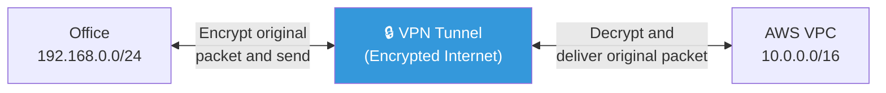
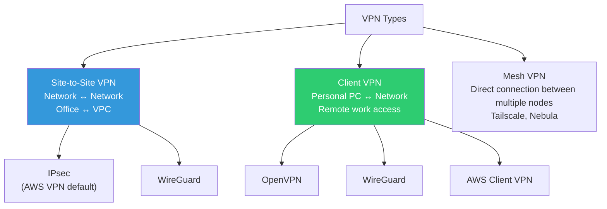
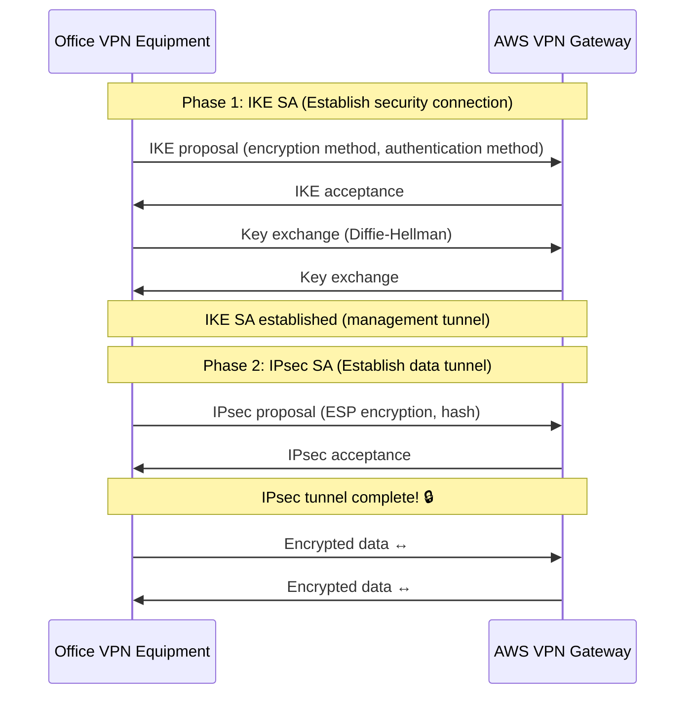
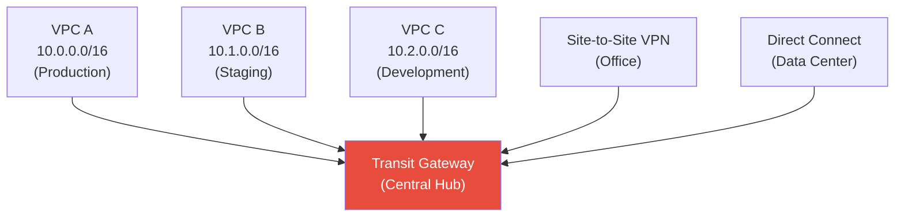
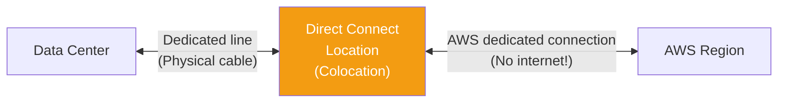
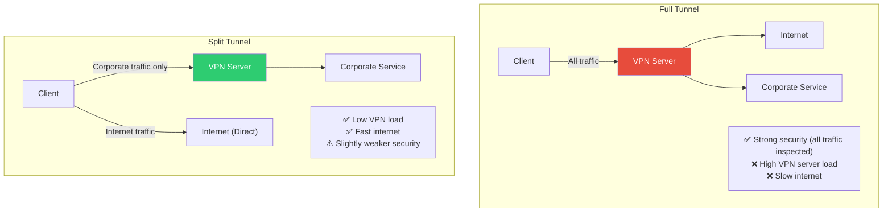

# VPN / Tunneling (IPsec / WireGuard / OpenVPN / Direct Connect)

> Need to access private servers in AWS VPC from the office? Want to connect an on-premises data center to the cloud? VPN is what allows you to use the internet safely as if it were a **private network**.

---

## 🎯 Why Do You Need to Know This?

```
Real-world situations where VPN is needed:
• Office ↔ AWS VPC connection               → Site-to-Site VPN
• Developers accessing internal services from home → Client VPN
• On-premises DC ↔ AWS cloud connection     → VPN or Direct Connect
• VPC-to-VPC connection                     → VPC Peering or Transit Gateway
• Security audit: "Is internal communication encrypted?"  → VPN/mTLS
• Remote work network access               → WireGuard, OpenVPN
```

---

## 🧠 Core Concepts

### Analogy: Underground Tunnel

Let me compare VPN to an **underground tunnel**.

* **Internet** = Public road. Anyone can see and it's risky.
* **VPN tunnel** = Secret underground passage connecting two points. Outside observers can't see what's going on inside.
* **Encryption** = Talking in cipher inside the tunnel. Even if the tunnel is discovered, the content can't be decrypted.
* **VPN Gateway** = Tunnel entrance. This is where packets are encrypted, and decrypted on the other side.



### VPN Types



| Type | Connection Target | Use Case | Example |
|------|----------|------|------|
| **Site-to-Site** | Network ↔ Network | Office↔Cloud, DC↔Cloud | AWS Site-to-Site VPN |
| **Client VPN** | Personal PC ↔ Network | Remote work, remote access | OpenVPN, WireGuard |
| **Mesh VPN** | Node ↔ Node (P2P) | Direct connection between multiple sites | Tailscale, Nebula |

---

## 🔍 Detailed Explanation — VPN Protocols

### IPsec (Internet Protocol Security)

The most traditional VPN protocol. It's the default for AWS Site-to-Site VPN.

```bash
# IPsec structure:
# 1. IKE (Internet Key Exchange) — Key exchange/authentication
#    IKEv1 (legacy) or IKEv2 (recommended)
# 2. ESP (Encapsulating Security Payload) — Actual data encryption

# IPsec modes:
# Tunnel Mode — Encrypt entire IP packet (for Site-to-Site)
# Transport Mode — Encrypt payload only (between hosts)
```



```bash
# IPsec pros and cons:
# ✅ Industry standard (supported by almost all equipment)
# ✅ Supported by AWS, GCP, Azure
# ✅ Hardware acceleration possible
# ❌ Complex configuration (Phase 1, Phase 2 parameters)
# ❌ Can have issues in NAT environments (NAT-T required)
# ❌ Requires UDP 500, 4500 ports
```

### WireGuard (★ Modern Recommendation)

WireGuard is a **simple and fast** modern VPN protocol. It's built into the Linux kernel.

```bash
# WireGuard pros and cons:
# ✅ Very simple configuration (tens of lines)
# ✅ Very fast (kernel-built-in, efficient encryption)
# ✅ Small codebase (~4000 lines vs OpenVPN 100k lines) → easy security audit
# ✅ Mobile-friendly (roaming support)
# ✅ Built into Linux kernel 5.6+
# ❌ No TCP support (UDP only) → can be blocked by strict firewalls
# ❌ Dynamic IP assignment not built-in
# ❌ No native AWS support (requires manual installation)
```

#### WireGuard Installation and Configuration

```bash
# === Server side (VPN server) ===

# Installation
sudo apt install wireguard

# Generate keys
wg genkey | tee /etc/wireguard/server_private.key | wg pubkey > /etc/wireguard/server_public.key
chmod 600 /etc/wireguard/server_private.key

SERVER_PRIVATE=$(cat /etc/wireguard/server_private.key)
SERVER_PUBLIC=$(cat /etc/wireguard/server_public.key)

# Server configuration
cat << EOF | sudo tee /etc/wireguard/wg0.conf
[Interface]
Address = 10.200.0.1/24                      # VPN internal IP
ListenPort = 51820                           # WireGuard port
PrivateKey = $SERVER_PRIVATE

# IP forwarding + NAT (VPN → Internet)
PostUp = iptables -A FORWARD -i wg0 -j ACCEPT; iptables -t nat -A POSTROUTING -o eth0 -j MASQUERADE
PostDown = iptables -D FORWARD -i wg0 -j ACCEPT; iptables -t nat -D POSTROUTING -o eth0 -j MASQUERADE

# Client (Peer)
[Peer]
PublicKey = <client_public_key>
AllowedIPs = 10.200.0.2/32                  # This client's VPN IP
EOF

# Enable IP forwarding (see ../01-linux/13-kernel)
sudo sysctl net.ipv4.ip_forward=1
echo "net.ipv4.ip_forward=1" | sudo tee -a /etc/sysctl.d/99-wireguard.conf

# Start WireGuard
sudo wg-quick up wg0
sudo systemctl enable wg-quick@wg0

# Check status
sudo wg show
# interface: wg0
#   public key: <server_public_key>
#   private key: (hidden)
#   listening port: 51820
#
# peer: <client_public_key>
#   allowed ips: 10.200.0.2/32
#   latest handshake: 30 seconds ago
#   transfer: 1.5 MiB received, 3.2 MiB sent
```

```bash
# === Client side ===

# Generate keys
wg genkey | tee client_private.key | wg pubkey > client_public.key

CLIENT_PRIVATE=$(cat client_private.key)

# Client configuration
cat << EOF > wg0.conf
[Interface]
Address = 10.200.0.2/24
PrivateKey = $CLIENT_PRIVATE
DNS = 10.0.0.2                               # VPC DNS (optional)

[Peer]
PublicKey = $SERVER_PUBLIC                    # Server public key
Endpoint = 52.78.100.200:51820               # Server public IP:port
AllowedIPs = 10.0.0.0/16                     # Route only VPC CIDR through VPN
#AllowedIPs = 0.0.0.0/0                      # Route all traffic through VPN (full tunnel)
PersistentKeepalive = 25                     # Keep connection alive behind NAT
EOF

# Connect
sudo wg-quick up ./wg0.conf

# Check connection
sudo wg show
ping 10.0.1.50                               # Can now access VPC internal server!

# Disconnect
sudo wg-quick down ./wg0.conf
```

### OpenVPN

The oldest and most widely used VPN. Supports TCP, so it's strong at firewall traversal.

```bash
# OpenVPN pros and cons:
# ✅ Very mature and stable (20+ years)
# ✅ Supports both TCP/UDP → easy firewall traversal
# ✅ Can masquerade as port 443 (like HTTPS)
# ✅ Rich authentication methods (certificates, LDAP, MFA)
# ✅ Client apps available for all OS
# ❌ Slower than WireGuard
# ❌ Complex configuration
# ❌ Runs in user space (not kernel)

# Installation (server)
sudo apt install openvpn easy-rsa

# Set up PKI with easy-rsa
make-cadir ~/openvpn-ca
cd ~/openvpn-ca
./easyrsa init-pki
./easyrsa build-ca nopass
./easyrsa gen-req server nopass
./easyrsa sign-req server server
./easyrsa gen-dh
openvpn --genkey secret ta.key

# Generate client certificate
./easyrsa gen-req client1 nopass
./easyrsa sign-req client client1

# Server configuration (/etc/openvpn/server.conf)
# port 1194
# proto udp
# dev tun
# ca ca.crt
# cert server.crt
# key server.key
# dh dh.pem
# server 10.200.0.0 255.255.255.0
# push "route 10.0.0.0 255.255.0.0"
# cipher AES-256-GCM
# auth SHA256
# keepalive 10 120

# Start
sudo systemctl enable --now openvpn@server
```

### Protocol Comparison

| Item | IPsec | WireGuard | OpenVPN |
|------|-------|-----------|---------|
| Speed | Fast (HW acceleration) | ⭐ Very fast (kernel) | Normal (user space) |
| Configuration difficulty | Difficult | ⭐ Easy | Normal |
| Code size | Large and complex | ~4,000 lines | ~100,000 lines |
| Protocol | UDP 500/4500 | UDP (custom port) | TCP or UDP |
| Firewall traversal | ⚠️ NAT issues | ⚠️ UDP only | ✅ TCP 443 masquerade |
| Mobile | ✅ | ✅ (Excellent) | ✅ |
| AWS native | ✅ Site-to-Site | ❌ (Manual installation) | ❌ (Manual installation) |
| Recommended for | AWS VPN, Enterprise | Server-to-server VPN, Remote work | Strict firewall environments |

---

## 🔍 Detailed Explanation — AWS Network Connectivity

### AWS Site-to-Site VPN

Connect office/data center to AWS VPC using IPsec VPN.


```bash
# AWS Site-to-Site VPN setup flow:

# 1. Create Customer Gateway (CGW)
# → Register office VPN equipment's public IP and ASN
aws ec2 create-customer-gateway \
    --type ipsec.1 \
    --bgp-asn 65000 \
    --public-ip 203.0.113.1    # Office public IP

# 2. Create Virtual Private Gateway (VGW)
aws ec2 create-vpn-gateway --type ipsec.1
# → Attach to VPC
aws ec2 attach-vpn-gateway --vpn-gateway-id vgw-xxx --vpc-id vpc-xxx

# 3. Create VPN Connection
aws ec2 create-vpn-connection \
    --type ipsec.1 \
    --customer-gateway-id cgw-xxx \
    --vpn-gateway-id vgw-xxx \
    --options '{"StaticRoutesOnly": false}'    # Use BGP

# 4. Download VPN configuration file
# → From AWS console: VPN Connection → Download Configuration
# → Provides configuration for office equipment (Cisco, Juniper, pfSense, etc.)

# 5. Set up routing
# Add office CIDR to VPC Route Table:
# Destination: 192.168.0.0/24 → Target: vgw-xxx

# 6. Verify
# VPN Connection status:
# Tunnel 1: UP ✅
# Tunnel 2: UP ✅ (Redundant!)

# Ping VPC server from office
ping 10.0.1.50    # VPC internal server → Success!

# ⚠️ AWS VPN provides 2 tunnels (redundant)
# → Auto-failover if one fails
# → Both can be active-active or active-standby
```

```bash
# AWS Site-to-Site VPN important considerations:

# Bandwidth: Max 1.25 Gbps per tunnel
# → For higher bandwidth, use multiple VPN connections or Direct Connect

# Cost: Per hour + data transfer
# → ~$0.05/hour (approximately $36/month)

# Latency: Routes through internet → has latency/variance
# → Use Direct Connect for stable low-latency needs

# BGP vs Static Routing:
# BGP → Automatic route management (recommended!)
# Static → Manual route addition (simple but less flexible)
```

### AWS Transit Gateway

Connect multiple VPCs and VPNs via a **central hub**. Essential when you have many VPCs.



```bash
# Why Transit Gateway is needed:

# With only VPC Peering:
# To connect 3 VPCs → 3 Peerings (A↔B, B↔C, A↔C)
# To connect 10 VPCs → 45 Peerings!
# → Unmanageable!

# With Transit Gateway:
# To connect 10 VPCs → 10 TGW Attachments only!
# → Central routing management
# → VPN/Direct Connect also connect to the same hub

# Transit Gateway Route Table:
# Destination      Target
# 10.0.0.0/16      vpc-a attachment
# 10.1.0.0/16      vpc-b attachment
# 10.2.0.0/16      vpc-c attachment
# 192.168.0.0/24   vpn attachment (office)
# 172.16.0.0/16    dxgw attachment (DC)
```

### AWS Direct Connect

Connect to AWS via **dedicated line** without going through the internet. Most stable and fast, but costly.



```bash
# Direct Connect vs VPN comparison

# VPN (Site-to-Site):
# - Routes through internet → latency variance, bandwidth limit (1.25 Gbps)
# - Easy setup, low cost ($36/month)
# - Configurable in minutes
# - Redundancy: 2 tunnels

# Direct Connect:
# - Dedicated line → consistent latency, high bandwidth (1~100 Gbps!)
# - Complex setup, high cost (port + data transfer)
# - Takes weeks to months to set up (physical cable installation)
# - Redundancy: 2 DX connections (different locations)

# When to use which?
# VPN → Most cases (small to medium scale, fast setup)
# Direct Connect → High-volume data transfer, consistent performance (large scale)
# Both → DX as primary, VPN as backup (maximum availability)
```

### VPC Peering vs Transit Gateway vs PrivateLink

```bash
# 3 ways to connect VPCs

# === VPC Peering ===
# Directly connect 2 VPCs 1:1
# ✅ Simple, low cost (data transfer only)
# ❌ No transitive routing (connecting A↔B and B↔C doesn't enable A↔C!)
# ❌ Management complex with many VPCs
# → Use when connecting 2~3 VPCs

# === Transit Gateway ===
# Connect multiple VPCs/VPNs via central hub
# ✅ Transitive routing possible (A→TGW→C)
# ✅ VPN, DX also connect to same hub
# ✅ Central routing/security management
# ❌ Per-hour cost + data transfer cost
# → Use for 4+ VPCs, complex networks

# === PrivateLink ===
# Expose only specific service endpoint
# ✅ Works even if VPC CIDRs overlap!
# ✅ Least privilege (access specific service only)
# ✅ Service provider/consumer model
# ❌ Per-service configuration (not full network connectivity)
# → Use for SaaS service provision, sharing specific service only

# Selection guide:
# 2~3 VPCs, simple        → VPC Peering
# 4+ VPCs, VPN/DX present → Transit Gateway
# Share only specific service → PrivateLink
```

---

## 🔍 Detailed Explanation — Split Tunnel vs Full Tunnel



```bash
# Split Tunnel configuration in WireGuard

# Full Tunnel (all traffic through VPN):
# AllowedIPs = 0.0.0.0/0

# Split Tunnel (only corporate CIDR through VPN):
# AllowedIPs = 10.0.0.0/16, 172.16.0.0/12
# → Only 10.x.x.x and 172.16~31.x.x route through VPN, rest direct to internet

# In practice, Split Tunnel is used more:
# - Reduces VPN server load
# - Maintains user internet speed
# - Lowers cost (VPN bandwidth)
#
# But in high-security environments, use Full Tunnel:
# - All traffic inspected by company
# - DLP (Data Loss Prevention) applied
```

---

## 💻 Practice Examples

### Example 1: WireGuard Local Test

```bash
# Create WireGuard interface on same server (for understanding principles)

# 1. Install
sudo apt install wireguard-tools

# 2. Generate key pair
wg genkey | tee /tmp/wg_private | wg pubkey > /tmp/wg_public

echo "Private key: $(cat /tmp/wg_private)"
echo "Public key: $(cat /tmp/wg_public)"

# 3. Create interface (with ip command)
sudo ip link add dev wg-test type wireguard
sudo ip addr add 10.200.0.1/24 dev wg-test
sudo wg set wg-test private-key /tmp/wg_private listen-port 51820
sudo ip link set wg-test up

# 4. Check status
sudo wg show wg-test
# interface: wg-test
#   public key: <public_key>
#   private key: (hidden)
#   listening port: 51820

ip addr show wg-test
# inet 10.200.0.1/24 scope global wg-test

# 5. Clean up
sudo ip link del wg-test
rm /tmp/wg_private /tmp/wg_public
```

### Example 2: SSH Tunnel as VPN Alternative (Simple VPN)

```bash
# When WireGuard/OpenVPN can't be installed
# Use SSH tunnel as simple VPN (see ../01-linux/10-ssh)

# SOCKS proxy (route all traffic through SSH)
ssh -D 1080 -N -f ubuntu@52.78.100.200
# → localhost:1080 is now SOCKS5 proxy
# → Set browser proxy to localhost:1080
# → All web traffic routes through server!

# Tunnel specific service only
ssh -L 5432:10.0.2.10:5432 -N -f ubuntu@52.78.100.200
# → Can connect to VPC internal DB via localhost:5432

# Difference from VPN:
# SSH tunnel: Specific port/service only, TCP only, simple setup
# VPN: Full network, TCP+UDP, complex setup but complete connectivity
```

### Example 3: VPN Connection Diagnostics

```bash
# Things to check when VPN is connected

# 1. Check VPN interface
ip addr show
# → Look for wg0 or tun0 interface

# 2. Check routing
ip route
# 10.0.0.0/16 dev wg0    ← VPC CIDR routed through VPN

# 3. Test access to internal server
ping 10.0.1.50
nc -zv 10.0.1.50 22

# 4. Check DNS (internal DNS resolution)
dig internal-api.mycompany.local
# → Verify internal DNS server responds

# 5. Test VPN throughput
iperf3 -c 10.0.1.50    # (target server must be running iperf3 -s)
# [ ID] Interval   Transfer   Bitrate
# [  5] 0.00-10.00 sec  100 MBytes  84.0 Mbits/sec
```

---

## 🏢 In Real-World Practice

### Scenario 1: Office ↔ AWS VPC Connection

```bash
# Requirements:
# - Access VPC (10.0.0.0/16) internal servers from office (192.168.0.0/24)
# - Low cost
# - Quick setup

# Choice: AWS Site-to-Site VPN

# If office has VPN equipment:
# 1. Create CGW + VGW + VPN Connection in AWS
# 2. Download config → Apply to office equipment
# 3. Set up routing

# If office has no VPN equipment:
# Option 1: Software router (pfSense, Sophos etc. VM)
# Option 2: AWS Client VPN (per-user access)
# Option 3: Install WireGuard server on EC2

# Cost: ~$36/month (Site-to-Site VPN)
```

### Scenario 2: Remote Work VPN Choice

```bash
# Requirements:
# - 50 developers access internal services from home
# - Simple setup
# - Fast speed

# Option comparison:

# 1. WireGuard (⭐ Recommended)
# Pros: Very fast, simple setup, mobile apps
# Cons: Manual EC2 installation/management
# Cost: EC2 only (~$15/month t3.small)

# 2. AWS Client VPN
# Pros: AWS native, AD integration, easy management
# Cons: Expensive, normal performance
# Cost: $0.10/connection hour + $0.05/subnet connection hour
# → 50 users × 8 hours × 20 days = 8000 hours × $0.10 = $800/month!

# 3. Tailscale (Mesh VPN)
# Pros: Very easy setup (install only), P2P, zero config
# Cons: Per-server cost, depends on external service
# Cost: Free (personal) ~ $18/user/month (business)

# 4. OpenVPN
# Pros: Mature, TCP support (firewall traversal)
# Cons: Slower than WireGuard, complex setup
# Cost: EC2 only

# Real-world recommendation: WireGuard (small scale) or Tailscale (easy management)
```

### Scenario 3: VPN Performance Issue

```bash
# "VPN is too slow!"

# 1. Measure VPN connection speed
iperf3 -c vpn-server-ip
# Bitrate: 30 Mbits/sec   ← Slow!

# 2. Measure internet speed without VPN
curl -o /dev/null -w "%{speed_download}" https://speed.cloudflare.com/__down?bytes=100000000
# 120000000 bytes/sec = ~120 Mbps   ← Internet is fast!
# → VPN is the bottleneck!

# 3. Root cause analysis:
# a. VPN server CPU overload?
#    → Check top on server
#    → WireGuard uses kernel so lightweight
#    → OpenVPN uses user space so CPU-heavy

# b. MTU issue?
#    → Packet fragmentation in VPN tunnel
ping -M do -s 1400 10.0.1.50
# PING 10.0.1.50: 1400 data bytes
# → "Frag needed" error means need to lower MTU!

# WireGuard MTU adjustment:
# [Interface]
# MTU = 1380    # Reduce from default 1420

# c. Inefficient routing?
#    → Change Full Tunnel → Split Tunnel
#    → Prevent unnecessary traffic through VPN

# d. VPN server location?
#    → Deploy VPN servers near users
```

---

## ⚠️ Common Mistakes

### 1. VPN Subnet CIDR Overlap

```bash
# ❌ Office 192.168.1.0/24 + VPC 192.168.1.0/24
# → Same CIDR! Routing conflict!

# ✅ Plan to avoid CIDR overlap
# Office: 192.168.0.0/24
# VPC:    10.0.0.0/16
# VPN:    10.200.0.0/24
# (See ./04-network-structure)
```

### 2. VPN Single Tunnel (No Redundancy)

```bash
# ❌ Only 1 VPN tunnel → No access if VPN fails!

# ✅ Implement redundancy:
# AWS Site-to-Site VPN → 2 tunnels by default (different AZ)
# WireGuard → Install on 2 servers
# Direct Connect → 2 DX connections (different locations)
```

### 3. Insecure VPN Key Management

```bash
# ❌ Share WireGuard private key via Slack
# ❌ Commit OpenVPN certificates to Git

# ✅ Manage keys/certificates properly:
# - Store in secret management tools (Vault, etc.)
# - Transfer via secure channel (in-person, encrypted email)
# - Immediately delete departing employee keys + revoke certificates
# - Rotate keys periodically
```

### 4. DNS Leakage in Split Tunnel

```bash
# ❌ Split Tunnel but DNS queries don't go to company DNS
# → Internal domain (internal.mycompany.com) won't resolve!

# ✅ Configure DNS server in VPN client
# WireGuard:
# [Interface]
# DNS = 10.0.0.2    ← VPC DNS server

# Or route only internal domain to internal DNS:
# → Use systemd-resolved DNS routing
# → .mycompany.com → 10.0.0.2, rest → default DNS
```

### 5. Not Considering VPN Bandwidth

```bash
# ❌ 50 users on VPN doing video calls + coding → Bandwidth shortage!

# ✅ Use Split Tunnel for necessary traffic only
# ✅ Appropriately size VPN server instance
# ✅ Monitor bandwidth + scale up when needed

# AWS VPN bandwidth: 1.25 Gbps per tunnel
# WireGuard: Depends on EC2 instance type
# → t3.small: ~5 Gbps (burst)
# → m5.large: ~10 Gbps
```

---

## 📝 Summary

### VPN Protocol Selection Guide

```
WireGuard:  Fast and simple, server-to-server VPN, remote work → ⭐ Default recommendation
IPsec:      AWS Site-to-Site VPN, enterprise equipment compatibility → Cloud connection
OpenVPN:    TCP support needed, strict firewall environment → Firewall traversal
Tailscale:  Minimal config, easy management → Small team quick adoption
```

### AWS Network Connectivity Selection Guide

```
Connect 2~3 VPCs:           VPC Peering (simple, low cost)
Connect 4+ VPCs / with VPN: Transit Gateway (central management)
Share specific service only: PrivateLink (least privilege)
Office ↔ VPC:             Site-to-Site VPN (good value)
High-volume/stable connection: Direct Connect (premium)
Maximum availability:       DX primary + VPN backup
```

### VPN Debugging Commands

```bash
sudo wg show                    # WireGuard status
ip addr show wg0                # VPN interface
ip route                        # VPN routing check
ping 10.0.1.50                  # Test access to internal server
traceroute -n 10.0.1.50         # Trace VPN path
iperf3 -c 10.0.1.50             # Measure VPN speed
dig internal.mycompany.local    # Check internal DNS
```

---

## 🔗 Next Lecture

Next is **[11-cdn](./11-cdn)** — CDN (CloudFront / Cloudflare / Edge Caching).

Deliver content fast to users worldwide with CDN. Static file caching, dynamic acceleration, DDoS protection — learn CDN principles and real-world setup.
