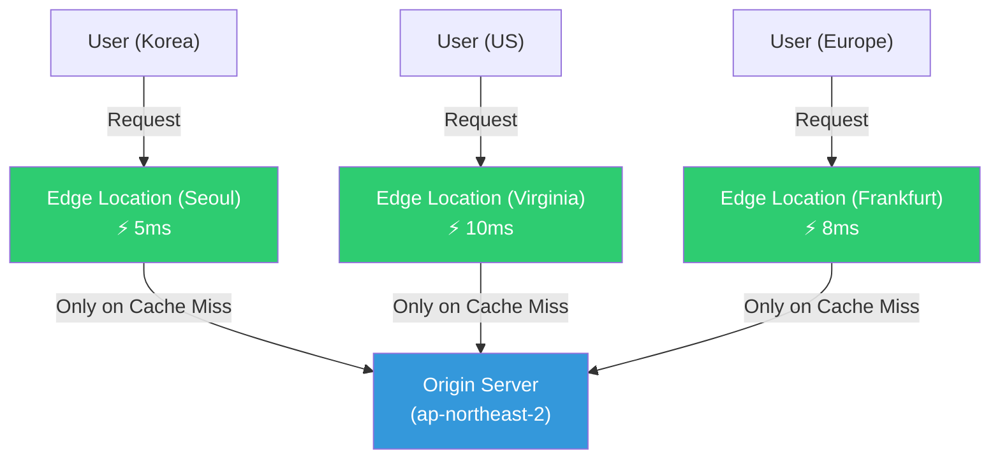
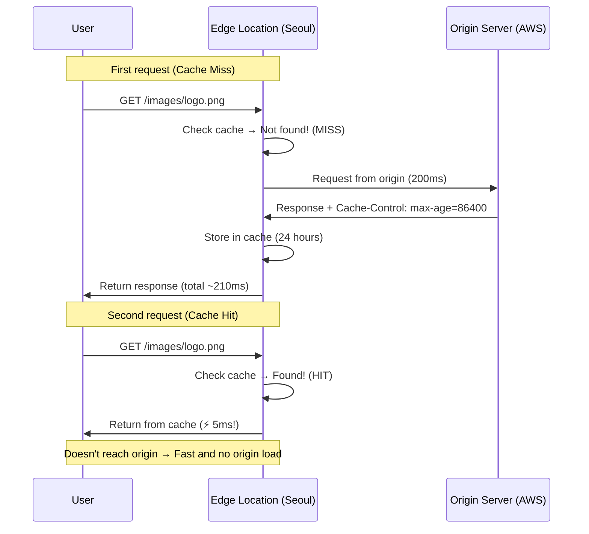
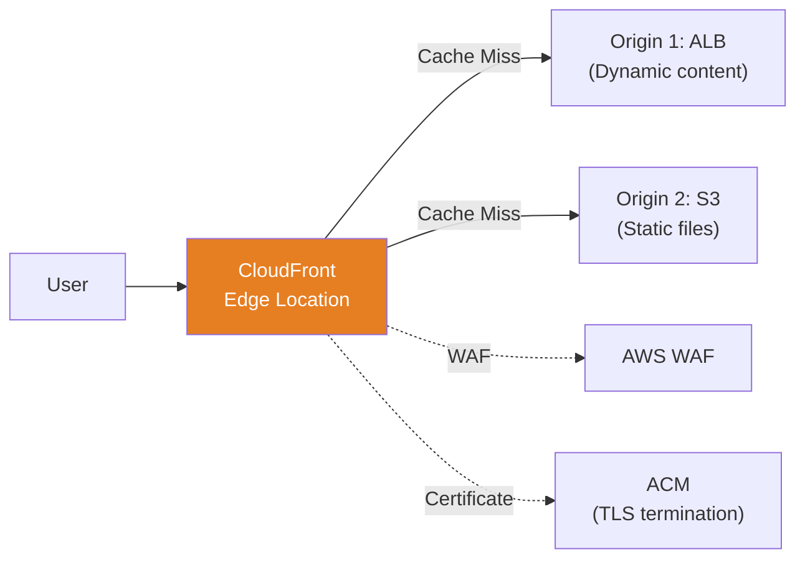
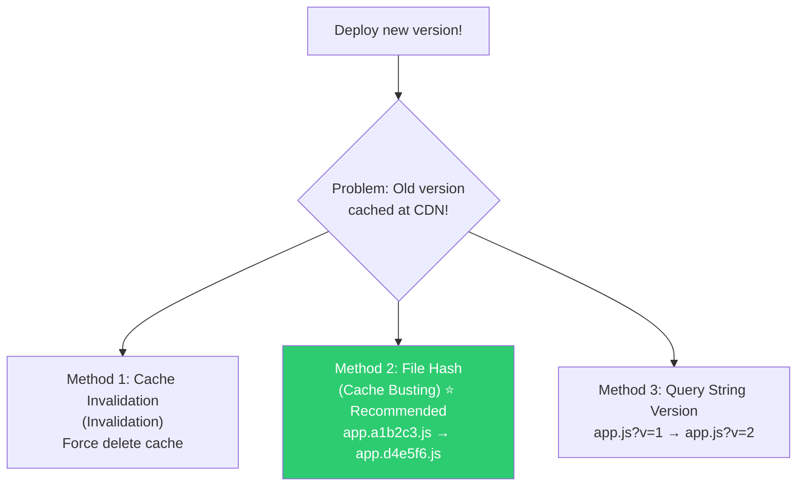

# CDN (CloudFront / Cloudflare / Edge Caching)

> When a Korean user downloads an image from a US server, it takes 200ms. But with CDN, they can get it from the Seoul edge in 5ms. CDN is a **distributed cache network** for fast global content delivery. It impacts performance, cost, and security — it's critical infrastructure.

---

## 🎯 Why Do You Need to Know This?

```
Real-world CDN responsibilities:
• Improve static file (image, JS, CSS) delivery speed      → CDN caching
• "I updated the image but see the old one"       → Cache invalidation
• Cache API responses to reduce origin load          → Dynamic caching strategy
• DDoS defense + WAF                              → Block at CDN edge
• HTTPS certificate management                    → TLS termination at CDN
• Consistent speed for global users                 → Leverage edge locations
• CDN cost optimization                              → Improve cache hit rate
```

---

## 🧠 Core Concepts

### Analogy: Convenience Store Distribution System

Let me compare CDN to a **convenience store network**.

* **Origin server** = Central factory/warehouse. Where all content originates.
* **Edge Location (PoP)** = Neighborhood convenience store. Popular products pre-stocked.
* **CDN cache** = Store shelves. Frequently-sold items displayed ready.
* **Cache Miss** = Item not in store. Must fetch from central warehouse (slow).
* **Cache Hit** = Item in store. Deliver immediately (fast!).
* **TTL** = Product shelf life. After expiration, replace with new stock.
* **Cache Invalidation** = Recall. "Pull all these products and replace with new ones!"



### CDN Operation Flow



---

## 🔍 Detailed Explanation — CDN Caching Principles

### Cache-Control Header (★ Critical!)

The origin server's response headers determine **what and how long** the CDN caches.

```bash
# Response header from origin:
# Cache-Control: public, max-age=86400
#                ^^^^^^  ^^^^^^^^^^^^^
#                Who cache? How long?

# === Cache-Control Directives ===

# public — Both CDN and browser can cache
# Cache-Control: public, max-age=3600
# → Cache at CDN edge and in browser

# private — Only browser can cache (not CDN)
# Cache-Control: private, max-age=3600
# → User personal data (profile page, etc.)

# no-cache — Cache but revalidate with origin each time
# Cache-Control: no-cache
# → "Is this still valid?" If 304 Not Modified, use cache

# no-store — Never cache
# Cache-Control: no-store
# → Sensitive data (payment info, etc.)

# max-age=N — Cache for N seconds
# Cache-Control: max-age=86400    # 24 hours

# s-maxage=N — Cache time at CDN (shared cache), overrides max-age
# Cache-Control: public, max-age=3600, s-maxage=86400
# → Browser: 1 hour cache, CDN: 24 hour cache

# immutable — Content never changes (hashed files)
# Cache-Control: public, max-age=31536000, immutable
# → Use for hashed files like app.a1b2c3d4.js
```

```bash
# Caching strategy by content type (real-world recommendations)

# === Static Files (Never change) ===
# JS/CSS (with hash): app.a1b2c3.js
# Cache-Control: public, max-age=31536000, immutable
# → 1 year cache! File changes = new hash = new URL

# Images:
# Cache-Control: public, max-age=86400
# → 24 hour cache

# Fonts:
# Cache-Control: public, max-age=2592000
# → 30 day cache

# === Dynamic Content ===
# API response (public data, rarely changes):
# Cache-Control: public, max-age=60, s-maxage=300
# → Browser 1 min, CDN 5 min

# API response (personal data):
# Cache-Control: private, no-cache
# → Don't cache at CDN, browser revalidates

# Login/payment sensitive data:
# Cache-Control: no-store
# → Never cache
```

### Cache Key (Cache Key)

The "key" used by CDN to find requests in cache.

```bash
# Default cache key: URL (host + path + query string)
# https://cdn.example.com/images/logo.png?v=2

# Same URL → Same cache
# Different URL → Cache miss → Request origin

# ⚠️ Unnecessary different query strings prevent caching!
# /images/logo.png?tracking=abc123  → Cache 1
# /images/logo.png?tracking=def456  → Cache 2 (same image, separate cache!)

# → CloudFront: Setting to exclude query strings from cache key
# → Exclude "tracking" param, include only "v" param

# What can be included in cache key:
# - URL (default)
# - Query string (optional)
# - Headers (Accept-Encoding, Accept-Language, etc.)
# - Cookies (optional, be careful!)
```

### Cache Hit Ratio (Cache Hit Ratio)

The most important CDN metric. Higher is better.

```bash
# Cache hit ratio = Cache Hit / (Cache Hit + Cache Miss) × 100%

# Real-world targets:
# Static files: 95%+ (images, JS, CSS)
# Dynamic API: 50~80% (cacheable APIs)
# Overall: 80%+ (well-configured CDN)

# Low cache hit ratio means:
# → Many requests to origin → High origin load + slow responses
# → High CDN cost (data transfer from origin)

# Check methods (curl):
curl -I https://cdn.example.com/images/logo.png
# X-Cache: Hit from cloudfront        ← HIT! ✅
# X-Cache: Miss from cloudfront       ← MISS ❌

# Or:
# X-Cache: Hit
# CF-Cache-Status: HIT               ← Cloudflare
# Age: 3600                           ← Cached 3600 seconds ago

# Repeated test:
for i in $(seq 1 5); do
    status=$(curl -sI https://cdn.example.com/images/logo.png | grep -i "x-cache\|cf-cache" | head -1)
    echo "Request $i: $status"
done
# Request 1: X-Cache: Miss from cloudfront   ← First request is MISS
# Request 2: X-Cache: Hit from cloudfront    ← Subsequent requests HIT!
# Request 3: X-Cache: Hit from cloudfront
# Request 4: X-Cache: Hit from cloudfront
# Request 5: X-Cache: Hit from cloudfront
```

---

## 🔍 Detailed Explanation — AWS CloudFront

### CloudFront Architecture



### CloudFront Configuration Essentials

```bash
# === Create CloudFront Distribution (Key Settings) ===

# 1. Origin Settings
# S3 Origin (static files):
#   Origin Domain: my-bucket.s3.amazonaws.com
#   Origin Access: OAC (Origin Access Control) ← Block direct S3 access, only CF
#   Origin Shield: ap-northeast-2 (Add caching layer before origin)

# ALB Origin (dynamic API):
#   Origin Domain: my-alb-123.ap-northeast-2.elb.amazonaws.com
#   Protocol: HTTPS only
#   Origin Keepalive Timeout: 60s

# 2. Cache Behaviors (Behavior) Settings

# /static/* → S3 origin
#   Cache Policy: CachingOptimized (Maximize TTL)
#   → Cache static files long

# /api/* → ALB origin
#   Cache Policy: CachingDisabled (No caching)
#   Origin Request Policy: AllViewer (Forward all headers to origin)
#   → Don't cache API, forward to origin

# Default (*) → ALB origin
#   Cache Policy: CachingOptimizedForUncompressedObjects
#   → Cache HTML and rest appropriately

# 3. TLS/Certificate Settings
#   Certificate: ACM certificate (Issue from us-east-1!) ← CloudFront only supports us-east-1!
#   Minimum Protocol Version: TLSv1.2_2021
#   HTTP to HTTPS: Redirect

# 4. Attach WAF
#   Web ACL: myapp-waf (see ./09-network-security)

# 5. Price Class
#   Price Class: PriceClass_200 (Most regions)
#   Or PriceClass_All (All edge locations, most expensive)
#   Or PriceClass_100 (US+Europe only, cheapest)
```

```bash
# CloudFront CLI Examples

# List distributions
aws cloudfront list-distributions --query "DistributionList.Items[*].[Id,DomainName,Status]" --output table
# ┌──────────────┬───────────────────────────────────┬──────────┐
# │ E1234ABCDEF  │ d123abc.cloudfront.net            │ Deployed │
# └──────────────┴───────────────────────────────────┴──────────┘

# Create cache invalidation
aws cloudfront create-invalidation \
    --distribution-id E1234ABCDEF \
    --paths "/images/logo.png" "/css/*"
# {
#     "Invalidation": {
#         "Id": "I1234567890",
#         "Status": "InProgress",
#         "CreateTime": "2025-03-12T10:00:00.000Z"
#     }
# }

# Check invalidation status
aws cloudfront get-invalidation --distribution-id E1234ABCDEF --id I1234567890
# "Status": "Completed"

# ⚠️ Invalidation cost:
# First 1,000 paths per month: Free
# Beyond: $0.005 per path
# → /* (invalidate all) counts as 1 path

# ⚠️ Version hash is better than invalidation!
# /app.js?v=1 → /app.js?v=2   (query string version)
# /app.a1b2c3.js → /app.d4e5f6.js  (filename hash, ⭐ best)
# → Instant new version without invalidation!
```

### S3 + CloudFront Static Hosting (Most Common Pattern)

```bash
# Pattern for hosting React/Vue apps with S3 + CloudFront

# 1. Create S3 bucket (block public access!)
aws s3 mb s3://myapp-frontend-prod
aws s3api put-public-access-block --bucket myapp-frontend-prod \
    --public-access-block-configuration BlockPublicAcls=true,IgnorePublicAcls=true,BlockPublicPolicy=true,RestrictPublicBuckets=true

# 2. Upload build files
npm run build
aws s3 sync build/ s3://myapp-frontend-prod/ \
    --cache-control "public, max-age=31536000, immutable" \
    --exclude "index.html"

# Upload index.html with short cache (immediate new deployment)
aws s3 cp build/index.html s3://myapp-frontend-prod/ \
    --cache-control "public, max-age=0, must-revalidate"

# 3. Create CloudFront Distribution → S3 as origin
# Use OAC to block direct S3 access (CloudFront only!)

# 4. Connect domain with Route53
# app.example.com → CloudFront Distribution (Alias)

# 5. Deployment process
npm run build
aws s3 sync build/ s3://myapp-frontend-prod/ --delete
aws cloudfront create-invalidation --distribution-id E1234 --paths "/index.html"
# → Invalidate only index.html! JS/CSS auto-update via hash
```

---

## 🔍 Detailed Explanation — Cloudflare

### Cloudflare vs CloudFront

| Item | CloudFront | Cloudflare |
|------|-----------|------------|
| Type | CDN (AWS service) | CDN + DNS + Security all-in-one |
| Setup | AWS console/CLI, complex | Dashboard, simple |
| DNS Management | Separate (Route53) | Built-in (NS to Cloudflare) |
| WAF | Separate (AWS WAF integration) | Built-in (included by default) |
| DDoS Defense | Shield (separate) | Built-in (free tier included!) |
| Free Plan | ❌ | ✅ (small scale OK) |
| AWS Integration | ⭐ Native | ❌ (external service) |
| Pricing | Usage-based (complex) | Plan-based (predictable) |
| Recommended | AWS all-in environment | Fast setup, all-in-one |

```bash
# Cloudflare setup flow:

# 1. Register domain at Cloudflare (change NS records)
# → Change NS at domain registrar to Cloudflare
# → Cloudflare manages DNS + CDN + security

# 2. Register origin server
# → A record: api.example.com → 10.0.1.50 (enable proxy ☁️)
# → Enable proxy = Route through Cloudflare CDN/security

# 3. Set SSL mode
# - Off: No encryption (❌)
# - Flexible: User→CF HTTPS, CF→origin HTTP (⚠️)
# - Full: User→CF HTTPS, CF→origin HTTPS (self-signed OK)
# - Full (Strict): User→CF HTTPS, CF→origin HTTPS (valid cert required) ← ⭐ Recommended!

# 4. Cache settings
# Use Page Rules or Cache Rules for per-path caching policy

# 5. Security settings
# WAF rules, DDoS defense, Bot management → Click in dashboard!

# Check Cloudflare cache status
curl -I https://example.com/images/logo.png
# CF-Cache-Status: HIT       ← Cache hit!
# CF-Ray: abc123-ICN          ← Responded from Seoul edge
# Age: 1800                   ← Cached 30 min ago
```

### Cloudflare Special Features

```bash
# 1. Argo Smart Routing (Paid)
# → Select optimal path via Cloudflare internal network
# → Reach origin 30~40% faster

# 2. Workers (Serverless edge computing)
# → Run JavaScript at edge
# → A/B testing, URL rewrite, auth at edge!

# 3. R2 (S3-compatible object storage)
# → No transfer cost! (egress free)
# → S3 API compatible

# 4. Turnstile (CAPTCHA replacement)
# → User-friendly bot defense

# 5. Zero Trust (Cloudflare Access)
# → Zero Trust access instead of VPN (see ./09-network-security)
```

---

## 🔍 Detailed Explanation — Cache Invalidation Strategy

### Solving Cache Issues at Deployment



```bash
# === Method 1: Cache Invalidation ===
# CloudFront:
aws cloudfront create-invalidation --distribution-id E1234 --paths "/*"
# → Delete all cache (takes minutes to propagate)

# Cloudflare:
# Dashboard → Caching → Configuration → Purge Everything
# Or via API:
curl -X POST "https://api.cloudflare.com/client/v4/zones/ZONE_ID/purge_cache" \
    -H "Authorization: Bearer API_TOKEN" \
    -H "Content-Type: application/json" \
    --data '{"purge_everything":true}'

# Purge specific files only:
curl -X POST "https://api.cloudflare.com/client/v4/zones/ZONE_ID/purge_cache" \
    -H "Authorization: Bearer API_TOKEN" \
    --data '{"files":["https://example.com/app.js","https://example.com/style.css"]}'

# ⚠️ Invalidation downsides:
# - Takes time to propagate globally (seconds to minutes)
# - Frequent invalidation defeats CDN purpose
# - Costs (CloudFront: $0.005/path beyond 1000/month)

# === Method 2: File Hash (⭐ Best Method) ===
# Build tools (Webpack, Vite) auto-add hashes
# app.js → app.a1b2c3d4.js
# style.css → style.e5f6g7h8.css

# Reference new hash files in index.html:
# <script src="/app.a1b2c3d4.js"></script>
# <link href="/style.e5f6g7h8.css" rel="stylesheet">

# → File content changes = hash changes = completely new URL
# → CDN treats as cache miss = fetches from origin
# → No invalidation needed!

# But keep index.html short-cached or no-cache:
# Cache-Control: no-cache
# → Browser always fetches latest index.html
# → index.html references new hash JS/CSS

# === Method 3: Query String Version ===
# app.js?v=1 → app.js?v=2
# ⚠️ Some CDNs may ignore query strings in cache key
# → File hash is more reliable
```

---

## 💻 Practice Examples

### Example 1: Check Cache Headers

```bash
# Observe caching settings of various sites

for url in \
    "https://www.google.com" \
    "https://cdnjs.cloudflare.com/ajax/libs/lodash.js/4.17.21/lodash.min.js" \
    "https://fonts.googleapis.com/css2?family=Roboto"; do
    echo "=== $url ==="
    curl -sI "$url" | grep -iE "cache-control|x-cache|cf-cache|age|expires|cdn" | head -5
    echo ""
done

# === https://www.google.com ===
# cache-control: private, max-age=0           ← No cache (dynamic)
#
# === https://cdnjs.cloudflare.com/... ===
# cache-control: public, max-age=30672000     ← 1 year cache! (static library)
# cf-cache-status: HIT                        ← Cloudflare cache hit
# age: 500000
#
# === https://fonts.googleapis.com/... ===
# cache-control: private, max-age=86400       ← 24 hour, private
```

### Example 2: Observe Cache Hit/Miss

```bash
# On a site with CloudFront or Cloudflare

# First request (expect MISS)
curl -sI https://cdn.example.com/test-image.png | grep -i "x-cache\|cf-cache"
# X-Cache: Miss from cloudfront    ← MISS!

# Second request (expect HIT)
curl -sI https://cdn.example.com/test-image.png | grep -i "x-cache\|cf-cache"
# X-Cache: Hit from cloudfront     ← HIT!

# Check Age header to see cache age
curl -sI https://cdn.example.com/test-image.png | grep -i "age"
# Age: 5    ← Cached 5 seconds ago

# Check again after 10 seconds:
sleep 10
curl -sI https://cdn.example.com/test-image.png | grep -i "age"
# Age: 15   ← Cached 15 seconds ago (same cache!)
```

### Example 3: Compare Response Time (With/Without CDN)

```bash
# Response time through CDN
curl -o /dev/null -s -w "CDN:  DNS=%{time_namelookup}s TCP=%{time_connect}s TTFB=%{time_starttransfer}s Total=%{time_total}s\n" \
    https://cdn.example.com/images/large-image.jpg

# Response time directly from origin (no CDN)
curl -o /dev/null -s -w "Direct: DNS=%{time_namelookup}s TCP=%{time_connect}s TTFB=%{time_starttransfer}s Total=%{time_total}s\n" \
    https://origin.example.com/images/large-image.jpg

# Expected results:
# CDN:  DNS=0.005s TCP=0.010s TTFB=0.015s Total=0.050s    ← Fast!
# Direct: DNS=0.010s TCP=0.150s TTFB=0.300s Total=0.800s    ← Slow!
```

### Example 4: Set Cache Headers in Nginx

```bash
# Add cache headers in Nginx (CDN reads these to cache)

cat << 'NGINX' | sudo tee /etc/nginx/conf.d/cache-headers.conf
server {
    listen 80;

    # JS/CSS (with hashed filename) → 1 year cache
    location ~* \.[0-9a-f]{8,}\.(js|css)$ {
        root /var/www/myapp;
        add_header Cache-Control "public, max-age=31536000, immutable";
    }

    # Images → 7 day cache
    location ~* \.(jpg|jpeg|png|gif|ico|svg|webp)$ {
        root /var/www/myapp;
        add_header Cache-Control "public, max-age=604800";
    }

    # Fonts → 30 day cache
    location ~* \.(woff|woff2|ttf|eot)$ {
        root /var/www/myapp;
        add_header Cache-Control "public, max-age=2592000";
        add_header Access-Control-Allow-Origin "*";
    }

    # HTML → No cache (always latest)
    location ~* \.html$ {
        root /var/www/myapp;
        add_header Cache-Control "no-cache";
    }

    # API → No cache
    location /api/ {
        proxy_pass http://backend;
        add_header Cache-Control "no-store";
    }
}
NGINX

sudo nginx -t && sudo systemctl reload nginx
```

---

## 🏢 In Real-World Practice

### Scenario 1: "I Updated the Image but See the Old One"

```bash
# Cause: Old image cached at CDN

# 1. Check current cache status
curl -sI https://cdn.example.com/images/logo.png | grep -iE "x-cache|age|cache-control"
# X-Cache: Hit from cloudfront
# Age: 50000                         ← Cached 50000 seconds ago! (14 hours)
# Cache-Control: public, max-age=86400  ← 24 hour cache

# 2. Quick fix: Invalidate cache
aws cloudfront create-invalidation \
    --distribution-id E1234ABCDEF \
    --paths "/images/logo.png"

# 3. Verify invalidation complete (1~2 min)
curl -sI https://cdn.example.com/images/logo.png | grep -i "x-cache"
# X-Cache: Miss from cloudfront     ← Fetches new version!

# 4. Root fix: Version management
# /images/logo.png → /images/logo.v2.png
# Or /images/logo.png?v=20250312
# → Instant without invalidation!

# 5. Better fix: Automate hash in build pipeline
# CI/CD automatically includes hash in filename when uploading
# logo.a1b2c3d4.png → Referenced in HTML
```

### Scenario 2: CDN Cost Optimization

```bash
# "CloudFront costs $500/month. Can we reduce it?"

# 1. Check cache hit ratio
# CloudWatch → CloudFront metrics → CacheHitRate
# 60%? → Too low! Need to improve cache settings

# 2. Methods to improve cache hit ratio:

# a. Increase static file TTL
# Cache-Control: max-age=86400 → max-age=2592000 (30 days)
# → Fetch same file from origin less frequently

# b. Remove unnecessary query strings
# CloudFront Cache Policy: Query Strings = "None"
# → Prevent tracking=abc123 type params from fragmenting cache

# c. Remove unnecessary headers from cache key
# Prevent Accept-Language, Cookie etc. fragmenting cache

# d. Enable Origin Shield
# → Edge → Origin Shield → origin (additional cache layer)
# → Reduces origin request frequency

# 3. Reduce data transfer
# a. Enable gzip/Brotli compression
# → CloudFront auto-compress
# → Reduce transfer bytes 60~80%

# b. Image optimization (WebP, AVIF)
# → CloudFront Functions for Accept header-based format conversion
# → Or Cloudflare Polish, AWS CloudFront + Lambda@Edge

# c. Clean up unnecessary large files
# → Find large files in S3
aws s3 ls s3://my-bucket/ --recursive --human-readable --summarize | sort -k3 -rh | head -20

# 4. Adjust price class
# PriceClass_All → PriceClass_200 → PriceClass_100
# → If few Asia/Latin America users, PriceClass_100 (US+Europe) is enough
```

### Scenario 3: Automate CDN Deployment in CI/CD

```bash
#!/bin/bash
# deploy-frontend.sh — Automate S3 + CloudFront deployment

set -euo pipefail

S3_BUCKET="myapp-frontend-prod"
CF_DISTRIBUTION="E1234ABCDEF"
BUILD_DIR="build"

echo "=== 1. Build ==="
npm ci
npm run build

echo "=== 2. Upload static files (long cache) ==="
aws s3 sync "$BUILD_DIR/" "s3://$S3_BUCKET/" \
    --cache-control "public, max-age=31536000, immutable" \
    --exclude "index.html" \
    --exclude "*.map" \
    --delete

echo "=== 3. Upload index.html (short cache) ==="
aws s3 cp "$BUILD_DIR/index.html" "s3://$S3_BUCKET/index.html" \
    --cache-control "no-cache"

echo "=== 4. Invalidate CDN cache (index.html only) ==="
aws cloudfront create-invalidation \
    --distribution-id "$CF_DISTRIBUTION" \
    --paths "/index.html" \
    --query 'Invalidation.Id' \
    --output text

echo "=== Deployment complete! ==="
echo "URL: https://app.example.com"
```

---

## ⚠️ Common Mistakes

### 1. Use Cache Invalidation (Purge All) for Everything

```bash
# ❌ Invalidate /* on every deployment
aws cloudfront create-invalidation --distribution-id E1234 --paths "/*"
# → Delete all cache → Next requests all Cache Miss → Origin load spikes!

# ✅ Use file hash → No invalidation needed
# Invalidate only index.html (rest auto-update via hash)
aws cloudfront create-invalidation --distribution-id E1234 --paths "/index.html"
```

### 2. Don't Cache API Responses

```bash
# ❌ All APIs with Cache-Control: no-store
# → Every request goes to origin → High load, slow

# ✅ Public data can be cached!
# Category lists, product lists, exchange rates (rarely change):
# Cache-Control: public, s-maxage=300    ← CDN caches 5 min
# → Origin request only once per 5 min!
```

### 3. Include Cookies in Cache Key

```bash
# ❌ Forward all cookies + include in cache key at CloudFront
# → Cookie different per user → No caching at all!
# → session_id=abc → Cache 1, session_id=def → Cache 2, ...

# ✅ Don't forward cookies for static file paths
# /static/* → Forward Cookies: None
# /api/* → Forward Cookies: All (only when needed)
```

### 4. Issue CloudFront ACM Certificate in Wrong Region

```bash
# ❌ Issue ACM certificate in ap-northeast-2 (Seoul)
# → Can't use with CloudFront!

# ✅ CloudFront certificates must be in us-east-1 (Virginia)!
aws acm request-certificate \
    --domain-name "cdn.example.com" \
    --region us-east-1              # ← Must be us-east-1!
```

### 5. Make S3 Bucket Public

```bash
# ❌ Make S3 public for direct access
# → Bypass CDN, increased cost, security risk

# ✅ Use OAC (Origin Access Control) for CloudFront only
# → Block direct S3 access
# → Users must go through CloudFront
# → Maximize CDN cache usage + improve security
```

---

## 📝 Summary

### Cache-Control Quick Reference

```
Static files (hashed): public, max-age=31536000, immutable    (1 year)
Images:          public, max-age=86400                   (1 day)
Fonts:            public, max-age=2592000                 (30 days)
HTML:            no-cache                                (always revalidate)
Public API:        public, s-maxage=300                    (CDN 5 min)
Personal data:     private, no-cache
Sensitive data:     no-store
```

### CDN Selection Guide

```
AWS all-in, fine control    → CloudFront
Fast setup, all-in-one, free → Cloudflare
Multi-cloud, high performance → Fastly
China users                   → Alibaba CDN + ICP beian
```

### CDN Checklist

```
✅ Appropriate Cache-Control headers on static files
✅ Use filename hash (minimize invalidation)
✅ index.html with no-cache
✅ Exclude unnecessary query strings/cookies from cache key
✅ Enable gzip/Brotli compression
✅ Force HTTPS + HSTS
✅ Attach WAF
✅ Monitor cache hit ratio (target 80%+)
✅ Block direct S3 access with OAC
✅ Issue CloudFront ACM from us-east-1
```

### Debugging Commands

```bash
# Check cache status
curl -sI URL | grep -iE "x-cache|cf-cache|cache-control|age"

# Measure response time
curl -o /dev/null -s -w "TTFB:%{time_starttransfer}s Total:%{time_total}s\n" URL

# Create CloudFront invalidation
aws cloudfront create-invalidation --distribution-id ID --paths "/path"
```

---

## 🔗 Next Lecture

Next is **[12-service-discovery](./12-service-discovery)** — Service Discovery (CoreDNS / Consul / Internal DNS).

How do microservices find each other? — Learn how services communicate by name in Kubernetes, CoreDNS, and service discovery tools like Consul.
