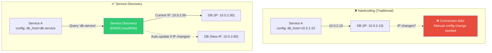
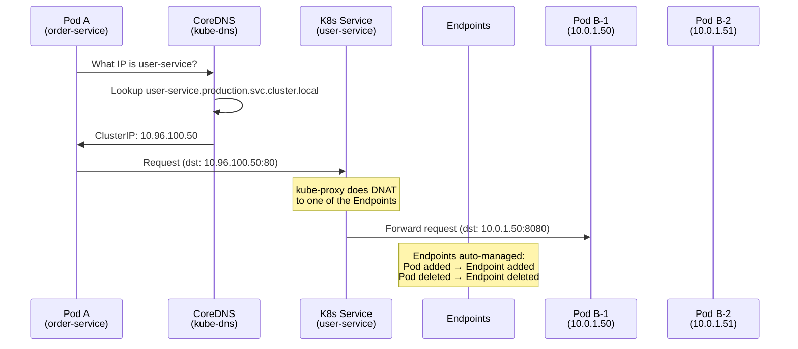
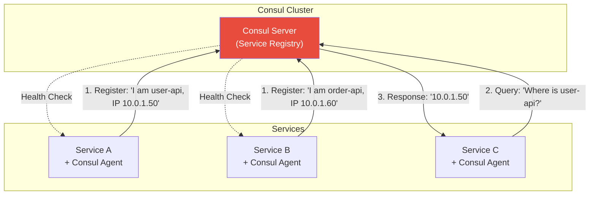
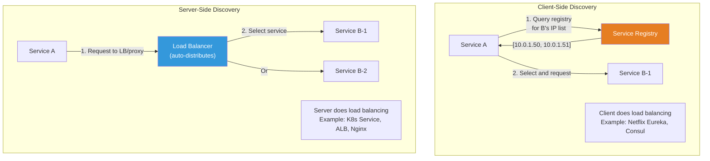
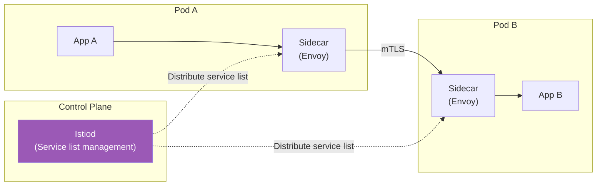

# Service Discovery (CoreDNS / Consul / Internal DNS)

> When microservices grow from 10 to 50 to 200, "how does service A find service B?" becomes a big problem. In container environments where IPs change frequently, it's even worse. Service Discovery is a system that lets services **automatically** find each other.

---

## 🎯 Why Do You Need to Know This?

```
Real-world moments when Service Discovery is critical:
• In K8s, "http://user-service:8080" access → How does it work?
• Pod restarts change IP → How do other services find it?
• Services grow from 3 to 30 → Can't hardcode IP in config!
• Services scale out → How to broadcast new instances?
• Service dies → Auto-remove from discovery list?
```

From the [DNS lecture](./03-dns) you learned domain→IP mapping. Service Discovery is **internal DNS between services**. It naturally connects with the [load balancing lecture](./06-load-balancing) and health checks.

---

## 🧠 Core Concepts

### Analogy: Company Internal Phone Directory

Let me compare Service Discovery to a **company internal phone directory**.

* **Fixed IP (hardcoding)** = Manually update directory every time employee desk changes. Impossible with 1000 employees!
* **Service Discovery** = Auto-updating digital directory. Employee moves desk (Pod restart) → number auto-updates. Employee leaves (service down) → auto-delete.
* **DNS-based** = Search by name. "John Dev" search → extension 1234.
* **Service Registry** = Directory database. Manages name, IP, port, status of all services.

### Why Service Discovery is Needed



---

## 🔍 Detailed Explanation — Kubernetes Service Discovery (★ Most Important!)

### K8s Service and DNS

When you create a Service in Kubernetes, **DNS records are created automatically**. This is the core of K8s service discovery.

```yaml
# Create Service
apiVersion: v1
kind: Service
metadata:
  name: user-service          # ← This becomes the DNS name!
  namespace: production
spec:
  selector:
    app: user-api
  ports:
    - port: 80
      targetPort: 8080
```

```bash
# Service automatically creates DNS:

# From same namespace:
curl http://user-service:80
# → CoreDNS resolves user-service to ClusterIP(10.96.x.x)

# From different namespace:
curl http://user-service.production:80
# → Explicitly specify namespace

# FQDN (Fully Qualified Domain Name):
curl http://user-service.production.svc.cluster.local:80
# → Complete domain name

# DNS format:
# <service-name>.<namespace>.svc.cluster.local
#  ^^^^^^^^^^^^   ^^^^^^^^^  ^^^  ^^^^^^^^^^^^^
#  Service name   Namespace  Service cluster domain
```

### K8s DNS Resolution Process



```bash
# Check DNS inside Pod
kubectl run test --image=busybox --rm -it --restart=Never -- nslookup user-service
# Server:    10.96.0.10           ← CoreDNS service IP
# Address 1: 10.96.0.10 kube-dns.kube-system.svc.cluster.local
#
# Name:      user-service
# Address 1: 10.96.100.50 user-service.production.svc.cluster.local
#                          ← ClusterIP

# Check Service Endpoints (actual Pod IP list)
kubectl get endpoints user-service -n production
# NAME           ENDPOINTS                           AGE
# user-service   10.0.1.50:8080,10.0.1.51:8080      5d
#                ^^^^^^^^^^^^^^  ^^^^^^^^^^^^^^
#                Pod B-1 IP     Pod B-2 IP

# When Pod dies, auto-removed from Endpoints!
# When Pod starts, auto-added to Endpoints!

# Service types and DNS:

# ClusterIP (default): Access only within cluster
# → user-service.production.svc.cluster.local → 10.96.100.50

# Headless Service (clusterIP: None): Return Pod IP directly
# → user-service.production.svc.cluster.local → 10.0.1.50, 10.0.1.51
# → Use for StatefulSet individual Pod access
# → user-service-0.user-service.production.svc.cluster.local → 10.0.1.50
```

### Pod DNS Configuration

```bash
# Check DNS config inside Pod
kubectl exec -it my-pod -- cat /etc/resolv.conf
# nameserver 10.96.0.10                              ← CoreDNS
# search production.svc.cluster.local svc.cluster.local cluster.local
# options ndots:5

# Search domain order:
# When querying "user-service":
# 1. user-service.production.svc.cluster.local  ← Same namespace first
# 2. user-service.svc.cluster.local
# 3. user-service.cluster.local
# 4. user-service.                              ← External DNS

# ndots:5 means:
# If domain has <5 dots, try with search domains
# "user-service" (0 dots) → try search order
# "api.external.com" (2 dots, <5) → try search order then external DNS
# "api.external.com." (trailing dot) → external DNS direct (skip search)

# ⚠️ ndots:5 causes many unnecessary DNS queries for external domains!
# "google.com" → Try google.com.production.svc.cluster.local (fail)
#               → Try google.com.svc.cluster.local (fail)
#               → Try google.com.cluster.local (fail)
#               → Finally try google.com (success)
# → Total 4 queries! Slow!

# Optimization: Add trailing dot(.) for external domains
# curl http://api.external.com./v1/data    ← Trailing dot! → Direct external DNS
```

---

## 🔍 Detailed Explanation — CoreDNS

### What is CoreDNS?

Kubernetes's default DNS server. Resolves internal service names to IPs.

```bash
# Check CoreDNS Pods
kubectl get pods -n kube-system -l k8s-app=kube-dns
# NAME                       READY   STATUS    RESTARTS   AGE
# coredns-5644d7b6d9-abc12   1/1     Running   0          30d
# coredns-5644d7b6d9-def34   1/1     Running   0          30d
# → Usually 2 (high availability)

# Check CoreDNS Service
kubectl get svc -n kube-system kube-dns
# NAME       TYPE        CLUSTER-IP   EXTERNAL-IP   PORT(S)
# kube-dns   ClusterIP   10.96.0.10   <none>        53/UDP,53/TCP

# Check CoreDNS logs
kubectl logs -n kube-system -l k8s-app=kube-dns --tail=20
# [INFO] 10.0.1.50:42000 - 12345 "A IN user-service.production.svc.cluster.local. udp ..." NOERROR
# → Pod 10.0.1.50 queried user-service
```

### CoreDNS Configuration (Corefile)

```bash
kubectl get configmap coredns -n kube-system -o yaml
```

```yaml
# CoreDNS Corefile
apiVersion: v1
kind: ConfigMap
metadata:
  name: coredns
  namespace: kube-system
data:
  Corefile: |
    .:53 {
        errors                        # Error logging
        health {                      # Health check endpoint
            lameduck 5s
        }
        ready                         # Readiness probe

        kubernetes cluster.local in-addr.arpa ip6.arpa {
            pods insecure              # Pod DNS records
            fallthrough in-addr.arpa ip6.arpa
            ttl 30                     # DNS cache TTL 30 seconds
        }

        prometheus :9153              # Metrics endpoint

        forward . /etc/resolv.conf {  # Forward external DNS
            max_concurrent 1000
        }

        cache 30                      # DNS cache 30 seconds
        loop                          # Loop detection
        reload                        # Auto-reload config
        loadbalance                   # Round-robin
    }
```

### CoreDNS Custom Configuration

```bash
# Forward internal domain to specific DNS server

# Example: *.corp.mycompany.com → corporate DNS (10.0.0.2)
kubectl edit configmap coredns -n kube-system
```

```yaml
# Add to Corefile:
data:
  Corefile: |
    # Corporate domain to corporate DNS
    corp.mycompany.com:53 {
        errors
        cache 30
        forward . 10.0.0.2
    }

    # Default setting (cluster.local + external)
    .:53 {
        errors
        health
        kubernetes cluster.local in-addr.arpa ip6.arpa {
            pods insecure
            fallthrough in-addr.arpa ip6.arpa
            ttl 30
        }
        forward . /etc/resolv.conf
        cache 30
        reload
        loadbalance
    }
```

```bash
# Apply and restart (reload plugin auto-restarts, but let's be safe)
kubectl rollout restart deployment coredns -n kube-system

# Test
kubectl run test --image=busybox --rm -it --restart=Never -- nslookup internal-api.corp.mycompany.com
# Address: 10.100.50.20    ← Resolved from corporate DNS!
```

### CoreDNS Troubleshooting

```bash
# "DNS doesn't work!" — Most common K8s networking issue

# 1. Check CoreDNS Pods are alive
kubectl get pods -n kube-system -l k8s-app=kube-dns
# Both must be Running!

# 2. Check kube-dns Service exists
kubectl get svc -n kube-system kube-dns
# ClusterIP: 10.96.0.10

# 3. Test DNS from Pod
kubectl run test --image=busybox --rm -it --restart=Never -- nslookup kubernetes
# Success: Address: 10.96.0.1
# Fail: ** server can't find kubernetes: NXDOMAIN

# 4. Check CoreDNS logs
kubectl logs -n kube-system -l k8s-app=kube-dns --tail=50
# Look for error messages

# 5. Query CoreDNS directly
kubectl run test --image=busybox --rm -it --restart=Never -- \
    nslookup user-service.production.svc.cluster.local 10.96.0.10
# → Query CoreDNS IP directly

# 6. Test external DNS resolution
kubectl run test --image=busybox --rm -it --restart=Never -- nslookup google.com
# Fail: Issue with CoreDNS forward config or node DNS

# Common causes:
# a. CoreDNS Pod down
# b. kube-dns Service missing or wrong IP
# c. Pod /etc/resolv.conf incorrect
# d. NetworkPolicy blocking DNS (port 53)
# e. Node /etc/resolv.conf missing external DNS
```

---

## 🔍 Detailed Explanation — Consul

### What is Consul?

HashiCorp's Service Discovery + Configuration Management + Service Mesh tool. Can be used outside K8s (VMs, bare metal).



```bash
# Register service with Consul
# /etc/consul.d/user-api.json
{
  "service": {
    "name": "user-api",
    "port": 8080,
    "tags": ["v1", "production"],
    "check": {
      "http": "http://localhost:8080/health",
      "interval": "10s",
      "timeout": "3s"
    }
  }
}

# Query service (DNS)
dig @127.0.0.1 -p 8600 user-api.service.consul +short
# 10.0.1.50
# 10.0.1.51    ← Multiple instances

# Query service (HTTP API)
curl http://localhost:8500/v1/catalog/service/user-api
# [
#   {
#     "ServiceName": "user-api",
#     "ServiceAddress": "10.0.1.50",
#     "ServicePort": 8080,
#     "ServiceTags": ["v1", "production"]
#   },
#   {
#     "ServiceName": "user-api",
#     "ServiceAddress": "10.0.1.51",
#     "ServicePort": 8080,
#     "ServiceTags": ["v1", "production"]
#   }
# ]

# Query only healthy services
curl http://localhost:8500/v1/health/service/user-api?passing=true
```

### K8s vs Consul Service Discovery

| Item | K8s Service + CoreDNS | Consul |
|------|----------------------|--------|
| Environment | Within K8s cluster | K8s + VM + bare metal (multi-env) |
| Registration | Automatic (Pod creation) | Agent or API |
| Lookup | DNS (svc.cluster.local) | DNS (.service.consul) + HTTP API |
| Health Check | readinessProbe | Built-in health check |
| Key-Value | ❌ (etcd K8s-only) | ✅ (Config store) |
| Service Mesh | Istio/Linkerd separate | Consul Connect built-in |
| Complexity | Built-in K8s (simple) | Separate install/manage |
| Recommended | K8s only sufficient! | K8s + non-K8s hybrid |

```bash
# Real-world selection guide:

# K8s only environment:
# → K8s Service + CoreDNS enough! Consul unnecessary

# K8s + Legacy VM hybrid:
# → Unified service discovery with Consul
# → Can sync K8s services to Consul

# Multi-datacenter:
# → Consul WAN Federation connects multiple DCs
```

---

## 🔍 Detailed Explanation — AWS Internal DNS

### Route53 Private Hosted Zone

DNS zone used only within VPC. Give internal services human-readable names.

```bash
# Create Private Hosted Zone
aws route53 create-hosted-zone \
    --name "internal.mycompany.com" \
    --vpc VPCRegion=ap-northeast-2,VPCId=vpc-abc123 \
    --caller-reference "$(date +%s)" \
    --hosted-zone-config PrivateZone=true

# Add records
# db.internal.mycompany.com → 10.0.2.10
# redis.internal.mycompany.com → 10.0.3.10
# api.internal.mycompany.com → ALB DNS name (Alias)

# Query from within VPC
dig db.internal.mycompany.com +short
# 10.0.2.10    ← Only resolved within VPC!

# Query from outside VPC
dig db.internal.mycompany.com +short
# (empty result)    ← Not resolved outside VPC! (secure)

# Real-world pattern:
# db.internal.mycompany.com      → RDS endpoint
# redis.internal.mycompany.com   → ElastiCache endpoint
# api.internal.mycompany.com     → Internal ALB
# → Use domain names in app config instead of IPs!
# → RDS failover: IP changes, DNS auto-updates
```

### AWS Cloud Map

AWS native service discovery. Integrates well with ECS/Fargate.

```bash
# Create Cloud Map namespace
aws servicediscovery create-private-dns-namespace \
    --name "production.local" \
    --vpc vpc-abc123

# Register service
aws servicediscovery create-service \
    --name "user-api" \
    --namespace-id ns-abc123 \
    --dns-config "RoutingPolicy=MULTIVALUE,DnsRecords=[{Type=A,TTL=10}]"

# Register instance
aws servicediscovery register-instance \
    --service-id srv-abc123 \
    --instance-id "i-0abc123" \
    --attributes "AWS_INSTANCE_IPV4=10.0.1.50,AWS_INSTANCE_PORT=8080"

# Query via DNS
dig user-api.production.local +short
# 10.0.1.50

# ECS auto-registers/deregisters!
# Task starts → Auto-register with Cloud Map
# Task stops → Auto-delete from Cloud Map
```

---

## 🔍 Detailed Explanation — Service Discovery Patterns

### Client-Side vs Server-Side Discovery



```bash
# K8s Service = Server-Side Discovery
# → Client only needs to know Service Name
# → kube-proxy auto-distributes to Pods

# Consul = Client-Side also possible
# → Client gets IP list from Consul and selects
# → Or use Consul DNS for Server-Side like behavior

# In practice:
# K8s: Server-Side (K8s Service) → Simple and automatic
# Non-K8s: Client-Side (Consul) + Nginx/HAProxy
```

### Service Discovery in Service Mesh



```bash
# Service discovery in Istio:
# 1. Istiod fetches Service/Endpoint info from K8s API
# 2. Distributes service list to each sidecar (Envoy)
# 3. When app A requests user-service:
#    App → Sidecar(Envoy) → Find in service list → Direct Pod IP connection
#    (Doesn't go through K8s Service ClusterIP!)
# 4. Sidecar handles load balancing, mTLS, retries, etc.

# → App still requests "http://user-service:80"
# → Sidecar handles actual routing
# → Finer traffic control possible (canary, circuit breaker)
```

---

## 💻 Practice Examples

### Example 1: Check K8s DNS

```bash
# 1. Create test service
kubectl create deployment nginx --image=nginx
kubectl expose deployment nginx --port=80

# 2. Test DNS lookup
kubectl run test --image=busybox --rm -it --restart=Never -- sh -c "
    echo '=== Service DNS ==='
    nslookup nginx
    echo ''
    echo '=== FQDN ==='
    nslookup nginx.default.svc.cluster.local
    echo ''
    echo '=== External DNS ==='
    nslookup google.com
    echo ''
    echo '=== resolv.conf ==='
    cat /etc/resolv.conf
"

# 3. Check Service Endpoints
kubectl get endpoints nginx
# NAME    ENDPOINTS         AGE
# nginx   10.0.1.50:80      1m

# 4. Clean up
kubectl delete deployment nginx
kubectl delete service nginx
```

### Example 2: Analyze CoreDNS Logs

```bash
# 1. Enable log plugin in CoreDNS
kubectl edit configmap coredns -n kube-system
# Add "log" to Corefile:
# .:53 {
#     log              ← Add this line!
#     errors
#     ...
# }

# 2. Restart CoreDNS
kubectl rollout restart deployment coredns -n kube-system

# 3. Observe logs
kubectl logs -n kube-system -l k8s-app=kube-dns -f

# 4. Create DNS queries in another terminal
kubectl run test --image=busybox --rm -it --restart=Never -- nslookup user-service

# 5. See in logs:
# [INFO] 10.0.1.50:42000 - 12345 "A IN user-service.default.svc.cluster.local. udp 58 false 512" NOERROR ...
# → Which Pod, which domain, what result

# 6. Remove log plugin after (too noisy)
# → Use prometheus metrics for production monitoring
```

### Example 3: Headless Service (Direct Pod IP Lookup)

```bash
# 1. Create Headless Service (clusterIP: None)
cat << 'EOF' | kubectl apply -f -
apiVersion: v1
kind: Service
metadata:
  name: headless-test
spec:
  clusterIP: None              # ← Headless!
  selector:
    app: nginx
  ports:
    - port: 80
---
apiVersion: apps/v1
kind: Deployment
metadata:
  name: nginx-headless
spec:
  replicas: 3
  selector:
    matchLabels:
      app: nginx
  template:
    metadata:
      labels:
        app: nginx
    spec:
      containers:
      - name: nginx
        image: nginx
        ports:
        - containerPort: 80
EOF

# 2. DNS lookup — Direct Pod IPs!
kubectl run test --image=busybox --rm -it --restart=Never -- nslookup headless-test
# Name:      headless-test
# Address 1: 10.0.1.50        ← Pod 1 IP
# Address 2: 10.0.1.51        ← Pod 2 IP
# Address 3: 10.0.1.52        ← Pod 3 IP
# → Actual Pod IPs, not ClusterIP!

# Compare with regular Service:
# Regular Service: nslookup → 10.96.100.50 (1 ClusterIP)
# Headless:        nslookup → 10.0.1.50, 10.0.1.51, 10.0.1.52 (Pod IPs)

# 3. Clean up
kubectl delete deployment nginx-headless
kubectl delete service headless-test
```

---

## 🏢 In Real-World Practice

### Scenario 1: Set Up K8s Inter-Service Communication

```bash
# Microservice setup:
# order-service → user-service (lookup user info)
# order-service → payment-service (process payment)
# order-service → inventory-service (check stock)

# App config (order-service env vars or config):
# USER_SERVICE_URL=http://user-service.production:80
# PAYMENT_SERVICE_URL=http://payment-service.production:80
# INVENTORY_SERVICE_URL=http://inventory-service.production:80

# → No hardcoded IPs!
# → Communicate via service names!
# → Pod IP changes? No problem!

# Manage with ConfigMap:
apiVersion: v1
kind: ConfigMap
metadata:
  name: order-service-config
  namespace: production
data:
  USER_SERVICE_URL: "http://user-service:80"
  PAYMENT_SERVICE_URL: "http://payment-service:80"
  INVENTORY_SERVICE_URL: "http://inventory-service:80"
```

### Scenario 2: CoreDNS Performance Issue

```bash
# "DNS lookup is slow" — ndots:5 problem

# Symptom: Slow first request to external API
# Cause: ndots:5 tries cluster.local first for external domains

# Verify:
kubectl run test --image=busybox --rm -it --restart=Never -- \
    time nslookup api.external.com
# real    0m 0.800s    ← 0.8 seconds! (4 failures then success)

# Solution 1: Add trailing dot(.) (app config)
# api.external.com. ← One dot = 4x faster!

# Solution 2: Reduce ndots in Pod dnsConfig
spec:
  dnsConfig:
    options:
    - name: ndots
      value: "2"              # Reduce from 5 to 2
  containers:
  - name: myapp
    image: myapp:latest

# After fix:
kubectl run test --image=busybox --rm -it --restart=Never -- \
    time nslookup api.external.com
# real    0m 0.050s    ← 0.05 seconds! Fast!

# Solution 3: NodeLocal DNSCache (large clusters)
# → DNS cache on each node to distribute CoreDNS load
# → Available as K8s addon
```

### Scenario 3: Multi-Environment Service Discovery

```bash
# Situation: K8s services need to access RDS in VPC

# Method 1: ExternalName Service
apiVersion: v1
kind: Service
metadata:
  name: database
  namespace: production
spec:
  type: ExternalName
  externalName: mydb.abc123.ap-northeast-2.rds.amazonaws.com

# → Pod accesses "http://database:5432"
# → CoreDNS resolves to RDS endpoint via CNAME!
# → RDS failover? Auto-connect to new IP

# Method 2: Service + Manual Endpoints
apiVersion: v1
kind: Service
metadata:
  name: legacy-api
spec:
  ports:
  - port: 80
---
apiVersion: v1
kind: Endpoints
metadata:
  name: legacy-api        # Same as Service name!
subsets:
  - addresses:
    - ip: 10.0.5.100       # External VM IP
    ports:
    - port: 8080

# → Access external VM from K8s via "http://legacy-api:80"!

# Method 3: Route53 Private Hosted Zone
# → Access services outside K8s via DNS names
# → db.internal.mycompany.com → RDS endpoint
```

---

## ⚠️ Common Mistakes

### 1. Hardcode IP for Service Names

```bash
# ❌ Hardcode IP in app config
DB_HOST=10.0.2.10
REDIS_HOST=10.0.3.20
# → IP changes? Config change + app restart!

# ✅ Use service names
DB_HOST=database.production.svc.cluster.local    # K8s Service
DB_HOST=db.internal.mycompany.com                # Route53 Private
DB_HOST=database.service.consul                   # Consul
```

### 2. Leave ndots:5 (Slow External DNS)

```bash
# ❌ Default ndots:5 → Unnecessary 4 DNS queries for external domains

# ✅ Method 1: Add trailing dot(.) to external domains
# api.external.com. (trailing dot)

# ✅ Method 2: Reduce ndots in dnsConfig
# dnsConfig:
#   options:
#   - name: ndots
#     value: "2"
```

### 3. No Redundancy for CoreDNS

```bash
# ❌ Only 1 CoreDNS → All DNS lookups fail if it goes down

# ✅ Min 2 CoreDNS instances
kubectl get deployment coredns -n kube-system -o jsonpath='{.spec.replicas}'
# 2    ← Minimum 2!

# Large scale: Use NodeLocal DNSCache
# → Node-level cache works even if CoreDNS goes down
```

### 4. Confuse Headless and Regular Services

```bash
# Headless Service (clusterIP: None):
# → DNS returns Pod IPs directly
# → For StatefulSet individual Pod access

# Regular Service (ClusterIP):
# → DNS returns 1 ClusterIP
# → kube-proxy distributes to Pods
# → Use for most apps!

# ❌ Use Headless for regular apps
# → Client must handle load balancing (complex!)

# ✅ ClusterIP for apps, Headless for DB/cache StatefulSet
```

### 5. Block DNS with NetworkPolicy

```bash
# ❌ Strict NetworkPolicy blocks all egress
# → Blocks CoreDNS(port 53) → DNS resolution fails!

# ✅ Always allow DNS traffic
apiVersion: networking.k8s.io/v1
kind: NetworkPolicy
metadata:
  name: allow-dns
spec:
  podSelector: {}
  policyTypes:
  - Egress
  egress:
  - to:
    - namespaceSelector:
        matchLabels:
          kubernetes.io/metadata.name: kube-system
    ports:
    - protocol: UDP
      port: 53
    - protocol: TCP
      port: 53
```

---

## 📝 Summary

### K8s DNS Format

```
<service>.<namespace>.svc.cluster.local
Example: user-service.production.svc.cluster.local

Same namespace: user-service (short form)
Different namespace: user-service.production
FQDN:            user-service.production.svc.cluster.local
```

### Service Discovery Selection Guide

```
K8s only                  → K8s Service + CoreDNS (built-in, sufficient!)
K8s + VM hybrid           → Consul or Route53 Private Hosted Zone
AWS native                → Cloud Map + Route53 Private
Large scale K8s           → CoreDNS + NodeLocal DNSCache
Service Mesh              → Istio/Linkerd (sidecar handles discovery)
```

### Debugging Commands

```bash
# Test K8s DNS
kubectl run test --image=busybox --rm -it --restart=Never -- nslookup SERVICE_NAME

# CoreDNS status
kubectl get pods -n kube-system -l k8s-app=kube-dns
kubectl logs -n kube-system -l k8s-app=kube-dns --tail=20

# Check Endpoints
kubectl get endpoints SERVICE_NAME

# Check Pod resolv.conf
kubectl exec POD -- cat /etc/resolv.conf
```

---

## 🔗 Next Lecture

Next is **[13-api-gateway](./13-api-gateway)** — API Gateway / OpenAPI.

The "front door" of microservices. API Gateway handles authentication, routing, rate limiting, API versioning — learn how to manage API requests from outside. This concludes the 02-Networking category!
