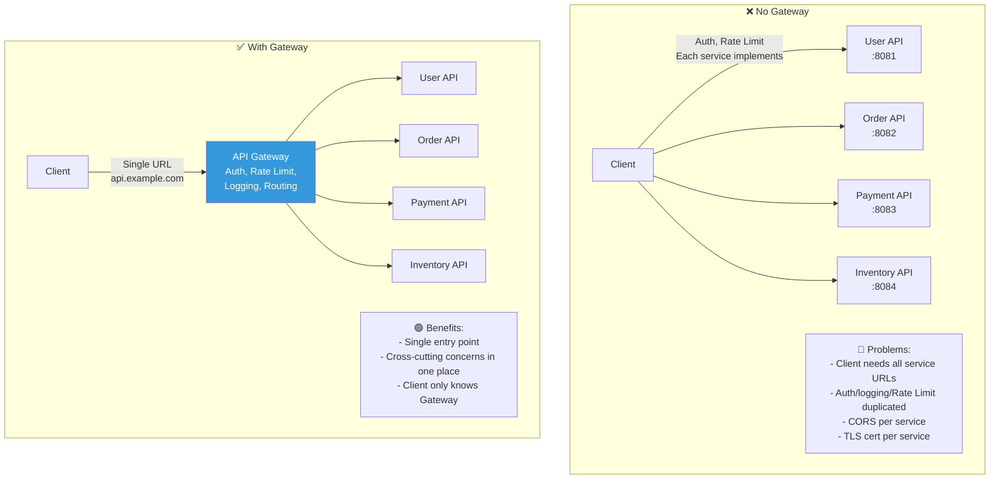
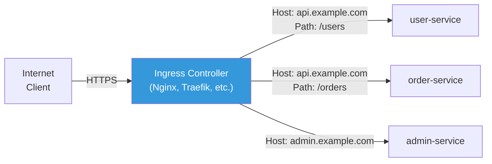
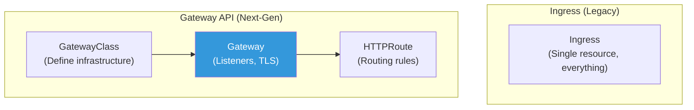

# API Gateway / OpenAPI

> With 20 microservices, if external clients access each service directly, URLs vary, authentication varies, rate limiting varies — it's unmanageable. API Gateway is the "front door" that unifies everything into a **single entry point**.

---

## 🎯 Why Do You Need to Know This?

```
Real-world API Gateway responsibilities:
• "Want to manage all external APIs from one place"       → Implement API Gateway
• "Tired of implementing auth in every app"        → Common auth at Gateway
• "How do we manage API versions?"              → Gateway routing
• "Want to auto-generate API documentation"          → OpenAPI(Swagger)
• "Want to limit/monitor API usage"      → Rate Limiting, logging
• K8s Ingress/Gateway API                    → Manage external traffic
```

From [load balancing](./06-load-balancing) you learned traffic distribution, and from [service discovery](./12-service-discovery) you learned inter-service communication. API Gateway is the layer that manages **external→internal** traffic above these.

---

## 🧠 Core Concepts

### Analogy: Hotel Front Desk

Let me compare API Gateway to a **hotel front desk**.

* **API Gateway** = Front desk. Every guest (request) goes through here.
* **Authentication** = Verify reservation. "Do you have a reservation? Show ID please."
* **Routing** = "Restaurant is 2nd floor, pool is basement, rooms are 5th floor."
* **Rate Limiting** = "If one person visits restaurant 10+ times, we have a problem..."
* **API Version** = "Old building on left, new building on right."
* **Transformation** = Interpreter for foreign guests (request/response format conversion).

### Without vs With Gateway



### What API Gateway Does

```mermaid
flowchart LR
    REQ["Client Request<br/>GET /api/v2/users"]

    REQ --> AUTH["1. Auth/Authz<br/>JWT verify, API Key"]
    AUTH --> RATE["2. Rate Limiting<br/>Per IP/key limit"]
    RATE --> ROUTE["3. Routing<br/>/users → user-service"]
    ROUTE --> TRANSFORM["4. Transform<br/>Add headers, rewrite path"]
    TRANSFORM --> BACKEND["5. Forward to backend<br/>user-service:8080"]
    BACKEND --> LOG["6. Logging/Metrics<br/>Record request/response"]
    LOG --> RESP["Return response"]

    style AUTH fill:#e74c3c,color:#fff
    style ROUTE fill:#3498db,color:#fff
```



---

## 🔍 Detailed Explanation — API Gateway Types

### Major API Gateway Products

| Product | Type | Features | Recommended |
|---------|------|----------|-------------|
| **AWS API Gateway** | Managed (Serverless) | Lambda integration, REST/WebSocket/HTTP | AWS serverless |
| **Kong** | Open source + Commercial | Nginx-based, rich plugins | General, K8s |
| **K8s Ingress** | K8s native | Nginx/Traefik Ingress Controller | K8s basic |
| **K8s Gateway API** | K8s next-gen standard | Better than Ingress, more powerful | K8s modern |
| **Envoy / Istio** | Service Mesh | Sidecar-based, advanced features | Large microservices |
| **Traefik** | Open source | Auto config, Docker/K8s friendly | Small to medium |
| **Nginx** | General purpose | Reverse proxy + routing | Simple setup |
| **AWS ALB** | Managed | L7 routing, simple API Gateway role | AWS simple routing |

```bash
# Selection guide:

# Lambda + Serverless → AWS API Gateway
# K8s (basic)        → Ingress (Nginx Ingress Controller)
# K8s (advanced)     → Gateway API or Kong
# K8s + Service Mesh → Istio Gateway
# Simple proxy       → Nginx or ALB
# Multi-environment  → Kong or Traefik
```

---

## 🔍 Detailed Explanation — Kubernetes Ingress

### What is Ingress?

Ingress is a K8s resource that routes HTTP/HTTPS traffic from outside the cluster to internal Services. It's the K8s version of an [L7 load balancer](./06-load-balancing).



```yaml
# Example Ingress resource
apiVersion: networking.k8s.io/v1
kind: Ingress
metadata:
  name: myapp-ingress
  namespace: production
  annotations:
    # Nginx Ingress Controller settings
    nginx.ingress.kubernetes.io/ssl-redirect: "true"
    nginx.ingress.kubernetes.io/proxy-body-size: "50m"
    nginx.ingress.kubernetes.io/rate-limit: "100"
    nginx.ingress.kubernetes.io/rate-limit-window: "1m"
spec:
  ingressClassName: nginx                    # Which Ingress Controller to use
  tls:
  - hosts:
    - api.example.com
    - admin.example.com
    secretName: tls-secret                   # TLS certificate (Secret)
  rules:
  # Host-based routing
  - host: api.example.com
    http:
      paths:
      # Path-based routing
      - path: /users
        pathType: Prefix
        backend:
          service:
            name: user-service
            port:
              number: 80
      - path: /orders
        pathType: Prefix
        backend:
          service:
            name: order-service
            port:
              number: 80
      - path: /
        pathType: Prefix
        backend:
          service:
            name: frontend-service
            port:
              number: 80
  - host: admin.example.com
    http:
      paths:
      - path: /
        pathType: Prefix
        backend:
          service:
            name: admin-service
            port:
              number: 80
```

```bash
# Check Ingress
kubectl get ingress -n production
# NAME             CLASS   HOSTS                              ADDRESS        PORTS     AGE
# myapp-ingress    nginx   api.example.com,admin.example.com  52.78.100.50   80, 443   5d

# Detailed info
kubectl describe ingress myapp-ingress -n production
# Rules:
#   Host                Path  Backends
#   ----                ----  --------
#   api.example.com
#                       /users    user-service:80 (10.0.1.50:8080,10.0.1.51:8080)
#                       /orders   order-service:80 (10.0.1.60:8080)
#                       /         frontend-service:80 (10.0.1.70:3000)
#   admin.example.com
#                       /         admin-service:80 (10.0.1.80:8080)

# Create TLS certificate Secret
kubectl create secret tls tls-secret \
    --cert=fullchain.pem \
    --key=privkey.pem \
    -n production

# Or auto-issue with cert-manager (Let's Encrypt + K8s)
# → cert-manager watches Ingress tls settings and auto-issues/renews!
```

### Nginx Ingress Controller Real-World Configuration

```yaml
# Nginx Ingress Controller's ConfigMap for global settings
apiVersion: v1
kind: ConfigMap
metadata:
  name: nginx-configuration
  namespace: ingress-nginx
data:
  # Proxy settings
  proxy-body-size: "50m"
  proxy-connect-timeout: "10"
  proxy-read-timeout: "60"
  proxy-send-timeout: "60"

  # gzip compression
  use-gzip: "true"
  gzip-types: "application/json text/css application/javascript"

  # Security headers
  use-forwarded-headers: "true"
  enable-real-ip: "true"

  # Log format
  log-format-upstream: '$remote_addr - $request_id [$time_local] "$request" $status $body_bytes_sent rt=$request_time'

  # Rate Limiting
  limit-req-status-code: "429"

  # SSL
  ssl-protocols: "TLSv1.2 TLSv1.3"
  hsts: "true"
  hsts-max-age: "31536000"
```

```bash
# Install Ingress Controller (Helm)
helm repo add ingress-nginx https://kubernetes.github.io/ingress-nginx
helm install ingress-nginx ingress-nginx/ingress-nginx \
    --namespace ingress-nginx --create-namespace \
    --set controller.replicaCount=2 \
    --set controller.service.type=LoadBalancer

# Verify installation
kubectl get pods -n ingress-nginx
# NAME                                       READY   STATUS    RESTARTS   AGE
# ingress-nginx-controller-abc123-1          1/1     Running   0          5d
# ingress-nginx-controller-abc123-2          1/1     Running   0          5d

kubectl get svc -n ingress-nginx
# NAME                       TYPE           CLUSTER-IP     EXTERNAL-IP
# ingress-nginx-controller   LoadBalancer   10.96.50.100   52.78.100.50
#                                                          ^^^^^^^^^^^^
#                                                          Access via this IP!

# DNS settings:
# api.example.com → 52.78.100.50 (or ALB DNS name)
```

### Ingress Annotations in Practice

```yaml
# === Rate Limiting ===
annotations:
  nginx.ingress.kubernetes.io/limit-rps: "10"              # 10/sec
  nginx.ingress.kubernetes.io/limit-burst-multiplier: "5"   # Burst 50
  nginx.ingress.kubernetes.io/limit-connections: "20"       # 20 concurrent

# === Authentication ===
annotations:
  nginx.ingress.kubernetes.io/auth-type: basic
  nginx.ingress.kubernetes.io/auth-secret: basic-auth       # htpasswd Secret
  nginx.ingress.kubernetes.io/auth-realm: "Restricted Area"

# === CORS ===
annotations:
  nginx.ingress.kubernetes.io/enable-cors: "true"
  nginx.ingress.kubernetes.io/cors-allow-origin: "https://frontend.example.com"
  nginx.ingress.kubernetes.io/cors-allow-methods: "GET, POST, PUT, DELETE, OPTIONS"
  nginx.ingress.kubernetes.io/cors-allow-headers: "Content-Type, Authorization"

# === Redirect / Rewrite ===
annotations:
  # /api/v1/users → Backend receives /users
  nginx.ingress.kubernetes.io/rewrite-target: /$2
# spec.rules[].http.paths[].path: /api/v1(/|$)(.*)

  # HTTP → HTTPS redirect
  nginx.ingress.kubernetes.io/ssl-redirect: "true"

# === Timeouts ===
annotations:
  nginx.ingress.kubernetes.io/proxy-connect-timeout: "10"
  nginx.ingress.kubernetes.io/proxy-read-timeout: "120"    # For long APIs
  nginx.ingress.kubernetes.io/proxy-send-timeout: "120"

# === WebSocket ===
annotations:
  nginx.ingress.kubernetes.io/proxy-read-timeout: "3600"   # 1 hour
  nginx.ingress.kubernetes.io/proxy-send-timeout: "3600"
  # WebSocket auto-handles Connection: Upgrade

# === Canary Deployment ===
annotations:
  nginx.ingress.kubernetes.io/canary: "true"
  nginx.ingress.kubernetes.io/canary-weight: "10"           # 10% traffic
  # Or header-based:
  nginx.ingress.kubernetes.io/canary-by-header: "X-Canary"
  nginx.ingress.kubernetes.io/canary-by-header-value: "true"
```

---

## 🔍 Detailed Explanation — K8s Gateway API

### What is Gateway API?

The successor to Ingress, a more powerful and standardized K8s traffic management API.



**Ingress vs Gateway API:**

| Item | Ingress | Gateway API |
|------|---------|-------------|
| Responsibility separation | Single resource for everything | GatewayClass → Gateway → Route separate |
| Protocols | HTTP/HTTPS only | HTTP, TCP, UDP, gRPC, TLS |
| Header-based routing | Via annotations (non-standard) | Native support |
| Traffic distribution | Limited | Weight-based distribution (canary) |
| Cross-namespace | Difficult | Native support |
| Standardization | Annotations vary per vendor | Standard API |

```yaml
# Gateway API Example

# 1. GatewayClass — Managed by infrastructure team
apiVersion: gateway.networking.k8s.io/v1
kind: GatewayClass
metadata:
  name: external-lb
spec:
  controllerName: gateway.nginx.org/nginx-gateway-controller

---
# 2. Gateway — Managed by platform team
apiVersion: gateway.networking.k8s.io/v1
kind: Gateway
metadata:
  name: production-gateway
  namespace: gateway-system
spec:
  gatewayClassName: external-lb
  listeners:
  - name: https
    protocol: HTTPS
    port: 443
    tls:
      mode: Terminate
      certificateRefs:
      - name: tls-cert
    allowedRoutes:
      namespaces:
        from: All                   # Allow routes from all namespaces

---
# 3. HTTPRoute — Managed by dev team
apiVersion: gateway.networking.k8s.io/v1
kind: HTTPRoute
metadata:
  name: user-api-route
  namespace: production
spec:
  parentRefs:
  - name: production-gateway
    namespace: gateway-system
  hostnames:
  - "api.example.com"
  rules:
  - matches:
    - path:
        type: PathPrefix
        value: /users
    backendRefs:
    - name: user-service
      port: 80
      weight: 90                   # 90% → Existing version
    - name: user-service-v2
      port: 80
      weight: 10                   # 10% → New version (canary!)
  - matches:
    - path:
        type: PathPrefix
        value: /orders
    - headers:                     # Header-based matching!
      - name: X-API-Version
        value: "v2"
    backendRefs:
    - name: order-service-v2
      port: 80
```

---

## 🔍 Detailed Explanation — AWS API Gateway

### AWS API Gateway Types

```bash
# 1. HTTP API (cheapest, simplest)
# → Proxy to Lambda, ALB, HTTP endpoints
# → JWT auth, CORS built-in
# → $1.00/1M requests
# → Recommended for simple APIs!

# 2. REST API (most features)
# → All features: API Key, usage plans, caching, WAF
# → $3.50/1M requests
# → For advanced features

# 3. WebSocket API
# → Bidirectional communication
# → Chat, real-time notifications
# → $1.00/1M messages + connection time

# Selection guide:
# Simple Lambda proxy → HTTP API ($)
# API Key, caching, usage plans → REST API ($$$)
# Real-time bidirectional → WebSocket API
```

### AWS API Gateway + Lambda Pattern

```bash
# Most common serverless API pattern:
# Client → API Gateway → Lambda → DynamoDB

# API Gateway settings (SAM/CloudFormation):
# AWSTemplateFormatVersion: '2010-09-09'
# Transform: AWS::Serverless-2016-10-31
# Resources:
#   MyApi:
#     Type: AWS::Serverless::HttpApi
#     Properties:
#       StageName: prod
#       CorsConfiguration:
#         AllowOrigins:
#           - "https://frontend.example.com"
#         AllowMethods:
#           - GET
#           - POST
#         AllowHeaders:
#           - Authorization
#           - Content-Type
#
#   GetUsersFunction:
#     Type: AWS::Serverless::Function
#     Properties:
#       Handler: app.handler
#       Runtime: nodejs18.x
#       Events:
#         GetUsers:
#           Type: HttpApi
#           Properties:
#             ApiId: !Ref MyApi
#             Path: /users
#             Method: GET

# Connect custom domain:
# api.example.com → API Gateway
# → ACM certificate (us-east-1 or region) required
# → Route53 A record (Alias) → API Gateway domain
```

---

## 🔍 Detailed Explanation — OpenAPI (Swagger)

### What is OpenAPI?

A standardized specification format for **documenting APIs**. Previously called Swagger.

```yaml
# openapi.yaml — API spec example
openapi: 3.0.3
info:
  title: User Service API
  description: User management API
  version: 1.0.0
  contact:
    name: DevOps Team
    email: devops@example.com

servers:
  - url: https://api.example.com/v1
    description: Production
  - url: https://api-staging.example.com/v1
    description: Staging

paths:
  /users:
    get:
      summary: List users
      tags:
        - Users
      parameters:
        - name: page
          in: query
          schema:
            type: integer
            default: 1
        - name: limit
          in: query
          schema:
            type: integer
            default: 20
      responses:
        '200':
          description: Success
          content:
            application/json:
              schema:
                type: object
                properties:
                  users:
                    type: array
                    items:
                      $ref: '#/components/schemas/User'
                  total:
                    type: integer
        '401':
          description: Authentication failed
      security:
        - BearerAuth: []

    post:
      summary: Create user
      tags:
        - Users
      requestBody:
        required: true
        content:
          application/json:
            schema:
              $ref: '#/components/schemas/CreateUser'
      responses:
        '201':
          description: Created successfully
          content:
            application/json:
              schema:
                $ref: '#/components/schemas/User'
        '400':
          description: Bad request

  /users/{id}:
    get:
      summary: Get user details
      tags:
        - Users
      parameters:
        - name: id
          in: path
          required: true
          schema:
            type: integer
      responses:
        '200':
          description: Success
          content:
            application/json:
              schema:
                $ref: '#/components/schemas/User'
        '404':
          description: User not found

components:
  schemas:
    User:
      type: object
      properties:
        id:
          type: integer
        name:
          type: string
        email:
          type: string
          format: email
        created_at:
          type: string
          format: date-time

    CreateUser:
      type: object
      required:
        - name
        - email
      properties:
        name:
          type: string
          minLength: 1
          maxLength: 100
        email:
          type: string
          format: email

  securitySchemes:
    BearerAuth:
      type: http
      scheme: bearer
      bearerFormat: JWT
```

```bash
# Use OpenAPI documentation

# 1. View with Swagger UI (browser)
# → https://petstore.swagger.io/ → Enter OpenAPI YAML URL
# → Visually see API and test directly!

# 2. Generate code (client SDK)
# openapi-generator generates Python/JS/Go client code
# npx @openapitools/openapi-generator-cli generate \
#     -i openapi.yaml \
#     -g python \
#     -o ./generated-client/

# 3. Automate API testing
# Generate tests based on OpenAPI spec
# → Postman imports OpenAPI file and creates test collection

# 4. Mock server
# Generate fake API from OpenAPI spec (for frontend dev)
# npx @stoplight/prism-cli mock openapi.yaml
# → Fake responses at http://localhost:4010/users!

# In practice:
# → Write OpenAPI first (API-First Design)
# → Frontend/backend develop in parallel
# → CI/CD validates OpenAPI spec
# → Auto-deploy API documentation
```

---

## 🔍 Detailed Explanation — API Versioning

### Versioning Strategies

```bash
# === Method 1: URL Path Version (Most Common!) ===
# GET /api/v1/users
# GET /api/v2/users

# In Ingress:
# - path: /api/v1
#   backend: user-service-v1
# - path: /api/v2
#   backend: user-service-v2

# ✅ Clear and intuitive
# ❌ Longer URLs

# === Method 2: Header Version ===
# GET /api/users
# X-API-Version: 2
# Or
# Accept: application/vnd.myapp.v2+json

# ✅ Clean URLs
# ❌ Hard to test in browser

# === Method 3: Query Parameter ===
# GET /api/users?version=2

# ✅ Simple
# ❌ Caching issues (different URLs)

# Real-world recommendation: URL Path version (/v1, /v2)
# → Most clear, easy CDN caching
```

```bash
# API versioning in practice (K8s Ingress)

# Run v1 and v2 simultaneously:
apiVersion: networking.k8s.io/v1
kind: Ingress
metadata:
  name: api-versioning
spec:
  rules:
  - host: api.example.com
    http:
      paths:
      - path: /api/v1
        pathType: Prefix
        backend:
          service:
            name: api-v1        # Existing version
            port:
              number: 80
      - path: /api/v2
        pathType: Prefix
        backend:
          service:
            name: api-v2        # New version
            port:
              number: 80

# Gradual migration:
# 1. Deploy v2 (run with v1)
# 2. Notify clients to use v2
# 3. Monitor v1 usage
# 4. When v1 usage near 0, deprecate v1
# 5. After grace period, remove v1
```

---

## 💻 Practice Examples

### Example 1: K8s Ingress Configuration

```bash
# 1. Install Nginx Ingress Controller (skip if exists)
helm repo add ingress-nginx https://kubernetes.github.io/ingress-nginx
helm install ingress-nginx ingress-nginx/ingress-nginx \
    --namespace ingress-nginx --create-namespace

# 2. Create 2 test services
kubectl create deployment app-v1 --image=hashicorp/http-echo -- -text="v1"
kubectl expose deployment app-v1 --port=80 --target-port=5678

kubectl create deployment app-v2 --image=hashicorp/http-echo -- -text="v2"
kubectl expose deployment app-v2 --port=80 --target-port=5678

# 3. Create Ingress (path-based routing)
cat << 'EOF' | kubectl apply -f -
apiVersion: networking.k8s.io/v1
kind: Ingress
metadata:
  name: test-ingress
  annotations:
    nginx.ingress.kubernetes.io/rewrite-target: /
spec:
  ingressClassName: nginx
  rules:
  - http:
      paths:
      - path: /v1
        pathType: Prefix
        backend:
          service:
            name: app-v1
            port:
              number: 80
      - path: /v2
        pathType: Prefix
        backend:
          service:
            name: app-v2
            port:
              number: 80
EOF

# 4. Test
INGRESS_IP=$(kubectl get svc -n ingress-nginx ingress-nginx-controller -o jsonpath='{.status.loadBalancer.ingress[0].ip}')

curl http://$INGRESS_IP/v1
# v1

curl http://$INGRESS_IP/v2
# v2

# 5. Clean up
kubectl delete ingress test-ingress
kubectl delete deployment app-v1 app-v2
kubectl delete service app-v1 app-v2
```

### Example 2: Test Ingress Annotations

```bash
# Apply rate limiting
cat << 'EOF' | kubectl apply -f -
apiVersion: networking.k8s.io/v1
kind: Ingress
metadata:
  name: rate-limit-test
  annotations:
    nginx.ingress.kubernetes.io/limit-rps: "2"
    nginx.ingress.kubernetes.io/limit-burst-multiplier: "3"
spec:
  ingressClassName: nginx
  rules:
  - http:
      paths:
      - path: /
        pathType: Prefix
        backend:
          service:
            name: app-v1
            port:
              number: 80
EOF

# Test rate limiting
for i in $(seq 1 20); do
    code=$(curl -s -o /dev/null -w "%{http_code}" http://$INGRESS_IP/)
    echo "Request $i: $code"
done
# Request 1: 200
# ...
# Request 8: 200    ← 2 rate × 3 burst = 6 + some
# Request 9: 429    ← Limit exceeded!
# Request 10: 429

kubectl delete ingress rate-limit-test
```

### Example 3: Create OpenAPI Documentation

```bash
# Write simple OpenAPI file
cat << 'EOF' > /tmp/openapi.yaml
openapi: 3.0.3
info:
  title: My Simple API
  version: 1.0.0
paths:
  /health:
    get:
      summary: Health Check
      responses:
        '200':
          description: OK
          content:
            application/json:
              schema:
                type: object
                properties:
                  status:
                    type: string
                    example: ok
  /users:
    get:
      summary: List Users
      responses:
        '200':
          description: Success
          content:
            application/json:
              schema:
                type: array
                items:
                  type: object
                  properties:
                    id:
                      type: integer
                    name:
                      type: string
EOF

# Validate spec
# npx @apidevtools/swagger-cli validate /tmp/openapi.yaml
# /tmp/openapi.yaml is valid!

echo "OpenAPI file created: /tmp/openapi.yaml"
echo "View in Swagger UI: https://petstore.swagger.io/ and paste URL"
```

---

## 🏢 In Real-World Practice

### Scenario 1: Set Up API Gateway in K8s

```bash
# Architecture:
# Internet → CloudFront → ALB → Nginx Ingress Controller → Services

# 1. CloudFront: CDN + DDoS defense (./11-cdn)
# 2. ALB: TLS termination + ACM certificate
# 3. Nginx Ingress: Routing + Rate Limiting + Auth
# 4. Services: Each microservice

# Ingress handles:
# - Host/path-based routing
# - Rate Limiting (annotations)
# - CORS settings
# - WebSocket proxy
# - Canary deployment (weights)

# Ingress doesn't handle (other layers):
# - TLS termination → ALB or ACM
# - DDoS defense → CloudFront + Shield
# - WAF → AWS WAF (attached to ALB)
# - Authentication → App level or OAuth2 Proxy
```

### Scenario 2: Handle API Auth at Gateway

```bash
# Per-service auth = duplicate code, hard to manage
# Gateway auth = central management!

# Method 1: Nginx Ingress + OAuth2 Proxy
# → Deploy OAuth2 Proxy as sidecar/separate Pod
# → Ingress integrates external auth
# annotations:
#   nginx.ingress.kubernetes.io/auth-url: "http://oauth2-proxy.auth:4180/oauth2/auth"
#   nginx.ingress.kubernetes.io/auth-signin: "https://auth.example.com/oauth2/start"
# → Unauthenticated requests → redirect to login

# Method 2: Kong + JWT Plugin
# → Kong validates JWT token
# → Only valid tokens reach backend

# Method 3: Istio + RequestAuthentication
# → Istio validates JWT
# → Service mesh level auth
apiVersion: security.istio.io/v1beta1
kind: RequestAuthentication
metadata:
  name: jwt-auth
spec:
  jwtRules:
  - issuer: "https://auth.example.com"
    jwksUri: "https://auth.example.com/.well-known/jwks.json"
```

### Scenario 3: API Migration (v1 → v2)

```bash
# Gradual migration with canary deployment

# Stage 1: Deploy v2 + canary (10%)
# v1 Ingress (main, 90%):
# - path: /api/v1
#   backend: api-v1

# v2 Ingress (canary, 10%):
# annotations:
#   nginx.ingress.kubernetes.io/canary: "true"
#   nginx.ingress.kubernetes.io/canary-weight: "10"
# - path: /api/v1          ← Same path!
#   backend: api-v2         ← 10% to v2

# Stage 2: Monitor
# → Check v2 error rate, response time
# → No issues? Increase weight (10% → 30% → 50% → 100%)

# Stage 3: Complete switch
# → When v2 is 100%, remove v1
# → Set /api/v1 → /api/v2 redirect (grace period)

# Stage 4: v1 Deprecated
# → Mark v1 as Deprecated in docs
# → 6 months later, completely remove v1
```

---

## ⚠️ Common Mistakes

### 1. Expose Services via NodePort Without Ingress

```bash
# ❌ Each service gets NodePort → Port management nightmare
# service-a: NodePort 30001
# service-b: NodePort 30002
# → Port conflicts, individual TLS, no rate limiting

# ✅ Use Ingress for single entry point
# → Just ports 80/443, route by path/host
# → TLS, rate limiting in one place
```

### 2. Annotations Vary Per Ingress Controller

```bash
# ❌ Use Nginx annotations with Traefik Controller
# nginx.ingress.kubernetes.io/rate-limit: "10"    ← Traefik ignores!

# ✅ Check your Ingress Controller docs
# Nginx Ingress: nginx.ingress.kubernetes.io/*
# Traefik: traefik.ingress.kubernetes.io/*
# AWS ALB: alb.ingress.kubernetes.io/*

# Or use Gateway API for standard config!
```

### 3. No API versioning, Add Later in Rush

```bash
# ❌ /api/users (no version) → Later need breaking change
# → Existing clients break!

# ✅ Version from start
# /api/v1/users
# → Breaking change? Add /api/v2/users
# → Keep v1 (deprecated grace period then remove)
```

### 4. Put All APIs in Single Ingress

```bash
# ❌ 1000-line Ingress YAML → Unmanageable

# ✅ Split Ingress per service/team
# user-team-ingress.yaml  → /api/v1/users/*
# order-team-ingress.yaml → /api/v1/orders/*

# Multiple Ingresses per host/path = Nginx Controller auto-merges!
```

### 5. OpenAPI Docs Separate from Code

```bash
# ❌ openapi.yaml managed separately → Docs drift from code

# ✅ Auto-generate from code
# Python FastAPI: auto /docs with Swagger UI
# Go: swaggo/swag library
# Java Spring: springdoc-openapi

# Or API-First:
# Write OpenAPI first → Generate code → Docs always current
```

---

## 📝 Summary

### API Gateway Selection Guide

```
K8s basic routing          → Ingress (Nginx Ingress Controller)
K8s advanced/canary       → Gateway API or Kong
Serverless (Lambda)       → AWS API Gateway (HTTP API)
Service Mesh              → Istio Gateway
Simple proxy              → ALB or Nginx
```

### Ingress Essential Settings

```yaml
annotations:
  nginx.ingress.kubernetes.io/ssl-redirect: "true"         # Force HTTPS
  nginx.ingress.kubernetes.io/proxy-body-size: "50m"        # Upload limit
  nginx.ingress.kubernetes.io/limit-rps: "10"               # Rate Limiting
  nginx.ingress.kubernetes.io/enable-cors: "true"           # CORS
spec:
  ingressClassName: nginx
  tls:
  - secretName: tls-cert
  rules:
  - host: api.example.com
    http:
      paths: [...]
```

### API Design Checklist

```
✅ URL includes version (/api/v1/...)
✅ OpenAPI spec written (auto-generated or API-First)
✅ Rate Limiting configured
✅ Auth/Authz (JWT, API Key)
✅ CORS settings
✅ Unified error response format ({"error": "message"})
✅ Health check endpoint (/health, /ready)
✅ Logging/Metrics (request count, response time, error rate)
```

---

## 🔗 Next Category

🎉 **02-Networking Category Complete!**

Through 13 lectures covering OSI model, TCP/UDP, HTTP, DNS, subnetting, TLS, load balancing, Nginx, debugging, security, VPN, CDN, Service Discovery, API Gateway — you've covered all of networking!

Next is **[03-containers/01-concept](../03-containers/01-concept)**.

What is Docker? How are containers different from VMs? What is the OCI standard? — Enter the container world. You'll see how the [namespaces and cgroups](../01-linux/13-kernel) you learned in Linux combine into containers!
