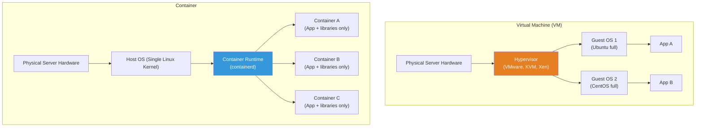
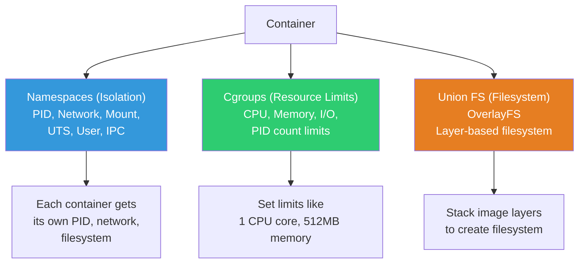
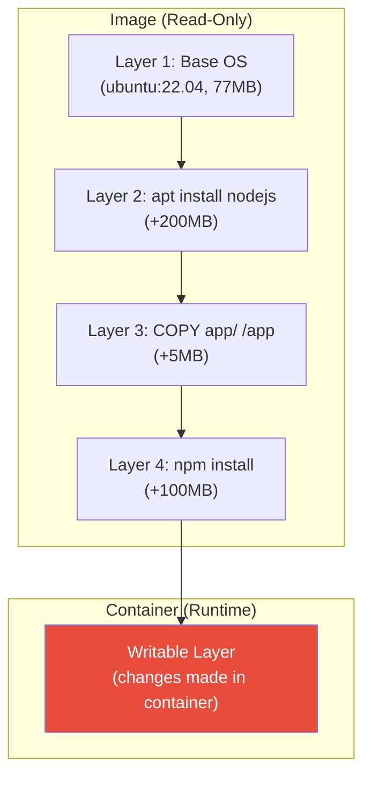
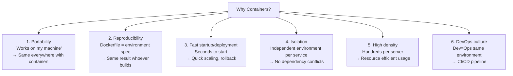
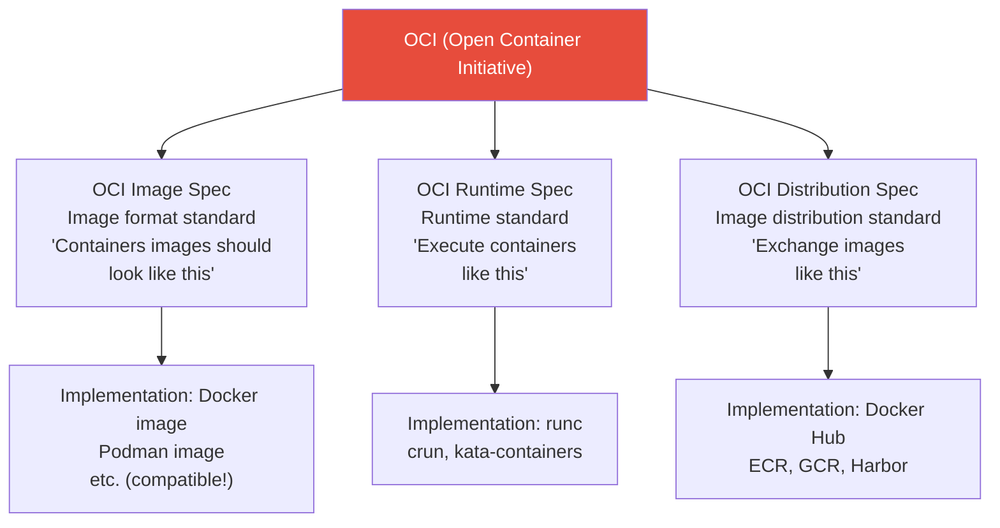
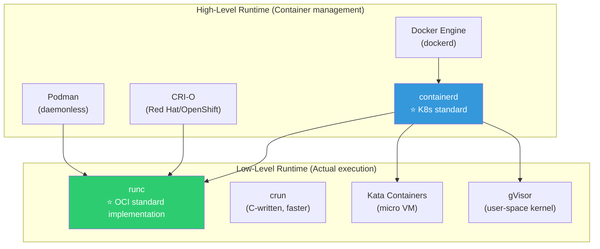
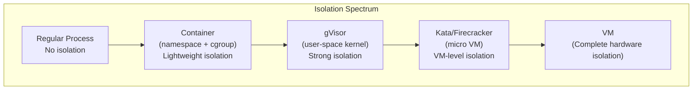

# Container vs VM / OCI Standard

> When someone asks "What is Docker?" and you answer "It's a lightweight VM," you're only half right. Containers are not VMs. They are fundamentally different technology. In this lecture, we'll properly learn what containers **really are**, how they differ from VMs, and why the OCI standard is important.

---

## 🎯 Why Learn This?

```
Understanding these concepts reveals:
• "Why are containers faster than VMs?"           → Kernel sharing principle
• "Use containers without Docker?"                → containerd, CRI-O
• "What's an OCI image?"                          → Container standard understanding
• "Why did K8s abandon Docker?"                   → Docker vs containerd
• "Aren't containers security-weak?"              → Isolation level understanding
• "Why use containers at all?"                    → Portability, reproducibility
```

Remember [namespaces and cgroups from before](../01-linux/13-kernel)? **Container = namespaces (isolation) + cgroups (resource limits) + Union FS (filesystem)**. It's not magic, just a combination of Linux kernel features.

---

## 🧠 Core Concepts

### Analogy: House vs Office Partition

```
VM         = Independent house. Has its own foundation (kernel), walls (OS), furniture (apps)
Container  = Partitioned office in one building. Shares building infrastructure (kernel) and divided by partitions (isolation)
```

### Architecture Comparison



### VM vs Container Detailed Comparison

| Item | VM | Container |
|------|-----|-----------|
| Isolation Level | Hardware level (strong) | Process level (lightweight) |
| OS | Each has separate Guest OS | Share host kernel |
| Size | GB units (includes OS) | MB units (app+libraries only) |
| Start Time | Minutes (OS boot) | Seconds~milliseconds (process start) |
| Resources | High overhead (OS) | Low (kernel shared) |
| Density | Tens per server | Hundreds~thousands per server |
| Portability | Heavy images | Lightweight, identical everywhere |
| Security | Strong isolation (separate kernel) | Relatively weak (kernel shared) |
| Use Cases | Multi-tenant, strong isolation needed | Microservices, CI/CD, scaling |
| Technology | VMware, KVM, Hyper-V | Docker, containerd, CRI-O |

```bash
# Real-world comparison:

# VM startup:
# Create Ubuntu VM → 2~5 minutes (OS boot)
# Memory: minimum 512MB~1GB
# Disk: minimum 2~5GB

# Container startup:
time docker run --rm alpine echo "Hello"
# Hello
# real    0m0.500s    ← 0.5 seconds!

# Container image size:
docker images
# REPOSITORY   TAG       SIZE
# alpine       latest    7.8MB       ← 7.8MB!
# ubuntu       22.04     77.9MB
# nginx        latest    187MB
# node         20        1.1GB       ← Node.js is larger

# Versus Ubuntu VM image:
# ubuntu-22.04-server.iso → 1.4GB
```

---

## 🔍 Detailed Explanation — Container Principles

### Container = Linux Kernel Features Combination



```bash
# Verify directly (if Docker is installed):

# 1. Run a container
docker run -d --name test-container nginx

# 2. Check container process on host — just a process!
ps aux | grep nginx
# root     12345  ... nginx: master process nginx
# → On host, just a normal process!

# 3. Check container namespace
CONTAINER_PID=$(docker inspect --format '{{.State.Pid}}' test-container)
echo "Container main process PID: $CONTAINER_PID"

ls -la /proc/$CONTAINER_PID/ns/
# cgroup -> 'cgroup:[4026532500]'
# ipc -> 'ipc:[4026532498]'
# mnt -> 'mnt:[4026532496]'      ← Different number = isolated!
# net -> 'net:[4026532501]'
# pid -> 'pid:[4026532499]'
# user -> 'user:[4026531837]'
# uts -> 'uts:[4026532497]'

# Compare with host namespace
ls -la /proc/1/ns/
# Different numbers! → Running in different namespace

# 4. Check cgroup (resource limits)
cat /sys/fs/cgroup/system.slice/docker-$(docker inspect --format '{{.Id}}' test-container).scope/memory.max 2>/dev/null
# max    ← No limit (we didn't use --memory option)

# With memory limit:
docker run -d --name limited --memory=256m nginx
cat /sys/fs/cgroup/system.slice/docker-$(docker inspect --format '{{.Id}}' limited).scope/memory.max 2>/dev/null
# 268435456    ← 256MB (in bytes)

# 5. Check Union FS (OverlayFS)
docker inspect test-container --format '{{.GraphDriver.Data.MergedDir}}'
# /var/lib/docker/overlay2/abc123.../merged
# → Multiple layers merged into filesystem

mount | grep overlay
# overlay on /var/lib/docker/overlay2/abc123.../merged type overlay (rw,...)
# → Mounted with OverlayFS!

# Cleanup
docker rm -f test-container limited
```

### Container Image Layer Structure

Container images are composed of **layers**. Each layer is read-only, and when a container runs, a writable layer is added on top.



```bash
# Check image layers
docker history nginx
# IMAGE          CREATED        CREATED BY                                      SIZE
# a8758716bb6a   2 weeks ago    CMD ["nginx" "-g" "daemon off;"]                0B
# <missing>      2 weeks ago    STOPSIGNAL SIGQUIT                              0B
# <missing>      2 weeks ago    EXPOSE 80                                       0B
# <missing>      2 weeks ago    COPY 30-tune-worker-processes.sh … → …          4.62kB
# <missing>      2 weeks ago    COPY 20-envsubst-on-templates.sh … → …          3.02kB
# <missing>      2 weeks ago    COPY 10-listen-on-ipv6-by-default.sh …          2.12kB
# <missing>      2 weeks ago    COPY docker-entrypoint.sh /docker-entrypoint…   4.62kB
# <missing>      2 weeks ago    RUN /bin/sh -c set -x && ... && apt-get in…    112MB  ← Nginx install
# <missing>      2 weeks ago    /bin/sh -c #(nop) ADD file:... in /            77.9MB ← Base OS
# → Layers stack from bottom to top!

# Benefits of layer sharing:
# If nginx image and another image use same ubuntu base
# → Base layer (77.9MB) is shared! Disk savings!

docker images
# REPOSITORY   SIZE
# nginx        187MB
# myapp        250MB
# → Actual disk usage is not 187 + 250
# → Subtract common layers: 187 + (250-77.9) ≈ 360MB

# Check actual disk usage
docker system df
# TYPE           TOTAL   ACTIVE   SIZE      RECLAIMABLE
# Images         5       3        1.2GB     400MB (33%)
# Containers     3       3        50MB      0B
# Volumes        2       2        200MB     0B
# Build Cache    10      0        500MB     500MB
```

### Why Use Containers? (★ Core Reasons)



```bash
# Real-world problem solving:

# ❌ Without containers:
# "Dev environment: Node 18, Prod: Node 16 → Doesn't work!"
# "Python 3.8 and Python 3.11 apps conflict on same server!"
# "Onboarding new dev: 2 days for environment setup..."
# "Deployed, but library version differs → Error!"

# ✅ With containers:
# "Specify Node 18 in Dockerfile → Node 18 everywhere"
# "Each app in own container → No dependency conflicts"
# "docker compose up → Full environment in 5 minutes"
# "Image tags for version control → Identical binary deployment"
```

---

## 🔍 Detailed Explanation — OCI Standard

### What is OCI?

**Open Container Initiative**. It **standardized** container image format and runtime. What Docker was de facto standard became official standard.



**Why OCI Matters?**

```bash
# Before OCI standard:
# Docker format image → Only runs on Docker
# → Vendor lock-in

# After OCI standard:
# OCI format image → Runs on Docker, containerd, CRI-O, Podman anywhere!
# → Pull from Docker Hub, run on containerd
# → Push to ECR, pull anywhere

# Real-world impact:
# 1. K8s can remove Docker but still use existing images!
# 2. Docker-built images can run on Podman
# 3. ECR, GCR, Harbor all use same image format
# → "Docker image" is now "OCI image" (correct term)

# Check OCI image format
docker inspect nginx --format '{{.Config.Image}}'
# OCI manifest:
docker manifest inspect nginx
# {
#   "schemaVersion": 2,
#   "mediaType": "application/vnd.oci.image.index.v1+json",
#   ...
# }
```

### Container Runtime Ecosystem



```bash
# Runtime relationships:
# Docker CLI → dockerd (Docker daemon) → containerd → runc
# K8s        → CRI → containerd → runc
# K8s        → CRI → CRI-O → runc (or crun)
# Podman     → (no daemon) → runc

# K8s 1.24 onwards:
# ❌ K8s → dockershim → Docker → containerd → runc (complex!)
# ✅ K8s → CRI → containerd → runc (simple!)
# → Removed Docker, connected directly to containerd!
# → But Docker-built images still work! (OCI standard)

# Check current node container runtime
kubectl get nodes -o wide
# NAME     STATUS   VERSION   OS-IMAGE             CONTAINER-RUNTIME
# node-1   Ready    v1.28.0   Ubuntu 22.04 LTS     containerd://1.7.2
# → Using containerd!

# Check containerd directly
sudo ctr --namespace moby containers list    # Docker-created containers
sudo ctr --namespace k8s.io containers list  # K8s-created containers

# crictl (CRI-compatible CLI)
sudo crictl ps
# CONTAINER ID   IMAGE          STATE     NAME
# abc123         nginx:latest   Running   nginx
```

### Docker vs Podman

```bash
# Podman: Docker alternative. No daemon, rootless execution by default

# Similarities:
# - Same OCI image format
# - Docker CLI nearly identical commands
# - Dockerfile compatible (called Containerfile too)

# Differences:
# Docker:  Needs dockerd daemon, requires root (default)
# Podman:  Daemonless, rootless by default

# Podman is Docker drop-in replacement:
alias docker=podman    # That's it for most compatibility!

podman run -d nginx    # Same commands as Docker!
podman build -t myapp .
podman push myapp:latest

# Real-world:
# Dev environment → Docker Desktop (convenience)
# CI/CD → Docker or Podman (Kaniko, buildah etc)
# Production K8s → containerd (Docker unnecessary)
# Security-focused → Podman (rootless, daemonless)
```

---

## 🔍 Detailed Explanation — Container Isolation and Security

### Isolation Level Comparison



```bash
# Container security weaknesses:
# 1. Shared kernel → Kernel vulnerability affects all containers
# 2. root container → Can access host kernel (escape risk)
# 3. Image vulnerabilities → Old libraries with CVE

# Security hardening methods (learned in ../01-linux/14-security!):
# 1. Run non-root (User namespace)
docker run --user 1000:1000 nginx

# 2. seccomp profile
docker run --security-opt seccomp=default nginx

# 3. AppArmor/SELinux
docker run --security-opt apparmor=docker-default nginx

# 4. Read-only filesystem
docker run --read-only nginx

# 5. Capability limits
docker run --cap-drop ALL --cap-add NET_BIND_SERVICE nginx

# 6. Production secure execution (all combined):
docker run -d \
    --user 1000:1000 \
    --read-only \
    --tmpfs /tmp:rw,noexec,nosuid,size=100m \
    --cap-drop ALL \
    --cap-add NET_BIND_SERVICE \
    --security-opt no-new-privileges:true \
    --security-opt seccomp=default \
    --memory 512m \
    --cpus 1.0 \
    --pids-limit 100 \
    nginx
```

---

## 💻 Hands-On Exercises

### Exercise 1: VM vs Container Speed Comparison

```bash
# Measure container startup time
time docker run --rm alpine echo "Hello from container"
# Hello from container
# real    0m0.400s    ← 0.4 seconds!

# Sequential execution of 1000 containers
time for i in $(seq 1 10); do
    docker run --rm alpine echo "$i" > /dev/null
done
# real    0m4.0s     ← 10 per 4 seconds = 0.4 each

# VM would take → 30 minutes~1 hour for 10 VMs...
```

### Exercise 2: Confirm Container is Process

```bash
# 1. Run container
docker run -d --name proof nginx

# 2. Check process on host
CPID=$(docker inspect --format '{{.State.Pid}}' proof)
echo "Container PID: $CPID"

ps aux | grep $CPID
# root  $CPID  ... nginx: master process nginx

# 3. PID 1 inside container
docker exec proof ps aux
# PID   USER   COMMAND
# 1     root   nginx: master process    ← PID 1 inside!

# 4. Different PID on host
echo "Host PID: $CPID"
# Host PID: 12345    ← Different on host

# → Same process, different PID due to namespace isolation!
# → This is PID namespace isolation effect!

# 5. Cleanup
docker rm -f proof
```

### Exercise 3: Observe Image Layers

```bash
# 1. Create simple Dockerfile
mkdir -p /tmp/layer-test && cd /tmp/layer-test

cat << 'EOF' > Dockerfile
FROM alpine:latest
RUN echo "layer 1" > /file1.txt
RUN echo "layer 2" > /file2.txt
RUN echo "layer 3" > /file3.txt
CMD ["cat", "/file1.txt", "/file2.txt", "/file3.txt"]
EOF

# 2. Build
docker build -t layer-test .
# Step 1/5 : FROM alpine:latest
#  ---> abc123
# Step 2/5 : RUN echo "layer 1" > /file1.txt
#  ---> Running in def456
#  ---> 789abc        ← New layer!
# Step 3/5 : RUN echo "layer 2" > /file2.txt
#  ---> Running in ghi012
#  ---> 345def        ← New layer!
# ...

# 3. Check layers
docker history layer-test
# IMAGE        SIZE     CREATED BY
# abc123       0B       CMD ["cat" "/file1.txt" ...]
# def456       13B      RUN echo "layer 3" > /file3.txt
# ghi789       13B      RUN echo "layer 2" > /file2.txt
# jkl012       13B      RUN echo "layer 1" > /file1.txt
# mno345       7.8MB    /bin/sh -c #(nop) ADD file:... in /

# → Each RUN is one layer!
# → alpine base (7.8MB) + 3 layers (13B each)

# 4. Share layers with different image using same alpine base
docker images
# layer-test   7.8MB    (shared alpine layer)
# alpine       7.8MB    (same layer!)

# 5. Cleanup
docker rmi layer-test
rm -rf /tmp/layer-test
```

### Exercise 4: Verify Resource Limits

```bash
# 1. Memory limit
docker run -d --name mem-test --memory=100m alpine sleep 3600

# Check in cgroup
docker exec mem-test cat /sys/fs/cgroup/memory.max
# 104857600    ← 100MB

# 2. CPU limit
docker run -d --name cpu-test --cpus=0.5 alpine sleep 3600

docker exec cpu-test cat /sys/fs/cgroup/cpu.max
# 50000 100000    ← 50000 out of 100000μs = 0.5 cores

# 3. Monitor resource usage in real-time
docker stats --no-stream
# CONTAINER   CPU %   MEM USAGE / LIMIT   MEM %   NET I/O       BLOCK I/O   PIDS
# mem-test    0.00%   1.5MiB / 100MiB     1.50%   648B / 0B     0B / 0B     1
# cpu-test    0.00%   1.5MiB / unlimited  0.02%   648B / 0B     0B / 0B     1

# 4. Cleanup
docker rm -f mem-test cpu-test
```

---

## 🏢 Real-World Practice

### Scenario 1: "Why Migrate to Containers?"

```bash
# Problems in traditional environments:
# 1. "Works on my PC but not on server"
#    → Dev and prod environments differ (Node version, libraries etc)
#    → Containers: Same image runs anywhere

# 2. "Server has 3 apps with different Node versions"
#    → Dependency conflicts
#    → Containers: Each app has independent environment

# 3. "New server setup takes a full day"
#    → Manual installation (apt install, pip install, ...)
#    → Containers: docker-compose up done

# 4. "Traffic spike, server add takes 30 minutes"
#    → VM provisioning + app install + configuration
#    → Containers: New container starts in seconds

# 5. "Rollback takes 1 hour"
#    → Checkout old code + build + deploy
#    → Containers: Rollback to previous image tag instantly
```

### Scenario 2: "K8s Abandoned Docker?"

```bash
# Accurate facts:
# K8s 1.24 removed dockershim
# → K8s no longer calls Docker daemon directly
# → Connected directly to containerd (more efficient)

# Impact:
# ✅ Docker-built images still work! (OCI standard)
# ✅ Dockerfile still works
# ✅ Docker Hub still works
# ❌ 'docker ps' won't show containers on K8s node (use crictl ps)
# ❌ CI/CD tools mounting docker.sock need modification

# Real-world impact:
# Developers: No change (build with Docker, push)
# Operators: Use crictl to check node containers
# CI/CD: Use Kaniko, buildah etc for in-cluster builds

# crictl usage (similar to Docker):
sudo crictl ps                    # docker ps
sudo crictl images                # docker images
sudo crictl logs CONTAINER_ID     # docker logs
sudo crictl inspect CONTAINER_ID  # docker inspect
```

### Scenario 3: Container Security Level Selection

```bash
# Choose isolation per workload:

# 1. Internal microservices (trusted code):
# → Standard container (runc) + seccomp + non-root
# → Sufficient for most cases

# 2. External code execution (CI/CD builds, user-submitted code):
# → gVisor (user-space kernel) → Reduce kernel attack surface
# → Or Kata Containers (micro VM) → VM-level isolation

# 3. Regulated environments (finance, healthcare):
# → Kata Containers or Firecracker
# → Container convenience + VM isolation level

# 4. Multi-tenant (multiple customers, same cluster):
# → gVisor or Kata + NetworkPolicy + namespace isolation
# → Complete isolation between customers required
```

---

## ⚠️ Common Mistakes

### 1. Understanding "Container = VM"

```bash
# ❌ "Containers are lightweight VMs"
# → VMs virtualize hardware, containers isolate OS
# → Fundamentally different technology!

# ✅ "Containers are isolated processes"
# → Linux kernel namespaces + cgroup for process isolation
# → No separate OS, shares host kernel
```

### 2. Believing Containers are Perfectly Isolated

```bash
# ❌ "Since it's a container, no security concern?"
# → Containers share kernel! Kernel vulnerability = escape possible

# ✅ Security hardening essential:
# → Run non-root
# → seccomp, AppArmor
# → Image vulnerability scanning
# → Read-only filesystem
# → Capability minimization
```

### 3. Storing State (Data) in Containers

```bash
# ❌ Store DB data, uploaded files etc in container
# → Data disappears when container deleted!

# ✅ Use volumes for external data storage
docker run -v /host/data:/container/data myapp
# → Persists in /host/data
# → Data survives container deletion
```

### 4. Managing Images with latest Tag Only

```bash
# ❌ docker push myapp:latest → Which version?
# → During rollback: "What was previous version?"

# ✅ Use explicit version tags
docker push myapp:v1.2.3
docker push myapp:20250312-abc123    # date-commit hash
# → Can rollback to specific version anytime
```

### 5. Equating Docker with Containers

```bash
# ❌ "Container = Docker"
# → Docker is just one container tool!
# → containerd, CRI-O, Podman are alternatives
# → K8s production standard is containerd

# ✅ "Docker is one tool for managing containers"
# → OCI standard ensures compatibility across tools
```

---

## 📝 Summary

### VM vs Container Quick Reference

```
VM:        Separate OS, GB size, minutes to start, strong isolation
Container: Shared kernel, MB size, seconds to start, lightweight isolation
```

### Container's Three Pillars

```
Namespaces: Isolation (PID, Network, Mount, UTS, User, IPC)
Cgroups:    Resource limits (CPU, Memory, I/O, PIDs)
Union FS:   Layer-based filesystem (OverlayFS)
```

### OCI Standard

```
OCI Image Spec:       Image format standard → Docker/Podman image compatible
OCI Runtime Spec:     Runtime standard → runc, crun, kata
OCI Distribution Spec: Image distribution → Docker Hub, ECR, Harbor compatible
```

### Runtime Stack

```
Docker CLI → dockerd → containerd → runc
K8s        → CRI → containerd → runc
Podman     → (no daemon) → runc
```

---

## 🔗 Next Lecture

Next is **[02-docker-basics](./02-docker-basics)** — Docker CLI / Basic Commands.

Now that you understand container concepts, it's time to use Docker. We'll learn image download, container start/stop, log checking, volume mounting, network connection — Docker's essential commands in practical hands-on.
