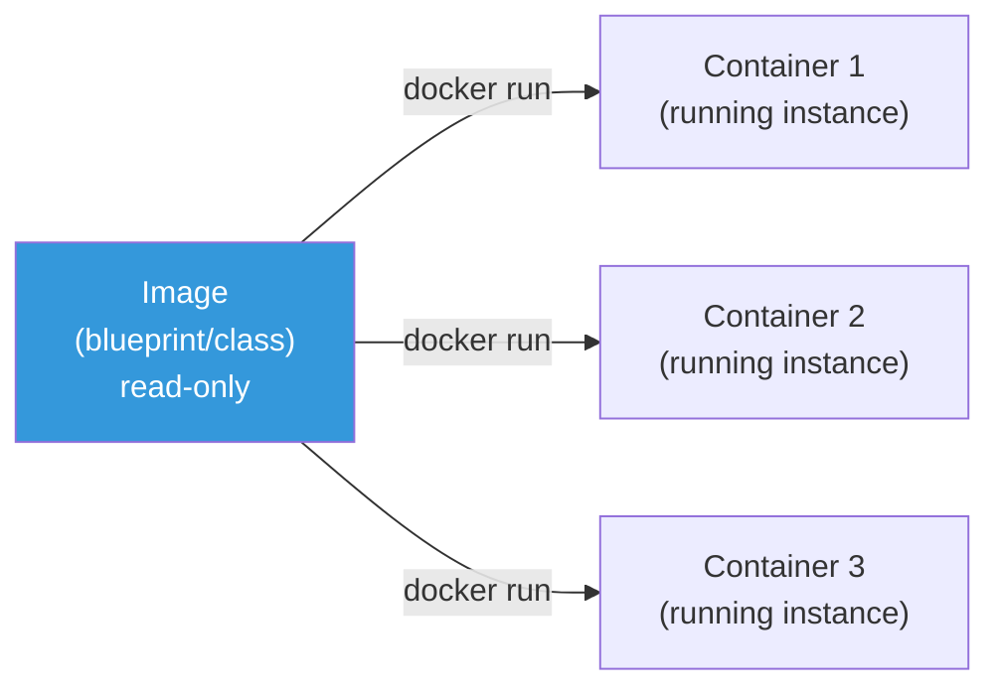
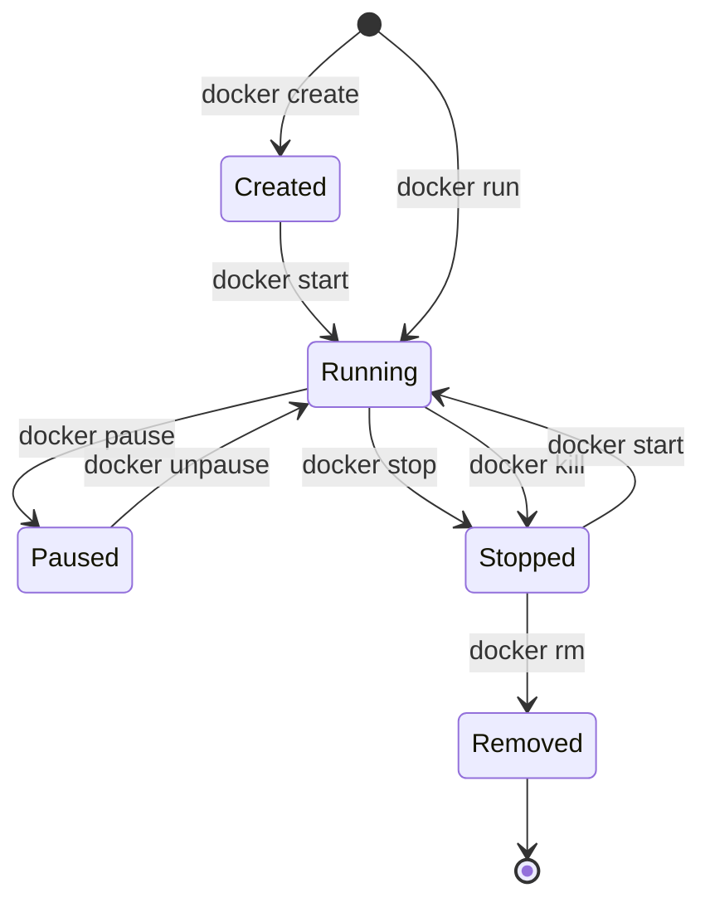
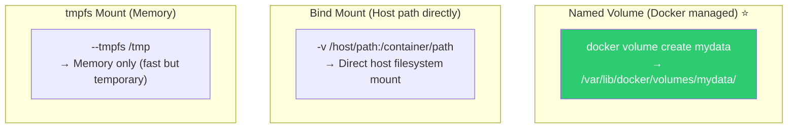

# Docker CLI / Basic Commands

> Time to use Docker for real. Download images, run/stop containers, check logs, manage volumes, networks, environment variables — learn Docker's essential commands hands-on with practical examples.

---

## 🎯 Why Learn This?

```
Daily DevOps work with Docker CLI:
• Run/stop/restart service containers            → docker run, stop, restart
• Check container logs (troubleshoot issues)     → docker logs
• Enter container for debugging                  → docker exec
• Build image + registry push/pull               → docker build, push, pull
• Persist data with volumes                      → docker volume
• Manage multiple containers together            → docker compose
• Clean unused resources                         → docker system prune
```

[From previous lecture](./01-concept) we learned what containers are. Now it's practice time.

---

## 🧠 Core Concepts

### Docker Command Structure

```bash
docker [target] [action] [options]

# Examples:
docker container run nginx         # run action on container
docker image pull nginx            # pull action on image
docker volume create mydata        # create action on volume

# Short form (more common):
docker run nginx                   # shortcut for docker container run
docker pull nginx                  # shortcut for docker image pull
docker ps                          # shortcut for docker container ls
```

### Image vs Container



```bash
# Image = Program (executable)
# Container = Running process

# Single image, multiple containers
docker run -d --name web1 nginx    # Container 1
docker run -d --name web2 nginx    # Container 2 (same image!)
docker run -d --name web3 nginx    # Container 3
```

---

## 🔍 Detailed Explanation — Image Management

### docker pull — Download Image

```bash
# Basic pull (from Docker Hub)
docker pull nginx
# Using default tag: latest
# latest: Pulling from library/nginx
# a2abf6c4d29d: Pull complete
# a9edb18cadd1: Pull complete
# 589b7251471a: Pull complete
# ...
# Digest: sha256:abc123...
# Status: Downloaded newer image for nginx:latest

# Specify specific version (tag)
docker pull nginx:1.25.3
docker pull node:20-alpine
docker pull python:3.12-slim

# Pull from different registries
docker pull public.ecr.aws/nginx/nginx:latest        # AWS ECR Public
docker pull ghcr.io/owner/image:tag                  # GitHub Container Registry
docker pull 123456789.dkr.ecr.ap-northeast-2.amazonaws.com/myapp:v1.0  # AWS ECR Private
```

**Image Tag Naming Convention:**

```bash
# Format: [registry/][namespace/]image:tag

# Docker Hub (default registry, can omit):
nginx:latest                        # shortcut for library/nginx:latest
nginx:1.25.3                        # specific version
nginx:1.25.3-alpine                 # lightweight Alpine-based

# Common tag patterns:
myapp:latest                        # latest (⚠️ not recommended for production!)
myapp:v1.2.3                        # semantic version
myapp:20250312-abc1234              # date-commit hash (⭐ recommended)
myapp:main-abc1234                  # branch-commit hash
python:3.12                         # major.minor
python:3.12-slim                    # lightweight variant
python:3.12-alpine                  # Alpine-based (smaller)

# ⚠️ Don't use latest in production!
# → Which version?
# → When does image change?
# → Rollback impossible!
```

### docker images — List Images

```bash
docker images
# REPOSITORY   TAG          IMAGE ID       CREATED        SIZE
# nginx        latest       a8758716bb6a   2 weeks ago    187MB
# nginx        1.25.3       bc649bab30d1   3 months ago   187MB
# node         20-alpine    abcdef123456   1 week ago     130MB
# python       3.12-slim    fedcba654321   2 weeks ago    150MB
# myapp        v1.2.3       112233445566   1 hour ago     250MB

# Filter
docker images nginx           # nginx images only
docker images --filter "dangling=true"    # <none> images (cleanup candidates)

# Check size (actual disk usage)
docker system df
# TYPE           TOTAL   ACTIVE   SIZE      RECLAIMABLE
# Images         10      5        3.5GB     1.2GB (34%)
# Containers     5       3        100MB     50MB (50%)
# Volumes        3       2        500MB     200MB (40%)
# Build Cache    20      0        800MB     800MB (100%)
```

### docker rmi — Delete Image

```bash
# Delete image
docker rmi nginx:1.25.3
# Untagged: nginx:1.25.3
# Deleted: sha256:bc649bab30d1...

# Delete all dangling images
docker image prune
# WARNING! This will remove all dangling images.
# Are you sure you want to continue? [y/N] y
# Deleted Images:
# deleted: sha256:abc123...
# Total reclaimed space: 500MB

# Delete all unused images (including tagged)
docker image prune -a
# → Excludes images used by running containers
```

---

## 🔍 Detailed Explanation — Container Lifecycle



### docker run — Execute Container (★ Most Important!)

```bash
# === Basic execution ===

# Foreground (attached to terminal, Ctrl+C stops)
docker run nginx
# /docker-entrypoint.sh: ... Configuration complete; ready for start up

# Background execution (-d: detached)
docker run -d nginx
# abc123def456...    ← Container ID

# Specify name (--name)
docker run -d --name my-nginx nginx
# → Manage as "my-nginx"

# === Port mapping (-p) ===

# Host 8080 → Container 80
docker run -d -p 8080:80 --name web nginx
#              ^^^^^^^^
#              host:container

# Verify
curl http://localhost:8080
# <!DOCTYPE html>
# <html>
# <head><title>Welcome to nginx!</title>...

# Multiple port mappings
docker run -d -p 8080:80 -p 8443:443 nginx

# Random port mapping (-P: uppercase)
docker run -d -P nginx
docker port $(docker ps -q -l)
# 80/tcp -> 0.0.0.0:32768    ← Random port assigned

# === Environment variables (-e) ===

docker run -d \
    -e MYSQL_ROOT_PASSWORD=secret \
    -e MYSQL_DATABASE=mydb \
    -e MYSQL_USER=myuser \
    -e MYSQL_PASSWORD=mypassword \
    --name mydb \
    -p 3306:3306 \
    mysql:8.0

# Load from environment file
cat << 'EOF' > /tmp/app.env
NODE_ENV=production
PORT=3000
DB_HOST=mydb
DB_PORT=3306
EOF

docker run -d --env-file /tmp/app.env --name myapp myapp:latest

# === Auto-delete (--rm) ===

# Auto-delete container after exit (one-time execution)
docker run --rm alpine echo "Hello"
# Hello
# → Auto-deleted after execution

# === Interactive mode (-it) ===

# Run shell in container
docker run -it --rm ubuntu bash
# root@abc123:/# ls
# bin  boot  dev  etc  home  ...
# root@abc123:/# exit

docker run -it --rm alpine sh
# / # whoami
# root
# / # exit

# === Resource limits ===

docker run -d \
    --memory=512m \              # 512MB memory
    --cpus=1.5 \                 # 1.5 CPU cores
    --pids-limit=100 \           # Max 100 processes
    --name limited-app \
    myapp:latest
```

### docker ps — List Running Containers

```bash
# Running containers
docker ps
# CONTAINER ID   IMAGE   COMMAND                  CREATED        STATUS        PORTS                  NAMES
# abc123def456   nginx   "/docker-entrypoint.…"   5 minutes ago  Up 5 minutes  0.0.0.0:8080->80/tcp   web
# def456ghi789   mysql   "docker-entrypoint.s…"   3 minutes ago  Up 3 minutes  0.0.0.0:3306->3306/tcp mydb

# All containers (including stopped)
docker ps -a
# CONTAINER ID   IMAGE    STATUS                     NAMES
# abc123def456   nginx    Up 5 minutes               web
# def456ghi789   mysql    Up 3 minutes               mydb
# 111222333444   alpine   Exited (0) 10 minutes ago  old-test

# Container IDs only
docker ps -q
# abc123def456
# def456ghi789

# Custom format
docker ps --format "table {{.Names}}\t{{.Status}}\t{{.Ports}}"
# NAMES    STATUS         PORTS
# web      Up 5 minutes   0.0.0.0:8080->80/tcp
# mydb     Up 3 minutes   0.0.0.0:3306->3306/tcp

# Filter
docker ps --filter "status=exited"     # Stopped only
docker ps --filter "name=web"          # Name contains "web"
```

### docker stop / start / restart

```bash
# Stop (Graceful: SIGTERM → 10sec wait → SIGKILL)
docker stop web
# web

# Kill immediately (SIGKILL)
docker kill web
# web

# Start
docker start web
# web

# Restart
docker restart web
# web

# Multiple containers at once
docker stop web mydb myapp
docker start web mydb myapp

# Stop all running containers
docker stop $(docker ps -q)

# Change stop timeout (default 10sec)
docker stop -t 30 web    # 30sec wait then SIGKILL
```

### docker rm — Delete Container

```bash
# Delete stopped container
docker rm old-test
# old-test

# Force delete running container
docker rm -f web
# web

# Delete all stopped containers
docker container prune
# WARNING! This will remove all stopped containers.
# Are you sure you want to continue? [y/N] y
# Deleted Containers:
# 111222333444
# Total reclaimed space: 50MB

# Force delete all containers (⚠️ careful!)
docker rm -f $(docker ps -aq)
```

---

## 🔍 Detailed Explanation — Container Internal Operations

### docker logs — Check Logs (★ Essential for Troubleshooting!)

```bash
# All logs
docker logs web
# /docker-entrypoint.sh: ... Configuration complete; ready for start up
# 2025/03/12 10:00:00 [notice] 1#1: nginx/1.25.3
# 10.0.0.1 - - [12/Mar/2025:10:00:05 +0000] "GET / HTTP/1.1" 200 ...

# Last N lines
docker logs web --tail 20
# (last 20 lines only)

# Stream logs (like tail -f)
docker logs web -f
# → Shows new logs as they appear (Ctrl+C to stop)

# Stream + last 10 lines
docker logs web -f --tail 10

# Include timestamps
docker logs web -t
# 2025-03-12T10:00:00.123456789Z /docker-entrypoint.sh: ...

# Time filter
docker logs web --since "2025-03-12T10:00:00"
docker logs web --since "1h"       # Last 1 hour
docker logs web --since "30m"      # Last 30 minutes

# Search errors (with grep)
docker logs web 2>&1 | grep -i "error\|warn\|fail"
# 2025/03/12 10:15:30 [error] 1#1: *1 connect() failed...
```

### docker exec — Execute Command in Running Container

```bash
# Shell access (most common!)
docker exec -it web bash
# root@abc123:/# ls /etc/nginx/
# conf.d  fastcgi_params  mime.types  modules  nginx.conf  ...
# root@abc123:/# cat /etc/nginx/nginx.conf
# root@abc123:/# exit

# Alpine-based image (no bash, use sh)
docker exec -it myalpine sh

# Execute command only (no shell session)
docker exec web cat /etc/nginx/nginx.conf
docker exec web nginx -t            # Validate nginx config
docker exec mydb mysql -u root -p   # MySQL access

# Check environment variables
docker exec web env
# PATH=/usr/local/sbin:/usr/local/bin:/usr/sbin:/usr/bin:/sbin:/bin
# NGINX_VERSION=1.25.3
# ...

# Check processes
docker exec web ps aux
# PID   USER   COMMAND
# 1     root   nginx: master process nginx -g daemon off;
# 29    nginx   nginx: worker process
# 30    nginx   nginx: worker process

# Check network
docker exec web ip addr
docker exec web cat /etc/resolv.conf

# ⚠️ exec is for debugging! In production, exec config changes disappear on restart!
# → Modify image or use ConfigMap/volumes
```

### docker inspect — Detailed Information

```bash
# Container detailed info (JSON)
docker inspect web
# [
#     {
#         "Id": "abc123def456...",
#         "State": {
#             "Status": "running",
#             "Pid": 12345,
#             ...
#         },
#         "NetworkSettings": {
#             "IPAddress": "172.17.0.2",
#             ...
#         },
#         ...
#     }
# ]

# Extract specific info (--format, Go templates)
docker inspect web --format '{{.State.Status}}'
# running

docker inspect web --format '{{.NetworkSettings.IPAddress}}'
# 172.17.0.2

docker inspect web --format '{{.State.Pid}}'
# 12345

docker inspect web --format '{{range .NetworkSettings.Networks}}{{.IPAddress}}{{end}}'
# 172.17.0.2

# Check mounted volumes
docker inspect web --format '{{json .Mounts}}' | python3 -m json.tool

# Check environment variables
docker inspect web --format '{{json .Config.Env}}' | python3 -m json.tool
# [
#     "PATH=/usr/local/sbin:/usr/local/bin:...",
#     "NGINX_VERSION=1.25.3"
# ]

# Check port mappings
docker inspect web --format '{{json .NetworkSettings.Ports}}' | python3 -m json.tool
# {
#     "80/tcp": [
#         {
#             "HostIp": "0.0.0.0",
#             "HostPort": "8080"
#         }
#     ]
# }
```

### docker cp — Copy Files

```bash
# Host → Container
docker cp /tmp/custom.conf web:/etc/nginx/conf.d/custom.conf

# Container → Host
docker cp web:/etc/nginx/nginx.conf /tmp/nginx.conf

# Useful for debugging:
# 1. Copy container config to local for review
docker cp web:/etc/nginx/nginx.conf ./

# 2. Copy modified config to container for testing
docker cp ./modified.conf web:/etc/nginx/conf.d/test.conf
docker exec web nginx -t    # Validate
docker exec web nginx -s reload    # Apply

# ⚠️ Files copied with cp disappear on container deletion!
# → For permanent: modify Dockerfile or use volumes
```

### docker stats — Monitor Resource Usage

```bash
docker stats
# CONTAINER ID   NAME    CPU %   MEM USAGE / LIMIT     MEM %   NET I/O          BLOCK I/O   PIDS
# abc123         web     0.50%   15.5MiB / 7.77GiB     0.19%   1.5kB / 800B     0B / 0B     3
# def456         mydb    2.30%   350MiB / 512MiB       68.36%  2.1kB / 1.5kB    50MB / 0B   30
#                                        ^^^^^^^
#                                        memory limit shown!

# Specific container only
docker stats web

# One-time output (for scripts)
docker stats --no-stream --format "table {{.Name}}\t{{.CPUPerc}}\t{{.MemUsage}}"
# NAME    CPU %   MEM USAGE / LIMIT
# web     0.50%   15.5MiB / 7.77GiB
# mydb    2.30%   350MiB / 512MiB
```

---

## 🔍 Detailed Explanation — Volumes

Data in containers disappears on deletion. Permanent data needs **volumes**.

### Volume Types



```bash
# === Named Volume (Docker managed) ===

# Create volume
docker volume create mydata

# List volumes
docker volume ls
# DRIVER    VOLUME NAME
# local     mydata

# Volume info
docker volume inspect mydata
# [
#     {
#         "Name": "mydata",
#         "Mountpoint": "/var/lib/docker/volumes/mydata/_data",
#         ...
#     }
# ]

# Mount volume to container
docker run -d \
    -v mydata:/var/lib/mysql \
    --name mydb \
    mysql:8.0

# Volume persists after container deletion!
docker rm -f mydb
docker volume ls    # mydata still exists!

# Reuse volume in different container
docker run -d \
    -v mydata:/var/lib/mysql \
    --name mydb-new \
    mysql:8.0
# → Previous DB data intact!

# === Bind Mount (Host path direct) ===

# Mount host directory to container
docker run -d \
    -v $(pwd)/html:/usr/share/nginx/html:ro \
    -p 8080:80 \
    --name web \
    nginx
#   ^^^^^^^^^^^^^^^^^^^^^^^^^^^^^^^^^^^^^
#   host path:container path:options
#                          ro = read-only

# Host file changes immediately visible in container!
echo "<h1>Hello Docker!</h1>" > ./html/index.html
curl http://localhost:8080
# <h1>Hello Docker!</h1>

# Common in dev: instant reflection without rebuild

# === tmpfs (Memory) ===
docker run -d \
    --tmpfs /tmp:rw,noexec,nosuid,size=100m \
    --name secure-app \
    myapp:latest
# → /tmp only in memory (fast but temporary)
# → Suitable for sensitive temporary data

# === Volume cleanup ===

# Delete unused volumes
docker volume prune
# WARNING! This will remove all local volumes not used by at least one container.

# Delete specific volume
docker volume rm mydata
```

---

## 🔍 Detailed Explanation — Networks

### Docker Network Types

```bash
docker network ls
# NETWORK ID     NAME      DRIVER    SCOPE
# abc123         bridge    bridge    local     ← Default
# def456         host      host      local
# ghi789         none      null      local

# bridge (default): Isolated network between containers
# host: Use host network directly (no isolation)
# none: No network
# overlay: Multi-host network (Docker Swarm/K8s)
```

### User-Defined Network (★ Production Recommended!)

```bash
# Problem with default bridge:
# → Containers can't communicate by name! (IP only)

# Create user-defined network
docker network create myapp-net

# Connect containers to same network
docker run -d --name mydb --network myapp-net \
    -e MYSQL_ROOT_PASSWORD=secret mysql:8.0

docker run -d --name myapp --network myapp-net \
    -e DB_HOST=mydb \
    myapp:latest
# → myapp can access "mydb" by name!

# Verify
docker exec myapp ping -c 2 mydb
# PING mydb (172.18.0.2) 56(84) bytes of data.
# 64 bytes from mydb.myapp-net (172.18.0.2): icmp_seq=1 ttl=64 time=0.100 ms
# → Name communication works! (Docker built-in DNS)

docker exec myapp nslookup mydb
# Server:    127.0.0.11      ← Docker built-in DNS
# Name:      mydb
# Address 1: 172.18.0.2

# Network detailed info
docker network inspect myapp-net
# → Connected containers, IP assignments etc

# Network cleanup
docker network rm myapp-net
```

---

## 🔍 Detailed Explanation — Docker Compose (★ Production Essential!)

Manage **multiple containers in one file** with **one command**.

### docker-compose.yml Basics

```yaml
# docker-compose.yml
# Web app + DB + Redis setup

services:
  # App server
  app:
    image: myapp:latest
    # Or build:
    # build:
    #   context: .
    #   dockerfile: Dockerfile
    ports:
      - "8080:3000"                 # host:container
    environment:
      NODE_ENV: production
      DB_HOST: db                    # Access by service name!
      DB_PORT: "5432"
      REDIS_HOST: redis
    depends_on:
      db:
        condition: service_healthy   # Start after DB healthcheck
      redis:
        condition: service_started
    restart: unless-stopped          # Auto-restart on crash
    networks:
      - app-net

  # PostgreSQL
  db:
    image: postgres:16-alpine
    environment:
      POSTGRES_DB: mydb
      POSTGRES_USER: myuser
      POSTGRES_PASSWORD: mypassword
    volumes:
      - db-data:/var/lib/postgresql/data    # Persistent storage
    healthcheck:
      test: ["CMD-SHELL", "pg_isready -U myuser -d mydb"]
      interval: 10s
      timeout: 5s
      retries: 5
    networks:
      - app-net

  # Redis
  redis:
    image: redis:7-alpine
    command: redis-server --maxmemory 256mb --maxmemory-policy allkeys-lru
    volumes:
      - redis-data:/data
    networks:
      - app-net

  # Nginx (reverse proxy)
  nginx:
    image: nginx:alpine
    ports:
      - "80:80"
      - "443:443"
    volumes:
      - ./nginx/default.conf:/etc/nginx/conf.d/default.conf:ro
      - ./nginx/certs:/etc/nginx/certs:ro
    depends_on:
      - app
    restart: unless-stopped
    networks:
      - app-net

volumes:
  db-data:            # Named Volume (Docker managed)
  redis-data:

networks:
  app-net:            # User-defined network
    driver: bridge
```

### Docker Compose Commands

```bash
# Start all (background)
docker compose up -d
# [+] Running 4/4
#  ✔ Network myapp_app-net  Created
#  ✔ Container myapp-db-1   Started
#  ✔ Container myapp-redis-1 Started
#  ✔ Container myapp-app-1  Started
#  ✔ Container myapp-nginx-1 Started

# Check status
docker compose ps
# NAME             IMAGE              STATUS              PORTS
# myapp-app-1      myapp:latest       Up 5 minutes        0.0.0.0:8080->3000/tcp
# myapp-db-1       postgres:16        Up 5 minutes (healthy)  5432/tcp
# myapp-redis-1    redis:7-alpine     Up 5 minutes        6379/tcp
# myapp-nginx-1    nginx:alpine       Up 5 minutes        0.0.0.0:80->80/tcp

# Logs
docker compose logs              # All logs
docker compose logs app          # Specific service
docker compose logs -f app       # Stream logs

# Stop
docker compose stop              # Stop (containers kept)
docker compose down              # Stop + delete containers/networks
docker compose down -v           # Stop + delete volumes (⚠️ data deleted!)

# Restart
docker compose restart           # Restart all
docker compose restart app       # Specific service only

# Scale
docker compose up -d --scale app=3
# → Run 3 app containers!

# Build + start
docker compose up -d --build     # When Dockerfile changes

# Execute in service
docker compose exec app bash
docker compose exec db psql -U myuser -d mydb
```

---

## 🔍 Detailed Explanation — System Cleanup

```bash
# === Check disk usage ===
docker system df
# TYPE           TOTAL   ACTIVE   SIZE      RECLAIMABLE
# Images         15      5        5.2GB     2.8GB (53%)
# Containers     8       5        200MB     100MB (50%)
# Volumes        5       3        1.5GB     500MB (33%)
# Build Cache    30      0        1.2GB     1.2GB (100%)

docker system df -v    # Detailed (per-image, per-container sizes)

# === Clean all at once ===

# Delete all unused resources (⭐ run periodically!)
docker system prune
# WARNING! This will remove:
#   - all stopped containers
#   - all networks not used by at least one container
#   - all dangling images
#   - unused build cache
# Are you sure you want to continue? [y/N] y
# Total reclaimed space: 3.5GB

# Include volumes (⚠️ careful with data!)
docker system prune -a --volumes
# → Also delete unused images (tagged) + volumes

# === Individual cleanup ===
docker container prune       # Stopped containers
docker image prune -a        # Unused images
docker volume prune          # Unused volumes
docker network prune         # Unused networks
docker builder prune         # Build cache

# === Delete only old items ===
docker image prune -a --filter "until=168h"    # 7+ day old images
```

---

## 💻 Hands-On Exercises

### Exercise 1: Run Nginx Web Server

```bash
# 1. Run
docker run -d --name my-web -p 8080:80 nginx

# 2. Verify
docker ps
curl http://localhost:8080

# 3. Custom page
mkdir -p /tmp/mysite
echo "<h1>My Docker Site!</h1>" > /tmp/mysite/index.html

docker run -d --name custom-web \
    -v /tmp/mysite:/usr/share/nginx/html:ro \
    -p 9090:80 \
    nginx

curl http://localhost:9090
# <h1>My Docker Site!</h1>

# 4. Check logs
docker logs custom-web

# 5. Shell access
docker exec -it custom-web bash
# ls /usr/share/nginx/html/
# index.html

# 6. Cleanup
docker rm -f my-web custom-web
rm -rf /tmp/mysite
```

### Exercise 2: Docker Compose WordPress

```bash
mkdir -p /tmp/wordpress && cd /tmp/wordpress

cat << 'EOF' > docker-compose.yml
services:
  wordpress:
    image: wordpress:latest
    ports:
      - "8080:80"
    environment:
      WORDPRESS_DB_HOST: db
      WORDPRESS_DB_USER: wp_user
      WORDPRESS_DB_PASSWORD: wp_pass
      WORDPRESS_DB_NAME: wordpress
    depends_on:
      - db
    restart: unless-stopped

  db:
    image: mysql:8.0
    environment:
      MYSQL_DATABASE: wordpress
      MYSQL_USER: wp_user
      MYSQL_PASSWORD: wp_pass
      MYSQL_ROOT_PASSWORD: root_secret
    volumes:
      - db-data:/var/lib/mysql
    restart: unless-stopped

volumes:
  db-data:
EOF

# Start
docker compose up -d

# Check
docker compose ps
curl -sI http://localhost:8080 | head -5
# HTTP/1.1 302 Found
# Location: http://localhost:8080/wp-admin/install.php

# Logs
docker compose logs wordpress --tail 10

# Cleanup
docker compose down -v
cd / && rm -rf /tmp/wordpress
```

### Exercise 3: Container Debugging Practice

```bash
# Run container with intentional issue
docker run -d --name broken -p 8080:80 nginx

# 1. Check status
docker ps --filter "name=broken"

# 2. Check logs
docker logs broken --tail 20

# 3. Check resources
docker stats broken --no-stream

# 4. Shell access for debugging
docker exec -it broken bash
# Check config
cat /etc/nginx/nginx.conf
nginx -t
# Check processes
ps aux
# Check network
curl localhost
exit

# 5. Detailed info
docker inspect broken --format '{{.State.Status}}'
docker inspect broken --format '{{.NetworkSettings.IPAddress}}'

# 6. Cleanup
docker rm -f broken
```

---

## 🏢 Real-World Practice

### Scenario 1: Set Up Dev Environment in One Command

```bash
# docker-compose.yml manages entire dev stack:
# App + DB + Redis + Elasticsearch + Kibana

# New dev onboarding:
git clone https://github.com/mycompany/myapp.git
cd myapp
docker compose up -d
# → Full dev environment in 5 minutes!
# → "Environment setup took 2 days" → "5 minutes"
```

### Scenario 2: Production Container Debugging

```bash
# "App keeps restarting"

# 1. Check status
docker ps --filter "name=myapp"
# STATUS: Restarting (1) 30 seconds ago   ← Restart loop!

# 2. Check logs (⭐ start here!)
docker logs myapp --tail 50
# Error: Cannot connect to database at db:5432
# → DB connection failed!

# 3. Check DB container
docker ps --filter "name=db"
# STATUS: Up 2 hours (healthy)    ← DB is alive

# 4. Check network
docker exec myapp ping -c 2 db
# ping: bad address 'db'    ← DNS resolution failed!

# 5. Check network
docker network inspect myapp_default
# → Check if myapp and db on same network

# 6. Root cause: Different network!
docker network connect myapp_default myapp
# → Connect to same network → Resolved!
```

### Scenario 3: Disk Space Issues (Docker Cleanup)

```bash
# "Server disk 90%!" (see ../01-linux/07-disk)

# 1. Check Docker disk usage
docker system df
# Images: 15GB    ← Too many images!
# Containers: 2GB
# Volumes: 5GB
# Build Cache: 3GB

# 2. Clean step by step:
# a. Build cache first (safest)
docker builder prune -a
# Reclaimed: 3GB

# b. Stopped containers
docker container prune

# c. Unused images
docker image prune -a
# Reclaimed: 8GB

# d. Unused volumes (⚠️ verify data!)
docker volume ls    # See what exists
docker volume prune

# 3. Automate with cron (see ../01-linux/06-cron)
# 0 3 * * 0  docker system prune -af --filter "until=168h" >> /var/log/docker-cleanup.log 2>&1
```

---

## ⚠️ Common Mistakes

### 1. Store Data in Containers

```bash
# ❌ Run DB without volume
docker run -d --name mydb mysql:8.0
docker rm -f mydb    # Data gone!

# ✅ Always use volumes
docker run -d -v db-data:/var/lib/mysql --name mydb mysql:8.0
docker rm -f mydb    # Volume kept! Data safe!
```

### 2. Try Name Communication in Default Bridge

```bash
# ❌ Can't communicate by name in default bridge
docker run -d --name app myapp
docker run -d --name db mysql
docker exec app ping db    # ping: bad address 'db'

# ✅ Create user-defined network
docker network create mynet
docker run -d --name app --network mynet myapp
docker run -d --name db --network mynet mysql
docker exec app ping db    # Success!
```

### 3. Test Containers Without --rm

```bash
# ❌ Test containers accumulate
docker run alpine echo test
docker run alpine echo test
docker run alpine echo test
docker ps -a    # 3 Exited containers!

# ✅ Use --rm for test/one-time
docker run --rm alpine echo test    # Auto-deleted!
```

### 4. Carelessly Run docker compose down -v

```bash
# ❌ Delete volumes → DB data gone!
docker compose down -v
# → db-data volume deleted → DB data permanently lost!

# ✅ Preserve volumes
docker compose down     # Containers deleted, volumes kept
```

### 5. Neglect Image Cleanup (Disk Full)

```bash
# ❌ Repeated docker build accumulates images + cache
docker system df
# Build Cache: 10GB!

# ✅ Clean periodically
docker system prune -af --filter "until=168h"    # 7+ days only
```

---

## 📝 Summary

### Docker CLI Cheat Sheet

```bash
# === Images ===
docker pull IMAGE:TAG              # Download
docker images                       # List
docker rmi IMAGE                    # Delete
docker image prune -a               # Delete all unused

# === Containers ===
docker run -d -p 8080:80 --name NAME IMAGE  # Run
docker ps / docker ps -a            # List
docker stop/start/restart NAME      # Control
docker rm NAME / docker rm -f NAME  # Delete
docker logs NAME -f --tail 20       # Logs
docker exec -it NAME bash           # Shell
docker inspect NAME                 # Details
docker stats                        # Monitor
docker cp SRC DEST                  # Copy files

# === Volumes ===
docker volume create NAME           # Create
docker volume ls                    # List
docker run -v NAME:/path IMAGE      # Mount
docker volume prune                 # Cleanup

# === Networks ===
docker network create NAME          # Create
docker run --network NAME IMAGE     # Connect
docker network inspect NAME         # Details

# === Compose ===
docker compose up -d                # Start
docker compose ps                   # Status
docker compose logs -f SERVICE      # Logs
docker compose down                 # Stop + delete
docker compose exec SERVICE bash    # Shell

# === Cleanup ===
docker system df                    # Disk usage
docker system prune -af             # Clean all
```

### Debugging Order

```
1. docker ps         → Check status (Running? Restarting?)
2. docker logs       → Check logs (Error messages?)
3. docker exec       → Shell access for debugging
4. docker inspect    → Network, volumes, config check
5. docker stats      → Resource usage check
```

---

## 🔗 Next Lecture

Next is **[03-dockerfile](./03-dockerfile)** — Writing Dockerfile.

Now that you run others' images, it's time to **build your own app image**. Dockerfile syntax, multi-stage builds, cache optimization, security best practices — we'll learn everything.
