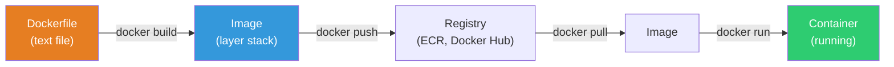
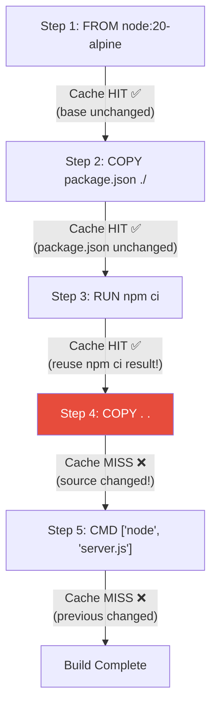
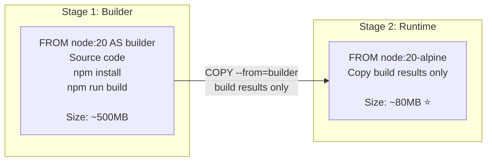

# Writing Dockerfile

> Now that you've run others' images, it's time to **build your app into an image**. Dockerfile is the recipe for images. Write it well: fast builds, small images, good security. Write poorly: 10-minute builds, 2GB images, security holes everywhere.

---

## 🎯 Why Learn This?

```
Real-world Dockerfile work:
• Build app to container image                    → Write Dockerfile
• "Image is 2GB, can we reduce it?"               → Multi-stage build
• "Rebuild repeats npm install every time"       → Layer cache optimization
• "Image security scan shows vulnerabilities"    → Base image choice, non-root
• Auto-build images in CI/CD                     → Dockerfile optimization
• "Works on my machine but not in container"     → Dockerfile debugging
```

[Previous lecture](./02-docker-basics) we ran `docker run` with others' images. Now we build with `docker build` for **our image**.

---

## 🧠 Core Concepts

### Analogy: Cooking Recipe

Think of Dockerfile as a **cooking recipe**.

* **FROM** = Base ingredient (flour dough = base image)
* **RUN** = Cooking steps (knead dough, mix ingredients)
* **COPY** = Add ingredients (sauce, toppings)
* **EXPOSE** = Service window (how many serving counters)
* **CMD** = Final instruction ("Bake 20 minutes in oven")

### Dockerfile → Image → Container Flow



---

## 🔍 Detailed Explanation — Dockerfile Basic Syntax

### Main Commands

```dockerfile
# === FROM — Base image (required! first line!) ===
FROM node:20-alpine
# → Build my app on top of this image
# → alpine version is smallest (130MB vs 1.1GB)

# === WORKDIR — Set working directory ===
WORKDIR /app
# → Later commands run in /app directory
# → Same effect as mkdir + cd

# === COPY — Copy host files to image ===
COPY package.json package-lock.json ./
# → Copy host package.json to image's /app/

COPY . .
# → Copy entire current directory to image's /app/

# === RUN — Execute command during build ===
RUN npm ci --production
# → Run npm install during build
# → Result saved as new layer

RUN apt-get update && apt-get install -y curl && rm -rf /var/lib/apt/lists/*
# → Package install + cache cleanup (in one line!)

# === ENV — Set environment variables ===
ENV NODE_ENV=production
ENV PORT=3000

# === EXPOSE — Document port (doesn't actually open!) ===
EXPOSE 3000
# → For documentation only
# → Actual mapping: docker run -p 3000:3000

# === USER — Change execution user ===
USER node
# → Later commands and container run as node
# → ⭐ Security! Don't run as root!

# === CMD — Execute when container starts ===
CMD ["node", "server.js"]
# → exec form (recommended): ["executable", "arg1", "arg2"]
# → shell form (not recommended): CMD node server.js

# === ENTRYPOINT — Like CMD but harder to override ===
ENTRYPOINT ["node"]
CMD ["server.js"]
# → Default: node server.js
# → docker run myapp worker.js → node worker.js (only CMD replaced)
```

**CMD vs ENTRYPOINT:**

```bash
# CMD only (most common):
CMD ["node", "server.js"]
# docker run myapp                → node server.js
# docker run myapp bash           → bash (entire CMD replaced!)

# ENTRYPOINT + CMD (advanced):
ENTRYPOINT ["node"]
CMD ["server.js"]
# docker run myapp                → node server.js
# docker run myapp worker.js      → node worker.js (only CMD replaced)
# docker run --entrypoint bash myapp → bash (ENTRYPOINT replaced)

# Real-world recommendation:
# Most apps → Use CMD only
# When forcing executable → ENTRYPOINT + CMD
```

### Additional Commands

```dockerfile
# === ARG — Build-time variable (not in image) ===
ARG NODE_VERSION=20
FROM node:${NODE_VERSION}-alpine
# docker build --build-arg NODE_VERSION=18 .

# === LABEL — Metadata ===
LABEL maintainer="devops@mycompany.com"
LABEL version="1.0.0"
LABEL description="My awesome app"

# === ADD vs COPY ===
# COPY: Simple file copy (⭐ recommended!)
COPY ./src /app/src

# ADD: COPY + auto-decompress + URL download
ADD https://example.com/file.tar.gz /app/    # Download from URL
ADD archive.tar.gz /app/                      # Auto-decompress

# → Use COPY mostly. ADD's intention gets unclear.

# === HEALTHCHECK — Container health check ===
HEALTHCHECK --interval=30s --timeout=3s --start-period=10s --retries=3 \
    CMD curl -f http://localhost:3000/health || exit 1

# === VOLUME — Declare volume mount points ===
VOLUME ["/data"]

# === SHELL — Change default shell ===
SHELL ["/bin/bash", "-c"]
```

---

## 🔍 Detailed Explanation — Practical Dockerfile Examples

### Node.js App (★ Most Common Pattern)

```dockerfile
# === Bad Example ❌ ===
FROM node:20
WORKDIR /app
COPY . .
RUN npm install
EXPOSE 3000
CMD ["node", "server.js"]

# Problems:
# 1. node:20 is 1.1GB (too large!)
# 2. COPY . . first means npm install re-runs on code change
# 3. devDependencies installed
# 4. Runs as root (security risk)
# 5. Unnecessary files (.git, node_modules) copied
```

```dockerfile
# === Good Example ✅ ===
FROM node:20-alpine

# Working directory
WORKDIR /app

# 1. Copy dependency files first (leverage layer cache!)
COPY package.json package-lock.json ./

# 2. Install production dependencies only
RUN npm ci --production && npm cache clean --force

# 3. Copy source code (changes frequently)
COPY . .

# 4. Run as non-root
USER node

# 5. Document port
EXPOSE 3000

# 6. Health check
HEALTHCHECK --interval=30s --timeout=3s \
    CMD wget -qO- http://localhost:3000/health || exit 1

# 7. Start command
CMD ["node", "server.js"]
```

```bash
# .dockerignore file (⭐ must create!)
cat << 'EOF' > .dockerignore
node_modules
npm-debug.log
.git
.gitignore
.env
.env.local
Dockerfile
docker-compose.yml
README.md
.vscode
coverage
.nyc_output
*.test.js
*.spec.js
EOF

# → Without .dockerignore, node_modules (hundreds MB) copied!
# → Build becomes slow, image grows large
```

### Python App

```dockerfile
FROM python:3.12-slim

WORKDIR /app

# System dependencies (only if needed)
RUN apt-get update && \
    apt-get install -y --no-install-recommends gcc libpq-dev && \
    rm -rf /var/lib/apt/lists/*

# Python dependencies first (cache!)
COPY requirements.txt .
RUN pip install --no-cache-dir -r requirements.txt

# Source code copy
COPY . .

# Create + use non-root user
RUN groupadd -r appuser && useradd -r -g appuser appuser
USER appuser

EXPOSE 8000

CMD ["gunicorn", "--bind", "0.0.0.0:8000", "--workers", "4", "app:app"]
```

### Go App (Multi-Stage Shines!)

```dockerfile
# === Build stage ===
FROM golang:1.22-alpine AS builder

WORKDIR /app

# Dependencies first (cache)
COPY go.mod go.sum ./
RUN go mod download

# Source copy + build
COPY . .
RUN CGO_ENABLED=0 GOOS=linux go build -o /app/server .

# === Runtime stage ===
FROM scratch
# scratch = completely empty image! No OS!
# Go binary is statically linked, OS unnecessary

COPY --from=builder /app/server /server
COPY --from=builder /etc/ssl/certs/ca-certificates.crt /etc/ssl/certs/

EXPOSE 8080

ENTRYPOINT ["/server"]
```

```bash
# Build result comparison:
# golang:1.22-alpine (build stage): ~300MB
# Final image (scratch):              ~15MB! 🎉
# → Build tools, Go compiler, source code all gone!
# → Only binary for execution!
```

### Java (Spring Boot) App

```dockerfile
# === Build stage ===
FROM eclipse-temurin:21-jdk-alpine AS builder

WORKDIR /app
COPY . .
RUN ./gradlew bootJar --no-daemon

# === Runtime stage ===
FROM eclipse-temurin:21-jre-alpine
# JDK (300MB+) replaced with JRE (200MB)! JRE sufficient for execution

WORKDIR /app

# Copy JAR only
COPY --from=builder /app/build/libs/*.jar app.jar

# Non-root
RUN addgroup -S appgroup && adduser -S appuser -G appgroup
USER appuser

EXPOSE 8080

HEALTHCHECK --interval=30s --timeout=3s \
    CMD wget -qO- http://localhost:8080/actuator/health || exit 1

ENTRYPOINT ["java", "-jar", "app.jar"]
```

---

## 🔍 Detailed Explanation — Layer Cache Optimization (★ Build Speed Core!)

### Cache Mechanism



**Core Rule: Cache invalidates from changed layer onwards!**

```dockerfile
# ❌ Bad order — Code change triggers full npm install!
FROM node:20-alpine
WORKDIR /app
COPY . .                    # ← Change 1 line, cache invalidates here!
RUN npm ci --production     # ← Every time re-install (slow!)

# ✅ Good order — npm install cached when dependencies unchanged!
FROM node:20-alpine
WORKDIR /app
COPY package.json package-lock.json ./   # ← Dependencies first
RUN npm ci --production                   # ← Cache HIT! (if unchanged)
COPY . .                                  # ← Source only changes (fast!)
```

```bash
# Cache effect comparison:

# First build (no cache):
time docker build -t myapp .
# Step 3/6: RUN npm ci --production
# → 45 seconds
# Total: 60 seconds

# Second build (code only changed):
time docker build -t myapp .
# Step 3/6: RUN npm ci --production
# → Using cache ✅ (0 seconds!)
# Total: 5 seconds 🎉

# Cache optimization: 60sec → 5sec!
```

### Layer Optimization Tips

```dockerfile
# ❌ Multiple RUNs (many layers + cache left in middle)
RUN apt-get update
RUN apt-get install -y curl wget git
RUN rm -rf /var/lib/apt/lists/*
# → 3 layers, apt cache remains in middle layer!

# ✅ Single RUN with && (1 layer + cleanup same layer)
RUN apt-get update && \
    apt-get install -y --no-install-recommends curl wget git && \
    rm -rf /var/lib/apt/lists/*
# → 1 layer, apt cache deleted same layer!

# ❌ Large file copied then deleted (remains in layer!)
COPY large-file.tar.gz /tmp/
RUN tar xzf /tmp/large-file.tar.gz -C /app/ && rm /tmp/large-file.tar.gz
# → large-file.tar.gz still exists in first layer!

# ✅ Download + install + delete in single RUN
RUN wget -O /tmp/large-file.tar.gz https://example.com/large-file.tar.gz && \
    tar xzf /tmp/large-file.tar.gz -C /app/ && \
    rm /tmp/large-file.tar.gz
```

---

## 🔍 Detailed Explanation — Multi-Stage Build (★ Image Size Core!)



```dockerfile
# === Multi-Stage Build — React + Node.js ===

# Stage 1: Build frontend
FROM node:20-alpine AS frontend-builder
WORKDIR /app/frontend
COPY frontend/package.json frontend/package-lock.json ./
RUN npm ci
COPY frontend/ .
RUN npm run build
# → Creates /app/frontend/build/ with static files

# Stage 2: Build backend dependencies
FROM node:20-alpine AS backend-builder
WORKDIR /app
COPY package.json package-lock.json ./
RUN npm ci --production

# Stage 3: Final image (smallest!)
FROM node:20-alpine
WORKDIR /app

# Copy backend dependencies only
COPY --from=backend-builder /app/node_modules ./node_modules
# Copy frontend build results only
COPY --from=frontend-builder /app/frontend/build ./public
# Copy source code
COPY . .

USER node
EXPOSE 3000
CMD ["node", "server.js"]
```

```bash
# Image size comparison:
# Without multi-stage:  ~800MB (build tools + devDependencies)
# With multi-stage:     ~150MB (runtime only!)

# Language-specific gains:
# Go:     300MB → 15MB (scratch!)
# Java:   600MB → 200MB (JDK → JRE)
# Node.js: 500MB → 150MB (build tools removed)
# Python: 400MB → 180MB (build tools removed)
```

---

## 🔍 Detailed Explanation — Base Image Selection

```bash
# Even same Node.js varies dramatically by base!

docker pull node:20         && docker images node:20
# node    20         1.1GB    ← Debian-based, all tools

docker pull node:20-slim    && docker images node:20-slim
# node    20-slim    250MB   ← Debian minimal, some tools

docker pull node:20-alpine  && docker images node:20-alpine
# node    20-alpine  130MB   ← Alpine Linux-based, very small!
```

| Base | Size | Pros | Cons | Recommend |
|------|------|------|------|-----------|
| `ubuntu/debian` | Large (200MB+) | All tools, compatible | Large, many CVEs | Legacy |
| `*-slim` | Medium (100-250MB) | Debian minimal, good compat | Still large | Python/Java |
| `*-alpine` | Small (50-130MB) | Very small, fewer CVEs | musl libc compat issues | ⭐ Node.js, Go |
| `distroless` | Smallest | No shell! Best security | Hard to debug | Production security |
| `scratch` | 0MB (empty) | Minimal size | Static binary only | Go |

```dockerfile
# Distroless example (Google's minimal image)
FROM gcr.io/distroless/nodejs20-debian12
WORKDIR /app
COPY --from=builder /app .
CMD ["server.js"]

# → No shell (bash/sh)! → Can't docker exec -it ... bash!
# → Attacker can't run shell → Security maximized
# → For debugging, use debug image:
# FROM gcr.io/distroless/nodejs20-debian12:debug  ← includes sh
```

---

## 🔍 Detailed Explanation — Security Best Practices

### Security Dockerfile Checklist

```dockerfile
# === 1. Run as non-root user (⭐ Most Important!) ===

# Node.js (node user already exists)
FROM node:20-alpine
USER node

# Python/Go (create custom user)
RUN addgroup -S appgroup && adduser -S appuser -G appgroup
USER appuser

# === 2. Read-only filesystem ===
# Run with: docker run --read-only
# In Dockerfile: Mount tmpfs for writable areas

# === 3. Minimal packages ===
RUN apt-get install -y --no-install-recommends curl && \
    rm -rf /var/lib/apt/lists/*
#                      ^^^^^^^^^^^^^^^^^^
#                      Don't install recommended!

# === 4. Exclude secrets in .dockerignore ===
# .env, .aws/, *.pem, *.key — never in image!

# === 5. Use COPY instead of ADD ===
# ADD has unexpected behaviors (URL download, tar decompress)

# === 6. Pin specific version tag ===
# ❌ FROM node:latest   ← When does it change?
# ✅ FROM node:20.11.1-alpine3.19   ← Exact version

# === 7. Don't put secrets in build args ===
# ❌ ARG DB_PASSWORD=secret123
# → Visible in docker history!
# ✅ Inject at runtime (docker run -e or K8s Secret)

# === 8. Image vulnerability scanning ===
# Use Trivy etc in CI/CD (covered in lecture 09-security)
```

```bash
# Check if secrets leaked to image
docker history myapp:latest
# → If ARG or ENV show secrets, leak detected!

# Safe secret usage (BuildKit):
# syntax=docker/dockerfile:1
FROM node:20-alpine
RUN --mount=type=secret,id=npmrc,target=/root/.npmrc npm ci
# → .npmrc used during build, not in image!

# Build:
# docker build --secret id=npmrc,src=.npmrc -t myapp .
```

---

## 🔍 Detailed Explanation — docker build

```bash
# === Basic build ===
docker build -t myapp:v1.0 .
#             ^^^^^^^^^^^^^  ^
#             image:tag      build context (current dir)

# Output:
# [+] Building 45.2s (12/12) FINISHED
#  => [1/6] FROM node:20-alpine                           0.0s
#  => [2/6] WORKDIR /app                                  0.0s
#  => [3/6] COPY package.json package-lock.json ./         0.1s
#  => [4/6] RUN npm ci --production                       40.0s
#  => [5/6] COPY . .                                      0.5s
#  => [6/6] RUN npm run build                              4.0s
#  => exporting to image                                   0.6s

# === Build options ===

# Specify different Dockerfile
docker build -f Dockerfile.prod -t myapp:prod .

# Pass build args
docker build --build-arg NODE_VERSION=18 -t myapp .

# Build without cache (from scratch)
docker build --no-cache -t myapp .

# Build specific stage only
docker build --target builder -t myapp-builder .
# → In multi-stage, build up to builder stage

# Specify build platform (multi-arch)
docker build --platform linux/amd64 -t myapp .
docker build --platform linux/arm64 -t myapp .

# === BuildKit (recommended! faster) ===
# Default on Docker 23+
DOCKER_BUILDKIT=1 docker build -t myapp .

# BuildKit advantages:
# - Parallel builds (independent stages simultaneously)
# - Better caching
# - Secret mounts
# - SSH agent forwarding
```

```bash
# === Verify after build ===

# Check size
docker images myapp
# REPOSITORY   TAG    SIZE
# myapp        v1.0   150MB

# Check layers
docker history myapp:v1.0
# IMAGE          SIZE      CREATED BY
# abc123         0B        CMD ["node" "server.js"]
# def456         50MB      RUN npm ci --production
# ghi789         5MB       COPY . .
# ...

# Explore image contents
docker run --rm -it myapp:v1.0 sh
# /app $ ls
# node_modules  package.json  server.js  ...
# /app $ whoami
# node    ← non-root! ✅
```

---

## 💻 Hands-On Exercises

### Exercise 1: Build Simple Node.js App Image

```bash
# 1. Create app code
mkdir -p /tmp/myapp && cd /tmp/myapp

cat << 'EOF' > package.json
{
  "name": "myapp",
  "version": "1.0.0",
  "main": "server.js",
  "scripts": { "start": "node server.js" }
}
EOF

cat << 'EOF' > server.js
const http = require('http');
const server = http.createServer((req, res) => {
  if (req.url === '/health') {
    res.writeHead(200, {'Content-Type': 'application/json'});
    res.end(JSON.stringify({status: 'ok', time: new Date().toISOString()}));
  } else {
    res.writeHead(200, {'Content-Type': 'text/html'});
    res.end('<h1>Hello from Docker!</h1><p>Version: 1.0.0</p>');
  }
});
server.listen(3000, () => console.log('Server running on :3000'));
EOF

# 2. .dockerignore
echo -e "node_modules\n.git\nDockerfile\nREADME.md" > .dockerignore

# 3. Dockerfile
cat << 'EOF' > Dockerfile
FROM node:20-alpine
WORKDIR /app
COPY package.json ./
RUN npm install --production
COPY . .
USER node
EXPOSE 3000
HEALTHCHECK --interval=30s --timeout=3s CMD wget -qO- http://localhost:3000/health || exit 1
CMD ["node", "server.js"]
EOF

# 4. Build
docker build -t myapp:v1.0 .

# 5. Run
docker run -d --name myapp -p 3000:3000 myapp:v1.0

# 6. Test
curl http://localhost:3000
# <h1>Hello from Docker!</h1><p>Version: 1.0.0</p>

curl http://localhost:3000/health
# {"status":"ok","time":"2025-03-12T10:00:00.000Z"}

# 7. Check image size
docker images myapp
# REPOSITORY   TAG    SIZE
# myapp        v1.0   ~140MB

# 8. Cleanup
docker rm -f myapp
docker rmi myapp:v1.0
rm -rf /tmp/myapp
```

### Exercise 2: Multi-Stage Build Effects

```bash
mkdir -p /tmp/multi-stage && cd /tmp/multi-stage

# Go app (static binary → scratch possible!)
cat << 'EOF' > main.go
package main

import (
    "fmt"
    "net/http"
)

func main() {
    http.HandleFunc("/", func(w http.ResponseWriter, r *http.Request) {
        fmt.Fprintf(w, "Hello from Go container! (scratch image)")
    })
    fmt.Println("Server starting on :8080")
    http.ListenAndServe(":8080", nil)
}
EOF

cat << 'EOF' > go.mod
module mygoapp
go 1.22
EOF

# === Single stage (large image) ===
cat << 'EOF' > Dockerfile.single
FROM golang:1.22-alpine
WORKDIR /app
COPY . .
RUN go build -o server .
EXPOSE 8080
CMD ["./server"]
EOF

docker build -f Dockerfile.single -t goapp:single .

# === Multi-stage (small image) ===
cat << 'EOF' > Dockerfile.multi
FROM golang:1.22-alpine AS builder
WORKDIR /app
COPY . .
RUN CGO_ENABLED=0 GOOS=linux go build -o server .

FROM scratch
COPY --from=builder /app/server /server
EXPOSE 8080
ENTRYPOINT ["/server"]
EOF

docker build -f Dockerfile.multi -t goapp:multi .

# === Size comparison ===
docker images goapp
# REPOSITORY   TAG      SIZE
# goapp        single   300MB    ← Go compiler + Alpine
# goapp        multi    8MB      ← Binary only! 🎉

# Cleanup
docker rmi goapp:single goapp:multi
rm -rf /tmp/multi-stage
```

### Exercise 3: Measure Cache Effects

```bash
mkdir -p /tmp/cache-test && cd /tmp/cache-test

cat << 'EOF' > Dockerfile
FROM node:20-alpine
WORKDIR /app
COPY package.json ./
RUN npm install --production && echo "npm install executed!"
COPY . .
CMD ["node", "server.js"]
EOF

echo '{"name":"test","version":"1.0.0"}' > package.json
echo 'console.log("hello")' > server.js
echo "node_modules" > .dockerignore

# First build (no cache)
time docker build -t cache-test:v1 .
# RUN npm install → Executed! (several seconds)

# Source changed only
echo 'console.log("hello v2")' > server.js

# Second build (cache used)
time docker build -t cache-test:v2 .
# RUN npm install → CACHED ✅ (0 seconds!)
# → package.json unchanged!

# Dependency changed
echo '{"name":"test","version":"2.0.0","dependencies":{"express":"4.18.0"}}' > package.json

# Third build (cache invalidated)
time docker build -t cache-test:v3 .
# RUN npm install → Executed! (dependency changed)

# Cleanup
docker rmi cache-test:v1 cache-test:v2 cache-test:v3
rm -rf /tmp/cache-test
```

---

## 🏢 Real-World Practice

### Scenario 1: CI/CD Build Optimization

```bash
# "CI/CD image build takes 10 minutes" → Reduce to 2 minutes

# Optimization 1: Layer cache order
# → Dependencies first → RUN install → Source COPY

# Optimization 2: CI build cache
# GitHub Actions:
# - name: Build and push
#   uses: docker/build-push-action@v5
#   with:
#     cache-from: type=gha        # Use GitHub Actions cache
#     cache-to: type=gha,mode=max

# Optimization 3: Multi-stage for size
# → Reduces push/pull time!

# Optimization 4: Proper .dockerignore
# → Keeps build context small
```

### Scenario 2: Reduce Image Size

```bash
# "Image is 2GB, need to reduce"

# 1. Check current size
docker images myapp
# myapp   latest   2.1GB

# 2. Analyze per-layer
docker history myapp:latest --format "{{.Size}}\t{{.CreatedBy}}" | sort -rh | head
# 800MB  RUN npm install
# 500MB  COPY . .
# 400MB  FROM node:20 (base)

# 3. Apply optimizations:
# a. Base: node:20 (1.1GB) → node:20-alpine (130MB)
# b. Multi-stage: Remove build tools
# c. --production: Remove devDependencies
# d. .dockerignore: Exclude node_modules, .git
# e. Single RUN: apt cache cleanup

# 4. Result
docker images myapp-optimized
# myapp-optimized   latest   150MB   ← 2.1GB → 150MB! (93% reduction)
```

### Scenario 3: "Works Locally But Not in Container"

```bash
# Debug order:

# 1. Check build logs
docker build -t myapp . 2>&1 | tail -30
# → Look for error messages

# 2. Shell access during build
docker build --target builder -t myapp-debug .
docker run -it --rm myapp-debug sh
# → Debug intermediate build state

# 3. Runtime errors → Check logs
docker run --rm myapp:latest
# Error: Cannot find module 'express'
# → Missing dependency or .dockerignore excluded it

# 4. Common causes:
# a. Important file in .dockerignore
# b. WORKDIR path mismatch
# c. node_modules copied from host (OS compat issue)
# d. Missing environment variables
# e. File permission issue (USER changed, file access denied)
```

---

## ⚠️ Common Mistakes

### 1. COPY . . Before Dependency Install

```dockerfile
# ❌ Code change triggers full npm install!
COPY . .
RUN npm ci

# ✅ Dependency file first, source last
COPY package.json package-lock.json ./
RUN npm ci
COPY . .
```

### 2. Missing .dockerignore

```bash
# ❌ node_modules(500MB), .git(100MB) go to image!
# → Slow build + huge image

# ✅ Always create .dockerignore!
echo -e "node_modules\n.git\n*.md\n.env\nDockerfile" > .dockerignore
```

### 3. Run as root

```dockerfile
# ❌ Default is root (security risk)
FROM node:20-alpine
CMD ["node", "server.js"]    # runs as root!

# ✅ Specify non-root user
FROM node:20-alpine
USER node                     # runs as node!
CMD ["node", "server.js"]
```

### 4. latest Tag in FROM

```dockerfile
# ❌ Unknown when changes
FROM node:latest

# ✅ Pin exact version
FROM node:20.11.1-alpine3.19
# → Reproducible builds!
```

### 5. Secrets in Image

```dockerfile
# ❌ Password permanently in image layer
ENV DB_PASSWORD=secret123
# Or
COPY .env /app/.env

# ✅ Inject at runtime
# docker run -e DB_PASSWORD=secret123 myapp
# Or K8s Secret
```

---

## 📝 Summary

### Dockerfile Best Practices Checklist

```
✅ Alpine or slim base image
✅ Exact version tag (no latest)
✅ Dependency file first COPY → install → source COPY (cache!)
✅ Combine RUNs (&& connect, cleanup caches)
✅ Multi-stage build (remove build tools)
✅ .dockerignore configured
✅ non-root USER
✅ HEALTHCHECK set
✅ No secrets
✅ EXPOSE for port documentation
```

### Reduce Image Size Order

```
1. Alpine/slim base
2. Multi-stage build
3. .dockerignore
4. --production (remove devDependencies)
5. Combine RUN + cache cleanup
6. distroless/scratch (advanced)
```

### Improve Build Speed Order

```
1. Layer cache order optimization (dependencies first!)
2. .dockerignore (reduce build context)
3. BuildKit
4. CI cache reuse
5. Multi-stage parallel build
```

---

## 🔗 Next Lecture

Next is **[04-runtime](./04-runtime)** — Container Runtime (containerd / CRI-O / runc).

We'll explore what actually runs containers behind Docker. Why does K8s use containerd instead of Docker? What is CRI (Container Runtime Interface)? How does runc actually create containers? Deep dive into the container runtime ecosystem coming next.
