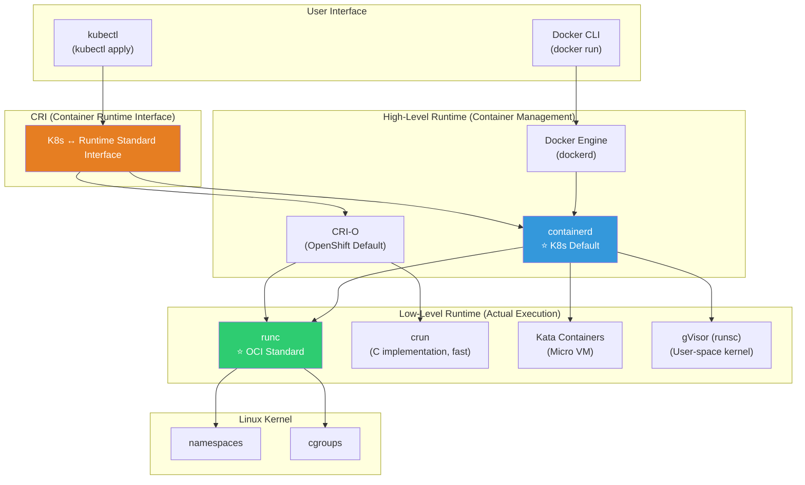
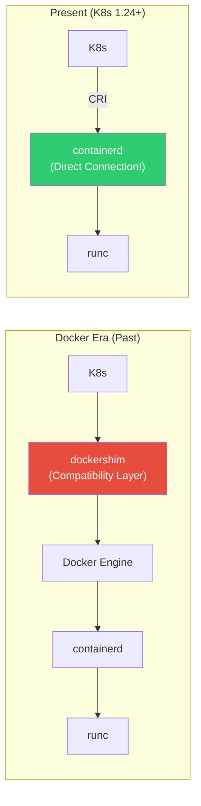
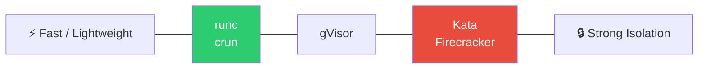

# Container Runtime (containerd / CRI-O / runc)

> "Running containers without Docker?" — In K8s production, we've already been running containers without Docker. Let's explore the world of runtimes that actually create and execute containers behind Docker.

---

## 🎯 Why do you need to know this?

```
Understanding this concept helps you grasp:
• "K8s removed Docker" — what that actually means    → CRI + containerd
• Debugging containers on K8s nodes (crictl)         → Instead of Docker CLI
• Runtime selection (containerd vs CRI-O)            → For cluster setup
• Container security (runc vs gVisor vs Kata)        → Isolation by workload
• Why "OCI compatible" matters                        → Runtime interoperability
• Docker build alternatives (Kaniko, buildah)        → CI/CD optimization
```

In the [previous lecture](./01-concept), we briefly covered the runtime stack. This time we'll dive deeper.

---

## 🧠 Core Concepts

### Analogy: Car Engine Layers

Let's think of container runtimes like a **car**.

* **Docker CLI / kubectl** = Steering wheel, controls. The interface users interact with
* **Docker Engine / containerd** = Transmission, drive system. Connects engine to wheels
* **runc** = The engine itself. Actually creates and runs container (process)

Users only hold the steering wheel, but the engine actually moves the car.

### Full Runtime Stack Diagram



### High-Level vs Low-Level Runtime

| Aspect | High-Level | Low-Level |
|--------|-----------|-----------|
| Role | Image management, container lifecycle | Actual process creation |
| Tasks | pull, snapshots, networking, storage | namespace/cgroup setup, exec |
| Examples | containerd, CRI-O | runc, crun, kata, gVisor |
| Analogy | Chef (prep ingredients, plate dishes) | Oven/flame (actual cooking) |

---

## 🔍 Detailed Explanation — containerd

### What is containerd?

A container runtime that separated from Docker as an independent project. **The default runtime for K8s**.



```bash
# Check containerd status
systemctl status containerd
# ● containerd.service - containerd container runtime
#      Active: active (running) since ...

# containerd version
containerd --version
# containerd github.com/containerd/containerd v1.7.2 ...

# containerd configuration
cat /etc/containerd/config.toml
# [plugins."io.containerd.grpc.v1.cri"]
#   [plugins."io.containerd.grpc.v1.cri".containerd]
#     default_runtime_name = "runc"
#     [plugins."io.containerd.grpc.v1.cri".containerd.runtimes.runc]
#       runtime_type = "io.containerd.runc.v2"
```

### ctr — containerd Native CLI

```bash
# ctr is containerd's low-level CLI (debugging/management)
# Docker CLI or crictl are more commonly used

# List namespaces (containerd namespaces, different from K8s!)
sudo ctr namespaces ls
# NAME    LABELS
# default
# k8s.io           ← K8s namespace
# moby             ← Docker namespace

# List K8s containers
sudo ctr -n k8s.io containers ls
# CONTAINER    IMAGE                          RUNTIME
# abc123       registry.k8s.io/pause:3.9      io.containerd.runc.v2
# def456       docker.io/library/nginx:latest io.containerd.runc.v2

# List images
sudo ctr -n k8s.io images ls | head -5
# REF                                    TYPE                   SIZE
# docker.io/library/nginx:latest         application/vnd.oci... 67.2 MiB
# registry.k8s.io/pause:3.9             application/vnd.oci... 320.0 KiB

# Pull image
sudo ctr -n default images pull docker.io/library/alpine:latest

# Run container (low-level — usually not done this way)
sudo ctr -n default run --rm docker.io/library/alpine:latest test echo "hello"
# hello
```

### crictl — CRI Compatible CLI (★ Essential on K8s nodes!)

```bash
# crictl: Standard tool for managing containers on K8s nodes
# Similar to Docker CLI but communicates with containerd/CRI-O via CRI

# Configuration (when using containerd)
cat /etc/crictl.yaml
# runtime-endpoint: unix:///run/containerd/containerd.sock
# image-endpoint: unix:///run/containerd/containerd.sock

# === Docker CLI ↔ crictl Mapping ===

# Container list
sudo crictl ps
# CONTAINER   IMAGE          CREATED      STATE     NAME      POD ID
# abc123      nginx:latest   2 hours ago  Running   nginx     xyz789
# def456      redis:7        1 hour ago   Running   redis     uvw456

# Comparison with docker ps:
# docker ps         →  crictl ps
# docker ps -a      →  crictl ps -a
# docker images     →  crictl images (or crictl img)
# docker logs       →  crictl logs
# docker exec       →  crictl exec
# docker inspect    →  crictl inspect
# docker pull       →  crictl pull
# docker stop       →  crictl stop
# docker rm         →  crictl rm

# Container logs
sudo crictl logs abc123
# 2025/03/12 10:00:00 [notice] ... nginx started

sudo crictl logs --tail 20 abc123          # Last 20 lines
sudo crictl logs --follow abc123           # Real-time logs

# Shell access to container
sudo crictl exec -it abc123 sh
# / # ps aux
# PID   USER   COMMAND
# 1     root   nginx: master process
# / # exit

# Image list
sudo crictl images
# IMAGE                    TAG       IMAGE ID       SIZE
# docker.io/library/nginx  latest    a8758716bb6a   67.2MB
# docker.io/library/redis  7         b5f28e5b6f3c   45.3MB
# registry.k8s.io/pause    3.9       7031c1b28338   320kB

# Pod list (K8s Pod units)
sudo crictl pods
# POD ID    CREATED      STATE   NAME              NAMESPACE
# xyz789    2 hours ago  Ready   nginx-deploy-abc  default
# uvw456    1 hour ago   Ready   redis-deploy-def  default

# Pull image
sudo crictl pull nginx:latest
# Image is up to date for docker.io/library/nginx:latest

# Container details
sudo crictl inspect abc123 | python3 -m json.tool | head -30
# {
#   "status": {
#     "id": "abc123...",
#     "state": "CONTAINER_RUNNING",
#     "createdAt": "2025-03-12T10:00:00.000Z",
#     "image": {"image": "docker.io/library/nginx:latest"},
#     ...
#   }
# }

# System statistics
sudo crictl stats
# CONTAINER   CPU %   MEM           DISK          INODES
# abc123      0.50%   15.5MiB       4.0kB         12
# def456      1.20%   25.3MiB       8.0kB         20

# Clean up unused images
sudo crictl rmi --prune
```

```bash
# === Practical: Debugging on K8s Nodes ===

# "Pod is in CrashLoopBackOff and I can't see logs"
# → When kubectl logs fails, SSH to node and use crictl

# 1. SSH to node
ssh node-1

# 2. Find problem Pod's container
sudo crictl pods --name my-crashing-pod
# POD ID    NAME                 STATE
# abc123    my-crashing-pod-xyz  NotReady

# 3. Check Pod's containers (including exited ones)
sudo crictl ps -a --pod abc123
# CONTAINER  STATE     NAME      POD ID
# def456     Exited    myapp     abc123

# 4. Check logs
sudo crictl logs def456
# Error: Cannot connect to database
# → Found the issue!
```

---

## 🔍 Detailed Explanation — CRI-O

### What is CRI-O?

CRI-O is a lightweight runtime **built specifically for K8s**. The default runtime for Red Hat/OpenShift.

```bash
# CRI-O characteristics:
# ✅ Optimized for K8s CRI (no unnecessary features)
# ✅ Lightweight (smaller than containerd)
# ✅ OCI compatible
# ✅ Supported by Red Hat/OpenShift
# ❌ Not Docker CLI compatible (crictl only)
# ❌ Cannot run independent containers (K8s only)

# Check CRI-O status (on a node using CRI-O)
systemctl status crio
# ● crio.service - Container Runtime Interface for OCI
#    Active: active (running) since ...

# CRI-O version
crio --version
# crio version 1.28.0

# Manage with crictl (same as containerd!)
sudo crictl ps
sudo crictl logs CONTAINER_ID
sudo crictl images
```

### containerd vs CRI-O

| Item | containerd | CRI-O |
|------|-----------|-------|
| Developer | CNCF (from Docker) | Red Hat/CNCF |
| Purpose | General (K8s + standalone) | K8s only |
| Docker compatible | ✅ (Docker uses it internally) | ❌ |
| K8s default | EKS, GKE, AKS, kubeadm | OpenShift |
| Size | Medium | Smaller |
| Features | Rich (image build, etc.) | Minimal (K8s only) |
| ctr CLI | ✅ | ❌ |
| crictl | ✅ | ✅ |
| Recommended | ⭐ Most cases | OpenShift environments |

```bash
# Check runtime on K8s node
kubectl get nodes -o wide
# NAME    STATUS  VERSION  CONTAINER-RUNTIME
# node-1  Ready   v1.28    containerd://1.7.2
# node-2  Ready   v1.28    containerd://1.7.2
# Or:
# node-1  Ready   v1.28    cri-o://1.28.0

# → Most managed K8s (EKS, GKE, AKS) use containerd
# → OpenShift uses CRI-O
```

---

## 🔍 Detailed Explanation — runc (Low-Level Runtime)

### What is runc?

runc is the **reference implementation of OCI Runtime Spec**. It actually sets up Linux namespaces and cgroups to create container processes.

```bash
# Check runc version
runc --version
# runc version 1.1.9
# spec: 1.0.2-dev
# go: go1.20.8

# What runc does (internally):
# 1. Read OCI bundle (config.json + rootfs)
# 2. Create Linux namespaces (PID, Net, Mount, ...)
# 3. Set up cgroups (CPU, memory limits)
# 4. Apply seccomp filters
# 5. Execute process (exec)
# → All of this uses Linux kernel features! (../01-linux/13-kernel, ../01-linux/14-security)
```

```bash
# Create container directly with runc (educational — not usually done this way)

# 1. Prepare OCI bundle
mkdir -p /tmp/runc-test/rootfs
cd /tmp/runc-test

# Extract Alpine rootfs
docker export $(docker create alpine) | tar -C rootfs -xf -

# 2. Create OCI config.json
runc spec
# → config.json is created (OCI Runtime Spec)

# 3. config.json contents (key parts):
cat config.json | python3 -m json.tool | head -40
# {
#     "ociVersion": "1.0.2-dev",
#     "process": {
#         "terminal": true,
#         "user": {"uid": 0, "gid": 0},
#         "args": ["sh"],                 ← Process to run
#         "env": ["PATH=/usr/local/sbin:..."],
#         "cwd": "/"
#     },
#     "root": {
#         "path": "rootfs",               ← Filesystem path
#         "readonly": true
#     },
#     "linux": {
#         "namespaces": [
#             {"type": "pid"},            ← PID namespace
#             {"type": "network"},        ← Network namespace
#             {"type": "ipc"},
#             {"type": "uts"},
#             {"type": "mount"}
#         ],
#         "resources": {                  ← cgroup resource limits
#             "memory": {"limit": 536870912},
#             ...
#         }
#     }
# }

# 4. Run with runc directly!
sudo runc run my-container
# / # ps
# PID   USER   COMMAND
# 1     root   sh       ← PID 1! namespace isolated!
# / # hostname
# runc                   ← UTS namespace isolated!
# / # exit

# → Container runs without Docker!
# → runc set up namespace + cgroup and ran sh

# Cleanup
cd /
sudo rm -rf /tmp/runc-test
```

### Alternative Low-Level Runtimes

```bash
# === crun (C implementation) ===
# Faster than runc (Go) and uses less memory
# Can be used as default runtime for CRI-O
crun --version
# crun version 1.8.7
# spec: 1.0.0

# Advantages: ~50% faster startup than runc, ~50% less memory
# Disadvantage: Not as battle-tested as runc

# Configure crun in containerd:
# /etc/containerd/config.toml
# [plugins."io.containerd.grpc.v1.cri".containerd.runtimes.crun]
#   runtime_type = "io.containerd.runc.v2"
#   [plugins."io.containerd.grpc.v1.cri".containerd.runtimes.crun.options]
#     BinaryName = "/usr/bin/crun"
```

```bash
# === Kata Containers (Micro VM) ===
# Creates a lightweight VM per container! → VM-level isolation

# Architecture:
# containerd → kata-runtime → QEMU/Firecracker → lightweight VM → container
# → Each container has its own kernel!

# Advantages: VM-level security isolation (kernel separation)
# Disadvantages: Slow startup (~1 second), resource overhead

# Use Kata in K8s (RuntimeClass):
apiVersion: node.k8s.io/v1
kind: RuntimeClass
metadata:
  name: kata
handler: kata    # kata runtime registered in containerd

# Use in Pod:
apiVersion: v1
kind: Pod
metadata:
  name: secure-pod
spec:
  runtimeClassName: kata    # ← Run in Kata VM!
  containers:
  - name: myapp
    image: myapp:latest
```

```bash
# === gVisor (runsc) ===
# Emulates Linux kernel in user space
# → App doesn't make direct syscalls to host kernel!

# Architecture:
# containerd → runsc → gVisor kernel (user-space) → app
# → App syscalls are intercepted by gVisor

# Advantages: Reduced host kernel attack surface, safer than runc
# Disadvantages: Not all syscalls compatible, performance overhead (~10-30%)

# Use gVisor in GKE:
# GKE Sandbox = gVisor-based
# Enable sandbox_config when creating node pool
# → Recommended for multi-tenant environments
```

### Runtime Comparison

| Runtime | Isolation Level | Startup Time | Overhead | Use Case |
|---------|-----------------|--------------|----------|----------|
| **runc** | Process (namespace) | ~100ms | Minimal | ⭐ Default, most cases |
| **crun** | Process (namespace) | ~50ms | Minimal | Performance optimization |
| **gVisor** | User-space kernel | ~200ms | 10~30% | Multi-tenant, untrusted code |
| **Kata** | Micro VM | ~1s | 50~100MB memory | Strong isolation needed |
| **Firecracker** | Micro VM | ~125ms | ~5MB memory | Lambda/Fargate |



---

## 🔍 Detailed Explanation — Docker Alternative Build Tools

### Building Images Inside K8s

Build tools that compile Dockerfile images inside K8s without Docker daemon.

```bash
# === Kaniko (Google) ===
# Build Dockerfile without Docker daemon
# → Build images inside K8s Pods!
# → Most common in CI/CD pipelines

# Run Kaniko as K8s Job:
apiVersion: batch/v1
kind: Job
metadata:
  name: kaniko-build
spec:
  template:
    spec:
      containers:
      - name: kaniko
        image: gcr.io/kaniko-project/executor:latest
        args:
        - "--dockerfile=Dockerfile"
        - "--context=git://github.com/myorg/myapp.git"
        - "--destination=123456789.dkr.ecr.ap-northeast-2.amazonaws.com/myapp:v1.0"
        volumeMounts:
        - name: docker-config
          mountPath: /kaniko/.docker
      volumes:
      - name: docker-config
        secret:
          secretName: ecr-credentials
      restartPolicy: Never

# Kaniko advantages:
# ✅ No Docker daemon required (secure!)
# ✅ Run in K8s Pod (no Docker-in-Docker needed)
# ✅ Dockerfile compatible
# ✅ Layer cache support

# === buildah (Red Hat) ===
# CLI tool for building OCI images
# Podman's build engine

buildah bud -t myapp:v1.0 .          # Build with Dockerfile
buildah push myapp:v1.0 docker://registry.example.com/myapp:v1.0

# buildah advantages:
# ✅ Daemonless
# ✅ rootless build possible
# ✅ Both Dockerfile and script builds
# ✅ Integrated with Podman

# === BuildKit (Docker) ===
# Docker's next-gen build engine
# Default in Docker 23+

DOCKER_BUILDKIT=1 docker build -t myapp .

# BuildKit advantages:
# ✅ Parallel builds (independent stages)
# ✅ Secret mount (--mount=type=secret)
# ✅ SSH forwarding (--mount=type=ssh)
# ✅ Cache export/import
# ✅ Multi-platform build (buildx)

# Multi-architecture build:
docker buildx build --platform linux/amd64,linux/arm64 \
    -t myapp:v1.0 --push .
# → Build AMD64 and ARM64 images simultaneously!
```

### Build Tool Comparison

| Tool | Daemon Required? | Dockerfile? | In K8s? | Multi-Arch | Recommended |
|------|------------------|-----------|---------|-----------|-------------|
| **docker build** | ✅ dockerd | ✅ | ⚠️ DinD needed | ✅ buildx | Local dev |
| **Kaniko** | ❌ | ✅ | ✅ Native | ❌ | ⭐ K8s CI/CD |
| **buildah** | ❌ | ✅ + scripts | ✅ | ❌ | Podman env |
| **BuildKit** | ✅ buildkitd | ✅ | ✅ | ✅ | Advanced builds |
| **ko** | ❌ | ❌ (Go only) | ✅ | ✅ | Go apps only |

---

## 💻 Practice Exercises

### Exercise 1: Debug K8s Nodes with crictl

```bash
# SSH to K8s node (or minikube/kind)

# 1. Check container runtime
kubectl get nodes -o wide | awk '{print $1, $NF}'
# NAME     CONTAINER-RUNTIME
# node-1   containerd://1.7.2

# 2. Check Pods/containers with crictl
sudo crictl pods
# POD ID   NAME                     NAMESPACE     STATE
# abc123   coredns-5644d7b6d9-xyz   kube-system   Ready
# def456   nginx-deploy-abc-123     default       Ready

sudo crictl ps
# CONTAINER  IMAGE          STATE     NAME      POD ID
# 111222     nginx:latest   Running   nginx     def456
# 333444     coredns:1.11   Running   coredns   abc123

# 3. Check container logs
sudo crictl logs 111222 --tail 10

# 4. Access container shell
sudo crictl exec -it 111222 sh
# / # nginx -v
# nginx version: nginx/1.25.3
# / # exit

# 5. Manage images
sudo crictl images
sudo crictl rmi --prune    # Delete unused images

# 6. Container resource usage
sudo crictl stats
# CONTAINER  CPU %   MEM
# 111222     0.30%   15.5MiB
# 333444     0.10%   20.1MiB
```

### Exercise 2: Use containerd Directly (ctr)

```bash
# On environment with containerd installed

# 1. Pull image
sudo ctr -n default images pull docker.io/library/alpine:latest
# docker.io/library/alpine:latest: resolved
# manifest-sha256:abc123... done
# elapsed: 2.5s

# 2. List images
sudo ctr -n default images ls
# REF                          TYPE                SIZE
# docker.io/library/alpine:latest application/vnd... 3.4 MiB

# 3. Run container
sudo ctr -n default run --rm docker.io/library/alpine:latest test-ctr echo "Hello from containerd!"
# Hello from containerd!

# 4. Check containers in K8s namespace
sudo ctr -n k8s.io containers ls | head -5
# → K8s-created containers

# 5. Delete image
sudo ctr -n default images rm docker.io/library/alpine:latest
```

### Exercise 3: Select Runtime by Pod (RuntimeClass Concept)

```yaml
# In K8s, you can use different runtimes per Pod

# 1. Define RuntimeClass
apiVersion: node.k8s.io/v1
kind: RuntimeClass
metadata:
  name: high-security
handler: kata              # kata runtime registered in containerd
scheduling:
  nodeSelector:
    runtime: kata           # Schedule only on nodes with kata

---
# 2. Use RuntimeClass in Pod
apiVersion: v1
kind: Pod
metadata:
  name: secure-workload
spec:
  runtimeClassName: high-security    # ← Run in Kata VM!
  containers:
  - name: untrusted-code
    image: user-submitted-code:latest
    resources:
      limits:
        memory: "256Mi"
        cpu: "500m"
```

```bash
# Check RuntimeClass list
kubectl get runtimeclass
# NAME            HANDLER   AGE
# high-security   kata      30d
# gvisor          runsc     30d

# Check which runtime a Pod uses
kubectl get pod secure-workload -o jsonpath='{.spec.runtimeClassName}'
# high-security
```

---

## 🏢 In Practice

### Scenario 1: "docker ps doesn't work on K8s node"

```bash
# K8s 1.24+ → No Docker! Use containerd directly

# ❌
docker ps
# bash: docker: command not found

# ✅ Use crictl
sudo crictl ps
# CONTAINER  IMAGE   STATE    NAME    POD ID
# ...

# ✅ Or use kubectl (no node access needed)
kubectl get pods -o wide
kubectl logs POD_NAME
kubectl exec -it POD_NAME -- sh

# Docker tasks and alternatives:
# docker build  → Kaniko, buildah, docker buildx (separate build server)
# docker ps     → crictl ps, kubectl get pods
# docker logs   → crictl logs, kubectl logs
# docker exec   → crictl exec, kubectl exec
# docker images → crictl images
```

### Scenario 2: Runtime-Related Pod Failure

```bash
# Pod in ContainerCannotRun state

kubectl describe pod failing-pod
# Events:
#   Warning  Failed  ... Error: failed to create containerd task:
#   ... OCI runtime create failed: unable to start container process:
#   exec: "/app/server": permission denied

# Cause: Executable missing permissions or user permission issue

# Debugging:
# 1. Check containerd logs on node
sudo journalctl -u containerd --since "5 min ago" | grep -i error

# 2. Check runc error
sudo journalctl -u containerd | grep "OCI runtime"
# OCI runtime create failed: ... permission denied

# 3. Check image file permissions
docker run --rm --entrypoint sh myapp:latest -c "ls -la /app/server"
# -rw-r--r-- root root ... /app/server    ← No execute permission!

# Solution: Add chmod in Dockerfile
# RUN chmod +x /app/server
# Or ensure build preserves execute permissions
```

### Scenario 3: Container Runtime Upgrade

```bash
# Upgrade containerd on K8s node procedure

# 1. Drain node (move Pods)
kubectl drain node-1 --ignore-daemonsets --delete-emptydir-data

# 2. Upgrade containerd
sudo apt update
sudo apt install containerd.io=1.7.5-1
# Or replace binary

# 3. Restart containerd
sudo systemctl restart containerd

# 4. Check status
sudo systemctl status containerd
containerd --version
sudo crictl ps    # Existing containers OK?

# 5. Uncordon node (resume Pod scheduling)
kubectl uncordon node-1

# 6. Verify
kubectl get nodes -o wide
# node-1  Ready  containerd://1.7.5    ← Upgraded!

# ⚠️ Upgrade runtimes sequentially per node!
# → Don't upgrade all nodes simultaneously or service goes down!
```

---

## ⚠️ Common Mistakes

### 1. Attempting docker command on K8s node with 1.24+

```bash
# ❌ No Docker on K8s 1.24+!
docker ps    # command not found

# ✅ Use crictl
sudo crictl ps
sudo crictl logs CONTAINER_ID
sudo crictl exec -it CONTAINER_ID sh
```

### 2. Thinking Docker images won't work in K8s

```bash
# ❌ "K8s removed Docker, so Docker images won't work?"
# → Wrong! OCI standard means compatible!

# ✅ Docker-built images run in containerd/CRI-O
docker build -t myapp:v1.0 .
docker push myrepo/myapp:v1.0
# → Works in K8s! (containerd pulls OCI images)
```

### 3. Confusing containerd config with Docker config

```bash
# ❌ Modified /etc/docker/daemon.json but K8s doesn't apply
# → K8s uses containerd directly, Docker config irrelevant!

# ✅ Modify containerd config
sudo vim /etc/containerd/config.toml
sudo systemctl restart containerd

# Private registry config goes in containerd:
# /etc/containerd/config.toml
# [plugins."io.containerd.grpc.v1.cri".registry.mirrors]
#   [plugins."io.containerd.grpc.v1.cri".registry.mirrors."myregistry.com"]
#     endpoint = ["https://myregistry.com"]
```

### 4. Not considering runtime isolation levels

```bash
# ❌ Running untrusted external code with default runc
# → Kernel exploits can escape!

# ✅ Run untrusted code with gVisor or Kata
# RuntimeClass: kata or gvisor
```

### 5. Not configuring crictl

```bash
# ❌ crictl errors
sudo crictl ps
# WARN: runtime connect using default endpoints: [unix:///var/run/dockershim.sock ...]
# FATA: unable to determine runtime API version

# ✅ Configure crictl
cat << 'EOF' | sudo tee /etc/crictl.yaml
runtime-endpoint: unix:///run/containerd/containerd.sock
image-endpoint: unix:///run/containerd/containerd.sock
timeout: 10
EOF

sudo crictl ps    # Works!
```

---

## 📝 Summary

### Runtime Stack Structure

```
User:      Docker CLI / kubectl
           ↓
High-Level: Docker Engine → containerd (K8s default)
           CRI-O (OpenShift)
           ↓
Low-Level:  runc (default) / crun (fast) / kata (VM) / gVisor (secure)
           ↓
Kernel:    namespaces + cgroups
```

### Docker CLI ↔ crictl Mapping

```bash
docker ps          →  sudo crictl ps
docker logs        →  sudo crictl logs
docker exec -it    →  sudo crictl exec -it
docker images      →  sudo crictl images
docker inspect     →  sudo crictl inspect
docker pull        →  sudo crictl pull
docker stats       →  sudo crictl stats
```

### Runtime Selection Guide

```
Most cases:           runc (containerd default) → Sufficient!
OpenShift:           crun (CRI-O default)
Multi-tenant/untrusted: gVisor → Kernel isolation
Strong security:      Kata Containers → VM-level
Serverless:           Firecracker → AWS Lambda/Fargate
```

### Build Tool Selection Guide

```
Local development:    docker build (or docker buildx)
K8s CI/CD:           Kaniko ⭐ (no daemon required)
Podman environments:  buildah
Multi-architecture:   docker buildx
Go apps only:        ko
```

---

## 🔗 Next Lecture

Next is **[05-networking](./05-networking)** — Container Networking (bridge / overlay / host).

How do containers communicate with each other? How do containers talk to hosts? How do external systems access containers? Container networking uses the same principles as regular networking, but adds virtual interfaces and NAT. We'll learn everything about container networking.
