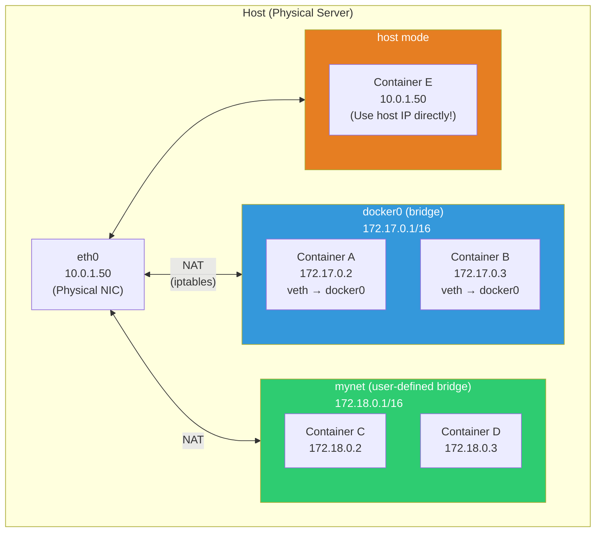
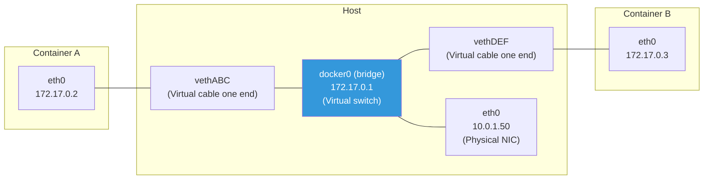
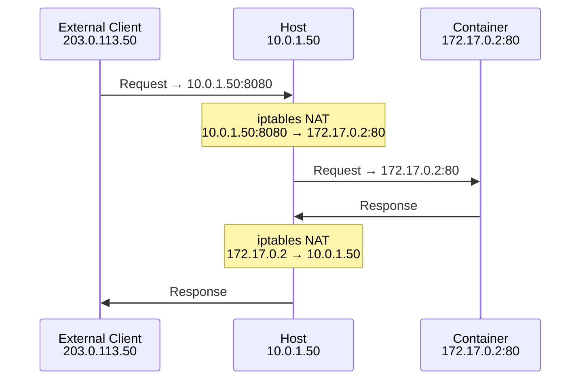
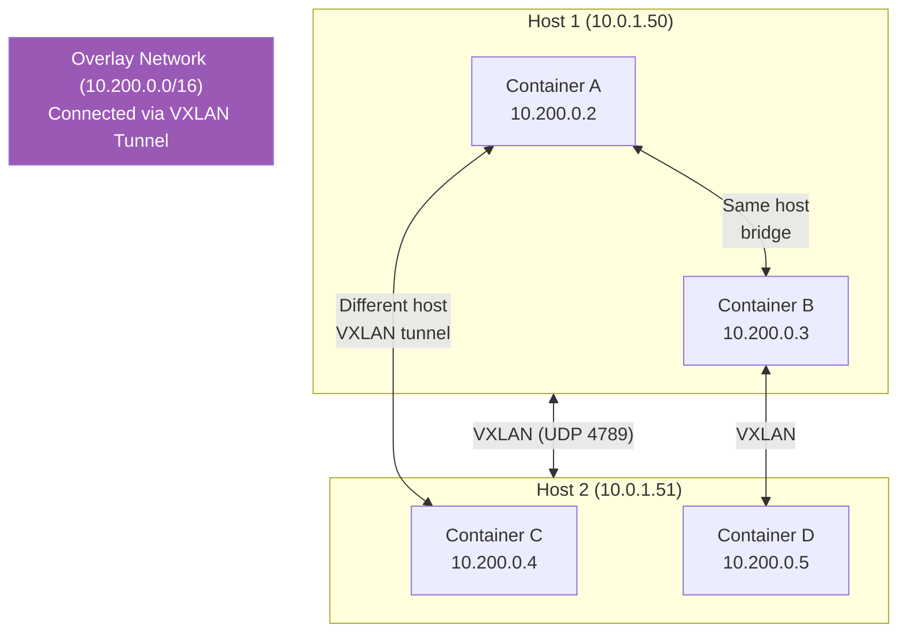
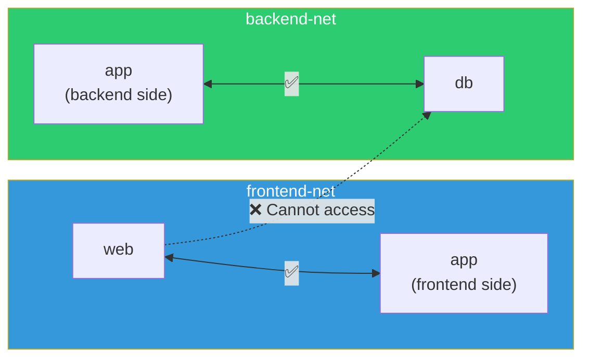

# Container Networking (bridge / overlay / host)

> How does container A send packets to container B? How do containers and hosts communicate? How do external systems access containers? Container networking uses the same principles as regular networking, but adds virtual interfaces and NAT.

---

## 🎯 Why do you need to know this?

```
Container networking knowledge is needed in practice when:
• "Containers can't communicate"                → Understand bridge networking
• "Can't access container from outside"         → Port mapping, NAT
• "docker-compose services talk by name"        → User-defined networking
• Understanding K8s Pod network                 → overlay network principles
• "localhost doesn't work in containers"        → Network isolation
• Docker networking performance tuning          → host network mode
```

---

## 🧠 Core Concepts

### Analogy: Office Network

Let's compare container networking to an **office network**.

* **bridge** = Office internal switch. Containers on same host communicate via bridge
* **host** = Remove office walls, connect directly to building network. Fast but no isolation
* **overlay** = Connect offices across buildings with VPN
* **none** = Unplug network cable. Complete isolation



---

## 🔍 Detailed Explanation — bridge Networking (Default)

### How Bridge Works

Docker creates a **virtual bridge (switch)** called `docker0`. When you run containers, they're connected via **veth pairs** (virtual ethernet).



```bash
# === See bridge networking in action ===

# 1. Check docker0 bridge
ip addr show docker0
# 4: docker0: <BROADCAST,MULTICAST,UP,LOWER_UP> mtu 1500 ...
#     inet 172.17.0.1/16 brd 172.17.255.255 scope global docker0
#          ^^^^^^^^^^^
#          bridge gateway IP

# 2. Run containers
docker run -d --name test1 alpine sleep 3600
docker run -d --name test2 alpine sleep 3600

# 3. Check veth pairs (on host)
ip link show type veth
# 5: vethABC@if4: <BROADCAST,MULTICAST,UP,LOWER_UP> ...
#     master docker0            ← Connected to docker0!
# 7: vethDEF@if6: <BROADCAST,MULTICAST,UP,LOWER_UP> ...
#     master docker0

# 4. Check interfaces connected to bridge
bridge link show
# 5: vethABC@if4: <...> master docker0
# 7: vethDEF@if6: <...> master docker0

# 5. Check network inside container
docker exec test1 ip addr show eth0
# 4: eth0@if5: <BROADCAST,MULTICAST,UP,LOWER_UP> ...
#     inet 172.17.0.2/16 brd 172.17.255.255 scope global eth0
#          ^^^^^^^^^^^
#          container IP

docker exec test1 ip route
# default via 172.17.0.1 dev eth0
# 172.17.0.0/16 dev eth0 scope link src 172.17.0.2
# → Gateway is 172.17.0.1 (docker0)

# 6. Test container-to-container communication
docker exec test1 ping -c 2 172.17.0.3
# PING 172.17.0.3 (172.17.0.3): 56 data bytes
# 64 bytes from 172.17.0.3: seq=0 ttl=64 time=0.100 ms
# → Direct communication on same bridge! ✅

# ⚠️ Name resolution doesn't work on default bridge!
docker exec test1 ping -c 2 test2
# ping: bad address 'test2'    ← DNS resolution fails! ❌

# 7. Cleanup
docker rm -f test1 test2
```

### User-Defined Bridge (★ Always Use This in Practice!)

```bash
# With user-defined bridge:
# ✅ Containers resolve DNS by name!
# ✅ Network isolation (containers in different bridges isolated)
# ✅ Runtime connect/disconnect flexibility

# 1. Create network
docker network create myapp-net
# → New subnet like 172.18.0.0/16 is assigned

docker network inspect myapp-net --format '{{range .IPAM.Config}}{{.Subnet}}{{end}}'
# 172.18.0.0/16

# 2. Connect containers to this network
docker run -d --name app --network myapp-net alpine sleep 3600
docker run -d --name db --network myapp-net alpine sleep 3600

# 3. Name resolution works! ✅
docker exec app ping -c 2 db
# PING db (172.18.0.3): 56 data bytes
# 64 bytes from 172.18.0.3: seq=0 ttl=64 time=0.089 ms
# → "db" name resolves to IP!

# 4. Check Docker built-in DNS
docker exec app cat /etc/resolv.conf
# nameserver 127.0.0.11
# → 127.0.0.11 = Docker's built-in DNS server
# → Resolves container names on same network

docker exec app nslookup db
# Server:    127.0.0.11
# Name:      db
# Address 1: 172.18.0.3 db.myapp-net
# → "db" → 172.18.0.3 resolution! ✅

# 5. Containers in different networks are isolated
docker run -d --name other --network bridge alpine sleep 3600
docker exec other ping -c 1 172.18.0.2
# → Timeout! (different network)

# 6. Cleanup
docker rm -f app db other
docker network rm myapp-net
```

### Default bridge vs User-Defined bridge Comparison

| Item | Default bridge (docker0) | User-defined bridge |
|------|--------------------------|-------------------|
| DNS resolution | ❌ (IP only) | ✅ (by name) |
| Auto-connect | ✅ (default) | --network required |
| Isolation | All default containers shared | Per-network isolation |
| Runtime connect/disconnect | ❌ | ✅ `docker network connect/disconnect` |
| Production recommended | ❌ Not recommended | ⭐ Always use this! |

---

## 🔍 Detailed Explanation — Port Mapping and NAT

### Access Containers from Outside

Container IPs (172.17.x.x) are **inaccessible from outside the host**. To access from outside, **port mapping** is needed.



```bash
# Port mapping (-p HOST:CONTAINER)
docker run -d -p 8080:80 --name web nginx
# → Host port 8080 → Container port 80

# Check NAT rules created by Docker
sudo iptables -t nat -L -n | grep 8080
# DNAT  tcp  --  0.0.0.0/0  0.0.0.0/0  tcp dpt:8080 to:172.17.0.2:80
# → Incoming TCP on port 8080 is DNAT'd to 172.17.0.2:80!

# Access from outside
curl http://10.0.1.50:8080
# Welcome to nginx!  ← Container's Nginx responds!

# Check port mapping
docker port web
# 80/tcp -> 0.0.0.0:8080
#            ^^^^^^^^
#            Listen on all interfaces

# Bind to specific IP only (secure!)
docker run -d -p 127.0.0.1:8080:80 --name local-only nginx
# → Accessible from localhost only! No external access

docker run -d -p 10.0.1.50:8080:80 --name specific nginx
# → Accessible from specific IP only

# Cleanup
docker rm -f web local-only specific 2>/dev/null
```

### Container Outbound to Internet (SNAT/MASQUERADE)

```bash
# When container accesses internet:
# Container(172.17.0.2) → NAT(MASQUERADE) → Host IP(10.0.1.50) → Internet

# Docker creates MASQUERADE rule
sudo iptables -t nat -L POSTROUTING -n -v | grep docker
# MASQUERADE  all  --  *    !docker0  172.17.0.0/16  0.0.0.0/0
# → Outbound packets from 172.17.x.x are rewritten with host IP

# Verify: Container access to internet
docker run --rm alpine wget -qO- ifconfig.me
# 10.0.1.50    ← Host's public IP! (NAT'd)
```

---

## 🔍 Detailed Explanation — host Network Mode

### What is host Mode?

Container uses **host's network stack directly**. No isolation, directly attached to host network.

```bash
# Run in host mode
docker run -d --network host --name web-host nginx
# → No port mapping needed! Nginx binds directly to host port 80

# Use host's network directly
docker exec web-host ip addr show eth0
# → Shows host's eth0! (not 172.17.x.x but 10.0.1.50)

# Access without port mapping
curl http://localhost:80
# Welcome to nginx!    ← Direct access!

ss -tlnp | grep 80
# LISTEN  0.0.0.0:80  ... nginx
# → Host's port 80 occupied by Nginx

docker rm -f web-host
```

**host Mode Pros and Cons:**

| Pros | Cons |
|------|------|
| No NAT overhead → **Best performance** | No network isolation |
| No port mapping needed | Port conflicts (host port taken) |
| Minimal latency | Poor security (host network exposed) |
| Useful for many ports | Poor portability |

```bash
# Use host mode when:
# ✅ Network performance critical (high-frequency trading, etc.)
# ✅ Many ports needed (monitoring agents, etc.)
# ✅ Host network manipulation required

# Don't use host mode for:
# ❌ Regular web services (bridge enough)
# ❌ Multi-container setup (port conflicts)
# ❌ Security-critical environments
```

---

## 🔍 Detailed Explanation — overlay Networking

### What is Overlay?

Allows containers across **multiple hosts** to communicate as if on same network. Used in Docker Swarm and K8s.



```bash
# Overlay operation:
# 1. Container A(10.200.0.2) sends packet to Container C(10.200.0.4)
# 2. Host 1 encapsulates in VXLAN
#    Original: src=10.200.0.2 dst=10.200.0.4
#    Encapsulated: src=10.0.1.50 dst=10.0.1.51 (UDP 4789) + original
# 3. Host 2 receives and removes VXLAN encapsulation
# 4. Original packet delivered to Container C

# This is the foundation of K8s Pod networking!
# → Calico, Flannel, Cilium use this principle
# → Covered in detail in 04-kubernetes/06-cni!
```

```bash
# Docker Swarm overlay network (educational):

# Create overlay network (needs Swarm init)
docker swarm init 2>/dev/null
docker network create --driver overlay --attachable my-overlay

# Connect container to overlay network
docker run -d --name overlay-test --network my-overlay alpine sleep 3600

# Network info
docker network inspect my-overlay --format '{{range .IPAM.Config}}{{.Subnet}}{{end}}'
# 10.0.1.0/24    ← overlay subnet

# Cleanup
docker rm -f overlay-test
docker network rm my-overlay
docker swarm leave --force 2>/dev/null
```

---

## 🔍 Detailed Explanation — none Networking

```bash
# none: Network completely disabled. Run in isolated environment.
docker run -d --network none --name isolated alpine sleep 3600

docker exec isolated ip addr
# 1: lo: <LOOPBACK,UP,LOWER_UP> ...
#     inet 127.0.0.1/8 scope host lo
# → Only loopback! No eth0!

docker exec isolated ping -c 1 8.8.8.8
# PING 8.8.8.8 (8.8.8.8): 56 data bytes
# ping: sendto: Network unreachable
# → External communication completely blocked!

# Use cases:
# ✅ Security: Network access unnecessary for batch jobs
# ✅ Testing: Simulate network-less environment
# ✅ Data processing: Process files only, no network

docker rm -f isolated
```

---

## 🔍 Detailed Explanation — Network Connect/Disconnect

```bash
# Connect one container to multiple networks

# Create 2 networks
docker network create frontend-net
docker network create backend-net

# App server: connect to both
docker run -d --name app --network frontend-net alpine sleep 3600
docker network connect backend-net app
# → app connected to both frontend-net + backend-net!

# DB: backend only
docker run -d --name db --network backend-net alpine sleep 3600

# Web: frontend only
docker run -d --name web --network frontend-net alpine sleep 3600

# Communication test:
docker exec web ping -c 1 app    # ✅ same frontend-net
docker exec app ping -c 1 db     # ✅ same backend-net
docker exec web ping -c 1 db     # ❌ different networks!

# → web can't access db directly! (secure!)
# → app acts as proxy between them

# Disconnect from network
docker network disconnect frontend-net app
# → app now on backend-net only

# Cleanup
docker rm -f app db web
docker network rm frontend-net backend-net
```



---

## 🔍 Detailed Explanation — Docker Compose Networking

```bash
# Docker Compose automatically creates project-specific network

# docker-compose.yml
# services:
#   app:
#     image: myapp
#   db:
#     image: postgres
#   redis:
#     image: redis

docker compose up -d
# Creating network "myproject_default" with the default driver
# → "myproject_default" network auto-created!

# All services auto-connected to this network
docker network inspect myproject_default
# → app, db, redis all connected
# → Can resolve by service name!

# Access DB from app:
# DB_HOST=db        ← service name!
# REDIS_HOST=redis   ← service name!
```

```yaml
# Explicitly define multiple networks (production pattern)
services:
  nginx:
    image: nginx
    ports:
      - "80:80"
    networks:
      - frontend

  app:
    image: myapp
    networks:
      - frontend       # Communicate with nginx
      - backend         # Communicate with DB, redis

  db:
    image: postgres
    networks:
      - backend         # Only reachable from app!

  redis:
    image: redis
    networks:
      - backend

networks:
  frontend:
    driver: bridge
  backend:
    driver: bridge
    internal: true      # ← Block external access! (no internet)
```

```bash
# internal network:
# → No outbound NAT to internet!
# → DB/Redis can't access internet (security!)

docker network create --internal secure-net
docker run --rm --network secure-net alpine ping -c 1 8.8.8.8
# ping: sendto: Network unreachable    ← External access blocked!

# But containers on same network can communicate!
```

---

## 🔍 Detailed Explanation — Container DNS

```bash
# Docker built-in DNS (127.0.0.11)

# Create test network
docker network create test-dns
docker run -d --name svc-a --network test-dns alpine sleep 3600
docker run -d --name svc-b --network test-dns alpine sleep 3600

# Check DNS
docker exec svc-a cat /etc/resolv.conf
# nameserver 127.0.0.11    ← Docker built-in DNS
# options ndots:0

docker exec svc-a nslookup svc-b
# Server:    127.0.0.11
# Name:      svc-b
# Address 1: 172.18.0.3 svc-b.test-dns

# DNS aliases (--network-alias)
docker run -d --name svc-c \
    --network test-dns \
    --network-alias database \
    alpine sleep 3600

docker exec svc-a nslookup database
# Address 1: 172.18.0.4    ← svc-c's IP
# → Also accessible via "database" alias!

# Multiple containers same alias → Round-robin DNS!
docker run -d --name svc-d --network test-dns --network-alias web alpine sleep 3600
docker run -d --name svc-e --network test-dns --network-alias web alpine sleep 3600

docker exec svc-a nslookup web
# Address 1: 172.18.0.5
# Address 2: 172.18.0.6
# → Returns 2 IPs! (simple load balancing)

# Cleanup
docker rm -f svc-a svc-b svc-c svc-d svc-e
docker network rm test-dns
```

---

## 💻 Practice Exercises

### Exercise 1: Explore bridge Networking

```bash
# 1. Check default bridge
docker network inspect bridge --format '{{range .IPAM.Config}}Subnet: {{.Subnet}} Gateway: {{.Gateway}}{{end}}'
# Subnet: 172.17.0.0/16 Gateway: 172.17.0.1

# 2. Check host docker0
ip addr show docker0

# 3. Run 2 containers
docker run -d --name a alpine sleep 3600
docker run -d --name b alpine sleep 3600

# 4. Observe veth pairs
ip link show type veth

# 5. Check container IPs
docker inspect a --format '{{.NetworkSettings.IPAddress}}'
# 172.17.0.2
docker inspect b --format '{{.NetworkSettings.IPAddress}}'
# 172.17.0.3

# 6. Communication test
docker exec a ping -c 2 172.17.0.3    # IP works ✅
docker exec a ping -c 2 b              # By name fails ❌ (default bridge)

# 7. Cleanup
docker rm -f a b
```

### Exercise 2: Service Architecture with User-Defined Networks

```bash
# 3-tier architecture: Web + API + DB

# 1. Create networks
docker network create web-tier
docker network create data-tier

# 2. DB (data-tier only)
docker run -d --name postgres \
    --network data-tier \
    -e POSTGRES_PASSWORD=secret \
    postgres:16-alpine

# 3. API server (both)
docker run -d --name api \
    --network data-tier \
    -e DB_HOST=postgres \
    alpine sleep 3600
docker network connect web-tier api

# 4. Web server (web-tier only)
docker run -d --name web \
    --network web-tier \
    -p 8080:80 \
    nginx

# 5. Communication test
docker exec api ping -c 1 postgres    # ✅ (same data-tier)
docker exec web ping -c 1 api         # ✅ (same web-tier)
docker exec web ping -c 1 postgres    # ❌ (different network!)
# → Web can't reach DB! Security ✅

# 6. Cleanup
docker rm -f web api postgres
docker network rm web-tier data-tier
```

### Exercise 3: host Mode vs bridge Mode Performance

```bash
# 1. bridge mode (NAT via iptables)
docker run -d --name bench-bridge -p 8080:80 nginx
time curl -s http://localhost:8080/ > /dev/null
# real    0m0.010s

# 2. host mode (direct, no NAT)
docker run -d --network host --name bench-host nginx
time curl -s http://localhost:80/ > /dev/null
# real    0m0.005s    ← Slightly faster (no NAT)

# High-volume requests show bigger difference:
# bridge: 100K req → ~10% overhead
# host:   100K req → Native performance

# Cleanup
docker rm -f bench-bridge bench-host
```

### Exercise 4: Observe NAT Rules with iptables

```bash
# 1. Run container with port mapping
docker run -d -p 9090:80 --name nat-test nginx

# 2. Check NAT rules created by Docker
sudo iptables -t nat -L -n -v | grep -A 2 "DOCKER"
# Chain DOCKER (2 references)
#  pkts bytes target  prot opt in  out  source    destination
#     5  300   DNAT   tcp  --  !docker0 *  0.0.0.0/0  0.0.0.0/0  tcp dpt:9090 to:172.17.0.2:80
#              ^^^^                                                ^^^^^^^^^^^^^^^^^^^^^^^^^^
#              DNAT!                                               Host 9090 → Container 80

# MASQUERADE rule (container → external)
sudo iptables -t nat -L POSTROUTING -n -v | grep docker
# MASQUERADE  all  --  *  !docker0  172.17.0.0/16  0.0.0.0/0
#             ^^^^^^^^^^^^^^^^^^^^^^^^^^^^^^^^^^^
#             Container → external rewrite host IP

# 3. Cleanup
docker rm -f nat-test
```

---

## 🏢 In Practice

### Scenario 1: "localhost doesn't work in container"

```bash
# App container tries localhost:5432 for DB → Fails!

# Cause: Container's localhost(127.0.0.1) = container itself!
# → Not the host!

# Solution 1: Docker Compose (service name)
# DB_HOST=db (not localhost!)

# Solution 2: host.docker.internal (Docker Desktop)
# DB_HOST=host.docker.internal    ← Special DNS pointing to host
# Linux: docker run --add-host=host.docker.internal:host-gateway ...

# Solution 3: host network mode
# docker run --network host myapp    ← Use host network directly

# Solution 4: Use host IP (not recommended — hardcoding)
# DB_HOST=10.0.1.50    ← Host's actual IP
```

### Scenario 2: "docker-compose services can't communicate"

```bash
# Cause 1: Service name typo
# DB_HOST=postgres → DB_HOST=postgress (typo!)
# → Check docker compose logs app

# Cause 2: depends_on ordering issue
# App starts before DB finishes initialization
# → Add depends_on + healthcheck

# Cause 3: Different networks
# → docker network inspect to verify
docker compose exec app nslookup db
# → If unresolved, check network config

# Cause 4: Host firewall/SELinux
# → Host iptables or SELinux blocking Docker networks
```

### Scenario 3: Container Network Performance Issue

```bash
# "Container-to-container communication is slow"

# 1. Check network mode
docker inspect myapp --format '{{.HostConfig.NetworkMode}}'
# default    ← bridge (via NAT)

# 2. Check if same host
# Same host containers: bridge direct (fast)
# Different hosts: overlay/VXLAN (encapsulation overhead)

# 3. Check MTU
docker exec myapp ip link show eth0
# mtu 1500    ← default
# → VXLAN overlay should be 1450 (encapsulation overhead)

# 4. Solutions:
# a. Need max performance → host network mode
# b. Adjust MTU → docker network create --opt com.docker.network.driver.mtu=1450 mynet
# c. K8s: CNI plugin choice important (Cilium uses eBPF = fast)
```

---

## ⚠️ Common Mistakes

### 1. Attempting name communication on default bridge

```bash
# ❌ Name resolution fails on default bridge!
docker run -d --name a alpine sleep 3600
docker run -d --name b alpine sleep 3600
docker exec a ping b    # bad address 'b'!

# ✅ Use user-defined network
docker network create mynet
docker run -d --name a --network mynet alpine sleep 3600
docker run -d --name b --network mynet alpine sleep 3600
docker exec a ping b    # Works!
```

### 2. Exposing database on 0.0.0.0

```bash
# ❌ All interfaces exposed (external access possible!)
docker run -d -p 3306:3306 mysql
# → Internet can access DB! Security risk!

# ✅ Specific interfaces only
docker run -d -p 127.0.0.1:3306:3306 mysql    # Localhost only
docker run -d -p 10.0.1.50:3306:3306 mysql     # Specific IP only
```

### 3. Confusing container localhost with host

```bash
# ❌ Container's localhost = container itself!
docker exec myapp curl http://localhost:5432
# → Looking for port 5432 in container (not host!)

# ✅ Docker Compose: use service names
# DB_HOST=db (not localhost!)
```

### 4. Not using internal networks

```bash
# ❌ DB can access internet
# → Risk of data exfiltration!

# ✅ DB on internal network
docker network create --internal data-net
docker run -d --network data-net --name db postgres
# → DB can't access internet! Security ✅
```

### 5. Leaving unused networks

```bash
# Orphaned networks from deleted projects
docker network ls
# myproject1_default
# myproject2_default
# test_net
# old_project_default
# ...

# ✅ Clean up regularly
docker network prune
# Deleted Networks:
# myproject1_default
# old_project_default
```

---

## 📝 Summary

### Network Driver Selection Guide

```
bridge (user-defined):  Most cases ⭐ (name resolution, isolation)
host:                   Performance critical, isolation not needed
overlay:                Multi-host (Swarm, K8s CNI)
none:                   Complete network isolation
macvlan:                Assign physical network IP to container
```

### Core Commands

```bash
docker network ls                       # List networks
docker network create NAME              # Create (⭐ always user-defined!)
docker network inspect NAME             # Details
docker network connect NET CONTAINER    # Connect container to network
docker network disconnect NET CONTAINER # Disconnect
docker network rm NAME                  # Delete
docker network prune                    # Remove unused

docker run --network NAME               # Specify network
docker run -p HOST:CONTAINER            # Port mapping
docker run --network host               # host mode
```

### Debugging Commands

```bash
# Check container IP
docker inspect CONTAINER --format '{{range .NetworkSettings.Networks}}{{.IPAddress}}{{end}}'

# Check network inside container
docker exec CONTAINER ip addr
docker exec CONTAINER cat /etc/resolv.conf
docker exec CONTAINER nslookup SERVICE_NAME

# Check veth/bridge on host
ip link show type veth
bridge link show
sudo iptables -t nat -L -n | grep DOCKER
```

---

## 🔗 Next Lecture

Next is **[06-image-optimization](./06-image-optimization)** — Image Optimization (multi-stage / distroless / multi-arch).

We learned Dockerfile basics in the [previous lecture](./03-dockerfile). Now it's advanced optimization techniques. Smaller images = faster pull, faster deploy, faster scaling, lower cost, fewer CVEs. "Reduce image size" is a common production request. We'll learn distroless, multi-architecture builds, and BuildKit advanced features.
