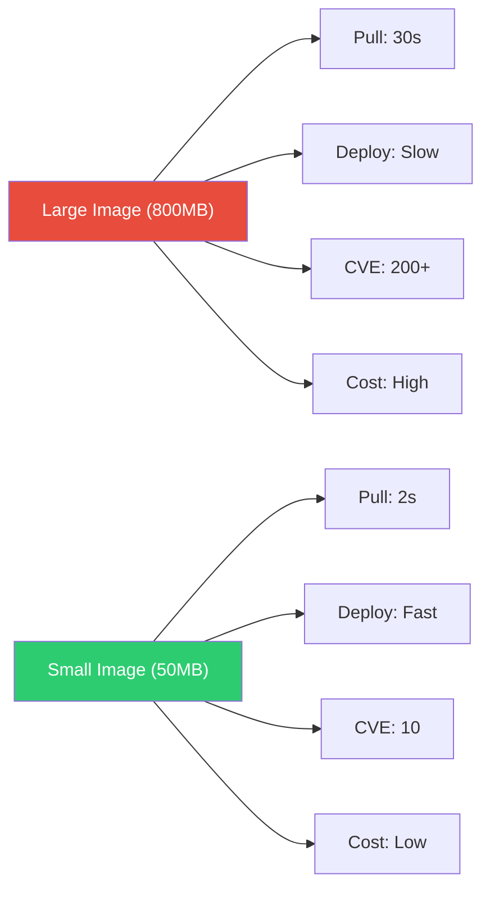
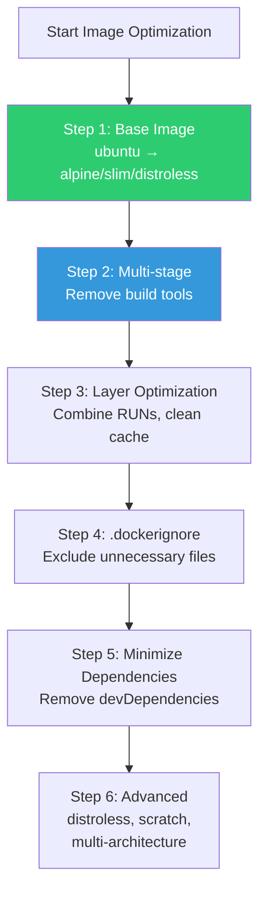
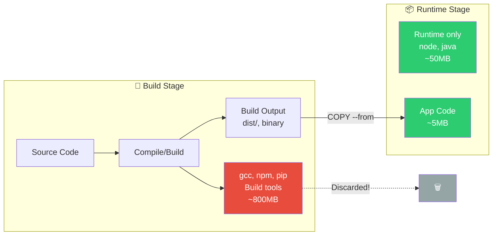
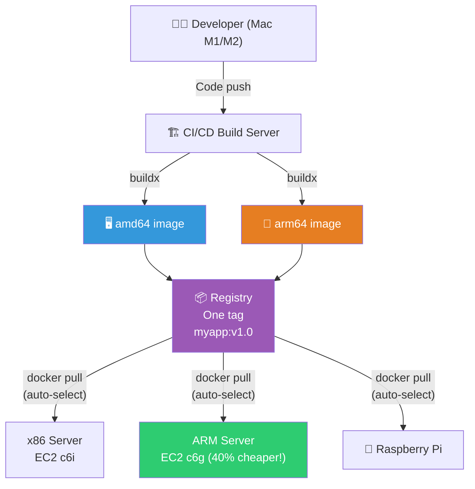

# Image Optimization (multi-stage / distroless / multi-arch)

> Having learned Dockerfile basics in [the previous lecture](./03-dockerfile), it's time for **advanced optimization**. Images become smaller, pulls faster, deployments faster, scaling faster, and security vulnerabilities fewer. "Please reduce the image size" is genuinely a common production request. This time we'll cover distroless, multi-architecture builds, and BuildKit advanced features.

---

## 🎯 Why do you need to know this?

```
Real-world impact of image optimization:
• Deploy speed: 800MB pull → 50MB pull = 10x faster
• CI/CD time: Build + push + pull all faster
• Scaling: In K8s, image pull time critical for new Pod startup
• Cost: ECR/registry storage cost + data transfer cost
• Security: Fewer packages = fewer CVEs (vulnerabilities)
• Cold start: Lambda/Fargate, image size = startup time
```

---

## 🧠 Core Concepts

### Analogy: Packing for International Travel

Image optimization is like **packing for a trip**.

First-time travelers pack everything "just in case" — thick guidebooks, hairdryer, backup clothes, laptop stand. Result: 30kg luggage, airport fees, struggling to move.

Experienced travelers? Just the essentials. 3 outfits, travel-size toiletries, e-book. Result: one backpack, maximum mobility!

```
Container images work the same way:
┌──────────────────────────────────────────────┐
│  Beginner's Image (= 30kg luggage)           │
│  ✗ Build tools (gcc, make) → 10 guidebooks  │
│  ✗ Debug tools (vim, curl) → emergency rain │
│  ✗ devDependencies → 10 unworn outfits       │
│  ✗ Full OS packages → bulky toiletries       │
│  Result: 1.5GB, slow pull, 200 CVEs         │
├──────────────────────────────────────────────┤
│  Optimized Image (= one backpack)            │
│  ✓ Runtime only (node, java) → passport     │
│  ✓ App code only → 3 wearable outfits        │
│  ✓ Production dependencies only → essentials│
│  Result: 50MB, 2sec pull, 5 CVEs            │
└──────────────────────────────────────────────┘
```

**Multi-stage build** is "organizing luggage at hotel" — take only what you need for the trip, leave the big suitcase behind. **distroless** is "wallet and phone only"!

### Why Image Size Matters



### Optimization Strategy Order



---

## 🔍 Detailed Explanation — Base Image Optimization

### Size Comparison by Base (Real Measurements)

```bash
# Same Node.js app, different bases:

# 1. Debian-based (default)
FROM node:20
# → Image size: ~1.1GB

# 2. Slim (Debian minimal)
FROM node:20-slim
# → Image size: ~250MB (77% reduction!)

# 3. Alpine (musl libc-based)
FROM node:20-alpine
# → Image size: ~130MB (88% reduction!)

# Actual measurements:
docker pull node:20 && docker images node:20 --format '{{.Size}}'
# 1.1GB
docker pull node:20-slim && docker images node:20-slim --format '{{.Size}}'
# 250MB
docker pull node:20-alpine && docker images node:20-alpine --format '{{.Size}}'
# 130MB
```

### Alpine Caveats

```bash
# Alpine uses musl libc instead of glibc
# → Most apps work fine, but some native binaries incompatible

# Problematic cases:
# - Python C extension module builds
# - Node.js native addons (sharp, bcrypt, etc.)
# - DNS resolution differences (musl's DNS resolver differs)

# Solutions:
# 1. If Alpine fails → use slim
# 2. Multi-stage: build on Alpine with build deps, run on Alpine
# 3. Specify architecture: --platform linux/amd64

# Python + Alpine example (build deps needed):
FROM python:3.12-alpine
RUN apk add --no-cache gcc musl-dev libffi-dev
# → Build after installing, then remove → use multi-stage!

# Practical recommendation:
# Node.js, Go → Alpine ✅ (rarely problematic)
# Python → slim or Alpine + build deps
# Java → slim (Eclipse Temurin slim)
# Native binaries → slim (safer)
```

### distroless — Extreme Minimalism

```bash
# Google's distroless images
# → Almost no OS tools! No shell (bash/sh)!
# → Only runtime needed to run apps

# Available distroless images:
# gcr.io/distroless/static-debian12     → Static binaries (Go)
# gcr.io/distroless/base-debian12       → C library included
# gcr.io/distroless/java21-debian12     → Java 21 runtime only
# gcr.io/distroless/nodejs20-debian12   → Node.js 20 runtime only
# gcr.io/distroless/python3-debian12    → Python 3 runtime only

# Size comparison:
# node:20         → 1.1GB
# node:20-alpine  → 130MB
# distroless/nodejs20 → ~120MB (similar to Alpine but more secure!)

# Real advantage = SECURITY!
# → No shell → can't exec into container
# → Attackers get in? Can't do anything!
# → No package manager (apt/apk) → can't install tools
```

```dockerfile
# distroless Node.js example
FROM node:20-alpine AS builder
WORKDIR /app
COPY package.json package-lock.json ./
RUN npm ci --production
COPY . .

FROM gcr.io/distroless/nodejs20-debian12
WORKDIR /app
COPY --from=builder /app .
EXPOSE 3000
CMD ["server.js"]
# → CMD without "node" — distroless/nodejs includes node as ENTRYPOINT

# For debugging, use debug tag:
# FROM gcr.io/distroless/nodejs20-debian12:debug
# → busybox shell included (don't use in production!)
```

```dockerfile
# distroless Go example (most dramatic effect!)
FROM golang:1.22-alpine AS builder
WORKDIR /app
COPY . .
RUN CGO_ENABLED=0 go build -ldflags="-s -w" -o /server .
# -ldflags="-s -w": Remove debug info → binary 30% smaller

FROM gcr.io/distroless/static-debian12
COPY --from=builder /server /server
ENTRYPOINT ["/server"]

# Size: ~10MB!
# golang:1.22-alpine builder: 300MB → final: 10MB!

# Even more extreme: scratch (completely empty image)
FROM scratch
COPY --from=builder /server /server
COPY --from=builder /etc/ssl/certs/ca-certificates.crt /etc/ssl/certs/
ENTRYPOINT ["/server"]
# Size: ~8MB! (just TLS certs + binary)
```

---

## 🔍 Detailed Explanation — Advanced Multi-Stage

### Multi-Stage Build Principles

We briefly saw multi-stage in distroless examples. Here are **advanced techniques**.



> Build tools (800MB) are discarded, only results (5MB) go to clean runtime image!

### Parallel Multi-Stage (BuildKit)

```dockerfile
# BuildKit builds independent stages in parallel!

# Stage 1: Frontend build ──┐
# Stage 2: Backend build   ──┤── Simultaneously!
# Stage 3: Final image     ←──┘

# syntax=docker/dockerfile:1
FROM node:20-alpine AS frontend
WORKDIR /frontend
COPY frontend/package*.json ./
RUN npm ci
COPY frontend/ .
RUN npm run build

FROM python:3.12-slim AS backend
WORKDIR /backend
COPY backend/requirements.txt .
RUN pip install --no-cache-dir -r requirements.txt
COPY backend/ .

FROM python:3.12-slim AS runtime
WORKDIR /app
COPY --from=backend /backend .
COPY --from=backend /usr/local/lib/python3.12/site-packages /usr/local/lib/python3.12/site-packages
COPY --from=frontend /frontend/build ./static

RUN adduser --system --no-create-home appuser
USER appuser
EXPOSE 8000
CMD ["gunicorn", "--bind", "0.0.0.0:8000", "app:app"]

# BuildKit runs frontend and backend in parallel!
# → Build time ~40% faster
```

### Cache Mount (BuildKit Advanced)

```dockerfile
# syntax=docker/dockerfile:1

# === pip cache mount ===
FROM python:3.12-slim
WORKDIR /app
COPY requirements.txt .
RUN --mount=type=cache,target=/root/.cache/pip \
    pip install -r requirements.txt
# → pip cache reused across builds!
# → Same packages not redownloaded

# === npm cache mount ===
FROM node:20-alpine
WORKDIR /app
COPY package*.json ./
RUN --mount=type=cache,target=/root/.npm \
    npm ci --production
# → npm cache reused

# === apt cache mount ===
FROM ubuntu:22.04
RUN --mount=type=cache,target=/var/cache/apt \
    --mount=type=cache,target=/var/lib/apt \
    apt-get update && apt-get install -y curl git
# → apt cache persists (no need: rm -rf /var/lib/apt/lists/*)

# === Secret mount (used during build, not in image!) ===
FROM node:20-alpine
RUN --mount=type=secret,id=npmrc,target=/root/.npmrc \
    npm ci
# → .npmrc used during build but NOT in layer!
# Build: docker build --secret id=npmrc,src=.npmrc .
```

### Binary Size Optimization

```bash
# Go: Remove debug info with ldflags
RUN CGO_ENABLED=0 go build -ldflags="-s -w" -o /app/server .
# -s: Strip symbol table
# -w: Remove DWARF debug info
# → Binary size ~30% reduction!

# Go: Compress binary with UPX (optional)
RUN apk add --no-cache upx && \
    go build -ldflags="-s -w" -o /app/server . && \
    upx --best /app/server
# → Additional 50~70% reduction! (slight startup overhead)

# Java: Create custom JRE with jlink
FROM eclipse-temurin:21-jdk-alpine AS builder
COPY . /app
WORKDIR /app
RUN ./gradlew bootJar --no-daemon
# Custom JRE (only needed modules!)
RUN jlink \
    --add-modules java.base,java.logging,java.sql,java.naming,java.management \
    --strip-debug \
    --no-man-pages \
    --no-header-files \
    --compress=2 \
    --output /custom-jre

FROM debian:bookworm-slim
COPY --from=builder /custom-jre /opt/java
COPY --from=builder /app/build/libs/*.jar /app/app.jar
ENV PATH="/opt/java/bin:${PATH}"
CMD ["java", "-jar", "/app/app.jar"]
# Full JRE: 200MB → Custom JRE: ~50MB!
```

---

## 🔍 Detailed Explanation — Multi-Architecture Build

### Why Multi-Architecture?



> One image tag works on x86, ARM servers — like a **universal charger**!

```bash
# ARM servers rapidly increasing:
# - AWS Graviton (ARM64) → 40% better value than x86!
# - Apple Silicon (M1/M2/M3) → Developer Macs are ARM
# - Raspberry Pi, IoT devices

# Problem:
# x86(amd64)-built image → won't run on ARM server!
# ARM-built image → won't run on x86 server!

# Solution: Multi-architecture image!
# → One tag, multiple architectures
# → docker pull auto-selects correct architecture

# Verify:
docker manifest inspect nginx:latest | grep architecture
# "architecture": "amd64"
# "architecture": "arm64"
# "architecture": "arm"
# → nginx:latest supports amd64, arm64, arm!
```

### docker buildx Multi-Architecture Build

```bash
# buildx: Docker's multi-platform build tool

# 1. Create buildx builder
docker buildx create --name multiarch --driver docker-container --use
docker buildx inspect --bootstrap
# Platforms: linux/amd64, linux/arm64, linux/arm/v7, linux/arm/v6, ...

# 2. Multi-architecture build + push
docker buildx build \
    --platform linux/amd64,linux/arm64 \
    -t myrepo/myapp:v1.0 \
    --push \
    .
# → Build amd64 and arm64 simultaneously and push!

# 3. Verify
docker manifest inspect myrepo/myapp:v1.0
# {
#   "manifests": [
#     {
#       "platform": {"architecture": "amd64", "os": "linux"},
#       "digest": "sha256:abc123..."
#     },
#     {
#       "platform": {"architecture": "arm64", "os": "linux"},
#       "digest": "sha256:def456..."
#     }
#   ]
# }

# 4. Pull auto-selects
# x86 server: docker pull myrepo/myapp:v1.0 → amd64 image
# ARM server: docker pull myrepo/myapp:v1.0 → arm64 image
# → Same tag, auto-selected!
```

### Multi-Architecture Dockerfile Tips

```dockerfile
# Most Dockerfiles work multi-architecture without changes!
# → If base image supports multi-arch, OK

# ⚠️ Things to watch:

# 1. Architecture-specific binary downloads
ARG TARGETARCH    # buildx auto-sets (amd64, arm64)
RUN wget https://example.com/tool-${TARGETARCH}.tar.gz

# 2. Go cross-compile
ARG TARGETOS TARGETARCH
RUN GOOS=${TARGETOS} GOARCH=${TARGETARCH} go build -o /app/server .
# → buildx auto-sets TARGETOS, TARGETARCH!

# 3. When native build needed
# → Use QEMU emulation (slow but compatible)
# → Or native ARM builder in CI/CD
```

```bash
# CI/CD Multi-Architecture Build (GitHub Actions Example)

# .github/workflows/build.yml
# name: Build Multi-Arch
# jobs:
#   build:
#     runs-on: ubuntu-latest
#     steps:
#     - uses: docker/setup-qemu-action@v3        # QEMU (ARM emulation)
#     - uses: docker/setup-buildx-action@v3      # buildx
#     - uses: docker/build-push-action@v5
#       with:
#         platforms: linux/amd64,linux/arm64
#         push: true
#         tags: myrepo/myapp:${{ github.sha }}
#         cache-from: type=gha
#         cache-to: type=gha,mode=max

# → Auto-build amd64 + arm64 in CI!
# → Ready for AWS Graviton(ARM) instances!
```

---

## 🔍 Detailed Explanation — Image Analysis Tools

### dive — Layer Analysis

```bash
# dive: Visualize each layer of image
# Install:
# wget https://github.com/wagoodman/dive/releases/download/v0.12.0/dive_0.12.0_linux_amd64.deb
# sudo apt install ./dive_0.12.0_linux_amd64.deb

# Or run with Docker
docker run --rm -it \
    -v /var/run/docker.sock:/var/run/docker.sock \
    wagoodman/dive:latest myapp:v1.0

# dive output:
# ┃ Image Details
# ├── Total Image size: 250 MB
# ├── Potential wasted space: 45 MB   ← Can reduce 45MB!
# ├── Image efficiency score: 82%     ← 82% (100% optimal)
# │
# ┃ Layer Details
# ├── 77 MB  FROM node:20-alpine
# ├── 120 MB RUN npm ci              ← Largest layer
# ├── 5 MB   COPY . .
# ├── 3 MB   RUN npm run build
# └── 45 MB  (duplicate/unnecessary)  ← Optimization target!

# What dive reveals:
# 1. Unnecessarily large layers
# 2. Duplicate files (same file in multiple layers)
# 3. Deleted but still in previous layer
# 4. devDependencies, build cache, etc.

# Auto-check in CI (efficiency score):
CI=true dive myapp:v1.0 --highestWastedBytes=50MB --lowestEfficiency=0.9
# → Fails build if wasted 50MB+ or efficiency < 90%!
```

### docker scout — Security Vulnerability Analysis

```bash
# Docker Scout: CVE analysis
docker scout cves myapp:v1.0
# ✗ C  CVE-2024-XXXX  critical  openssl 3.0.1 → 3.0.13
# ✗ H  CVE-2024-YYYY  high      curl 7.81.0 → 7.88.0
# ✗ M  CVE-2024-ZZZZ  medium    zlib 1.2.11 → 1.2.13
#
# 3 vulnerabilities found
#   1 critical, 1 high, 1 medium

# Check recommendations
docker scout recommendations myapp:v1.0
# Recommended fixes:
# 1. Update base image from node:20-alpine3.18 to node:20-alpine3.19
#    → Fixes 2 vulnerabilities

# → Smaller images = fewer CVEs!
# node:20      → 200+ CVEs
# node:20-slim → 50+ CVEs
# node:20-alpine → 10 CVEs
# distroless → 5 or fewer CVEs!
```

### Image Size Analysis Commands

```bash
# Layer-by-layer size
docker history myapp:v1.0 --format "{{.Size}}\t{{.CreatedBy}}" | sort -rh | head -10
# 120MB   RUN npm ci --production
# 77MB    ADD file:... in /                    ← Base image
# 5MB     COPY . .
# 3MB     RUN npm run build
# 0B      CMD ["node" "server.js"]

# Actual disk usage (accounting for layer sharing)
docker system df -v | grep myapp
# myapp   v1.0   250MB   5 hours ago

# Large files inside image
docker run --rm myapp:v1.0 sh -c "du -ah / 2>/dev/null | sort -rh | head -20"
# 120M    /app/node_modules
# 50M     /app/node_modules/typescript    ← devDependency still present!
# 30M     /app/node_modules/@types        ← Also here!
# 10M     /app/.git                        ← .git in image?!
# → Optimization targets found!
```

---

## 💻 Practice Exercises

### Exercise 1: Step-by-Step Image Size Reduction

```bash
mkdir -p /tmp/optimize-test && cd /tmp/optimize-test

# App code
cat << 'EOF' > server.js
const http = require('http');
const server = http.createServer((req, res) => {
  res.writeHead(200);
  res.end('Hello!\n');
});
server.listen(3000, () => console.log('Running on :3000'));
EOF

cat << 'EOF' > package.json
{"name":"test","version":"1.0.0","dependencies":{"express":"4.18.2"}}
EOF

echo -e "node_modules\n.git" > .dockerignore

# === Step 1: Basic (no optimization) ===
cat << 'STEP1' > Dockerfile.v1
FROM node:20
WORKDIR /app
COPY . .
RUN npm install
CMD ["node", "server.js"]
STEP1

docker build -f Dockerfile.v1 -t opt:v1 .
docker images opt:v1 --format '{{.Size}}'
# ~1.1GB

# === Step 2: Alpine base ===
cat << 'STEP2' > Dockerfile.v2
FROM node:20-alpine
WORKDIR /app
COPY . .
RUN npm install --production
CMD ["node", "server.js"]
STEP2

docker build -f Dockerfile.v2 -t opt:v2 .
docker images opt:v2 --format '{{.Size}}'
# ~140MB (88% reduction!)

# === Step 3: Layer cache optimization ===
cat << 'STEP3' > Dockerfile.v3
FROM node:20-alpine
WORKDIR /app
COPY package.json package-lock.json ./
RUN npm ci --production && npm cache clean --force
COPY . .
USER node
CMD ["node", "server.js"]
STEP3

docker build -f Dockerfile.v3 -t opt:v3 .
docker images opt:v3 --format '{{.Size}}'
# ~135MB (cache cleanup effect)

# === Results comparison ===
echo "=== Image Size Comparison ==="
docker images opt --format "table {{.Tag}}\t{{.Size}}"
# TAG   SIZE
# v1    1.1GB    ← Basic
# v2    140MB    ← Alpine
# v3    135MB    ← Cache cleanup + non-root

# Cleanup
docker rmi opt:v1 opt:v2 opt:v3
rm -rf /tmp/optimize-test
```

### Exercise 2: Analyze with dive

```bash
# Build image to analyze
docker build -t analyze-me -f- . << 'EOF'
FROM node:20-alpine
WORKDIR /app
RUN apk add --no-cache curl git vim python3
COPY . .
RUN npm install
CMD ["node", "server.js"]
EOF

# Analyze with dive
docker run --rm -it \
    -v /var/run/docker.sock:/var/run/docker.sock \
    wagoodman/dive:latest analyze-me

# → See added/modified/deleted files per layer
# → "Do we need curl, git, vim, python3?" → Remove if not!

docker rmi analyze-me
```

### Exercise 3: Multi-Architecture Build

```bash
# 1. Create buildx builder
docker buildx create --name multi --driver docker-container --use 2>/dev/null
docker buildx inspect --bootstrap

# 2. Simple Go app
mkdir -p /tmp/multiarch && cd /tmp/multiarch

cat << 'EOF' > main.go
package main
import (
    "fmt"
    "runtime"
    "net/http"
)
func main() {
    http.HandleFunc("/", func(w http.ResponseWriter, r *http.Request) {
        fmt.Fprintf(w, "Hello from %s/%s!\n", runtime.GOOS, runtime.GOARCH)
    })
    fmt.Printf("Server on :8080 (%s/%s)\n", runtime.GOOS, runtime.GOARCH)
    http.ListenAndServe(":8080", nil)
}
EOF

echo "module multiarch" > go.mod
echo "go 1.22" >> go.mod

cat << 'EOF' > Dockerfile
FROM golang:1.22-alpine AS builder
WORKDIR /app
COPY . .
ARG TARGETOS TARGETARCH
RUN CGO_ENABLED=0 GOOS=${TARGETOS} GOARCH=${TARGETARCH} go build -ldflags="-s -w" -o server .

FROM scratch
COPY --from=builder /app/server /server
ENTRYPOINT ["/server"]
EOF

# 3. Multi-architecture build (test locally)
docker buildx build --platform linux/amd64 -t multiarch:amd64 --load .
docker buildx build --platform linux/arm64 -t multiarch:arm64 --load .

docker images multiarch
# REPOSITORY   TAG     SIZE
# multiarch    amd64   ~8MB
# multiarch    arm64   ~7MB

# Cleanup
docker rmi multiarch:amd64 multiarch:arm64 2>/dev/null
docker buildx rm multi 2>/dev/null
rm -rf /tmp/multiarch
```

---

## 🏢 In Practice

### Scenario 1: "Reduce 2GB image to minimum"

```bash
# Current analysis
docker history myapp:latest --format "{{.Size}}\t{{.CreatedBy}}" | sort -rh | head
# 800MB   RUN apt-get install -y build-essential python3 ...
# 500MB   RUN npm install
# 200MB   ADD file:... in / (ubuntu:22.04)
# 100MB   COPY . .

# Optimization plan:
# 1. ubuntu:22.04 (200MB) → node:20-alpine (77MB)           → -123MB
# 2. Multi-stage: remove build-essential                     → -800MB
# 3. npm ci --production (remove devDependencies)            → -200MB
# 4. npm cache clean + .dockerignore                         → -50MB
# 5. Result: 2GB → ~150MB (92% reduction!)

# Verify optimization:
docker images myapp-optimized --format '{{.Size}}'
# 150MB ✅

# CVEs also reduce:
docker scout cves myapp:latest 2>/dev/null | tail -1
# 150 vulnerabilities
docker scout cves myapp-optimized:latest 2>/dev/null | tail -1
# 12 vulnerabilities    ← 92% reduction!
```

### Scenario 2: AWS Graviton(ARM) Migration

```bash
# "Graviton instances 40% cheaper but image doesn't support ARM"

# Solution: Implement multi-architecture build

# 1. Check Dockerfile for architecture-dependent code
# → Most Dockerfiles work multi-arch without changes!

# 2. Add buildx to CI/CD
# platforms: linux/amd64,linux/arm64

# 3. Test
# x86 server: docker pull myapp:v1.0 → amd64 runs ✅
# ARM server: docker pull myapp:v1.0 → arm64 runs ✅

# 4. Add Graviton nodes to K8s
# → Mix x86 and Graviton nodes
# → Multi-arch image runs anywhere!

# Cost benefit:
# c6g.xlarge (Graviton): $0.136/hour
# c6i.xlarge (x86):      $0.170/hour
# → 20% cheaper + equal/better performance!
```

### Scenario 3: CI/CD Build Time Optimization

```bash
# "Image build takes 15 minutes in CI"

# Cause analysis:
# npm install: 8min (rebuilds each time)
# docker push: 5min (800MB)
# Other: 2min

# Solutions:
# 1. Layer cache order fix → npm cache hit
#    Build time: 8min → 30sec (code-only changes)

# 2. Image size reduction → faster push
#    800MB → 150MB → push: 5min → 1min

# 3. BuildKit cache mount → reuse pip/npm cache
#    RUN --mount=type=cache,target=/root/.npm npm ci

# 4. GitHub Actions cache
#    cache-from: type=gha
#    cache-to: type=gha,mode=max

# Result: 15min → 2min! (87% reduction)
```

---

## ⚠️ Common Mistakes

### 1. Including unnecessary tools

```dockerfile
# ❌ Debug tools in production image
RUN apt-get install -y vim curl wget htop strace gdb
# → Bigger + CVEs + attacker tools available!

# ✅ Debugging separately
# - kubectl debug (temporary debug container)
# - Multi-stage debug target:
# FROM myapp:latest AS debug
# RUN apk add --no-cache curl vim
# → Use debug image only when needed
```

### 2. Wrong file copy in multi-stage

```dockerfile
# ❌ Copies entire builder → includes build tools!
COPY --from=builder /app /app

# ✅ Copy only what's needed
COPY --from=builder /app/dist ./dist
COPY --from=builder /app/node_modules ./node_modules
COPY --from=builder /app/package.json ./
```

### 3. Alpine DNS issues ignored

```bash
# Alpine's musl libc DNS resolver differs from glibc
# → Some DNS lookups may fail or be slow

# Symptom: External API calls intermittently fail
# Cause: musl's DNS resolver handles /etc/resolv.conf search domains differently

# Solution: K8s dnsPolicy config
# spec:
#   dnsPolicy: ClusterFirst    ← Default, usually OK
```

### 4. Only using latest tag

```bash
# ❌ Don't know if multi-arch
docker pull myapp:latest
# → May be amd64-only!

# ✅ Check architecture support
docker manifest inspect myapp:v1.0 | grep architecture
# → Verify amd64, arm64 both present
```

### 5. Missing TLS certs on scratch image

```dockerfile
# ❌ scratch without certificates → HTTPS fails!
FROM scratch
COPY --from=builder /app/server /server
# → server trying https://api.example.com → error!
# x509: certificate signed by unknown authority

# ✅ Include CA certificates
FROM scratch
COPY --from=builder /etc/ssl/certs/ca-certificates.crt /etc/ssl/certs/
COPY --from=builder /app/server /server
```

---

## 📝 Summary

### Image Size Reduction Checklist

```
✅ 1. Base: ubuntu → alpine or slim
✅ 2. Multi-stage: remove build tools
✅ 3. .dockerignore: exclude node_modules, .git, *.md
✅ 4. --production: remove devDependencies
✅ 5. Combine RUNs: && + cache cleanup
✅ 6. No unnecessary tools
✅ 7. Advanced: distroless, scratch, jlink
✅ 8. Binary: ldflags -s -w (Go)
```

### Base Image Selection Guide

```
Node.js: node:20-alpine (130MB) or distroless/nodejs20 (120MB)
Python:  python:3.12-slim (150MB)
Go:      scratch (8MB) or distroless/static (10MB) ⭐ Smallest
Java:    eclipse-temurin:21-jre-alpine (200MB) or jlink custom (50MB)
Generic: alpine:3.19 (7MB) or debian:bookworm-slim (80MB)
```

### Multi-Architecture Build

```bash
# Create builder
docker buildx create --name multi --use

# Build + push
docker buildx build \
    --platform linux/amd64,linux/arm64 \
    -t myrepo/myapp:v1.0 \
    --push .

# Verify
docker manifest inspect myrepo/myapp:v1.0
```

---

## 🔗 Next Lecture

Next is **[07-registry](./07-registry)** — Container Registry (ECR / Docker Hub / Harbor).

Built the image, but where does it live? Docker Hub, AWS ECR, Harbor — we'll learn registry types, practical configuration, security, and cost optimization.
