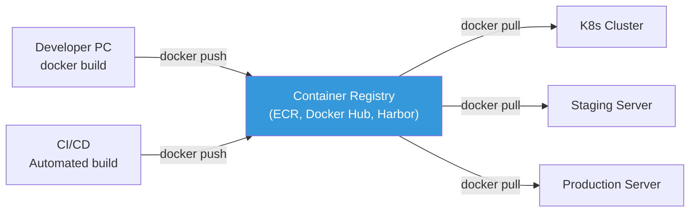
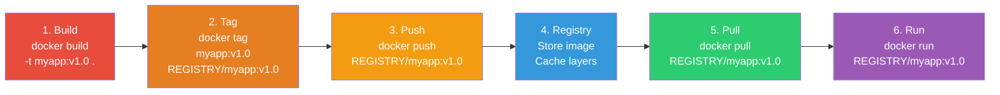
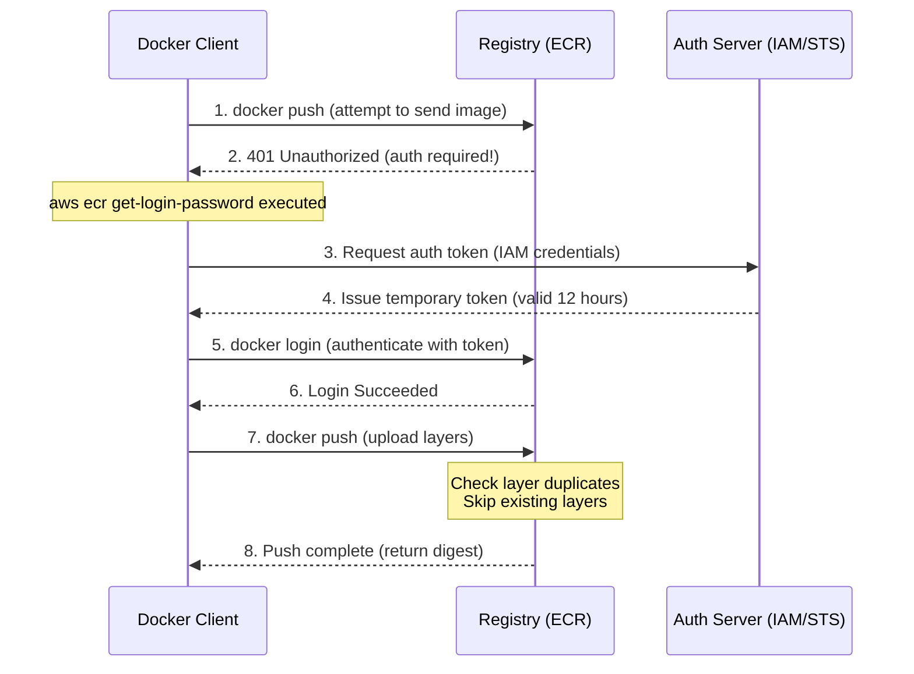
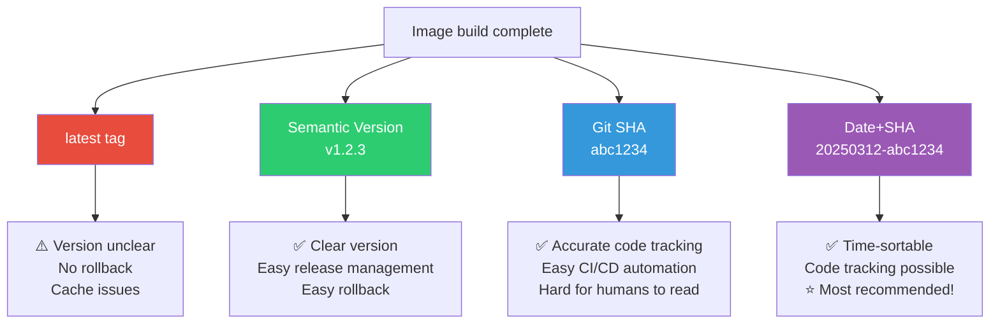

# Container Registry (ECR / Docker Hub / Harbor)

> Once you build an image, you need to **store and distribute** it somewhere. A registry is the **central repository for images**. If Git is the repository for code, a registry is the repository for container images.

---

## 🎯 Why Do You Need to Know This?

```
Container registry-related tasks in practice:
• Image push/pull after build                  → Daily
• ECR access permissions (IAM)                 → Security
• Image vulnerability scanning                 → Security audit
• Old image cleanup (cost savings)             → Lifecycle policy
• Private registry setup                       → Internal image management
• Image build + push automation in CI/CD       → Pipeline
• Image tagging strategy                       → Version management
```

---

## 🧠 Core Concepts

### Registry = Git Repository for Images



### Image Push/Pull Lifecycle

The complete flow from image creation to execution.



### Registry Comparison

| Registry | Type | Free | Private | Recommended For |
|----------|------|------|---------|-----------------|
| **Docker Hub** | Public SaaS | ✅ (limited) | Paid | Open source, personal projects |
| **AWS ECR** | Managed (AWS) | ❌ | ✅ | ⭐ AWS environment |
| **GCR/Artifact Registry** | Managed (GCP) | ❌ | ✅ | GCP environment |
| **Azure ACR** | Managed (Azure) | ❌ | ✅ | Azure environment |
| **GitHub GHCR** | SaaS | ✅ (limited) | ✅ | GitHub integration |
| **Harbor** | Self-hosted | ✅ (OSS) | ✅ | On-premises, regulated environments |
| **GitLab Registry** | SaaS/Self | ✅ | ✅ | GitLab CI/CD |

---

## 🔍 Detailed Explanation — AWS ECR (★ Most Commonly Used)

### ECR Basic Usage

```bash
# === 1. Create Repository ===
aws ecr create-repository \
    --repository-name myapp \
    --image-scanning-configuration scanOnPush=true \
    --encryption-configuration encryptionType=AES256 \
    --region ap-northeast-2

# {
#   "repository": {
#     "repositoryArn": "arn:aws:ecr:ap-northeast-2:123456789:repository/myapp",
#     "repositoryUri": "123456789.dkr.ecr.ap-northeast-2.amazonaws.com/myapp",
#     ...
#   }
# }

# === 2. Docker Login (ECR Authentication) ===
aws ecr get-login-password --region ap-northeast-2 | \
    docker login --username AWS --password-stdin \
    123456789.dkr.ecr.ap-northeast-2.amazonaws.com
# Login Succeeded

# ⚠️ ECR token is valid for 12 hours! Requires login each time in CI/CD

# === 3. Tag + Push Image ===
# Add ECR URI tag to the image
docker tag myapp:v1.0 123456789.dkr.ecr.ap-northeast-2.amazonaws.com/myapp:v1.0

# Push
docker push 123456789.dkr.ecr.ap-northeast-2.amazonaws.com/myapp:v1.0
# The push refers to repository [123456789.dkr.ecr.ap-northeast-2.amazonaws.com/myapp]
# abc123: Pushed
# def456: Pushed
# v1.0: digest: sha256:... size: 1234

# === 4. Pull Image ===
docker pull 123456789.dkr.ecr.ap-northeast-2.amazonaws.com/myapp:v1.0

# === 5. List Images ===
aws ecr list-images --repository-name myapp --output table
# ┌──────────────┬────────────────────────┐
# │  imageDigest  │      imageTag         │
# ├──────────────┼────────────────────────┤
# │  sha256:abc.. │  v1.0                 │
# │  sha256:def.. │  v1.1                 │
# │  sha256:ghi.. │  latest               │
# └──────────────┴────────────────────────┘

# === 6. Image Details ===
aws ecr describe-images --repository-name myapp \
    --image-ids imageTag=v1.0 \
    --query 'imageDetails[0].{Size:imageSizeInBytes,Pushed:imagePushedAt,Tags:imageTags,Scan:imageScanStatus}' \
    --output table
```

### Docker Login + Push Authentication Flow

Understanding the internal authentication process when pushing to ECR or Docker Hub helps with debugging authentication errors.



### ECR Lifecycle Policy (★ Cost Savings!)

```bash
# Automatically delete old/unused images

aws ecr put-lifecycle-policy \
    --repository-name myapp \
    --lifecycle-policy-text '{
  "rules": [
    {
      "rulePriority": 1,
      "description": "Delete untagged images after 7 days",
      "selection": {
        "tagStatus": "untagged",
        "countType": "sinceImagePushed",
        "countUnit": "days",
        "countNumber": 7
      },
      "action": {"type": "expire"}
    },
    {
      "rulePriority": 2,
      "description": "Keep only 30 most recent (v* tag)",
      "selection": {
        "tagStatus": "tagged",
        "tagPrefixList": ["v"],
        "countType": "imageCountMoreThan",
        "countNumber": 30
      },
      "action": {"type": "expire"}
    },
    {
      "rulePriority": 3,
      "description": "Delete dev- tag after 14 days",
      "selection": {
        "tagStatus": "tagged",
        "tagPrefixList": ["dev-", "pr-"],
        "countType": "sinceImagePushed",
        "countUnit": "days",
        "countNumber": 14
      },
      "action": {"type": "expire"}
    }
  ]
}'

# With this policy:
# ✅ Untagged images → Auto-deleted after 7 days
# ✅ Release images (v*) → Keep only 30 most recent
# ✅ Dev/PR images → Auto-deleted after 14 days
# → No unnecessary image accumulation → Cost savings!
```

### ECR Image Scanning

```bash
# Auto-scan on push (scanOnPush=true)

# Check scan results
aws ecr describe-image-scan-findings \
    --repository-name myapp \
    --image-id imageTag=v1.0 \
    --query 'imageScanFindings.findingSeverityCounts'
# {
#   "CRITICAL": 0,
#   "HIGH": 2,
#   "MEDIUM": 5,
#   "LOW": 10,
#   "INFORMATIONAL": 3
# }

# Detailed vulnerabilities
aws ecr describe-image-scan-findings \
    --repository-name myapp \
    --image-id imageTag=v1.0 \
    --query 'imageScanFindings.findings[?severity==`HIGH`].[name,description]' \
    --output table

# Enhanced Scanning (Inspector-based):
# → Continuous scanning (not just on push, but auto-rescan on new CVE discovery!)
# → Scan both OS and language packages (pip, npm, gem, etc.)
aws ecr put-registry-scanning-configuration \
    --scan-type ENHANCED \
    --rules '[{"scanFrequency":"CONTINUOUS_SCAN","repositoryFilters":[{"filter":"*","filterType":"WILDCARD"}]}]'
```

### ECR + K8s Integration

```bash
# Pull ECR images from EKS:
# → Automatic if EKS node IAM Role has ECR read permissions!

# IAM policy (attach to node IAM Role):
# {
#   "Effect": "Allow",
#   "Action": [
#     "ecr:GetAuthorizationToken",
#     "ecr:BatchCheckLayerAvailability",
#     "ecr:GetDownloadUrlForLayer",
#     "ecr:BatchGetImage"
#   ],
#   "Resource": "*"
# }

# Use ECR image in K8s Pod:
# containers:
# - name: myapp
#   image: 123456789.dkr.ecr.ap-northeast-2.amazonaws.com/myapp:v1.0
# → Direct pull in EKS without additional config!

# Use ECR in non-EKS environments (imagePullSecrets):
# 1. Create Secret
kubectl create secret docker-registry ecr-secret \
    --docker-server=123456789.dkr.ecr.ap-northeast-2.amazonaws.com \
    --docker-username=AWS \
    --docker-password=$(aws ecr get-login-password)

# 2. Use in Pod
# spec:
#   imagePullSecrets:
#   - name: ecr-secret
#   containers:
#   - name: myapp
#     image: 123456789.dkr.ecr.ap-northeast-2.amazonaws.com/myapp:v1.0

# ⚠️ ECR token is valid for 12 hours only! → Need CronJob to refresh
```

---

## 🔍 Detailed Explanation — Docker Hub

```bash
# Docker Hub: Most popular public registry

# Login
docker login
# Username: myuser
# Password: ***
# Login Succeeded

# Push (public image)
docker tag myapp:v1.0 myuser/myapp:v1.0
docker push myuser/myapp:v1.0

# Pull
docker pull myuser/myapp:v1.0

# Docker Hub limitations (free account):
# - Anonymous pull: 100 pulls/6 hours
# - Authenticated pull: 200 pulls/6 hours
# - Private repos: 1 only
# → Frequent CI/CD pulls can hit rate limit!

# Avoid rate limit:
# 1. Docker Hub Pro account ($5/month)
# 2. Mirror image to ECR (ECR Pull Through Cache)
# 3. Cache in self-hosted registry

# ECR Pull Through Cache:
# → Auto-cache Docker Hub images in ECR
aws ecr create-pull-through-cache-rule \
    --ecr-repository-prefix docker-hub \
    --upstream-registry-url registry-1.docker.io

# Usage:
# Original: docker pull nginx:latest
# Cached:   docker pull 123456789.dkr.ecr.ap-northeast-2.amazonaws.com/docker-hub/library/nginx:latest
# → First pull from Docker Hub, then cached in ECR!
```

---

## 🔍 Detailed Explanation — Harbor (Self-Hosted)

```bash
# Harbor: CNCF project, self-hosted container registry

# Features:
# ✅ Completely on-premises (no external data leakage)
# ✅ RBAC (role-based access control)
# ✅ Image scanning (built-in Trivy)
# ✅ Image signing (cosign, Notary)
# ✅ Replication (sync with other registries)
# ✅ Proxy cache (mirror Docker Hub, etc.)
# ✅ Audit logs
# ❌ Requires self-management (installation, upgrades, backups)

# Harbor installation (Docker Compose-based)
wget https://github.com/goharbor/harbor/releases/download/v2.10.0/harbor-offline-installer-v2.10.0.tgz
tar xzf harbor-offline-installer-v2.10.0.tgz
cd harbor

# Configuration
cp harbor.yml.tmpl harbor.yml
vim harbor.yml
# hostname: harbor.mycompany.com
# https:
#   certificate: /etc/ssl/certs/harbor.crt
#   private_key: /etc/ssl/certs/harbor.key

# Install + Start
./install.sh
# → Harbor runs with Docker Compose!
# → Access via https://harbor.mycompany.com (web UI)

# Use Harbor with Docker:
docker login harbor.mycompany.com
docker tag myapp:v1.0 harbor.mycompany.com/myproject/myapp:v1.0
docker push harbor.mycompany.com/myproject/myapp:v1.0
```

### When to Use What?

```bash
# Docker Hub:
# → Open source projects, public images
# → Personal learning, small projects

# AWS ECR:
# → ⭐ Production in AWS environment (most common)
# → Natural integration with EKS
# → IAM-based security

# GitHub GHCR:
# → GitHub Actions CI/CD integration
# → Mix of open source and private

# Harbor:
# → On-premises, regulated environments (finance, healthcare, government)
# → When data cannot leave external systems
# → Central registry across multiple clouds/environments

# GitLab Registry:
# → Environment using GitLab CI/CD
```

---

## 🔍 Detailed Explanation — Image Tagging Strategy

### Good Tagging Strategy

```bash
# ❌ Bad tagging
myapp:latest              # Which version? Unknown!
myapp:v1                  # Which commit? Unknown!

# ✅ Good tagging (⭐ Recommended!)
myapp:v1.2.3              # Semantic version
myapp:20250312-abc1234    # Date-commit hash
myapp:main-abc1234        # Branch-commit hash
myapp:pr-42               # PR number

# Real-world tagging pattern:
# One image often has multiple tags simultaneously!
docker tag myapp:build123 myrepo/myapp:v1.2.3
docker tag myapp:build123 myrepo/myapp:20250312-abc1234
docker tag myapp:build123 myrepo/myapp:latest    # For convenience

docker push myrepo/myapp:v1.2.3
docker push myrepo/myapp:20250312-abc1234
docker push myrepo/myapp:latest

# Auto-tagging in CI/CD:
# IMAGE_TAG="${GITHUB_SHA::7}"                     # First 7 chars of commit
# IMAGE_TAG="$(date +%Y%m%d)-${GITHUB_SHA::7}"    # Date-hash
# IMAGE_TAG="${GITHUB_REF_NAME}-${GITHUB_SHA::7}" # Branch-hash
```

### Tagging Strategy Comparison

Which tagging strategy is appropriate depends on your team and environment. Let's compare the pros and cons of each strategy.



### Image Immutability

```bash
# If you push a different image to the same tag → Previous image gets overwritten!
# → "Is v1.0 a different image than yesterday?" → Dangerous!

# Set tag immutability in ECR:
aws ecr put-image-tag-mutability \
    --repository-name myapp \
    --image-tag-mutability IMMUTABLE
# → Cannot push to same tag again!
# → v1.0 is permanently the same image!

# Since latest tag needs to be updated:
# → Version tags (v1.0) should be IMMUTABLE
# → latest should be MUTABLE (or don't use latest at all)
```

---

## 💻 Hands-On Examples

### Exercise 1: Push/Pull Image to ECR

```bash
# 1. Create repository
ACCOUNT_ID=$(aws sts get-caller-identity --query Account --output text)
REGION="ap-northeast-2"
REPO_URI="$ACCOUNT_ID.dkr.ecr.$REGION.amazonaws.com/test-app"

aws ecr create-repository --repository-name test-app --region $REGION

# 2. Login
aws ecr get-login-password --region $REGION | \
    docker login --username AWS --password-stdin $ACCOUNT_ID.dkr.ecr.$REGION.amazonaws.com

# 3. Build + Tag image
docker build -t test-app:v1.0 .
docker tag test-app:v1.0 $REPO_URI:v1.0

# 4. Push
docker push $REPO_URI:v1.0

# 5. Pull (on another server)
docker pull $REPO_URI:v1.0

# 6. List images
aws ecr list-images --repository-name test-app

# 7. Cleanup
aws ecr delete-repository --repository-name test-app --force
```

### Exercise 2: Image Scanning

```bash
# Scan local image with Trivy (works without ECR!)
# Install: https://aquasecurity.github.io/trivy/

# Run Trivy with Docker
docker run --rm \
    -v /var/run/docker.sock:/var/run/docker.sock \
    aquasec/trivy:latest image myapp:v1.0

# Output:
# myapp:v1.0 (alpine 3.19)
# ════════════════════════════
# Total: 5 (UNKNOWN: 0, LOW: 3, MEDIUM: 1, HIGH: 1, CRITICAL: 0)
#
# ┌─────────────┬──────────────┬──────────┬────────────┬───────────────┐
# │   Library   │ Vulnerability│ Severity │  Installed │    Fixed      │
# ├─────────────┼──────────────┼──────────┼────────────┼───────────────┤
# │ openssl     │ CVE-2024-XXX │ HIGH     │ 3.1.0      │ 3.1.5         │
# │ curl        │ CVE-2024-YYY │ MEDIUM   │ 8.5.0      │ 8.6.0         │
# └─────────────┴──────────────┴──────────┴────────────┴───────────────┘

# Auto-scan in CI (fail build if CRITICAL/HIGH):
docker run --rm \
    -v /var/run/docker.sock:/var/run/docker.sock \
    aquasec/trivy:latest image \
    --exit-code 1 \
    --severity CRITICAL,HIGH \
    myapp:v1.0
# → Exits with code 1 if CRITICAL or HIGH CVE found (build fails!)
```

### Exercise 3: Image Signing (cosign)

```bash
# cosign: Sign images to verify they're built by your CI/CD
# → "Is this image really from our CI/CD pipeline?" verification

# Generate key pair
cosign generate-key-pair
# → cosign.key (private key, keep secure!)
# → cosign.pub (public key, for verification)

# Sign image
cosign sign --key cosign.key $REPO_URI:v1.0
# → Signature stored in registry

# Verify signature
cosign verify --key cosign.pub $REPO_URI:v1.0
# Verification for ... --
# The following checks were performed on each of these signatures:
#   - The cosign claims were validated
#   - The signatures were verified against the specified public key
# → Verification successful! ✅

# Only allow signed images in K8s (OPA/Kyverno):
# → Unsigned images blocked from deployment!
```

---

## 🏢 In Practice

### Scenario 1: CI/CD Image Build Pipeline

```bash
# Build and push to ECR from GitHub Actions

# .github/workflows/build.yml
# name: Build and Push
# on:
#   push:
#     branches: [main]
#
# env:
#   AWS_REGION: ap-northeast-2
#   ECR_REPO: myapp
#
# jobs:
#   build:
#     runs-on: ubuntu-latest
#     steps:
#     - uses: actions/checkout@v4
#
#     - uses: aws-actions/configure-aws-credentials@v4
#       with:
#         role-to-assume: arn:aws:iam::123456789:role/github-actions
#
#     - uses: aws-actions/amazon-ecr-login@v2
#       id: ecr
#
#     - name: Build and push
#       env:
#         REGISTRY: ${{ steps.ecr.outputs.registry }}
#         IMAGE_TAG: ${{ github.sha }}
#       run: |
#         docker build -t $REGISTRY/$ECR_REPO:$IMAGE_TAG .
#         docker push $REGISTRY/$ECR_REPO:$IMAGE_TAG
#
#     - name: Scan image
#       run: |
#         trivy image --exit-code 1 --severity CRITICAL \
#           $REGISTRY/$ECR_REPO:$IMAGE_TAG
```

### Scenario 2: ECR Cost Optimization

```bash
# "ECR costs are $200/month"

# Root cause analysis:
# 1. Too many stored images (500+)
# 2. Large images (800MB × 500 = 400GB)
# 3. Cross-region pulls (data transfer cost)

# Solution:
# 1. Apply lifecycle policy
# → Untagged images: delete after 7 days
# → Release images: keep only 20 most recent
# → Dev/PR images: delete after 14 days

# 2. Reduce image size (./06-image-optimization)
# → 800MB → 150MB = 5x cost savings

# 3. Pull from same region
# → Same region as EKS = free data transfer!
# → Different region = $0.09/GB!

# 4. Verify layer sharing
# → Images using same base (alpine) share layers
# → Actual storage is smaller than (image count × size)
```

### Scenario 3: "Image Pull Fails"

```bash
# === "ErrImagePull" in K8s ===

# 1. Image name typo
kubectl describe pod myapp | grep "Failed"
# Failed to pull image "123456789.dkr.ecr..../myap:v1.0"
#                                                ^^^^
#                                                Typo! Should be myapp

# 2. ECR auth expired
# → Check EKS node IAM Role has ECR read permissions
# → For non-EKS: check imagePullSecrets (12 hour expiration!)

# 3. Image tag doesn't exist
# → Verify v1.0 exists in ECR
aws ecr describe-images --repository-name myapp --image-ids imageTag=v1.0

# 4. Wrong region
# → Check ECR URI region
# 123456789.dkr.ecr.us-east-1.amazonaws.com  ← us-east-1?
# 123456789.dkr.ecr.ap-northeast-2.amazonaws.com  ← ap-northeast-2?

# 5. Docker Hub rate limit
# → Anonymous: 100 pulls/6 hours, Authenticated: 200 pulls/6 hours
# → Use ECR Pull Through Cache to solve
```

---

## ⚠️ Common Mistakes

### 1. Using Only Latest Tag

```bash
# ❌ All deployments use latest → Version unclear, no rollback possible
image: myapp:latest

# ✅ Use explicit version tag
image: myapp:v1.2.3
image: myapp:20250312-abc1234
```

### 2. Not Setting ECR Lifecycle Policy

```bash
# ❌ Images accumulate → Hundreds of GB → Cost explosion!
aws ecr describe-repositories --query 'repositories[*].[repositoryName]' --output table
# → Check repos without lifecycle policy

# ✅ Apply lifecycle policy to all repos
```

### 3. Not Scanning Images

```bash
# ❌ Deploy images with vulnerabilities to production
# → Hacking risk!

# ✅ Auto-scan in CI/CD + block CRITICAL/HIGH
# → Trivy, ECR Enhanced Scanning, Docker Scout
```

### 4. Push Private Image to Public Registry

```bash
# ❌ Push internal code to Docker Hub public!
docker push myuser/internal-app:v1.0
# → Anyone can pull! Source code leaked!

# ✅ Use private registry (ECR, Harbor)
# ✅ Or set Docker Hub to private
```

### 5. Waste Cost with Cross-Region Pull

```bash
# ❌ ECR in us-east-1 but EKS in ap-northeast-2
# → Pull across Atlantic every time → Slow and expensive!

# ✅ Keep ECR and EKS in same region
# ✅ For multi-region: use ECR Replication
aws ecr put-replication-configuration \
    --replication-configuration '{
      "rules": [{
        "destinations": [{
          "region": "ap-northeast-2",
          "registryId": "123456789"
        }]
      }]
    }'
# → Push to us-east-1, auto-replicate to ap-northeast-2!
```

---

## 📝 Summary

### ECR Command Cheatsheet

```bash
# Login
aws ecr get-login-password | docker login --username AWS --password-stdin ACCOUNT.dkr.ecr.REGION.amazonaws.com

# Create repo
aws ecr create-repository --repository-name NAME --image-scanning-configuration scanOnPush=true

# Push
docker tag IMAGE ACCOUNT.dkr.ecr.REGION.amazonaws.com/NAME:TAG
docker push ACCOUNT.dkr.ecr.REGION.amazonaws.com/NAME:TAG

# List images
aws ecr list-images --repository-name NAME

# Scan results
aws ecr describe-image-scan-findings --repository-name NAME --image-id imageTag=TAG

# Delete
aws ecr batch-delete-image --repository-name NAME --image-ids imageTag=TAG
```

### Registry Selection Guide

```
AWS Production       → ECR ⭐
GCP Production       → Artifact Registry
On-premises/regulated → Harbor
Open source/personal → Docker Hub or GHCR
GitHub CI/CD         → GHCR
GitLab CI/CD         → GitLab Registry
```

### Image Management Checklist

```
✅ Explicit version tag (no latest)
✅ Lifecycle policy (auto-delete old images)
✅ Image scanning (auto in CI/CD)
✅ Image signing (cosign, optional)
✅ Tag immutability (IMMUTABLE, optional)
✅ Registry and cluster in same region
✅ Minimize images with .dockerignore + multi-stage
```

---

## 🔗 Next Lecture

Next is **[08-troubleshooting](./08-troubleshooting)** — Container Troubleshooting (inspect / stats / debugging).

When containers won't start, keep dying, or run slowly — we'll learn a systematic framework to find the root cause quickly.
