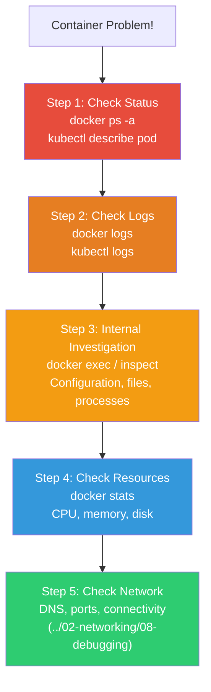
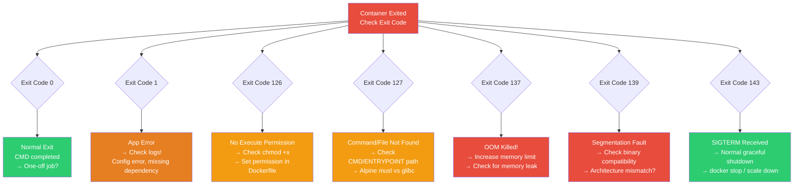
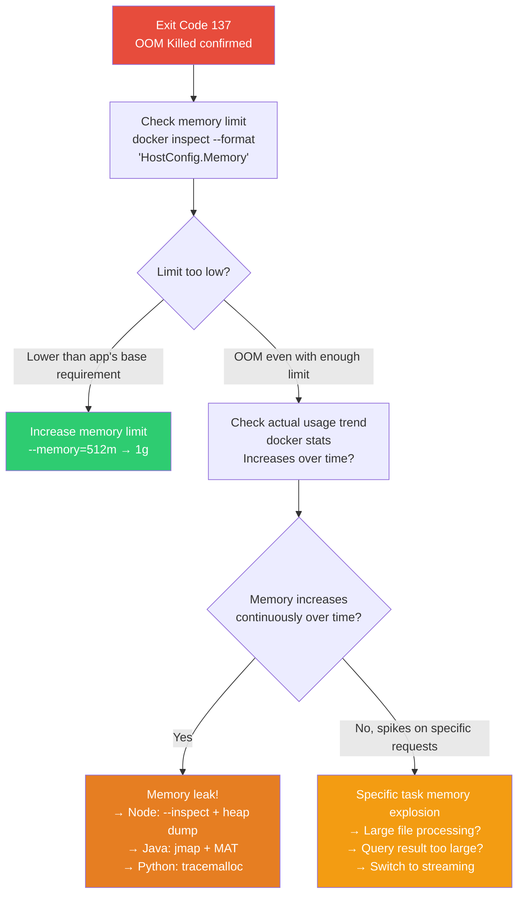
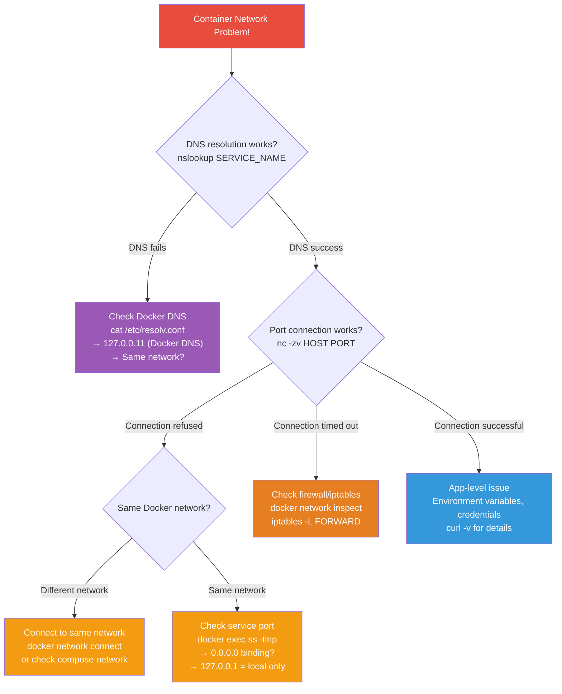

# Container Troubleshooting (inspect / stats / debugging)

> When containers won't start, keep crashing, run slowly, or won't communicate — most real-world time is spent debugging. With a systematic framework like [Network Debugging](../02-networking/08-debugging), you can find root causes much faster.

---

## 🎯 Why Do You Need to Know This?

```
Container troubleshooting moments in practice:
• "Container dies immediately after startup" (CrashLoopBackOff)
• "Container killed by OOM"
• "Permission denied reading file in container"
• "Container is slow"
• "Image pull fails"
• "Containers can't communicate"
• "Disk is full" (Docker-related)
```

---

## 🧠 Core Concepts

### Container Debugging 5-Step Framework



### Exit Code Decision Tree

When a container dies, you can narrow down the cause quickly by looking at the Exit Code.



---

## 🔍 Real-World Scenario — Container Dies Immediately After Starting

### Symptom: Exited (1) / CrashLoopBackOff

```bash
# === Step 1: Check Status ===
docker ps -a
# CONTAINER ID  IMAGE        STATUS                     NAMES
# abc123        myapp:v1.0   Exited (1) 5 seconds ago   myapp
#                            ^^^^^^^^
#                            Exit Code 1 = app error

# In K8s:
kubectl get pods
# NAME                    READY   STATUS             RESTARTS   AGE
# myapp-7b9f8c-abc12      0/1     CrashLoopBackOff   5          3m
#                                 ^^^^^^^^^^^^^^^^
#                                 Start → Die → Start → Die loop

# Exit Code meanings:
# 0   = Normal exit
# 1   = App error (generic)
# 2   = Shell command error
# 126 = No execute permission
# 127 = Command/file not found
# 128+N = Killed by signal N (137=SIGKILL=OOM, 143=SIGTERM)
# 137 = OOM Killer (128 + 9) ← Memory exceeded!
# 143 = SIGTERM (128 + 15) ← Graceful shutdown request

# === Step 2: Check Logs (⭐ Most Important!) ===
docker logs myapp
# Error: Cannot find module '/app/server.js'
# → File path wrong or COPY didn't work!

# Or:
docker logs myapp
# Error: connect ECONNREFUSED 10.0.2.10:5432
# → DB connection failed! DB not started or address wrong

# Or:
docker logs myapp
# /app/server: Permission denied
# → No execute permission!

# In K8s, check previous container logs:
kubectl logs myapp-7b9f8c-abc12 --previous
# → When in CrashLoopBackOff, see previous run's logs!

# === Step 3: Internal Investigation ===

# Check dead container's filesystem (docker cp)
docker cp myapp:/app/ /tmp/debug-app/
ls -la /tmp/debug-app/
# → Check if files exist and have correct permissions

# Manually run same image with shell
docker run -it --rm --entrypoint sh myapp:v1.0
# /app $ ls -la
# -rw-r--r-- 1 root root ... server.js     ← No execute permission?
# /app $ node server.js
# Error: Cannot find module 'express'       ← Dependency missing!

# Check Dockerfile:
# → WORKDIR and COPY paths correct?
# → CMD/ENTRYPOINT correct?
# → npm install complete?
```

### Exit Code 137 — OOM Killed (Memory Exceeded)

```bash
docker ps -a
# STATUS: Exited (137)    ← 137 = SIGKILL = OOM!

# Verify
docker inspect myapp --format '{{.State.OOMKilled}}'
# true    ← Killed by OOM!

# Check memory limit
docker inspect myapp --format '{{.HostConfig.Memory}}'
# 268435456    ← 256MB limit

# Check last memory usage
docker stats --no-stream myapp 2>/dev/null
# MEM USAGE / LIMIT    MEM %
# 255MiB / 256MiB      99.61%    ← At limit!

# Solution:
# 1. Increase memory limit
docker run -d --memory=512m myapp:v1.0

# 2. Fix app memory leak
# → Node.js: --max-old-space-size
# → Java: -Xmx setting
# → Use profiling tools to find leak

# In K8s:
kubectl describe pod myapp | grep -A 5 "Last State"
# Last State:  Terminated
#   Reason:    OOMKilled
#   Exit Code: 137

# → Increase resources.limits.memory
# resources:
#   limits:
#     memory: "512Mi"    # 256Mi → 512Mi
```

### Exit Code 127 — Command Not Found

```bash
docker logs myapp
# /bin/sh: /app/server: not found
# Or
# exec /app/server: no such file or directory

# Root Cause 1: File doesn't exist
docker run --rm --entrypoint sh myapp:v1.0 -c "ls -la /app/"
# → Check if server file exists

# Root Cause 2: Alpine with glibc binary
# → Alpine uses musl libc! glibc binary won't run
# → Solution: Build in Alpine or use CGO_ENABLED=0 (Go)

# Root Cause 3: No execute permission (126 or 127)
docker run --rm --entrypoint sh myapp:v1.0 -c "file /app/server"
# /app/server: ELF 64-bit LSB executable, x86-64, ...
# → Binary is correct, but if no execute permission, add:
# RUN chmod +x /app/server

# Root Cause 4: Architecture mismatch (ARM vs x86)
docker run --rm --entrypoint sh myapp:v1.0 -c "uname -m"
# aarch64    ← ARM but running x86 binary?
# → Need multi-architecture build (./06-image-optimization)
```

### OOM Diagnosis Flow

Systematic approach to find the cause when Exit Code 137 occurs.



---

## 🔍 Real-World Scenario — Container is Slow

```bash
# === Step 1: Check Resource Usage ===
docker stats
# CONTAINER  CPU %    MEM USAGE / LIMIT    MEM %   NET I/O       BLOCK I/O   PIDS
# myapp      95.00%   480MiB / 512MiB      93.75%  5MB / 2MB     100MB / 0B  150
#            ^^^^^^                         ^^^^^^                            ^^^
#            CPU 95%!                       Memory 93%!                       150 processes

# High CPU:
# → App-level issue (infinite loop, heavy computation)
# → CPU limit too low (increase --cpus)
# → Check which process is using CPU
docker exec myapp top -bn1 | head -15
# PID  USER  %CPU  %MEM  COMMAND
# 1    node  92.0  45.0  node server.js      ← This process!

# High Memory:
# → Memory leak (increases over time)
# → Memory limit too low
# → Increase --memory or fix app

# High I/O:
# → Lots of disk read/write
# → Excessive logging or large file processing
docker exec myapp iostat 2>/dev/null

# High PIDS:
# → Process/thread leak
# → Possible fork bomb
docker exec myapp ps aux | wc -l

# === Step 2: Detailed Profiling ===

# Node.js: Heap dump
docker exec myapp node --inspect=0.0.0.0:9229 -e "process.kill(process.pid, 'SIGUSR1')"
# → Connect from Chrome DevTools for profiling

# Java: Thread dump
docker exec myapp jstack 1
# → See what each thread is doing

# Python: py-spy (external profiling)
docker exec myapp pip install py-spy
docker exec myapp py-spy top --pid 1

# General: strace (system call tracing)
docker exec --privileged myapp strace -p 1 -c
# → Which system calls are most common (debug container)
```

---

## 🔍 Real-World Scenario — Image/Registry Issues

```bash
# === "Can't pull image" ===

# Error messages by root cause:

# 1. "manifest not found"
docker pull myrepo/myapp:v9.9.9
# Error: manifest for myrepo/myapp:v9.9.9 not found
# → This tag doesn't exist in registry! Check for typo

# 2. "unauthorized" / "access denied"
docker pull 123456789.dkr.ecr.ap-northeast-2.amazonaws.com/myapp:v1.0
# Error: pull access denied, unauthorized
# → Not logged in or no permission
aws ecr get-login-password | docker login --username AWS --password-stdin 123456789.dkr.ecr.ap-northeast-2.amazonaws.com

# 3. "toomanyrequests" (Docker Hub rate limit)
docker pull nginx:latest
# Error: toomanyrequests: Too Many Requests
# → Free limit exceeded (anonymous 100 pulls/6 hours)
# → docker login increases limit to 200 pulls/6 hours
# → Use ECR Pull Through Cache (./07-registry)

# 4. "i/o timeout"
docker pull myrepo/myapp:v1.0
# Error: net/http: TLS handshake timeout
# → Network issue! Check DNS, firewall, proxy

# 5. K8s "ErrImagePull" / "ImagePullBackOff"
kubectl describe pod myapp | grep -A 10 Events
# Events:
#   Warning  Failed  kubelet  Failed to pull image "myrepo/myapp:v1.0":
#   rpc error: unauthorized

# → Check imagePullSecrets
# → Check image name/tag
# → Test pull directly on node
ssh node-1
sudo crictl pull myrepo/myapp:v1.0
```

---

## 🔍 Real-World Scenario — Permission/Filesystem Issues

```bash
# === "Permission denied" ===

# 1. File permission issue
docker logs myapp
# Error: EACCES: permission denied, open '/app/data/config.json'

# Investigate:
docker exec myapp ls -la /app/data/
# -rw------- 1 root root ... config.json    ← root owned!
docker exec myapp whoami
# node    ← Running as node user! Can't read root files

# Solution: Set permissions in Dockerfile
# RUN chown -R node:node /app/data
# USER node

# 2. Read-only filesystem
docker logs myapp
# Error: EROFS: read-only file system, open '/app/logs/app.log'

# Verify:
docker inspect myapp --format '{{.HostConfig.ReadonlyRootfs}}'
# true    ← Running with --read-only!

# Solution: Mount tmpfs or volume for writable paths
# docker run --read-only --tmpfs /app/logs --tmpfs /tmp myapp:v1.0
# Or with volume:
# docker run --read-only -v app-logs:/app/logs myapp:v1.0

# 3. Volume mount permission
docker logs mydb
# chown: /var/lib/mysql: Operation not permitted

# Root Cause: Host directory owner ≠ container user
ls -la /host/data/mysql/
# drwxr-xr-x root root    ← root owned

# Solution: Use Named Volume (Docker manages permissions)
docker run -v mysql-data:/var/lib/mysql mysql:8.0    # Named Volume → auto permissions!
```

### Container Network Troubleshooting Flow

Systematic approach to identify where network communication breaks.



---

## 🔍 Real-World Scenario — Network Issues

```bash
# === "Container can't access external services" ===

# 1. Check DNS
docker exec myapp nslookup google.com
# nslookup: can't resolve 'google.com'
# → DNS server unreachable

# Check DNS server
docker exec myapp cat /etc/resolv.conf
# nameserver 127.0.0.11    ← Docker's built-in DNS

# Check host DNS
cat /etc/resolv.conf
# nameserver 10.0.0.2

# Check Docker's DNS config
docker network inspect bridge --format '{{json .IPAM.Config}}'

# 2. Check network mode
docker inspect myapp --format '{{.HostConfig.NetworkMode}}'
# none    ← "none" means no network!

# 3. Check firewall/iptables
sudo iptables -L FORWARD -n | grep DROP
# → If Docker FORWARD chain is DROP, container communication blocked

# Restart Docker to reset iptables
sudo systemctl restart docker
# → Docker recreates iptables rules

# === "Container-to-container communication fails" ===

# Check if on same network
docker inspect app --format '{{json .NetworkSettings.Networks}}' | python3 -m json.tool
docker inspect db --format '{{json .NetworkSettings.Networks}}' | python3 -m json.tool
# → Must have same network name!

# If different networks, connect
docker network connect myapp-net db

# Test communication by name
docker exec app ping -c 2 db
docker exec app nc -zv db 5432
# → (See ./05-networking for more)
```

---

## 🔍 Real-World Scenario — Out of Disk Space

```bash
# === "no space left on device" ===

# 1. Check Docker disk usage
docker system df
# TYPE           TOTAL   ACTIVE   SIZE      RECLAIMABLE
# Images         50      10       15GB      10GB (66%)     ← Unused images!
# Containers     20      5        2GB       1.5GB (75%)    ← Stopped containers!
# Volumes        15      5        8GB       5GB (62%)      ← Unused volumes!
# Build Cache    100     0        5GB       5GB (100%)     ← Build cache!
# → Total 30GB, can reclaim 21.5GB!

# 2. Detailed view
docker system df -v | head -30

# Images by size
docker images --format "{{.Size}}\t{{.Repository}}:{{.Tag}}" | sort -rh | head -10
# 1.1GB   node:20
# 800MB   myapp-old:latest
# 500MB   test-image:dev

# Large container logs
for id in $(docker ps -q); do
    name=$(docker inspect $id --format '{{.Name}}')
    logsize=$(docker inspect $id --format '{{.LogPath}}' | xargs ls -lh 2>/dev/null | awk '{print $5}')
    echo "$logsize $name"
done | sort -rh | head -5
# 5.0G /myapp         ← 5GB log file!
# 2.0G /nginx
# 500M /redis

# 3. Cleanup

# Clear build cache (safest)
docker builder prune -a
# Reclaimed: 5GB

# Delete stopped containers
docker container prune

# Delete unused images
docker image prune -a

# Delete unused volumes (⚠️ verify data!)
docker volume prune

# Clean everything at once
docker system prune -a --volumes
# → Delete everything unused (be careful with data!)

# 4. Set log size limit (permanent solution)
# /etc/docker/daemon.json
# {
#   "log-driver": "json-file",
#   "log-opts": {
#     "max-size": "10m",       ← Max 10MB per log file
#     "max-file": "3"          ← Max 3 files (total 30MB)
#   }
# }
sudo systemctl restart docker

# Per-container log limit
docker run -d --log-opt max-size=10m --log-opt max-file=3 myapp
```

---

## 🔍 Real-World Scenario — Docker Compose Debugging

```bash
# === "docker compose up started but service is down" ===

# 1. Check overall status
docker compose ps
# NAME           IMAGE    STATUS
# myapp-app-1    myapp    Exited (1)        ← Dead!
# myapp-db-1     postgres Up (healthy)       ← OK
# myapp-redis-1  redis    Up                 ← OK

# 2. Check dead service logs
docker compose logs app
# Error: Cannot connect to database at db:5432

# 3. Test network between services
docker compose exec db pg_isready -U myuser
# /var/run/postgresql:5432 - accepting connections   ← DB OK

# App can reach DB?
docker compose run --rm app sh -c "nc -zv db 5432"
# Connection to db 5432 port [tcp/postgresql] succeeded!
# → Network OK! App config is the problem

# 4. Check environment variables
docker compose exec app env | grep DB
# DB_HOST=database    ← "database" not "db"?!
# → Compose service name is "db", but env var expects "database"!

# 5. depends_on + healthcheck issue
# App starts before DB is ready → connection fails
# → Add condition: service_healthy to depends_on

# 6. Restart specific service
docker compose restart app
docker compose up -d app    # Recreate
docker compose up -d --force-recreate app    # Force recreate after config change

# 7. Validate config
docker compose config    # YAML validation (check syntax errors)
```

---

## 🔍 Debugging Tools

### Debug Container (Sidecar)

```bash
# When prod container has no debugging tools (distroless, etc.)

# 1. Run debug container in same network/PID namespace
docker run -it --rm \
    --network container:myapp \
    --pid container:myapp \
    nicolaka/netshoot bash
# → Access myapp's network+PID namespace with full debug tools!
# → netshoot includes curl, dig, tcpdump, ss, ip, etc.!

# Inside netshoot:
ss -tlnp                        # myapp's open ports
curl localhost:3000/health      # Access myapp directly
tcpdump -i eth0 port 3000      # Capture packets
dig db                          # DNS check

# 2. K8s debug container (kubectl debug)
kubectl debug -it myapp-pod --image=nicolaka/netshoot --target=myapp
# → Add temporary debug container to Pod!
# → Share processes/network while debugging

# 3. K8s node debugging
kubectl debug node/node-1 -it --image=ubuntu
# → Access node's /host filesystem
```

### docker diff — Check Container Changes

```bash
# See which files container modified/added/deleted
docker diff myapp
# C /app                    ← Changed
# A /app/logs/app.log       ← Added
# A /tmp/cache.dat          ← Added
# C /etc/hosts              ← Changed

# → Unexpected file changes? Suspicious!
# → Large files accumulating in /tmp?
```

### docker events — Real-time Event Monitoring

```bash
# Real-time Docker daemon events
docker events
# 2025-03-12T10:00:00 container start abc123 (image=myapp:v1.0)
# 2025-03-12T10:00:05 container die abc123 (exitCode=137)    ← OOM!
# 2025-03-12T10:00:06 container start abc123 (image=myapp:v1.0) ← Restart
# 2025-03-12T10:00:11 container die abc123 (exitCode=137)    ← OOM again!

# Filtering
docker events --filter 'event=die'               # Dead containers only
docker events --filter 'container=myapp'          # Specific container
docker events --filter 'event=oom'                # OOM events only

# Time range
docker events --since "2025-03-12T09:00:00" --until "2025-03-12T10:00:00"
```

---

## 💻 Hands-On Examples

### Exercise 1: Experience Different Exit Codes

```bash
# Exit 0 (normal exit)
docker run --rm alpine echo "success"
echo "Exit code: $?"    # 0

# Exit 1 (app error)
docker run --rm alpine sh -c "exit 1"
echo "Exit code: $?"    # 1

# Exit 126 (no execute permission)
docker run --rm alpine sh -c "chmod 644 /bin/ls && /bin/ls"
echo "Exit code: $?"    # 126

# Exit 127 (command not found)
docker run --rm alpine nonexistent-command
echo "Exit code: $?"    # 127

# Exit 137 (OOM Kill)
docker run --rm --memory=10m alpine sh -c "dd if=/dev/zero of=/dev/null bs=20m"
echo "Exit code: $?"    # 137

# Exit 143 (SIGTERM)
docker run -d --name sigtest alpine sleep 3600
docker stop sigtest
docker inspect sigtest --format '{{.State.ExitCode}}'    # 143
docker rm sigtest
```

### Exercise 2: OOM Debugging

```bash
# 1. Run container with memory limit
docker run -d --name oom-test --memory=50m alpine sh -c "
    while true; do
        dd if=/dev/zero of=/tmp/fill bs=1M count=10 2>/dev/null
        cat /tmp/fill >> /tmp/bigfile 2>/dev/null
        sleep 0.1
    done
"

# 2. Monitor
docker stats oom-test --no-stream
# MEM USAGE / LIMIT   MEM %
# 48MiB / 50MiB       96.00%    ← At limit!

# 3. Wait for termination
sleep 10
docker ps -a --filter "name=oom-test" --format '{{.Status}}'
# Exited (137)    ← OOM Kill!

docker inspect oom-test --format '{{.State.OOMKilled}}'
# true

# 4. Cleanup
docker rm oom-test
```

### Exercise 3: Network Debugging (netshoot)

```bash
# 1. Run target container
docker run -d --name target nginx

# 2. Debug with netshoot
docker run -it --rm \
    --network container:target \
    nicolaka/netshoot bash

# Inside netshoot:
# Check open ports
ss -tlnp
# LISTEN  0  511  0.0.0.0:80  ... nginx

# HTTP test
curl -I localhost:80
# HTTP/1.1 200 OK

# DNS check
dig google.com +short

# Network interfaces
ip addr

# Exit and cleanup
# exit
docker rm -f target
```

---

## 🏢 In Practice

### Scenario 1: K8s Pod CrashLoopBackOff Systematic Diagnosis

```bash
# 1. Check Pod status
kubectl get pod myapp-xxx -o wide

# 2. Check Pod events
kubectl describe pod myapp-xxx | tail -20
# Events:
#   Warning  BackOff  ... Back-off restarting failed container

# 3. Current + previous logs
kubectl logs myapp-xxx
kubectl logs myapp-xxx --previous    # ← Previous run logs!

# 4. Check Exit Code
kubectl get pod myapp-xxx -o jsonpath='{.status.containerStatuses[0].lastState.terminated.exitCode}'
# 137 → OOM!
# 1   → App error (check logs)
# 127 → Command not found (check image)

# 5. Check resources
kubectl top pod myapp-xxx
# NAME        CPU(cores)   MEMORY(bytes)
# myapp-xxx   500m         490Mi    ← Close to 512Mi limit!

# 6. Event timeline
kubectl get events --field-selector involvedObject.name=myapp-xxx --sort-by='.lastTimestamp'
```

### Scenario 2: Docker Daemon Itself Broken

```bash
# "Docker commands don't work!"

# 1. Check daemon status
sudo systemctl status docker
# Active: failed    ← Daemon is dead!

# 2. Daemon logs
sudo journalctl -u docker --since "10 min ago" | tail -30
# Error starting daemon: ... no space left on device
# → Disk full caused daemon to crash!

# 3. Check disk
df -h /var/lib/docker
# Filesystem  Size  Used  Avail Use% Mounted on
# /dev/sda1   50G   48G   0    100% /     ← 100%!

# 4. Emergency cleanup (works even if daemon dead)
# Delete /var/lib/docker/containers/*/logs
sudo find /var/lib/docker/containers -name "*.log" -exec truncate -s 0 {} \;

# Or delete large images/volumes
sudo du -sh /var/lib/docker/*
# 20G   /var/lib/docker/overlay2    ← Image layers
# 10G   /var/lib/docker/volumes     ← Volumes
# 8G    /var/lib/docker/containers  ← Containers + logs

# 5. Restart daemon
sudo systemctl start docker

# 6. Long-term: Set log size limit + schedule regular cleanup
```

---

## ⚠️ Common Mistakes

### 1. Restart Without Checking Logs

```bash
# ❌ "Not working, let me restart!"
docker restart myapp
# → Dies again for same reason

# ✅ Check logs first!
docker logs myapp --tail 30
# → Find root cause → Fix → Restart
```

### 2. Ignore Exit Code

```bash
# ❌ "It died, why?"
# → Exit Code is the first clue!

# ✅ Always check Exit Code
docker inspect myapp --format '{{.State.ExitCode}}'
# 137 → OOM (increase memory)
# 127 → File not found (check image)
# 1   → App error (check logs)
```

### 3. Modify Config in Prod with exec

```bash
# ❌ Edit file directly in running container
docker exec myapp vi /etc/nginx/nginx.conf
# → Container restart restores original!

# ✅ Modify image or use ConfigMap/volume
# → Update Dockerfile → Build → Deploy
# → K8s ConfigMap to inject config
```

### 4. No Log Size Limit

```bash
# ❌ Default config → Logs accumulate forever → Disk full!
docker inspect myapp --format '{{.HostConfig.LogConfig}}'
# {json-file map[]}    ← No size limit!

# ✅ Set limit in /etc/docker/daemon.json
# "log-opts": {"max-size": "10m", "max-file": "3"}
```

### 5. Recklessly Run "docker system prune -a --volumes"

```bash
# ❌ In production: run without thinking
docker system prune -a --volumes
# → Deletes DB volume! Data gone!

# ✅ No --volumes, or manually check first
docker system prune -a    # Volumes excluded
docker volume ls          # Check volumes first
```

---

## 📝 Summary

### 5-Step Debugging Framework

```
1. Status   → docker ps -a / kubectl get pods (check Exit Code)
2. Logs     → docker logs / kubectl logs --previous
3. Internal → docker exec / docker inspect
4. Resources → docker stats / kubectl top
5. Network → docker network inspect / netshoot
```

### Exit Code Quick Reference

```
0   = Normal exit
1   = App error → Check logs!
126 = No execute permission → chmod +x
127 = Command not found → Check file, architecture
137 = OOM Kill → Increase memory!
143 = SIGTERM → Normal shutdown (docker stop)
```

### Essential Debugging Commands

```bash
docker ps -a                                    # Status + Exit Code
docker logs NAME --tail 30                      # Recent logs
docker logs NAME --previous                     # K8s: previous run logs
docker exec -it NAME sh                         # Internal access
docker inspect NAME --format '{{.State}}'       # Detailed status
docker stats                                    # Resource monitoring
docker diff NAME                                # File changes
docker events --filter 'event=die'              # Dead container events
docker system df                                # Disk usage
docker run --network container:NAME netshoot    # Network debugging
```

---

## 🔗 Next Lecture

Next is **[09-security](./09-security)** — Container Security (rootless / scanning / signing).

After learning troubleshooting, now learn to **prevent** problems with container security. This completes the 03-Containers category!
