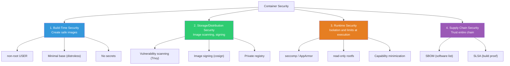
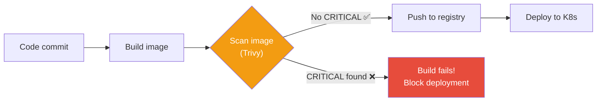
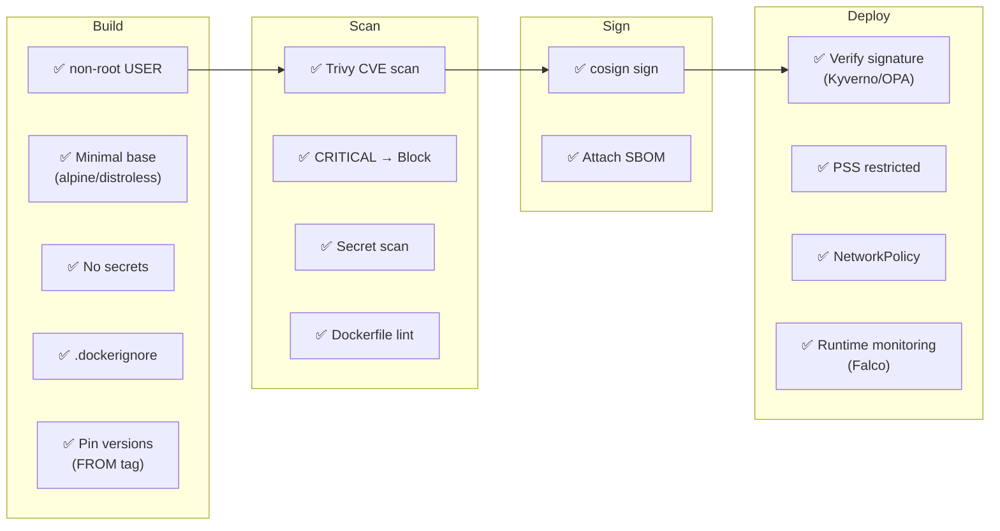

# Container Security (rootless / scanning / signing)

> Containers are convenient, but running with default settings is **riddled with security holes**. Running as root, vulnerable base images, exposed secrets — let's learn everything about container security to prevent these issues.

---

## 🎯 Why Do You Need to Know This?

```
Container security tasks in practice:
• Security audit: "Image has CRITICAL CVE"          → Image scanning
• Compliance: "Container must run non-root"         → Rootless setup
• CI/CD: "Block vulnerable images from deployment" → Scan gate
• Trust: "Did our CI build this image?"             → Image signing
• Runtime: "What if container is compromised?"     → seccomp, AppArmor
• K8s: "Apply Pod Security Standards"              → PSS/PSA
```

We already covered [Linux security](../01-linux/14-security) (SELinux/AppArmor/seccomp) and [network security](../02-networking/09-network-security) (WAF/Zero Trust). This is **container-specific security**.

---

## 🧠 Core Concepts

### 4 Pillars of Container Security



---

## 🔍 Detailed Explanation — Build-Time Security

### Non-Root Execution (★ Most Important and Easiest!)

```dockerfile
# ❌ Run as root (default!)
FROM node:20-alpine
WORKDIR /app
COPY . .
CMD ["node", "server.js"]
# → PID 1 runs as root!
# → If container is compromised, attacker gets host root access!

# ✅ Run as non-root
FROM node:20-alpine
WORKDIR /app
COPY --chown=node:node . .    # Change file owner to node
USER node                      # ← Switch to node user!
CMD ["node", "server.js"]
# → PID 1 runs as node(uid=1000)!
```

```bash
# Verify
docker run --rm myapp:v1.0 whoami
# node    ← non-root! ✅

docker run --rm myapp:v1.0 id
# uid=1000(node) gid=1000(node) groups=1000(node)

# For Python/Go images without node user:
# RUN addgroup -S appgroup && adduser -S appuser -G appgroup
# USER appuser
```

**Built-in users in node:20-alpine:**
```bash
# node:20-alpine already includes 'node' user (uid=1000)
docker run --rm node:20-alpine cat /etc/passwd | grep node
# node:x:1000:1000:Linux User,,,:/home/node:/bin/sh
# → Just use USER node!
```

### Secret Management

```dockerfile
# ❌ Embedding secrets in image
ENV DB_PASSWORD=secret123           # Visible via docker inspect!
COPY .env /app/.env                  # Permanent in image layer!
ARG API_KEY=abc123                   # Visible via docker history!

# ✅ Inject secrets at runtime
# Docker:
docker run -e DB_PASSWORD=secret123 myapp
# → Secret only in memory, not in image

# K8s Secret:
# kubectl create secret generic db-creds --from-literal=password=secret123
# → Mount as env var or file in Pod

# Docker BuildKit secret (used during build, not in image!):
# syntax=docker/dockerfile:1
FROM node:20-alpine
RUN --mount=type=secret,id=npmrc,target=/root/.npmrc \
    npm ci --production
# docker build --secret id=npmrc,src=.npmrc .
```

```bash
# Check if secrets leaked into image

# docker history
docker history myapp:v1.0 --no-trunc | grep -iE "password|secret|key|token"

# Direct layer inspection
docker save myapp:v1.0 | tar -x -C /tmp/image-check/
find /tmp/image-check -name "*.tar" -exec tar -tf {} \; | grep -iE "\.env|secret|key"

# Automated scanning
# Trivy detects secrets:
docker run --rm -v /var/run/docker.sock:/var/run/docker.sock \
    aquasec/trivy:latest image --scanners secret myapp:v1.0
# /app/.env (secrets found!)
# AWS_SECRET_ACCESS_KEY=AKIA...
# → Found! Rebuild image immediately + rotate key!
```

### Principle of Least Privilege

```dockerfile
# ✅ Security-hardened Dockerfile (best practices combined)

FROM node:20-alpine AS builder
WORKDIR /app
COPY package*.json ./
RUN npm ci --production
COPY . .

FROM gcr.io/distroless/nodejs20-debian12
# → No shell, no package manager, no debug tools

WORKDIR /app
COPY --from=builder /app .

# Document port
EXPOSE 3000

# Health check
HEALTHCHECK --interval=30s --timeout=3s \
    CMD ["node", "-e", "require('http').get('http://localhost:3000/health', (r) => process.exit(r.statusCode === 200 ? 0 : 1))"]

# Start
CMD ["server.js"]
```

```bash
# Comprehensive secure runtime options
docker run -d \
    --name secure-app \
    --user 1000:1000 \                             # non-root
    --read-only \                                   # read-only rootfs
    --tmpfs /tmp:rw,noexec,nosuid,size=50m \       # /tmp writable only
    --cap-drop ALL \                                # Drop all capabilities
    --cap-add NET_BIND_SERVICE \                    # Add back only needed
    --security-opt no-new-privileges:true \         # Block privilege escalation
    --security-opt seccomp=default \                # seccomp default profile
    --memory 256m \                                 # Memory limit
    --cpus 0.5 \                                    # CPU limit
    --pids-limit 50 \                               # Process limit
    --network myapp-net \                           # Isolated network
    myapp:v1.0
```

---

## 🔍 Detailed Explanation — Image Scanning (★ Required in Production!)

### Trivy — Most Widely Used Scanner

```bash
# Trivy: Aqua Security's open-source security scanner
# → Scans CVE (vulnerabilities), config errors, secrets, licenses

# Installation
curl -sfL https://raw.githubusercontent.com/aquasecurity/trivy/main/contrib/install.sh | sh -s -- -b /usr/local/bin

# === Scan Image ===
trivy image myapp:v1.0
# myapp:v1.0 (alpine 3.19)
#
# Total: 15 (UNKNOWN: 0, LOW: 8, MEDIUM: 4, HIGH: 2, CRITICAL: 1)
#
# ┌──────────────┬────────────────┬──────────┬───────────┬──────────────┐
# │   Library    │ Vulnerability  │ Severity │ Installed │    Fixed     │
# ├──────────────┼────────────────┼──────────┼───────────┼──────────────┤
# │ openssl      │ CVE-2024-XXXX  │ CRITICAL │ 3.1.0     │ 3.1.5        │
# │ curl         │ CVE-2024-YYYY  │ HIGH     │ 8.5.0     │ 8.6.0        │
# │ libcrypto3   │ CVE-2024-ZZZZ  │ HIGH     │ 3.1.0     │ 3.1.5        │
# │ zlib         │ CVE-2024-WWWW  │ MEDIUM   │ 1.2.13    │ 1.3.0        │
# └──────────────┴────────────────┴──────────┴───────────┴──────────────┘

# Only CRITICAL/HIGH
trivy image --severity CRITICAL,HIGH myapp:v1.0

# Only fixable
trivy image --ignore-unfixed myapp:v1.0

# CI/CD gate (fail if CRITICAL)
trivy image --exit-code 1 --severity CRITICAL myapp:v1.0
# → exit code 1 = build fails!

# JSON output (for parsing/reporting)
trivy image --format json --output result.json myapp:v1.0

# === Scan Dockerfile (config errors) ===
trivy config Dockerfile
# Dockerfile
#   MEDIUM: Specify a tag in the 'FROM' statement
#     → FROM node:latest is risky!
#   HIGH: Last USER should not be root
#     → Must specify USER!

# === Scan Filesystem (source dependencies) ===
trivy fs --scanners vuln,secret .
# → Detects vulnerable packages in package-lock.json, requirements.txt
# → Detects secrets in .env, *.key files

# === Generate SBOM ===
trivy image --format spdx-json --output sbom.json myapp:v1.0
# → Complete list of all software in image (SBOM)
# → Needed for supply chain security + compliance
```

### Automate Image Scanning in CI/CD

```yaml
# GitHub Actions example
# name: Build and Scan
# jobs:
#   build:
#     runs-on: ubuntu-latest
#     steps:
#     - uses: actions/checkout@v4
#
#     - name: Build image
#       run: docker build -t myapp:${{ github.sha }} .
#
#     - name: Scan image
#       uses: aquasecurity/trivy-action@master
#       with:
#         image-ref: myapp:${{ github.sha }}
#         format: table
#         exit-code: 1                    # Fail if CRITICAL!
#         severity: CRITICAL,HIGH
#         ignore-unfixed: true
#
#     - name: Push (only if scan passes)
#       run: |
#         docker tag myapp:${{ github.sha }} $ECR_REPO:${{ github.sha }}
#         docker push $ECR_REPO:${{ github.sha }}
```



### Compare CVEs by Base Image

```bash
# Same app, different bases → CVE count comparison

trivy image --severity CRITICAL,HIGH node:20 2>/dev/null | tail -1
# Total: 45 (HIGH: 35, CRITICAL: 10)

trivy image --severity CRITICAL,HIGH node:20-slim 2>/dev/null | tail -1
# Total: 12 (HIGH: 10, CRITICAL: 2)

trivy image --severity CRITICAL,HIGH node:20-alpine 2>/dev/null | tail -1
# Total: 3 (HIGH: 2, CRITICAL: 1)

trivy image --severity CRITICAL,HIGH gcr.io/distroless/nodejs20-debian12 2>/dev/null | tail -1
# Total: 1 (HIGH: 1, CRITICAL: 0)

# Conclusion:
# node:20        → 45 CVEs (❌ Dangerous!)
# node:20-slim   → 12 CVEs
# node:20-alpine → 3 CVEs (⭐ Recommended)
# distroless     → 1 CVE (🔒 Most secure)

# → Smaller image = fewer CVEs = more secure!
# → (See ./06-image-optimization)
```

---

## 🔍 Detailed Explanation — Image Signing and Verification

### cosign — Image Signing

```bash
# cosign: Sign images to prove they're from your CI/CD
# → "This image is really built by our pipeline" proof

# Installation
# https://docs.sigstore.dev/cosign/installation/

# === Key-based Signing ===

# 1. Generate key pair
cosign generate-key-pair
# Enter password for private key:
# Private key written to cosign.key
# Public key written to cosign.pub

# 2. Sign image
cosign sign --key cosign.key myrepo/myapp:v1.0
# Pushing signature to: myrepo/myapp:sha256-abc123.sig

# 3. Verify signature
cosign verify --key cosign.pub myrepo/myapp:v1.0
# Verification for myrepo/myapp:v1.0 --
# The signatures were verified against the specified public key
# [{"critical":{"identity":{"docker-reference":"myrepo/myapp"},...}]
# → Verification successful! ✅

# === Keyless Signing (No Key Management! ⭐ Recommended) ===

# Sign with OIDC (GitHub, Google, etc.)
cosign sign myrepo/myapp:v1.0
# → Browser login to GitHub/Google
# → Sigstore's transparency log (Rekor) records signing
# → Sign/verify without managing keys!

# Keyless verification
cosign verify \
    --certificate-identity "https://github.com/myorg/myrepo/.github/workflows/build.yml@refs/heads/main" \
    --certificate-oidc-issuer "https://token.actions.githubusercontent.com" \
    myrepo/myapp:v1.0
# → Verify image built by GitHub Actions from main branch!
```

### K8s: Only Allow Signed Images (Policy Enforcement)

```yaml
# Kyverno policy: Only allow cosign-signed images
apiVersion: kyverno.io/v1
kind: ClusterPolicy
metadata:
  name: verify-image-signature
spec:
  validationFailureAction: Enforce    # Block violations (Audit = log only)
  rules:
  - name: verify-cosign
    match:
      any:
      - resources:
          kinds:
          - Pod
    verifyImages:
    - imageReferences:
      - "myrepo/*"
      attestors:
      - entries:
        - keys:
            publicKeys: |-
              -----BEGIN PUBLIC KEY-----
              MFkwEwYHKoZIzj0CAQYIKoZIzj0DAQcDQgAE...
              -----END PUBLIC KEY-----

# → Try to deploy unsigned image:
# Error: image verification failed for myrepo/myapp:v1.0
# → Deployment blocked! ✅
```

---

## 🔍 Detailed Explanation — Runtime Security

### Docker Security Options

```bash
# === Capability Management ===

# Linux capabilities: granular root permissions
# → Instead of full root, grant only needed permissions

# Default Docker capabilities
docker run --rm alpine sh -c "cat /proc/1/status | grep Cap"
# CapPrm: 00000000a80425fb
# → 14 capabilities by default

# Drop all, add only needed
docker run --rm \
    --cap-drop ALL \
    --cap-add NET_BIND_SERVICE \
    alpine sh -c "cat /proc/1/status | grep Cap"
# CapPrm: 0000000000000400
# → Only NET_BIND_SERVICE (bind ports <1024)!

# Key capabilities:
# NET_BIND_SERVICE — Bind ports <1024
# CHOWN            — Change file owner
# SETUID/SETGID    — Change UID/GID
# SYS_PTRACE       — Debug processes (strace)
# NET_ADMIN        — Change network settings
# SYS_ADMIN        — Dangerous! mount, cgroup access

# ⚠️ --privileged = all capabilities + all device access
# → Never use in production!
docker run --privileged myapp    # ❌ NEVER!
```

```bash
# === seccomp Profile ===
# (Covered in detail in ../01-linux/14-security)

# Docker default seccomp: Blocks ~44 dangerous syscalls
# → mount, reboot, ptrace, init_module, etc.

# Apply custom profile
docker run --security-opt seccomp=/path/to/profile.json myapp

# Disable seccomp (⚠️ debugging only!)
docker run --security-opt seccomp=unconfined myapp

# === AppArmor ===

# Docker default AppArmor profile (docker-default)
docker run --security-opt apparmor=docker-default myapp

# Check profile
docker inspect myapp --format '{{.AppArmorProfile}}'
# docker-default

# === Read-Only Filesystem ===

docker run --read-only \
    --tmpfs /tmp:rw,noexec,nosuid,size=50m \
    --tmpfs /var/run:rw,noexec,nosuid,size=10m \
    myapp

# → Attacker can't write malicious files!
# → Only mount writable paths app needs (tmpfs/volumes)

# === no-new-privileges ===

docker run --security-opt no-new-privileges:true myapp
# → Block SUID privilege escalation!
# → Even if SUID file is executed, privilege doesn't increase
```

### K8s Pod Security Standards (PSS)

```yaml
# K8s 1.25+: Pod Security Admission (PSA) enforces policies

# Apply security level to namespace
apiVersion: v1
kind: Namespace
metadata:
  name: production
  labels:
    pod-security.kubernetes.io/enforce: restricted     # ⭐ Strictest!
    pod-security.kubernetes.io/audit: restricted
    pod-security.kubernetes.io/warn: restricted

# Security levels:
# privileged — No restrictions (default)
# baseline   — Basic security (block dangerous settings)
# restricted — Strictest (non-root required, readOnlyRootFilesystem, etc.) ⭐

# "restricted" requires:
# ✅ runAsNonRoot: true
# ✅ allowPrivilegeEscalation: false
# ✅ capabilities.drop: ["ALL"]
# ✅ seccompProfile.type: RuntimeDefault
# ❌ hostNetwork, hostPID, hostIPC forbidden
# ❌ privileged forbidden
```

```yaml
# Pod meeting "restricted" requirements
apiVersion: v1
kind: Pod
metadata:
  name: secure-pod
  namespace: production    # restricted applied
spec:
  securityContext:
    runAsNonRoot: true
    runAsUser: 1000
    runAsGroup: 1000
    fsGroup: 1000
    seccompProfile:
      type: RuntimeDefault
  containers:
  - name: myapp
    image: myapp:v1.0
    securityContext:
      allowPrivilegeEscalation: false
      readOnlyRootFilesystem: true
      capabilities:
        drop: ["ALL"]
    resources:
      limits:
        memory: "256Mi"
        cpu: "500m"
    volumeMounts:
    - name: tmp
      mountPath: /tmp
  volumes:
  - name: tmp
    emptyDir:
      medium: Memory
      sizeLimit: 50Mi
```

---

## 🔍 Detailed Explanation — Supply Chain Security

### SBOM (Software Bill of Materials)

```bash
# SBOM: Complete list of all software in image
# → "What's in this image?" manifest
# → When new CVE found, quickly find affected images

# Generate SBOM with Trivy
trivy image --format spdx-json --output sbom.json myapp:v1.0

# Generate with Syft
syft myapp:v1.0 -o spdx-json > sbom.json

# Example content:
# {
#   "packages": [
#     {"name": "openssl", "version": "3.1.0"},
#     {"name": "curl", "version": "8.5.0"},
#     {"name": "node", "version": "20.11.1"},
#     {"name": "express", "version": "4.18.2"},
#     ...
#   ]
# }

# Attach SBOM to image (cosign)
cosign attest --key cosign.key --type spdxjson --predicate sbom.json myrepo/myapp:v1.0
# → Image + SBOM stored together in registry

# Why SBOM matters?
# 1. Log4Shell incident (CVE-2021-44228):
#    "Which images use Log4j?"
#    → SBOM answers instantly!
# 2. US government/finance requires SBOM
# 3. Transparency to customers about software
```

### Security Checklist — Entire Pipeline



---

## 💻 Hands-On Examples

### Exercise 1: Build Non-Root Container

```bash
mkdir -p /tmp/secure-app && cd /tmp/secure-app

cat << 'EOF' > server.js
const http = require('http');
const os = require('os');
const server = http.createServer((req, res) => {
  res.writeHead(200);
  res.end(JSON.stringify({
    user: os.userInfo().username,
    uid: process.getuid(),
    pid: process.pid
  }));
});
server.listen(3000, () => console.log(`Running as uid=${process.getuid()}`));
EOF

echo '{"name":"secure","version":"1.0.0"}' > package.json
echo "node_modules" > .dockerignore

# ❌ Root version
cat << 'EOF' > Dockerfile.root
FROM node:20-alpine
WORKDIR /app
COPY . .
CMD ["node", "server.js"]
EOF

# ✅ Non-root version
cat << 'EOF' > Dockerfile.secure
FROM node:20-alpine
WORKDIR /app
COPY --chown=node:node . .
USER node
CMD ["node", "server.js"]
EOF

# Build
docker build -f Dockerfile.root -t app:root .
docker build -f Dockerfile.secure -t app:secure .

# Compare
docker run --rm app:root node -e "console.log('uid='+process.getuid())"
# uid=0    ← root! ❌

docker run --rm app:secure node -e "console.log('uid='+process.getuid())"
# uid=1000  ← node! ✅

# Cleanup
docker rmi app:root app:secure
rm -rf /tmp/secure-app
```

### Exercise 2: Scan Images with Trivy

```bash
# Compare CVE counts across base images
for image in "node:20" "node:20-slim" "node:20-alpine"; do
    echo "=== $image ==="
    docker run --rm -v /var/run/docker.sock:/var/run/docker.sock \
        aquasec/trivy:latest image --severity CRITICAL,HIGH --quiet "$image" 2>/dev/null | tail -1
    echo ""
done

# Scan Dockerfile
cat << 'EOF' > /tmp/Dockerfile.bad
FROM node:latest
COPY . .
RUN npm install
CMD node server.js
EOF

docker run --rm -v /tmp:/workdir aquasec/trivy:latest config /workdir/Dockerfile.bad
# Failures: 3
# MEDIUM: Specify a tag in FROM
# HIGH: Last USER should not be root
# LOW: Use COPY instead of ADD

rm /tmp/Dockerfile.bad
```

### Exercise 3: Test Security Options

```bash
# 1. Default (weak security)
docker run --rm alpine sh -c "whoami && cat /proc/1/status | grep Cap"
# root
# CapPrm: 00000000a80425fb    ← Many capabilities!

# 2. Hardened
docker run --rm \
    --user 1000:1000 \
    --cap-drop ALL \
    --read-only \
    --security-opt no-new-privileges:true \
    alpine sh -c "whoami && cat /proc/1/status | grep Cap"
# whoami: unknown uid 1000
# CapPrm: 0000000000000000    ← No capabilities!

# 3. Test read-only
docker run --rm --read-only alpine touch /test
# touch: /test: Read-only file system    ← Can't write! ✅

docker run --rm --read-only --tmpfs /tmp alpine touch /tmp/test
echo $?
# 0    ← /tmp is writable (tmpfs)
```

---

## 🏢 In Practice

### Scenario 1: Security Audit Response

```bash
# "We need container security audit"

# 1. Scan all images
for repo in $(aws ecr describe-repositories --query 'repositories[*].repositoryName' --output text); do
    echo "=== $repo ==="
    latest=$(aws ecr describe-images --repository-name $repo --query 'sort_by(imageDetails,& imagePushedAt)[-1].imageTags[0]' --output text)
    if [ "$latest" != "None" ]; then
        trivy image --severity CRITICAL,HIGH --quiet "$ACCOUNT.dkr.ecr.$REGION.amazonaws.com/$repo:$latest"
    fi
done

# 2. Generate report
trivy image --format json --output report.json myapp:v1.0
# → Submit JSON report to security team

# 3. Improvement plan:
# a. CRITICAL CVE → Fix within 48 hours (base image update)
# b. HIGH CVE → Fix within 7 days
# c. Verify non-root execution
# d. Add scan gate to CI/CD
```

### Scenario 2: Prevent Container Escape

```bash
# "If container is hacked, can attacker break to host?"

# Default (root + default capabilities) = risky!

# Defense layers:
# Layer 1: non-root execution → Block basic escape
# Layer 2: Minimize capabilities → Block kernel manipulation
# Layer 3: seccomp → Block dangerous syscalls
# Layer 4: AppArmor/SELinux → Additional access control
# Layer 5: read-only rootfs → Block malicious file writing
# Layer 6: no-new-privileges → Block privilege escalation

# Apply all layers:
docker run -d \
    --user 1000:1000 \
    --cap-drop ALL \
    --security-opt seccomp=default \
    --security-opt apparmor=docker-default \
    --security-opt no-new-privileges:true \
    --read-only \
    --tmpfs /tmp \
    myapp:v1.0

# For stronger isolation:
# → gVisor (user-space kernel)
# → Kata Containers (micro VM)
# → (See ./04-runtime)
```

### Scenario 3: Build Secure CI/CD Pipeline

```bash
#!/bin/bash
# secure-build.sh — Security build pipeline

set -euo pipefail

IMAGE="myrepo/myapp"
TAG="${GITHUB_SHA:-$(git rev-parse --short HEAD)}"

echo "=== 1. Dockerfile Lint ==="
docker run --rm -v "$(pwd)":/workdir aquasec/trivy:latest config /workdir/Dockerfile
# → Check Dockerfile config errors

echo "=== 2. Build Image ==="
docker build -t "$IMAGE:$TAG" .

echo "=== 3. Vulnerability Scan ==="
trivy image --exit-code 1 --severity CRITICAL "$IMAGE:$TAG"
# → Fail if CRITICAL CVE!

echo "=== 4. Secret Scan ==="
trivy image --scanners secret --exit-code 1 "$IMAGE:$TAG"
# → Fail if secrets in image!

echo "=== 5. Push Image ==="
docker push "$IMAGE:$TAG"

echo "=== 6. Sign Image ==="
cosign sign --key cosign.key "$IMAGE:$TAG"

echo "=== 7. Generate + Attach SBOM ==="
trivy image --format spdx-json --output sbom.json "$IMAGE:$TAG"
cosign attest --key cosign.key --type spdxjson --predicate sbom.json "$IMAGE:$TAG"

echo "✅ Secure build complete: $IMAGE:$TAG"
```

---

## ⚠️ Common Mistakes

### 1. Run as Root

```bash
# ❌ No USER specified → runs as root (uid=0)
# → Container escape = host root!

# ✅ Always specify USER
# USER node (Node.js)
# USER appuser (custom)
```

### 2. Use --privileged

```bash
# ❌ "Not working? Use privileged!"
docker run --privileged myapp
# → All capabilities + all devices = host-like!

# ✅ Add only needed capabilities
docker run --cap-add SYS_PTRACE myapp    # strace
docker run --cap-add NET_ADMIN myapp     # network config
```

### 3. Skip Image Scanning

```bash
# ❌ Build without scanning → Deploy vulnerable image
# → Production breach!

# ✅ Auto-scan in CI/CD + block CRITICAL
# → Trivy + exit-code 1
```

### 4. Put Secrets in Image

```bash
# ❌ COPY .env, ENV secrets, ARG keys
# → docker history, docker save expose everything!

# ✅ Inject at runtime (env vars, K8s Secret, Vault)
# ✅ BuildKit --mount=type=secret (build-only)
```

### 5. Don't Update Base Image

```bash
# ❌ 1-year-old base image
FROM node:18-alpine3.17    # Old, many CVEs!

# ✅ Regular base updates
FROM node:20-alpine3.19    # Latest stable

# CI/CD automation:
# Dependabot / Renovate auto-updates Dockerfile FROM
```

---

## 📝 Summary

### Container Security Checklist

```
Build-Time:
✅ non-root USER
✅ Minimal base image (alpine/distroless)
✅ No secrets (.dockerignore, BuildKit secret)
✅ Exact version tags (no latest)
✅ Use COPY (not ADD)
✅ No unnecessary tools

Scanning:
✅ Trivy auto-scan in CI/CD
✅ Block CRITICAL/HIGH → deployment
✅ Scan for secrets
✅ Generate SBOM

Runtime:
✅ --cap-drop ALL + only needed --cap-add
✅ --read-only + tmpfs
✅ --security-opt no-new-privileges
✅ seccomp default profile
✅ --memory, --cpus, --pids-limit
✅ --privileged NEVER!

K8s:
✅ Pod Security Standards: restricted
✅ NetworkPolicy
✅ Signature verification (Kyverno/OPA)
```

### Security Tools

```
Image Scanning:  Trivy ⭐, Snyk, Grype, Docker Scout
Image Signing:   cosign (Sigstore)
SBOM:           Trivy, Syft
Dockerfile Lint: hadolint, Trivy config
Runtime Monitor: Falco, Sysdig
Policy Enforce:  Kyverno, OPA/Gatekeeper
Secret Manage:   Vault, AWS Secrets Manager, K8s Secrets
```

---

## 🔗 Next Category

🎉 **03-Containers Category Complete!**

Through 9 lectures, we covered containers from basics (concept, Docker CLI, Dockerfile) → runtime, networking, image optimization, registry, troubleshooting, and security — **everything about containers**.

Next is **[04-kubernetes/01-architecture](../04-kubernetes/01-architecture)** — Kubernetes!

We learned Linux, networking, and containers. Now we **orchestrate** everything with K8s!
