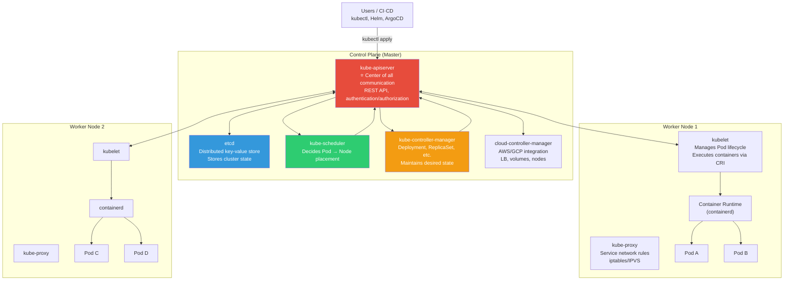
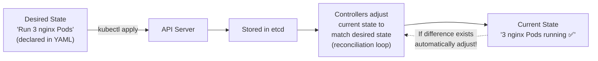
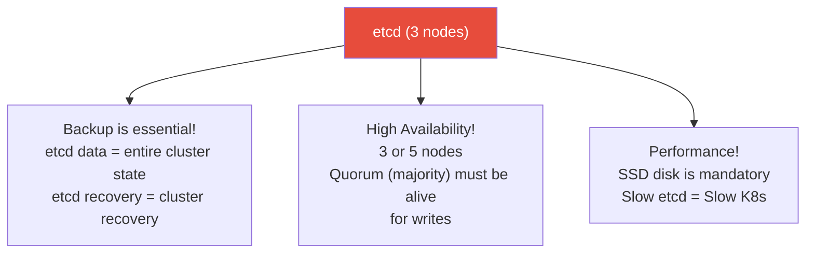
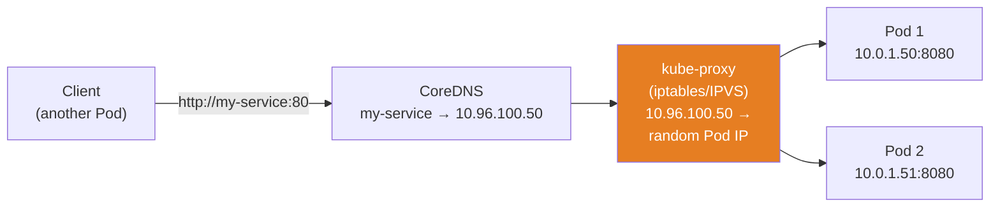
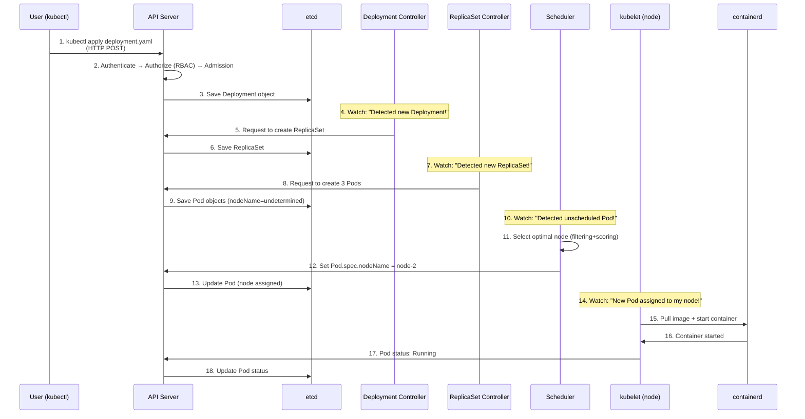
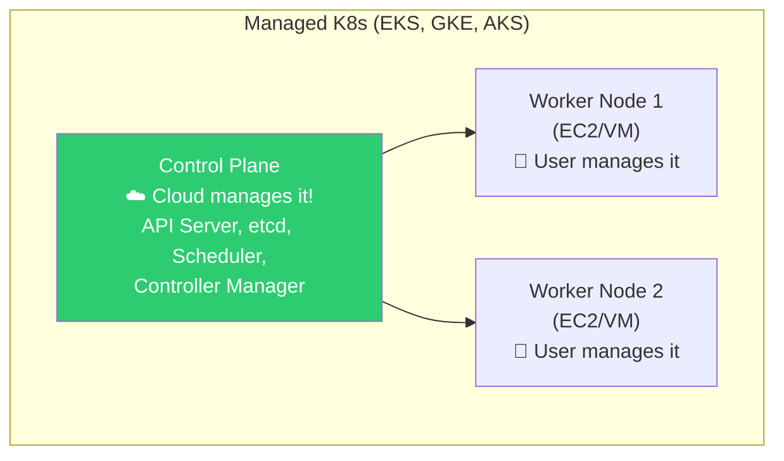
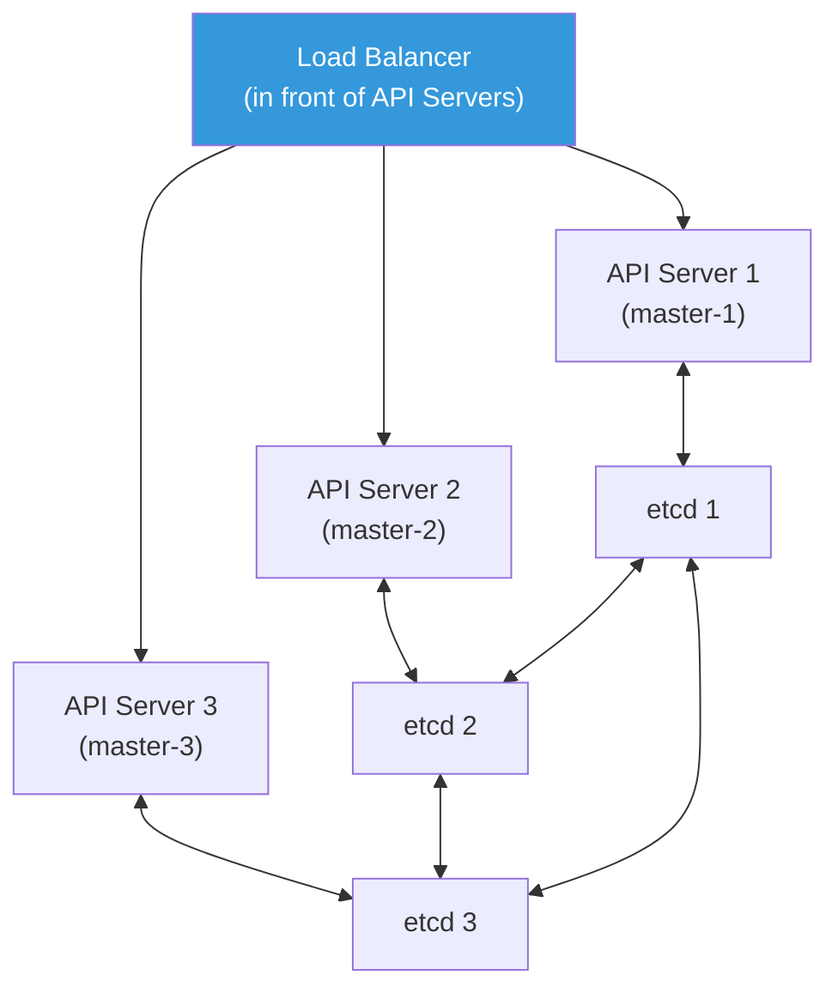

# Kubernetes Cluster Architecture

> Finally, Kubernetes! You've learned [Linux](../01-linux/01-filesystem), [networking](../02-networking/01-osi-tcp-udp), and [containers](../03-containers/01-concept) — now let's enter the world of **orchestration platforms** that automatically manage all of this. Our goal in this lecture is to fully understand the complete structure of K8s.

---

## 🎯 Why Do You Need to Know This?

```
Understanding K8s architecture helps you understand:
• "What happens internally when I run kubectl apply?"
• "Why is etcd so important?"
• "What happens if the master node dies?"
• "Who decides which node a Pod will run on?"
• "What does kubelet do?"
• "Where do I look when diagnosing K8s failures?"
• Interview: "Explain K8s architecture" (the most common question!)
```

---

## 🧠 Core Concepts

### Analogy: Distribution Center

Let me compare K8s to a **large distribution center**.

* **Control Plane (Master)** = Headquarters. Order intake, placement planning, inventory management
* **Worker Node** = Distribution warehouse. Stores and processes actual goods (containers)
* **etcd** = HQ database. All orders, inventory, and placement information is stored
* **API Server** = HQ reception desk. All requests go through here
* **Scheduler** = Placement coordinator. "Which warehouse should this item go to?"
* **Controller Manager** = Quality manager. "We need 3 items in stock but only have 2? Add 1!"
* **kubelet** = Warehouse manager at each location. Receives instructions from HQ to manage the warehouse
* **kube-proxy** = Shipping system between warehouses. Delivers items to appropriate warehouses
* **Pod** = Box containing goods (minimal unit wrapping containers)

---

## 🔍 Detailed Explanation — Complete Architecture

### K8s Cluster Overview



### Core Principle: "Declarative State Management"



```bash
# Declarative: "This state should exist" (declare in YAML)
kubectl apply -f deployment.yaml
# → "Keep 3 nginx instances running"
# → K8s automatically creates 3, recreates them if they die, reduces if too many

# Imperative: "Do this action" (runs once)
kubectl run nginx --image=nginx    # Creates 1 (no maintenance)
kubectl scale --replicas=3 deployment/nginx    # Manually set to 3

# ⭐ In real work, always use declarative (YAML + apply)!
# → Store YAML in Git → GitOps
# → Anyone can see the cluster state
# → Change history is preserved in Git
```

---

## 🔍 Detailed Explanation — Control Plane Components

### kube-apiserver (★ Most Important!)

**Center of all communication**. kubectl, kubelet, controllers, scheduler — all communicate only through the API Server.

```bash
# What the API Server does:
# 1. Provides REST API (CRUD)
# 2. Authentication: "Who are you?"
# 3. Authorization: "Can you do this action?" (RBAC)
# 4. Admission Control: "Does this request match our policies?" (Webhook)
# 5. Stores/retrieves state in etcd
# 6. Watch mechanism (real-time notifications of changes)

# Make direct request to API Server
kubectl get --raw /api/v1/namespaces/default/pods | python3 -m json.tool | head -20
# {
#   "kind": "PodList",
#   "items": [
#     {
#       "metadata": {"name": "nginx-abc123", "namespace": "default"},
#       "status": {"phase": "Running"}
#     }
#   ]
# }

# Check API Server status
kubectl get componentstatuses 2>/dev/null
# or
kubectl get --raw /healthz
# ok

kubectl get --raw /livez
# ok

kubectl get --raw /readyz
# ok

# Check API Server endpoints
kubectl cluster-info
# Kubernetes control plane is running at https://ABC123.gr7.ap-northeast-2.eks.amazonaws.com
# CoreDNS is running at https://ABC123.../api/v1/namespaces/kube-system/services/kube-dns:dns/proxy

# Complete list of API resources
kubectl api-resources | head -20
# NAME                  SHORTNAMES   APIVERSION   NAMESPACED   KIND
# pods                  po           v1           true         Pod
# services              svc          v1           true         Service
# deployments           deploy       apps/v1      true         Deployment
# configmaps            cm           v1           true         ConfigMap
# secrets                            v1           true         Secret
# namespaces            ns           v1           false        Namespace
# nodes                 no           v1           false        Node
# ...
```

### etcd

**The brain of the cluster**. All state information is stored in this distributed key-value store.

```bash
# What is stored in etcd:
# - Status of all resources (Pods, Deployments, Services, etc.)
# - ConfigMap and Secret data
# - RBAC information (Roles, RoleBindings)
# - Namespaces
# - Custom resources (CRD)
# → If etcd dies = cluster loses its memory!

# Check etcd status (not accessible in managed K8s)
# In kubeadm cluster:
sudo ETCDCTL_API=3 etcdctl \
    --endpoints=https://127.0.0.1:2379 \
    --cert=/etc/kubernetes/pki/etcd/peer.crt \
    --key=/etc/kubernetes/pki/etcd/peer.key \
    --cacert=/etc/kubernetes/pki/etcd/ca.crt \
    endpoint health
# 127.0.0.1:2379 is healthy: successfully committed proposal

# Check etcd members
sudo ETCDCTL_API=3 etcdctl member list
# abc123, started, etcd-master-1, https://10.0.1.10:2380, https://10.0.1.10:2379
# def456, started, etcd-master-2, https://10.0.1.11:2380, https://10.0.1.11:2379
# ghi789, started, etcd-master-3, https://10.0.1.12:2380, https://10.0.1.12:2379
# → High availability with 3 nodes! (majority = 2 alive is OK)

# ⚠️ In managed K8s (EKS, GKE, etc.):
# → Cloud manages etcd (inaccessible, auto-backed up)
# → No need to manage directly! (advantage of managed K8s)
```

**Why etcd is critical:**



### kube-scheduler

**Decides which node to place a Pod on**.

```bash
# Scheduler's decision process:
# 1. Filtering: Exclude nodes that don't meet conditions
#    - Insufficient resources (CPU, memory)
#    - nodeSelector/affinity mismatch
#    - Rejected by taints
#    - PV not in that AZ
#
# 2. Scoring: Select optimal node from remaining candidates
#    - Resource balance (most available node)
#    - Spread Pods of same service (anti-affinity)
#    - Image already cached (save pull time)
#
# 3. Binding: Assign Pod to selected node

# Check scheduler events
kubectl get events --field-selector reason=Scheduled
# LAST SEEN   TYPE     REASON      OBJECT        MESSAGE
# 2m          Normal   Scheduled   pod/nginx-1   Successfully assigned default/nginx-1 to node-2
# 1m          Normal   Scheduled   pod/nginx-2   Successfully assigned default/nginx-2 to node-1

# Check scheduling failures
kubectl get events --field-selector reason=FailedScheduling
# Warning  FailedScheduling  pod/big-app  0/3 nodes are available:
#   3 Insufficient memory.
# → All nodes are out of memory!

# Check which node a Pod was placed on
kubectl get pods -o wide
# NAME      READY   STATUS    NODE
# nginx-1   1/1     Running   node-2   ← placed on node-2
# nginx-2   1/1     Running   node-1   ← placed on node-1
```

### kube-controller-manager

**Maintains the desired state**. A collection of controllers that continuously run "reconciliation loops".

```bash
# Key controllers:

# 1. Deployment Controller
# → Maintains replicas count for Deployments
# → Manages deployment strategies (Rolling Update, Recreate)
# Example: If replicas=3 but only 2 Pods exist → add 1!

# 2. ReplicaSet Controller
# → Maintains Pod count for ReplicaSets

# 3. Node Controller
# → Monitors node status (heartbeat)
# → If node unresponsive → move Pods to another node

# 4. Job Controller
# → Manages Pods until Job completes

# 5. Service Account & Token Controller
# → Creates default ServiceAccount, manages tokens

# 6. Endpoints Controller
# → Manages Service Endpoints (Pod IP list)

# Verify controller operation (via events)
kubectl get events --sort-by='.lastTimestamp' | tail -10
# Normal  ScalingReplicaSet  deployment/nginx  Scaled up replica set nginx-abc to 3
# Normal  SuccessfulCreate   replicaset/nginx-abc  Created pod: nginx-abc-1
# Normal  SuccessfulCreate   replicaset/nginx-abc  Created pod: nginx-abc-2
# Normal  SuccessfulCreate   replicaset/nginx-abc  Created pod: nginx-abc-3
# → Order: Deployment Controller → ReplicaSet Controller → Pod creation!
```

### cloud-controller-manager (CCM)

**Integrates with cloud APIs**. Manages AWS, GCP, Azure resources from K8s.

```bash
# What CCM does:

# 1. Node Controller (Cloud)
# → Checks EC2 instance status
# → If instance terminated → marks Node as NotReady

# 2. Route Controller
# → Sets up Pod routing in cloud network

# 3. Service Controller (most visible!)
# → When you create type: LoadBalancer service → auto-creates AWS ALB/NLB!
# → (see ../02-networking/06-load-balancing)

kubectl get svc my-service -o wide
# NAME         TYPE           CLUSTER-IP      EXTERNAL-IP
# my-service   LoadBalancer   10.100.50.100   abc123.ap-northeast-2.elb.amazonaws.com
#                                             ^^^^^^^^^^^^^^^^^^^^^^^^^^^^^^^^^^^^^^^^^
#                                             CCM creates AWS ALB/NLB!

# 4. Volume Controller
# → When you create PersistentVolume → auto-creates AWS EBS volume
```

---

## 🔍 Detailed Explanation — Worker Node Components

### kubelet

**The agent on each node**. Receives instructions from API Server and **runs and manages Pods**.

```bash
# What kubelet does:
# 1. Fetches list of Pods assigned to this node from API Server
# 2. Executes containers via CRI (Container Runtime Interface)
#    → Tells containerd "Start a container from this image"
# 3. Reports Pod status to API Server (heartbeat)
# 4. Executes liveness/readiness/startup probes
# 5. Monitors resources (CPU, memory)
# 6. Manages volume mounts
# 7. Manages logs

# Check kubelet status
systemctl status kubelet
# ● kubelet.service - kubelet: The Kubernetes Node Agent
#    Active: active (running) since ...

# kubelet logs (useful for diagnosing node issues!)
sudo journalctl -u kubelet --since "10 min ago" | tail -20
# → Shows Pod creation failures, image pull failures, etc.

# Check kubelet configuration
kubectl get --raw "/api/v1/nodes/$(hostname)/proxy/configz" 2>/dev/null | python3 -m json.tool | head -20

# Check node's allocatable resources (resources available for Pods)
kubectl describe node node-1 | grep -A 10 "Allocatable"
# Allocatable:
#   cpu:                3920m     ← 3.92 cores out of 4 available (kubelet reserves some)
#   memory:             7484Mi    ← 7.5GB out of 8GB available
#   pods:               110       ← Maximum Pods
#   ephemeral-storage:  47884Mi

# Check Pods running on a node
kubectl get pods --field-selector spec.nodeName=node-1 -A
```

### kube-proxy

**Manages Service network rules**. Creates rules to forward requests arriving at Service ClusterIP to actual Pod IPs.

```bash
# What kube-proxy does:
# Service ClusterIP (10.96.100.50) → actual Pod IPs (10.0.1.50, 10.0.1.51) via DNAT

# Implementation modes:

# 1. iptables mode (default)
# → Creates iptables NAT rule for each Service
# → Can slow down with many Services (thousands) due to many rules

# 2. IPVS mode (recommended for scale)
# → Uses Linux kernel's IPVS (IP Virtual Server)
# → Hash table management → maintains performance even with many Services
# → Supports more load balancing algorithms

# Check kube-proxy mode
kubectl get configmap kube-proxy -n kube-system -o yaml | grep mode
# mode: "iptables"    ← or "ipvs"

# Check iptables rules (created by kube-proxy)
sudo iptables -t nat -L -n | grep my-service
# KUBE-SVC-XXXXX  tcp  --  0.0.0.0/0  10.96.100.50  tcp dpt:80
# → Distributes requests to 10.96.100.50:80 to Pods

# Check Service Endpoints (kube-proxy uses these to create rules)
kubectl get endpoints my-service
# NAME         ENDPOINTS                       AGE
# my-service   10.0.1.50:8080,10.0.1.51:8080  5d
#              ^^^^^^^^^^^^^^  ^^^^^^^^^^^^^^
#              Pod 1 IP        Pod 2 IP

# (see ../02-networking/12-service-discovery for detailed Service Discovery)
```



---

## 🔍 Detailed Explanation — Complete kubectl apply Journey

Let's trace what happens internally when you run `kubectl apply -f deployment.yaml`.



```bash
# You can observe this process in real-time!

# Terminal 1: Watch events in real-time
kubectl get events -w

# Terminal 2: Watch Pod status in real-time
kubectl get pods -w

# Terminal 3: Deploy Deployment
kubectl apply -f - << 'EOF'
apiVersion: apps/v1
kind: Deployment
metadata:
  name: nginx-demo
spec:
  replicas: 3
  selector:
    matchLabels:
      app: nginx
  template:
    metadata:
      labels:
        app: nginx
    spec:
      containers:
      - name: nginx
        image: nginx:1.25
        ports:
        - containerPort: 80
EOF

# Terminal 1 (events):
# Normal  ScalingReplicaSet  deployment/nginx-demo  Scaled up replica set nginx-demo-abc to 3
# Normal  SuccessfulCreate   replicaset/nginx-demo-abc  Created pod: nginx-demo-abc-1
# Normal  Scheduled          pod/nginx-demo-abc-1  Successfully assigned default/nginx-demo-abc-1 to node-2
# Normal  Pulling            pod/nginx-demo-abc-1  Pulling image "nginx:1.25"
# Normal  Pulled             pod/nginx-demo-abc-1  Successfully pulled image "nginx:1.25"
# Normal  Created            pod/nginx-demo-abc-1  Created container nginx
# Normal  Started            pod/nginx-demo-abc-1  Started container nginx

# → Order: Deployment → ReplicaSet → Pod → Scheduling → Pull → Start!

# Cleanup
kubectl delete deployment nginx-demo
```

---

## 🔍 Detailed Explanation — Managed K8s vs Self-Installed

### EKS, GKE, AKS (Managed)



```bash
# Managed K8s (EKS) advantages:
# ✅ AWS manages Control Plane (etcd backup, upgrades, high availability)
# ✅ No worry about master node count or etcd
# ✅ Create cluster with few clicks
# ✅ Cloud integrations (IAM, VPC, etc.)
# ❌ No SSH access to Control Plane (customization limited)
# ❌ Cost (EKS: $0.10/hour = ~$73/month + node costs)

# EKS cluster info
kubectl cluster-info
# Kubernetes control plane is running at https://ABC123.gr7.ap-northeast-2.eks.amazonaws.com

# EKS etcd: direct access unavailable!
# → AWS automatically backs up/manages

# Check nodes
kubectl get nodes -o wide
# NAME                    STATUS   ROLES    VERSION   OS-IMAGE             CONTAINER-RUNTIME
# ip-10-0-1-50.ec2...    Ready    <none>   v1.28.0   Amazon Linux 2023    containerd://1.7.2
# ip-10-0-1-51.ec2...    Ready    <none>   v1.28.0   Amazon Linux 2023    containerd://1.7.2
# → ROLES is <none> = Worker Node (masters hidden in EKS)
```

### kubeadm (Self-Installed)

```bash
# Self-installed K8s:
# ✅ Complete control (manage etcd directly, full customization)
# ✅ On-premises/private cloud capable
# ✅ Cost-effective (VM/EC2 costs only)
# ❌ Manage Control Plane yourself (upgrades, backup, HA)
# ❌ Complex initial setup
# ❌ etcd management is critical and difficult

# Node structure with kubeadm:
kubectl get nodes
# NAME       STATUS   ROLES           VERSION
# master-1   Ready    control-plane   v1.28.0    ← Control Plane
# master-2   Ready    control-plane   v1.28.0    ← Control Plane (HA)
# master-3   Ready    control-plane   v1.28.0    ← Control Plane (HA)
# worker-1   Ready    <none>          v1.28.0    ← Worker
# worker-2   Ready    <none>          v1.28.0    ← Worker

# Check Control Plane components (self-installed only)
kubectl get pods -n kube-system
# NAME                              READY   STATUS    NODE
# etcd-master-1                     1/1     Running   master-1
# etcd-master-2                     1/1     Running   master-2
# etcd-master-3                     1/1     Running   master-3
# kube-apiserver-master-1           1/1     Running   master-1
# kube-controller-manager-master-1  1/1     Running   master-1
# kube-scheduler-master-1           1/1     Running   master-1
# coredns-5644d7b6d9-abc12          1/1     Running   worker-1
# coredns-5644d7b6d9-def34          1/1     Running   worker-2
# kube-proxy-xxxxx                  1/1     Running   worker-1
# kube-proxy-yyyyy                  1/1     Running   worker-2
```

### Selection Guide

```bash
# Recommendations by scenario:

# Production on AWS → EKS ⭐
# Production on GCP → GKE ⭐ (Autopilot mode recommended)
# Production on Azure → AKS
# On-premises → kubeadm or Rancher/k3s
# Learning/Development → minikube, kind, k3d (local)
# Small-scale/Edge → k3s (lightweight K8s)
```

---

## 🔍 Detailed Explanation — High Availability (HA)

### Control Plane HA



```bash
# HA configuration:
# API Server: Multiple instances + load balancer (Stateless, easy to scale)
# etcd: 3 or 5 nodes (Raft consensus → quorum required)
#   3 nodes: 1 can die (quorum = 2)
#   5 nodes: 2 can die (quorum = 3)
# Scheduler: Active-Standby (leader election)
# Controller Manager: Active-Standby (leader election)

# Check leader election
kubectl get endpoints kube-scheduler -n kube-system -o yaml | grep holderIdentity
# holderIdentity: master-1_abc123    ← master-1 is current leader

# In EKS/GKE?
# → Cloud automatically configures HA! (no user action needed)
# → etcd automatically 3+ replicas, spread across AZs
```

---

## 💻 Hands-On Practice

### Exercise 1: Check All Cluster Components

```bash
# 1. Cluster information
kubectl cluster-info
kubectl version --short 2>/dev/null || kubectl version

# 2. Node list + details
kubectl get nodes -o wide
kubectl describe node $(kubectl get nodes -o jsonpath='{.items[0].metadata.name}') | head -40

# 3. Namespaces
kubectl get namespaces
# NAME              STATUS   AGE
# default           Active   30d
# kube-system       Active   30d    ← system components
# kube-public       Active   30d
# kube-node-lease   Active   30d    ← node heartbeat

# 4. System components (kube-system)
kubectl get pods -n kube-system
# coredns, kube-proxy, (aws-node, coredns, etc.)

# 5. Complete list of API resources
kubectl api-resources --sort-by name | head -20

# 6. Cluster events
kubectl get events -A --sort-by='.lastTimestamp' | tail -10
```

### Exercise 2: Observe kubectl apply Process

```bash
# Terminal 1: Watch events
kubectl get events -w &

# Create Deployment in terminal
kubectl create deployment test-observe --image=nginx --replicas=2

# Events output:
# ScalingReplicaSet → SuccessfulCreate → Scheduled → Pulling → Pulled → Created → Started

# Check Pod status
kubectl get pods -l app=test-observe -o wide
# NAME                     READY   STATUS    NODE
# test-observe-abc-1       1/1     Running   node-1
# test-observe-abc-2       1/1     Running   node-2

# Check ReplicaSet
kubectl get replicaset -l app=test-observe
# NAME                DESIRED   CURRENT   READY
# test-observe-abc    2         2         2

# Ownership chain: Deployment → ReplicaSet → Pod
kubectl get deployment test-observe -o jsonpath='{.metadata.uid}'
kubectl get replicaset -l app=test-observe -o jsonpath='{.items[0].metadata.ownerReferences[0].uid}'
# → Same UID! Deployment owns the ReplicaSet!

# Delete one Pod → auto-recreated!
kubectl delete pod $(kubectl get pods -l app=test-observe -o name | head -1)
kubectl get pods -l app=test-observe
# → New Pod created automatically! (ReplicaSet Controller maintains replicas=2)

# Cleanup
kill %1 2>/dev/null
kubectl delete deployment test-observe
```

### Exercise 3: Check Node Resources

```bash
# 1. Node resource capacity/usage
kubectl top nodes
# NAME     CPU(cores)   CPU%   MEMORY(bytes)   MEMORY%
# node-1   250m         6%     1500Mi          20%
# node-2   180m         4%     1200Mi          16%

# 2. Pod count by node
kubectl get pods -A -o wide --no-headers | awk '{print $8}' | sort | uniq -c | sort -rn
# 25 node-1
# 20 node-2

# 3. Node's allocatable resources
kubectl describe node node-1 | grep -A 6 "Allocatable:"
# Allocatable:
#   cpu:                3920m
#   memory:             7484Mi
#   pods:               110

# 4. Pods running on node and their resource requests
kubectl describe node node-1 | grep -A 30 "Non-terminated Pods:"
# Non-terminated Pods:
#   Namespace  Name           CPU Requests  CPU Limits  Memory Requests  Memory Limits
#   default    nginx-abc-1    100m (2%)     200m (5%)   128Mi (1%)       256Mi (3%)
#   default    myapp-def-1    250m (6%)     500m (12%)  256Mi (3%)       512Mi (6%)
#   ...
# Allocated resources:
#   CPU Requests: 1500m (38%)    ← 38% requested
#   CPU Limits:   3000m (76%)
#   Memory Requests: 2048Mi (27%)
#   Memory Limits:   4096Mi (54%)
```

---

## 🏢 In Real Work

### Scenario 1: "Pod is Pending and Not Scheduling"

```bash
kubectl get pods
# NAME        READY   STATUS    RESTARTS   AGE
# big-app-1   0/1     Pending   0          5m    ← Stuck in Pending!

kubectl describe pod big-app-1 | grep -A 5 Events
# Events:
#   Warning  FailedScheduling  0/3 nodes are available:
#     2 Insufficient cpu, 1 node(s) had taint "node.kubernetes.io/not-ready"

# Root cause: All nodes out of CPU!

# Solutions:
# 1. Add nodes (Auto Scaling)
# 2. Reduce Pod's resource.requests
# 3. Scale down other Deployments (reduce replicas)
# 4. Check node capacity
kubectl top nodes
kubectl describe node node-1 | grep -A 5 "Allocated resources"
```

### Scenario 2: "Control Plane (Master) Failure"

```bash
# EKS/GKE (Managed):
# → Cloud automatically configures HA
# → If API Server briefly unavailable, worker node Pods keep running!
# → Only Pod creation/scheduling is blocked
# → Auto-recovers after cloud fixes it

# Self-Installed (kubeadm):
# Single Control Plane = SPOF (cluster management impossible on failure)
# Must configure 3+ masters for HA

# If API Server dies:
# → kubectl stops working
# → Cannot create/delete Pods
# → Existing Pods keep running! (kubelet manages independently)
# → kubelet maintains last known state and keeps containers running

# If etcd dies:
# → Most critical! Cluster loses state information
# → Recoverable if backup exists (detailed in 16-backup-dr lecture)
```

### Scenario 3: "Pods Keep Dying on a Specific Node"

```bash
# 1. Check node status
kubectl get nodes
# NAME     STATUS     ROLES    AGE   VERSION
# node-1   Ready      <none>   30d   v1.28.0
# node-2   NotReady   <none>   30d   v1.28.0    ← NotReady!

# 2. Check node details (Conditions)
kubectl describe node node-2 | grep -A 15 "Conditions:"
# Conditions:
#   Type              Status   Reason
#   MemoryPressure    True     KubeletHasMemoryPressure    ← Out of memory!
#   DiskPressure      False
#   PIDPressure       False
#   Ready             False    KubeletNotReady

# 3. SSH to node for investigation
ssh node-2
free -h                    # Memory (see ../01-linux/12-performance)
df -h                      # Disk (see ../01-linux/07-disk)
top                        # Processes (see ../01-linux/04-process)
sudo journalctl -u kubelet --since "10 min ago" | tail -30

# 4. Find root cause in kubelet logs
# kubelet has exceeded eviction threshold and is killing Pods
# → Memory shortage → kubelet evicts Pods

# 5. Solutions
# a. Expand node memory (change instance type)
# b. Find memory-hungry Pod and adjust limits
# c. Add more nodes (distribute load)
```

---

## ⚠️ Common Mistakes

### 1. Operating with Only 1 Control Plane

```bash
# ❌ Single master = SPOF (Single Point of Failure)
# → Cluster management impossible if master fails!

# ✅ Use managed K8s (EKS, GKE) → automatic HA
# ✅ If self-installed, use 3+ masters minimum
```

### 2. Not Backing Up etcd

```bash
# ❌ No etcd backup → complete cluster data loss on failure!

# ✅ Regular backups (kubeadm environment)
sudo ETCDCTL_API=3 etcdctl snapshot save /backup/etcd-$(date +%Y%m%d).db \
    --endpoints=https://127.0.0.1:2379 \
    --cert=/etc/kubernetes/pki/etcd/peer.crt \
    --key=/etc/kubernetes/pki/etcd/peer.key \
    --cacert=/etc/kubernetes/pki/etcd/ca.crt

# ✅ EKS/GKE: automatic backup (no action needed!)
# (see 16-backup-dr lecture for details)
```

### 3. Not Monitoring Node Resources

```bash
# ❌ No visibility into node CPU/memory → discover issues too late
# → Pods won't schedule or nodes become NotReady

# ✅ Regularly check kubectl top nodes / kubectl top pods
# ✅ Use Prometheus + Grafana for continuous monitoring (see 08-observability)
# ✅ Use Cluster Autoscaler for auto node scaling (see 10-autoscaling)
```

### 4. Deploying Everything to default Namespace

```bash
# ❌ All services in default namespace
kubectl get pods -n default
# 100 Pods in one place... unmanageable!

# ✅ Separate namespaces by environment/team/service
kubectl create namespace production
kubectl create namespace staging
kubectl create namespace monitoring
# → Enables isolation, RBAC, resource quotas
```

### 5. Not Understanding Watch Mechanism

```bash
# K8s core: Components watch API Server
# → When resource created/changed → related components notified immediately

# If you don't know this:
# "Why does creating a Deployment auto-create Pods?"
# → Deployment Controller watches API Server
# → Detects new Deployment → creates ReplicaSet → Pod creation
# → Entire flow is watch + reaction pattern!
```

---

## 📝 Summary

### K8s Architecture at a Glance

```
Control Plane (Brain):
├── API Server     ← Center of all communication (REST API)
├── etcd           ← Cluster state storage (distributed DB)
├── Scheduler      ← Pod → Node placement decision
├── Controller Mgr ← Maintains desired state (reconciliation loop)
└── Cloud Controller ← Cloud integration (LB, EBS, etc.)

Worker Node (Muscle):
├── kubelet        ← Pod lifecycle management (CRI calls)
├── kube-proxy     ← Service network rules (iptables/IPVS)
└── Container Runtime ← Container execution (containerd)
```

### kubectl apply Flow

```
kubectl apply → API Server (authenticate/authorize/admission)
→ Store in etcd
→ Controller watches → ReplicaSet creation → Pod creation
→ Scheduler watches → Assign to node
→ kubelet watches → Start container
→ kubelet → Report status to API Server
```

### Essential Commands

```bash
kubectl cluster-info                    # Cluster info
kubectl get nodes -o wide               # Node list + details
kubectl top nodes / pods                # Resource usage
kubectl describe node NODE              # Node details (Conditions, Allocatable)
kubectl get pods -A                     # Pods in all namespaces
kubectl get events --sort-by='.lastTimestamp'  # Recent events
kubectl get componentstatuses           # Component status
kubectl api-resources                   # API resource list
```

---

## 🔗 Next Lecture

Next is **[02-pod-deployment](./02-pod-deployment)** — Pods / Deployments / ReplicaSets.

Starting with **Pod**, the most basic unit in K8s, we'll learn the relationship between **Deployment** and **ReplicaSet** (always used in production), and Rolling Updates.
