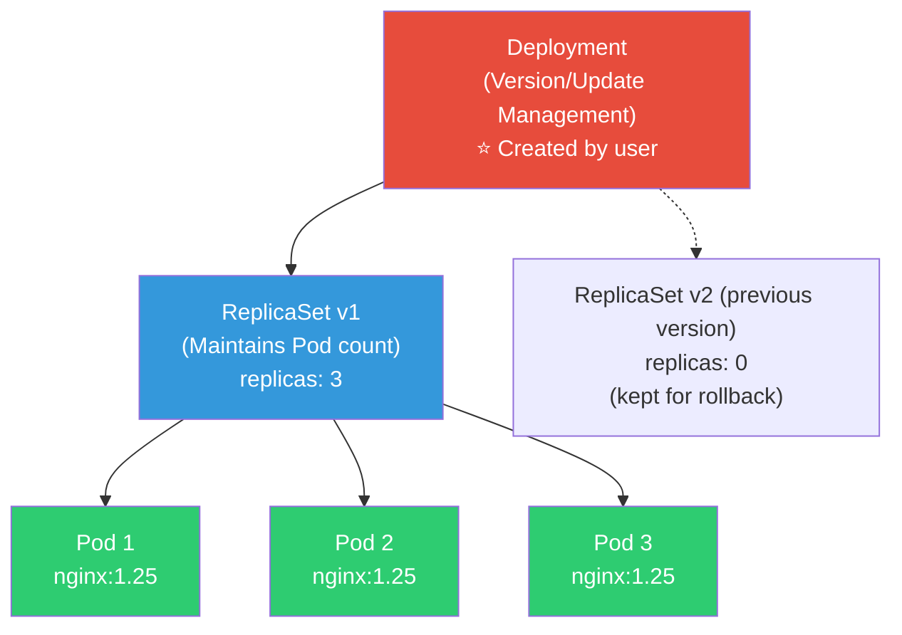
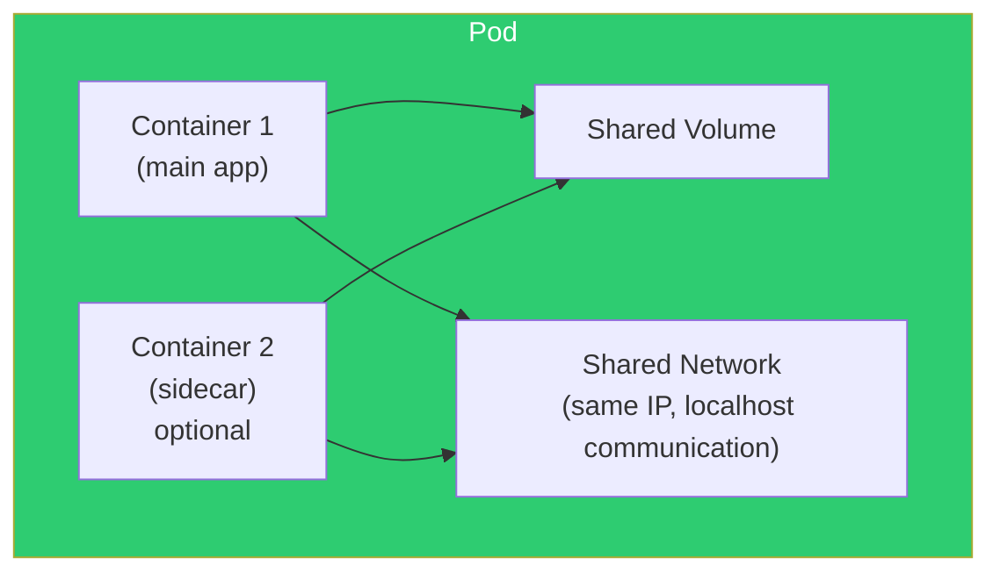
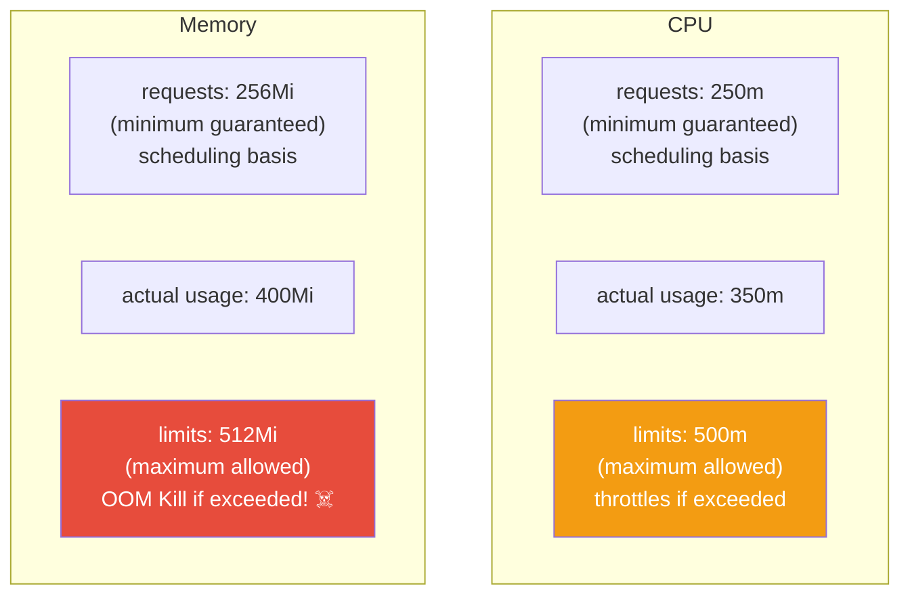
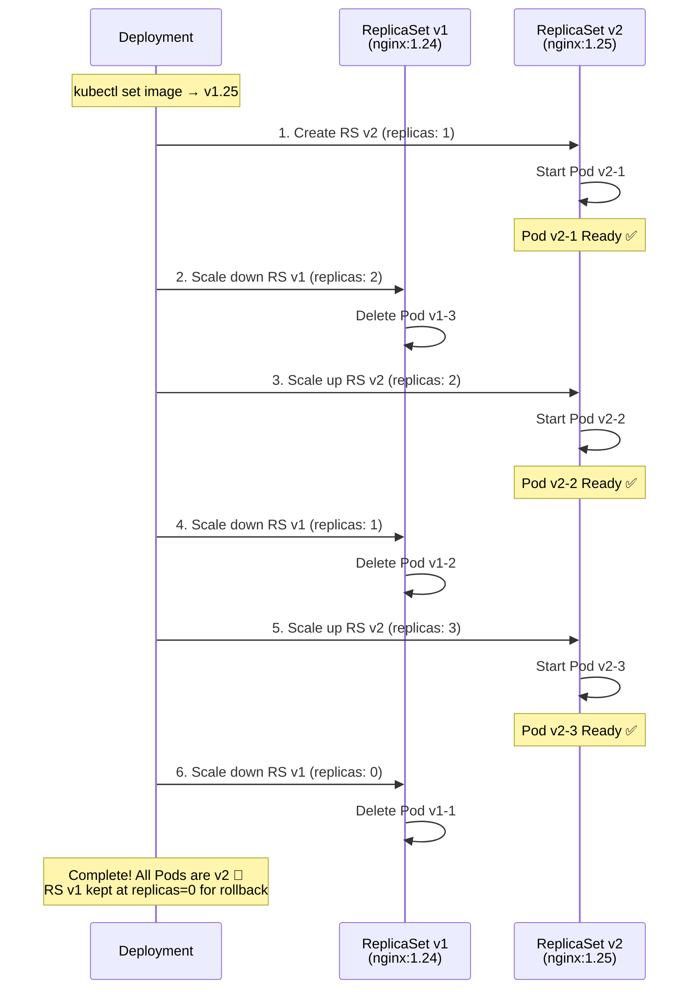
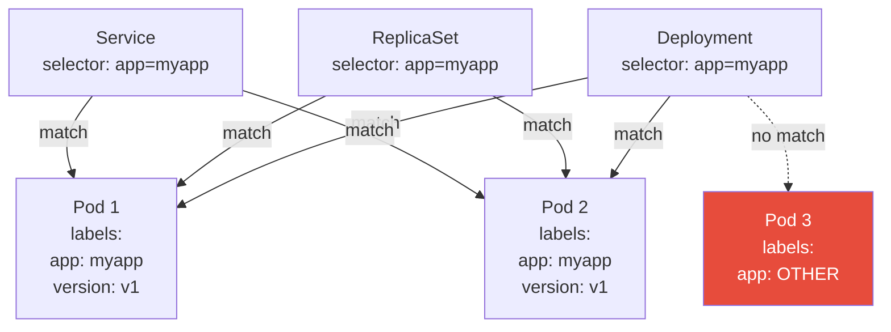

# Pod / Deployment / ReplicaSet

> Containers are never run directly in K8s. Containers are wrapped in **Pods**, Pod count is managed by **ReplicaSets**, and ReplicaSet versions are managed by **Deployments**. This three-tier structure is the foundation of K8s workloads.

---

## 🎯 Why Do You Need to Know This?

```
Most basic and frequently used K8s resources:
• Deploying an app = Creating a Deployment
• Scaling = Changing replicas number
• Updating = Changing image tag (Rolling Update)
• Rolling back = Reverting to previous ReplicaSet
• "Why did Pod die?" = Understanding Pod status
• "Why must there be 3 Pods?" = Understanding ReplicaSet's role
```

In the [previous lecture](./01-architecture), you saw the Deployment → ReplicaSet → Pod flow. Now let's dive deep into each.

---

## 🧠 Core Concepts

### Three-Tier Structure: Deployment → ReplicaSet → Pod



**Each role:**
* **Pod** — Minimal unit wrapping containers. Contains 1+ containers
* **ReplicaSet** — **Maintains Pod count**. "Keep 3 alive" → recreates if killed
* **Deployment** — **Version-manages** ReplicaSet. Handles updates/rollbacks

```bash
# In real work:
# ✅ Create Deployments (users)
# ✅ ReplicaSets auto-created (by Deployment)
# ✅ Pods auto-created (by ReplicaSet)
# ❌ Don't directly create Pods (except one-off testing)
# ❌ Don't directly create ReplicaSets
```

---

## 🔍 Detailed Explanation — Pod

### What is a Pod?

**The smallest deployable unit** in K8s. It's a wrapper around [containers](../03-containers/01-concept).



**Pod characteristics:**
* Contains 1+ containers (typically 1)
* Containers in same Pod share **same IP**, **same network namespace**
* Containers in same Pod can communicate via **localhost**
* Containers in same Pod can share **volumes**
* Pods are **ephemeral** — when killed, a new Pod is created (not resurrection!)

### Pod YAML in Detail

```yaml
apiVersion: v1
kind: Pod
metadata:
  name: myapp-pod
  namespace: default
  labels:                              # ⭐ Labels (used for search/selection)
    app: myapp
    version: v1
    environment: production
  annotations:                         # Metadata (informational)
    description: "My application pod"
spec:
  containers:
  - name: myapp                        # Container name
    image: myapp:v1.0                  # Image
    ports:
    - containerPort: 3000              # Documentation only (doesn't actually open port)
      name: http

    # === Resource Management ===
    resources:
      requests:                        # Minimum guaranteed (scheduling basis)
        cpu: "250m"                    # 0.25 core
        memory: "256Mi"                # 256MB
      limits:                          # Maximum allowed (exceeding = limit/kill)
        cpu: "500m"                    # 0.5 core
        memory: "512Mi"                # 512MB (OOM Kill if exceeded!)

    # === Environment Variables ===
    env:
    - name: NODE_ENV
      value: "production"
    - name: DB_HOST
      valueFrom:
        configMapKeyRef:               # From ConfigMap (detailed in 04-config-secret)
          name: app-config
          key: db_host
    - name: DB_PASSWORD
      valueFrom:
        secretKeyRef:                  # From Secret
          name: db-credentials
          key: password

    # === Volume Mounts ===
    volumeMounts:
    - name: data
      mountPath: /app/data
    - name: config
      mountPath: /app/config
      readOnly: true

    # === Health Checks (detailed in 08-healthcheck) ===
    livenessProbe:                     # "Alive?" — restart on failure
      httpGet:
        path: /health
        port: 3000
      initialDelaySeconds: 10
      periodSeconds: 10
    readinessProbe:                    # "Ready?" — block traffic on failure
      httpGet:
        path: /ready
        port: 3000
      initialDelaySeconds: 5
      periodSeconds: 5

  # === Volume Definition ===
  volumes:
  - name: data
    persistentVolumeClaim:
      claimName: myapp-data
  - name: config
    configMap:
      name: myapp-config

  # === Scheduling ===
  nodeSelector:                        # Place on specific nodes
    kubernetes.io/os: linux

  # === Security ===
  securityContext:                     # (see ../03-containers/09-security)
    runAsNonRoot: true
    runAsUser: 1000
    fsGroup: 1000

  # === Restart Policy ===
  restartPolicy: Always                # Always(default), OnFailure, Never

  # === Termination Grace Period ===
  terminationGracePeriodSeconds: 30    # Wait 30s after SIGTERM → SIGKILL
```

### Pod Resource Management (requests / limits)



```bash
# CPU units:
# 1 = 1 vCPU = 1000m (millicores)
# 250m = 0.25 vCPU
# 100m = 0.1 vCPU

# Memory units:
# Mi = Mebibyte (1 Mi = 1,048,576 bytes)
# Gi = Gibibyte
# M = Megabyte (1 M = 1,000,000 bytes) ← Note: different from Mi!

# CPU limits exceeded → throttling (slowdown, not killed)
# Memory limits exceeded → OOM Kill! (container restart)

# No requests? → scheduler does its best but can't guarantee
# No limits? → container can use all node resources (dangerous!)

# Check resource usage
kubectl top pods
# NAME        CPU(cores)   MEMORY(bytes)
# myapp-1     120m         300Mi
# myapp-2     95m          280Mi
# myapp-3     110m         310Mi

# Real-world guidelines:
# requests = typical usage (P50)
# limits = peak usage (P99) × 1.2 or so
# Some argue against CPU limits (throttling can be harmful)
# Memory limits are mandatory! (OOM prevention)
```

### Pod Status (Phase)

```bash
kubectl get pods
# NAME        READY   STATUS              RESTARTS   AGE
# myapp-1     1/1     Running             0          5d     ← normal!
# myapp-2     0/1     Pending             0          5m     ← waiting for scheduling
# myapp-3     0/1     ContainerCreating   0          30s    ← image pulling
# myapp-4     0/1     CrashLoopBackOff    5          10m    ← start→crash cycle!
# myapp-5     0/1     ImagePullBackOff    0          3m     ← image pull failed
# myapp-6     1/1     Terminating         0          1m     ← shutting down
# myapp-7     0/1     Error               0          2m     ← terminated with error
# myapp-8     0/1     OOMKilled           3          15m    ← out of memory!
# myapp-9     0/1     Init:0/2            0          1m     ← init container running

# Response by status:
# Pending        → kubectl describe pod → check scheduling failure reason
# ImagePullBackOff → verify image name/tag/registry auth
# CrashLoopBackOff → kubectl logs --previous → check app error
# OOMKilled      → increase resources.limits.memory
# Error          → kubectl logs → check app error
```

### Pod Basic Commands

```bash
# === Query ===
kubectl get pods                           # Current namespace
kubectl get pods -A                        # All namespaces
kubectl get pods -o wide                   # Include nodes, IPs
kubectl get pods -l app=myapp              # Filter by label
kubectl get pods --sort-by='.status.phase' # Sort by status
kubectl get pods -o yaml                   # YAML output
kubectl get pods -w                        # Real-time watch

# === Details ===
kubectl describe pod myapp-1               # ⭐ Events, all status
kubectl get pod myapp-1 -o jsonpath='{.status.phase}'    # Specific field

# === Logs ===
kubectl logs myapp-1                       # Logs
kubectl logs myapp-1 -f                    # Real-time logs
kubectl logs myapp-1 --previous            # Previous container logs (before restart)
kubectl logs myapp-1 -c sidecar            # Specific container (multi-container)
kubectl logs -l app=myapp --all-containers # Multiple Pods by label

# === Access ===
kubectl exec -it myapp-1 -- bash           # Shell access
kubectl exec -it myapp-1 -- sh             # sh if bash not available
kubectl exec myapp-1 -- cat /etc/hosts     # Run command only
kubectl exec -it myapp-1 -c sidecar -- sh  # Specific container

# === Port Forwarding ===
kubectl port-forward myapp-1 8080:3000     # Local 8080 → Pod 3000
# → Access Pod directly from browser at http://localhost:8080!
# → Very useful for debugging

# === Create/Delete ===
kubectl run test --image=busybox --rm -it -- sh   # One-off Pod
kubectl delete pod myapp-1                          # Delete (Deployment recreates)
kubectl delete pod myapp-1 --force --grace-period=0 # Force immediate delete
```

---

## 🔍 Detailed Explanation — Deployment

### What is a Deployment?

**Manages declarative updates of Pods**. In real work, you **always** use Deployments when deploying apps.

### Deployment YAML in Detail

```yaml
apiVersion: apps/v1
kind: Deployment
metadata:
  name: myapp
  namespace: production
  labels:
    app: myapp
spec:
  replicas: 3                          # ⭐ Pod count

  selector:                            # ⭐ Which Pods to manage (select by labels)
    matchLabels:
      app: myapp                       # → manage Pods with label app=myapp

  strategy:                            # ⭐ Update strategy
    type: RollingUpdate                # RollingUpdate(default) or Recreate
    rollingUpdate:
      maxSurge: 1                      # Additional Pods during update (25% or number)
      maxUnavailable: 0                # Unavailable Pods during update
      # maxSurge:1, maxUnavailable:0 → maintain 3+ while replacing 1 at a time!

  revisionHistoryLimit: 10             # Keep previous ReplicaSets for rollback

  minReadySeconds: 5                   # Wait 5s after Pod Ready before next

  template:                            # ⭐ Pod template (below here is Pod spec!)
    metadata:
      labels:
        app: myapp                     # Must match selector.matchLabels!
    spec:
      containers:
      - name: myapp
        image: myapp:v1.0              # ⭐ Image (change this for Rolling Update!)
        ports:
        - containerPort: 3000
        resources:
          requests:
            cpu: "250m"
            memory: "256Mi"
          limits:
            cpu: "500m"
            memory: "512Mi"
        livenessProbe:
          httpGet:
            path: /health
            port: 3000
          initialDelaySeconds: 10
          periodSeconds: 10
        readinessProbe:
          httpGet:
            path: /ready
            port: 3000
          initialDelaySeconds: 5
          periodSeconds: 5
```

### Deployment Basic Commands

```bash
# === Create ===
kubectl apply -f deployment.yaml

# Or quickly (testing)
kubectl create deployment nginx --image=nginx:1.25 --replicas=3

# === Query ===
kubectl get deployments
# NAME    READY   UP-TO-DATE   AVAILABLE   AGE
# myapp   3/3     3            3           5d
#         ^^^     ^^^^^^^^^^   ^^^^^^^^^
#         Ready   Latest ver   Serveable

kubectl get deployment myapp -o wide
kubectl describe deployment myapp

# === Scaling ===
kubectl scale deployment myapp --replicas=5
# → Pods increase from 3 to 5

kubectl scale deployment myapp --replicas=2
# → Pods decrease from 5 to 2 (2 deleted)

# === Update Image (Rolling Update!) ===
kubectl set image deployment/myapp myapp=myapp:v2.0
# → Replace v1.0 Pods one by one with v2.0!

# Or modify YAML and apply
kubectl apply -f deployment-v2.yaml

# === Check Update Status ===
kubectl rollout status deployment/myapp
# Waiting for deployment "myapp" rollout to finish: 1 out of 3 new replicas have been updated...
# Waiting for deployment "myapp" rollout to finish: 2 out of 3 new replicas have been updated...
# deployment "myapp" successfully rolled out

# === Update History ===
kubectl rollout history deployment/myapp
# REVISION  CHANGE-CAUSE
# 1         kubectl apply --filename=deployment.yaml
# 2         kubectl set image deployment/myapp myapp=myapp:v2.0

# Specific revision details
kubectl rollout history deployment/myapp --revision=2

# === Rollback ===
kubectl rollout undo deployment/myapp
# → Rollback to immediately previous version!

kubectl rollout undo deployment/myapp --to-revision=1
# → Rollback to specific revision

# === Pause/Resume ===
kubectl rollout pause deployment/myapp   # Pause update
kubectl rollout resume deployment/myapp  # Resume

# === Delete ===
kubectl delete deployment myapp
# → Deletes Deployment + ReplicaSet + Pods
```

---

## 🔍 Detailed Explanation — Rolling Update

### Rolling Update Process



```bash
# Watch Rolling Update in real-time!

# Terminal 1: Watch Pod status
kubectl get pods -l app=myapp -w

# Terminal 2: Watch ReplicaSet
kubectl get rs -l app=myapp -w

# Terminal 3: Run update
kubectl set image deployment/myapp myapp=myapp:v2.0

# Terminal 1 output (Pod changes):
# myapp-abc-1     1/1   Running   0    5m    ← v1 Pod
# myapp-abc-2     1/1   Running   0    5m    ← v1 Pod
# myapp-abc-3     1/1   Running   0    5m    ← v1 Pod
# myapp-def-1     0/1   Pending   0    0s    ← v2 new Pod created!
# myapp-def-1     0/1   ContainerCreating   0s
# myapp-def-1     1/1   Running   0    3s    ← v2 Ready!
# myapp-abc-3     1/1   Terminating  0  5m   ← v1 Pod deletion starts
# myapp-def-2     0/1   Pending   0    0s    ← v2 second Pod
# ...

# Terminal 2 output (ReplicaSet changes):
# myapp-abc   3     3     3     5m    ← v1 RS: 3 Pods
# myapp-def   1     1     0     0s    ← v2 RS: created!
# myapp-abc   2     2     2     5m    ← v1: 3→2
# myapp-def   2     2     1     5s    ← v2: 1→2
# myapp-abc   1     1     1     5m    ← v1: 2→1
# myapp-def   3     3     2     10s   ← v2: 2→3
# myapp-abc   0     0     0     5m    ← v1: 1→0 (kept)
# myapp-def   3     3     3     15s   ← v2: complete!
```

### Update Strategies: RollingUpdate vs Recreate

```yaml
# === RollingUpdate (default, recommended!) ===
strategy:
  type: RollingUpdate
  rollingUpdate:
    maxSurge: 1          # Can have 1 more than target
    maxUnavailable: 0    # 0 unavailable Pods (always maintain 3!)
# → Zero-downtime deployment! Old Pod deleted only after new Pod ready

# maxSurge: 25%, maxUnavailable: 25% (defaults)
# → 3 Pods: max 4(+1) concurrent, min 3(-0) maintain

# maxSurge: 1, maxUnavailable: 0 (⭐ safest)
# → Always keep at least original count. Only delete old after new ready

# maxSurge: 0, maxUnavailable: 1 (resource-efficient)
# → Replace 1 at a time without extra Pods. Briefly run only 2

# === Recreate (has downtime!) ===
strategy:
  type: Recreate
# → Delete all v1 Pods first → then create v2 Pods
# → Causes downtime! Only for special cases like DB schema changes

# When to use Recreate:
# - v1 and v2 can't run simultaneously
# - DB migration needed
# - Volume only accessible by single Pod (ReadWriteOnce)
```

---

## 🔍 Detailed Explanation — ReplicaSet

### What is a ReplicaSet?

**Maintains Pod count**. Deployment auto-creates this.

```bash
# Check ReplicaSet
kubectl get replicaset -l app=myapp
# NAME          DESIRED   CURRENT   READY   AGE
# myapp-abc123  3         3         3       5d     ← current version
# myapp-def456  0         0         0       3d     ← previous (for rollback)
# myapp-ghi789  0         0         0       1d     ← older version

# Desired: desired Pod count
# Current: existing Pods
# Ready: ready Pods
# → All three should match for normal operation!

# ReplicaSet details
kubectl describe replicaset myapp-abc123
# Controlled By: Deployment/myapp    ← Deployment is owner
# Replicas: 3 current / 3 desired
# Pods Status: 3 Running / 0 Waiting / 0 Succeeded / 0 Failed

# Check ownership chain (Deployment → ReplicaSet → Pod)
kubectl get pod myapp-abc123-xxxxx -o jsonpath='{.metadata.ownerReferences[0].kind}'
# ReplicaSet

kubectl get rs myapp-abc123 -o jsonpath='{.metadata.ownerReferences[0].kind}'
# Deployment

# Delete a Pod? → ReplicaSet recreates it!
kubectl delete pod myapp-abc123-xxxxx
kubectl get pods -l app=myapp
# → Still 3! (new Pod auto-created)

# ⚠️ Don't directly create ReplicaSets!
# → Deployment creates and manages automatically
# → Manual creation = no updates/rollbacks
```

---

## 🔍 Detailed Explanation — Labels & Selectors

**Core mechanism for connecting and searching resources** in K8s.



```bash
# Query labels
kubectl get pods --show-labels
# NAME          READY   STATUS    LABELS
# myapp-abc-1   1/1     Running   app=myapp,version=v1,env=prod
# myapp-abc-2   1/1     Running   app=myapp,version=v1,env=prod
# redis-xyz-1   1/1     Running   app=redis,env=prod

# Filter by label
kubectl get pods -l app=myapp                    # app=myapp Pods
kubectl get pods -l app=myapp,env=prod           # AND condition
kubectl get pods -l 'app in (myapp, redis)'      # OR condition
kubectl get pods -l app!=myapp                   # negation
kubectl get pods -l 'env notin (dev, staging)'   # not included

# Add/change labels
kubectl label pod myapp-abc-1 team=backend
kubectl label pod myapp-abc-1 version=v2 --overwrite

# Remove labels
kubectl label pod myapp-abc-1 team-

# Real-world label patterns:
# app: myapp                    ← app name
# version: v1.2.3               ← version
# environment: production        ← environment
# team: backend                  ← responsible team
# component: api                 ← component (api, worker, scheduler)
# managed-by: helm               ← management tool

# ⚠️ Changing selector.matchLabels breaks Deployment!
# → Once set, don't change it
```

---

## 🔍 Detailed Explanation — Multi-Container Pod Patterns

### Sidecar Pattern

```yaml
# Main app + sidecar (log collection, proxy, etc.)
apiVersion: v1
kind: Pod
metadata:
  name: app-with-sidecar
spec:
  containers:
  # Main app
  - name: app
    image: myapp:v1.0
    ports:
    - containerPort: 3000
    volumeMounts:
    - name: logs
      mountPath: /app/logs

  # Sidecar: collects logs and sends externally
  - name: log-shipper
    image: fluentd:latest
    volumeMounts:
    - name: logs
      mountPath: /var/log/app     # Share same volume!
      readOnly: true

  volumes:
  - name: logs
    emptyDir: {}                   # Temporary volume shared in Pod
```

```bash
# Real-world sidecar pattern uses:
# 1. Log collection (Fluentd, Fluent Bit) → collect/send main app logs
# 2. Service mesh proxy (Envoy) → auto-injected sidecar by Istio
# 3. Secret sync (Vault Agent) → auto-refresh latest secrets
# 4. Auth proxy (OAuth2 Proxy) → sidecar handles auth

# Multi-container Pod logs
kubectl logs app-with-sidecar -c app          # Main app logs
kubectl logs app-with-sidecar -c log-shipper  # Sidecar logs

# Access specific container
kubectl exec -it app-with-sidecar -c app -- sh
```

### Init Container

**Initialization container** runs **before** main containers.

```yaml
apiVersion: v1
kind: Pod
metadata:
  name: app-with-init
spec:
  initContainers:                      # Run before main!
  # 1. Wait until DB is ready
  - name: wait-for-db
    image: busybox
    command: ['sh', '-c', 'until nc -z db-service 5432; do echo "Waiting for DB..."; sleep 2; done']

  # 2. Download config file
  - name: download-config
    image: busybox
    command: ['wget', '-O', '/config/app.conf', 'http://config-server/app.conf']
    volumeMounts:
    - name: config
      mountPath: /config

  containers:                           # Run after all inits complete
  - name: app
    image: myapp:v1.0
    volumeMounts:
    - name: config
      mountPath: /app/config

  volumes:
  - name: config
    emptyDir: {}
```

```bash
# Check init container status
kubectl get pods
# NAME             READY   STATUS     RESTARTS   AGE
# app-with-init    0/1     Init:0/2   0          10s    ← init 0/2 complete
# app-with-init    0/1     Init:1/2   0          15s    ← init 1/2 complete
# app-with-init    0/1     PodInitializing  0    20s    ← inits complete, main starting
# app-with-init    1/1     Running    0          25s    ← main running!

# Init container logs
kubectl logs app-with-init -c wait-for-db
# Waiting for DB...
# Waiting for DB...
# (terminates after DB ready)
```

---

## 💻 Hands-On Practice

### Exercise 1: Complete Deployment Lifecycle

```bash
# 1. Create
kubectl apply -f - << 'EOF'
apiVersion: apps/v1
kind: Deployment
metadata:
  name: web-demo
spec:
  replicas: 3
  selector:
    matchLabels:
      app: web-demo
  template:
    metadata:
      labels:
        app: web-demo
    spec:
      containers:
      - name: nginx
        image: nginx:1.24
        ports:
        - containerPort: 80
        resources:
          requests:
            cpu: "50m"
            memory: "64Mi"
          limits:
            cpu: "100m"
            memory: "128Mi"
EOF

# 2. Check
kubectl get deployment web-demo
kubectl get rs -l app=web-demo
kubectl get pods -l app=web-demo -o wide

# 3. Scale
kubectl scale deployment web-demo --replicas=5
kubectl get pods -l app=web-demo    # 5!
kubectl scale deployment web-demo --replicas=3
kubectl get pods -l app=web-demo    # Back to 3

# 4. Rolling Update
kubectl set image deployment/web-demo nginx=nginx:1.25
kubectl rollout status deployment/web-demo
# → Watch one-by-one replacement!

kubectl get rs -l app=web-demo
# NAME              DESIRED   CURRENT   READY
# web-demo-abc123   0         0         0      ← v1 (previous, kept)
# web-demo-def456   3         3         3      ← v2 (current)

# 5. Rollback
kubectl rollout undo deployment/web-demo
kubectl rollout status deployment/web-demo
# → Back to nginx:1.24!

kubectl get rs -l app=web-demo
# web-demo-abc123   3         3         3      ← v1 (active again!)
# web-demo-def456   0         0         0      ← v2 (inactive)

# 6. Check history
kubectl rollout history deployment/web-demo

# 7. Cleanup
kubectl delete deployment web-demo
```

### Exercise 2: Observe Pod Self-Healing

```bash
# 1. Create Deployment (3 Pods)
kubectl create deployment self-heal --image=nginx --replicas=3

# 2. Check Pods
kubectl get pods -l app=self-heal -o wide
# NAME                    NODE     IP
# self-heal-abc-1         node-1   10.0.1.50
# self-heal-abc-2         node-2   10.0.1.51
# self-heal-abc-3         node-1   10.0.1.52

# 3. Delete one Pod → auto-recreated!
kubectl delete pod self-heal-abc-1
kubectl get pods -l app=self-heal
# self-heal-abc-2         1/1   Running   node-2
# self-heal-abc-3         1/1   Running   node-1
# self-heal-abc-4         1/1   Running   node-2   ← new Pod! (different name!)
# → Always 3!

# 4. Kill container process → auto-restart!
kubectl exec self-heal-abc-2 -- kill 1
kubectl get pods -l app=self-heal
# self-heal-abc-2     1/1   Running   1    ← RESTARTS: 0→1 (restarted!)

# 5. Cleanup
kubectl delete deployment self-heal
```

### Exercise 3: Watch Rolling Update in Real-Time

```bash
# 1. Create Deployment
kubectl create deployment rolling-demo --image=nginx:1.24 --replicas=4

# 2. Watch in two terminals
# Terminal 1:
kubectl get pods -l app=rolling-demo -w

# Terminal 2:
kubectl get rs -l app=rolling-demo -w

# 3. Run update
kubectl set image deployment/rolling-demo nginx=nginx:1.25

# → Terminal 1: watch new Pod creation → old Pod deletion order!
# → Terminal 2: watch RS v1 shrink, RS v2 grow!

# 4. History + rollback
kubectl rollout history deployment/rolling-demo
kubectl rollout undo deployment/rolling-demo

# 5. Cleanup
kubectl delete deployment rolling-demo
```

---

## 🏢 In Real Work

### Scenario 1: Error After Deployment → Rollback

```bash
# 1. Deploy new version
kubectl set image deployment/myapp myapp=myapp:v2.0

# 2. Problem occurs!
kubectl rollout status deployment/myapp
# Waiting for deployment ... 1 out of 3 new replicas have been updated...
# → New Pods stuck in CrashLoopBackOff!

kubectl get pods -l app=myapp
# myapp-def-1   0/1   CrashLoopBackOff   3   2m    ← new version error!
# myapp-abc-1   1/1   Running            0   1d    ← previous version ok
# myapp-abc-2   1/1   Running            0   1d    ← previous version ok
# → maxUnavailable: 0 keeps existing Pods safe!

kubectl logs myapp-def-1
# Error: Cannot connect to new-db-endpoint
# → New version DB config wrong!

# 3. Immediate rollback!
kubectl rollout undo deployment/myapp
# deployment.apps/myapp rolled back

# 4. Verify
kubectl rollout status deployment/myapp
# deployment "myapp" successfully rolled out
kubectl get pods -l app=myapp
# All Running! Recovered to previous version ✅

# → maxUnavailable: 0 enabled rollback without downtime!
```

### Scenario 2: Resource Configuration Guide

```bash
# "How do I set requests/limits?"

# 1. Measure current usage
kubectl top pods -l app=myapp
# NAME        CPU(cores)   MEMORY(bytes)
# myapp-1     120m         300Mi
# myapp-2     95m          280Mi
# myapp-3     110m         310Mi

# 2. Configuration guide:
# requests (minimum guarantee) = typical usage (P50~P75)
#   CPU: 120m → requests: 150m
#   Memory: 310Mi → requests: 350Mi

# limits (maximum allowed) = peak usage + buffer
#   CPU: peak 300m → limits: 500m (or omit)
#   Memory: peak 450Mi → limits: 512Mi (must set!)

# 3. Apply
# resources:
#   requests:
#     cpu: "150m"
#     memory: "350Mi"
#   limits:
#     cpu: "500m"        # or omit (throttling prevention)
#     memory: "512Mi"    # ⭐ must set! (OOM prevention)
```

### Scenario 3: "Pod Keeps Restarting" Systematic Diagnosis

```bash
# (K8s version of ../03-containers/08-troubleshooting!)

# 1. Check Pod status
kubectl get pods -l app=myapp
# myapp-abc-1   0/1   CrashLoopBackOff   5   10m

# 2. Check exit code
kubectl get pod myapp-abc-1 -o jsonpath='{.status.containerStatuses[0].lastState.terminated.exitCode}'
# 137 → OOM Kill! (out of memory)
# 1   → app error (check logs)
# 127 → file not found (check image)

# 3. Check logs (previous run)
kubectl logs myapp-abc-1 --previous

# 4. Check events
kubectl describe pod myapp-abc-1 | tail -20

# 5. Check resources
kubectl top pod myapp-abc-1
kubectl describe pod myapp-abc-1 | grep -A 5 "Limits"

# 6. Solutions by exit code:
# 137 (OOM) → increase memory limits
# 1 (app error) → check logs and fix app
# 127 (file not found) → check image and Dockerfile
```

---

## ⚠️ Common Mistakes

### 1. Creating Pods Directly

```bash
# ❌ Direct Pod creation (won't resurrect if killed!)
kubectl run myapp --image=myapp:v1.0

# ✅ Use Deployment (auto-recreates if killed!)
kubectl create deployment myapp --image=myapp:v1.0
```

### 2. Not Setting Resources

```yaml
# ❌ No resources → scheduling inefficiency + OOM risk
containers:
- name: myapp
  image: myapp:v1.0
  # No resources!

# ✅ Always set requests + limits (especially memory!)
  resources:
    requests:
      cpu: "100m"
      memory: "256Mi"
    limits:
      memory: "512Mi"
```

### 3. Mismatched Selector and Labels

```yaml
# ❌ selector and template labels differ!
spec:
  selector:
    matchLabels:
      app: myapp          # ← "myapp"
  template:
    metadata:
      labels:
        app: my-app       # ← "my-app" (different!) → error!
```

### 4. Too Few Revision History

```yaml
# ❌ revisionHistoryLimit: 1 → only 1 step rollback
# ❌ revisionHistoryLimit: 0 → no rollback possible!

# ✅ Keep reasonable history (default 10)
revisionHistoryLimit: 10
```

### 5. maxUnavailable Set to 100%

```yaml
# ❌ All Pods can die simultaneously → downtime!
strategy:
  rollingUpdate:
    maxUnavailable: "100%"

# ✅ Safe configuration
strategy:
  rollingUpdate:
    maxSurge: 1
    maxUnavailable: 0    # Always maintain original count!
```

---

## 📝 Summary

### Three-Tier Structure Quick Reference

```
Deployment (created by user)
  → version management, update strategy, rollback
  → auto-creates/manages ReplicaSets

ReplicaSet (created by Deployment)
  → maintains Pod count (replicas)
  → auto-recreates deleted Pods

Pod (created by ReplicaSet)
  → smallest unit for running containers
  → ephemeral (killed = new one created, not resurrected!)
```

### Essential Commands

```bash
# Deployment
kubectl apply -f deployment.yaml          # Create/update
kubectl get deployments                    # List
kubectl scale deployment NAME --replicas=N # Scale
kubectl set image deployment/NAME C=IMG    # Update image
kubectl rollout status deployment/NAME     # Update status
kubectl rollout undo deployment/NAME       # Rollback
kubectl rollout history deployment/NAME    # History

# Pod
kubectl get pods -o wide                   # List (nodes, IPs)
kubectl describe pod NAME                  # Details (events!)
kubectl logs NAME [-f] [--previous]        # Logs
kubectl exec -it NAME -- sh                # Access
kubectl port-forward NAME LOCAL:REMOTE     # Port forward
kubectl top pods                           # Resource usage
```

### Pod Status Quick Reference

```
Running          → normal!
Pending          → waiting for scheduling → describe for reason
CrashLoopBackOff → start→crash cycle → logs --previous for app error
ImagePullBackOff → image pull failed → check name/tag/auth
OOMKilled        → out of memory → increase limits
Error            → app error → logs for details
```

---

## 🔗 Next Lecture

Next is **[03-statefulset-daemonset](./03-statefulset-daemonset)** — StatefulSet / DaemonSet / Job / CronJob.

Deployment is for **stateless** apps. For **stateful** apps like DBs and message queues, we use StatefulSet. For apps that need one instance per node, DaemonSet. For one-off or periodic tasks, Job/CronJob.
