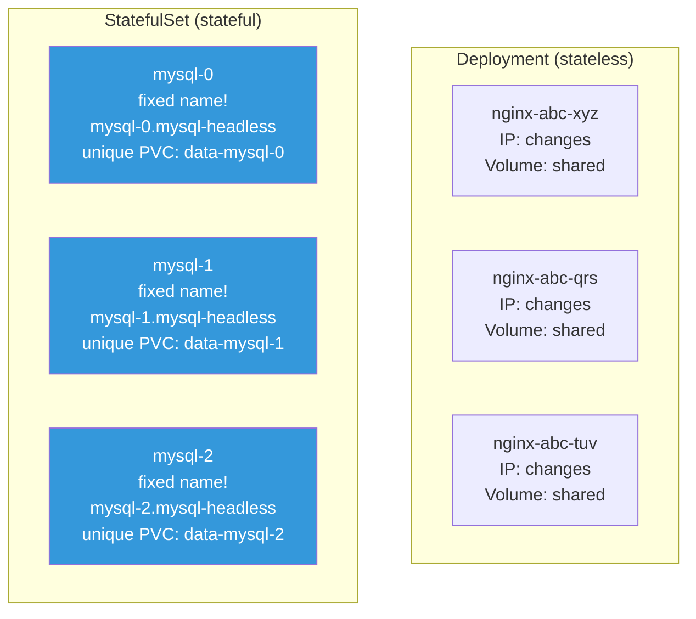
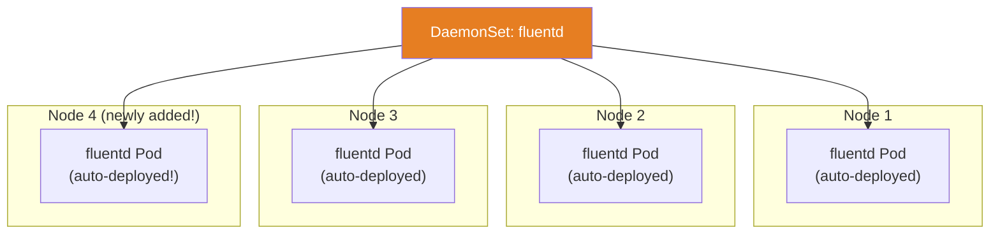
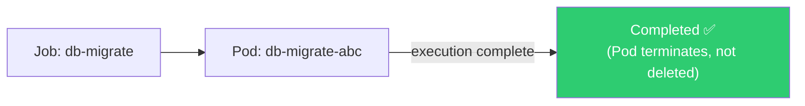
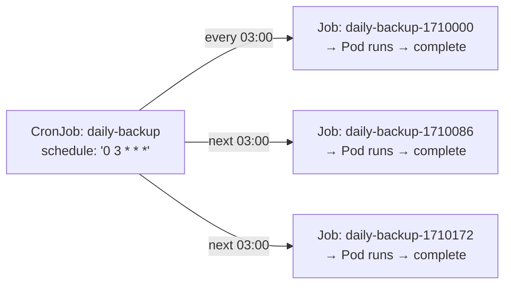
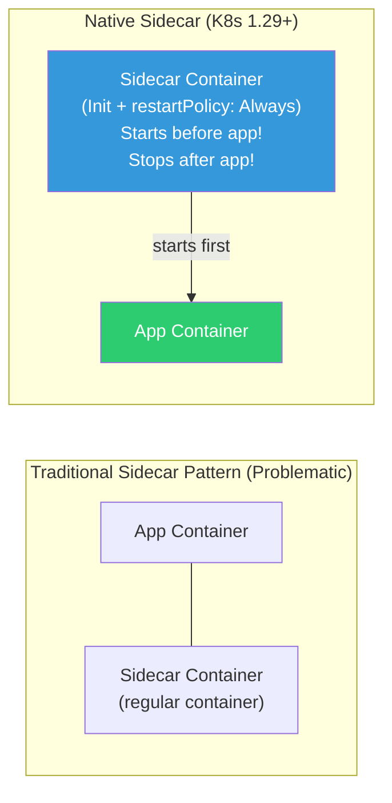

# StatefulSet / DaemonSet / Job / CronJob

> [Deployment](./02-pod-deployment) is for **stateless** apps. But DBs need ordering and unique network IDs, monitoring agents must run one per node, and batch jobs run once and finish. Let's learn K8s resources for these diverse workload patterns.

---

## 🎯 Why Do You Need to Know This?

```
K8s resources by workload type:
• Web servers, API servers (stateless)      → Deployment
• DB, Kafka, Redis Cluster (stateful)       → StatefulSet
• Log collection, monitoring agents (all nodes) → DaemonSet
• DB migration, data processing (one-time)  → Job
• Backup, reports, cleanup (periodic)       → CronJob
```

---

## 🧠 Core Concepts

### Complete Workload Resource Comparison

| Resource | Pod Name | Scaling | Volume | Ordering | Purpose |
|----------|----------|---------|--------|----------|---------|
| **Deployment** | Random (abc-xyz) | replicas | Shared | None | Web servers, APIs |
| **StatefulSet** | Fixed (name-0, -1, -2) | replicas | Pod-unique | Sequential | DBs, Kafka |
| **DaemonSet** | 1 per node | node count | Node-local | None | Agents |
| **Job** | Runs until complete | completions | Temporary | None | Batch processing |
| **CronJob** | Periodic Job | schedule | Temporary | None | Backup, cleanup |

---

## 🔍 Detailed Explanation — StatefulSet

### What is a StatefulSet?

**For stateful applications**. The biggest differences from Deployment are **unique IDs**, **unique volumes**, and **ordering guarantees**.

### Deployment vs StatefulSet



| Item | Deployment | StatefulSet |
|------|-----------|-------------|
| Pod Name | Random (nginx-abc-xyz) | Ordered (mysql-0, -1, -2) |
| Network ID | None (IP changes) | Fixed DNS (pod-0.headless-svc) |
| Volume | Shared by all Pods | **Unique PVC per Pod** |
| Creation Order | Simultaneous (parallel) | Sequential (0→1→2) |
| Deletion Order | Simultaneous | Reverse (2→1→0) |
| Update | Rolling (new RS) | Rolling (reverse, same Pod name) |

### StatefulSet YAML in Detail

```yaml
# Headless Service (required for StatefulSet!)
apiVersion: v1
kind: Service
metadata:
  name: mysql-headless
  labels:
    app: mysql
spec:
  clusterIP: None              # ← Headless! (see ../02-networking/12-service-discovery)
  selector:
    app: mysql
  ports:
  - port: 3306
    name: mysql

---
apiVersion: apps/v1
kind: StatefulSet
metadata:
  name: mysql
spec:
  serviceName: mysql-headless   # ← Headless Service name (required!)
  replicas: 3

  selector:
    matchLabels:
      app: mysql

  template:
    metadata:
      labels:
        app: mysql
    spec:
      containers:
      - name: mysql
        image: mysql:8.0
        ports:
        - containerPort: 3306
        env:
        - name: MYSQL_ROOT_PASSWORD
          valueFrom:
            secretKeyRef:
              name: mysql-secret
              key: root-password
        volumeMounts:
        - name: data
          mountPath: /var/lib/mysql
        resources:
          requests:
            cpu: "500m"
            memory: "1Gi"
          limits:
            memory: "2Gi"

  # ⭐ Auto-create unique PVC for each Pod!
  volumeClaimTemplates:
  - metadata:
      name: data
    spec:
      accessModes: ["ReadWriteOnce"]
      storageClassName: gp3
      resources:
        requests:
          storage: 50Gi

  # Update strategy
  updateStrategy:
    type: RollingUpdate
    rollingUpdate:
      partition: 0              # Only update Pods >= this number (canary)

  # Pod management policy
  podManagementPolicy: OrderedReady   # OrderedReady(sequential) or Parallel
```

### StatefulSet's Unique Characteristics

```bash
# === 1. Fixed Pod Names ===
kubectl get pods -l app=mysql
# NAME      READY   STATUS    AGE
# mysql-0   1/1     Running   5d     ← always mysql-0!
# mysql-1   1/1     Running   5d     ← always mysql-1!
# mysql-2   1/1     Running   5d     ← always mysql-2!
# → If mysql-0 dies, new Pod is also mysql-0! (name preserved)

# === 2. Fixed DNS (Headless Service) ===
# Each Pod has unique DNS name:
# mysql-0.mysql-headless.production.svc.cluster.local
# mysql-1.mysql-headless.production.svc.cluster.local
# mysql-2.mysql-headless.production.svc.cluster.local

kubectl run test --image=busybox --rm -it --restart=Never -- nslookup mysql-0.mysql-headless
# Address: 10.0.1.50    ← mysql-0's fixed DNS!
# → Even if Pod restarts and IP changes, DNS name is preserved!

# === 3. Unique PVC per Pod ===
kubectl get pvc -l app=mysql
# NAME            STATUS   VOLUME        CAPACITY   STORAGECLASS
# data-mysql-0    Bound    pvc-abc123    50Gi       gp3           ← mysql-0 only!
# data-mysql-1    Bound    pvc-def456    50Gi       gp3           ← mysql-1 only!
# data-mysql-2    Bound    pvc-ghi789    50Gi       gp3           ← mysql-2 only!
# → Each Pod has its own disk!
# → If mysql-0 restarts, data-mysql-0 volume is remounted

# === 4. Sequential creation/deletion ===
# Creation: mysql-0 Ready → mysql-1 start → mysql-1 Ready → mysql-2 start
# Deletion: mysql-2 delete → mysql-1 delete → mysql-0 delete
# → DB cluster: Primary starts first, Replicas connect after

# === 5. PVCs preserved when deleting StatefulSet! ===
kubectl delete statefulset mysql
# → Pods deleted but PVCs (data-mysql-0, -1, -2) remain!
# → Data preserved! Recreate uses existing data

# Manual PVC deletion (only when removing data!)
kubectl delete pvc data-mysql-0 data-mysql-1 data-mysql-2
```

### Real StatefulSet Workloads

```bash
# 1. MySQL/PostgreSQL Cluster (Primary-Replica)
# mysql-0 = Primary (writes)
# mysql-1, mysql-2 = Replicas (reads)
# → Ordering guaranteed: Primary(0) starts first, Replicas(1,2) connect

# 2. Kafka Cluster
# kafka-0, kafka-1, kafka-2 = Broker IDs 0,1,2
# → Unique ID + unique data volume needed

# 3. Redis Cluster
# redis-0 ~ redis-5 = 3 Masters + 3 Slaves
# → Unique network ID for cluster setup

# 4. Elasticsearch
# es-0, es-1, es-2 = each has unique data directory
# → Data replication between nodes

# 5. ZooKeeper
# zk-0, zk-1, zk-2 = unique myid (0, 1, 2)
# → Ordering guaranteed: all nodes must know each other for leader election

# ⚠️ In real work, rather than managing DB with StatefulSet directly
# → Use managed services (RDS, CloudSQL) or
# → Use Operators (MySQL Operator, Kafka Operator)
# → Operator manages StatefulSet instead (detailed in 17-operator-crd)
```

---

## 🔍 Detailed Explanation — DaemonSet

### What is a DaemonSet?

**Runs one Pod per node (or specific nodes)**.



**Key point:** When nodes are added, Pods auto-deploy. When nodes removed, Pods auto-delete.

### DaemonSet YAML

```yaml
apiVersion: apps/v1
kind: DaemonSet
metadata:
  name: fluentd
  namespace: kube-system
spec:
  selector:
    matchLabels:
      app: fluentd

  updateStrategy:
    type: RollingUpdate
    rollingUpdate:
      maxUnavailable: 1            # Update 1 node at a time

  template:
    metadata:
      labels:
        app: fluentd
    spec:
      # Deploy to specific nodes (optional)
      # nodeSelector:
      #   kubernetes.io/os: linux

      tolerations:                  # ⭐ To deploy to Control Plane nodes too
      - key: node-role.kubernetes.io/control-plane
        effect: NoSchedule

      containers:
      - name: fluentd
        image: fluentd:v1.16
        resources:
          requests:
            cpu: "100m"
            memory: "200Mi"
          limits:
            memory: "500Mi"
        volumeMounts:
        - name: varlog
          mountPath: /var/log       # Read node's /var/log
          readOnly: true
        - name: containers
          mountPath: /var/lib/docker/containers
          readOnly: true

      volumes:
      - name: varlog
        hostPath:                   # ⭐ Direct mount of node filesystem!
          path: /var/log
      - name: containers
        hostPath:
          path: /var/lib/docker/containers
```

```bash
# Check DaemonSet
kubectl get daemonset -n kube-system
# NAME         DESIRED   CURRENT   READY   UP-TO-DATE   AVAILABLE   NODE SELECTOR   AGE
# fluentd      3         3         3       3            3           <none>           30d
# kube-proxy   3         3         3       3            3           <none>           30d
# aws-node     3         3         3       3            3           <none>           30d
#              ^^^
#              equals node count!

# Which nodes are running
kubectl get pods -n kube-system -l app=fluentd -o wide
# NAME            READY   NODE
# fluentd-abc12   1/1     node-1
# fluentd-def34   1/1     node-2
# fluentd-ghi56   1/1     node-3
# → 1 Pod per node!

# Add new node?
# → DaemonSet auto-deploys Pod to new node!

# Deploy to specific nodes only: nodeSelector or affinity
# nodeSelector:
#   role: monitoring    ← only to nodes with role=monitoring label
```

### Real DaemonSet Workloads

```bash
# K8s system DaemonSets:
kubectl get ds -n kube-system
# kube-proxy    → manages Service network rules on all nodes
# aws-node      → AWS VPC CNI (EKS) — assigns VPC IPs to Pods

# DaemonSets added in real work:
# 1. Log collection: Fluentd, Fluent Bit, Filebeat
#    → read /var/log from all nodes and send to central logging
#    → (detailed in 08-observability)

# 2. Monitoring agents: Node Exporter, Datadog Agent
#    → collect CPU/memory/disk metrics from all nodes

# 3. Security agents: Falco, Sysdig
#    → runtime security monitoring on all nodes

# 4. Storage management: CSI drivers (EBS CSI, EFS CSI)
#    → volume management on all nodes

# 5. Network management: Calico, Cilium (CNI)
#    → Pod networking on all nodes
```

---

## 🔍 Detailed Explanation — Job

### What is a Job?

**Runs once and completes**. Used for batch processing, data migration, etc.



**Difference from Deployment:**
* Deployment: Pod must always run (restart if killed)
* Job: Pod **completes successfully**, then stops (no restart)

### Job YAML

```yaml
apiVersion: batch/v1
kind: Job
metadata:
  name: db-migrate
spec:
  completions: 1                # Number of Pods that must succeed
  parallelism: 1                # Number of Pods running simultaneously
  backoffLimit: 3               # Retry count on failure (default 6)
  activeDeadlineSeconds: 300    # Max runtime (5 minutes)
  ttlSecondsAfterFinished: 3600 # Auto-delete 1 hour after completion

  template:
    spec:
      containers:
      - name: migrate
        image: myapp:v1.0
        command: ["python", "manage.py", "migrate"]
        env:
        - name: DATABASE_URL
          valueFrom:
            secretKeyRef:
              name: db-credentials
              key: url
      restartPolicy: Never      # ⭐ Job uses Never or OnFailure!
      # Never: create new Pod on failure (preserves logs)
      # OnFailure: restart in same Pod (log loss possible)
```

```bash
# Run Job
kubectl apply -f job.yaml

# Check Job status
kubectl get jobs
# NAME         COMPLETIONS   DURATION   AGE
# db-migrate   1/1           45s        2m     ← complete!
#              ^^^
#              1 out of 1 succeeded!

# Check Job's Pods
kubectl get pods -l job-name=db-migrate
# NAME               READY   STATUS      RESTARTS   AGE
# db-migrate-abc12   0/1     Completed   0          2m    ← Completed!

# Check logs
kubectl logs job/db-migrate
# Running migrations...
# Applied 5 migrations successfully.
# Done!

# Delete Job (Pods deleted too)
kubectl delete job db-migrate
```

### Job Parallel Processing Patterns

```yaml
# === Pattern 1: Sequential execution (default) ===
# completions: 5, parallelism: 1
# → Run 1 at a time, 5 times sequentially (5 Pods total)

# === Pattern 2: Parallel execution ===
# completions: 10, parallelism: 3
# → Run 3 at a time, total 10 successes needed
spec:
  completions: 10           # 10 successes required
  parallelism: 3            # 3 at a time
  template:
    spec:
      containers:
      - name: worker
        image: myworker:v1.0
        command: ["python", "process_batch.py"]
      restartPolicy: Never

# === Pattern 3: Work Queue (no completions) ===
# No completions, parallelism: 5
# → 5 workers pull jobs from queue, terminate when queue empty
spec:
  parallelism: 5
  # completions not specified!
  template:
    spec:
      containers:
      - name: worker
        image: myworker:v1.0
        command: ["python", "queue_worker.py"]
      restartPolicy: Never
```

```bash
# Watch parallel Job
kubectl get pods -l job-name=batch-process -w
# batch-process-abc   1/1   Running     ← 3 concurrent
# batch-process-def   1/1   Running
# batch-process-ghi   1/1   Running
# batch-process-abc   0/1   Completed   ← one completes
# batch-process-jkl   0/1   Pending     ← next starts
# ...

kubectl get job batch-process
# COMPLETIONS   DURATION
# 7/10          2m         ← 7 out of 10 complete
```

---

## 🔍 Detailed Explanation — CronJob

### What is a CronJob?

**Periodically creates Jobs**. K8s version of [Linux cron](../01-linux/06-cron).



### CronJob YAML

```yaml
apiVersion: batch/v1
kind: CronJob
metadata:
  name: daily-backup
spec:
  schedule: "0 3 * * *"          # ⭐ cron expression (daily 03:00 UTC)
  # minute hour day month dayofweek
  # 0 3 * * *     → daily 03:00
  # */5 * * * *   → every 5 minutes
  # 0 */6 * * *   → every 6 hours
  # 0 9 * * 1-5   → weekdays 09:00
  # 0 0 1 * *     → 1st of month 00:00

  timeZone: "Asia/Seoul"         # K8s 1.27+ (specify timezone)

  concurrencyPolicy: Forbid      # Skip if previous Job still running
  # Allow: allow concurrent (default)
  # Forbid: skip new Job if previous still running
  # Replace: cancel previous Job, run new one

  successfulJobsHistoryLimit: 3  # Keep 3 successful Jobs
  failedJobsHistoryLimit: 1      # Keep 1 failed Job
  startingDeadlineSeconds: 200   # Skip if >200s late from schedule

  jobTemplate:
    spec:
      backoffLimit: 2
      activeDeadlineSeconds: 600  # 10 minute timeout
      template:
        spec:
          containers:
          - name: backup
            image: backup-tool:v1.0
            command:
            - /bin/sh
            - -c
            - |
              echo "Starting backup at $(date)"
              pg_dump -h $DB_HOST -U $DB_USER $DB_NAME | gzip > /backup/db-$(date +%Y%m%d).sql.gz
              aws s3 cp /backup/db-$(date +%Y%m%d).sql.gz s3://my-backups/
              echo "Backup complete!"
            env:
            - name: DB_HOST
              value: "postgres-service"
            - name: DB_USER
              valueFrom:
                secretKeyRef:
                  name: db-credentials
                  key: username
            - name: DB_NAME
              value: "production"
          restartPolicy: OnFailure
```

```bash
# Check CronJob
kubectl get cronjobs
# NAME           SCHEDULE      SUSPEND   ACTIVE   LAST SCHEDULE   AGE
# daily-backup   0 3 * * *     False     0        12h             30d
#                               ^^^^^    ^^^^^^   ^^^^^^^^^^^^
#                               suspend? running? last run time

# List Jobs created by CronJob
kubectl get jobs --sort-by='.metadata.creationTimestamp'
# NAME                        COMPLETIONS   DURATION   AGE
# daily-backup-28460500       1/1           45s        36h
# daily-backup-28461940       1/1           38s        12h
# daily-backup-28463380       0/1           Running    5s     ← just created!

# Logs from CronJob's Pod
kubectl logs job/daily-backup-28463380
# Starting backup at Wed Mar 12 03:00:00 UTC 2025
# Backup complete!

# === CronJob Management ===

# Suspend (disable scheduling)
kubectl patch cronjob daily-backup -p '{"spec":{"suspend":true}}'

# Resume
kubectl patch cronjob daily-backup -p '{"spec":{"suspend":false}}'

# Manual immediate run (create Job manually)
kubectl create job --from=cronjob/daily-backup daily-backup-manual
# → Run now regardless of schedule!

# Delete CronJob
kubectl delete cronjob daily-backup
# → CronJob + related Jobs + Pods all deleted
```

### CronJob Real-World Patterns

```bash
# 1. DB backup (daily 03:00)
# schedule: "0 3 * * *"

# 2. Temp file/cache cleanup (every 6 hours)
# schedule: "0 */6 * * *"

# 3. Report generation (weekdays 09:00)
# schedule: "0 9 * * 1-5"

# 4. Certificate renewal check (every Monday)
# schedule: "0 0 * * 1"

# 5. Delete old data (monthly 1st)
# schedule: "0 0 1 * *"

# 6. Health check (every 5 minutes) → ⚠️ usually avoid CronJob for this
# → Use K8s liveness/readiness probes instead
# → Or external monitoring tools
```

---

## 🔍 Detailed Explanation — Native Sidecar Containers (K8s 1.29+)

### What are Native Sidecars?

Starting with K8s 1.29, **declaring `restartPolicy: Always` on an Init Container** makes it behave as a sidecar container. Previously, sidecar patterns were implemented using regular containers, which caused many issues because startup/shutdown ordering could not be guaranteed.



### Traditional vs Native Sidecar

| Item | Traditional Sidecar | Native Sidecar (1.29+) |
|------|-------------------|----------------------|
| **Declaration** | `containers[]` | `initContainers[]` + `restartPolicy: Always` |
| **Startup Order** | Not guaranteed (start together) | **Starts before app container** |
| **Shutdown Order** | Not guaranteed (stop together) | **Stops after app container** |
| **Job Compatibility** | Blocks Job completion (sidecar keeps running) | **Sidecar cleaned up after app completes** |
| **Resources** | Added to Pod requests sum | Calculated as Init Container (more efficient) |

### YAML Example — Log Collector Sidecar

```yaml
apiVersion: v1
kind: Pod
metadata:
  name: app-with-log-sidecar
spec:
  initContainers:
  # ⭐ Native sidecar: restartPolicy: Always is the key!
  - name: log-collector
    image: fluent/fluent-bit:latest
    restartPolicy: Always              # ← This makes it a native sidecar!
    volumeMounts:
    - name: shared-logs
      mountPath: /var/log/app
    resources:
      requests:
        cpu: "50m"
        memory: "64Mi"
      limits:
        memory: "128Mi"

  containers:
  - name: app
    image: myapp:v1.0
    volumeMounts:
    - name: shared-logs
      mountPath: /var/log/app
    resources:
      requests:
        cpu: "200m"
        memory: "256Mi"

  volumes:
  - name: shared-logs
    emptyDir: {}
```

```bash
# Execution order:
# 1. log-collector (sidecar) starts → Ready
# 2. app (main) starts
# 3. On Pod shutdown: app stops first → log-collector stops after
#    → Last logs safely collected!

# Problems with traditional approach:
# → App starts but log collector not ready yet → initial logs lost!
# → On Pod shutdown, log collector dies first → final logs lost!
```

### YAML Example — Proxy Sidecar (Envoy)

```yaml
apiVersion: v1
kind: Pod
metadata:
  name: app-with-proxy
spec:
  initContainers:
  # Proxy sidecar — must start before app so network is ready
  - name: envoy-proxy
    image: envoyproxy/envoy:v1.30
    restartPolicy: Always
    ports:
    - containerPort: 15001
    resources:
      requests:
        cpu: "100m"
        memory: "128Mi"
      limits:
        memory: "256Mi"

  containers:
  - name: app
    image: myapp:v1.0
    env:
    - name: HTTP_PROXY
      value: "http://localhost:15001"
```

### Native Sidecar Advantages Summary

```bash
# 1. Guaranteed startup order
#    → Proxy/log collector ready before app starts
#    → Sidecar is already in Ready state when app begins!

# 2. Guaranteed shutdown order
#    → App stops first → sidecar cleans up after
#    → Last logs/metrics/traces safely transmitted

# 3. Job/CronJob compatible
#    → Old way: sidecar keeps running after Job completes → Job never finishes!
#    → Native: main container completes → sidecar auto-terminates

# 4. Resource efficiency
#    → Resources calculated as Init Container style (more efficient)

# ⚠️ Notes:
# → Requires K8s 1.29+ (1.28 needs SidecarContainers feature gate enabled)
# → Service meshes (Istio, etc.) are gradually adopting native sidecar support
```

---

## 💻 Hands-On Practice

### Exercise 1: Observe StatefulSet Characteristics

```bash
# 1. Create Headless Service + StatefulSet
kubectl apply -f - << 'EOF'
apiVersion: v1
kind: Service
metadata:
  name: web-headless
spec:
  clusterIP: None
  selector:
    app: web-sts
  ports:
  - port: 80
---
apiVersion: apps/v1
kind: StatefulSet
metadata:
  name: web-sts
spec:
  serviceName: web-headless
  replicas: 3
  selector:
    matchLabels:
      app: web-sts
  template:
    metadata:
      labels:
        app: web-sts
    spec:
      containers:
      - name: nginx
        image: nginx:alpine
        ports:
        - containerPort: 80
        volumeMounts:
        - name: www
          mountPath: /usr/share/nginx/html
  volumeClaimTemplates:
  - metadata:
      name: www
    spec:
      accessModes: ["ReadWriteOnce"]
      resources:
        requests:
          storage: 1Gi
EOF

# 2. Watch sequential creation
kubectl get pods -l app=web-sts -w
# web-sts-0   0/1   Pending       ← 0 first!
# web-sts-0   1/1   Running       ← 0 Ready, then
# web-sts-1   0/1   Pending       ← 1 starts
# web-sts-1   1/1   Running       ← 1 Ready, then
# web-sts-2   0/1   Pending       ← 2 starts
# web-sts-2   1/1   Running       ← complete!

# 3. Verify fixed names
kubectl get pods -l app=web-sts
# NAME        READY   STATUS
# web-sts-0   1/1     Running    ← always 0, 1, 2!
# web-sts-1   1/1     Running
# web-sts-2   1/1     Running

# 4. Verify unique DNS
kubectl run test --image=busybox --rm -it --restart=Never -- nslookup web-sts-0.web-headless
# Address: 10.0.1.50
kubectl run test --image=busybox --rm -it --restart=Never -- nslookup web-sts-1.web-headless
# Address: 10.0.1.51

# 5. Verify unique PVCs
kubectl get pvc -l app=web-sts
# NAME            STATUS   CAPACITY
# www-web-sts-0   Bound    1Gi        ← Pod 0 only!
# www-web-sts-1   Bound    1Gi        ← Pod 1 only!
# www-web-sts-2   Bound    1Gi        ← Pod 2 only!

# 6. Delete Pod → recreate with same name + PVC
kubectl delete pod web-sts-1
kubectl get pods -l app=web-sts
# web-sts-0   1/1   Running
# web-sts-1   1/1   Running    ← same name! same PVC!
# web-sts-2   1/1   Running

# 7. Watch reverse deletion
kubectl delete statefulset web-sts
# web-sts-2 delete → web-sts-1 delete → web-sts-0 delete (reverse!)

# PVCs remain! (data preserved)
kubectl get pvc -l app=web-sts    # still exist!

# Cleanup
kubectl delete pvc www-web-sts-0 www-web-sts-1 www-web-sts-2
kubectl delete svc web-headless
```

### Exercise 2: Deploy DaemonSet

```bash
# 1. Create DaemonSet (1 Pod per node)
kubectl apply -f - << 'EOF'
apiVersion: apps/v1
kind: DaemonSet
metadata:
  name: node-info
spec:
  selector:
    matchLabels:
      app: node-info
  template:
    metadata:
      labels:
        app: node-info
    spec:
      containers:
      - name: info
        image: busybox
        command: ["sh", "-c", "while true; do echo \"Node: $(hostname)\"; sleep 60; done"]
        resources:
          requests:
            cpu: "10m"
            memory: "16Mi"
          limits:
            memory: "32Mi"
EOF

# 2. Verify Pods equal node count
kubectl get ds node-info
# NAME        DESIRED   CURRENT   READY
# node-info   3         3         3        ← 3 nodes = 3 Pods

kubectl get pods -l app=node-info -o wide
# NAME              NODE
# node-info-abc     node-1   ← 1 Pod per node!
# node-info-def     node-2
# node-info-ghi     node-3

# 3. Cleanup
kubectl delete ds node-info
```

### Exercise 3: Run Job and CronJob

```bash
# === Job: Run Once ===
kubectl apply -f - << 'EOF'
apiVersion: batch/v1
kind: Job
metadata:
  name: hello-job
spec:
  completions: 3
  parallelism: 2
  backoffLimit: 2
  ttlSecondsAfterFinished: 120
  template:
    spec:
      containers:
      - name: hello
        image: busybox
        command: ["sh", "-c", "echo 'Job $(date)' && sleep 5"]
      restartPolicy: Never
EOF

kubectl get jobs -w
# NAME        COMPLETIONS   DURATION
# hello-job   0/3           5s
# hello-job   1/3           10s
# hello-job   2/3           15s
# hello-job   3/3           20s      ← complete!

kubectl get pods -l job-name=hello-job
# hello-job-abc   Completed
# hello-job-def   Completed
# hello-job-ghi   Completed

# === CronJob: Periodic Run ===
kubectl apply -f - << 'EOF'
apiVersion: batch/v1
kind: CronJob
metadata:
  name: periodic-hello
spec:
  schedule: "*/1 * * * *"
  successfulJobsHistoryLimit: 2
  failedJobsHistoryLimit: 1
  jobTemplate:
    spec:
      template:
        spec:
          containers:
          - name: hello
            image: busybox
            command: ["sh", "-c", "echo 'CronJob $(date)'"]
          restartPolicy: OnFailure
EOF

# Wait 1 minute...
kubectl get cronjobs
# NAME             SCHEDULE      ACTIVE   LAST SCHEDULE
# periodic-hello   */1 * * * *   0        30s

kubectl get jobs
# NAME                        COMPLETIONS
# periodic-hello-28463500     1/1          ← new Job every minute!

# Manual immediate run
kubectl create job --from=cronjob/periodic-hello manual-run

# Cleanup
kubectl delete cronjob periodic-hello
kubectl delete job hello-job manual-run
```

---

## 🏢 In Real Work

### Scenario 1: Operate DB with StatefulSet

```bash
# "Should we run PostgreSQL in K8s?"

# Option 1: Managed service (⭐ recommended!)
# → AWS RDS, CloudSQL, Azure DB
# → Backup, replication, failover, patches all automatic
# → Connect from K8s via ExternalName Service (../02-networking/12-service-discovery)

# Option 2: Operate with Operator
# → CloudNativePG, Crunchy Postgres Operator
# → Auto-manage StatefulSet (backup, replication, failover)
# → K8s-native experience

# Option 3: Directly manage StatefulSet (not recommended!)
# → Must implement backup, replication, failover yourself
# → Very high operational burden

# Real-world guide:
# Production DB → RDS/CloudSQL (managed)
# Dev/Test DB → StatefulSet (simple)
# K8s-native needed → Operator
```

### Scenario 2: Caution with DaemonSet Update

```bash
# DaemonSet update = replace Pods on all nodes!
# → Wrong update = problems on all nodes

# Safe update method:

# 1. maxUnavailable: 1 (one node at a time)
updateStrategy:
  type: RollingUpdate
  rollingUpdate:
    maxUnavailable: 1    # only 1 node at a time

# 2. Test on specific node first (canary)
# → Deploy new version DaemonSet to specific node with nodeSelector
# → If OK, apply globally

# 3. Monitor completion
kubectl rollout status daemonset/fluentd -n kube-system
```

### Scenario 3: CronJob Failure Response

```bash
# "Daily backup failed and nobody noticed"

# 1. Check failed Jobs
kubectl get jobs --field-selector status.successful=0
# NAME                    COMPLETIONS
# daily-backup-28461940   0/1          ← failed!

# 2. Check logs
kubectl logs job/daily-backup-28461940
# Error: connection refused to postgres-service:5432

# 3. Set up monitoring (⭐ essential!)
# → Slack/PagerDuty alert on Job failure
# → Monitor kube_job_status_failed in Prometheus
# → Monitor kube_cronjob_next_schedule_time for schedule health

# 4. Manual rerun
kubectl create job --from=cronjob/daily-backup daily-backup-manual

# 5. Root cause fix
# → Verify DB Service name
# → Check DB Pod status
# → Check network policies
```

---

## ⚠️ Common Mistakes

### 1. Using StatefulSet for Stateless Apps

```bash
# ❌ General web server with StatefulSet → unnecessary complexity
# → Sequential creation/deletion → slow deployment
# → Per-Pod PVC → storage waste

# ✅ Stateless apps → Deployment
# ✅ Stateful apps (DB, message queue) → StatefulSet
```

### 2. Not Deleting StatefulSet PVCs

```bash
# StatefulSet deletion doesn't delete PVCs!
kubectl delete statefulset mysql
kubectl get pvc
# data-mysql-0   Bound   50Gi    ← still exists! costs continue!

# ✅ Delete PVCs if no longer needed
kubectl delete pvc data-mysql-0 data-mysql-1 data-mysql-2
```

### 3. Setting Job restartPolicy to Always

```yaml
# ❌ Job with restartPolicy: Always → restarts forever!
restartPolicy: Always    # Invalid for Jobs!

# ✅ Jobs use Never or OnFailure only!
restartPolicy: Never      # create new Pod on failure (logs preserved)
restartPolicy: OnFailure  # restart in same Pod
```

### 4. Not Setting CronJob History Limits

```bash
# ❌ Default: successfulJobsHistoryLimit=3, failedJobsHistoryLimit=1
# → After months: thousands of completed Jobs/Pods pile up!

# ✅ Set appropriate limits
successfulJobsHistoryLimit: 3    # keep only 3 successes
failedJobsHistoryLimit: 1        # keep only 1 failure
# + ttlSecondsAfterFinished for auto-delete Jobs
```

### 5. Too Large DaemonSet Resource Requests

```bash
# ❌ DaemonSet requests: cpu=1, memory=2Gi
# → 3 nodes = 3 cores, 6Gi reserved for DaemonSet!
# → Insufficient resources for other Pods!

# ✅ Minimize DaemonSet resources
requests:
  cpu: "50m"       # minimal
  memory: "128Mi"
limits:
  memory: "256Mi"  # set limits but with room
```

---

## 📝 Summary

### Workload Selection Guide

```
Web servers, APIs, microservices (stateless) → Deployment ⭐
DB, Kafka, Redis Cluster (stateful)          → StatefulSet
All-node agents (logs, monitoring)           → DaemonSet
One-time batch processing                    → Job
Periodic batch (backup, cleanup)             → CronJob
```

### Essential Commands

```bash
# StatefulSet
kubectl get statefulset / sts
kubectl describe sts NAME
kubectl scale sts NAME --replicas=N

# DaemonSet
kubectl get daemonset / ds
kubectl rollout status ds/NAME

# Job
kubectl get jobs
kubectl logs job/NAME
kubectl create job --from=cronjob/NAME manual-run   # manual run

# CronJob
kubectl get cronjobs / cj
kubectl patch cronjob NAME -p '{"spec":{"suspend":true}}'  # suspend
```

### StatefulSet vs Deployment Quick Reference

```
              Deployment        StatefulSet
Pod name:     random (abc-xyz)  fixed (name-0, -1, -2)
Network ID:   none              fixed DNS (pod-0.headless-svc)
Volume:       shared possible    unique PVC per Pod
Creation:     parallel          sequential (0→1→2)
Deletion:     parallel          reverse (2→1→0)
```

---

## 🔗 Next Lecture

Next is **[04-config-secret](./04-config-secret)** — ConfigMap / Secret / External Secrets.

How to inject app configuration and secrets into Pods — environment variables, file mounts, external secret management.
