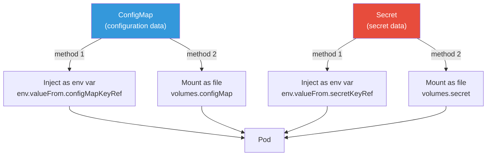
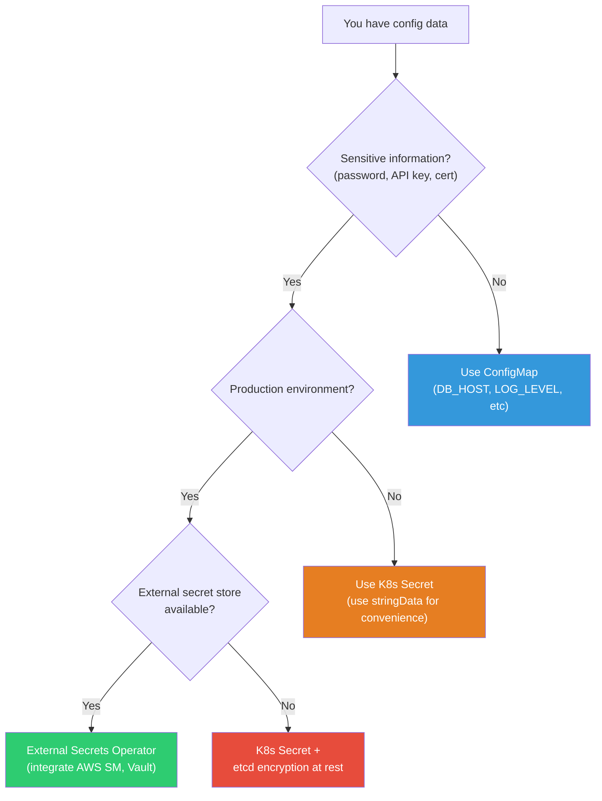
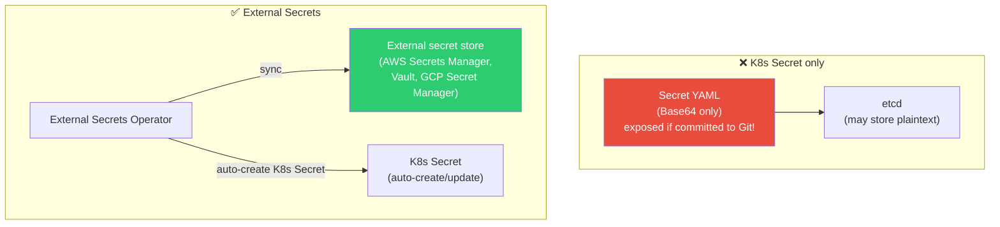

# ConfigMap / Secret / External Secrets

> "We hardcoded the DB password in the image" — this is the most dangerous mistake learned in [container security](../03-containers/09-security). K8s uses **ConfigMap** for configuration, **Secret** for sensitive information, and injects them into Pods. You can use different configurations per environment without modifying images.

---

## 🎯 Why Do You Need to Know This?

```
Real-world ConfigMap/Secret work:
• Different app configs per environment (dev/staging/prod)    → ConfigMap
• DB passwords, API keys                                      → Secret
• Apply config changes without redeploying app                → ConfigMap update
• Integrate AWS Secrets Manager/Vault with K8s               → External Secrets
• "Config changed but app didn't pick it up"                 → Rollout strategy
• Environment variables vs file mount — which to use?        → Choose by use case
```

---

## 🧠 Core Concepts

### Analogy: Recipe Card and Safe

* **Image** = Chef (code). Same person in any restaurant
* **ConfigMap** = Recipe card. Different recipe per restaurant (dev: mild, prod: spicy)
* **Secret** = Secret ingredient in safe. Special sauce recipe (restricted access!)
* **Environment Variable** = Tell chef verbally ("Make it spicy today!")
* **Volume Mount** = Put recipe card on table (deliver as file)

### Configuration Injection Methods



### ConfigMap vs Secret Decision



---

## 🔍 Detailed Explanation — ConfigMap

### Create ConfigMap

```bash
# === Method 1: Command line ===

# Key-value pairs
kubectl create configmap app-config \
    --from-literal=NODE_ENV=production \
    --from-literal=LOG_LEVEL=info \
    --from-literal=PORT=3000

# From file
kubectl create configmap nginx-config \
    --from-file=nginx.conf=./nginx.conf \
    --from-file=default.conf=./default.conf

# Entire directory
kubectl create configmap app-configs --from-file=./config-dir/

# From .env file
kubectl create configmap env-config --from-env-file=.env

# === Method 2: YAML (⭐ recommended for production!) ===
```

```yaml
apiVersion: v1
kind: ConfigMap
metadata:
  name: app-config
  namespace: production
data:
  # Simple key-value (for env vars)
  NODE_ENV: "production"
  LOG_LEVEL: "info"
  PORT: "3000"
  DB_HOST: "postgres-service"
  DB_PORT: "5432"
  DB_NAME: "myapp"
  REDIS_HOST: "redis-service"
  CACHE_TTL: "300"

  # File content (multiline)
  app.properties: |
    server.port=3000
    logging.level=info
    cache.ttl=300
    feature.new-ui=true

  nginx.conf: |
    server {
        listen 80;
        server_name localhost;
        location / {
            proxy_pass http://localhost:3000;
        }
    }
```

```bash
# Check ConfigMap
kubectl get configmaps
# NAME         DATA   AGE
# app-config   8      5d

kubectl describe configmap app-config
# Name:         app-config
# Namespace:    production
# Data
# ====
# NODE_ENV:   production
# LOG_LEVEL:  info
# PORT:       3000
# ...

# View content
kubectl get configmap app-config -o yaml
kubectl get configmap app-config -o jsonpath='{.data.NODE_ENV}'
# production
```

### Inject ConfigMap into Pod

#### Method 1: As Environment Variables

```yaml
apiVersion: v1
kind: Pod
metadata:
  name: myapp
spec:
  containers:
  - name: myapp
    image: myapp:v1.0

    # Individual keys as env vars
    env:
    - name: NODE_ENV                   # Variable name in Pod
      valueFrom:
        configMapKeyRef:
          name: app-config             # ConfigMap name
          key: NODE_ENV                # ConfigMap key
    - name: LOG_LEVEL
      valueFrom:
        configMapKeyRef:
          name: app-config
          key: LOG_LEVEL

    # All ConfigMap keys at once!
    envFrom:
    - configMapRef:
        name: app-config               # All keys become env vars
      prefix: "APP_"                   # Optional: add prefix
      # → APP_NODE_ENV, APP_LOG_LEVEL, APP_PORT, ...
```

```bash
# Verify env vars
kubectl exec myapp -- env | grep -E "NODE_ENV|LOG_LEVEL|APP_"
# NODE_ENV=production
# LOG_LEVEL=info
# APP_NODE_ENV=production
# APP_LOG_LEVEL=info
# APP_PORT=3000
# ...

# ⚠️ With env var injection:
# → Value set at Pod startup, ConfigMap changes not reflected!
# → Need Pod restart to apply changes
```

#### Method 2: Mount as File (Volume)

```yaml
apiVersion: v1
kind: Pod
metadata:
  name: myapp
spec:
  containers:
  - name: myapp
    image: myapp:v1.0
    volumeMounts:
    - name: config-volume
      mountPath: /app/config           # Mount path
      readOnly: true
    - name: nginx-config
      mountPath: /etc/nginx/conf.d/default.conf
      subPath: nginx.conf              # Mount specific key as single file!

  volumes:
  - name: config-volume
    configMap:
      name: app-config                 # Mount entire ConfigMap
      # → Creates /app/config/NODE_ENV, /app/config/LOG_LEVEL, ... files

  - name: nginx-config
    configMap:
      name: app-config
      items:                           # Select specific keys
      - key: nginx.conf
        path: nginx.conf               # File name
```

```bash
# Verify mounted files
kubectl exec myapp -- ls /app/config/
# NODE_ENV
# LOG_LEVEL
# PORT
# DB_HOST
# app.properties
# nginx.conf

kubectl exec myapp -- cat /app/config/NODE_ENV
# production

kubectl exec myapp -- cat /app/config/app.properties
# server.port=3000
# logging.level=info
# cache.ttl=300
# feature.new-ui=true

# ✅ Volume mount advantages:
# → ConfigMap update auto-updates files! (within seconds)
# → But app must detect file changes (inotify, etc)
# → Files mounted with subPath are NOT auto-updated! ⚠️
```

### Environment Variables vs Volume Mount

| Item | Env Var (env) | Volume Mount (volume) |
|------|---------------|-----------------------|
| Injection | `process.env.KEY` | File read |
| Auto-update | ❌ (restart needed) | ✅ (automatic, within seconds) |
| Use case | Simple key-value | Config files, certificates |
| Size limit | Total env var size limit | Flexible file size |
| Recommended | DB_HOST, PORT simple values | nginx.conf and similar files |

---

## 🔍 Detailed Explanation — Secret

### What is a Secret?

Stores **sensitive data** like passwords, API keys, certificates. Similar usage to ConfigMap but **Base64 encoded**.

```bash
# ⚠️ K8s Secret limitations:
# → Base64 encoding only, not encryption!
# → Stored in etcd as plaintext (or Base64)
# → RBAC controls access
# → Real encryption: etcd encryption at rest + External Secrets

# K8s Secret = "slightly more secure ConfigMap"
# Real security = External Secrets (AWS Secrets Manager, Vault)
```

### Create Secret

```bash
# === Command line ===

# Generic secret
kubectl create secret generic db-credentials \
    --from-literal=username=myuser \
    --from-literal=password='S3cur3P@ss!' \
    --from-literal=host=postgres-service

# From file
kubectl create secret generic tls-certs \
    --from-file=tls.crt=./fullchain.pem \
    --from-file=tls.key=./privkey.pem

# Docker registry auth (see ../03-containers/07-registry)
kubectl create secret docker-registry ecr-secret \
    --docker-server=123456789.dkr.ecr.ap-northeast-2.amazonaws.com \
    --docker-username=AWS \
    --docker-password=$(aws ecr get-login-password)

# TLS certificate (see ../02-networking/05-tls-certificate)
kubectl create secret tls my-tls \
    --cert=fullchain.pem \
    --key=privkey.pem
```

```yaml
# === YAML creation ===
apiVersion: v1
kind: Secret
metadata:
  name: db-credentials
  namespace: production
type: Opaque                       # Generic secret (default)
data:
  # ⚠️ Base64 encoding required!
  username: bXl1c2Vy              # echo -n "myuser" | base64
  password: UzNjdXIzUEBzcyE=      # echo -n "S3cur3P@ss!" | base64
  host: cG9zdGdyZXMtc2VydmljZQ==  # echo -n "postgres-service" | base64

---
# stringData avoids Base64 encoding! (⭐ easier)
apiVersion: v1
kind: Secret
metadata:
  name: db-credentials
type: Opaque
stringData:                        # ← use stringData instead of data!
  username: myuser                 # write plaintext
  password: "S3cur3P@ss!"
  host: postgres-service
  # K8s auto-converts to Base64 before storing
```

```bash
# Base64 encoding/decoding
echo -n "myuser" | base64
# bXl1c2Vy

echo -n "bXl1c2Vy" | base64 --decode
# myuser

# ⚠️ -n flag required! (without -n includes newline)

# Verify Secret content (auto-decode Base64)
kubectl get secret db-credentials -o jsonpath='{.data.password}' | base64 --decode
# S3cur3P@ss!

# View entire Secret
kubectl get secret db-credentials -o yaml
# data:
#   password: UzNjdXIzUEBzcyE=    ← Base64 encoded
#   username: bXl1c2Vy
```

### Secret Types

| Type | Purpose | Create Method |
|------|---------|---------------|
| `Opaque` | Generic (default) | `kubectl create secret generic` |
| `kubernetes.io/tls` | TLS cert | `kubectl create secret tls` |
| `kubernetes.io/dockerconfigjson` | Registry auth | `kubectl create secret docker-registry` |
| `kubernetes.io/basic-auth` | Basic auth | YAML |
| `kubernetes.io/ssh-auth` | SSH key | YAML |
| `kubernetes.io/service-account-token` | SA token (auto) | K8s auto-creates |

### Inject Secret into Pod

```yaml
apiVersion: apps/v1
kind: Deployment
metadata:
  name: myapp
spec:
  replicas: 3
  selector:
    matchLabels:
      app: myapp
  template:
    metadata:
      labels:
        app: myapp
    spec:
      containers:
      - name: myapp
        image: myapp:v1.0

        # === Inject as env vars ===
        env:
        # Individual keys
        - name: DB_USERNAME
          valueFrom:
            secretKeyRef:
              name: db-credentials
              key: username
        - name: DB_PASSWORD
          valueFrom:
            secretKeyRef:
              name: db-credentials
              key: password

        # Mix ConfigMap and Secret
        - name: DB_HOST
          valueFrom:
            configMapKeyRef:
              name: app-config
              key: DB_HOST
        - name: DB_PORT
          valueFrom:
            configMapKeyRef:
              name: app-config
              key: DB_PORT

        # === Mount as files ===
        volumeMounts:
        - name: db-creds
          mountPath: /etc/secrets/db
          readOnly: true
        - name: tls-certs
          mountPath: /etc/tls
          readOnly: true

      # Registry auth (for image pull)
      imagePullSecrets:
      - name: ecr-secret

      volumes:
      - name: db-creds
        secret:
          secretName: db-credentials
          defaultMode: 0400            # File permissions (read-only, owner)
      - name: tls-certs
        secret:
          secretName: my-tls
```

```bash
# Verify mounted Secret files
kubectl exec myapp-abc-1 -- ls -la /etc/secrets/db/
# -r--------  1 root root  6 ... username
# -r--------  1 root root 12 ... password
# -r--------  1 root root 16 ... host

kubectl exec myapp-abc-1 -- cat /etc/secrets/db/username
# myuser

# Verify env vars
kubectl exec myapp-abc-1 -- env | grep DB_
# DB_USERNAME=myuser
# DB_PASSWORD=S3cur3P@ss!
# DB_HOST=postgres-service
# DB_PORT=5432
```

---

## 🔍 Detailed Explanation — External Secrets (★ Production Security!)

### Why External Secrets?



```bash
# K8s Secret security problems:
# 1. Base64 encoding only (echo "UzNjdXIz" | base64 -d → plaintext!)
# 2. Putting Secret in YAML risks Git commit exposure
# 3. etcd may store as plaintext
# 4. kubectl get secret shows values to anyone (without RBAC)

# External Secrets benefits:
# 1. Secrets stay in external store only (AWS Secrets Manager, Vault)
# 2. K8s Secrets auto-created/updated
# 3. Git contains only "where to fetch" (no secrets!)
# 4. Auto-rotate secrets
# 5. Audit logs (who accessed when)
```

### External Secrets Operator (ESO)

```bash
# Install ESO (Helm)
helm repo add external-secrets https://charts.external-secrets.io
helm install external-secrets external-secrets/external-secrets \
    -n external-secrets --create-namespace

# Verify
kubectl get pods -n external-secrets
# NAME                                  READY   STATUS
# external-secrets-abc123               1/1     Running
# external-secrets-webhook-def456       1/1     Running
```

```yaml
# 1. SecretStore — define "which external store to use"
apiVersion: external-secrets.io/v1beta1
kind: SecretStore
metadata:
  name: aws-secrets-manager
  namespace: production
spec:
  provider:
    aws:
      service: SecretsManager
      region: ap-northeast-2
      auth:
        jwt:
          serviceAccountRef:
            name: external-secrets-sa    # IRSA (IAM Role for SA)

---
# 2. ExternalSecret — define "which secrets to fetch"
apiVersion: external-secrets.io/v1beta1
kind: ExternalSecret
metadata:
  name: db-credentials
  namespace: production
spec:
  refreshInterval: 1h                    # sync every 1 hour

  secretStoreRef:
    name: aws-secrets-manager            # SecretStore from above
    kind: SecretStore

  target:
    name: db-credentials                 # K8s Secret to create
    creationPolicy: Owner

  data:
  - secretKey: username                  # K8s Secret key
    remoteRef:
      key: production/myapp/db           # AWS Secrets Manager secret name
      property: username                 # JSON property

  - secretKey: password
    remoteRef:
      key: production/myapp/db
      property: password

  - secretKey: host
    remoteRef:
      key: production/myapp/db
      property: host
```

```bash
# Store secret in AWS Secrets Manager
aws secretsmanager create-secret \
    --name production/myapp/db \
    --secret-string '{"username":"myuser","password":"S3cur3P@ss!","host":"mydb.abc.rds.amazonaws.com"}'

# ESO auto-creates K8s Secret!
kubectl get secret db-credentials -n production
# NAME              TYPE     DATA   AGE
# db-credentials    Opaque   3      30s    ← auto-created!

# Verify Secret content
kubectl get secret db-credentials -o jsonpath='{.data.password}' | base64 -d
# S3cur3P@ss!

# Check ExternalSecret status
kubectl get externalsecret -n production
# NAME              STORE                  REFRESH   STATUS
# db-credentials    aws-secrets-manager    1h        SecretSynced    ← synced!

# Change password in AWS?
aws secretsmanager update-secret \
    --secret-id production/myapp/db \
    --secret-string '{"username":"myuser","password":"NewP@ss123!","host":"mydb.abc.rds.amazonaws.com"}'
# → K8s Secret auto-updates after refreshInterval (1 hour)
# → Force immediate sync:
kubectl annotate externalsecret db-credentials force-sync=$(date +%s) --overwrite
```

### Safe-to-Commit Git Structure

```bash
# Safe to commit:
# ✅ ExternalSecret YAML (no secrets! only "where to fetch")
# ✅ ConfigMap YAML (non-sensitive config)
# ✅ Deployment YAML

# NOT safe to commit:
# ❌ Secret YAML (contains secrets!)
# → ESO auto-creates these

# GitOps-compatible:
# Git repo:
# ├── configmap.yaml        ← commit ✅
# ├── external-secret.yaml  ← commit ✅ (no secrets!)
# ├── deployment.yaml       ← commit ✅
# └── (no secret.yaml!)     ← ESO auto-creates
```

---

## 🔍 Detailed Explanation — Update Pod when ConfigMap/Secret Changes

### Problem: ConfigMap Changed but App Didn't Update!

```bash
# Env var injection:
# → Not reflected until Pod restart!
# → ConfigMap change → Pod restart needed

# Volume mount:
# → File auto-updates within seconds
# → But app must detect file changes! (most don't)
# → Files mounted with subPath don't auto-update!
```

### Solution: Auto-Rollout on ConfigMap Change

```yaml
# Method 1: Include ConfigMap hash in annotation (⭐ most common)
apiVersion: apps/v1
kind: Deployment
metadata:
  name: myapp
spec:
  template:
    metadata:
      annotations:
        # ConfigMap content hash → Pod recreates if it changes!
        checksum/config: "{{ sha256sum .Values.configData }}"    # Helm
    spec:
      containers:
      - name: myapp
        envFrom:
        - configMapRef:
            name: app-config
```

```bash
# Method 2: kubectl rollout restart (manual)
kubectl rollout restart deployment/myapp
# → All Pods restart with Rolling Update
# → New Pods fetch latest ConfigMap/Secret

# Method 3: Reloader (auto-detect)
# → stakater/Reloader: auto-rollout on ConfigMap/Secret change
# Install:
helm repo add stakater https://stakater.github.io/stakater-charts
helm install reloader stakater/reloader -n kube-system

# Add annotation to Deployment:
# metadata:
#   annotations:
#     reloader.stakater.com/auto: "true"
# → ConfigMap/Secret change → auto Pod restart!
```

---

## 💻 Hands-On Practice

### Exercise 1: Manage App Config with ConfigMap

```bash
# 1. Create ConfigMap
kubectl apply -f - << 'EOF'
apiVersion: v1
kind: ConfigMap
metadata:
  name: demo-config
data:
  APP_NAME: "My Demo App"
  LOG_LEVEL: "debug"
  index.html: |
    <html>
    <body>
    <h1>Hello from ConfigMap!</h1>
    <p>Environment: Development</p>
    </body>
    </html>
EOF

# 2. Inject as env vars + mount as file
kubectl apply -f - << 'EOF'
apiVersion: v1
kind: Pod
metadata:
  name: config-demo
spec:
  containers:
  - name: nginx
    image: nginx:alpine
    env:
    - name: APP_NAME
      valueFrom:
        configMapKeyRef:
          name: demo-config
          key: APP_NAME
    - name: LOG_LEVEL
      valueFrom:
        configMapKeyRef:
          name: demo-config
          key: LOG_LEVEL
    volumeMounts:
    - name: html
      mountPath: /usr/share/nginx/html
      readOnly: true
    ports:
    - containerPort: 80
  volumes:
  - name: html
    configMap:
      name: demo-config
      items:
      - key: index.html
        path: index.html
EOF

# 3. Verify
kubectl exec config-demo -- env | grep -E "APP_NAME|LOG_LEVEL"
# APP_NAME=My Demo App
# LOG_LEVEL=debug

kubectl exec config-demo -- cat /usr/share/nginx/html/index.html
# <html>...Hello from ConfigMap!...</html>

kubectl port-forward config-demo 8080:80 &
curl http://localhost:8080
# <html>...Hello from ConfigMap!...</html>

# 4. Update ConfigMap → volume auto-updates!
kubectl patch configmap demo-config --type merge -p '{"data":{"index.html":"<html><body><h1>Updated!</h1></body></html>"}}'

# Within seconds...
kubectl exec config-demo -- cat /usr/share/nginx/html/index.html
# <html><body><h1>Updated!</h1></body></html>    ← auto-updated!

# But env vars unchanged!
kubectl exec config-demo -- env | grep LOG_LEVEL
# LOG_LEVEL=debug    ← still debug (restart needed)

# 5. Cleanup
kill %1 2>/dev/null
kubectl delete pod config-demo
kubectl delete configmap demo-config
```

### Exercise 2: Manage Secrets

```bash
# 1. Create Secret (stringData easier)
kubectl apply -f - << 'EOF'
apiVersion: v1
kind: Secret
metadata:
  name: demo-secret
type: Opaque
stringData:
  username: admin
  password: "SuperSecret123!"
  api-key: "sk-abc123def456"
EOF

# 2. Verify (Base64 encoded)
kubectl get secret demo-secret -o yaml | grep -A 5 "data:"
# data:
#   api-key: c2stYWJjMTIzZGVmNDU2
#   password: U3VwZXJTZWNyZXQxMjMh
#   username: YWRtaW4=

# Base64 decode
kubectl get secret demo-secret -o jsonpath='{.data.password}' | base64 -d
# SuperSecret123!

# 3. Inject into Pod
kubectl apply -f - << 'EOF'
apiVersion: v1
kind: Pod
metadata:
  name: secret-demo
spec:
  containers:
  - name: app
    image: busybox
    command: ["sh", "-c", "echo User=$DB_USER Pass=$DB_PASS && sleep 3600"]
    env:
    - name: DB_USER
      valueFrom:
        secretKeyRef:
          name: demo-secret
          key: username
    - name: DB_PASS
      valueFrom:
        secretKeyRef:
          name: demo-secret
          key: password
    volumeMounts:
    - name: secrets
      mountPath: /etc/secrets
      readOnly: true
  volumes:
  - name: secrets
    secret:
      secretName: demo-secret
      defaultMode: 0400
EOF

# 4. Verify
kubectl logs secret-demo
# User=admin Pass=SuperSecret123!

kubectl exec secret-demo -- ls -la /etc/secrets/
# -r--------  1 root root  ... api-key
# -r--------  1 root root  ... password
# -r--------  1 root root  ... username

kubectl exec secret-demo -- cat /etc/secrets/api-key
# sk-abc123def456

# 5. Cleanup
kubectl delete pod secret-demo
kubectl delete secret demo-secret
```

### Exercise 3: Environment-Specific Configs

```bash
# Same Deployment, different ConfigMaps per environment

# Dev environment
kubectl create namespace dev
kubectl apply -n dev -f - << 'EOF'
apiVersion: v1
kind: ConfigMap
metadata:
  name: app-config
data:
  ENVIRONMENT: "development"
  LOG_LEVEL: "debug"
  DB_HOST: "dev-db.internal"
EOF

# Prod environment
kubectl create namespace prod
kubectl apply -n prod -f - << 'EOF'
apiVersion: v1
kind: ConfigMap
metadata:
  name: app-config
data:
  ENVIRONMENT: "production"
  LOG_LEVEL: "warn"
  DB_HOST: "prod-db.internal"
EOF

# Same Deployment YAML → different namespaces
# → Same ConfigMap name but different content!
# kubectl apply -f deployment.yaml -n dev
# kubectl apply -f deployment.yaml -n prod

# Verify
kubectl get configmap app-config -n dev -o jsonpath='{.data.ENVIRONMENT}'
# development
kubectl get configmap app-config -n prod -o jsonpath='{.data.ENVIRONMENT}'
# production

# → Same image, same Deployment, different config!
# → This is ConfigMap's core value!

# Cleanup
kubectl delete namespace dev prod
```

---

## 🏢 In Real Work

### Scenario 1: Secret Accidentally Committed to Git

```bash
# ❌ "I accidentally git pushed secret.yaml!"

# 1. Immediate action:
# a. Rotate the secret immediately!
aws secretsmanager update-secret --secret-id myapp/db --secret-string '{"password":"NewPassword!"}'
# b. Update K8s Secret
kubectl create secret generic db-credentials --from-literal=password=NewPassword! --dry-run=client -o yaml | kubectl apply -f -

# 2. Remove from Git history
# → BFG Repo Cleaner or git filter-branch
# → But others may have cloned → SECRET ROTATION MORE IMPORTANT!

# 3. Prevent recurrence:
# a. Add *secret*.yaml to .gitignore
# b. pre-commit hook to detect Secrets
# c. Adopt External Secrets Operator → no secrets in Git!
# d. Use git-secrets, trufflehog scanning
```

### Scenario 2: Auto-Rotate Secrets

```bash
# AWS Secrets Manager + ESO for auto rotation

# 1. Enable auto-rotation in Secrets Manager
aws secretsmanager rotate-secret \
    --secret-id production/myapp/db \
    --rotation-lambda-arn arn:aws:lambda:...:function:secret-rotator \
    --rotation-rules AutomaticallyAfterDays=30
# → Auto-rotate password every 30 days!

# 2. ESO auto-sync with refreshInterval
# spec:
#   refreshInterval: 1h    ← check every hour
# → AWS password changed → K8s Secret updates

# 3. Pod restart (Reloader or rollout restart)
# → New password loaded

# Full flow:
# AWS Secrets Manager (30-day rotation)
#   → ESO (1-hour sync)
#     → K8s Secret (auto-update)
#       → Reloader (auto Pod restart)
#         → App uses new password!
```

---

## ⚠️ Common Mistakes

### 1. Commit Secret YAML to Git

```bash
# ❌ Base64 encoding is NOT encryption! Anyone can decode:
echo "UzNjdXIzUEBzcyE=" | base64 -d    # S3cur3P@ss!

# ✅ External Secrets Operator → no secrets in Git
# ✅ SealedSecrets → encrypted Secret in Git
# ✅ SOPS → encrypt YAML values only
```

### 2. Use envFrom for Unnecessary Keys

```yaml
# ❌ All ConfigMap keys become env vars (collision risk!)
envFrom:
- configMapRef:
    name: huge-config    # 50 keys all become env vars!

# ✅ Select only needed keys
env:
- name: DB_HOST
  valueFrom:
    configMapKeyRef:
      name: app-config
      key: DB_HOST
```

### 3. Unknown: subPath Mount Doesn't Auto-Update

```yaml
# ❌ subPath mount doesn't auto-update on ConfigMap change!
volumeMounts:
- name: config
  mountPath: /etc/nginx/nginx.conf
  subPath: nginx.conf            # ← no auto-update!

# ✅ Mount directory for auto-update
volumeMounts:
- name: config
  mountPath: /etc/nginx/conf.d/  # ← directory! auto-updates!
```

### 4. ConfigMap/Secret Size Limit

```bash
# ConfigMap/Secret max 1MB (etcd limit)
# → Large config files may not fit

# ✅ Download large files from S3 via Init Container
# ✅ Or include in image
```

### 5. Same Secret Across All Environments

```bash
# ❌ dev/staging/prod use same DB password
# → dev leak means prod compromise!

# ✅ Different Secret per environment
# dev: dev-db-credentials
# staging: staging-db-credentials
# prod: prod-db-credentials
# → Namespace + Secret per environment
```

---

## 📝 Summary

### ConfigMap vs Secret Choice

```
ConfigMap: DB_HOST, LOG_LEVEL, PORT and general config
Secret:    DB_PASSWORD, API_KEY, TLS certs and sensitive info
```

### Injection Method Choice

```
Simple key-value (DB_HOST, PORT)     → env vars (env/envFrom)
Config files (nginx.conf)             → volume mount (volume)
Auto-update needed                    → volume mount (no subPath!)
Production secrets                    → External Secrets + Vault/AWS SM
```

### Essential Commands

```bash
# ConfigMap
kubectl create configmap NAME --from-literal=key=value
kubectl create configmap NAME --from-file=key=file.conf
kubectl get configmap NAME -o yaml
kubectl describe configmap NAME

# Secret
kubectl create secret generic NAME --from-literal=key=value
kubectl create secret tls NAME --cert=cert.pem --key=key.pem
kubectl get secret NAME -o jsonpath='{.data.KEY}' | base64 -d

# Apply changes
kubectl rollout restart deployment/NAME
```

### Security Checklist

```
✅ Never commit Secret YAML to Git
✅ Use External Secrets Operator (production)
✅ RBAC to restrict Secret access
✅ Different Secret per environment
✅ Regular password rotation
✅ Enable etcd encryption at rest
✅ Secret files defaultMode: 0400 (read-only)
```

---

## 🔗 Next Lecture

Next is **[05-service-ingress](./05-service-ingress)** — Service / Ingress / Gateway API.

Pods are created. Now let's learn how to access them from outside. ClusterIP, NodePort, LoadBalancer Services and [previously learned Ingress](../02-networking/13-api-gateway) in K8s practice.
