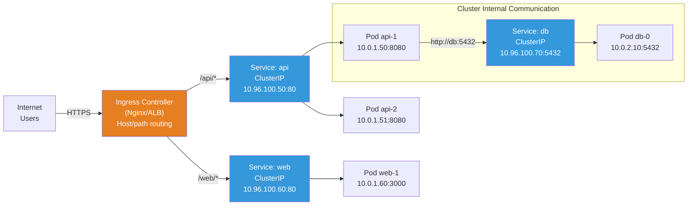
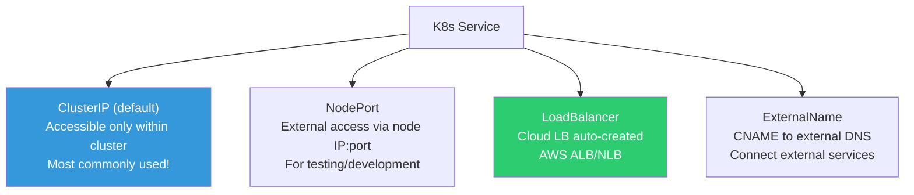
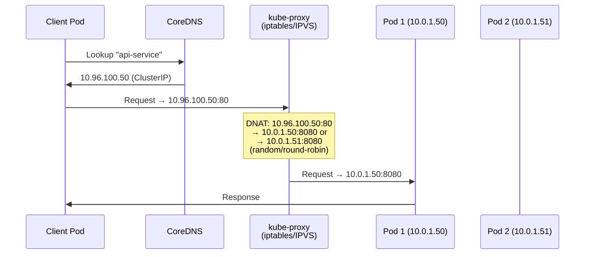
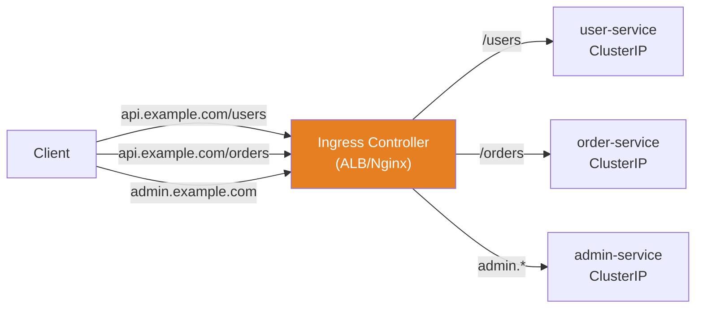
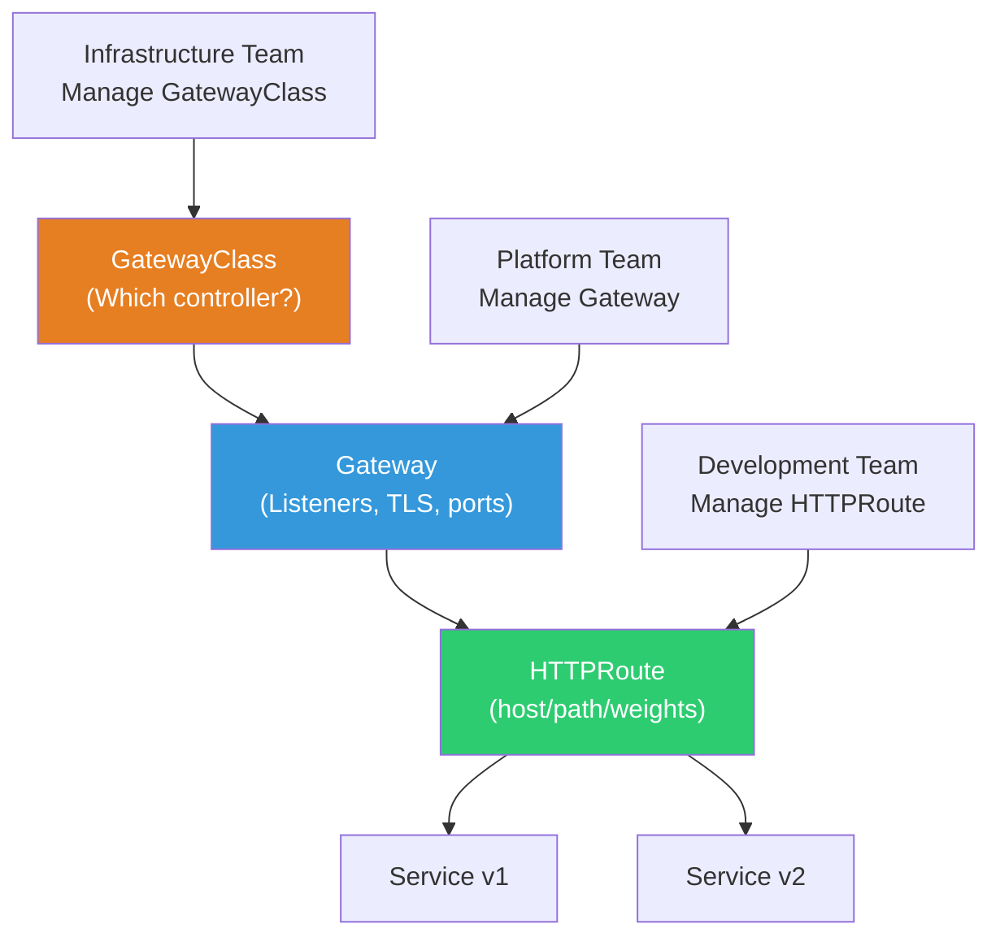
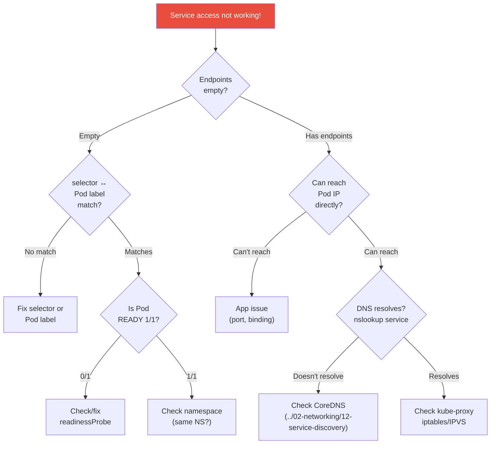

# Service / Ingress / Gateway API

> You've created Pods, but how do you access them? Pod IPs change every time, and if you have multiple Pods, which one should you send traffic to? **Service** provides a stable endpoint, and **Ingress** routes incoming HTTP traffic from outside. This is the K8s real-world application of the LB concepts you learned in the [networking lecture](../02-networking/06-load-balancing).

---

## 🎯 Why Do You Need to Know This?

```
Real-world Service/Ingress tasks:
• Configuring microservice communication          → ClusterIP Service
• Accessing apps from outside (HTTPS)            → Ingress + TLS
• Auto-creating AWS ALB/NLB                      → LoadBalancer Service
• Routing by domain/path                         → Ingress rules
• Canary deployments (traffic splitting)         → Gateway API weights
• "Service access isn't working" debugging       → Endpoints, kube-proxy
```

---

## 🧠 Core Concepts

### Complete Traffic Flow Diagram



---

## 🔍 Detailed Explanation — Service

### Why Service is Needed

```bash
# Pod IP changes every time!
kubectl get pods -o wide
# NAME        IP           NODE
# api-abc-1   10.0.1.50    node-1
# api-abc-2   10.0.1.51    node-2

# When a Pod is restarted?
kubectl delete pod api-abc-1
kubectl get pods -o wide
# NAME        IP           NODE
# api-abc-3   10.0.1.99    node-1    ← IP changed!
# api-abc-2   10.0.1.51    node-2

# → If another service connected to "10.0.1.50", the connection breaks!
# → Using Service provides a stable IP (ClusterIP) and DNS name
```

### 4 Types of Services



### ClusterIP (★ Most Commonly Used)

A virtual IP accessible **only from within the cluster**. Used for microservice communication.

```yaml
apiVersion: v1
kind: Service
metadata:
  name: api-service
  namespace: production
spec:
  type: ClusterIP                    # Default (can be omitted)
  selector:
    app: api                         # ⭐ Forward traffic to Pods with this label
  ports:
  - name: http
    port: 80                         # Service port (port clients access)
    targetPort: 8080                 # Pod port (port container listens on)
    protocol: TCP
  - name: grpc
    port: 9090
    targetPort: 9090
```

```bash
# Check Service
kubectl get svc
# NAME          TYPE        CLUSTER-IP      EXTERNAL-IP   PORT(S)          AGE
# api-service   ClusterIP   10.96.100.50    <none>        80/TCP,9090/TCP  5d
# kubernetes    ClusterIP   10.96.0.1       <none>        443/TCP          30d

# Key: Service provides 2 things
# 1. Stable IP (ClusterIP: 10.96.100.50) → Never changes!
# 2. DNS name (api-service.production.svc.cluster.local)
#    → (Covered in detail in ../02-networking/12-service-discovery!)

# Access from other Pod:
# curl http://api-service:80            ← Same namespace
# curl http://api-service.production:80  ← From different namespace

# Endpoints (actual Pod IP list) — kube-proxy routes using this!
kubectl get endpoints api-service
# NAME          ENDPOINTS                           AGE
# api-service   10.0.1.50:8080,10.0.1.51:8080      5d
#               ^^^^^^^^^^^^^^  ^^^^^^^^^^^^^^
#               Pod 1            Pod 2

# When Pod dies? → Automatically removed from Endpoints!
# When new Pod starts? → Automatically added to Endpoints!
# → Only Pods that pass readinessProbe are included in Endpoints!
```



### NodePort

Opens a specific port on the node to allow **external access**. More for testing/development than production.

```yaml
apiVersion: v1
kind: Service
metadata:
  name: api-nodeport
spec:
  type: NodePort
  selector:
    app: api
  ports:
  - port: 80                         # Service port
    targetPort: 8080                  # Pod port
    nodePort: 30080                   # ⭐ Node port (30000-32767)
```

```bash
kubectl get svc api-nodeport
# NAME           TYPE       CLUSTER-IP     EXTERNAL-IP   PORT(S)
# api-nodeport   NodePort   10.96.100.60   <none>        80:30080/TCP
#                                                        ^^^^^^^^
#                                                        Node port!

# Access: Any node's IP + 30080
curl http://node-1-ip:30080
curl http://node-2-ip:30080    # Can access via any node!

# ⚠️ NodePort disadvantages:
# - Limited port range (30000-32767)
# - Need to know node IP
# - Security (port open on all nodes)
# → In production, use LoadBalancer or Ingress!
```

### LoadBalancer

**Auto-creates a cloud load balancer**. In AWS, ALB/NLB is created.

```yaml
apiVersion: v1
kind: Service
metadata:
  name: api-lb
  annotations:
    # AWS NLB configuration (EKS)
    service.beta.kubernetes.io/aws-load-balancer-type: "nlb"
    service.beta.kubernetes.io/aws-load-balancer-scheme: "internet-facing"
    service.beta.kubernetes.io/aws-load-balancer-cross-zone-load-balancing-enabled: "true"
spec:
  type: LoadBalancer
  selector:
    app: api
  ports:
  - port: 80
    targetPort: 8080
```

```bash
kubectl get svc api-lb
# NAME     TYPE           CLUSTER-IP     EXTERNAL-IP                                 PORT(S)
# api-lb   LoadBalancer   10.96.100.70   abc123.ap-northeast-2.elb.amazonaws.com    80:31234/TCP
#                                        ^^^^^^^^^^^^^^^^^^^^^^^^^^^^^^^^^^^^^^^
#                                        AWS auto-created NLB!

# → Can access via this DNS name from outside!
curl http://abc123.ap-northeast-2.elb.amazonaws.com

# ⚠️ One LB per service → Expensive!
# → If 10 services, then 10 LBs → Not cheap!
# → Solution: Use Ingress to route multiple services via one LB ⭐
```

### ExternalName

Creates **a K8s DNS alias** to external services (like RDS).

```yaml
apiVersion: v1
kind: Service
metadata:
  name: database                       # Pods access as "database"
spec:
  type: ExternalName
  externalName: mydb.abc123.ap-northeast-2.rds.amazonaws.com
  # → nslookup database → CNAME → RDS endpoint
```

```bash
# Usage in Pod:
# DB_HOST=database    ← No need to hardcode RDS endpoint!

# Advantages:
# → Don't hardcode RDS endpoint in app code
# → Can swap RDS without changing code
# → (Already covered in ../02-networking/12-service-discovery!)
```

### Headless Service (clusterIP: None)

```yaml
# Used with StatefulSet (see ./03-statefulset-daemonset)
apiVersion: v1
kind: Service
metadata:
  name: mysql-headless
spec:
  clusterIP: None                      # ← Headless!
  selector:
    app: mysql
  ports:
  - port: 3306
```

```bash
# Regular Service: DNS → one ClusterIP → kube-proxy distributes
# Headless:        DNS → all Pod IPs → client chooses

kubectl run test --image=busybox --rm -it --restart=Never -- nslookup mysql-headless
# Address: 10.0.1.50   ← Pod 0
# Address: 10.0.1.51   ← Pod 1
# Address: 10.0.1.52   ← Pod 2

# Individual Pod DNS (StatefulSet):
# mysql-0.mysql-headless.production.svc.cluster.local → 10.0.1.50
```

---

## 🔍 Detailed Explanation — Ingress

### What is Ingress?

**Routes HTTP/HTTPS traffic based on host/path**. You already learned the Ingress concept in the [API Gateway lecture](../02-networking/13-api-gateway)? Let's dive deeper into K8s practical implementation.



**Ingress vs LoadBalancer Service:**

| Item | LoadBalancer Service | Ingress |
|------|---------------------|---------|
| LBs | One per service (expensive!) | **One for multiple services** |
| Routing | L4 (IP+port only) | L7 (host, path, headers) |
| TLS | Per-service config | Centralized TLS termination |
| Features | Simple distribution | Rate limit, redirect, rewrite |
| Recommendation | TCP/UDP services (DB) | **HTTP/HTTPS services** ⭐ |

### AWS ALB Ingress Controller (EKS)

Most common setup on EKS. Creating an Ingress **auto-creates an AWS ALB**.

```yaml
apiVersion: networking.k8s.io/v1
kind: Ingress
metadata:
  name: myapp-ingress
  namespace: production
  annotations:
    # ⭐ ALB Ingress Controller configuration
    kubernetes.io/ingress.class: alb
    alb.ingress.kubernetes.io/scheme: internet-facing        # Public
    alb.ingress.kubernetes.io/target-type: ip                # Direct to Pod IP
    alb.ingress.kubernetes.io/listen-ports: '[{"HTTPS":443}]'
    alb.ingress.kubernetes.io/certificate-arn: arn:aws:acm:ap-northeast-2:123456:certificate/abc123
    alb.ingress.kubernetes.io/ssl-policy: ELBSecurityPolicy-TLS13-1-2-2021-06
    alb.ingress.kubernetes.io/healthcheck-path: /health
    alb.ingress.kubernetes.io/healthcheck-interval-seconds: "15"

    # WAF integration (see ../02-networking/09-network-security)
    alb.ingress.kubernetes.io/wafv2-acl-arn: arn:aws:wafv2:...:webacl/my-waf

    # Redirect (HTTP → HTTPS)
    alb.ingress.kubernetes.io/ssl-redirect: "443"

    # Access logs
    alb.ingress.kubernetes.io/load-balancer-attributes: access_logs.s3.enabled=true,access_logs.s3.bucket=my-alb-logs
spec:
  ingressClassName: alb
  rules:
  - host: api.example.com
    http:
      paths:
      - path: /users
        pathType: Prefix
        backend:
          service:
            name: user-service
            port:
              number: 80
      - path: /orders
        pathType: Prefix
        backend:
          service:
            name: order-service
            port:
              number: 80
      - path: /
        pathType: Prefix
        backend:
          service:
            name: frontend-service
            port:
              number: 80
  - host: admin.example.com
    http:
      paths:
      - path: /
        pathType: Prefix
        backend:
          service:
            name: admin-service
            port:
              number: 80
```

```bash
# Check Ingress
kubectl get ingress -n production
# NAME             CLASS   HOSTS                              ADDRESS                                    PORTS   AGE
# myapp-ingress    alb     api.example.com,admin.example.com  k8s-prod-abc123.ap-northeast-2.elb.amazonaws.com  80,443  5d
#                                                             ^^^^^^^^^^^^^^^^^^^^^^^^^^^^^^^^^^^^^^^^^^^^^^^^^
#                                                             AWS ALB auto-created!

# Detailed info
kubectl describe ingress myapp-ingress -n production
# Rules:
#   Host                Path  Backends
#   ----                ----  --------
#   api.example.com
#                       /users    user-service:80 (10.0.1.50:8080,10.0.1.51:8080)
#                       /orders   order-service:80 (10.0.1.60:8080)
#                       /         frontend-service:80 (10.0.1.70:3000)
#   admin.example.com
#                       /         admin-service:80 (10.0.1.80:8080)

# Connect domain in Route53:
# api.example.com → ALB DNS (Alias record)
# admin.example.com → Same ALB DNS
```

### Nginx Ingress Controller

Can use Nginx as Ingress Controller instead of ALB.

```bash
# Install (Helm)
helm repo add ingress-nginx https://kubernetes.github.io/ingress-nginx
helm install ingress-nginx ingress-nginx/ingress-nginx \
    --namespace ingress-nginx --create-namespace \
    --set controller.replicaCount=2 \
    --set controller.service.type=LoadBalancer
# → NLB is created, Nginx Pod does L7 routing behind it

# Differences with Nginx Ingress:
# ingressClassName: nginx (instead of alb)
# Annotations: nginx.ingress.kubernetes.io/* (instead of alb.ingress.kubernetes.io)
# → Covered in detail in ../02-networking/13-api-gateway for Nginx Ingress annotations!
```

```yaml
# Nginx Ingress example
apiVersion: networking.k8s.io/v1
kind: Ingress
metadata:
  name: myapp-nginx
  annotations:
    nginx.ingress.kubernetes.io/ssl-redirect: "true"
    nginx.ingress.kubernetes.io/proxy-body-size: "50m"
    nginx.ingress.kubernetes.io/limit-rps: "10"              # Rate Limiting!
    nginx.ingress.kubernetes.io/enable-cors: "true"
    nginx.ingress.kubernetes.io/rewrite-target: /$2           # Path rewriting
spec:
  ingressClassName: nginx
  tls:
  - hosts:
    - api.example.com
    secretName: tls-secret                                    # K8s Secret (TLS certificate)
  rules:
  - host: api.example.com
    http:
      paths:
      - path: /api(/|$)(.*)
        pathType: ImplementationSpecific
        backend:
          service:
            name: api-service
            port:
              number: 80
```

```bash
# Create TLS Secret (see ../02-networking/05-tls-certificate)
kubectl create secret tls tls-secret \
    --cert=fullchain.pem \
    --key=privkey.pem \
    -n production

# Or use cert-manager for auto-issuing!
# → Automatically issue/renew Let's Encrypt certificates in K8s
# Install:
helm install cert-manager jetstack/cert-manager \
    --namespace cert-manager --create-namespace \
    --set installCRDs=true
```

```yaml
# cert-manager ClusterIssuer (Let's Encrypt)
apiVersion: cert-manager.io/v1
kind: ClusterIssuer
metadata:
  name: letsencrypt-prod
spec:
  acme:
    server: https://acme-v02.api.letsencrypt.org/directory
    email: devops@example.com
    privateKeySecretRef:
      name: letsencrypt-prod
    solvers:
    - http01:
        ingress:
          class: nginx

---
# Add cert-manager annotation to Ingress:
# annotations:
#   cert-manager.io/cluster-issuer: "letsencrypt-prod"
# tls:
# - hosts:
#   - api.example.com
#   secretName: api-tls    ← cert-manager auto-creates Secret!
```

---

## 🔍 Detailed Explanation — Gateway API (K8s Community Recommended Standard)

Gateway API reached **v1.0 GA (stable)** in 2024 and is the official K8s community recommended standard. As the successor to Ingress, you already saw the concept in the [API Gateway lecture](../02-networking/13-api-gateway), so let's focus on practical setup here.

> **For new projects, use Gateway API.** Ingress is maintained for legacy compatibility only, and K8s SIG-Network actively recommends Gateway API.

### Gateway API Architecture — Role-Based Separation



```bash
# Ingress mixes infra/platform/dev config into one resource
# → Annotations differ per vendor, hard to separate concerns

# Gateway API separates into 3 clear layers:
# GatewayClass: Infra team  — which controller (AWS ALB, Istio, Envoy, etc.)
# Gateway:      Platform team — listeners (ports, TLS), network config
# HTTPRoute:    Dev team     — path/host mapping, traffic splitting
```

### Gateway API vs Ingress Comparison

| Item | Ingress | Gateway API |
|------|---------|-------------|
| **Status** | Legacy (maintenance only) | **GA v1.0+ (recommended standard)** |
| **Protocols** | HTTP/HTTPS only | HTTP, HTTPS, TCP, UDP, gRPC, TLS |
| **Traffic Splitting** | No native support (needs annotations) | **Native weight support** |
| **Role Separation** | Not possible (single resource) | GatewayClass/Gateway/Route separated |
| **Vendor Independence** | Vendor-specific annotations | **Standardized API spec** |
| **Extensibility** | Annotations only | CRD-based extensions (Policy, etc.) |
| **Controller Support** | Nginx, ALB, Traefik, etc. | Istio, Envoy, Cilium, ALB, Nginx, etc. |
| **Adoption** | Most existing projects | New projects, service mesh integration |

### GatewayClass + Gateway Setup

```yaml
# GatewayClass — managed by infrastructure team
apiVersion: gateway.networking.k8s.io/v1
kind: GatewayClass
metadata:
  name: aws-alb
spec:
  controllerName: gateway.networking.k8s.io/aws-alb   # Controller to use
  description: "AWS ALB Gateway Controller"

---
# Gateway — managed by platform team
apiVersion: gateway.networking.k8s.io/v1
kind: Gateway
metadata:
  name: production-gateway
  namespace: gateway-system
spec:
  gatewayClassName: aws-alb            # ⭐ GatewayClass defined above
  listeners:
  - name: https
    protocol: HTTPS
    port: 443
    tls:
      mode: Terminate
      certificateRefs:
      - name: tls-cert
        kind: Secret
    allowedRoutes:
      namespaces:
        from: Selector
        selector:
          matchLabels:
            gateway-access: "true"     # Only namespaces with this label can attach Routes
  - name: http
    protocol: HTTP
    port: 80
```

### HTTPRoute — Weight-Based Canary Deployment

```yaml
# HTTPRoute — managed by development team
apiVersion: gateway.networking.k8s.io/v1
kind: HTTPRoute
metadata:
  name: api-route
  namespace: production
spec:
  parentRefs:
  - name: production-gateway
    namespace: gateway-system
  hostnames:
  - "api.example.com"
  rules:
  - matches:
    - path:
        type: PathPrefix
        value: /api
    backendRefs:
    - name: api-service-v1
      port: 80
      weight: 90                       # 90% → existing version
    - name: api-service-v2
      port: 80
      weight: 10                       # 10% → new version (canary!)
```

```bash
# Canary deployment flow:
# Step 1: weight 90/10 → 10% traffic to new version
# Step 2: Monitor, then weight 70/30
# Step 3: If OK, weight 0/100 → full switch!
# Rollback: weight 100/0 → instant revert!

# With Ingress, weight-based splitting required annotation hacks,
# but Gateway API supports it cleanly as part of the standard spec!

# Check HTTPRoute
kubectl get httproutes -n production
# NAME        HOSTNAMES             AGE
# api-route   ["api.example.com"]   5d

kubectl describe httproute api-route -n production
```

### HTTPRoute Advanced — Header-Based Routing

```yaml
# Route to new version if specific header present (developer testing)
apiVersion: gateway.networking.k8s.io/v1
kind: HTTPRoute
metadata:
  name: api-route-canary
  namespace: production
spec:
  parentRefs:
  - name: production-gateway
    namespace: gateway-system
  hostnames:
  - "api.example.com"
  rules:
  # Rule 1: x-canary: true header → route to v2
  - matches:
    - headers:
      - name: x-canary
        value: "true"
    backendRefs:
    - name: api-service-v2
      port: 80
  # Rule 2: everything else → route to v1
  - backendRefs:
    - name: api-service-v1
      port: 80
```

### Getting Started with Gateway API in New Projects

```bash
# 1. Install Gateway API CRDs
kubectl apply -f https://github.com/kubernetes-sigs/gateway-api/releases/download/v1.2.0/standard-install.yaml

# 2. Install controller (e.g., Envoy Gateway)
helm install eg oci://docker.io/envoyproxy/gateway-helm \
    --version v1.2.0 -n envoy-gateway-system --create-namespace

# 3. Create GatewayClass, Gateway, HTTPRoute in order

# Supported controllers:
# - Istio          (best service mesh integration)
# - Envoy Gateway  (lightweight, CNCF project)
# - Cilium         (eBPF-based, high performance)
# - AWS ALB        (EKS native)
# - Nginx Gateway  (Nginx Inc. official)
# - Traefik        (v3+)

# ⚠️ Migrating existing projects:
# → Ingress and Gateway API can coexist
# → Gradually add HTTPRoutes, then remove Ingress resources
```

---

## 🔍 Detailed Explanation — Service Debugging

### "Service Access Isn't Working!" Systematic Diagnosis

```bash
# === Step 1: Check Service ===
kubectl get svc api-service
# NAME          TYPE        CLUSTER-IP     PORT(S)
# api-service   ClusterIP   10.96.100.50   80/TCP

# === Step 2: Check Endpoints (⭐ Most Important!) ===
kubectl get endpoints api-service
# NAME          ENDPOINTS        AGE
# api-service   <none>           5d    ← Empty! Pod not connected!

# Causes of empty Endpoints:
# a. No Pod with matching selector
kubectl get pods -l app=api
# No resources found   ← No Pod or label mismatch!

# b. Pod exists but readinessProbe fails
kubectl get pods -l app=api
# NAME        READY   STATUS
# api-abc-1   0/1     Running    ← READY 0/1! readinessProbe failed!

kubectl describe pod api-abc-1 | grep -A 5 "Readiness"
# Readiness probe failed: HTTP probe failed with statuscode: 503

# c. Selector label mismatch
kubectl get svc api-service -o jsonpath='{.spec.selector}'
# {"app":"api"}
kubectl get pods --show-labels | grep api
# api-abc-1  ... app=api-server    ← Not "api" but "api-server"!

# === Step 3: Test directly from Pod ===
kubectl exec -it test-pod -- curl http://10.0.1.50:8080/health
# → Can reach Pod IP directly?

# === Step 4: Check DNS ===
kubectl run test --image=busybox --rm -it --restart=Never -- nslookup api-service
# Server: 10.96.0.10
# Name: api-service.production.svc.cluster.local
# Address: 10.96.100.50    ← DNS works!

# === Step 5: Check kube-proxy ===
# Check iptables rules (on node)
sudo iptables -t nat -L -n | grep api-service
# → If no rules, kube-proxy issue
kubectl get pods -n kube-system -l k8s-app=kube-proxy
```

### Service Debugging Summary Flowchart



---

## 💻 Hands-On Examples

### Lab 1: Experience Different Service Types

```bash
# 1. Create Deployment
kubectl create deployment web-demo --image=nginx --replicas=3
kubectl wait --for=condition=available deployment/web-demo --timeout=60s

# 2. ClusterIP Service
kubectl expose deployment web-demo --port=80 --target-port=80 --name=web-clusterip
kubectl get svc web-clusterip
# TYPE: ClusterIP, CLUSTER-IP: 10.96.x.x

# Test access from within cluster
kubectl run test --image=busybox --rm -it --restart=Never -- wget -qO- http://web-clusterip
# <html>...Welcome to nginx!...</html>

# 3. NodePort Service
kubectl expose deployment web-demo --port=80 --target-port=80 --type=NodePort --name=web-nodeport
kubectl get svc web-nodeport
# TYPE: NodePort, PORT(S): 80:3xxxx/TCP

# 4. Check Endpoints (Pod IP list)
kubectl get endpoints web-clusterip
# ENDPOINTS: 10.0.1.50:80,10.0.1.51:80,10.0.1.52:80   ← 3 Pods!

# 5. Delete Pod → Endpoints auto-update
kubectl delete pod $(kubectl get pods -l app=web-demo -o name | head -1)
kubectl get endpoints web-clusterip
# → New Pod IP automatically added!

# 6. Cleanup
kubectl delete deployment web-demo
kubectl delete svc web-clusterip web-nodeport
```

### Lab 2: Ingress with Path-Based Routing

```bash
# 1. Create 2 services
kubectl create deployment app-v1 --image=hashicorp/http-echo -- -text="Version 1"
kubectl create deployment app-v2 --image=hashicorp/http-echo -- -text="Version 2"
kubectl expose deployment app-v1 --port=80 --target-port=5678
kubectl expose deployment app-v2 --port=80 --target-port=5678

# 2. Create Ingress (Nginx Ingress Controller required)
kubectl apply -f - << 'EOF'
apiVersion: networking.k8s.io/v1
kind: Ingress
metadata:
  name: path-routing
  annotations:
    nginx.ingress.kubernetes.io/rewrite-target: /
spec:
  ingressClassName: nginx
  rules:
  - http:
      paths:
      - path: /v1
        pathType: Prefix
        backend:
          service:
            name: app-v1
            port:
              number: 80
      - path: /v2
        pathType: Prefix
        backend:
          service:
            name: app-v2
            port:
              number: 80
EOF

# 3. Test
INGRESS_IP=$(kubectl get svc -n ingress-nginx ingress-nginx-controller -o jsonpath='{.status.loadBalancer.ingress[0].ip}' 2>/dev/null || echo "pending")

curl http://$INGRESS_IP/v1
# Version 1

curl http://$INGRESS_IP/v2
# Version 2

# 4. Cleanup
kubectl delete ingress path-routing
kubectl delete deployment app-v1 app-v2
kubectl delete svc app-v1 app-v2
```

### Lab 3: Service Endpoints Debugging

```bash
# 1. Create a problem intentionally
kubectl create deployment buggy --image=nginx
kubectl expose deployment buggy --port=80

# Check Endpoints are normal
kubectl get endpoints buggy
# ENDPOINTS: 10.0.1.50:80    ← 1 Pod

# 2. Change label so Service can't find Pod
POD_NAME=$(kubectl get pods -l app=buggy -o name | head -1)
kubectl label $POD_NAME app=broken --overwrite

# Check Endpoints
kubectl get endpoints buggy
# ENDPOINTS: <none>    ← Empty! Service can't find Pod!

# 3. Test access
kubectl run test --image=busybox --rm -it --restart=Never -- wget -qO- --timeout=3 http://buggy
# wget: download timed out    ← Can't access!

# 4. Restore label
kubectl label $POD_NAME app=buggy --overwrite
kubectl get endpoints buggy
# ENDPOINTS: 10.0.1.50:80    ← Restored!

# 5. Cleanup
kubectl delete deployment buggy
kubectl delete svc buggy
```

---

## 🏢 In Production?

### Scenario 1: Typical EKS Service Exposure Structure

```bash
# Most common EKS architecture:
# CloudFront → ALB (Ingress) → ClusterIP Service → Pod

# 1. Install ALB Ingress Controller (aws-load-balancer-controller)
helm install aws-load-balancer-controller eks/aws-load-balancer-controller \
    -n kube-system \
    --set clusterName=my-cluster \
    --set serviceAccount.create=false \
    --set serviceAccount.name=aws-load-balancer-controller

# 2. Ingress → ALB auto-created
# 3. Route53 → ALB DNS (Alias)
# 4. CloudFront → ALB (caching + DDoS, see ../02-networking/11-cdn)
# 5. ACM certificate → ALB (see ../02-networking/05-tls-certificate)

# Cost optimization:
# → One Ingress for multiple services via one ALB
# → Creating LoadBalancer per service means multiple ALBs → expensive!
```

### Scenario 2: Inter-Service Communication Design

```bash
# Microservice setup:
# user-service ←→ order-service ←→ payment-service ←→ notification-service

# All internal communication uses ClusterIP Service!
# Communicate by name:
# USER_SERVICE_URL=http://user-service:80
# ORDER_SERVICE_URL=http://order-service:80
# PAYMENT_SERVICE_URL=http://payment-service:80

# External exposure only via Ingress!
# /api/users   → user-service (ClusterIP)
# /api/orders  → order-service (ClusterIP)
# → External can't access internal services directly!

# If service mesh needed:
# → Istio/Linkerd → mTLS, traffic management, observability
# → (See lecture 18-service-mesh for details!)
```

### Scenario 3: "Can't access from outside" Diagnosis

```bash
# 1. Check Ingress
kubectl get ingress
# If ADDRESS is empty → Ingress Controller issue!
# → Check if Ingress Controller Pod is Running

# 2. Check Service
kubectl get svc api-service
kubectl get endpoints api-service
# If Endpoints empty → check selector/readinessProbe

# 3. Check ALB (AWS)
aws elbv2 describe-target-health --target-group-arn $TG_ARN
# Target  Port  HealthCheckStatus
# 10.0.1.50  8080  healthy
# 10.0.1.51  8080  unhealthy    ← Health check failed!

# 4. Check Security Group
# → ALB's SG → 443/80 inbound open?
# → Node's SG → ALB can reach Pod port?
# → (See ../02-networking/09-network-security for SG setup)

# 5. Check DNS
dig api.example.com
# → Resolves to ALB DNS?
# → Route53 record correct?
```

---

## ⚠️ Common Mistakes

### 1. Using LoadBalancer type for every Service

```bash
# ❌ 10 services with LB 10 each → Cost explosion!
# → AWS ALB/NLB each ~$16/month + traffic costs

# ✅ One Ingress + Multiple ClusterIP Services
# → One ALB routing all services!
```

### 2. Service selector and Pod label mismatch

```yaml
# ❌ Selector typo → Empty Endpoints → Can't access!
spec:
  selector:
    app: my-app          # Service
# Pod:
#   labels:
#     app: myapp          # "my-app" ≠ "myapp" !

# ✅ Check carefully!
kubectl get endpoints SERVICE_NAME
# <none> means selector issue!
```

### 3. No readinessProbe with Service

```bash
# ❌ Without readinessProbe:
# → Pod added to Endpoints immediately when starts
# → App still initializing, traffic arrives → errors!

# ✅ Always set readinessProbe! (Covered in detail in 08-healthcheck)
# → Only added to Endpoints when probe passes → traffic received
```

### 4. Not setting TLS in Ingress

```bash
# ❌ HTTP only → Security risk!
# → MITM attack can steal data

# ✅ Always use HTTPS (TLS)
# → cert-manager + Let's Encrypt → free auto-certificate!
# → Or ACM + ALB Ingress (AWS)
```

### 5. Confusing port and targetPort

```yaml
# port: Port Service exposes (clients access)
# targetPort: Port Pod listens on (container internal)
# nodePort: Port open on node (NodePort only)

# Example: App runs on 8080, Service exposes as 80
spec:
  ports:
  - port: 80              # curl http://service:80
    targetPort: 8080       # → Forwarded to Pod's 8080
    # nodePort: 30080      # → Also accessible on node:30080 (NodePort only)
```

---

## 📝 Summary

### Service Type Selection Guide

```
Internal service communication       → ClusterIP ⭐ (default, most common)
External HTTP/HTTPS exposure        → Ingress + ClusterIP ⭐
External TCP/UDP exposure           → LoadBalancer (NLB)
Connect external service (RDS)      → ExternalName
StatefulSet individual Pod          → Headless (clusterIP: None)
Testing/development                 → NodePort (not for production)
```

### Essential Commands

```bash
# Service
kubectl get svc / kubectl get endpoints
kubectl expose deployment NAME --port=80 --target-port=8080
kubectl describe svc NAME

# Ingress
kubectl get ingress
kubectl describe ingress NAME

# Debugging
kubectl get endpoints NAME              # Empty means problem!
kubectl get pods -l app=NAME            # Check Pod labels
kubectl run test --image=busybox --rm -it -- wget -qO- http://SERVICE
kubectl port-forward svc/NAME 8080:80   # Access Service from local
```

### Debugging Checklist

```
1. kubectl get endpoints  → Empty means selector/readiness issue
2. kubectl get pods -l ... → Pod exists? READY?
3. Direct Pod IP access    → App itself okay?
4. nslookup service        → DNS resolves?
5. Ingress ADDRESS         → Ingress Controller works?
6. ALB Target Health       → Health check passes? (AWS)
7. Security Group          → Port open? (AWS)
```

---

## 🔗 Next Lecture

Next is **[06-cni](./06-cni)** — CNI / Calico / Cilium / Flannel.

The "lower layer" of how Service delivers traffic to Pod — how Pod network itself is built, what CNI plugin is, and how the overlay principles from [container networking](../03-containers/05-networking) work in K8s. You'll learn all about it.
