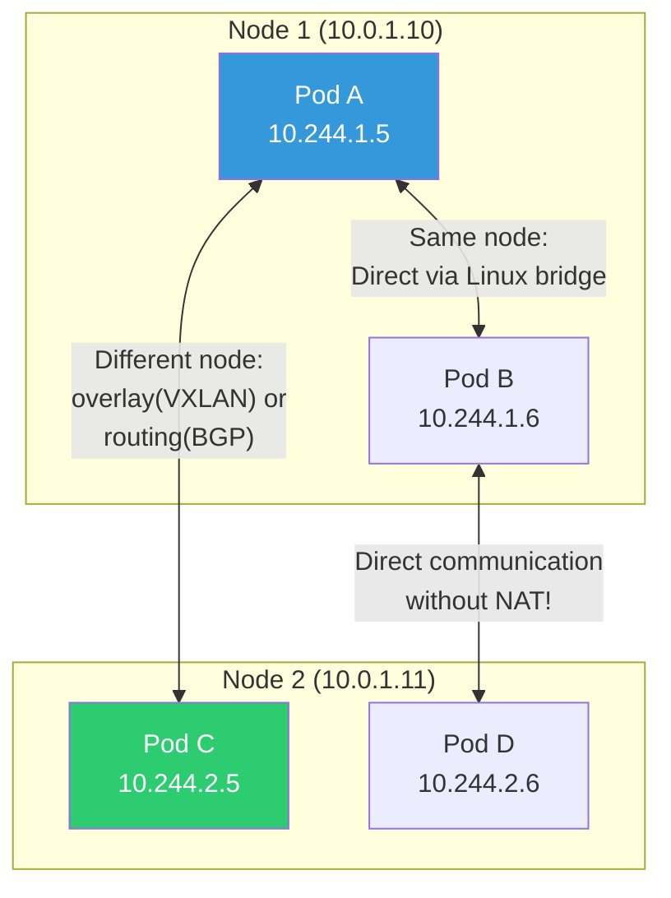
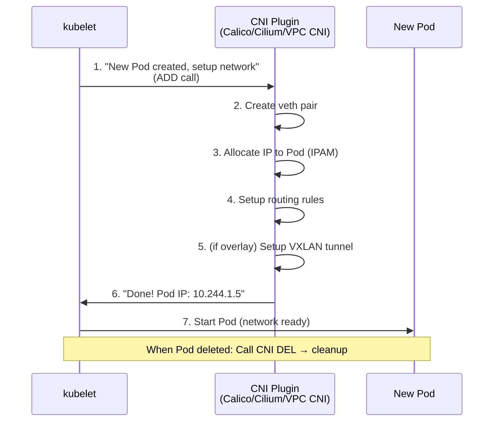
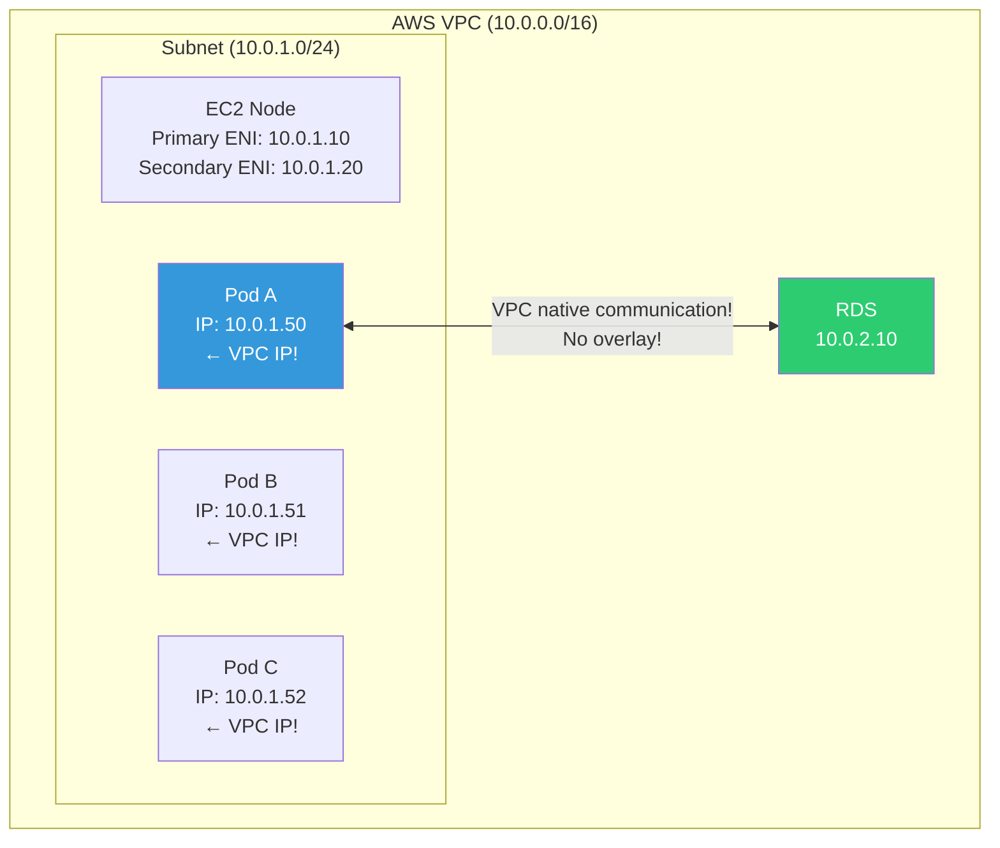
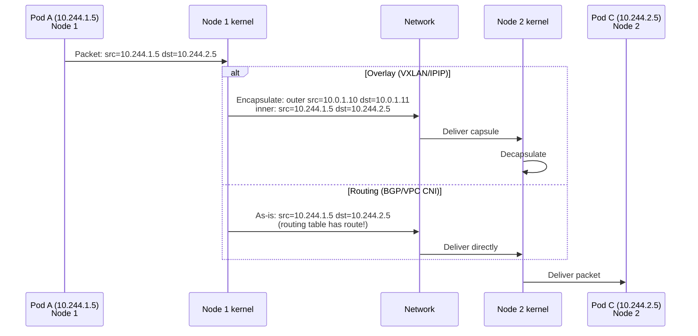

# CNI / Calico / Cilium / Flannel

> You learned bridge/overlay in [container networking](../03-containers/05-networking), and ClusterIP/Ingress in [Service](./05-service-ingress). Now for the **lower layer** — how Pods get IPs and communicate with each other, what a CNI plugin is. Understanding CNI solves 80% of K8s network issues.

---

## 🎯 Why Do You Need to Know This?

```
What understanding CNI solves:
• "Pod doesn't get assigned IP" (ENI exhaustion, CIDR depletion)
• "Pod-to-pod communication not working" (CNI failure)
• "NetworkPolicy not applying" (Flannel doesn't support it!)
• "Pod count limited per node" (AWS VPC CNI limitation)
• CNI selection (EKS: VPC CNI, self-hosted: Calico/Cilium)
• Interview: "Explain K8s network model"
```

---

## 🧠 Core Concepts

### Analogy: Apartment Complex Postal System

* **CNI** = Postal system standard for apartment complex ("mailbox specs, delivery rules")
* **CNI Plugin** = Actual delivery company (CJ Logistics, Post Office, etc). Same standard, different implementation
* **Pod IP** = Mailbox number of each unit (unique!)
* **Node** = Building. Within same building: elevator delivery, different building: road delivery
* **Overlay** = Wrapping package when going to different building
* **NetworkPolicy** = "Only 101 to 201 allowed, rest blocked"

### K8s Network Model 3 Required Principles

```bash
# K8s network universal rules (CNI must follow):
# 1. All Pods can communicate with all other Pods without NAT
# 2. All nodes can communicate with all Pods without NAT
# 3. Pod sees its own IP = Other Pod sees that Pod's IP (consistency)

# Difference from Docker default network:
# Docker: Container → NAT → Host IP → External (IP gets translated!)
# K8s:    Pod → (CNI managed) → Other Pod (No NAT, direct!)
```



### CNI Operation Flow



```bash
# CNI plugin location (on node)
ls /opt/cni/bin/
# bandwidth  calico      calico-ipam  flannel  host-local
# loopback   portmap     tuning       vxlan    bridge
# → Multiple CNI binaries possible (chained)

# CNI config file
ls /etc/cni/net.d/
# 10-calico.conflist    ← or 10-aws.conflist (EKS)
cat /etc/cni/net.d/10-calico.conflist | python3 -m json.tool | head -20
# {
#   "name": "k8s-pod-network",
#   "cniVersion": "0.3.1",
#   "plugins": [
#     {
#       "type": "calico",
#       "ipam": {"type": "calico-ipam"},
#       ...
#     }
#   ]
# }
```

---

## 🔍 Detailed Explanation — Major CNI Plugins Comparison

| Item | **AWS VPC CNI** | **Calico** | **Cilium** | **Flannel** |
|------|----------------|-----------|-----------|------------|
| Environment | EKS only | General | General | General |
| Network | VPC native IP | BGP/VXLAN/IPIP | eBPF/VXLAN | VXLAN |
| Pod IP | **VPC subnet IP!** | Separate CIDR | Separate CIDR | Separate CIDR |
| NetworkPolicy | ❌ (separate Calico) | ✅ Powerful | ✅ Very powerful | ❌ |
| Performance | ⭐ (native) | Good | ⭐⭐ (eBPF!) | Normal |
| Complexity | Low (EKS default) | Medium | Medium~High | Low |
| Recommendation | EKS ⭐ | Self-hosted | High performance/security | Learning/small |

---

## 🔍 Detailed Explanation — AWS VPC CNI (EKS Default)

### How It Works

EKS's VPC CNI **assigns real VPC IPs to Pods**. Fundamentally different from other CNIs.



```bash
# EKS VPC CNI advantages:
# ✅ Pod gets VPC IP → Direct communication anywhere in VPC!
# ✅ RDS, ElastiCache communicate directly (no overlay needed)
# ✅ Security Group applicable directly to Pod!
# ✅ ALB routes directly to Pod IP (target-type: ip)
# ❌ ENI/IP count limited → Node Pod count limited!

# Max Pod count per node check
kubectl get node node-1 -o jsonpath='{.status.allocatable.pods}'
# 58    ← This node max 58 Pods

# ENI/IP limit by instance type:
# t3.medium:  3 ENI × 6 IP = 17 Pods
# t3.large:   3 ENI × 12 IP = 35 Pods
# m5.large:   3 ENI × 10 IP = 29 Pods
# m5.xlarge:  4 ENI × 15 IP = 58 Pods
# → Formula: (ENI count × IPs per ENI - ENI count) + 2
# → Small instance = few Pods! Be careful!

# Check Pod's VPC IP
kubectl get pods -o wide
# NAME        READY   IP           NODE
# api-abc-1   1/1     10.0.1.50    node-1    ← VPC subnet IP!
# api-abc-2   1/1     10.0.1.51    node-1    ← Same subnet!

# Check IP usage in VPC subnet
aws ec2 describe-subnets --subnet-ids subnet-abc123 \
    --query 'Subnets[0].{CIDR:CidrBlock,Available:AvailableIpAddressCount}'
# {"CIDR": "10.0.1.0/24", "Available": 150}
# → /24 = 254 total, 150 available

# Check ENIs (on node)
aws ec2 describe-network-interfaces \
    --filters "Name=attachment.instance-id,Values=i-abc123" \
    --query 'NetworkInterfaces[*].{ENI:NetworkInterfaceId,IPs:PrivateIpAddresses[*].PrivateIpAddress}'
# ENI: eni-abc123, IPs: [10.0.1.10, 10.0.1.50, 10.0.1.51, 10.0.1.52]
#                        ^^^^^^^^    ^^^^^^^^^^^^^^^^^^^^^^^^^^^^^^^^
#                        Node IP     Pod IPs!
```

### VPC CNI Troubleshooting

```bash
# === "Pod doesn't get assigned IP!" ===

# Symptom:
kubectl get pods
# NAME        READY   STATUS              AGE
# api-abc-1   0/1     ContainerCreating   5m    ← Still Creating!

kubectl describe pod api-abc-1 | grep -A 5 Events
# Warning  FailedCreatePodSandBox  Failed to create pod sandbox:
#   failed to setup network: add cmd: failed to assign an IP address

# Cause 1: Subnet IP exhausted!
aws ec2 describe-subnets --subnet-ids subnet-abc123 \
    --query 'Subnets[0].AvailableIpAddressCount'
# 0    ← No IPs!

# Solution:
# a. Expand subnet CIDR (add Secondary CIDR)
# b. Use larger subnet (/24 → /20)
# c. Enable VPC CNI Prefix Delegation
kubectl set env daemonset aws-node -n kube-system ENABLE_PREFIX_DELEGATION=true
# → Allocate /28 prefix to ENI → Greatly increase Pod count!

# Cause 2: ENI limit exceeded!
# → Switch to larger instance type (more ENIs)

# Check aws-node DaemonSet logs (VPC CNI logs)
kubectl logs -n kube-system -l k8s-app=aws-node --tail=30
# → IP allocation failure reasons shown
```

---

## 🔍 Detailed Explanation — Calico

### What is Calico?

Most popular open-source CNI. Features **BGP routing** + **powerful NetworkPolicy**.

```bash
# Calico network modes:
# 1. BGP (default): Nodes exchange Pod CIDR via BGP
#    → Direct routing without overlay (good performance!)
#    → But network infra must support BGP
#
# 2. IPIP: IP-in-IP encapsulation (L3 overlay)
#    → Works anywhere, slight overhead
#    → IPIP only cross-subnet (CrossSubnet mode)
#
# 3. VXLAN: L2 overlay
#    → For environments without BGP

# Check Calico components
kubectl get pods -n calico-system
# NAME                                      READY   STATUS
# calico-kube-controllers-abc123            1/1     Running
# calico-node-xyz11                         1/1     Running    ← One per node!
# calico-node-xyz22                         1/1     Running
# calico-typha-abc456                       1/1     Running    ← Large scale performance boost

# Check Calico node status
sudo calicoctl node status
# Calico process is running.
# IPv4 BGP status
# +--------------+-------------------+-------+----------+
# | PEER ADDRESS | PEER TYPE         | STATE | SINCE    |
# +--------------+-------------------+-------+----------+
# | 10.0.1.11    | node-to-node mesh | up    | 12:00:00 |
# | 10.0.1.12    | node-to-node mesh | up    | 12:00:00 |
# +--------------+-------------------+-------+----------+
# → Check BGP peering status!

# Check IP Pool
sudo calicoctl get ippool -o wide
# NAME               CIDR             NAT    IPIPMODE    VXLANMODE
# default-ipv4-pool  10.244.0.0/16    true   Always      Never
# → Pod CIDR: 10.244.0.0/16, using IPIP mode
```

### Calico NetworkPolicy (★ Calico's Core Strength!)

Supports **more powerful than K8s standard** NetworkPolicy.

```yaml
# K8s standard NetworkPolicy (Calico implements it)
apiVersion: networking.k8s.io/v1
kind: NetworkPolicy
metadata:
  name: api-network-policy
  namespace: production
spec:
  podSelector:
    matchLabels:
      app: api                         # Apply to this Pod

  policyTypes:
  - Ingress
  - Egress

  ingress:
  - from:
    - podSelector:                     # From specific Pod in same NS
        matchLabels:
          app: frontend
    - namespaceSelector:               # From specific NS only
        matchLabels:
          name: monitoring
    ports:
    - protocol: TCP
      port: 8080

  egress:
  - to:
    - podSelector:
        matchLabels:
          app: database
    ports:
    - protocol: TCP
      port: 5432
  - to:                                # Allow DNS (required!)
    - namespaceSelector:
        matchLabels:
          kubernetes.io/metadata.name: kube-system
    ports:
    - protocol: UDP
      port: 53
    - protocol: TCP
      port: 53
```

```bash
# Check NetworkPolicy
kubectl get networkpolicy -n production
# NAME                 POD-SELECTOR   AGE
# api-network-policy   app=api        5d

# Test functionality
# api Pod to database → allowed ✅
kubectl exec -n production api-pod -- nc -zv database 5432
# succeeded!

# api Pod to other service → blocked ❌
kubectl exec -n production api-pod -- nc -zv other-service 8080
# timed out

# ⚠️ Without NetworkPolicy = all traffic allowed! (default)
# NetworkPolicy applied = only explicitly allowed passes!

# ⚠️ Flannel doesn't implement NetworkPolicy!
# → Flannel + NetworkPolicy = doesn't block even if applied! Dangerous!
# → Need Calico or Cilium for NetworkPolicy!
```

---

## 🔍 Detailed Explanation — Cilium

### What is Cilium?

**eBPF-based** next-gen CNI. Processes network at kernel level, **very performant** and excellent observability.

```bash
# What is eBPF? (Briefly covered in ../01-linux/12-performance)
# → Run programs inside kernel
# → Process packets directly in kernel → fast!

# Cilium advantages:
# ✅ eBPF replaces kube-proxy (no iptables!)
# ✅ L7 NetworkPolicy (control HTTP URL, gRPC method!)
# ✅ Hubble (built-in network observability tool)
# ✅ High performance (no iptables overhead)
# ✅ WireGuard-based encryption (auto mTLS)
# ✅ Service Mesh (replace Istio sidecar!)

# Check Cilium components
kubectl get pods -n kube-system -l k8s-app=cilium
# NAME           READY   STATUS
# cilium-abc12   1/1     Running    ← DaemonSet per node
# cilium-def34   1/1     Running

# Check Cilium status
kubectl exec -n kube-system cilium-abc12 -- cilium status
# KVStore:     Ok   Disabled
# Kubernetes:  Ok   1.28 (v1.28.0)
# ...
# Controller Status: 35/35 healthy
# Proxy Status:      OK
# Cluster health:    3/3 reachable

# Hubble (network observability)
kubectl exec -n kube-system cilium-abc12 -- hubble observe --last 10
# TIMESTAMP   SOURCE         DESTINATION       TYPE       VERDICT
# 10:00:01    api/api-abc    db/db-xyz         L4/TCP     FORWARDED
# 10:00:02    api/api-abc    redis/redis-xyz   L4/TCP     FORWARDED
# 10:00:03    web/web-abc    api/api-abc       L4/TCP     FORWARDED
# 10:00:04    web/web-abc    google.com        L4/TCP     DROPPED    ← Blocked!
# → See who talks to whom in real-time!
```

### Cilium L7 NetworkPolicy (HTTP-Level Control!)

```yaml
# Cilium-specific: Control HTTP path/method!
apiVersion: cilium.io/v2
kind: CiliumNetworkPolicy
metadata:
  name: api-l7-policy
spec:
  endpointSelector:
    matchLabels:
      app: api
  ingress:
  - fromEndpoints:
    - matchLabels:
        app: frontend
    toPorts:
    - ports:
      - port: "8080"
        protocol: TCP
      rules:
        http:
        - method: GET                  # Only GET allowed!
          path: "/api/v1/users.*"      # Only this path!
        - method: POST
          path: "/api/v1/orders"
        # PUT, DELETE blocked!
```

```bash
# Test L7 policy
# GET /api/v1/users → allowed ✅
kubectl exec frontend-pod -- curl -s http://api:8080/api/v1/users
# 200 OK

# DELETE /api/v1/users/1 → blocked ❌
kubectl exec frontend-pod -- curl -s -X DELETE http://api:8080/api/v1/users/1
# 403 Forbidden (Access denied by policy)

# → Standard NetworkPolicy only L3/L4 (IP/port)
# → Cilium does L7 (HTTP method, path, header)!
```

---

## 🔍 Detailed Explanation — Flannel

```bash
# Flannel: Simplest CNI (for learning/small-scale)
# ✅ Very simple setup
# ✅ VXLAN overlay (works anywhere)
# ❌ No NetworkPolicy support! (critical limitation)
# ❌ No advanced features (BGP, eBPF, etc)

# → Recommended only for learning, development
# → Production needs Calico or Cilium!

# Check Flannel Pod
kubectl get pods -n kube-flannel
# NAME                  READY   STATUS
# kube-flannel-abc12    1/1     Running
# kube-flannel-def34    1/1     Running
```

---

## 🔍 Detailed Explanation — Pod Network Internals

### Pod-to-Pod Communication on Same Node

```bash
# Pod A (10.244.1.5) → Pod B (10.244.1.6) — Same node

# 1. Pod A's veth → Node's cali-xxx (Calico) or cbr0 (bridge)
# 2. Linux bridge forwards to Pod B's veth directly
# 3. Pod B receives

# Verify (on node)
ip link show type veth
# veth-abc@if3: ... master cni0
# veth-def@if5: ... master cni0

bridge link show
# veth-abc → cni0
# veth-def → cni0

# Routing (on node)
ip route | grep 10.244.1
# 10.244.1.5 dev veth-abc scope link
# 10.244.1.6 dev veth-def scope link
# → Pods on same node route directly!
```

### Pod-to-Pod Communication on Different Nodes



```bash
# === Overlay (VXLAN) method ===
# Check VXLAN interface on Node 1
ip -d link show vxlan.calico
# vxlan.calico: <BROADCAST,MULTICAST,UP> mtu 1450 ...
#                                         ^^^^^^^^
#                                         MTU 1450! (encapsulation overhead)

# VXLAN FDB (which Pod is on which node)
bridge fdb show dev vxlan.calico | head -5
# aa:bb:cc:dd:ee:ff dst 10.0.1.11 self permanent
# → This MAC's Pod is on Node 10.0.1.11

# === VPC CNI method (EKS) ===
# No overlay! Direct via VPC routing!
ip route | grep 10.0.1
# 10.0.1.50 dev eni-xxx scope link    ← Direct to ENI
# 10.0.1.51 dev eni-xxx scope link
# → Pod IP is VPC IP, routed directly via VPC!

# === BGP method (Calico) ===
# Exchange routing info via BGP
ip route | grep 10.244
# 10.244.1.0/24 dev cali-xxx    ← Local Pods
# 10.244.2.0/24 via 10.0.1.11   ← Node 2's Pods go to Node 2!
# 10.244.3.0/24 via 10.0.1.12   ← Node 3's Pods go to Node 3!
```

---

## 💻 Hands-On Examples

### Lab 1: Explore Pod Network

```bash
# 1. Run 2 Pods (preferably different nodes)
kubectl apply -f - << 'EOF'
apiVersion: apps/v1
kind: Deployment
metadata:
  name: net-test
spec:
  replicas: 2
  selector:
    matchLabels:
      app: net-test
  template:
    metadata:
      labels:
        app: net-test
    spec:
      containers:
      - name: tools
        image: nicolaka/netshoot
        command: ["sleep", "3600"]
EOF

# 2. Check Pod IP and node
kubectl get pods -l app=net-test -o wide
# NAME              IP           NODE
# net-test-abc-1    10.244.1.5   node-1
# net-test-abc-2    10.244.2.5   node-2    ← Different node!

# 3. Test direct Pod-to-Pod communication
kubectl exec net-test-abc-1 -- ping -c 3 10.244.2.5
# 64 bytes from 10.244.2.5: icmp_seq=1 ttl=62 time=0.5ms
# → Different node Pod reaches directly without NAT! ✅

# 4. Check path via traceroute
kubectl exec net-test-abc-1 -- traceroute -n 10.244.2.5
# 1  10.244.1.1    0.1ms    ← Node 1 gateway
# 2  10.0.1.11     0.3ms    ← Node 2
# 3  10.244.2.5    0.5ms    ← Pod arrival!

# 5. Check Pod network interface
kubectl exec net-test-abc-1 -- ip addr show eth0
# eth0@if7: ... inet 10.244.1.5/32 scope global eth0
#                    ^^^^^^^^^^^^^
#                    /32 = host routing (Calico style)

kubectl exec net-test-abc-1 -- ip route
# default via 169.254.1.1 dev eth0
# 169.254.1.1 dev eth0 scope link
# → Calico uses 169.254.1.1 as virtual gateway

# 6. Check DNS
kubectl exec net-test-abc-1 -- nslookup kubernetes
# Address: 10.96.0.1

# 7. Cleanup
kubectl delete deployment net-test
```

### Lab 2: Apply NetworkPolicy

```bash
# 1. Setup services
kubectl create namespace policy-test
kubectl create deployment web --image=nginx -n policy-test
kubectl create deployment api --image=nginx -n policy-test
kubectl create deployment db --image=nginx -n policy-test
kubectl expose deployment web --port=80 -n policy-test
kubectl expose deployment api --port=80 -n policy-test
kubectl expose deployment db --port=80 -n policy-test

# 2. Default state: all Pods can communicate
kubectl exec -n policy-test deploy/web -- curl -s --max-time 3 http://db
# <html>...Welcome to nginx!...    ← web → db possible!

# 3. Apply NetworkPolicy: only api can reach db!
kubectl apply -f - << 'EOF'
apiVersion: networking.k8s.io/v1
kind: NetworkPolicy
metadata:
  name: db-policy
  namespace: policy-test
spec:
  podSelector:
    matchLabels:
      app: db
  policyTypes:
  - Ingress
  ingress:
  - from:
    - podSelector:
        matchLabels:
          app: api
    ports:
    - protocol: TCP
      port: 80
EOF

# 4. Test
kubectl exec -n policy-test deploy/api -- curl -s --max-time 3 http://db
# <html>...Welcome to nginx!...    ← api → db allowed! ✅

kubectl exec -n policy-test deploy/web -- curl -s --max-time 3 http://db
# (timeout)                         ← web → db blocked! ❌ ✅

# 5. Cleanup
kubectl delete namespace policy-test
```

### Lab 3: Check Pod Count per Node (EKS)

```bash
# 1. Max allocatable Pods per node
kubectl get nodes -o custom-columns=\
NAME:.metadata.name,\
MAX_PODS:.status.allocatable.pods,\
INSTANCE:.metadata.labels.node\\.kubernetes\\.io/instance-type
# NAME        MAX_PODS   INSTANCE
# node-1      58         m5.xlarge
# node-2      29         m5.large
# node-3      17         t3.medium    ← Only 17!

# 2. Current Pod count
kubectl get pods -A --field-selector spec.nodeName=node-3 --no-headers | wc -l
# 15    ← 17 max, 15 used (2 available!)

# 3. IP usage (aws-node logs)
kubectl logs -n kube-system -l k8s-app=aws-node --tail=5 | grep -i "ip"
# → "ipamd: assigned IP 10.0.1.55 to pod api-abc-1"
# → "ipamd: total IPs: 17, used: 15, available: 2"
```

---

## 🏢 In Production?

### Scenario 1: CNI Selection Guide

```bash
# EKS (AWS) → VPC CNI (default) + Calico NetworkPolicy
# → VPC CNI: native performance, AWS service direct communication
# → Calico: add only NetworkPolicy (calico-policy-only mode)
# → Or Cilium (eBPF performance + L7 Policy + Hubble observability)

# GKE (GCP) → GKE default CNI + Dataplane v2 (Cilium-based!)
# → Auto-configured, NetworkPolicy supported

# Self-hosted (kubeadm) → Calico ⭐ or Cilium
# → Calico: proven, stable, rich docs
# → Cilium: latest, eBPF performance, L7 Policy (more complex)

# Learning/testing → Flannel (simplest, no NetworkPolicy!)

# High security → Cilium
# → L7 Policy, encryption (WireGuard), Hubble observability
```

### Scenario 2: "Pod Doesn't Get IP" (EKS)

```bash
# Most common EKS network issue!

# Cause 1: Subnet IP exhausted
aws ec2 describe-subnets --subnet-ids $SUBNET_ID \
    --query 'Subnets[0].AvailableIpAddressCount'
# → 0 = no IPs!
# → Solution: larger subnet, Secondary CIDR

# Cause 2: ENI limit exceeded
# → Check instance type ENI/IP limit
# → Solution: Prefix Delegation or larger instance

# Cause 3: Security Group limit
# → ENI max 5 SGs → too many SGs break ENI creation
# → Solution: clean up SGs

# Cause 4: aws-node DaemonSet failed
kubectl get ds -n kube-system aws-node
kubectl logs -n kube-system -l k8s-app=aws-node --tail=30
# → Check IPAMD errors
```

### Scenario 3: NetworkPolicy Design Pattern

```bash
# === Default Deny (block all, allow needed only) ===

# 1. Block entire namespace (default)
kubectl apply -f - << 'EOF'
apiVersion: networking.k8s.io/v1
kind: NetworkPolicy
metadata:
  name: default-deny-all
  namespace: production
spec:
  podSelector: {}          # Apply to all Pods
  policyTypes:
  - Ingress
  - Egress
EOF
# → production NS all Pods: all inbound/outbound blocked!

# 2. Allow DNS (almost always needed!)
kubectl apply -f - << 'EOF'
apiVersion: networking.k8s.io/v1
kind: NetworkPolicy
metadata:
  name: allow-dns
  namespace: production
spec:
  podSelector: {}
  policyTypes:
  - Egress
  egress:
  - to:
    - namespaceSelector:
        matchLabels:
          kubernetes.io/metadata.name: kube-system
    ports:
    - protocol: UDP
      port: 53
    - protocol: TCP
      port: 53
EOF

# 3. Add per-service allow rules
# api → db only, web → api only, etc
# → Least privilege network! (see ../02-networking/09-network-security Zero Trust)
```

---

## ⚠️ Common Mistakes

### 1. Thinking Flannel has NetworkPolicy

```bash
# ❌ Flannel doesn't implement NetworkPolicy!
# → Apply NetworkPolicy, doesn't block anything!
# → All traffic allowed → security risk!

# ✅ Need Calico, Cilium, or AWS VPC CNI + Calico
```

### 2. EKS subnet designed too small

```bash
# ❌ /24 subnet (254 IPs) → 200 Pods need IPs → exhausted!
# → Pod IP + node IP + ENI IP + AWS reserved 5

# ✅ EKS subnet minimum /20 (4,094 IPs)
# ✅ Or add Secondary CIDR 100.64.0.0/16
# (see ../02-networking/04-network-structure for CIDR calculation)
```

### 3. Forgetting DNS in NetworkPolicy

```bash
# ❌ Default Deny without DNS open → service name resolution fails!
# → curl http://api-service → DNS lookup fails → no communication!

# ✅ Always allow DNS (UDP/TCP 53)!
# → (see ../02-networking/12-service-discovery CoreDNS)
```

### 4. CNI DaemonSet failure brings down all Pod communication

```bash
# CNI DaemonSet (calico-node, aws-node, cilium) dies:
# → New Pods don't get IPs!
# → Existing Pod communication usually stays but unstable

# ✅ Monitor CNI DaemonSet!
kubectl get ds -n kube-system
# → DESIRED = READY?
# → Any NotReady → check immediately!
```

### 5. MTU mismatch

```bash
# ❌ Overlay (VXLAN) but MTU stays 1500
# → Packet fragmentation → performance drop + connection failures

# ✅ VXLAN: MTU 1450 (50-byte overhead)
# ✅ IPIP: MTU 1480 (20-byte overhead)
# ✅ VPC CNI: MTU 9001 (Jumbo Frame support!)

# Check:
kubectl exec pod-name -- ip link show eth0 | grep mtu
```

---

## 📝 Summary

### CNI Selection Guide

```
EKS (AWS):        VPC CNI (default) + Calico(Policy) or Cilium
GKE (GCP):        Default CNI or Dataplane v2 (Cilium)
Self-hosted:      Calico ⭐ (stable) or Cilium (latest/performance)
Learning/dev:     Flannel (simple, no NetworkPolicy!)
High security:    Cilium (eBPF, L7 Policy, Hubble)
```

### Essential Commands

```bash
# Pod network check
kubectl get pods -o wide                    # Pod IP, node
kubectl exec POD -- ip addr                 # Pod interface
kubectl exec POD -- ip route                # Pod routing
kubectl exec POD -- traceroute -n TARGET_IP # Trace path

# Check CNI
kubectl get ds -n kube-system               # CNI DaemonSet
kubectl logs -n kube-system -l k8s-app=aws-node  # VPC CNI logs
kubectl logs -n kube-system -l k8s-app=calico-node # Calico logs

# NetworkPolicy
kubectl get networkpolicy -n NAMESPACE
kubectl describe networkpolicy NAME

# EKS-specific
aws ec2 describe-subnets --query 'Subnets[*].AvailableIpAddressCount'
kubectl get nodes -o jsonpath='{.items[*].status.allocatable.pods}'
```

### K8s Network Stack Summary

```
L7: Ingress / Gateway API     → HTTP routing (05-service-ingress)
L4: Service (ClusterIP/LB)    → Pod load balancing (05-service-ingress)
L3: CNI (Pod Network)         → Pod IP assignment, inter-node communication ← This lecture!
L2: Container Runtime         → veth, bridge (../03-containers/05-networking)
```

---

## 🔗 Next Lecture

Next is **[07-storage](./07-storage)** — CSI / PV / PVC / StorageClass.

You learned Pod networking, now learn **Pod storage**. Containers die, but data persists in volumes. Persistent volumes (PV), dynamic provisioning, AWS EBS/EFS integration—all coming up.
