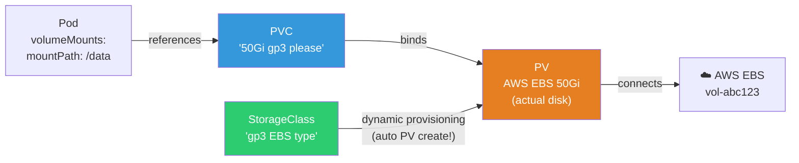
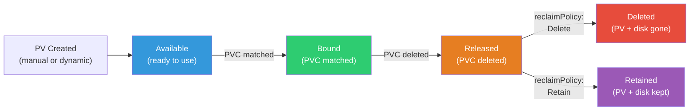
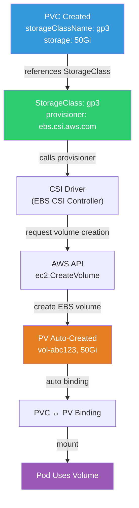
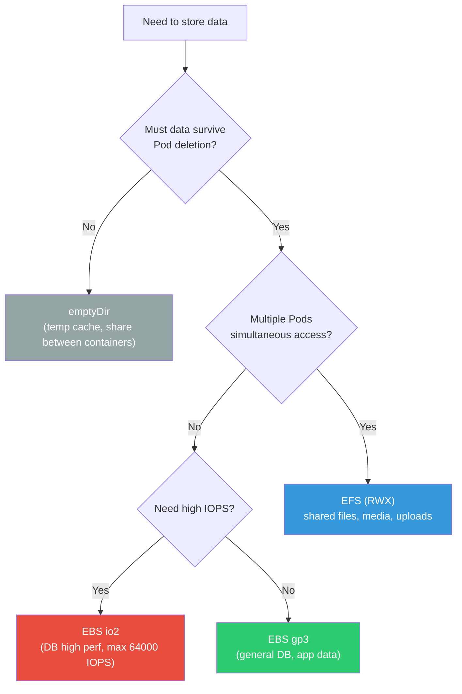

# CSI / PV / PVC / StorageClass

> When a Pod dies, the data inside dies too. DB data, uploaded files, logs — data needing permanent storage must go on **volumes**. K8s storage is a 3-layer structure: PV/PVC/StorageClass, extending the mount concepts from [Linux disks](../01-linux/07-disk) and [Docker volumes](../03-containers/02-docker-basics).

---

## 🎯 Why Do You Need to Know This?

```
Real-world K8s storage tasks:
• Attach permanent disk to DB (StatefulSet)               → PVC + StorageClass
• "PVC is Pending"                                        → StorageClass/capacity issue
• Choose EBS type (gp3 vs io2)                            → StorageClass config
• Share files across multiple Pods                        → ReadWriteMany (EFS)
• "Pod moved to different node, volume not working"       → AZ constraint
• Auto-scaling/snapshotting volumes                       → CSI features
```

---

## 🧠 Core Concepts

### Analogy: Apartment Parking Garage

* **PersistentVolume (PV)** = Actual parking space. Physical disk (EBS, EFS, etc)
* **PersistentVolumeClaim (PVC)** = Parking application. "Give me a 50Gi spot"
* **StorageClass** = Parking tier. "Regular lot (gp3)" vs "VIP lot (io2)"
* **CSI Driver** = Parking system. Connects AWS EBS, EFS to K8s

### 3-Layer Structure



```bash
# Static vs Dynamic provisioning:

# Static: Admin pre-creates PV, users request via PVC
# → PV creation → PVC creation → binding

# Dynamic (⭐ Production standard!):
# → PVC creation → StorageClass auto-creates PV + actual disk!
# → Admin just sets up StorageClass, done
```

### PV/PVC Binding Lifecycle



### StorageClass Dynamic Provisioning Flow



### Storage Type Selection Guide



---

## 🔍 Detailed Explanation — StorageClass

### What is StorageClass?

**Defines what type of storage to use**. When PVC references StorageClass, PV is auto-created.

```yaml
# AWS EBS gp3 StorageClass
apiVersion: storage.k8s.io/v1
kind: StorageClass
metadata:
  name: gp3
  annotations:
    storageclass.kubernetes.io/is-default-class: "true"   # ⭐ Default StorageClass
provisioner: ebs.csi.aws.com                              # CSI driver
parameters:
  type: gp3                    # EBS volume type (gp3 good cost-performance!)
  fsType: ext4                 # File system
  encrypted: "true"            # ⭐ Encryption (production required!)
  # iops: "3000"               # gp3 default 3000 IOPS (max 16000)
  # throughput: "125"           # gp3 default 125 MiB/s (max 1000)
reclaimPolicy: Delete          # Delete PV+EBS when PVC deleted
                               # Retain: Keep PV+EBS even if PVC deleted (data protection)
volumeBindingMode: WaitForFirstConsumer  # ⭐ Create volume in Pod's AZ
allowVolumeExpansion: true     # ⭐ Allow volume expansion

---
# High-performance StorageClass (for DB)
apiVersion: storage.k8s.io/v1
kind: StorageClass
metadata:
  name: io2-high-perf
provisioner: ebs.csi.aws.com
parameters:
  type: io2
  iops: "10000"
  fsType: ext4
  encrypted: "true"
reclaimPolicy: Retain          # DB volume, prevent accidental deletion!
volumeBindingMode: WaitForFirstConsumer
allowVolumeExpansion: true

---
# Shared file system (EFS)
apiVersion: storage.k8s.io/v1
kind: StorageClass
metadata:
  name: efs
provisioner: efs.csi.aws.com
parameters:
  provisioningMode: efs-ap
  fileSystemId: fs-abc123
  directoryPerms: "700"
```

```bash
# Check StorageClass
kubectl get storageclass
# NAME            PROVISIONER          RECLAIMPOLICY   VOLUMEBINDINGMODE       ALLOWVOLUMEEXPANSION
# gp3 (default)   ebs.csi.aws.com     Delete          WaitForFirstConsumer    true
# io2-high-perf   ebs.csi.aws.com     Retain          WaitForFirstConsumer    true
# efs             efs.csi.aws.com      Delete          Immediate              false

# Change default StorageClass
kubectl patch storageclass gp3 -p '{"metadata":{"annotations":{"storageclass.kubernetes.io/is-default-class":"true"}}}'
```

### Key Parameter Explanation

```bash
# reclaimPolicy — What to do with PV when PVC deleted?
# Delete: Delete PV + actual disk (default, dev/test)
# Retain: Keep PV + disk (⭐ production DB!)
#   → Accidental PVC deletion won't lose data!
#   → Manual cleanup needed

# volumeBindingMode — When to create volume?
# Immediate: Create at PVC creation (can't choose AZ!)
# WaitForFirstConsumer: Create after Pod scheduled (⭐ recommended!)
#   → Know Pod's AZ first, create volume in same AZ
#   → Prevent AZ mismatch!

# ⚠️ Not using WaitForFirstConsumer:
# 1. PVC created → EBS in ap-northeast-2a
# 2. Pod scheduled → ap-northeast-2c node
# 3. EBS different AZ → mount fails!
```

---

## 🔍 Detailed Explanation — PVC (PersistentVolumeClaim)

### Create PVC

```yaml
apiVersion: v1
kind: PersistentVolumeClaim
metadata:
  name: myapp-data
  namespace: production
spec:
  accessModes:
  - ReadWriteOnce                # One node read/write only
  storageClassName: gp3          # StorageClass reference
  resources:
    requests:
      storage: 50Gi              # Request size
```

### Access Mode (Access Modes)

| Mode | Abbr | Description | Storage |
|------|------|-------------|---------|
| ReadWriteOnce | RWO | One node read/write | EBS ⭐ |
| ReadOnlyMany | ROX | Multiple nodes read-only | EFS, NFS |
| ReadWriteMany | RWX | Multiple nodes read/write | EFS, NFS ⭐ |
| ReadWriteOncePod | RWOP | One Pod only (K8s 1.27+) | EBS |

```bash
# ⚠️ EBS (block storage) only supports RWO!
# → Can attach to one node only
# → StatefulSet reason: each Pod needs own PVC

# EFS (file system) supports RWX!
# → Multiple nodes/Pods simultaneous access
# → Good for shared files (uploads, media)

# Check PVC
kubectl get pvc -n production
# NAME          STATUS   VOLUME        CAPACITY   ACCESS MODES   STORAGECLASS   AGE
# myapp-data    Bound    pvc-abc123    50Gi       RWO            gp3            5d
#               ^^^^^                                             ^^^
#               Bound!                                           gp3 class

kubectl describe pvc myapp-data -n production
# Name:          myapp-data
# Status:        Bound
# Volume:        pvc-abc123
# Capacity:      50Gi
# Access Modes:  RWO
# StorageClass:  gp3
# Used By:       myapp-0     ← This Pod using it!
```

### Use PVC in Pod

```yaml
apiVersion: apps/v1
kind: Deployment
metadata:
  name: myapp
spec:
  replicas: 1                    # ⚠️ RWO PVC only replicas 1! (or use StatefulSet)
  selector:
    matchLabels:
      app: myapp
  template:
    metadata:
      labels:
        app: myapp
    spec:
      containers:
      - name: myapp
        image: myapp:v1.0
        volumeMounts:
        - name: data
          mountPath: /app/data    # Path inside Pod
        - name: uploads
          mountPath: /app/uploads
      volumes:
      - name: data
        persistentVolumeClaim:
          claimName: myapp-data   # PVC name reference
      - name: uploads
        persistentVolumeClaim:
          claimName: myapp-uploads
```

```bash
# Check volume in Pod
kubectl exec myapp-0 -- df -h /app/data
# Filesystem      Size  Used Avail Use% Mounted on
# /dev/nvme1n1    49G   200M  47G   1% /app/data
#                 ^^^                    ^^^^^^^^^^
#                 EBS volume!            mount path

kubectl exec myapp-0 -- ls -la /app/data/
# total 200
# drwxr-xr-x 3 1000 1000 4096 Mar 12 10:00 .
# -rw-r--r-- 1 1000 1000  100M Mar 12 10:00 database.db
```

---

## 🔍 Detailed Explanation — Volume Expansion

```bash
# Expand PVC size (⭐ shrink not possible!)

# 1. Edit PVC
kubectl patch pvc myapp-data -n production -p '{"spec":{"resources":{"requests":{"storage":"100Gi"}}}}'
# → 50Gi → 100Gi

# 2. Check status
kubectl get pvc myapp-data -n production
# NAME          STATUS   VOLUME        CAPACITY   STORAGECLASS
# myapp-data    Bound    pvc-abc123    50Gi       gp3    ← Still 50Gi?

kubectl describe pvc myapp-data | grep -A 3 Conditions
# Conditions:
#   Type                      Status
#   FileSystemResizePending   True     ← Waiting for file system expansion!

# 3. When Pod restarts (or automatic expansion):
kubectl delete pod myapp-0    # Pod restart
kubectl get pvc myapp-data
# CAPACITY: 100Gi    ← Expanded!

# ⚠️ Can't shrink!
# ⚠️ StorageClass needs allowVolumeExpansion: true!
# ⚠️ EBS can modify once per 6 hours (AWS limit)
```

---

## 🔍 Detailed Explanation — CSI (Container Storage Interface)

### What is CSI?

**Standard interface between K8s and storage systems**. Like CRI for container runtime, CSI is standard for storage.

```bash
# What CSI Driver does:
# 1. Create volume (EBS volume, EFS file system)
# 2. Attach volume (attach EBS to node)
# 3. Mount volume (mount filesystem to Pod)
# 4. Snapshot volume
# 5. Expand volume

# Install CSI Driver on EKS
# EBS CSI Driver
aws eks create-addon --cluster-name my-cluster --addon-name aws-ebs-csi-driver \
    --service-account-role-arn arn:aws:iam::123456:role/EBS_CSI_DriverRole

# EFS CSI Driver
aws eks create-addon --cluster-name my-cluster --addon-name aws-efs-csi-driver

# Check CSI Driver Pod (DaemonSet on all nodes)
kubectl get pods -n kube-system -l app=ebs-csi-controller
# NAME                              READY   STATUS
# ebs-csi-controller-abc123         6/6     Running
# ebs-csi-controller-def456         6/6     Running

kubectl get pods -n kube-system -l app=ebs-csi-node
# NAME                   READY   STATUS    NODE
# ebs-csi-node-abc       3/3     Running   node-1   ← All nodes!
# ebs-csi-node-def       3/3     Running   node-2

# Check CSI Driver
kubectl get csidrivers
# NAME               ATTACHREQUIRED   PODINFOONMOUNT   MODES
# ebs.csi.aws.com    true             false            Persistent
# efs.csi.aws.com    false            false            Persistent
```

---

## 🔍 Detailed Explanation — Volume Types Comparison

### emptyDir / hostPath / PVC

```yaml
# === emptyDir — Temporary volume (Pod lifetime) ===
# → Data deleted when Pod deleted!
# → Share files between containers in same Pod
volumes:
- name: temp
  emptyDir: {}                   # Disk storage
# Or
- name: cache
  emptyDir:
    medium: Memory               # Memory (tmpfs) storage → faster but small
    sizeLimit: 100Mi

# === hostPath — Node's file system ===
# → Survives node restart, but Pod gone → can't access!
# → DaemonSet accessing node logs/sockets (see ./03-statefulset-daemonset)
volumes:
- name: docker-sock
  hostPath:
    path: /var/run/containerd/containerd.sock
    type: Socket

# === PVC — Persistent volume (⭐ Production!) ===
# → Pod deleted → data persists
# → Pod moves to different node (same AZ) → volume follows
volumes:
- name: data
  persistentVolumeClaim:
    claimName: myapp-data
```

| Type | Lifetime | Different Node | Use Case |
|------|----------|---|---|
| **emptyDir** | Pod lifetime (deleted when Pod dies) | ❌ | Temp files, cache, container sharing |
| **hostPath** | Node lifetime | ❌ | DaemonSet (logs, sockets) |
| **PVC (EBS)** | Persistent (until PVC deleted) | △ Same AZ only | DB, app data ⭐ |
| **PVC (EFS)** | Persistent | ✅ Anywhere | Shared files, media ⭐ |

### EBS vs EFS Selection

```bash
# EBS (Elastic Block Store):
# ✅ High performance (IOPS, throughput)
# ✅ Low latency (block storage)
# ✅ gp3 cost-effective ($0.08/GB/month)
# ❌ One node only (RWO)
# ❌ Same AZ only
# → DB, single Pod apps

# EFS (Elastic File System):
# ✅ Multi-node/Pod simultaneous access (RWX)
# ✅ AZ-independent (region-wide)
# ✅ Auto-scaling (no capacity management!)
# ❌ Slower than EBS (file system)
# ❌ Expensive ($0.30/GB/month, ~4x EBS)
# → Shared files, media, CMS uploads

# Selection Guide:
# DB (PostgreSQL, MySQL)       → EBS gp3 (io2 for high perf)
# App data (single Pod)        → EBS gp3
# Shared files (multiple Pod)  → EFS
# Media/uploads                → EFS or S3 (cost optimal)
# Temp cache                   → emptyDir
```

---

## 🔍 Detailed Explanation — Volume Snapshots

```yaml
# VolumeSnapshotClass
apiVersion: snapshot.storage.k8s.io/v1
kind: VolumeSnapshotClass
metadata:
  name: ebs-snapshot
driver: ebs.csi.aws.com
deletionPolicy: Retain

---
# Create VolumeSnapshot
apiVersion: snapshot.storage.k8s.io/v1
kind: VolumeSnapshot
metadata:
  name: mydb-snapshot-20250312
spec:
  volumeSnapshotClassName: ebs-snapshot
  source:
    persistentVolumeClaimName: data-mysql-0    # Snapshot this PVC!

---
# Restore PVC from snapshot
apiVersion: v1
kind: PersistentVolumeClaim
metadata:
  name: data-mysql-restored
spec:
  accessModes: ["ReadWriteOnce"]
  storageClassName: gp3
  resources:
    requests:
      storage: 50Gi
  dataSource:
    name: mydb-snapshot-20250312    # Restore from this snapshot!
    kind: VolumeSnapshot
    apiGroup: snapshot.storage.k8s.io
```

```bash
# Check snapshots
kubectl get volumesnapshots
# NAME                      READYTOUSE   SOURCEPVC      AGE
# mydb-snapshot-20250312    true         data-mysql-0   1h

# → CronJob + VolumeSnapshot = auto backup!
# → (See lecture 16-backup-dr for Velero details!)
```

---

## 💻 Hands-On Examples

### Lab 1: Create PVC → Mount Pod → Verify Persistence

```bash
# 1. Create PVC
kubectl apply -f - << 'EOF'
apiVersion: v1
kind: PersistentVolumeClaim
metadata:
  name: test-pvc
spec:
  accessModes: ["ReadWriteOnce"]
  resources:
    requests:
      storage: 1Gi
EOF

# 2. Check PVC status
kubectl get pvc test-pvc
# STATUS: Pending    ← WaitForFirstConsumer, Pending until Pod created!

# 3. Create Pod using PVC
kubectl apply -f - << 'EOF'
apiVersion: v1
kind: Pod
metadata:
  name: pvc-test
spec:
  containers:
  - name: app
    image: busybox
    command: ["sh", "-c", "echo 'Hello Persistent!' > /data/test.txt && cat /data/test.txt && sleep 3600"]
    volumeMounts:
    - name: data
      mountPath: /data
  volumes:
  - name: data
    persistentVolumeClaim:
      claimName: test-pvc
EOF

# 4. Check PVC is Bound
kubectl get pvc test-pvc
# STATUS: Bound    ← PV auto-created and bound!

# Check PV auto-created
kubectl get pv
# NAME         CAPACITY   ACCESS MODES   RECLAIM POLICY   STATUS   CLAIM
# pvc-abc123   1Gi        RWO            Delete           Bound    default/test-pvc

# 5. Check data in Pod
kubectl logs pvc-test
# Hello Persistent!

kubectl exec pvc-test -- cat /data/test.txt
# Hello Persistent!

# 6. Delete Pod → data persists!
kubectl delete pod pvc-test

# Create new Pod with same PVC
kubectl apply -f - << 'EOF'
apiVersion: v1
kind: Pod
metadata:
  name: pvc-test-2
spec:
  containers:
  - name: app
    image: busybox
    command: ["sh", "-c", "cat /data/test.txt && sleep 3600"]
    volumeMounts:
    - name: data
      mountPath: /data
  volumes:
  - name: data
    persistentVolumeClaim:
      claimName: test-pvc
EOF

kubectl logs pvc-test-2
# Hello Persistent!    ← Previous Pod's data survives! ✅

# 7. Cleanup
kubectl delete pod pvc-test-2
kubectl delete pvc test-pvc
# → reclaimPolicy: Delete means PV + EBS deleted
```

### Lab 2: emptyDir Sidecar Pattern

```bash
# Main app writes logs, sidecar reads and forwards
kubectl apply -f - << 'EOF'
apiVersion: v1
kind: Pod
metadata:
  name: sidecar-vol
spec:
  containers:
  - name: app
    image: busybox
    command: ["sh", "-c", "while true; do echo $(date) >> /logs/app.log; sleep 5; done"]
    volumeMounts:
    - name: shared-logs
      mountPath: /logs

  - name: log-reader
    image: busybox
    command: ["sh", "-c", "tail -f /var/log/app/app.log"]
    volumeMounts:
    - name: shared-logs
      mountPath: /var/log/app         # Same volume, different path!
      readOnly: true

  volumes:
  - name: shared-logs
    emptyDir: {}                       # Shared between containers!
EOF

# Check
kubectl logs sidecar-vol -c log-reader -f
# Wed Mar 12 10:00:00 UTC 2025
# Wed Mar 12 10:00:05 UTC 2025
# → Sidecar reading app's logs!

# Cleanup
kubectl delete pod sidecar-vol
```

### Lab 3: Check StorageClass

```bash
# Current StorageClass list
kubectl get storageclass
# NAME            PROVISIONER          RECLAIMPOLICY   VOLUMEBINDINGMODE
# gp2 (default)   kubernetes.io/aws-ebs   Delete       WaitForFirstConsumer
# gp3             ebs.csi.aws.com        Delete       WaitForFirstConsumer

# StorageClass details
kubectl describe storageclass gp3

# Which StorageClass does PVC use?
kubectl get pvc -o custom-columns=NAME:.metadata.name,CLASS:.spec.storageClassName,STATUS:.status.phase

# Actual disk info (AWS EBS)
kubectl get pv pvc-abc123 -o jsonpath='{.spec.csi.volumeHandle}'
# vol-0abc123def456    ← AWS EBS volume ID!

# Check in AWS
aws ec2 describe-volumes --volume-ids vol-0abc123def456
# Size: 50, VolumeType: gp3, AvailabilityZone: ap-northeast-2a
```

---

## 🏢 In Production?

### Scenario 1: "PVC is Pending"

```bash
kubectl get pvc
# NAME         STATUS    STORAGECLASS   AGE
# myapp-data   Pending   gp3            10m    ← Pending for 10 minutes!

kubectl describe pvc myapp-data | tail -10
# Events:
#   Warning  ProvisioningFailed  ... failed to provision volume:
#   could not create volume in EC2: UnauthorizedOperation

# Solution by cause:

# 1. CSI Driver IAM permission insufficient
# → EBS CSI Driver's IAM Role needs ec2:CreateVolume, etc

# 2. StorageClass missing
kubectl get storageclass
# → Check storageClassName is correct

# 3. WaitForFirstConsumer + Pod not scheduling
# → Pod must schedule first for PV creation!
# → Check Pod status

# 4. AZ capacity exhausted (rare AWS case)
# → Move to different AZ

# 5. Account limit exceeded
aws service-quotas get-service-quota --service-code ebs --quota-code L-D18FCD1D
# → Check account's EBS total capacity limit
```

### Scenario 2: Production DB Volume Design

```bash
# PostgreSQL on K8s — Volume Design

# 1. StorageClass: Retain + encryption
# → reclaimPolicy: Retain (accidental PVC delete won't lose data!)
# → encrypted: "true"

# 2. PVC: volumeClaimTemplates (StatefulSet)
# → data-postgresql-0, data-postgresql-1, data-postgresql-2
# → Each Pod unique PVC (see ./03-statefulset-daemonset)

# 3. Volume type: gp3 or io2
# → General: gp3 (3000 IOPS, $0.08/GB/month)
# → High perf: io2 (max 64000 IOPS, $0.125/GB/month)

# 4. Monitoring
# → Monitor PVC usage (kubelet_volume_stats_used_bytes)
# → Alert at 80% → auto/manual expand

# 5. Backup
# → Daily VolumeSnapshot
# → Or pg_dump + S3 (CronJob)
# → (See lecture 16-backup-dr for details!)
```

### Scenario 3: EFS for Multi-Pod File Sharing

```bash
# "Multiple Pods need access to same files" (uploads, CMS, etc)

# EBS RWO → One node only → ❌
# EFS RWX → Multiple nodes/Pods → ✅

# EFS PVC
kubectl apply -f - << 'YAML'
apiVersion: v1
kind: PersistentVolumeClaim
metadata:
  name: shared-uploads
spec:
  accessModes: ["ReadWriteMany"]     # ← RWX!
  storageClassName: efs
  resources:
    requests:
      storage: 100Gi
YAML

# Deployment uses (replicas: 3 with same PVC!)
# volumes:
# - name: uploads
#   persistentVolumeClaim:
#     claimName: shared-uploads    ← 3 Pods share!

# ⚠️ EFS cost caution!
# EFS Standard: $0.30/GB/month (EBS gp3 ~4x!)
# EFS IA (Infrequent Access): $0.025/GB/month + access cost
# → Use Lifecycle Policy to move unused files to IA
```

---

## ⚠️ Common Mistakes

### 1. RWO PVC with replicas > 1 Deployment

```bash
# ❌ EBS PVC (RWO) with replicas: 3
# → Pods 2,3 on different nodes can't mount!

# ✅ EBS + single Pod: Deployment replicas: 1
# ✅ EBS + multiple Pods: StatefulSet (each own PVC)
# ✅ Shared needed: Use EFS (RWX)
```

### 2. reclaimPolicy: Delete for DB volume

```bash
# ❌ Delete DB PVC → EBS deleted → data lost forever!

# ✅ DB StorageClass: reclaimPolicy: Retain
# → PVC deleted, PV+EBS kept
# → Manual confirmation before deletion
```

### 3. volumeBindingMode: Immediate

```bash
# ❌ Immediate → PVC creation moment, create EBS → AZ mismatch!
# → Pod scheduled to ap-northeast-2c, EBS in 2a → fails!

# ✅ WaitForFirstConsumer → Pod scheduled first, then same AZ
```

### 4. Forget to install CSI Driver

```bash
# ❌ EKS without CSI → PVC Pending forever!
# → EKS 1.23+ deprecated in-tree EBS driver

# ✅ Install aws-ebs-csi-driver addon!
aws eks create-addon --cluster-name my-cluster --addon-name aws-ebs-csi-driver
```

### 5. Not monitoring volume capacity

```bash
# ❌ Disk 100% → App/DB crash!

# ✅ Monitor with kubelet metrics
# kubelet_volume_stats_used_bytes / kubelet_volume_stats_capacity_bytes
# → Alert at 80% → expand

# ✅ Manual check
kubectl exec myapp-0 -- df -h /data
# Filesystem  Size  Used  Avail  Use%
# /dev/nvme1  50G   40G   8G     83%    ← 83%! Need expand!
```

---

## 📝 Summary

### Storage Selection Guide

```
Single Pod DB          → EBS gp3 (RWO, PVC)
High-perf DB           → EBS io2 (RWO, high IOPS)
Multi-Pod shared files → EFS (RWX)
Temp cache/sharing     → emptyDir
DaemonSet log access   → hostPath
Snapshot/backup        → VolumeSnapshot
```

### Essential Commands

```bash
kubectl get pvc                          # PVC list
kubectl get pv                           # PV list
kubectl get storageclass                 # StorageClass list
kubectl describe pvc NAME                # PVC details (check events!)
kubectl get pv PV_NAME -o jsonpath='{.spec.csi.volumeHandle}'  # EBS ID
kubectl patch pvc NAME -p '{"spec":{"resources":{"requests":{"storage":"100Gi"}}}}'  # Expand
kubectl exec POD -- df -h /data          # Check usage
```

### 3-Layer Structure Quick Reference

```
Pod → PVC (request: "50Gi RWO gp3")
  → StorageClass (define: "gp3 EBS, encrypted, Delete")
    → PV (auto-create: EBS vol-abc123, 50Gi)
      → AWS EBS (actual disk)
```

---

## 🔗 Next Lecture

Next is **[08-healthcheck](./08-healthcheck)** — liveness / readiness / startup probe.

You learned Deployment's probes briefly. Now deep dive: "Is Pod alive?", "Is it ready for traffic?", "Still starting?" — all 3 health check questions.
