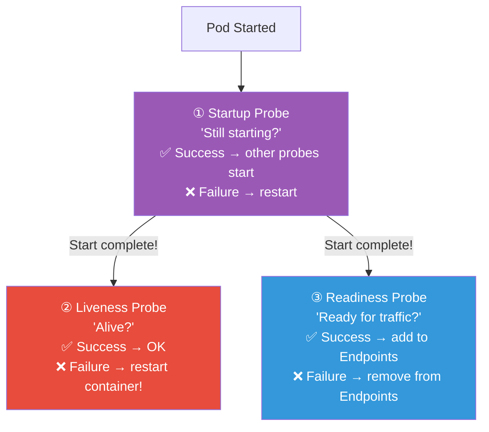
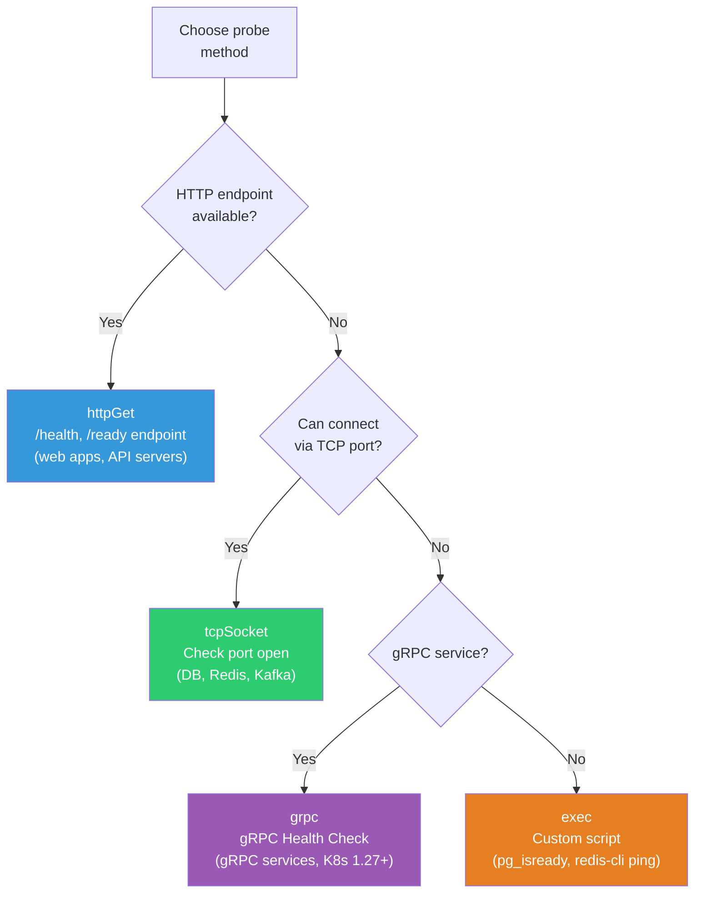
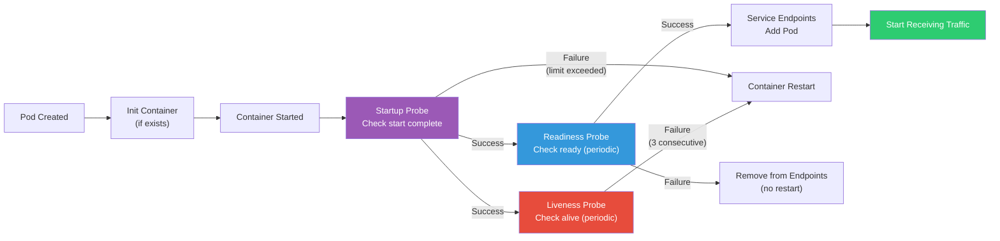
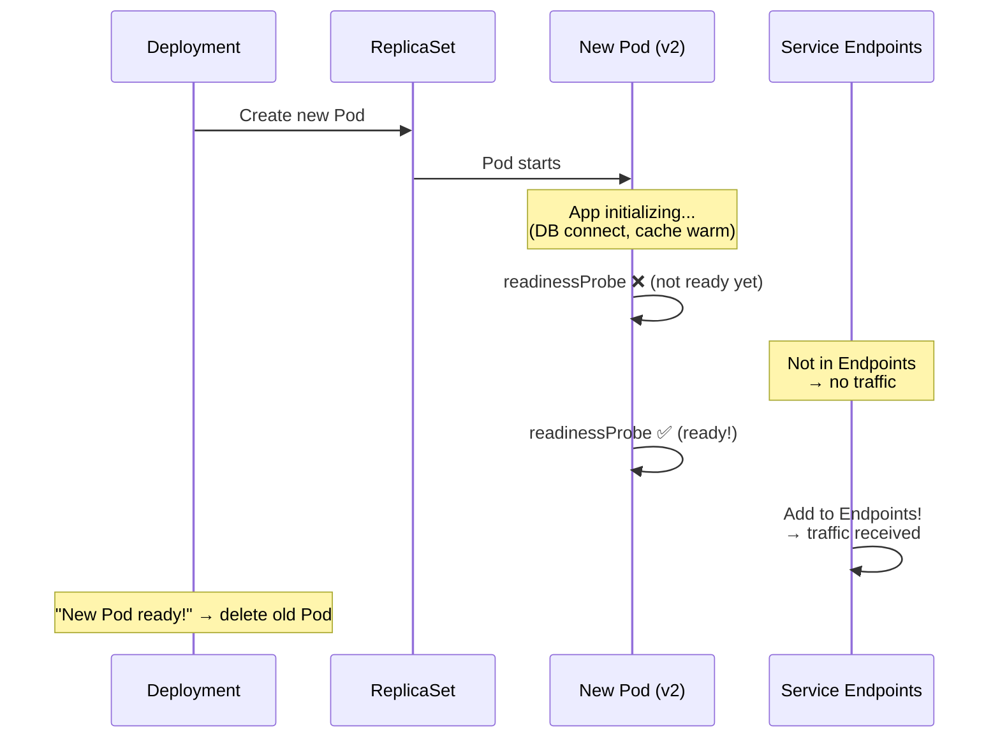

# liveness / readiness / startup probe

> Just because Pod is Running doesn't mean it's healthy. The app could be deadlocked, DB connection broken, or still initializing. K8s **probes** constantly check "Is this Pod really okay?" These 3 questions answer: Is it alive? Ready for traffic? Still starting up?

---

## 🎯 Why Do You Need to Know This?

```
Why probes matter:
• "Pod Running but no response"               → livenessProbe not set
• "502 errors during deployment"             → readinessProbe not set
• "App takes 60 seconds to start, keeps restarting" → startupProbe missing
• "Pod keeps restarting (CrashLoopBackOff)"  → Probe config error
• "Rolling update stalls"                    → readinessProbe failing
• Pod in Service Endpoints flickering        → readinessProbe unstable
```

---

## 🧠 Core Concepts

### 3 Probe Roles



| Probe | Question | Failure Action | Purpose |
|-------|----------|---|---|
| **Startup** | "Still starting?" | Container **restart** | Protect slow-start apps |
| **Liveness** | "Alive?" | Container **restart** | Detect deadlock/hang |
| **Readiness** | "Ready for traffic?" | Remove from Endpoints (no restart) | Control traffic |

### Analogy: Restaurant Staff Management

* **Startup Probe** = New employee's first day. "Getting uniform ready?" (wait for prep)
* **Liveness Probe** = Manager's hourly rounds. "Not collapsed, right?" (restart if down!)
* **Readiness Probe** = "Can take orders?" (busy = pause orders, free = resume)

### Probe Method Selection Guide



### Pod Lifecycle and Probe Execution Order



---

## 🔍 Detailed Explanation — 3 Probe Methods

### HTTP GET

```yaml
# Most common! Good for web apps/APIs
livenessProbe:
  httpGet:
    path: /health             # Health check endpoint
    port: 3000                # App port
    httpHeaders:              # Optional: custom headers
    - name: Accept
      value: application/json
  initialDelaySeconds: 10     # Wait 10 seconds after Pod start
  periodSeconds: 10           # Check every 10 seconds
  timeoutSeconds: 3           # Fail if no response in 3 seconds
  failureThreshold: 3         # Restart after 3 consecutive failures
  successThreshold: 1         # 1 success = OK (always 1 for liveness)

# HTTP 200~399 → success
# HTTP 400+ or timeout → failure
```

### TCP Socket

```yaml
# DB, Redis, etc. (non-HTTP services)
livenessProbe:
  tcpSocket:
    port: 5432                # Is port open?
  initialDelaySeconds: 15
  periodSeconds: 10

# Port connection success → success
# Port connection failure → failure
```

### Exec (Command Execution)

```yaml
# Custom script (flexible but overhead)
livenessProbe:
  exec:
    command:
    - sh
    - -c
    - "pg_isready -U postgres -d mydb"
  initialDelaySeconds: 30
  periodSeconds: 10

# Exit code 0 → success
# Exit code ≠ 0 → failure
```

### gRPC (K8s 1.27+)

```yaml
# gRPC services
livenessProbe:
  grpc:
    port: 50051
    service: "grpc.health.v1.Health"   # Optional
  initialDelaySeconds: 10
  periodSeconds: 10
```

---

## 🔍 Detailed Explanation — Liveness Probe

### "Alive?" — Failure Restarts Container!

```yaml
apiVersion: v1
kind: Pod
metadata:
  name: liveness-demo
spec:
  containers:
  - name: app
    image: myapp:v1.0
    ports:
    - containerPort: 3000
    livenessProbe:
      httpGet:
        path: /health
        port: 3000
      initialDelaySeconds: 15     # First check after 15 seconds
      periodSeconds: 10           # Every 10 seconds
      timeoutSeconds: 3           # 3-second timeout
      failureThreshold: 3         # Restart after 3 failures!
```

```bash
# Liveness Timeline:
# 0s:   Pod started
# 15s:  First liveness check → 200 OK ✅
# 25s:  Second check → 200 OK ✅
# ...
# 55s:  App deadlocked! → timeout ❌ (1/3)
# 65s:  check → timeout ❌ (2/3)
# 75s:  check → timeout ❌ (3/3) → Container restart!

# Check events
kubectl describe pod liveness-demo | grep -A 5 "Events"
# Warning  Unhealthy  Liveness probe failed: Get "http://10.0.1.50:3000/health": context deadline exceeded
# Normal   Killing    Container app failed liveness probe, will be restarted

# RESTARTS counter increases
kubectl get pods liveness-demo
# NAME            READY   STATUS    RESTARTS   AGE
# liveness-demo   1/1     Running   1          5m     ← RESTARTS: 0→1
```

### When to Use Liveness

```bash
# ✅ Apps that can deadlock
# → Process halts but stays alive (CPU 0%)
# → K8s sees "Running" but actually dead
# → Need liveness to detect and restart

# ✅ Apps with memory leaks getting slow
# → Restart clears memory

# ✅ Apps blocked by external dependency
# → DB connection lost = stuck

# ❌ DON'T check external dependencies in liveness!
# → DB dies → all Pods restart → thundering herd!
# → External checks belong in readiness!
```

---

## 🔍 Detailed Explanation — Readiness Probe

### "Ready for Traffic?" — Failure Removes from Endpoints!

```yaml
readinessProbe:
  httpGet:
    path: /ready              # Different from liveness!
    port: 3000
  initialDelaySeconds: 5      # Fast check (start right after)
  periodSeconds: 5            # Frequent (5 seconds)
  timeoutSeconds: 2
  failureThreshold: 3
  successThreshold: 2         # ⭐ Need 2 consecutive successes (stable)
```

```bash
# Readiness behavior:
# 1. Pod starts → readinessProbe runs
# 2. Success → Pod added to Service Endpoints → traffic starts!
# 3. Failure → Removed from Endpoints → no traffic (no restart!)
# 4. Recover → Re-added to Endpoints

# Watch Endpoints change
kubectl get endpoints myapp-service -w
# NAME            ENDPOINTS                           AGE
# myapp-service   10.0.1.50:8080,10.0.1.51:8080      5d
# → Pod readiness fails:
# myapp-service   10.0.1.50:8080                      5d    ← 51 gone!
# → Pod readiness recovers:
# myapp-service   10.0.1.50:8080,10.0.1.51:8080      5d    ← 51 back!

# Check Pod Ready status
kubectl get pods
# NAME        READY   STATUS
# myapp-abc   1/1     Running    ← Ready!
# myapp-def   0/1     Running    ← Not Ready! (readiness failing)
#             ^^^
#             0/1 = readiness failure
#             → Service doesn't send traffic!
```

### Why Readiness Matters — Rolling Update



```bash
# Without readinessProbe:
# 1. New Pod created → immediately in Endpoints
# 2. App still initializing → traffic arrives → 502/503! 💥
# 3. Old Pod deleted
# 4. → Downtime!

# With readinessProbe:
# 1. New Pod created → readinessProbe runs
# 2. App fully initialized → probe succeeds
# 3. Added to Endpoints → traffic starts
# 4. Then old Pod deleted
# 5. → Zero-downtime deploy! ✅
```

---

## 🔍 Detailed Explanation — Startup Probe

### "Still Starting?" — Protects Slow-Start Apps

```yaml
startupProbe:
  httpGet:
    path: /health
    port: 3000
  failureThreshold: 30        # Allow 30 failures
  periodSeconds: 10           # Check every 10 seconds
  # → 30 × 10 = 300 seconds (5 minutes) to start!
  # Once success → liveness/readiness start
  # If not success in 300 seconds → restart
```

```bash
# Why startup probe needed?

# ❌ Without startup, liveness only:
# initialDelaySeconds: 10, failureThreshold: 3, periodSeconds: 10
# → 10 + 3×10 = 40 seconds max to start!
# → Java/Spring Boot takes 60s? → Infinite restarts! (CrashLoopBackOff)

# Solution 1: Big initialDelaySeconds (❌ not recommended!)
# initialDelaySeconds: 120
# → Even if app starts in 5s, waits 120s for liveness!
# → Deadlock during those 120s undetected!

# ✅ Solution 2: Startup Probe!
startupProbe:
  failureThreshold: 30     # 5 minutes wait
  periodSeconds: 10
livenessProbe:
  periodSeconds: 10        # Startup handles delay!
  # No initialDelaySeconds! startup replaces it!

# Timeline:
# 0s:   Pod starts → startupProbe begins
# 10s:  startupProbe ❌ (still initializing)
# 20s:  startupProbe ❌
# ...
# 60s:  startupProbe ✅ (app ready!)
#       → liveness + readiness start!
# 70s:  livenessProbe ✅
#       readinessProbe ✅ → add to Endpoints!
```

---

## 🔍 Detailed Explanation — /health vs /ready Endpoint Design

### Health Check Endpoint Design (★ Production Key!)

```bash
# ⭐ /health (liveness) — "I'm alive"
# → Check only self! No external dependencies ❌
# → Process healthy? Not deadlocked?

# ⭐ /ready (readiness) — "I can handle traffic"
# → Include external deps! DB connect, cache, essential services
# → Failure OK (just pause traffic, no restart)
```

```javascript
// Node.js example
const express = require('express');
const app = express();

let isReady = false;

// DB connection state
let dbConnected = false;
const db = require('./db');
db.connect().then(() => {
  dbConnected = true;
  isReady = true;
});

// Liveness: process alive only!
app.get('/health', (req, res) => {
  // ⭐ Check self only! DB/Redis/external NO!
  res.status(200).json({ status: 'alive' });
});

// Readiness: can handle traffic?
app.get('/ready', async (req, res) => {
  // ⭐ Check external dependencies!
  const checks = {
    db: dbConnected,
    cache: await redis.ping().then(() => true).catch(() => false),
  };

  const allReady = Object.values(checks).every(v => v);

  if (allReady) {
    res.status(200).json({ status: 'ready', checks });
  } else {
    res.status(503).json({ status: 'not ready', checks });
    // 503 → readiness fails → remove from Endpoints
    // But no restart!
  }
});
```

```bash
# ⚠️ Most common mistake: DB check in liveness!

# ❌ Bad pattern:
# /health checks DB → DB dies → all Pods restart!
# → 100 Pods restart simultaneously
# → DB recovers → 100 Pods connect at once
# → Connection storm (thundering herd)! → DB dies again!

# ✅ Good pattern:
# /health → self only (always 200, deadlock detection only)
# /ready → DB + Redis + essential services
# → DB dies: readiness fails → traffic paused
# → Apps stay alive, DB recovers → traffic resumes!
```

---

## 🔍 Detailed Explanation — Production Probe Config Guide

### Per-Language Recommended Settings

```yaml
# === Node.js/Express ===
containers:
- name: node-app
  image: myapp:v1.0
  ports:
  - containerPort: 3000
  startupProbe:
    httpGet:
      path: /health
      port: 3000
    failureThreshold: 10
    periodSeconds: 5               # 50 seconds startup window
  livenessProbe:
    httpGet:
      path: /health
      port: 3000
    periodSeconds: 10
    timeoutSeconds: 3
    failureThreshold: 3
  readinessProbe:
    httpGet:
      path: /ready
      port: 3000
    periodSeconds: 5
    timeoutSeconds: 2
    failureThreshold: 3
    successThreshold: 2

# === Java/Spring Boot (slow startup!) ===
containers:
- name: spring-app
  image: myapp:v1.0
  ports:
  - containerPort: 8080
  startupProbe:
    httpGet:
      path: /actuator/health/liveness     # Spring Actuator!
      port: 8080
    failureThreshold: 30
    periodSeconds: 10              # 300 seconds (5 min) startup!
  livenessProbe:
    httpGet:
      path: /actuator/health/liveness
      port: 8080
    periodSeconds: 15
    timeoutSeconds: 5
    failureThreshold: 3
  readinessProbe:
    httpGet:
      path: /actuator/health/readiness
      port: 8080
    periodSeconds: 10
    timeoutSeconds: 5
    failureThreshold: 3
    successThreshold: 1

# === PostgreSQL (TCP + exec) ===
containers:
- name: postgres
  image: postgres:16
  ports:
  - containerPort: 5432
  startupProbe:
    exec:
      command: ["pg_isready", "-U", "postgres"]
    failureThreshold: 15
    periodSeconds: 10
  livenessProbe:
    exec:
      command: ["pg_isready", "-U", "postgres"]
    periodSeconds: 10
    failureThreshold: 3
  readinessProbe:
    exec:
      command: ["pg_isready", "-U", "postgres"]
    periodSeconds: 5
    failureThreshold: 3

# === Redis (TCP) ===
containers:
- name: redis
  image: redis:7
  ports:
  - containerPort: 6379
  livenessProbe:
    tcpSocket:
      port: 6379
    periodSeconds: 10
    failureThreshold: 3
  readinessProbe:
    exec:
      command: ["redis-cli", "ping"]
    periodSeconds: 5
    failureThreshold: 3

# === Nginx (static server) ===
containers:
- name: nginx
  image: nginx:alpine
  ports:
  - containerPort: 80
  livenessProbe:
    httpGet:
      path: /
      port: 80
    periodSeconds: 15
    failureThreshold: 3
  readinessProbe:
    httpGet:
      path: /
      port: 80
    periodSeconds: 5
    failureThreshold: 3
```

### Tuning Guide

```bash
# === initialDelaySeconds ===
# If using startup → 0 (not needed! startup handles delay!)
# If not using startup → more than app startup time

# === periodSeconds ===
# liveness: 10~30 seconds (too frequent = overhead)
# readiness: 5~10 seconds (detect quickly)

# === timeoutSeconds ===
# HTTP: 2~5 seconds (normal response <100ms)
# exec: 5~10 seconds (script execution time)
# ⚠️ Account for GC pause if applicable!

# === failureThreshold ===
# liveness: 3 (3 consecutive failures → restart)
# readiness: 2~3 (remove quickly from Endpoints)
# startup: app startup time / periodSeconds (generous!)

# === successThreshold ===
# liveness: always 1 (1 success = alive)
# readiness: 1~2 (2 more stable, prevents flickering)

# === Total detection time ===
# liveness detection: periodSeconds × failureThreshold
# Example: 10s × 3 = 30s until restart
# → App can be down 30s before restart!

# readiness detection: periodSeconds × failureThreshold
# Example: 5s × 3 = 15s until Endpoints removal
# → 15s of 503 responses possible!
```

---

## 💻 Hands-On Examples

### Lab 1: Watch Liveness Probe Restart

```bash
# Pod with intentional liveness failure
kubectl apply -f - << 'EOF'
apiVersion: v1
kind: Pod
metadata:
  name: liveness-fail
spec:
  containers:
  - name: app
    image: busybox
    command:
    - sh
    - -c
    - |
      # /tmp/healthy exists → 200, else 500
      echo "healthy" > /tmp/healthy
      # Delete after 30s (liveness fails!)
      (sleep 30 && rm /tmp/healthy) &
      while true; do
        if [ -f /tmp/healthy ]; then
          echo -e "HTTP/1.1 200 OK\r\n\r\nOK" | nc -l -p 8080 -q 1
        else
          echo -e "HTTP/1.1 500 Error\r\n\r\nFAIL" | nc -l -p 8080 -q 1
        fi
      done
    ports:
    - containerPort: 8080
    livenessProbe:
      httpGet:
        path: /
        port: 8080
      initialDelaySeconds: 5
      periodSeconds: 5
      failureThreshold: 3
EOF

# Watch
kubectl get pods liveness-fail -w
# NAME            READY   STATUS    RESTARTS   AGE
# liveness-fail   1/1     Running   0          10s     ← Normal
# liveness-fail   1/1     Running   0          30s     ← File deleted
# liveness-fail   1/1     Running   0          45s     ← Failure count...
# liveness-fail   1/1     Running   1          50s     ← RESTARTS: 0→1!

kubectl describe pod liveness-fail | grep -A 3 "Events" | tail -5
# Warning  Unhealthy  Liveness probe failed: HTTP probe failed with statuscode: 500
# Normal   Killing    Container app failed liveness probe, will be restarted

# Cleanup
kubectl delete pod liveness-fail
```

### Lab 2: Readiness Probe Controls Traffic

```bash
# 1. Create Deployment + Service
kubectl apply -f - << 'EOF'
apiVersion: apps/v1
kind: Deployment
metadata:
  name: readiness-demo
spec:
  replicas: 2
  selector:
    matchLabels:
      app: readiness-demo
  template:
    metadata:
      labels:
        app: readiness-demo
    spec:
      containers:
      - name: nginx
        image: nginx:alpine
        ports:
        - containerPort: 80
        readinessProbe:
          httpGet:
            path: /
            port: 80
          periodSeconds: 5
          failureThreshold: 2
---
apiVersion: v1
kind: Service
metadata:
  name: readiness-svc
spec:
  selector:
    app: readiness-demo
  ports:
  - port: 80
EOF

# 2. Check Endpoints (both Pods)
kubectl get endpoints readiness-svc
# ENDPOINTS: 10.0.1.50:80,10.0.1.51:80    ← 2 ✅

# 3. Break readiness (delete default page)
POD=$(kubectl get pods -l app=readiness-demo -o name | head -1)
kubectl exec $POD -- rm /usr/share/nginx/html/index.html

# 4. Watch Endpoints
sleep 15
kubectl get endpoints readiness-svc
# ENDPOINTS: 10.0.1.51:80                  ← 1 only! (deleted Pod gone)

kubectl get pods -l app=readiness-demo
# NAME                   READY   STATUS
# readiness-demo-abc     0/1     Running    ← READY 0/1! (readiness failing)
# readiness-demo-def     1/1     Running    ← Normal

# ⭐ No restart! RESTARTS: 0!
# → readiness removes traffic, no restart!

# 5. Restore (recreate file)
kubectl exec $POD -- sh -c "echo 'ok' > /usr/share/nginx/html/index.html"
sleep 15
kubectl get endpoints readiness-svc
# ENDPOINTS: 10.0.1.50:80,10.0.1.51:80    ← 2 restored! ✅

# Cleanup
kubectl delete deployment readiness-demo
kubectl delete svc readiness-svc
```

### Lab 3: Startup Probe Protects Slow App

```bash
# App takes 30 seconds to start
kubectl apply -f - << 'EOF'
apiVersion: v1
kind: Pod
metadata:
  name: slow-start
spec:
  containers:
  - name: app
    image: busybox
    command:
    - sh
    - -c
    - |
      echo "Starting... (30 seconds)"
      sleep 30
      echo "Ready!"
      while true; do
        echo -e "HTTP/1.1 200 OK\r\n\r\nOK" | nc -l -p 8080 -q 1
      done
    ports:
    - containerPort: 8080
    startupProbe:
      httpGet:
        path: /
        port: 8080
      failureThreshold: 10        # 10 × 5s = 50s wait
      periodSeconds: 5
    livenessProbe:
      httpGet:
        path: /
        port: 8080
      periodSeconds: 10
      failureThreshold: 3
EOF

# Watch
kubectl get pods slow-start -w
# slow-start   0/1   Running   0    5s      ← startup checking
# slow-start   0/1   Running   0    10s     ← startup fails (starting...)
# slow-start   0/1   Running   0    20s     ← startup fails (still...)
# slow-start   0/1   Running   0    30s     ← startup fails (almost!)
# slow-start   1/1   Running   0    35s     ← startup success! → liveness starts

kubectl describe pod slow-start | grep -B 1 "Started"
# Normal  Started  Started container app

# ⭐ Without startup, liveness only would restart many times!
# → Startup prevents premature restart!

# Cleanup
kubectl delete pod slow-start
```

---

## 🏢 In Production?

### Scenario 1: Zero-Downtime Rolling Update

```yaml
# "502 errors during deployment" → readinessProbe + preStop!

# Fix:
spec:
  containers:
  - name: app
    image: myapp:v2.0

    # 1. readinessProbe — wait until ready before traffic
    readinessProbe:
      httpGet:
        path: /ready
        port: 3000
      periodSeconds: 5
      failureThreshold: 3
      successThreshold: 2          # 2 successes = stable

    # 2. preStop — give old connections time to finish
    lifecycle:
      preStop:
        exec:
          command: ["sh", "-c", "sleep 10"]
          # → Removed from Endpoints, wait 10s
          # → Existing requests complete!

  terminationGracePeriodSeconds: 40  # preStop(10) + app shutdown(30)

# Deploy order:
# 1. New Pod created → readinessProbe starts
# 2. readinessProbe 2 successes → Endpoints added → traffic!
# 3. Old Pod → remove from Endpoints → preStop(sleep 10) → SIGTERM → shutdown
# 4. → Existing requests complete, new Pod handles traffic → no 502!
```

### Scenario 2: "Pod CrashLoopBackOff, Is It The Probe?"

```bash
# Distinguish probe-caused restarts from app crashes!

# 1. Check Exit Code
kubectl get pod myapp-abc -o jsonpath='{.status.containerStatuses[0].lastState.terminated.exitCode}'
# 137 → OOM Kill (not probe! memory issue)
# 1   → App error (not probe! code issue)
# 143 → SIGTERM → liveness restart possible!

# 2. Check Events
kubectl describe pod myapp-abc | grep -i "liveness\|killing\|unhealthy"
# Warning  Unhealthy  Liveness probe failed: ...
# Normal   Killing    Container failed liveness probe, will be restarted
# → Probe-caused restart! ✅

# 3. Temporarily disable probe to confirm
# Remove liveness, redeploy → no restart = probe problem!

# Common causes:
# a. /health endpoint missing or typo
# b. Port mismatch (app:3000, probe:8080)
# c. Timeout too short (GC pause > timeout)
# d. No startup probe for slow app
# e. Liveness checking external (DB down = all Pods restart!)
```

### Scenario 3: Monitor Probe Health

```bash
# Prometheus metrics (see lecture 08-observability)

# Related metrics:
# kube_pod_container_status_restarts_total     → restart count (liveness failures)
# kube_pod_status_ready                        → Ready status
# kube_endpoint_address_available              → Pod count in Endpoints

# Alert examples:
# - Pod restarts 3+ times in 5 min → liveness issue
# - Ready Pod ratio <50% → readiness problem
# - Endpoints empty → all Pods readiness failing!
```

---

## ⚠️ Common Mistakes

### 1. Check External Dependencies in Liveness

```yaml
# ❌ DB down → all Pods restart! → thundering herd!
livenessProbe:
  exec:
    command: ["sh", "-c", "curl -f http://db:5432 && curl -f http://redis:6379"]

# ✅ Liveness self-only! External in readiness!
livenessProbe:
  httpGet:
    path: /health            # self-check only
    port: 3000
readinessProbe:
  httpGet:
    path: /ready             # DB, Redis included
    port: 3000
```

### 2. No Startup Probe for Slow App

```yaml
# ❌ Java takes 90 seconds, no startup:
livenessProbe:
  initialDelaySeconds: 120    # 120 seconds unprotected!
# → Deadlock during 120s goes undetected!

# ✅ Use startup probe!
startupProbe:
  failureThreshold: 30
  periodSeconds: 10           # 300s startup wait
livenessProbe:
  periodSeconds: 10           # Start after startup succeeds!
```

### 3. No Readiness Probe

```bash
# ❌ Without readiness:
# → Pod added to Endpoints immediately → 502 during startup!
# → Rolling update has downtime!

# ✅ Always readiness for web apps!
# → Especially for zero-downtime rolling updates!
```

### 4. Probe Timeout Too Short

```yaml
# ❌ 1 second timeout → GC pause failure!
livenessProbe:
  timeoutSeconds: 1           # JVM GC pause > 1s = failure!

# ✅ More generous
livenessProbe:
  timeoutSeconds: 5           # Account for GC
  # Java: min 3~5s
  # Node.js: 2~3s
```

### 5. Same Endpoint for Liveness and Readiness

```yaml
# ❌ Same endpoint → can't distinguish
livenessProbe:
  httpGet: { path: /health, port: 3000 }
readinessProbe:
  httpGet: { path: /health, port: 3000 }
# → DB dies → /health fails → liveness fails → all Pods restart!

# ✅ Separate!
livenessProbe:
  httpGet: { path: /health, port: 3000 }  # self only
readinessProbe:
  httpGet: { path: /ready, port: 3000 }   # DB included
```

---

## 📝 Summary

### Probe Selection Guide

```
All web apps         → liveness + readiness (required!)
Slow-start apps      → startup + liveness + readiness
DB/Redis             → liveness(TCP/exec) + readiness(exec)
Sidecar/agent        → liveness only (no traffic)
```

### Endpoint Design

```
/health (liveness) → self-check only! No external deps ❌
                     always 200 (deadlock detection only)

/ready (readiness) → external deps included! DB, Redis, required services
                     return 503 if not ready
```

### Quick Parameter Reference

```yaml
startupProbe:                    # Startup wait
  failureThreshold: 30           # Max wait = 30 × 10 = 300s
  periodSeconds: 10

livenessProbe:                   # Alive check
  initialDelaySeconds: 0         # 0 if using startup!
  periodSeconds: 10
  timeoutSeconds: 3~5
  failureThreshold: 3

readinessProbe:                  # Ready check
  initialDelaySeconds: 0
  periodSeconds: 5               # Quick!
  timeoutSeconds: 2~3
  failureThreshold: 3
  successThreshold: 1~2
```

### Essential Commands

```bash
kubectl describe pod NAME | grep -A 10 "Liveness\|Readiness\|Startup"
kubectl get pods                        # READY 0/1 = readiness failure
kubectl get endpoints SERVICE           # Missing Pods = readiness failing
kubectl get events --field-selector reason=Unhealthy
kubectl logs NAME --previous            # Pre-restart logs
```

---

## 🔗 Next Lecture

Next is **[09-operations](./09-operations)** — Rolling Update / Canary / Blue-Green deployment strategies.

Probes work correctly as prerequisite. Now advanced deployment strategies! Canary, Blue-Green deployments, traffic splitting—all requiring healthy probes.
