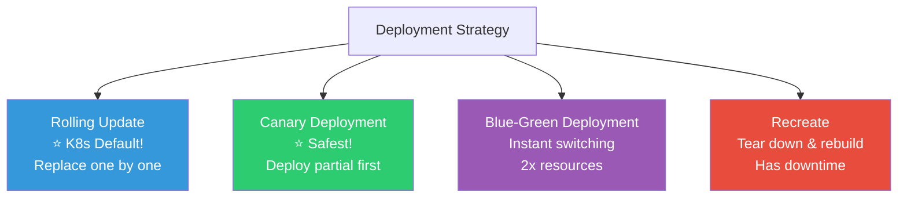
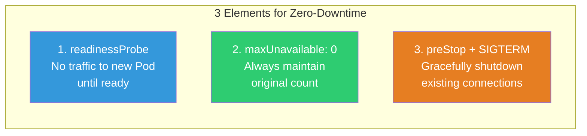
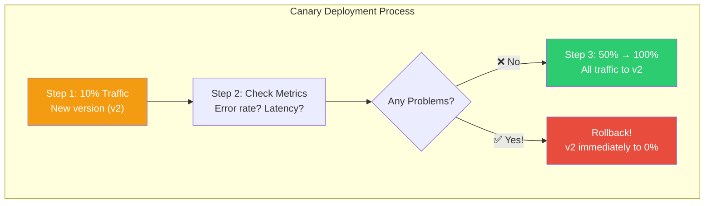
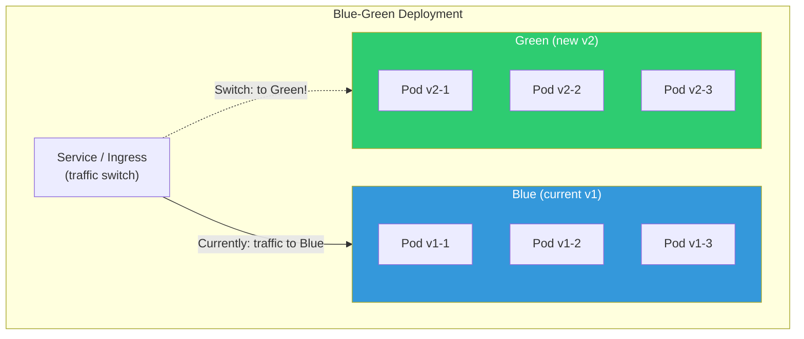

# Rolling Update / Canary / Blue-Green Deployment Strategies

> Deploying code is easy, but deploying **safely without downtime** is hard. "We deployed and got an outage" — deployment strategies prevent this. Beyond [Deployment's Rolling Update](./02-pod-deployment), we'll learn advanced strategies like Canary/Blue-Green and how they combine with [probes](./08-healthcheck) and [Ingress](./05-service-ingress).

---

## 🎯 Why Learn This?

```
Moments when you need deployment strategies in real work:
• "What if there's an error during deployment?"               → Rollback strategy
• "I want to deploy only 10% first"                           → Canary deployment
• "I need instant switching capability"                       → Blue-Green
• "Auto-proceed after checking metrics post-deployment"       → Progressive Delivery
• "In finance/healthcare, deployment failure = incident"      → Safe deployment essential
```

---

## 🧠 Core Concepts

### Deployment Strategy Comparison



| Strategy | Downtime | Resources | Rollback Speed | Risk | Complexity |
|----------|----------|-----------|---------|------|--------|
| **Rolling Update** | None | Extra | Medium (undo) | Medium | ⭐ Low |
| **Canary** | None | Extra | Fast (0% ratio) | ⭐ Lowest | Medium |
| **Blue-Green** | None | 2x! | ⭐ Instant | Low | Medium |
| **Recreate** | ⚠️ Yes | Same | Slow | High | Low |

---

## 🔍 Detailed Explanation — Rolling Update (K8s Default)

We covered the basics in [Deployment lecture](./02-pod-deployment). Here we focus on **real-world tuning**.

### Safe Rolling Update Configuration

```yaml
apiVersion: apps/v1
kind: Deployment
metadata:
  name: myapp
spec:
  replicas: 4
  strategy:
    type: RollingUpdate
    rollingUpdate:
      maxSurge: 1              # Max 5 pods (4+1)
      maxUnavailable: 0        # ⭐ Always maintain 4! (0 = safest)

  minReadySeconds: 10          # ⭐ Wait 10s stabilization after Ready
  revisionHistoryLimit: 10     # Keep 10 old ReplicaSets (for rollback)
  progressDeadlineSeconds: 600 # Fail if not done in 10 minutes

  template:
    spec:
      containers:
      - name: myapp
        image: myapp:v2.0
        readinessProbe:        # ⭐ Essential! Impossible without it!
          httpGet:
            path: /ready
            port: 3000
          periodSeconds: 5
          failureThreshold: 3
          successThreshold: 2

        lifecycle:
          preStop:             # ⭐ Wait before termination (finish connections)
            exec:
              command: ["sh", "-c", "sleep 15"]

      terminationGracePeriodSeconds: 45  # preStop(15) + app shutdown(30)
```

### 3 Elements Guaranteeing Zero-Downtime in Rolling Update



```bash
# === Graceful Shutdown Details ===
# (Reference ../02-networking/06-load-balancing Graceful Shutdown!)

# Pod termination order:
# 1. K8s marks Pod as Terminating
# 2. Pod removed from Endpoints (no new requests)
# 3. preStop executes (sleep 15 → wait for ongoing requests)
# 4. SIGTERM sent → app gracefully shuts down
# 5. After terminationGracePeriodSeconds → SIGKILL (force kill)

# ⚠️ Issue: Endpoints removal and preStop start "simultaneously"!
# → kube-proxy needs seconds to update iptables
# → During that gap, requests might reach old Pod!
# → preStop sleep covers this gap!

# Without preStop:
# 1. Pod Terminating → immediate SIGTERM
# 2. kube-proxy hasn't updated yet → traffic hits dying Pod!
# 3. → 502/503 errors!

# With preStop:
# 1. Pod Terminating → preStop(sleep 15) executes
# 2. kube-proxy updates iptables during that time
# 3. After 15s SIGTERM → app shuts down safely
# 4. → No errors! ✅
```

### Rolling Update Monitoring

```bash
# Check deployment status
kubectl rollout status deployment/myapp
# Waiting for deployment "myapp" rollout to finish: 1 out of 4 new replicas have been updated...
# Waiting for deployment "myapp" rollout to finish: 2 out of 4 new replicas have been updated...
# Waiting for deployment "myapp" rollout to finish: 3 out of 4 new replicas have been updated...
# deployment "myapp" successfully rolled out

# If not progressing? (progressDeadlineSeconds exceeded)
kubectl rollout status deployment/myapp
# error: deployment "myapp" exceeded its progress deadline
# → New Pod's readinessProbe failing!

# Detailed check
kubectl get pods -l app=myapp
# myapp-new-abc   0/1   Running   0   5m    ← Ready 0/1! readiness failed!
# myapp-old-def   1/1   Running   0   1d    ← Old Pod healthy

kubectl describe pod myapp-new-abc | tail -10
# Warning  Unhealthy  Readiness probe failed: connection refused
# → App not responding to /ready!

# Rollback immediately!
kubectl rollout undo deployment/myapp
```

---

## 🔍 Detailed Explanation — Canary Deployment (★ Safest Strategy!)

### What is Canary?

Deploy new version to **only some traffic first**, verify it's working, then expand to all.



### Method 1: K8s Native (2 Deployments)

```yaml
# v1 Deployment (90%)
apiVersion: apps/v1
kind: Deployment
metadata:
  name: myapp-stable
spec:
  replicas: 9                    # 9 = 90%
  selector:
    matchLabels:
      app: myapp
      track: stable
  template:
    metadata:
      labels:
        app: myapp               # ⭐ Same app label!
        track: stable
        version: v1.0
    spec:
      containers:
      - name: myapp
        image: myapp:v1.0

---
# v2 Deployment (10%)
apiVersion: apps/v1
kind: Deployment
metadata:
  name: myapp-canary
spec:
  replicas: 1                    # 1 = 10%
  selector:
    matchLabels:
      app: myapp
      track: canary
  template:
    metadata:
      labels:
        app: myapp               # ⭐ Same app label!
        track: canary
        version: v2.0
    spec:
      containers:
      - name: myapp
        image: myapp:v2.0

---
# Service — traffic to all app=myapp Pods!
apiVersion: v1
kind: Service
metadata:
  name: myapp-service
spec:
  selector:
    app: myapp                   # ⭐ Match both stable + canary!
  ports:
  - port: 80
    targetPort: 3000
```

```bash
# How it works:
# Service distributes traffic to all Pods (10 total)
# → v1(9) + v2(1) → ~10% to v2!

# Canary progression:
kubectl scale deployment myapp-canary --replicas=3    # 30%
kubectl scale deployment myapp-stable --replicas=7
# If no issues:
kubectl scale deployment myapp-canary --replicas=5    # 50%
kubectl scale deployment myapp-stable --replicas=5
# Final:
kubectl scale deployment myapp-canary --replicas=10   # 100%
kubectl delete deployment myapp-stable                 # Delete old

# Rollback (instant!):
kubectl scale deployment myapp-canary --replicas=0    # Canary to 0!
kubectl scale deployment myapp-stable --replicas=10   # Restore old

# ⚠️ Limitations:
# → Traffic ratio depends on Pod count (might not be exactly 10%)
# → Manual operation needed
# → Can't make metric-based decisions
```

### Method 2: Nginx Ingress Canary (★ More Precise!)

```yaml
# Stable Ingress (main)
apiVersion: networking.k8s.io/v1
kind: Ingress
metadata:
  name: myapp-stable
spec:
  ingressClassName: nginx
  rules:
  - host: api.example.com
    http:
      paths:
      - path: /
        pathType: Prefix
        backend:
          service:
            name: myapp-stable-svc
            port:
              number: 80

---
# Canary Ingress (with weight!)
apiVersion: networking.k8s.io/v1
kind: Ingress
metadata:
  name: myapp-canary
  annotations:
    nginx.ingress.kubernetes.io/canary: "true"           # ⭐ Canary mode!
    nginx.ingress.kubernetes.io/canary-weight: "10"      # ⭐ 10% traffic!
spec:
  ingressClassName: nginx
  rules:
  - host: api.example.com
    http:
      paths:
      - path: /
        pathType: Prefix
        backend:
          service:
            name: myapp-canary-svc
            port:
              number: 80
```

```bash
# Change weight (10% → 30% → 50% → 100%)
kubectl annotate ingress myapp-canary \
    nginx.ingress.kubernetes.io/canary-weight="30" --overwrite

# Header-based canary (specific users only!)
# annotations:
#   nginx.ingress.kubernetes.io/canary: "true"
#   nginx.ingress.kubernetes.io/canary-by-header: "X-Canary"
#   nginx.ingress.kubernetes.io/canary-by-header-value: "true"

# Test:
curl -H "X-Canary: true" https://api.example.com    # → v2!
curl https://api.example.com                          # → v1!

# Advantages:
# ✅ Precise ratio control (independent of Pod count!)
# ✅ Header/cookie-based canary (test specific users/teams)
# ✅ Also works with Gateway API (weight field)
```

### Method 3: Argo Rollouts (★ Production Recommended!)

```yaml
# Argo Rollouts: Progressive Delivery specialist tool
# → Auto canary based on metrics!

apiVersion: argoproj.io/v1alpha1
kind: Rollout                          # Instead of Deployment!
metadata:
  name: myapp
spec:
  replicas: 10
  selector:
    matchLabels:
      app: myapp
  template:
    metadata:
      labels:
        app: myapp
    spec:
      containers:
      - name: myapp
        image: myapp:v2.0
        ports:
        - containerPort: 3000

  strategy:
    canary:
      # Auto-proceed step by step!
      steps:
      - setWeight: 10                  # Step 1: 10%
      - pause: { duration: 5m }       # Observe 5 minutes
      - setWeight: 30                  # Step 2: 30%
      - pause: { duration: 5m }       # Observe 5 minutes
      - setWeight: 50                  # Step 3: 50%
      - pause: { duration: 10m }      # Observe 10 minutes
      - setWeight: 100                 # Step 4: 100% (complete!)

      # Auto-rollback (metric-based!) — see 08-observability for Prometheus integration
      # analysis:
      #   templates:
      #   - templateName: success-rate
      #   args:
      #   - name: service-name
      #     value: myapp

      canaryService: myapp-canary-svc
      stableService: myapp-stable-svc

      trafficRouting:
        nginx:
          stableIngress: myapp-stable
          additionalIngressAnnotations:
            canary-by-header: X-Canary
```

```bash
# Install Argo Rollouts
kubectl create namespace argo-rollouts
kubectl apply -n argo-rollouts -f https://github.com/argoproj/argo-rollouts/releases/latest/download/install.yaml

# Argo Rollouts CLI
kubectl argo rollouts get rollout myapp -w
# Name:            myapp
# Status:          ॥ Paused
# Strategy:        Canary
#   Step:          1/8
#   SetWeight:     10
#   ActualWeight:  10
# Images:          myapp:v1.0 (stable)
#                  myapp:v2.0 (canary)

# Manual proceed (from pause)
kubectl argo rollouts promote myapp
# → Next step!

# Instant rollback
kubectl argo rollouts abort myapp
# → Canary halted, restore to stable!

# Complete immediately (to 100%)
kubectl argo rollouts promote myapp --full
```

---

## 🔍 Detailed Explanation — Blue-Green Deployment

### What is Blue-Green?

Run **two environments simultaneously (Blue=current, Green=new)**, then **instantly switch** traffic.



### Blue-Green Implementation in K8s

```yaml
# Blue Deployment (current)
apiVersion: apps/v1
kind: Deployment
metadata:
  name: myapp-blue
spec:
  replicas: 3
  selector:
    matchLabels:
      app: myapp
      version: blue
  template:
    metadata:
      labels:
        app: myapp
        version: blue
    spec:
      containers:
      - name: myapp
        image: myapp:v1.0

---
# Green Deployment (new version)
apiVersion: apps/v1
kind: Deployment
metadata:
  name: myapp-green
spec:
  replicas: 3
  selector:
    matchLabels:
      app: myapp
      version: green
  template:
    metadata:
      labels:
        app: myapp
        version: green
    spec:
      containers:
      - name: myapp
        image: myapp:v2.0

---
# Service — selector switches between Blue and Green!
apiVersion: v1
kind: Service
metadata:
  name: myapp-service
spec:
  selector:
    app: myapp
    version: blue              # ⭐ Currently points to Blue!
  ports:
  - port: 80
    targetPort: 3000
```

```bash
# === Blue-Green Switching Process ===

# 1. Deploy Green (v2) while Blue (v1) serving traffic
kubectl apply -f deployment-green.yaml
kubectl rollout status deployment/myapp-green
# → All 3 Green Pods are Ready!

# 2. Health check Green (verify before switch!)
kubectl port-forward deployment/myapp-green 8080:3000
curl http://localhost:8080/health    # Verify healthy!

# 3. Switch traffic (⭐ One line for instant switch!)
kubectl patch service myapp-service -p '{"spec":{"selector":{"version":"green"}}}'
# → All traffic instantly goes to Green!

# 4. Verify
kubectl get endpoints myapp-service
# ENDPOINTS: 10.0.1.60:3000,10.0.1.61:3000,10.0.1.62:3000
# → Green Pod IPs!

# 5. Keep Blue (for rollback)
# → Don't delete immediately!

# 6. Any problems? Instant rollback!
kubectl patch service myapp-service -p '{"spec":{"selector":{"version":"blue"}}}'
# → Back to Blue in 1 second!

# 7. Delete Blue after stable confirmation
kubectl delete deployment myapp-blue

# Next deployment:
# Green becomes current, new Blue = new version → alternate!
```

### Blue-Green Pros and Cons

```bash
# ✅ Advantages:
# → Instant switch (Service selector change = 1 second!)
# → Instant rollback (just revert selector)
# → Can thoroughly test Green before switching
# → Simpler than canary

# ❌ Disadvantages:
# → 2x resources! (Blue + Green simultaneous)
# → Switch is "all or nothing" (no gradual)
# → DB schema changes need both-side compatibility
# → Session/cache issues (Blue sessions don't exist in Green)

# Real-world recommendation:
# → Plenty of resources + instant switch needed → Blue-Green
# → Limited resources + gradual validation → Canary
# → Simple → Rolling Update
```

### Blue-Green with Argo Rollouts

```yaml
apiVersion: argoproj.io/v1alpha1
kind: Rollout
metadata:
  name: myapp
spec:
  replicas: 3
  selector:
    matchLabels:
      app: myapp
  template:
    metadata:
      labels:
        app: myapp
    spec:
      containers:
      - name: myapp
        image: myapp:v2.0

  strategy:
    blueGreen:
      activeService: myapp-active        # Service receiving traffic
      previewService: myapp-preview      # Preview (testing only)
      autoPromotionEnabled: false        # Manual approval before switch
      prePromotionAnalysis:              # Auto test before switching!
        templates:
        - templateName: smoke-test
      scaleDownDelaySeconds: 300         # Keep old version 5min after switch (rollback)
```

```bash
# Check status
kubectl argo rollouts get rollout myapp
# Name:    myapp
# Status:  ॥ Paused
# Images:  myapp:v1.0 (active)
#          myapp:v2.0 (preview)

# Test with preview service
curl http://myapp-preview.production.svc.cluster.local
# → Verify v2 response!

# Approve switch!
kubectl argo rollouts promote myapp
# → active switches to v2!

# Rollback
kubectl argo rollouts undo myapp
```

---

## 🔍 Detailed Explanation — Deployment Safety Mechanisms

### Deployment progressDeadlineSeconds

```bash
# Fail if deployment doesn't complete within time
# → Prevents infinite wait if Pod readiness fails!

kubectl rollout status deployment/myapp
# error: deployment "myapp" exceeded its progress deadline

# Verify
kubectl get deployment myapp -o jsonpath='{.status.conditions[?(@.type=="Progressing")].message}'
# ReplicaSet "myapp-abc" has timed out progressing

# Old Pods stay alive! (if maxUnavailable: 0)
# → Service unaffected, can diagnose without impact
# → Fix then redeploy, or rollout undo
```

### PodDisruptionBudget (PDB)

```yaml
# "At least N Pods must always be alive"
# → Service maintained even during node drain, upgrades

apiVersion: policy/v1
kind: PodDisruptionBudget
metadata:
  name: myapp-pdb
spec:
  minAvailable: 2              # Min 2 always alive!
  # Or:
  # maxUnavailable: 1          # Max 1 can be disrupted simultaneously
  selector:
    matchLabels:
      app: myapp
```

```bash
# Check PDB
kubectl get pdb
# NAME        MIN AVAILABLE   MAX UNAVAILABLE   ALLOWED DISRUPTIONS   AGE
# myapp-pdb   2               N/A               1                     5d
#                                                ^
#                                                Currently 1 can be disrupted

# With PDB:
# kubectl drain node-1 → if myapp would drop below 2, drain stops!
# → Waits for Pod to start on other node

# ⚠️ Without PDB:
# kubectl drain → all node Pods deleted at once!
# → 3 myapp Pods simultaneously gone → service down!
```

---

## 💻 Hands-On Examples

### Exercise 1: Safe Rolling Update

```bash
# 1. Create Deployment (v1)
kubectl apply -f - << 'EOF'
apiVersion: apps/v1
kind: Deployment
metadata:
  name: safe-deploy
spec:
  replicas: 4
  strategy:
    rollingUpdate:
      maxSurge: 1
      maxUnavailable: 0
  minReadySeconds: 5
  selector:
    matchLabels:
      app: safe-deploy
  template:
    metadata:
      labels:
        app: safe-deploy
    spec:
      containers:
      - name: app
        image: nginx:1.24
        readinessProbe:
          httpGet:
            path: /
            port: 80
          periodSeconds: 3
          failureThreshold: 2
          successThreshold: 2
        lifecycle:
          preStop:
            exec:
              command: ["sh", "-c", "sleep 10"]
      terminationGracePeriodSeconds: 30
EOF

kubectl rollout status deployment/safe-deploy

# 2. Start observing
kubectl get pods -l app=safe-deploy -w &

# 3. Update (v1 → v2)
kubectl set image deployment/safe-deploy app=nginx:1.25

# Observe:
# safe-deploy-new-1   0/1   Pending       ← New Pod created
# safe-deploy-new-1   0/1   ContainerCreating
# safe-deploy-new-1   0/1   Running       ← Started, readiness checking
# safe-deploy-new-1   1/1   Running       ← Ready! (2 consecutive successes)
# (5 second wait — minReadySeconds)
# safe-deploy-old-4   1/1   Terminating   ← Only then old Pod deleted!
# → Always maintains 4+!

# 4. Verify
kubectl rollout status deployment/safe-deploy
# deployment "safe-deploy" successfully rolled out

kill %1 2>/dev/null

# 5. Cleanup
kubectl delete deployment safe-deploy
```

### Exercise 2: Native Canary Deployment

```bash
# 1. Stable (v1) — 9 replicas
kubectl create deployment myapp-stable --image=hashicorp/http-echo --replicas=9 -- -text="v1"
kubectl expose deployment myapp-stable --port=80 --target-port=5678 --name=myapp-svc \
    --selector=app=myapp --dry-run=client -o yaml | kubectl apply -f -

# Add common label to Pods
kubectl label pods -l app=myapp-stable app=myapp --overwrite

# 2. Canary (v2) — 1 replica
kubectl create deployment myapp-canary --image=hashicorp/http-echo --replicas=1 -- -text="v2"
kubectl label pods -l app=myapp-canary app=myapp --overwrite

# 3. Verify Service selects both
kubectl get endpoints myapp-svc
# Should show 10 Pod IPs (9 + 1)

# 4. Test traffic distribution
for i in $(seq 1 20); do
    kubectl run test-$i --image=busybox --rm -it --restart=Never -- \
        wget -qO- http://myapp-svc 2>/dev/null
done 2>/dev/null | sort | uniq -c
# 18 v1    ← ~90%
#  2 v2    ← ~10%

# 5. Expand canary
kubectl scale deployment myapp-canary --replicas=5
kubectl scale deployment myapp-stable --replicas=5

# 6. Rollback (if issues)
kubectl scale deployment myapp-canary --replicas=0

# 7. Cleanup
kubectl delete deployment myapp-stable myapp-canary
kubectl delete svc myapp-svc
```

### Exercise 3: Blue-Green Switch

```bash
# 1. Blue (v1)
kubectl create deployment myapp-blue --image=hashicorp/http-echo -- -text="BLUE-v1"
kubectl expose deployment myapp-blue --port=80 --target-port=5678

# Service (points to Blue)
kubectl apply -f - << 'EOF'
apiVersion: v1
kind: Service
metadata:
  name: myapp-active
spec:
  selector:
    app: myapp-blue
  ports:
  - port: 80
    targetPort: 5678
EOF

# 2. Deploy Green (v2) (Service still Blue)
kubectl create deployment myapp-green --image=hashicorp/http-echo -- -text="GREEN-v2"
kubectl rollout status deployment/myapp-green

# 3. Test Green
kubectl port-forward deployment/myapp-green 9090:5678 &
curl http://localhost:9090
# GREEN-v2    ← Green healthy!
kill %1 2>/dev/null

# 4. Switch traffic! (Blue → Green)
kubectl patch service myapp-active -p '{"spec":{"selector":{"app":"myapp-green"}}}'

# Verify
kubectl run test --image=busybox --rm -it --restart=Never -- wget -qO- http://myapp-active
# GREEN-v2    ← Switched to Green! ✅

# 5. Rollback (if issues)
kubectl patch service myapp-active -p '{"spec":{"selector":{"app":"myapp-blue"}}}'
# → Back to Blue in 1 second!

# 6. Cleanup
kubectl delete deployment myapp-blue myapp-green
kubectl delete svc myapp-active myapp-blue
```

---

## 🏢 In Real Work

### Scenario 1: Deployment Strategy Selection Guide

```bash
# Question 1: Allow downtime?
# Yes → Recreate (simple)
# No → Rolling / Canary / Blue-Green

# Question 2: Need gradual validation?
# Yes → Canary ⭐
# No → Rolling (sufficiently safe)

# Question 3: Need instant rollback?
# Yes → Blue-Green (1 second rollback)
# No → Rolling (rollout undo, tens of seconds)

# Question 4: Automation/metric-based deployment?
# Yes → Argo Rollouts ⭐ (Progressive Delivery)
# No → K8s native

# Real-world recommendation:
# Most services → Rolling Update (simple, sufficient!)
# Critical services → Canary + Argo Rollouts (metric-based)
# Instant switch needed → Blue-Green
# CI/CD pipeline → See 07-cicd for ArgoCD + Argo Rollouts!
```

### Scenario 2: Deployment with DB Schema Changes

```bash
# "v2 needs a new DB column"

# ❌ Bad approach:
# 1. Deploy v2 (needs new column) → Rolling Update with v1 and v2 coexisting
# 2. v1 doesn't know new column → errors!

# ✅ Good approach: Expand-Migrate-Contract pattern
# Phase 1 (Expand): Add new column (nullable, default)
#   → Both v1 and v2 work!
# Phase 2 (Migrate): Migrate existing data
# Phase 3: Deploy v2 (Rolling Update possible!)
#   → v1 and v2 coexist without issues
# Phase 4 (Contract): Remove v1 completely, add NOT NULL

# Or Blue-Green:
# → Prepare v2 + new schema while v1 serves traffic
# → Switch traffic at once
# → But rollback still needs schema compatibility!
```

### Scenario 3: Auto-Canary with Argo Rollouts

```bash
# "Auto-rollback if error rate exceeds 1%"

# 1. Define AnalysisTemplate (Prometheus query)
# apiVersion: argoproj.io/v1alpha1
# kind: AnalysisTemplate
# metadata:
#   name: success-rate
# spec:
#   metrics:
#   - name: success-rate
#     interval: 1m
#     successCondition: result[0] >= 0.99    # 99% = success
#     failureLimit: 3                         # 3 failures = rollback!
#     provider:
#       prometheus:
#         address: http://prometheus:9090
#         query: |
#           sum(rate(http_requests_total{status=~"2..",service="myapp"}[5m]))
#           /
#           sum(rate(http_requests_total{service="myapp"}[5m]))

# 2. Connect analysis to Rollout
# strategy:
#   canary:
#     analysis:
#       templates:
#       - templateName: success-rate
#     steps:
#     - setWeight: 10
#     - pause: { duration: 5m }
#     - setWeight: 50
#     - pause: { duration: 5m }

# Flow:
# 10% deployment → 5min metric watch → 99%+ then 50%
# → Below 99% auto-rollback! 🎉
# → No manual intervention needed!
```

---

## ⚠️ Common Mistakes

### 1. Rolling Update Without readinessProbe

```bash
# ❌ Without readiness:
# New Pod instantly added to Endpoints → traffic to unprepared Pod → 502!

# ✅ readinessProbe required!
# → Especially successThreshold: 2 (stable 2 successes before traffic)
```

### 2. Deployment Without preStop

```bash
# ❌ Without preStop:
# Pod Terminating immediately → SIGTERM → kube-proxy not updated yet → 502!

# ✅ preStop: sleep 10~15 → wait for kube-proxy update
```

### 3. Canary Without Metric Verification

```bash
# ❌ Deploy canary 10% then "looks fine" → straight to 100%!
# → Error rate was 5% but didn't check!

# ✅ After canary always verify:
# - Error rate (5xx ratio)
# - Response time (P50, P95, P99)
# - CPU/memory usage
# - Business metrics (order success rate etc)
# → Argo Rollouts + Prometheus for automation!
```

### 4. Blue-Green: Delete Old Version Immediately

```bash
# ❌ Switch to Green, delete Blue immediately
# → Can't rollback if issues found!

# ✅ Keep at least 15~30 minutes before deleting
# → Monitor confirms no issues, then cleanup
```

### 5. Node Drain Without PDB

```bash
# ❌ PDB-less drain → all Pods on that node deleted!
kubectl drain node-1
# → 3 myapp Pods simultaneously gone → downtime!

# ✅ Set PDB!
# minAvailable: 2 → during drain, min 2 stay
# → 1 at a time, others start elsewhere before next eviction
```

---

## 📝 Summary

### Deployment Strategy Selection

```
Simple service       → Rolling Update (K8s default)
Critical service     → Canary + Argo Rollouts ⭐
Instant switch       → Blue-Green
DB schema changes    → Expand-Migrate-Contract + Rolling
Downtime acceptable  → Recreate
```

### Zero-Downtime Deployment Checklist

```
✅ readinessProbe configured (successThreshold: 2)
✅ maxUnavailable: 0 (always maintain original count)
✅ preStop: sleep 10~15 (Graceful Shutdown)
✅ terminationGracePeriodSeconds sufficient
✅ minReadySeconds: 5~10 (stabilization wait)
✅ progressDeadlineSeconds configured (prevent infinite wait)
✅ PodDisruptionBudget configured
✅ Rollout history prepared for rollback
```

### Essential Commands

```bash
# Rolling Update
kubectl set image deployment/NAME CONTAINER=IMAGE
kubectl rollout status deployment/NAME
kubectl rollout undo deployment/NAME
kubectl rollout history deployment/NAME

# Canary (Ingress)
kubectl annotate ingress NAME-canary nginx.ingress.kubernetes.io/canary-weight="20" --overwrite

# Blue-Green
kubectl patch service NAME -p '{"spec":{"selector":{"version":"green"}}}'

# Argo Rollouts
kubectl argo rollouts get rollout NAME -w
kubectl argo rollouts promote NAME
kubectl argo rollouts abort NAME

# PDB
kubectl get pdb
```

---

## 🔗 Next Lecture

Next is **[10-autoscaling](./10-autoscaling)** — HPA / VPA / Cluster Autoscaler / KEDA.

You've learned deployment strategies, now comes **auto-scaling**. When traffic increases 10x, automatically add Pods. At night with no traffic, reduce Pods automatically. This is K8s auto-scaling in full.
