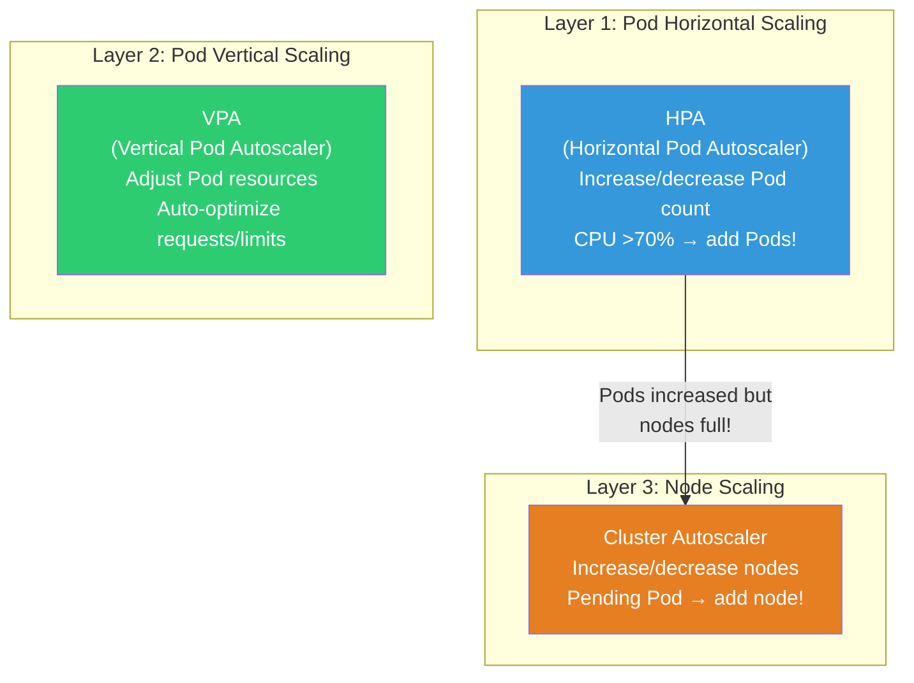
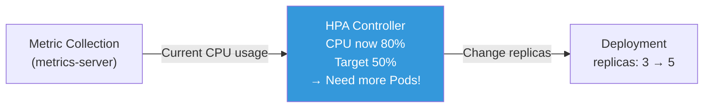
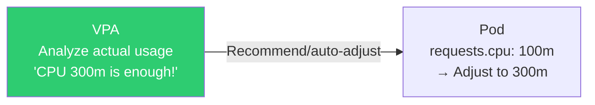
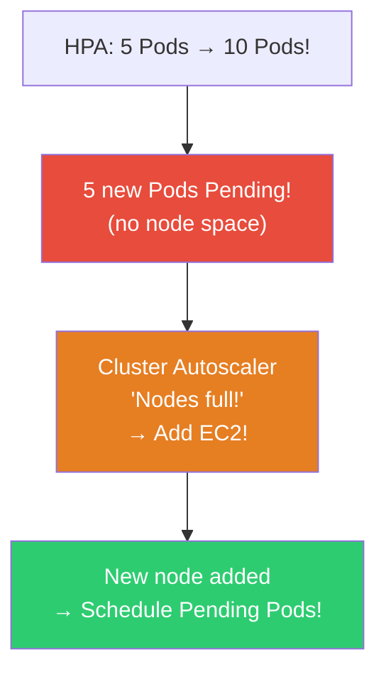
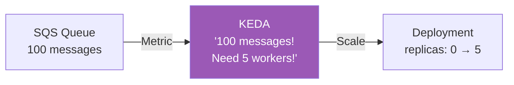

# HPA / VPA / Cluster Autoscaler / KEDA

> If traffic increases 10x but you only have 3 Pods? If you're running 10 Pods at night with no traffic? **Auto-scaling** automatically adjusts Pod count and node count based on load to optimize performance and cost. It's a natural extension of [resource management](./02-pod-deployment) and [deployment strategies](./09-operations).

---

## 🎯 Why Learn This?

```
When you need auto-scaling in real work:
• Traffic surge → auto add Pods (HPA)           → Service stability
• Traffic drop → auto reduce Pods                → Cost savings
• Pods increased but nodes full → add nodes     → Cluster Autoscaler
• Pod has CPU 100m but uses 300m → adjust      → VPA
• Scale by queue length (not just CPU)          → KEDA
• "Servers running 10 all night, useless" → waste → Auto-reduce
```

---

## 🧠 Core Concepts

### Auto-scaling 3 Layers



| Scaler | What | How | Trigger |
|--------|------|-----|---------|
| **HPA** | Pod **count** | Horizontal scale/reduce | CPU, memory, custom metrics |
| **VPA** | Pod **resources** | Adjust requests/limits | Actual usage analysis |
| **Cluster Autoscaler** | **Node** count | Add/remove EC2 | Pending Pod |
| **KEDA** | Pod count (events) | 0↔N scaling | Queue length, cron, HTTP, etc. |

---

## 🔍 Detailed Explanation — HPA (Horizontal Pod Autoscaler)

### What is HPA?

**Automatically increase/decrease Pod count** — the most basic autoscaler.



### HPA Basics (CPU-Based)

```yaml
apiVersion: autoscaling/v2
kind: HorizontalPodAutoscaler
metadata:
  name: myapp-hpa
  namespace: production
spec:
  scaleTargetRef:
    apiVersion: apps/v1
    kind: Deployment
    name: myapp                     # ⭐ Adjust replicas of this Deployment

  minReplicas: 2                    # Min Pod count (don't reduce below this!)
  maxReplicas: 20                   # Max Pod count (prevent runaway costs)

  metrics:
  - type: Resource
    resource:
      name: cpu
      target:
        type: Utilization
        averageUtilization: 60      # ⭐ Maintain 60% CPU usage
        # Above 60% → add Pods
        # Below 60% → reduce Pods

  behavior:                         # Control scaling speed
    scaleUp:
      stabilizationWindowSeconds: 60   # Watch 60s before scaling up
      policies:
      - type: Pods
        value: 4                    # Add max 4 Pods at once
        periodSeconds: 60
      - type: Percent
        value: 100                  # Or double current count
        periodSeconds: 60
      selectPolicy: Max             # Choose larger amount!

    scaleDown:
      stabilizationWindowSeconds: 300  # ⭐ Watch 5min before scale down (cautious!)
      policies:
      - type: Pods
        value: 1                    # Remove 1 Pod at a time (safe!)
        periodSeconds: 60
```

```bash
# ⚠️ HPA prerequisites:
# 1. metrics-server must be installed! (kubectl top must work)
# 2. Pod must have resources.requests configured!
#    → Without requests, HPA can't calculate utilization!

# Verify metrics-server
kubectl top nodes
# NAME     CPU(cores)   CPU%   MEMORY(bytes)   MEMORY%
# node-1   250m         6%     1500Mi          20%
# → If this works, metrics-server is running!

# Not working? Install:
kubectl apply -f https://github.com/kubernetes-sigs/metrics-server/releases/latest/download/components.yaml

# Quick HPA creation
kubectl autoscale deployment myapp --cpu-percent=60 --min=2 --max=20

# Or YAML
kubectl apply -f hpa.yaml
```

```bash
# HPA status check (⭐ most important command!)
kubectl get hpa
# NAME        REFERENCE          TARGETS   MINPODS   MAXPODS   REPLICAS   AGE
# myapp-hpa   Deployment/myapp   35%/60%   2         20        3          5d
#                                ^^^^^^^^
#                                Current 35% / Target 60%
#                                → Below target, can scale down

# TARGETS shows <unknown>/60% ?
# → metrics-server issue or resources.requests not set!

# HPA details
kubectl describe hpa myapp-hpa
# Metrics:
#   "cpu" resource utilization (target 60%):  35% / 60%
# Min replicas:   2
# Max replicas:   20
# Deployment pods: 3 current / 3 desired
# Conditions:
#   AbleToScale     True    ReadyForNewScale
#   ScalingActive   True    ValidMetricFound
#   ScalingLimited  False   DesiredWithinRange
# Events:
#   Normal  SuccessfulRescale  New size: 3; reason: cpu resource utilization above target

# HPA scaling formula:
# Desired Pods = ceil(Current Pods × (Current Metric / Target Metric))
# Example: 3 pods, CPU 80%, target 60%
# → ceil(3 × 80/60) = ceil(4.0) = 4 pods!
# → Scale from 3 to 4!
```

### HPA Advanced — Multiple Metrics + Custom Metrics

```yaml
apiVersion: autoscaling/v2
kind: HorizontalPodAutoscaler
metadata:
  name: myapp-hpa-advanced
spec:
  scaleTargetRef:
    apiVersion: apps/v1
    kind: Deployment
    name: myapp
  minReplicas: 2
  maxReplicas: 50

  metrics:
  # 1. CPU utilization
  - type: Resource
    resource:
      name: cpu
      target:
        type: Utilization
        averageUtilization: 60

  # 2. Memory utilization
  - type: Resource
    resource:
      name: memory
      target:
        type: Utilization
        averageUtilization: 70

  # 3. Custom metric (from Prometheus)
  # → Requires Prometheus Adapter! (see 08-observability)
  - type: Pods
    pods:
      metric:
        name: http_requests_per_second    # Requests per second!
      target:
        type: AverageValue
        averageValue: "100"               # Target 100 RPS per Pod

  # 4. External metric (SQS queue length, etc)
  - type: External
    external:
      metric:
        name: sqs_queue_length
        selector:
          matchLabels:
            queue: orders
      target:
        type: AverageValue
        averageValue: "5"                 # Target 5 messages per Pod

  # Multiple metrics: pick highest Pod count needed!
  # CPU → 5 pods needed, RPS → 8 pods needed → scale to 8!
```

### HPA Load Testing

```bash
# Observe HPA with load test!

# 1. Create Deployment + HPA
kubectl apply -f - << 'EOF'
apiVersion: apps/v1
kind: Deployment
metadata:
  name: load-test
spec:
  replicas: 1
  selector:
    matchLabels:
      app: load-test
  template:
    metadata:
      labels:
        app: load-test
    spec:
      containers:
      - name: app
        image: registry.k8s.io/hpa-example
        ports:
        - containerPort: 80
        resources:
          requests:
            cpu: "200m"          # ⭐ Required for HPA!
          limits:
            cpu: "500m"
---
apiVersion: v1
kind: Service
metadata:
  name: load-test-svc
spec:
  selector:
    app: load-test
  ports:
  - port: 80
---
apiVersion: autoscaling/v2
kind: HorizontalPodAutoscaler
metadata:
  name: load-test-hpa
spec:
  scaleTargetRef:
    apiVersion: apps/v1
    kind: Deployment
    name: load-test
  minReplicas: 1
  maxReplicas: 10
  metrics:
  - type: Resource
    resource:
      name: cpu
      target:
        type: Utilization
        averageUtilization: 50
EOF

# 2. Watch HPA (terminal 1)
kubectl get hpa load-test-hpa -w
# NAME             TARGETS   MINPODS   MAXPODS   REPLICAS
# load-test-hpa    0%/50%    1         10        1

# 3. Generate load (terminal 2)
kubectl run load-gen --image=busybox --restart=Never -- \
    sh -c "while true; do wget -q -O- http://load-test-svc; done"

# 4. Watch results:
# load-test-hpa    250%/50%   1   10   1      ← CPU 250%! Over target!
# load-test-hpa    250%/50%   1   10   5      ← Scaled to 5!
# load-test-hpa    60%/50%    1   10   5      ← Load distributed
# load-test-hpa    48%/50%    1   10   5      ← Near target!

# 5. Stop load
kubectl delete pod load-gen

# 6. Watch scale down (after 5min stabilization):
# load-test-hpa    10%/50%    1   10   5      ← CPU drops
# (after 5 min)
# load-test-hpa    5%/50%     1   10   2      ← Scale down!
# load-test-hpa    3%/50%     1   10   1      ← Back to min!

# 7. Cleanup
kubectl delete deployment load-test
kubectl delete svc load-test-svc
kubectl delete hpa load-test-hpa
```

---

## 🔍 Detailed Explanation — VPA (Vertical Pod Autoscaler)

### What is VPA?

**Automatically adjust Pod resources.requests/limits**. Analyzes actual usage and recommends proper values.



```yaml
apiVersion: autoscaling.k8s.io/v1
kind: VerticalPodAutoscaler
metadata:
  name: myapp-vpa
spec:
  targetRef:
    apiVersion: apps/v1
    kind: Deployment
    name: myapp

  updatePolicy:
    updateMode: "Off"              # Off: recommend only (⭐ start here!)
                                    # Auto: auto-adjust (Pod restart!)
                                    # Initial: only at creation

  resourcePolicy:
    containerPolicies:
    - containerName: myapp
      minAllowed:
        cpu: "50m"
        memory: "128Mi"
      maxAllowed:
        cpu: "2"
        memory: "4Gi"
      controlledResources: ["cpu", "memory"]
```

```bash
# Install VPA (separate installation!)
# git clone https://github.com/kubernetes/autoscaler.git
# cd autoscaler/vertical-pod-autoscaler
# ./hack/vpa-up.sh

# Get VPA recommendations (⭐ use Off mode first!)
kubectl get vpa myapp-vpa -o yaml | grep -A 20 "recommendation"
# recommendation:
#   containerRecommendations:
#   - containerName: myapp
#     lowerBound:
#       cpu: "150m"
#       memory: "256Mi"
#     target:                      # ⭐ Recommended values!
#       cpu: "300m"
#       memory: "512Mi"
#     upperBound:
#       cpu: "800m"
#       memory: "1Gi"
#     uncappedTarget:
#       cpu: "300m"
#       memory: "512Mi"

# → "This Pod should be CPU 300m, Memory 512Mi"
# → Compare with current requests and adjust!

# Real-world process:
# Step 1: updateMode: Off → view recommendations
# Step 2: Manually update Deployment's requests/limits based on recommendations
# Step 3: (Optional) updateMode: Auto → auto-adjust

# ⚠️ VPA Auto mode limitations:
# → Restarts Pod to apply resource changes! (no in-place change!)
# → Don't use VPA Auto + HPA on same metric!
#    → HPA scales Pods, VPA adjusts resources → interference!
#    → Solution: HPA on CPU, VPA on memory only (or VPA recommend-only)
```

### HPA vs VPA

| Item | HPA | VPA |
|------|-----|-----|
| Scaling Direction | Horizontal (Pod count) | Vertical (Pod resources) |
| Main Use | Stateless apps (web, API) | Stateful, resource optimization |
| Restart | Not needed | Needed (Auto mode) |
| With HPA | - | ⚠️ CPU conflict caution |
| Recommendation | ⭐ Almost all apps | Resource value analysis |

---

## 🔍 Detailed Explanation — Cluster Autoscaler

### What is Cluster Autoscaler?

HPA increases Pods, but if **nodes are full**, Cluster Autoscaler **automatically adds nodes**.



```bash
# How it works:
# 1. Pod stays Pending (insufficient resources)
# 2. Cluster Autoscaler detects
# 3. Request ASG (Auto Scaling Group) to add instance
# 4. New EC2 starts → kubelet registers → node Ready
# 5. Pending Pods schedule on new node!

# Scale down:
# 1. Node has low Pod utilization (< 50%)
# 2. Can move those Pods to other nodes?
# 3. If yes → cordon/drain node → terminate EC2 (cost savings!)
```

### EKS Cluster Autoscaler Setup

```bash
# Method 1: Cluster Autoscaler (traditional)
# IAM Role (permission to adjust ASG)
# {
#   "Effect": "Allow",
#   "Action": [
#     "autoscaling:DescribeAutoScalingGroups",
#     "autoscaling:SetDesiredCapacity",
#     "autoscaling:TerminateInstanceInAutoScalingGroup",
#     "ec2:DescribeLaunchTemplateVersions",
#     "ec2:DescribeInstanceTypes"
#   ],
#   "Resource": "*"
# }

# Install via Helm
helm repo add autoscaler https://kubernetes.github.io/autoscaler
helm install cluster-autoscaler autoscaler/cluster-autoscaler \
    --namespace kube-system \
    --set autoDiscovery.clusterName=my-cluster \
    --set awsRegion=ap-northeast-2

# Method 2: Karpenter (⭐ EKS recommended! Faster, more flexible!)
```

### Karpenter (★ Next-Gen Node Autoscaler for EKS!)

```bash
# Karpenter: AWS-made K8s node provisioner
# Faster and more flexible than Cluster Autoscaler!

# Differences:
# Cluster Autoscaler: ASG-based → only predefined instance types
# Karpenter: Direct EC2 → picks optimal instance type for Pod!

# Example: CPU 8-core Pod → Karpenter picks c5.2xlarge automatically!
# Example: GPU Pod → Karpenter picks p3.2xlarge automatically!
# Example: Multiple small Pods → Karpenter picks spot instances!
```

```yaml
# Karpenter NodePool (define which instances to use)
apiVersion: karpenter.sh/v1beta1
kind: NodePool
metadata:
  name: default
spec:
  template:
    spec:
      requirements:
      - key: kubernetes.io/arch
        operator: In
        values: ["amd64", "arm64"]         # Both AMD + ARM!
      - key: karpenter.sh/capacity-type
        operator: In
        values: ["on-demand", "spot"]       # ⭐ Spot too!
      - key: karpenter.k8s.aws/instance-category
        operator: In
        values: ["c", "m", "r"]            # c(CPU), m(general), r(memory)
      - key: karpenter.k8s.aws/instance-generation
        operator: Gt
        values: ["5"]                       # 5th generation+

      nodeClassRef:
        name: default

  limits:
    cpu: "100"                              # Total node CPU limit 100 cores
    memory: "400Gi"

  disruption:
    consolidationPolicy: WhenUnderutilized  # ⭐ Auto-reduce when underused!
    expireAfter: 720h                       # Replace nodes every 30d (security patches)
```

```bash
# Watch Karpenter in action
kubectl get nodes -w
# NAME                          STATUS   AGE   VERSION
# ip-10-0-1-50.ec2.internal     Ready    30d   v1.28.0    ← Existing
# ip-10-0-2-80.ec2.internal     Ready    5s    v1.28.0    ← Karpenter added! 🆕

kubectl get nodeclaims
# NAME          TYPE          ZONE              READY   AGE
# default-abc   m5.xlarge     ap-northeast-2a   True    5s

# Karpenter logs
kubectl logs -n karpenter -l app.kubernetes.io/name=karpenter --tail 10
# launched nodeclaim ... instance-type=m5.xlarge
# registered nodeclaim ... node=ip-10-0-2-80.ec2.internal

# Cluster Autoscaler vs Karpenter:
# CA: 2~5 min (ASG scale → instance start)
# Karpenter: 30s~2min (direct EC2 → faster!)
```

---

## 🔍 Detailed Explanation — KEDA (Event-Based Scaling)

### What is KEDA?

**Scale based on event sources (queues, cron, HTTP, etc)**. KEDA extends HPA to **scale down to 0**!



```bash
# KEDA key advantage: Scale to 0!
# HPA minimum is minReplicas (can't go to 0)
# KEDA can scale down to 0 Pod!
# → No traffic = 0 Pods = $0 cost!
# → Event arrives = create Pods!

# KEDA supports 60+ event sources:
# AWS SQS, SNS, CloudWatch
# Kafka
# RabbitMQ
# Redis
# PostgreSQL
# Cron (time-based)
# HTTP (request count)
# Prometheus (custom metrics)
# ...
```

```bash
# Install KEDA
helm repo add kedacore https://kedacore.github.io/charts
helm install keda kedacore/keda --namespace keda --create-namespace
```

```yaml
# SQS Queue-Based Scaling Example
apiVersion: keda.sh/v1alpha1
kind: ScaledObject
metadata:
  name: order-processor
  namespace: production
spec:
  scaleTargetRef:
    name: order-processor          # Deployment name

  minReplicaCount: 0               # ⭐ Scale to 0! (cost savings!)
  maxReplicaCount: 50
  pollingInterval: 15              # Check queue every 15 seconds
  cooldownPeriod: 60               # 60s before scaling down after queue empty

  triggers:
  - type: aws-sqs-queue
    metadata:
      queueURL: https://sqs.ap-northeast-2.amazonaws.com/123456/orders
      queueLength: "5"            # 1 Pod per 5 messages
      awsRegion: ap-northeast-2
    authenticationRef:
      name: aws-credentials

---
# Cron-Based Scaling (time-based Pod count)
apiVersion: keda.sh/v1alpha1
kind: ScaledObject
metadata:
  name: business-hours
spec:
  scaleTargetRef:
    name: myapp
  minReplicaCount: 2
  maxReplicaCount: 20
  triggers:
  - type: cron
    metadata:
      timezone: Asia/Seoul
      start: 0 9 * * 1-5          # Weekday 9:00 → 10 Pods
      end: 0 18 * * 1-5           # Until weekday 18:00
      desiredReplicas: "10"
  - type: cron
    metadata:
      timezone: Asia/Seoul
      start: 0 18 * * 1-5         # Weekday 18:00 → 3 Pods
      end: 0 9 * * 1-5            # Until next day 9:00
      desiredReplicas: "3"
```

```bash
# Check KEDA status
kubectl get scaledobjects -n production
# NAME              SCALETARGETKIND  SCALETARGETNAME   MIN  MAX  TRIGGERS  READY
# order-processor   apps/v1.Deployment  order-processor  0   50   aws-sqs   True

kubectl get hpa -n production
# NAME                          TARGETS       MINPODS  MAXPODS  REPLICAS
# keda-hpa-order-processor      0/5 (avg)     1        50       0
#                                                                ^
#                                                                0 Pods! Queue empty

# Send messages to SQS:
# REPLICAS: 0 → 3 → 8 → ... (scales based on queue)
# SQS becomes empty:
# REPLICAS: 8 → 3 → 0 (after cooldownPeriod)
```

---

## 💻 Hands-On Examples

### Exercise 1: HPA Load Test

```bash
# 1. Create Deployment + Service + HPA
kubectl apply -f - << 'EOF'
apiVersion: apps/v1
kind: Deployment
metadata:
  name: hpa-demo
spec:
  replicas: 1
  selector:
    matchLabels:
      app: hpa-demo
  template:
    metadata:
      labels:
        app: hpa-demo
    spec:
      containers:
      - name: app
        image: registry.k8s.io/hpa-example
        ports:
        - containerPort: 80
        resources:
          requests:
            cpu: "100m"
---
apiVersion: v1
kind: Service
metadata:
  name: hpa-demo-svc
spec:
  selector:
    app: hpa-demo
  ports:
  - port: 80
---
apiVersion: autoscaling/v2
kind: HorizontalPodAutoscaler
metadata:
  name: hpa-demo
spec:
  scaleTargetRef:
    apiVersion: apps/v1
    kind: Deployment
    name: hpa-demo
  minReplicas: 1
  maxReplicas: 10
  metrics:
  - type: Resource
    resource:
      name: cpu
      target:
        type: Utilization
        averageUtilization: 50
EOF

# 2. Watch HPA
watch kubectl get hpa hpa-demo

# 3. Generate load (different terminal)
kubectl run load --image=busybox --restart=Never -- \
    sh -c "while true; do wget -q -O- http://hpa-demo-svc; done"

# 4. Watch scale up!
# TARGETS    REPLICAS
# 250%/50%   1         ← CPU over!
# 250%/50%   5         ← Scaled to 5!
# 65%/50%    5         ← Distributed
# 50%/50%    5         ← Stable!

# 5. Stop load
kubectl delete pod load

# 6. Watch scale down (5min after)
# TARGETS    REPLICAS
# 5%/50%     5         ← CPU drops
# 5%/50%     3         ← Reduced
# 3%/50%     1         ← Back to min!

# 7. Cleanup
kubectl delete deployment hpa-demo
kubectl delete svc hpa-demo-svc
kubectl delete hpa hpa-demo
```

### Exercise 2: VPA Recommendations

```bash
# 1. Verify VPA installed
kubectl get pods -n kube-system | grep vpa
# vpa-recommender-xxx   1/1   Running

# 2. Create Deployment + VPA (Off mode — recommend only!)
kubectl apply -f - << 'EOF'
apiVersion: apps/v1
kind: Deployment
metadata:
  name: vpa-demo
spec:
  replicas: 2
  selector:
    matchLabels:
      app: vpa-demo
  template:
    metadata:
      labels:
        app: vpa-demo
    spec:
      containers:
      - name: app
        image: registry.k8s.io/hpa-example
        resources:
          requests:
            cpu: "50m"
            memory: "64Mi"
---
apiVersion: autoscaling.k8s.io/v1
kind: VerticalPodAutoscaler
metadata:
  name: vpa-demo
spec:
  targetRef:
    apiVersion: apps/v1
    kind: Deployment
    name: vpa-demo
  updatePolicy:
    updateMode: "Off"
EOF

# 3. Generate load
kubectl run load --image=busybox --restart=Never -- \
    sh -c "while true; do wget -q -O- http://vpa-demo; done" 2>/dev/null &

# 4. After few minutes, check VPA recommendations
kubectl get vpa vpa-demo -o jsonpath='{.status.recommendation.containerRecommendations[0]}' | python3 -m json.tool
# {
#   "containerName": "app",
#   "target": {
#     "cpu": "250m",      ← Current 50m, but 250m recommended!
#     "memory": "128Mi"   ← Current 64Mi, but 128Mi recommended!
#   }
# }

# → Update Deployment's resources.requests with these values!

# Cleanup
kubectl delete pod load --force 2>/dev/null
kubectl delete deployment vpa-demo
kubectl delete vpa vpa-demo
```

### Exercise 3: HPA behavior Observation

```bash
# Control scaling speed with behavior!

kubectl apply -f - << 'EOF'
apiVersion: autoscaling/v2
kind: HorizontalPodAutoscaler
metadata:
  name: stable-hpa
spec:
  scaleTargetRef:
    apiVersion: apps/v1
    kind: Deployment
    name: myapp
  minReplicas: 2
  maxReplicas: 20
  metrics:
  - type: Resource
    resource:
      name: cpu
      target:
        type: Utilization
        averageUtilization: 60
  behavior:
    scaleDown:
      stabilizationWindowSeconds: 300    # Watch 5min
      policies:
      - type: Pods
        value: 1                          # Remove 1 Pod at a time
        periodSeconds: 120                # Every 2 minutes
    scaleUp:
      stabilizationWindowSeconds: 30
      policies:
      - type: Percent
        value: 100
        periodSeconds: 30
EOF

# Scale up: Fast (30s then double)
# Scale down: Slow (5min watch then 1 per 2min)
# → Stable under traffic fluctuation!

kubectl delete hpa stable-hpa
```

---

## 🏢 In Real Work

### Scenario 1: HPA + Cluster Autoscaler Integration

```bash
# Complete flow during traffic surge:

# 1. Traffic increases → HPA senses CPU 70%
# 2. HPA: replicas 3 → 8
# 3. 5 new Pods Pending (no node space!)
# 4. Cluster Autoscaler/Karpenter: "Nodes full!" → add EC2
# 5. New node Ready → Pending Pods schedule!
# 6. All Pods Running → traffic handled ✅

# During traffic decrease:
# 1. HPA: CPU 20% → replicas 8 → 3
# 2. Empty nodes appear
# 3. CA/Karpenter: "Node empty" → remove (cost savings!)

# ⚠️ Note: scaling time
# HPA detection: 15~30s
# Pod creation + image pull: 10~60s
# Node addition (CA): 2~5min / (Karpenter): 30s~2min
# → Total 3~7min! → might slow for sudden surges

# Mitigation:
# 1. Set minReplicas high (based on baseline traffic)
# 2. Reduce image size → faster pulls (see ../03-containers/06-image-optimization)
# 3. Pre-cache images on nodes
# 4. Use Karpenter (faster than CA)
```

### Scenario 2: Cost Optimization (Spot + Karpenter)

```bash
# "Reduce EC2 costs"

# Spot instances: 60~90% cheaper than on-demand!
# But can be interrupted after 2min warning

# Use Spot with Karpenter:
# requirements:
# - key: karpenter.sh/capacity-type
#   operator: In
#   values: ["spot", "on-demand"]
# → Prefer Spot, fallback to on-demand if unavailable

# Safe Spot usage:
# 1. PDB ensures min Pod count
# 2. Multiple instance types (better Spot availability)
# 3. Multi-AZ distribution
# 4. Graceful Shutdown (see ./09-operations)

# Cost impact:
# On-demand m5.xlarge: $0.192/hour × 10 = $1,382/month
# Spot m5.xlarge:     $0.058/hour × 10 = $418/month
# → 70% savings! ($964/month saved)
```

### Scenario 3: HPA TARGETS Unknown

```bash
kubectl get hpa
# NAME   TARGETS       MINPODS  MAXPODS  REPLICAS
# myapp  <unknown>/60%  2       20       2         ← TARGETS unknown!

# Root cause 1: metrics-server missing
kubectl top nodes
# error: Metrics API not available
# → Install metrics-server!

# Root cause 2: Pod has no resources.requests
kubectl get deployment myapp -o jsonpath='{.spec.template.spec.containers[0].resources}'
# {}    ← Empty!
# → Add resources.requests.cpu!

# Root cause 3: metrics-server collecting data
# → Wait 1~2 minutes

# Root cause 4: custom metric but no Prometheus Adapter
# → Check custom.metrics.k8s.io API
kubectl get --raw /apis/custom.metrics.k8s.io/v1beta1
```

---

## ⚠️ Common Mistakes

### 1. HPA Without resources.requests

```yaml
# ❌ No requests → HPA can't calculate utilization!
containers:
- name: app
  image: myapp
  # No resources!

# ✅ Always set requests!
resources:
  requests:
    cpu: "200m"       # HPA uses this as baseline
    memory: "256Mi"
```

### 2. maxReplicas Too High (Cost Explosion)

```yaml
# ❌ Unbounded scaling → bug causes 100% CPU → 1000 Pods → cost disaster!
maxReplicas: 1000

# ✅ Reasonable cap + alerting
maxReplicas: 30
# + Prometheus alert: if replicas == maxReplicas, alert!
```

### 3. scaleDown Too Fast (Flapping)

```bash
# ❌ Default scaleDown → load fluctuation = Pods up/down/up
# 3 → 8 → 3 → 8 → ... (flapping!)

# ✅ Set behavior.scaleDown.stabilizationWindowSeconds: 300
# → Watch 5min before reducing
```

### 4. HPA + VPA on CPU Simultaneously

```bash
# ❌ HPA: scale Pods when CPU 60%
# + VPA: adjust CPU requests automatically
# → HPA confused! "CPU 60%?" → VPA changed requests!

# ✅ Separation:
# HPA: CPU-based horizontal scaling
# VPA: Memory-only vertical adjustment (or recommend-only)
```

### 5. minReplicas = 1 + Karpenter Only

```bash
# ❌ minReplicas: 1 + traffic surge
# → 1 Pod handles all → HPA detects → adds Pods → adds nodes
# → 3~7min total! → 1 Pod drowning!

# ✅ minReplicas based on baseline traffic
# Baseline = 3 Pods → minReplicas: 3
# → 3 Pods endure surge while scaling
```

---

## 📝 Summary

### Auto-scaling Selection Guide

```
Web/API (stateless)     → HPA (CPU/memory) ⭐
Queue workers           → KEDA (queue length, 0 scale!)
Resource optimization   → VPA (recommend mode)
Node shortage           → Karpenter (EKS) ⭐ or Cluster Autoscaler
Time-based             → KEDA (cron trigger)
Cost optimization      → Karpenter + Spot + scaleDown
```

### Essential Commands

```bash
# HPA
kubectl autoscale deployment NAME --cpu-percent=60 --min=2 --max=20
kubectl get hpa
kubectl describe hpa NAME
kubectl top pods / nodes

# VPA
kubectl get vpa
kubectl get vpa NAME -o jsonpath='{.status.recommendation}'

# Cluster Autoscaler / Karpenter
kubectl get nodes -w
kubectl get nodeclaims                   # Karpenter

# KEDA
kubectl get scaledobjects
kubectl get scaledobjects NAME -o yaml
```

### HPA Checklist

```
✅ metrics-server installed (kubectl top works)
✅ Pods have resources.requests set
✅ minReplicas based on baseline traffic
✅ maxReplicas reasonable (cost protection)
✅ behavior.scaleDown.stabilizationWindowSeconds set (prevent flapping)
✅ TARGETS not <unknown> (verify metric collection)
✅ Cluster Autoscaler/Karpenter connected
```

---

## 🔗 Next Lecture

Next is **[11-rbac](./11-rbac)** — RBAC / ServiceAccount.

"Who can access what resource?" — K8s permission management system. Control kubectl access, how Pods call AWS APIs (IRSA), and apply least privilege principle like [Security Group](../02-networking/09-network-security).
