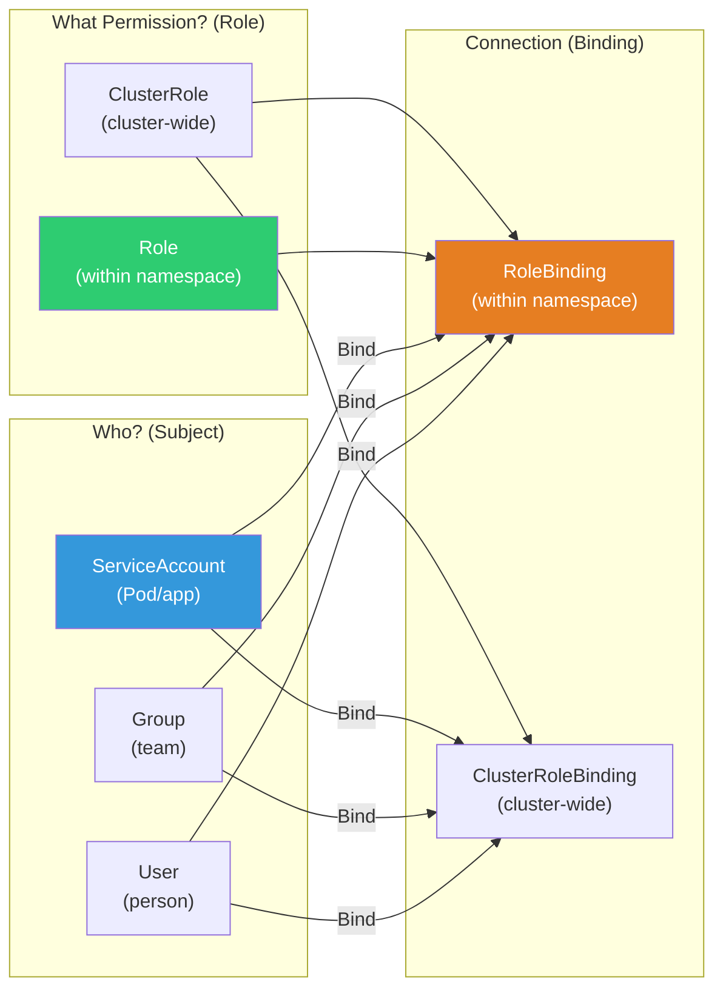
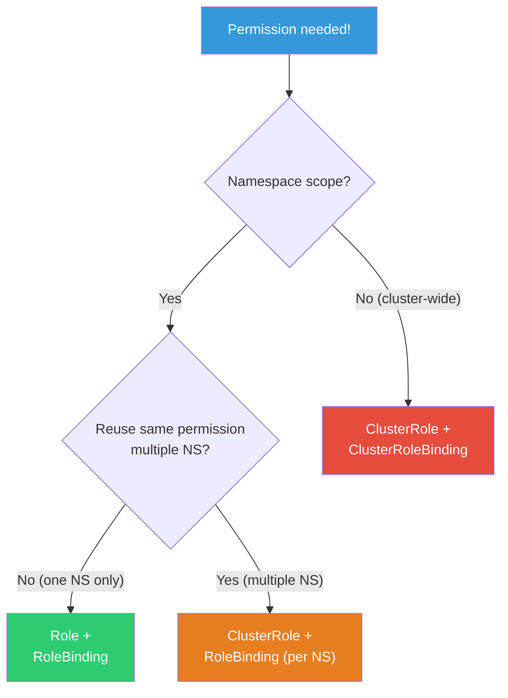
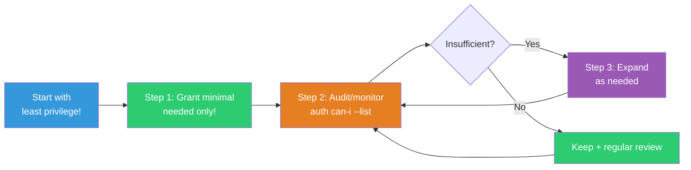

# RBAC / ServiceAccount

> "Developer accidentally deleted production Pod!" — RBAC prevents this. "Who can do what?" — K8s permission management system. It's the K8s version of [Linux users/permissions](../01-linux/03-users-groups), and combined with AWS IAM, you can control cloud resource access too.

---

## 🎯 Why Learn This?

```
When you need RBAC in real work:
• Allow devs only their own namespace        → Role + RoleBinding
• Give CI/CD pipeline deploy permission      → ServiceAccount + Role
• Read-only access for monitoring tools      → ClusterRole
• Pod needs to access AWS S3                 → IRSA (ServiceAccount + IAM)
• "kubectl doesn't work" → Forbidden error   → Permission debugging
• Security audit: "Who has what permission?" → RBAC review
```

---

## 🧠 Core Concepts

### RBAC Components



**4 Core Components:**
* **Role** — "What can you do?" (namespace scope)
* **ClusterRole** — "What can you do?" (cluster-wide)
* **RoleBinding** — "Who has this Role?" (namespace scope)
* **ClusterRoleBinding** — "Who has this ClusterRole?" (cluster-wide)

### Analogy: Company Access Card

* **Role** = "Can use meeting rooms on this floor (namespace)"
* **ClusterRole** = "Can go anywhere in building (cluster)"
* **RoleBinding** = "Kim Dev gets this floor's access"
* **ServiceAccount** = "Robot's access card"

---

## 🔍 Detailed Explanation — Role & RoleBinding

### Role — Namespace Permissions

```yaml
# Dev only gets Pod view/log/exec, no delete
apiVersion: rbac.authorization.k8s.io/v1
kind: Role
metadata:
  name: developer
  namespace: production
rules:
# Pod view and logs
- apiGroups: [""]                # "" = core API (Pod, Service, etc)
  resources: ["pods", "pods/log"]
  verbs: ["get", "list", "watch"]

# Pod exec (shell access)
- apiGroups: [""]
  resources: ["pods/exec"]
  verbs: ["create"]

# Service, ConfigMap view
- apiGroups: [""]
  resources: ["services", "configmaps"]
  verbs: ["get", "list"]

# Deployment view
- apiGroups: ["apps"]            # apps API
  resources: ["deployments"]
  verbs: ["get", "list"]

# ❌ Missing: delete, create(Pod), update
# → Can't accidentally delete Pod!
```

```bash
# verbs (actions):
# get     — single resource view (kubectl get pod nginx)
# list    — list view (kubectl get pods)
# watch   — real-time change watch (kubectl get pods -w)
# create  — create (kubectl apply)
# update  — edit (kubectl edit)
# patch   — partial edit (kubectl patch)
# delete  — delete (kubectl delete)
# deletecollection — batch delete

# apiGroups common values:
# ""       → core (Pod, Service, ConfigMap, Secret, Node, PV, PVC)
# "apps"   → Deployment, StatefulSet, DaemonSet, ReplicaSet
# "batch"  → Job, CronJob
# "networking.k8s.io" → Ingress, NetworkPolicy
# "rbac.authorization.k8s.io" → Role, RoleBinding
# "autoscaling" → HPA

# Allow only specific resource by name (very granular!)
rules:
- apiGroups: [""]
  resources: ["configmaps"]
  resourceNames: ["myapp-config"]    # Only this ConfigMap!
  verbs: ["get", "update"]
```

### RoleBinding — Who Has the Role

```yaml
apiVersion: rbac.authorization.k8s.io/v1
kind: RoleBinding
metadata:
  name: developer-binding
  namespace: production
subjects:
# Person (User)
- kind: User
  name: "developer@example.com"      # IAM/OIDC user
  apiGroup: rbac.authorization.k8s.io

# Team (Group)
- kind: Group
  name: "dev-team"
  apiGroup: rbac.authorization.k8s.io

# App/Service (ServiceAccount)
- kind: ServiceAccount
  name: ci-deployer
  namespace: production

roleRef:
  kind: Role
  name: developer                     # Role from above
  apiGroup: rbac.authorization.k8s.io
```

```bash
# Check RoleBinding
kubectl get rolebindings -n production
# NAME                ROLE              AGE
# developer-binding   Role/developer    5d

kubectl describe rolebinding developer-binding -n production
# Role:
#   Kind:  Role
#   Name:  developer
# Subjects:
#   Kind   Name                     Namespace
#   ----   ----                     ---------
#   User   developer@example.com
#   Group  dev-team
#   ServiceAccount  ci-deployer     production
```

---

## 🔍 Detailed Explanation — ClusterRole & ClusterRoleBinding

### ClusterRole — Cluster-Wide Permissions

```yaml
# Read-only (all namespaces, view only)
apiVersion: rbac.authorization.k8s.io/v1
kind: ClusterRole
metadata:
  name: readonly-all
rules:
- apiGroups: ["", "apps", "batch", "networking.k8s.io"]
  resources: ["*"]                    # All resources!
  verbs: ["get", "list", "watch"]     # Read only!

---
# Deploy manager (Deployment, Service management)
apiVersion: rbac.authorization.k8s.io/v1
kind: ClusterRole
metadata:
  name: deployer
rules:
- apiGroups: ["apps"]
  resources: ["deployments", "replicasets"]
  verbs: ["get", "list", "watch", "create", "update", "patch"]
- apiGroups: [""]
  resources: ["services", "configmaps"]
  verbs: ["get", "list", "watch", "create", "update", "patch"]
- apiGroups: ["networking.k8s.io"]
  resources: ["ingresses"]
  verbs: ["get", "list", "watch", "create", "update", "patch"]
```

```bash
# K8s built-in ClusterRoles
kubectl get clusterroles | grep -E "^(admin|edit|view|cluster-admin)"
# admin          → Namespace admin (most possible, RBAC except)
# edit           → Edit resources (Secret readable, RBAC not editable)
# view           → Read-only (Secret not readable!)
# cluster-admin  → ⚠️ All permissions! (full kubectl)

# Use built-in Role with RoleBinding (namespace scope)
kubectl create rolebinding dev-view \
    --clusterrole=view \
    --user=developer@example.com \
    --namespace=production
# → developer@example.com has view in production NS only

# ClusterRoleBinding (cluster-wide)
kubectl create clusterrolebinding ops-admin \
    --clusterrole=cluster-admin \
    --group=ops-team
# → ops-team has admin everywhere! (⚠️ careful!)
```

### Role vs ClusterRole Selection



```bash
# Role + RoleBinding:
# → Permission only in specific namespace
# → Dev access only their namespace

# ClusterRole + RoleBinding:
# → ClusterRole defined, applied to specific namespace
# → Reuse same permission across namespaces!

# ClusterRole + ClusterRoleBinding:
# → Cluster-wide permission
# → Monitoring tool, ops team

# ⚠️ Minimize cluster-admin ClusterRoleBinding!
# → Only essential people!
```

---

## 🔍 Detailed Explanation — ServiceAccount

### What is ServiceAccount?

**Account that Pods (apps) use to access K8s API**. Not people, but apps/tools/CI/CD.

```bash
# Every Pod runs with ServiceAccount!
# → If not specified, uses default ServiceAccount

kubectl get serviceaccount -n production
# NAME      SECRETS   AGE
# default   0         30d    ← Built-in default

# Check Pod's ServiceAccount
kubectl get pod myapp-abc -o jsonpath='{.spec.serviceAccountName}'
# default

# ⚠️ default SA has no permissions (K8s 1.24+ no auto token)
# → Fine if app doesn't call K8s API
# → Needs API? Create dedicated SA + Role!
```

### Create ServiceAccount + Grant Permissions

```yaml
# 1. Create ServiceAccount
apiVersion: v1
kind: ServiceAccount
metadata:
  name: myapp-sa
  namespace: production

---
# 2. Create Role (permissions for this SA)
apiVersion: rbac.authorization.k8s.io/v1
kind: Role
metadata:
  name: myapp-role
  namespace: production
rules:
- apiGroups: [""]
  resources: ["configmaps"]
  verbs: ["get", "watch"]
- apiGroups: [""]
  resources: ["secrets"]
  resourceNames: ["myapp-secret"]    # Only this Secret!
  verbs: ["get"]

---
# 3. RoleBinding (connect SA to Role)
apiVersion: rbac.authorization.k8s.io/v1
kind: RoleBinding
metadata:
  name: myapp-binding
  namespace: production
subjects:
- kind: ServiceAccount
  name: myapp-sa
  namespace: production
roleRef:
  kind: Role
  name: myapp-role
  apiGroup: rbac.authorization.k8s.io

---
# 4. Use SA in Pod
apiVersion: apps/v1
kind: Deployment
metadata:
  name: myapp
spec:
  template:
    spec:
      serviceAccountName: myapp-sa       # ⭐ Use this SA!
      automountServiceAccountToken: true  # Auto-mount API token
      containers:
      - name: myapp
        image: myapp:v1.0
```

```bash
# Call K8s API from Pod (using SA token)
kubectl exec myapp-abc -- sh -c '
TOKEN=$(cat /var/run/secrets/kubernetes.io/serviceaccount/token)
curl -s -k -H "Authorization: Bearer $TOKEN" \
    https://kubernetes.default.svc/api/v1/namespaces/production/configmaps
'
# → myapp-role has configmaps get/watch, so works!

# Try access Pod (no permission)
kubectl exec myapp-abc -- sh -c '
TOKEN=$(cat /var/run/secrets/kubernetes.io/serviceaccount/token)
curl -s -k -H "Authorization: Bearer $TOKEN" \
    https://kubernetes.default.svc/api/v1/namespaces/production/pods
'
# → 403 Forbidden! (no pods permission!)
```

### IRSA — Pod Access AWS Services (★ EKS Production Essential!)

```bash
# IRSA (IAM Roles for Service Accounts)
# → Connect K8s ServiceAccount to AWS IAM Role!
# → Pod can access S3, SQS, DynamoDB, etc.

# ❌ Old way: Node IAM Role has all permissions
# → All Pods same AWS privileges! Too much!

# ✅ IRSA: Pod-level AWS permissions!
# → myapp-sa → S3 read-only
# → backup-sa → S3 read/write
# → worker-sa → SQS access
```

```yaml
# 1. Attach IAM Role to SA
apiVersion: v1
kind: ServiceAccount
metadata:
  name: myapp-sa
  namespace: production
  annotations:
    eks.amazonaws.com/role-arn: arn:aws:iam::123456:role/MyAppRole
    # ⭐ This annotation is key!
    # → Pods with this SA get MyAppRole AWS permissions!

---
# 2. Use SA in Pod
apiVersion: apps/v1
kind: Deployment
spec:
  template:
    spec:
      serviceAccountName: myapp-sa    # IRSA-connected SA!
      containers:
      - name: myapp
        image: myapp:v1.0
        # → AWS SDK auto-detects IRSA token!
        # → No code changes needed!
```

```bash
# Setup IRSA (AWS CLI)

# 1. Create OIDC Provider (once per cluster)
eksctl utils associate-iam-oidc-provider --cluster my-cluster --approve

# 2. Create IAM Role + SA
eksctl create iamserviceaccount \
    --cluster my-cluster \
    --namespace production \
    --name myapp-sa \
    --attach-policy-arn arn:aws:iam::aws:policy/AmazonS3ReadOnlyAccess \
    --approve

# 3. Verify
kubectl get sa myapp-sa -n production -o yaml | grep eks.amazonaws.com
# eks.amazonaws.com/role-arn: arn:aws:iam::123456:role/eksctl-my-cluster-myapp-sa

# 4. Test AWS access from Pod
kubectl exec myapp-abc -n production -- aws s3 ls
# 2025-03-01 my-bucket
# → S3 accessible! ✅ (via IAM Role)

kubectl exec myapp-abc -n production -- aws ec2 describe-instances
# An error occurred: UnauthorizedOperation
# → EC2 not allowed! ✅ (least privilege!)
```

---

## 🔍 Detailed Explanation — Permission Checking / Debugging

### kubectl auth can-i

```bash
# "Can I do this action?"
kubectl auth can-i get pods -n production
# yes

kubectl auth can-i delete pods -n production
# no    ← No delete permission!

kubectl auth can-i create deployments -n production
# yes

# Check other user's permissions (admin only)
kubectl auth can-i get pods -n production --as developer@example.com
# yes

kubectl auth can-i delete pods -n production --as developer@example.com
# no

# ServiceAccount permission check
kubectl auth can-i get configmaps -n production --as system:serviceaccount:production:myapp-sa
# yes

kubectl auth can-i list pods -n production --as system:serviceaccount:production:myapp-sa
# no

# List all permissions
kubectl auth can-i --list -n production --as developer@example.com
# Resources          Verbs
# pods               [get list watch]
# pods/log           [get list watch]
# pods/exec          [create]
# services           [get list]
# configmaps         [get list]
# deployments.apps   [get list]
```

### Troubleshoot "Forbidden" Error

```bash
# Error:
kubectl get pods -n production
# Error from server (Forbidden): pods is forbidden:
# User "developer@example.com" cannot list resource "pods" in API group "" in the namespace "production"

# Debug sequence:

# 1. Check current user
kubectl config current-context
kubectl config view --minify -o jsonpath='{.contexts[0].context.user}'
# arn:aws:iam::123456:user/developer

# 2. Check this user's RoleBinding
kubectl get rolebindings -n production -o wide
# NAME                ROLE              SUBJECTS
# developer-binding   Role/developer    User/developer@example.com

# 3. Check Role permissions
kubectl describe role developer -n production
# Rules:
#   Resources  Verbs
#   pods       [get list watch]    ← pods list permission exists!

# 4. User name might differ!
# IAM: arn:aws:iam::123456:user/developer
# Role: developer@example.com
# → Names don't match! Fix mapping!

# 5. Check aws-auth ConfigMap (EKS)
kubectl get configmap aws-auth -n kube-system -o yaml
# mapUsers:
# - userarn: arn:aws:iam::123456:user/developer
#   username: developer@example.com    ← Maps to this username
#   groups:
#   - dev-team
```

### EKS aws-auth ConfigMap

```bash
# EKS maps IAM → K8s users

kubectl get configmap aws-auth -n kube-system -o yaml
# data:
#   mapRoles: |
#     - rolearn: arn:aws:iam::123456:role/EKS-NodeRole
#       username: system:node:{{EC2PrivateDNSName}}
#       groups:
#       - system:bootstrappers
#       - system:nodes
#   mapUsers: |
#     - userarn: arn:aws:iam::123456:user/admin
#       username: admin
#       groups:
#       - system:masters            ← ⚠️ cluster-admin!
#     - userarn: arn:aws:iam::123456:user/developer
#       username: developer@example.com
#       groups:
#       - dev-team

# Add user
kubectl edit configmap aws-auth -n kube-system
# Add to mapUsers:
# - userarn: arn:aws:iam::123456:user/new-dev
#   username: new-dev@example.com
#   groups:
#   - dev-team

# ⚠️ Mistake in aws-auth → cluster inaccessible!
# → Always backup first!
kubectl get configmap aws-auth -n kube-system -o yaml > aws-auth-backup.yaml

# Newer method: EKS Access Entry (replaces aws-auth!)
aws eks create-access-entry \
    --cluster-name my-cluster \
    --principal-arn arn:aws:iam::123456:user/developer \
    --kubernetes-groups dev-team
```

---

## 💻 Hands-On Examples

### Exercise 1: Namespace Permission Separation

```bash
# 1. Create namespaces
kubectl create namespace team-a
kubectl create namespace team-b

# 2. Create Role for team-a only
kubectl apply -f - << 'EOF'
apiVersion: rbac.authorization.k8s.io/v1
kind: Role
metadata:
  name: team-member
  namespace: team-a
rules:
- apiGroups: ["", "apps"]
  resources: ["pods", "deployments", "services", "configmaps"]
  verbs: ["get", "list", "watch", "create", "update", "delete"]
EOF

# 3. RoleBinding
kubectl create rolebinding team-a-members \
    --role=team-member \
    --serviceaccount=team-a:default \
    --namespace=team-a

# 4. Verify permissions
kubectl auth can-i create pods -n team-a --as system:serviceaccount:team-a:default
# yes

kubectl auth can-i create pods -n team-b --as system:serviceaccount:team-a:default
# no    ← Can't access team-b! ✅

# 5. Cleanup
kubectl delete namespace team-a team-b
```

### Exercise 2: Read-Only User

```bash
# 1. Create namespace + Deployment
kubectl create namespace readonly-test
kubectl create deployment test-app --image=nginx -n readonly-test

# 2. Create RoleBinding with view ClusterRole
kubectl create rolebinding readonly-user \
    --clusterrole=view \
    --serviceaccount=readonly-test:default \
    --namespace=readonly-test

# 3. Verify permissions
kubectl auth can-i get pods -n readonly-test --as system:serviceaccount:readonly-test:default
# yes

kubectl auth can-i delete pods -n readonly-test --as system:serviceaccount:readonly-test:default
# no    ← No delete! ✅

kubectl auth can-i get secrets -n readonly-test --as system:serviceaccount:readonly-test:default
# no    ← view doesn't include Secrets! ✅

# 4. Cleanup
kubectl delete namespace readonly-test
```

### Exercise 3: ServiceAccount + RBAC

```bash
# CI/CD pipeline ServiceAccount
kubectl apply -f - << 'EOF'
apiVersion: v1
kind: ServiceAccount
metadata:
  name: ci-deployer
  namespace: default
---
apiVersion: rbac.authorization.k8s.io/v1
kind: Role
metadata:
  name: deployer-role
  namespace: default
rules:
- apiGroups: ["apps"]
  resources: ["deployments"]
  verbs: ["get", "list", "create", "update", "patch"]
- apiGroups: [""]
  resources: ["services"]
  verbs: ["get", "list", "create", "update"]
---
apiVersion: rbac.authorization.k8s.io/v1
kind: RoleBinding
metadata:
  name: ci-deployer-binding
  namespace: default
subjects:
- kind: ServiceAccount
  name: ci-deployer
  namespace: default
roleRef:
  kind: Role
  name: deployer-role
  apiGroup: rbac.authorization.k8s.io
EOF

# Verify
kubectl auth can-i create deployments --as system:serviceaccount:default:ci-deployer
# yes

kubectl auth can-i delete pods --as system:serviceaccount:default:ci-deployer
# no    ← No Pod delete (deployer-role doesn't have it)

kubectl auth can-i --list --as system:serviceaccount:default:ci-deployer
# Resources            Verbs
# deployments.apps     [get list create update patch]
# services             [get list create update]

# Cleanup
kubectl delete sa ci-deployer
kubectl delete role deployer-role
kubectl delete rolebinding ci-deployer-binding
```

---

## 🏢 In Real Work

### Scenario 1: Team-Based Permission Design

```bash
# Organization:
# - Ops team: cluster management
# - Backend team: deploy in backend NS
# - Frontend team: deploy in frontend NS
# - Data team: data NS (read + Job run)

# Ops team: ClusterRoleBinding + cluster-admin
# → Full cluster management (min staff only!)

# Backend/Frontend: RoleBinding + custom Role
# → Own namespace CRUD (Deployment, Service, ConfigMap)
# → No access to other namespaces!

# Data team: RoleBinding + view + Job permission
# → Read in data namespace + create Job/CronJob

# All devs: ClusterRoleBinding + view (optional)
# → All namespaces read-only (debugging)
# → Secret not readable (view role)
```

### Scenario 2: CI/CD Least Privileges

```bash
# "What permissions for ArgoCD/GitHub Actions?"

# ArgoCD ServiceAccount:
# → Deployment, Service, ConfigMap, Secret, Ingress CRUD
# → Manage most resources in target namespace
# → NO RBAC modification! (prevent self-elevation)

# GitHub Actions ServiceAccount:
# → Deployment update only (image tag change)
# → Or deploy via ArgoCD (GA → Git push → ArgoCD sync)
# → Minimize direct K8s access!

# Security principles:
# 1. Least privilege (only necessary!)
# 2. Namespace separation (team-based)
# 3. SA token auto-mount disable (if not needed)
#    automountServiceAccountToken: false
```

### Scenario 3: IRSA for Pod AWS Access

```bash
# "App needs to upload to S3"

# 1. Create IAM Policy
aws iam create-policy --policy-name MyAppS3Write --policy-document '{
  "Version": "2012-10-17",
  "Statement": [{
    "Effect": "Allow",
    "Action": ["s3:PutObject", "s3:GetObject"],
    "Resource": "arn:aws:s3:::my-uploads-bucket/*"
  }]
}'

# 2. Create IRSA
eksctl create iamserviceaccount \
    --cluster my-cluster \
    --namespace production \
    --name upload-sa \
    --attach-policy-arn arn:aws:iam::123456:policy/MyAppS3Write \
    --approve

# 3. Use in Deployment
# spec.template.spec.serviceAccountName: upload-sa

# 4. App code (SDK auto-detects IRSA!)
# import boto3
# s3 = boto3.client('s3')   ← No auth code needed! IRSA auto!
# s3.upload_file('file.pdf', 'my-uploads-bucket', 'file.pdf')
```

---

## ⚠️ Common Mistakes

### 1. Giving cluster-admin to Everyone

```bash
# ❌ All devs get cluster-admin
# → Accident deletes kube-system Pod → cluster breaks!

# ✅ Least privilege
# → cluster-admin only ops core (2~3 people)
# → Devs get namespace Role only
```

### 2. Running App with default ServiceAccount

```bash
# ❌ No SA specified → default SA used
# → Later add permission to default → affects ALL Pods!

# ✅ Create dedicated SA per app
# serviceAccountName: myapp-sa
# → Each app gets minimum required permission
```

### 3. aws-auth Modification Mistakes

```bash
# ❌ Edit aws-auth with syntax error → cluster inaccessible!
# → Need AWS console to recover...

# ✅ Always backup first!
kubectl get cm aws-auth -n kube-system -o yaml > aws-auth-backup.yaml

# ✅ Use EKS Access Entry (newer, safer!)
```

### 4. Secret Permission Too Loose

```bash
# ❌ All Secrets readable
rules:
- apiGroups: [""]
  resources: ["secrets"]
  verbs: ["get", "list"]    # All secrets!

# ✅ Only specific Secret
rules:
- apiGroups: [""]
  resources: ["secrets"]
  resourceNames: ["myapp-secret"]    # This one only!
  verbs: ["get"]
```

### 5. Default automountServiceAccountToken

```bash
# ❌ App doesn't call K8s API but SA token mounted
# → If hacked, attacker can access K8s API!

# ✅ Disable if not needed
spec:
  automountServiceAccountToken: false
```

---

## 📝 Summary

### RBAC Design Principles



```
1. Least Privilege — Only necessary!
2. Namespace Separation — Team/environment based
3. Per-app SA — Never use default
4. Minimize cluster-admin — Ops core only
5. IRSA — Pod-level AWS permissions
6. Regular Audit — Clean unused permissions
```

### Essential Commands

```bash
# Check permissions
kubectl auth can-i VERB RESOURCE [-n NAMESPACE] [--as USER]
kubectl auth can-i --list [--as USER]

# Role/Binding query
kubectl get roles,rolebindings -n NAMESPACE
kubectl get clusterroles,clusterrolebindings
kubectl describe role ROLE -n NAMESPACE

# SA query
kubectl get serviceaccounts -n NAMESPACE

# Quick create
kubectl create role NAME --verb=get,list --resource=pods -n NS
kubectl create rolebinding NAME --role=ROLE --user=USER -n NS
kubectl create clusterrolebinding NAME --clusterrole=CR --group=GROUP

# EKS aws-auth
kubectl get cm aws-auth -n kube-system -o yaml
```

### Real-World Permission Matrix

```
Role          | ClusterRole      | Scope        | Secret
─────────────┼─────────────────┼──────────────┼────────
Ops team      | cluster-admin    | Full cluster | Full
Backend dev   | Custom (CRUD)    | Own NS       | Own only
Frontend dev  | Custom (CRUD)    | Own NS       | Own only
QA            | view             | staging NS   | ❌
Monitoring    | view             | All (R/O)    | ❌
CI/CD         | Custom (deploy)  | Target NS    | Deploy Secret only
```

---

## 🔗 Next Lecture

Next is **[12-helm-kustomize](./12-helm-kustomize)** — Helm / Kustomize.

K8s YAML grows to 50+ files, managing becomes hard. Different config per environment (dev/staging/prod), repeated patterns, version management — Helm and Kustomize solve this. They're package-manager-level management of the ConfigMap configuration you learned earlier.
