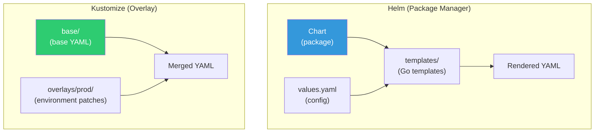
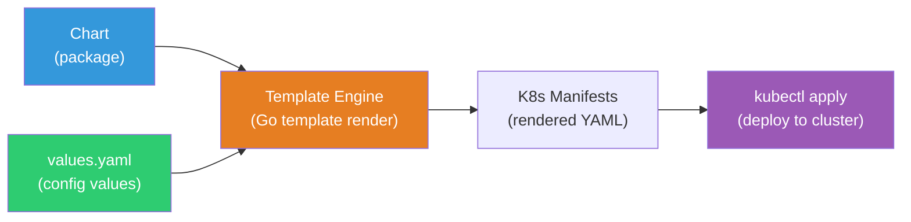
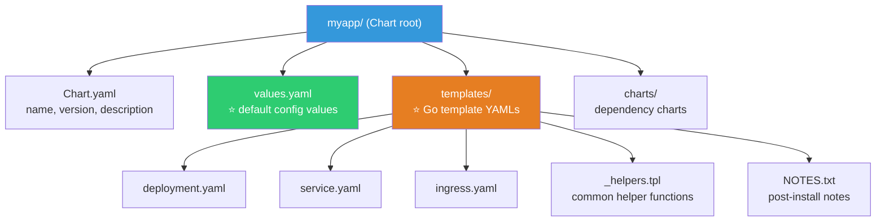
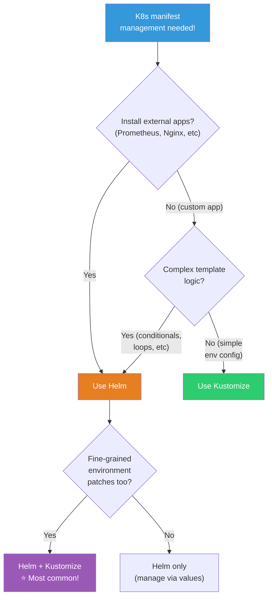

# Helm / Kustomize

> 50+ K8s YAML files? Deploy to dev/staging/prod with different configs? Deploy same app to multiple teams? **Helm** is K8s package manager. **Kustomize** is YAML overlay tool. Both are essential daily tools in real work.

---

## 🎯 Why Learn This?

```
When you need Helm/Kustomize in real work:
• Too many YAML files to manage         → Package management
• Same app, different config per env    → Environment-based override
• "Install Nginx Ingress please"        → helm install
• "Install Prometheus on K8s"           → helm install
• CI/CD auto-deployment                 → Helm + ArgoCD
• Repeated YAML patterns                → Templating
```

---

## 🧠 Core Concepts

### Helm vs Kustomize



| Item | Helm | Kustomize |
|------|------|-----------|
| Approach | Template + variables | Base YAML + patches (overlay) |
| Install | Separate helm CLI | Built into kubectl! (`-k` option) |
| Ecosystem | ⭐ Thousands of charts (Artifact Hub) | No chart registry |
| Learning | Medium (Go templates) | Low |
| Install External Apps | ⭐ `helm install prometheus` | ❌ Manual YAML |
| Environment Config | values-dev.yaml, values-prod.yaml | overlays/dev, overlays/prod |
| GitOps | ArgoCD + Helm ⭐ | ArgoCD + Kustomize ⭐ |
| Recommended | External app install + custom app | Simple environment config |

---

## 🔍 Detailed Explanation — Helm

### What is Helm?



K8s **package manager** like apt/brew — install complex apps in one command.

```bash
# Without Helm: Install Prometheus manually
# → Write 20+ YAML (Deployment, Service, ConfigMap, RBAC, PV...)
# → Manage updates/rollback manually
# → Modify config by editing YAML

# With Helm:
helm install prometheus prometheus-community/kube-prometheus-stack
# → One command! 20 YAML auto-generated + deployed!
```

### Helm Core Terms

```bash
# Chart  = package (Deployment+Service+... bundle)
# Release = installed instance of Chart (identified by name)
# Repository = chart registry (Artifact Hub)
# values.yaml = config file (variables)

# Analogy:
# Chart = software installer (Photoshop installer)
# values.yaml = install options (language: Korean, path: /opt)
# Release = installed software (my computer's Photoshop)
# Repository = app store (Artifact Hub)
```

### Helm Essential Commands

```bash
# === Repository Management ===
helm repo add bitnami https://charts.bitnami.com/bitnami
helm repo add prometheus-community https://prometheus-community.github.io/helm-charts
helm repo add ingress-nginx https://kubernetes.github.io/ingress-nginx
helm repo update
helm repo list
# NAME                 URL
# bitnami              https://charts.bitnami.com/bitnami
# prometheus-community https://prometheus-community.github.io/helm-charts

# Search charts
helm search repo nginx
# NAME                            CHART VERSION   APP VERSION
# bitnami/nginx                   15.0.0          1.25.3
# ingress-nginx/ingress-nginx     4.9.0           1.9.5
# bitnami/nginx-ingress-controller 10.0.0         1.9.5

# === Install ===
helm install my-nginx bitnami/nginx \
    --namespace web \
    --create-namespace \
    --set service.type=ClusterIP \
    --set replicaCount=3

# NAME: my-nginx
# STATUS: deployed
# REVISION: 1
# → Installed as "my-nginx"!

# Install with values file (⭐ production recommended!)
helm install my-nginx bitnami/nginx \
    -f my-values.yaml \
    --namespace web

# === View ===
helm list -A
# NAME         NAMESPACE   REVISION   STATUS     CHART          APP VERSION
# my-nginx     web         1          deployed   nginx-15.0.0   1.25.3
# prometheus   monitoring  3          deployed   kube-prom-55   0.70.0

helm status my-nginx -n web
# STATUS: deployed
# REVISION: 1
# NOTES:
# ...installation notes...

# View installed values
helm get values my-nginx -n web
# replicaCount: 3
# service:
#   type: ClusterIP

# View all rendered YAML
helm get manifest my-nginx -n web

# === Upgrade ===
helm upgrade my-nginx bitnami/nginx \
    -f my-values.yaml \
    --set replicaCount=5 \
    --namespace web
# Release "my-nginx" has been upgraded. Happy Helming!
# REVISION: 2

# === Rollback ===
helm rollback my-nginx 1 -n web
# Rollback was a success! Happy Helming!
# → Rollback to revision 1!

helm history my-nginx -n web
# REVISION   STATUS       CHART          DESCRIPTION
# 1          superseded   nginx-15.0.0   Install complete
# 2          superseded   nginx-15.0.0   Upgrade complete
# 3          deployed     nginx-15.0.0   Rollback to 1

# === Delete ===
helm uninstall my-nginx -n web
# release "my-nginx" uninstalled

# === Dry-run (test without deploying!) ===
helm install test bitnami/nginx --dry-run --debug -f values.yaml
# → Only output rendered YAML (no actual install!)

# === Template render ===
helm template my-nginx bitnami/nginx -f values.yaml
# → Output YAML only (no Release created, useful for CI/CD!)
```

### Helm Chart Structure (Create Your Own)



```bash
# Create Chart
helm create myapp
# myapp/
# ├── Chart.yaml          ← Chart metadata (name, version)
# ├── values.yaml          ← ⭐ Default config values
# ├── charts/              ← Dependency charts
# ├── templates/           ← ⭐ Go template YAMLs
# │   ├── deployment.yaml
# │   ├── service.yaml
# │   ├── ingress.yaml
# │   ├── hpa.yaml
# │   ├── serviceaccount.yaml
# │   ├── _helpers.tpl      ← Common helper functions
# │   ├── NOTES.txt         ← Post-install guide
# │   └── tests/
# │       └── test-connection.yaml
# └── .helmignore
```

### values.yaml

```yaml
# values.yaml — default config (user can override!)
replicaCount: 3

image:
  repository: myapp
  tag: "v1.0.0"
  pullPolicy: IfNotPresent

service:
  type: ClusterIP
  port: 80

ingress:
  enabled: true
  className: nginx
  hosts:
  - host: api.example.com
    paths:
    - path: /
      pathType: Prefix
  tls:
  - secretName: api-tls
    hosts:
    - api.example.com

resources:
  requests:
    cpu: "250m"
    memory: "256Mi"
  limits:
    cpu: "500m"
    memory: "512Mi"

autoscaling:
  enabled: true
  minReplicas: 2
  maxReplicas: 20
  targetCPUUtilizationPercentage: 60

env:
  NODE_ENV: production
  LOG_LEVEL: info

secrets:
  enabled: true
  externalSecretName: myapp-db-credentials
```

### Go Templates (templates/deployment.yaml)

```yaml
apiVersion: apps/v1
kind: Deployment
metadata:
  name: {{ include "myapp.fullname" . }}
  labels:
    {{- include "myapp.labels" . | nindent 4 }}
spec:
  {{- if not .Values.autoscaling.enabled }}
  replicas: {{ .Values.replicaCount }}
  {{- end }}
  selector:
    matchLabels:
      {{- include "myapp.selectorLabels" . | nindent 6 }}
  template:
    metadata:
      labels:
        {{- include "myapp.selectorLabels" . | nindent 8 }}
    spec:
      serviceAccountName: {{ include "myapp.serviceAccountName" . }}
      containers:
      - name: {{ .Chart.Name }}
        image: "{{ .Values.image.repository }}:{{ .Values.image.tag }}"
        imagePullPolicy: {{ .Values.image.pullPolicy }}
        ports:
        - containerPort: {{ .Values.service.port }}
        {{- if .Values.env }}
        env:
        {{- range $key, $value := .Values.env }}
        - name: {{ $key }}
          value: {{ $value | quote }}
        {{- end }}
        {{- end }}
        resources:
          {{- toYaml .Values.resources | nindent 12 }}
        readinessProbe:
          httpGet:
            path: /ready
            port: {{ .Values.service.port }}
          periodSeconds: 5
        livenessProbe:
          httpGet:
            path: /health
            port: {{ .Values.service.port }}
          periodSeconds: 10
```

### Environment-Specific values Files (★ Production Core!)

```bash
# values-dev.yaml
replicaCount: 1
image:
  tag: "latest"
resources:
  requests:
    cpu: "100m"
    memory: "128Mi"
ingress:
  hosts:
  - host: api-dev.example.com

# values-prod.yaml
replicaCount: 3
image:
  tag: "v1.2.3"
resources:
  requests:
    cpu: "500m"
    memory: "512Mi"
ingress:
  hosts:
  - host: api.example.com

# Deploy:
helm upgrade --install myapp ./myapp \
    -f values.yaml \
    -f values-prod.yaml \           # Prod values override defaults!
    --set image.tag=v1.2.4 \        # Additional override (highest priority!)
    --namespace production

# Priority: --set > -f values-prod.yaml > -f values.yaml > Chart's values.yaml
```

---

## 🔍 Detailed Explanation — Kustomize

### What is Kustomize?

**Overlay patches on base YAML** — pure YAML, no templates.

```bash
# Kustomize advantages:
# ✅ Built into kubectl! No install needed (kubectl apply -k)
# ✅ Pure YAML! No Go template syntax
# ✅ Easy to learn
# ✅ Great for GitOps (ArgoCD)

# Kustomize limitations:
# ❌ No external app installation (no helm install equivalent)
# ❌ Complex conditionals hard
# ❌ No chart sharing/distribution ecosystem
```

### Kustomize Directory Structure

```bash
myapp/
├── base/                        # ⭐ Base YAML (shared)
│   ├── kustomization.yaml
│   ├── deployment.yaml
│   ├── service.yaml
│   └── ingress.yaml
├── overlays/                    # ⭐ Environment patches
│   ├── dev/
│   │   ├── kustomization.yaml
│   │   ├── replicas-patch.yaml
│   │   └── ingress-patch.yaml
│   ├── staging/
│   │   ├── kustomization.yaml
│   │   └── replicas-patch.yaml
│   └── prod/
│       ├── kustomization.yaml
│       ├── replicas-patch.yaml
│       ├── resources-patch.yaml
│       └── ingress-patch.yaml
```

### base/ — Base YAML

```yaml
# base/kustomization.yaml
apiVersion: kustomize.config.k8s.io/v1beta1
kind: Kustomization

resources:
- deployment.yaml
- service.yaml
- ingress.yaml

commonLabels:
  app: myapp

# base/deployment.yaml — Pure K8s YAML! (no templates!)
apiVersion: apps/v1
kind: Deployment
metadata:
  name: myapp
spec:
  replicas: 1                    # Default 1 (override per environment)
  selector:
    matchLabels:
      app: myapp
  template:
    metadata:
      labels:
        app: myapp
    spec:
      containers:
      - name: myapp
        image: myapp:latest      # Default latest (change per environment)
        ports:
        - containerPort: 3000
        resources:
          requests:
            cpu: "100m"
            memory: "128Mi"
```

### overlays/ — Environment Patches

```yaml
# overlays/prod/kustomization.yaml
apiVersion: kustomize.config.k8s.io/v1beta1
kind: Kustomization

resources:
- ../../base                     # Reference base!

namespace: production            # Add namespace

# Change image tag!
images:
- name: myapp
  newTag: v1.2.3                 # latest → v1.2.3

# Auto-generate ConfigMap
configMapGenerator:
- name: myapp-config
  literals:
  - NODE_ENV=production
  - LOG_LEVEL=warn

# Patches (modify base YAML)
patches:
# Change replicas
- target:
    kind: Deployment
    name: myapp
  patch: |-
    - op: replace
      path: /spec/replicas
      value: 5

# Change resources
- target:
    kind: Deployment
    name: myapp
  patch: |-
    - op: replace
      path: /spec/template/spec/containers/0/resources
      value:
        requests:
          cpu: "500m"
          memory: "512Mi"
        limits:
          cpu: "1000m"
          memory: "1Gi"
```

```yaml
# overlays/dev/kustomization.yaml
apiVersion: kustomize.config.k8s.io/v1beta1
kind: Kustomization

resources:
- ../../base

namespace: dev

images:
- name: myapp
  newTag: latest                 # Dev keeps latest

namePrefix: dev-                 # Add "dev-" prefix to all resource names

configMapGenerator:
- name: myapp-config
  literals:
  - NODE_ENV=development
  - LOG_LEVEL=debug
```

### Kustomize Commands

```bash
# === Build (render only, don't apply) ===
kubectl kustomize overlays/prod
# → Output merged YAML (verify first!)

# Or:
kustomize build overlays/prod

# === Apply ===
kubectl apply -k overlays/prod
# namespace/production created
# configmap/myapp-config-abc123 created
# deployment.apps/myapp created
# service/myapp created

# === Apply by environment ===
kubectl apply -k overlays/dev      # Dev
kubectl apply -k overlays/staging  # Staging
kubectl apply -k overlays/prod     # Prod

# === Delete ===
kubectl delete -k overlays/prod

# === Diff (preview changes!) ===
kubectl diff -k overlays/prod
# → Show diff between current and to-be-applied!
```

### Kustomize Key Features

```yaml
# === Image tag change (most common!) ===
images:
- name: myapp
  newName: 123456.dkr.ecr.ap-northeast-2.amazonaws.com/myapp
  newTag: v1.2.3
# → Change "myapp:latest" to ECR + v1.2.3!
# → CI/CD: kustomize edit set image myapp=...:$TAG

# === Auto-generate ConfigMap/Secret ===
configMapGenerator:
- name: myapp-config
  files:
  - config/app.properties        # From file
  literals:
  - KEY=value                    # Inline value

secretGenerator:
- name: myapp-secret
  literals:
  - password=S3cret!
  type: Opaque
# → Auto-add hash suffix! (myapp-config-abc123)
# → ConfigMap change → hash changes → Pod auto-restart!

# === Common labels/annotations ===
commonLabels:
  app: myapp
  team: backend
commonAnnotations:
  managed-by: kustomize

# === Namespace everywhere ===
namespace: production

# === Name prefix/suffix ===
namePrefix: prod-
nameSuffix: -v2

# === Strategic merge patch ===
patchesStrategicMerge:
- add-sidecar.yaml              # Add sidecar container

# add-sidecar.yaml:
# apiVersion: apps/v1
# kind: Deployment
# metadata:
#   name: myapp
# spec:
#   template:
#     spec:
#       containers:
#       - name: log-shipper           ← Add sidecar!
#         image: fluentd:latest
```

---

## 🔍 Detailed Explanation — Helm + Kustomize Together

### Real Pattern: Helm Install + Kustomize Customize

```bash
# Install Prometheus with Helm, then customize with Kustomize

# 1. Render Helm chart to YAML
helm template prometheus prometheus-community/kube-prometheus-stack \
    -f values-prometheus.yaml \
    --namespace monitoring > base/prometheus-all.yaml

# 2. Put in Kustomize base
# base/kustomization.yaml
# resources:
# - prometheus-all.yaml

# 3. Environment-specific patches in overlays
# overlays/prod/kustomization.yaml
# resources:
# - ../../base
# patches:
# - retention-patch.yaml    ← Prod: 30-day retention

# → This is "Helm post-rendering"
# → ArgoCD natively supports Helm + Kustomize!
```

### ArgoCD with Helm / Kustomize (See 07-cicd)

```yaml
# ArgoCD Application — Helm type
apiVersion: argoproj.io/v1alpha1
kind: Application
metadata:
  name: myapp
spec:
  source:
    repoURL: https://github.com/myorg/myapp-helm.git
    path: charts/myapp
    helm:
      valueFiles:
      - values.yaml
      - values-prod.yaml

---
# ArgoCD Application — Kustomize type
apiVersion: argoproj.io/v1alpha1
kind: Application
metadata:
  name: myapp
spec:
  source:
    repoURL: https://github.com/myorg/myapp-k8s.git
    path: overlays/prod
    # ArgoCD auto runs: kustomize build!
```

---

## 💻 Hands-On Examples

### Exercise 1: Install External App with Helm (Nginx Ingress)

```bash
# 1. Add repo
helm repo add ingress-nginx https://kubernetes.github.io/ingress-nginx
helm repo update

# 2. Check values first
helm show values ingress-nginx/ingress-nginx | head -50

# 3. Install with custom values
helm install ingress-nginx ingress-nginx/ingress-nginx \
    --namespace ingress-nginx \
    --create-namespace \
    --set controller.replicaCount=2 \
    --set controller.service.type=LoadBalancer

# 4. Verify
helm list -n ingress-nginx
# NAME           REVISION   STATUS     CHART
# ingress-nginx  1          deployed   ingress-nginx-4.9.0

kubectl get pods -n ingress-nginx
# NAME                                       READY   STATUS
# ingress-nginx-controller-abc123-1          1/1     Running
# ingress-nginx-controller-abc123-2          1/1     Running

# 5. Upgrade (change replicas)
helm upgrade ingress-nginx ingress-nginx/ingress-nginx \
    --namespace ingress-nginx \
    --set controller.replicaCount=3 \
    --reuse-values                  # ⭐ Keep existing values!
# REVISION: 2

# 6. Rollback
helm rollback ingress-nginx 1 -n ingress-nginx

# 7. Cleanup
helm uninstall ingress-nginx -n ingress-nginx
kubectl delete namespace ingress-nginx
```

### Exercise 2: Create Helm Chart

```bash
# 1. Create Chart
helm create myapp-chart
cd myapp-chart

# 2. Update values.yaml
cat << 'EOF' > values.yaml
replicaCount: 2
image:
  repository: nginx
  tag: "1.25-alpine"
service:
  type: ClusterIP
  port: 80
resources:
  requests:
    cpu: "50m"
    memory: "64Mi"
  limits:
    memory: "128Mi"
EOF

# 3. Lint (check syntax)
helm lint .
# ==> Linting .
# [INFO] Chart.yaml: icon is recommended
# 1 chart(s) linted, 0 chart(s) failed

# 4. Dry-run (render preview)
helm template test . | head -40

# 5. Install
helm install myapp . --namespace default

# 6. Verify
kubectl get pods -l app.kubernetes.io/name=myapp-chart
# NAME                           READY   STATUS
# myapp-myapp-chart-abc123       1/1     Running
# myapp-myapp-chart-def456       1/1     Running

# 7. Upgrade (change image)
helm upgrade myapp . --set image.tag="1.24-alpine"

# 8. Cleanup
helm uninstall myapp
cd .. && rm -rf myapp-chart
```

### Exercise 3: Kustomize Environment-Based Deploy

```bash
# 1. Create structure
mkdir -p myapp-kustomize/{base,overlays/{dev,prod}}
cd myapp-kustomize

# 2. Write base files
cat << 'EOF' > base/deployment.yaml
apiVersion: apps/v1
kind: Deployment
metadata:
  name: myapp
spec:
  replicas: 1
  selector:
    matchLabels:
      app: myapp
  template:
    metadata:
      labels:
        app: myapp
    spec:
      containers:
      - name: myapp
        image: nginx:latest
        ports:
        - containerPort: 80
        resources:
          requests:
            cpu: "50m"
            memory: "64Mi"
EOF

cat << 'EOF' > base/service.yaml
apiVersion: v1
kind: Service
metadata:
  name: myapp
spec:
  selector:
    app: myapp
  ports:
  - port: 80
EOF

cat << 'EOF' > base/kustomization.yaml
apiVersion: kustomize.config.k8s.io/v1beta1
kind: Kustomization
resources:
- deployment.yaml
- service.yaml
EOF

# 3. Dev overlay
cat << 'EOF' > overlays/dev/kustomization.yaml
apiVersion: kustomize.config.k8s.io/v1beta1
kind: Kustomization
resources:
- ../../base
namespace: dev
namePrefix: dev-
images:
- name: nginx
  newTag: "1.25-alpine"
configMapGenerator:
- name: myapp-config
  literals:
  - ENV=development
EOF

# 4. Prod overlay
cat << 'EOF' > overlays/prod/kustomization.yaml
apiVersion: kustomize.config.k8s.io/v1beta1
kind: Kustomization
resources:
- ../../base
namespace: prod
images:
- name: nginx
  newTag: "1.25-alpine"
patches:
- target:
    kind: Deployment
    name: myapp
  patch: |-
    - op: replace
      path: /spec/replicas
      value: 3
    - op: replace
      path: /spec/template/spec/containers/0/resources
      value:
        requests:
          cpu: "250m"
          memory: "256Mi"
        limits:
          memory: "512Mi"
configMapGenerator:
- name: myapp-config
  literals:
  - ENV=production
EOF

# 5. Compare renderings
echo "=== DEV ==="
kubectl kustomize overlays/dev | grep -E "replicas:|image:|namespace:" | head -5

echo "=== PROD ==="
kubectl kustomize overlays/prod | grep -E "replicas:|image:|namespace:" | head -5

# DEV:  namespace: dev, replicas: 1, image: nginx:1.25-alpine
# PROD: namespace: prod, replicas: 3, image: nginx:1.25-alpine

# 6. Deploy
kubectl create namespace dev
kubectl apply -k overlays/dev

kubectl create namespace prod
kubectl apply -k overlays/prod

# 7. Verify
kubectl get deployments -n dev
# NAME         READY   IMAGE
# dev-myapp    1/1     nginx:1.25-alpine

kubectl get deployments -n prod
# NAME    READY   IMAGE
# myapp   3/3     nginx:1.25-alpine    ← 3 replicas!

# 8. Cleanup
kubectl delete -k overlays/dev
kubectl delete -k overlays/prod
kubectl delete namespace dev prod
cd .. && rm -rf myapp-kustomize
```

---

## 🏢 In Real Work

### Scenario 1: Helm vs Kustomize Selection

```bash
# "Which one should we use?"

# Use Helm:
# ✅ Install external apps (Prometheus, Nginx Ingress, cert-manager...)
# ✅ Complex template logic (if/else, loops)
# ✅ Package for sharing (publish to Artifact Hub)
# ✅ Large ecosystem

# Use Kustomize:
# ✅ Simple environment config differences
# ✅ Pure YAML (no template syntax needed)
# ✅ Built into kubectl (no install)
# ✅ Existing YAML reuse

# Use both (⭐ most common!):
# → External apps: Helm
# → Custom apps: Helm or Kustomize (team preference)
# → ArgoCD supports both!
```

### Scenario 2: CI/CD Image Tag Update

```bash
# GitHub Actions build → K8s deploy

# === Helm approach ===
helm upgrade myapp ./chart \
    --set image.tag=$GITHUB_SHA \
    --namespace production

# === Kustomize approach ===
cd overlays/prod
kustomize edit set image myapp=123456.dkr.ecr.../myapp:$GITHUB_SHA
git add .
git commit -m "deploy: update image to $GITHUB_SHA"
git push
# → ArgoCD detects Git change → auto deploy! (GitOps!)

# → See 07-cicd for full ArgoCD + Helm/Kustomize pipeline!
```

### Scenario 3: Safe Helm Chart Upgrade

```bash
# "Upgrade Prometheus Helm chart safely"

# 1. Check current version
helm list -n monitoring
# prometheus   3   deployed   kube-prometheus-stack-55.0.0

# 2. Check new version changes
helm show chart prometheus-community/kube-prometheus-stack | grep version
# version: 56.0.0

# 3. Preview changes (helm-diff plugin)
helm diff upgrade prometheus prometheus-community/kube-prometheus-stack \
    -f values-prometheus.yaml \
    --namespace monitoring
# → Show only changes!

# 4. Dry-run
helm upgrade prometheus prometheus-community/kube-prometheus-stack \
    -f values-prometheus.yaml \
    --namespace monitoring \
    --dry-run

# 5. Apply
helm upgrade prometheus prometheus-community/kube-prometheus-stack \
    -f values-prometheus.yaml \
    --namespace monitoring

# 6. Verify
kubectl get pods -n monitoring
helm history prometheus -n monitoring

# 7. Rollback if issues
helm rollback prometheus 3 -n monitoring
```

---

## ⚠️ Common Mistakes

### 1. helm upgrade Without --reuse-values

```bash
# ❌ Partial --set but lose other values!
helm upgrade myapp ./chart --set image.tag=v2.0
# → Previous config resets to defaults!

# ✅ Always --reuse-values
helm upgrade myapp ./chart --set image.tag=v2.0 --reuse-values

# ✅ Or always use values file (safest!)
helm upgrade myapp ./chart -f values-prod.yaml --set image.tag=v2.0
```

### 2. Kustomize: Modify base Directly

```bash
# ❌ Change base/deployment.yaml replicas to 3
# → All environments (dev/staging/prod) affected!

# ✅ Keep base unchanged, patch in overlays
# overlays/prod/kustomization.yaml patches replicas: 3
```

### 3. Helm: Install with Defaults Only

```bash
# ❌ Default install → not production-ready!
helm install prometheus prometheus-community/kube-prometheus-stack

# ✅ Always customize!
helm install prometheus prometheus-community/kube-prometheus-stack \
    -f values-prometheus-prod.yaml

# Check defaults:
helm show values prometheus-community/kube-prometheus-stack > default-values.yaml
# → Copy needed parts to custom values
```

### 4. Secret in values.yaml Plaintext

```bash
# ❌ values.yaml with password (commits to Git!)
# dbPassword: "SuperSecret123!"

# ✅ Use ExternalSecrets + Helm (see 04-config-secret)
# → values has ExternalSecret name only
# → Actual secret in AWS Secrets Manager

# ✅ Or helm-secrets (encrypt with SOPS)
helm secrets install myapp ./chart -f secrets.yaml
```

### 5. Kustomize configMapGenerator Hash Confusion

```bash
# Kustomize auto-adds hash to ConfigMap names!
# myapp-config → myapp-config-abc123

# ✅ Advantage: ConfigMap change → hash change → Pod auto-restart!
# → (Solves ./04-config-secret "change doesn't update Pods" issue!)

# ⚠️ Caution: Deployment auto-updates reference!
# → Kustomize handles it automatically
```

---

## 📝 Summary

### Helm vs Kustomize Selection



```
External app install (Prometheus, Nginx...)  → Helm ⭐
Custom app, simple env config               → Kustomize
Complex template logic                      → Helm
Pure YAML, built-in                         → Kustomize
Package sharing/distribution                → Helm
GitOps (ArgoCD)                             → Both supported!
Real-world                                  → Usually both!
```

### Essential Commands

```bash
# === Helm ===
helm repo add NAME URL && helm repo update
helm install RELEASE CHART [-f values.yaml] [-n NS]
helm upgrade RELEASE CHART [-f values.yaml] [--reuse-values]
helm rollback RELEASE REVISION [-n NS]
helm list [-A]
helm uninstall RELEASE [-n NS]
helm template RELEASE CHART [-f values.yaml]    # Render only
helm show values CHART                           # Show defaults

# === Kustomize ===
kubectl kustomize overlays/prod                  # Render only
kubectl apply -k overlays/prod                   # Apply
kubectl diff -k overlays/prod                    # Preview
kubectl delete -k overlays/prod                  # Delete
kustomize edit set image NAME=REPO:TAG           # Change image
```

---

## 🔗 Next Lecture

Next is **[13-kubectl-tips](./13-kubectl-tips)** — kubectl extensions / krew / real-world tips.

Use kubectl more efficiently — auto-completion, aliases, krew plugins, useful command combinations, context management. All practical kubectl power.
