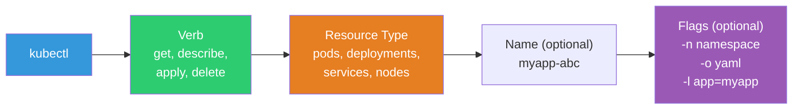
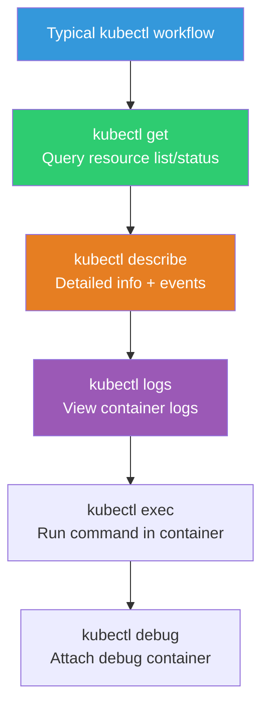
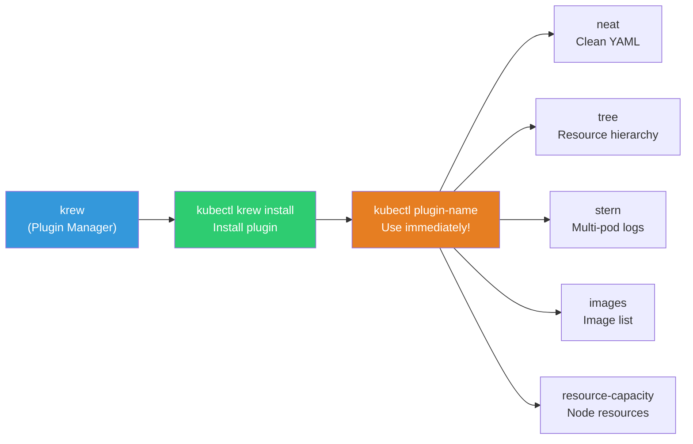
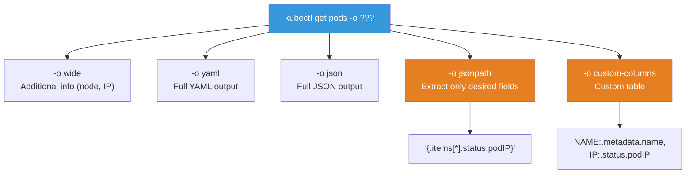

# kubectl Extensions / krew / Practical Tips

> kubectl is a command you type hundreds of times daily. Just setting up auto-completion, an alias, and one plugin can boost your productivity **2~3 times**. Let me consolidate the advanced kubectl techniques and useful tools used in practice.

---

## 🎯 Why Learn This?

```
After learning this lesson:
• kubectl auto-completion → Complete resources/namespaces with Tab key
• alias(k=kubectl) → Reduce typing by 70%!
• krew plugin manager → Extend kubectl with 200+ plugins
• Complex queries → Extract only the information you need with jsonpath, custom-columns
• Multi-cluster management → Switch contexts, use kubectx/kubens
• Daily workflow speed improved 2~3x!
```

---

## 🧠 Core Concepts

**kubectl** is the only CLI tool to communicate with a K8s cluster. It sends requests to the K8s API server to query/create/modify/delete resources.



**Key Concepts to Remember:**

* **Context** — Defines "which cluster, which user, which namespace" you're working with. Saved in `~/.kube/config`.
* **Namespace** — A unit to logically separate resources within a cluster. Specified with the `-n` flag.
* **Resource Types** — All objects that K8s manages: Pod, Deployment, Service, Node, etc. View the full list with `kubectl api-resources`.



---

## 🔍 Detailed Explanation — Essential Initial Setup

### Auto-Completion (⭐ Do This First!)

```bash
# Bash auto-completion
echo 'source <(kubectl completion bash)' >> ~/.bashrc
source ~/.bashrc

# Zsh auto-completion
echo 'source <(kubectl completion zsh)' >> ~/.zshrc
source ~/.zshrc

# Now use Tab key!
kubectl get p[TAB]           # → pods, pv, pvc, ...
kubectl get pods -n kube[TAB] # → kube-system, kube-public
kubectl describe pod my[TAB]  # → my-pod-abc123
kubectl logs [TAB]            # → Pod name auto-complete!
```

### Alias Setup (⭐ Key to Productivity!)

```bash
# Basic alias
echo 'alias k=kubectl' >> ~/.bashrc
echo 'complete -o default -F __start_kubectl k' >> ~/.bashrc  # Auto-completion for alias!

# Aliases used daily in practice
cat << 'EOF' >> ~/.bashrc

# Basic
alias k='kubectl'
alias kg='kubectl get'
alias kd='kubectl describe'
alias kl='kubectl logs'
alias ke='kubectl exec -it'
alias ka='kubectl apply -f'
alias kdel='kubectl delete'

# Pod
alias kgp='kubectl get pods'
alias kgpw='kubectl get pods -o wide'
alias kgpa='kubectl get pods -A'
alias kdp='kubectl describe pod'
alias ktp='kubectl top pods'

# Deployment
alias kgd='kubectl get deployments'
alias kdd='kubectl describe deployment'
alias ksd='kubectl scale deployment'

# Service
alias kgs='kubectl get svc'
alias kge='kubectl get endpoints'

# Node
alias kgn='kubectl get nodes -o wide'
alias ktn='kubectl top nodes'
alias kdn='kubectl describe node'

# Namespace
alias kgns='kubectl get namespaces'
alias kcn='kubectl config set-context --current --namespace'  # kcn production

# Events
alias kev='kubectl get events --sort-by=.lastTimestamp'

# All resources
alias kga='kubectl get all'
alias kgaa='kubectl get all -A'

# Quick temporary Pod
alias krun='kubectl run tmp --image=busybox --rm -it --restart=Never --'
alias knetshoot='kubectl run netshoot --image=nicolaka/netshoot --rm -it --restart=Never --'
EOF

source ~/.bashrc

# Usage examples:
kgp                            # kubectl get pods
kgp -n production              # kubectl get pods -n production
kgpw                           # kubectl get pods -o wide
kl myapp-abc -f --tail 20      # kubectl logs myapp-abc -f --tail 20
ke myapp-abc -- sh             # kubectl exec -it myapp-abc -- sh
kcn production                 # Switch namespace to production!
krun sh                        # Run sh in temporary busybox Pod
knetshoot bash                 # Network debugging with netshoot
```

### kubectx / kubens (★ Essential for Multi-Cluster!)

```bash
# Installation
# brew install kubectx  (Mac)
# sudo apt install kubectx  (Ubuntu, snap)
# Or krew: kubectl krew install ctx ns

# kubectx — Switch clusters (context)
kubectx
# dev-cluster
# staging-cluster
# * prod-cluster            ← Current context

kubectx dev-cluster          # Switch to dev!
# Switched to context "dev-cluster"

kubectx -                    # Return to previous context (like cd -)

# kubens — Switch namespaces
kubens
# default
# kube-system
# * production              ← Current namespace

kubens monitoring            # Switch to monitoring!
# Context "prod-cluster" modified.
# Active namespace is "monitoring"

kubens -                     # Previous namespace

# → No need to attach -n production every time!

# ⚠️ Mistake prevention! In production:
# → Display current context+namespace in prompt!
# → Use kube-ps1 (see below)
```

### Display K8s Info in Shell Prompt

```bash
# kube-ps1: Display cluster+namespace in prompt
# Installation: brew install kube-ps1 (Mac) or git clone

# Add to .bashrc:
# source /path/to/kube-ps1.sh
# PS1='[\W $(kube_ps1)] $ '

# Result:
# [~ (⎈ |prod-cluster:production)] $ kubectl get pods
#       ^^^^^^^^^^^^^^^^^^^^^^^^^^
#       You're in prod-cluster's production namespace!
# → You always know where you are → Mistake prevention!
```

---

## 🔍 Detailed Explanation — krew (kubectl Plugin Manager)



### Install krew + Essential Plugins

```bash
# Install krew
# https://krew.sigs.k8s.io/docs/user-guide/setup/install/

# Search for plugins
kubectl krew search
# NAME          DESCRIPTION
# ctx           Switch between contexts (kubectx)
# ns            Switch between namespaces (kubens)
# neat          Remove clutter from YAML output
# tree          Show resource hierarchy
# images        Show container images in a cluster
# resource-capacity  Show node resource usage
# stern         Multi-pod log tailing
# ...

# Install plugins
kubectl krew install ctx ns neat tree images resource-capacity stern whoami

# List installed plugins
kubectl krew list
# ctx
# images
# neat
# ns
# resource-capacity
# stern
# tree
# whoami
```

### Essential Plugin Usage

```bash
# === kubectl neat — Clean YAML (⭐ Very useful!) ===
# kubectl get outputs lots of unnecessary fields like managed fields
kubectl get deployment myapp -o yaml                # → 200+ lines (messy)
kubectl get deployment myapp -o yaml | kubectl neat  # → 50 lines (clean!)
# → Removes managedFields, status, resourceVersion, etc.
# → "I want to backup this Deployment to YAML" → neat is key!

# === kubectl tree — Resource hierarchy ===
kubectl tree deployment myapp
# NAMESPACE  NAME                              READY  REASON  AGE
# default    Deployment/myapp                  3/3            5d
# default    ├─ReplicaSet/myapp-abc123         3/3            5d
# default    │ ├─Pod/myapp-abc123-xxxxx        True           5d
# default    │ ├─Pod/myapp-abc123-yyyyy        True           5d
# default    │ └─Pod/myapp-abc123-zzzzz        True           5d
# default    └─ReplicaSet/myapp-def456 (old)   0/0            3d
# → See Deployment → ReplicaSet → Pod relationship at a glance!

# === kubectl images — All images in cluster ===
kubectl images -A
# NAMESPACE    POD                      CONTAINER   IMAGE
# default      myapp-abc-1              myapp       myapp:v1.2.3
# default      myapp-abc-2              myapp       myapp:v1.2.3
# kube-system  coredns-5644d7b6d9-xxx   coredns     registry.k8s.io/coredns:v1.11.1
# kube-system  kube-proxy-xxx           kube-proxy  registry.k8s.io/kube-proxy:v1.28.0
# → Get full overview of which images are in use!

# === kubectl resource-capacity — Node resources at a glance ===
kubectl resource-capacity
# NODE      CPU REQUESTS   CPU LIMITS   MEMORY REQUESTS   MEMORY LIMITS
# node-1    1200m (30%)    2400m (61%)  3072Mi (41%)       6144Mi (82%)
# node-2    800m (20%)     1600m (40%)  2048Mi (27%)       4096Mi (55%)
# *Total    2000m (25%)    4000m (50%)  5120Mi (34%)       10240Mi (68%)
# → See node resource usage at a glance!

kubectl resource-capacity --pods --util
# → Pod actual usage too!

# === stern — Tail logs from multiple Pods simultaneously ===
stern myapp -n production
# → All Pods containing "myapp" logs in real-time with color distinction!
# myapp-abc-1 │ [10:00:00] GET /api/users 200
# myapp-abc-2 │ [10:00:01] POST /api/orders 201
# myapp-abc-3 │ [10:00:02] GET /api/health 200

stern "myapp|redis" -n production
# → View myapp and redis logs simultaneously!

stern myapp -n production --since 1h --tail 10
# → Last 1 hour, 10 lines per Pod

# === kubectl whoami — Check current user ===
kubectl whoami
# arn:aws:iam::123456789:user/developer
# → "Who am I logged in as?" (Useful for debugging ./11-rbac!)
```

---

## 🔍 Detailed Explanation — Advanced Query Techniques

### Output Format Options



### jsonpath — Extract Only Desired Fields

```bash
# Pod IP only
kubectl get pods -o jsonpath='{.items[*].status.podIP}'
# 10.0.1.50 10.0.1.51 10.0.1.52

# Pod name + IP (line breaks)
kubectl get pods -o jsonpath='{range .items[*]}{.metadata.name}{"\t"}{.status.podIP}{"\n"}{end}'
# myapp-abc-1   10.0.1.50
# myapp-abc-2   10.0.1.51
# myapp-abc-3   10.0.1.52

# Pod count per node
kubectl get pods -A -o jsonpath='{range .items[*]}{.spec.nodeName}{"\n"}{end}' | sort | uniq -c | sort -rn
# 25 node-1
# 20 node-2
# 18 node-3

# All images (deduplicated)
kubectl get pods -A -o jsonpath='{range .items[*]}{range .spec.containers[*]}{.image}{"\n"}{end}{end}' | sort -u

# Filter by condition
kubectl get pods -o jsonpath='{.items[?(@.status.phase=="Running")].metadata.name}'
# → Running Pods only!

kubectl get nodes -o jsonpath='{.items[?(@.status.conditions[?(@.type=="Ready")].status=="True")].metadata.name}'
# → Ready nodes only!

# Decode Secret value
kubectl get secret db-creds -o jsonpath='{.data.password}' | base64 -d
# S3cur3P@ss!
```

### custom-columns — Customize Table Format

```bash
# Pod name + node + IP + status
kubectl get pods -o custom-columns=\
NAME:.metadata.name,\
NODE:.spec.nodeName,\
IP:.status.podIP,\
STATUS:.status.phase
# NAME            NODE     IP           STATUS
# myapp-abc-1     node-1   10.0.1.50    Running
# myapp-abc-2     node-2   10.0.1.51    Running

# Image + tag
kubectl get pods -o custom-columns=\
POD:.metadata.name,\
IMAGE:.spec.containers[0].image,\
RESTARTS:.status.containerStatuses[0].restartCount
# POD              IMAGE          RESTARTS
# myapp-abc-1      myapp:v1.2.3   0
# myapp-abc-2      myapp:v1.2.3   2

# Node resources (Allocatable)
kubectl get nodes -o custom-columns=\
NAME:.metadata.name,\
CPU:.status.allocatable.cpu,\
MEMORY:.status.allocatable.memory,\
PODS:.status.allocatable.pods
# NAME     CPU    MEMORY    PODS
# node-1   3920m  7484Mi    110
# node-2   3920m  7484Mi    110
```

### Useful Combination Commands

```bash
# === Pod-related ===

# CrashLoopBackOff Pods only
kubectl get pods -A --field-selector=status.phase!=Running | grep -v Completed

# Pods with many restarts (3+)
kubectl get pods -A -o json | jq -r '.items[] | select(.status.containerStatuses[0].restartCount > 3) | "\(.metadata.namespace)/\(.metadata.name) restarts=\(.status.containerStatuses[0].restartCount)"'

# Sort Pods by age (oldest first)
kubectl get pods --sort-by='.metadata.creationTimestamp'

# Check resource requests/limits
kubectl get pods -o custom-columns=\
NAME:.metadata.name,\
CPU_REQ:.spec.containers[0].resources.requests.cpu,\
MEM_REQ:.spec.containers[0].resources.requests.memory,\
CPU_LIM:.spec.containers[0].resources.limits.cpu,\
MEM_LIM:.spec.containers[0].resources.limits.memory

# === Node-related ===

# NotReady nodes
kubectl get nodes | grep NotReady

# Pod distribution per node
kubectl get pods -A -o wide --no-headers | awk '{print $8}' | sort | uniq -c | sort -rn

# List of Pods on specific node
kubectl get pods -A --field-selector spec.nodeName=node-1

# === Events ===

# Warning events only (last 1 hour)
kubectl get events -A --field-selector type=Warning --sort-by='.lastTimestamp' | tail -20

# Events for specific resource
kubectl get events --field-selector involvedObject.name=myapp-abc-1

# === Debugging ===

# All resources at once
kubectl get all -n production

# DNS test from Pod
kubectl run test --image=busybox --rm -it --restart=Never -- nslookup kubernetes

# HTTP test from Pod
kubectl run test --image=curlimages/curl --rm -it --restart=Never -- curl -s http://myapp-service/health

# Network debugging from Pod (netshoot — ../03-containers/08-troubleshooting)
kubectl run netshoot --image=nicolaka/netshoot --rm -it --restart=Never -- bash
```

---

## 🔍 Detailed Explanation — Context Management

### kubeconfig Structure

```bash
# kubeconfig file: ~/.kube/config
# → Contains cluster, user, and context information

kubectl config view
# apiVersion: v1
# clusters:
# - cluster:
#     server: https://ABC123.eks.amazonaws.com
#   name: prod-cluster
# - cluster:
#     server: https://DEF456.eks.amazonaws.com
#   name: dev-cluster
#
# users:
# - name: prod-user
#   user:
#     exec: ...
# - name: dev-user
#   user:
#     exec: ...
#
# contexts:
# - context:
#     cluster: prod-cluster
#     user: prod-user
#     namespace: production
#   name: prod
# - context:
#     cluster: dev-cluster
#     user: dev-user
#     namespace: default
#   name: dev
#
# current-context: prod

# Current context
kubectl config current-context
# prod

# Switch context
kubectl config use-context dev
# Switched to context "dev"

# Switch namespace (within context)
kubectl config set-context --current --namespace=monitoring
# Context "prod" modified.

# Add EKS cluster
aws eks update-kubeconfig --name my-cluster --region ap-northeast-2 --alias prod
# → Add prod context to ~/.kube/config!

# Use multiple kubeconfig files
export KUBECONFIG=~/.kube/config:~/.kube/config-dev:~/.kube/config-staging
# → Merge multiple files for use
```

### Safe Multi-Cluster Operations

```bash
# ⚠️ Most dangerous mistake: Run command on dev instead of prod!
# → Or vice versa, thinking it's dev but it's prod!

# Defense methods:

# 1. kube-ps1 in prompt (always check!)
# [~ (⎈ |prod-cluster:production)] $

# 2. Confirm before delete commands in production
# kubectl delete deployment myapp -n production
# → Double-check "really delete from prod?"

# 3. Production context with warning in name
# contexts:
# - context:
#     cluster: prod-cluster
#   name: ⚠️-PRODUCTION     ← Warning in name!

# 4. kubectl-safe plugin (confirm on delete)
# kubectl krew install safe
# → kubectl safe delete → "Are you sure? (prod cluster)" confirmation!

# 5. Restrict permissions with RBAC (./11-rbac)
# → Developers don't have delete permission in prod!
```

---

## 🔍 Detailed Explanation — Productivity Tips Collection

### Generate YAML with dry-run

```bash
# "Creating YAML from scratch is tedious" → Use dry-run to generate base YAML!

# Generate Deployment YAML
kubectl create deployment myapp --image=myapp:v1.0 --replicas=3 \
    --dry-run=client -o yaml > deployment.yaml
# → Edit file and apply!

# Generate Service YAML
kubectl expose deployment myapp --port=80 --target-port=3000 \
    --dry-run=client -o yaml > service.yaml

# Generate Job YAML
kubectl create job test-job --image=busybox -- echo "hello" \
    --dry-run=client -o yaml > job.yaml

# Generate CronJob YAML
kubectl create cronjob backup --image=backup:v1 --schedule="0 3 * * *" \
    -- /bin/sh -c "backup.sh" \
    --dry-run=client -o yaml > cronjob.yaml

# Generate ConfigMap YAML
kubectl create configmap myconfig --from-literal=key=value \
    --dry-run=client -o yaml > configmap.yaml

# Generate Secret YAML
kubectl create secret generic mysecret --from-literal=password=secret \
    --dry-run=client -o yaml > secret.yaml

# → This technique is essential for CKA/CKAD exams!
```

### diff — Preview Changes Before Apply

```bash
# Check what changes before applying!
kubectl diff -f deployment.yaml
# -  replicas: 3
# +  replicas: 5
# -  image: myapp:v1.0
# +  image: myapp:v2.0
# → Shows only the changes!

kubectl diff -k overlays/prod
# → Kustomize too!
```

### Quick Debugging Patterns

```bash
# 1. "Why isn't this Pod running?" — 3-second diagnosis
kgp                                        # Check status
kdp <pod-name> | tail -20                  # Check events
kl <pod-name> --previous                   # Previous logs

# 2. "Can't access service" — 5-second diagnosis
kge <service>                              # Check Endpoints (empty?)
kgp -l app=<name>                          # Pods exist? Ready?

# 3. "Deployment failed" — 5-second diagnosis
kubectl rollout status deployment/<name>   # Status
kev | tail -10                             # Recent events
kgp | grep -v Running                      # Abnormal Pods

# 4. Quick test with temporary Pod
krun -- wget -qO- http://service:80         # HTTP test
krun -- nslookup service                    # DNS test
krun -- nc -zv service 5432                # Port test
knetshoot -- bash                           # Full network tools

# 5. Clean YAML backup
kubectl get deployment myapp -o yaml | kubectl neat > myapp-backup.yaml
```

---

## 💻 Practice Examples

### Practice 1: Environment Setup

```bash
# 1. Set up auto-completion
source <(kubectl completion bash)
echo 'source <(kubectl completion bash)' >> ~/.bashrc

# 2. Set up alias
alias k=kubectl
complete -o default -F __start_kubectl k

# 3. Test
k get no[TAB]     # → nodes
k get pods -n ku[TAB]  # → kube-system

# 4. After installing krew
# kubectl krew install neat tree ctx ns

# 5. Test kubectx/kubens
# kubectx
# kubens
```

### Practice 2: Advanced Query Exercises

```bash
# Create test resources
kubectl create deployment web --image=nginx --replicas=3
kubectl expose deployment web --port=80

# 1. jsonpath practice
kubectl get pods -l app=web -o jsonpath='{range .items[*]}{.metadata.name}{"\t"}{.status.podIP}{"\n"}{end}'

# 2. custom-columns
kubectl get pods -l app=web -o custom-columns=\
NAME:.metadata.name,\
NODE:.spec.nodeName,\
IP:.status.podIP,\
READY:.status.conditions[?(@.type==\"Ready\")].status

# 3. sort-by
kubectl get pods --sort-by='.metadata.creationTimestamp'

# 4. field-selector
kubectl get pods --field-selector status.phase=Running

# 5. Cleanup
kubectl delete deployment web
kubectl delete svc web
```

### Practice 3: Generate YAML with dry-run

```bash
# 1. Generate Deployment YAML
kubectl create deployment myapp --image=myapp:v1.0 --replicas=3 \
    --dry-run=client -o yaml
# → YAML prints to screen (not applied!)

# 2. Generate Service YAML
kubectl create service clusterip myapp --tcp=80:3000 \
    --dry-run=client -o yaml

# 3. Generate Job YAML
kubectl create job myjob --image=busybox -- echo hello \
    --dry-run=client -o yaml

# → Save printed YAML to file → Edit → Apply
# → No need to memorize YAML!
```

---

## 🏢 In Practice

### Scenario 1: Daily Cluster Health Check Script

```bash
#!/bin/bash
# daily-check.sh — Check cluster every morning

echo "=== Cluster Status ==="
kubectl get nodes -o wide | head -5
echo ""

echo "=== Abnormal Pods ==="
kubectl get pods -A | grep -v "Running\|Completed" | grep -v "NAME"
echo ""

echo "=== Pods with Many Restarts (3+) ==="
kubectl get pods -A -o custom-columns=\
NS:.metadata.namespace,\
POD:.metadata.name,\
RESTARTS:.status.containerStatuses[0].restartCount \
| awk '$3 > 3 {print}'
echo ""

echo "=== Node Resources ==="
kubectl top nodes 2>/dev/null
echo ""

echo "=== Warning Events (Last Hour) ==="
kubectl get events -A --field-selector type=Warning --sort-by='.lastTimestamp' 2>/dev/null | tail -10
echo ""

echo "=== High PVC Usage ==="
kubectl get pvc -A 2>/dev/null | head -10
echo ""

echo "=== Check Complete! ==="
```

### Scenario 2: Quick Diagnosis During Incident

```bash
# "Service is down!" → 60-second diagnosis routine

# 1. Pod status (5 seconds)
kgp -n production | grep -v Running

# 2. Events (5 seconds)
kev -n production | tail -5

# 3. Service Endpoints (5 seconds)
kge -n production

# 4. Node status (5 seconds)
kgn | grep -v Ready

# 5. Resources (5 seconds)
ktn
ktp -n production

# 6. Abnormal Pod logs (15 seconds)
kl <problem-pod> --tail 20
kl <problem-pod> --previous  # Previous run

# 7. Details (15 seconds)
kdp <problem-pod> | tail -20

# → This routine helps identify root cause in 60 seconds!
```

---

## ⚠️ Common Mistakes

### 1. Not Using Auto-Completion

```bash
# ❌ Type everything every time
kubectl get pods -n kube-system -l app=coredns

# ✅ Use Tab for auto-completion!
k get po[TAB] -n kube[TAB] -l app=core[TAB]
```

### 2. Running Command on Wrong Context

```bash
# ❌ Thought it was prod, but deleted from dev! Or vice versa!

# ✅ Always verify with kube-ps1!
# ✅ Check context before dangerous commands: kubectl config current-context
# ✅ Use kubectx to switch clearly
```

### 3. Using Messy Output from kubectl get -o yaml

```bash
# ❌ managedFields, resourceVersion, uid in YAML → conflicts on apply!

# ✅ Use kubectl neat to clean up
kubectl get deployment myapp -o yaml | kubectl neat > clean.yaml
```

### 4. Creating Temp Pod Without --rm

```bash
# ❌ Temp Pods accumulate
kubectl run test1 --image=busybox -- sleep 3600
kubectl run test2 --image=busybox -- sleep 3600
# → They keep piling up if not cleaned!

# ✅ Use --rm -it --restart=Never
kubectl run test --image=busybox --rm -it --restart=Never -- sh
# → Auto-deleted on exit!
```

### 5. Not Knowing stern and Using Multiple Terminals for Logs

```bash
# ❌ 3 Pods, 3 terminals
kubectl logs myapp-1 -f    # Terminal 1
kubectl logs myapp-2 -f    # Terminal 2
kubectl logs myapp-3 -f    # Terminal 3

# ✅ One command with stern!
stern myapp -n production
# → 3 Pod logs on one screen with color distinction!
```

---

## 📝 Summary

### Productivity Tool Installation Order

```
1. Auto-completion (bash/zsh)            → Immediately!
2. alias (k=kubectl, kgp, kl, etc.)      → Immediately!
3. kubectx + kubens                      → If multi-cluster!
4. kube-ps1 (display in prompt)          → If using production!
5. krew + plugins                        → Gradually
   ├── neat (clean YAML)
   ├── tree (resource hierarchy)
   ├── ctx, ns (context/namespace switch)
   ├── images (image list)
   ├── resource-capacity (node resources)
   └── stern (multi-pod logs) ← Or install separately
```

### Essential Aliases

```bash
alias k=kubectl
alias kgp='kubectl get pods'
alias kgpw='kubectl get pods -o wide'
alias kgpa='kubectl get pods -A'
alias kdp='kubectl describe pod'
alias kl='kubectl logs'
alias ke='kubectl exec -it'
alias kev='kubectl get events --sort-by=.lastTimestamp'
alias kcn='kubectl config set-context --current --namespace'
```

### Essential Advanced Techniques

```bash
# Generate YAML
kubectl create deployment NAME --image=IMG --dry-run=client -o yaml

# Check changes
kubectl diff -f file.yaml

# Extract fields only
kubectl get pods -o jsonpath='{.items[*].status.podIP}'
kubectl get pods -o custom-columns=NAME:.metadata.name,IP:.status.podIP

# Clean YAML
kubectl get deploy NAME -o yaml | kubectl neat

# Multi-pod logs
stern PATTERN -n NAMESPACE
```

---

## 🔗 Next Lesson

Next is **[14-troubleshooting](./14-troubleshooting)** — Complete K8s Troubleshooting.

Now that you've learned debugging in individual lessons, it's time to put together a **systematic framework for diagnosing K8s failures**. This is the K8s integration version of [container troubleshooting](../03-containers/08-troubleshooting) and [network debugging](../02-networking/08-debugging).
