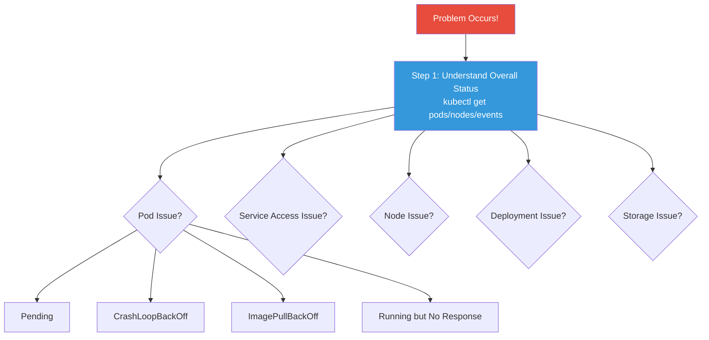
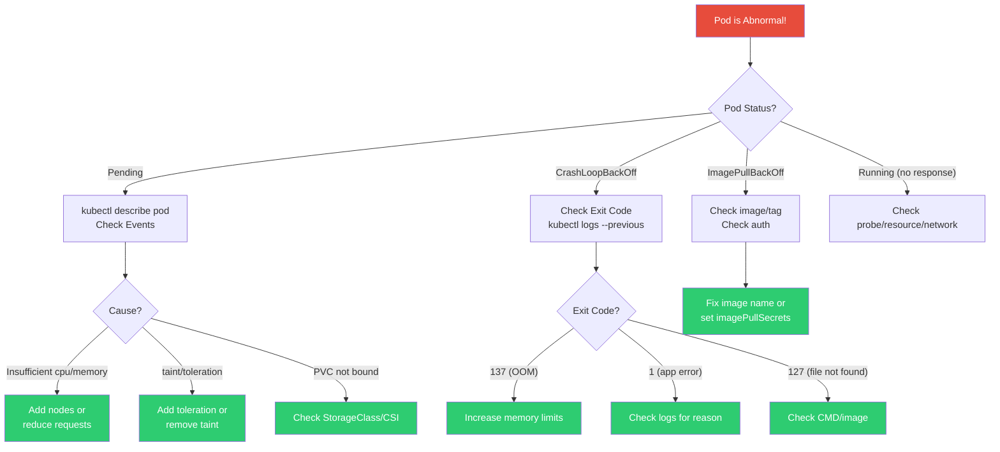
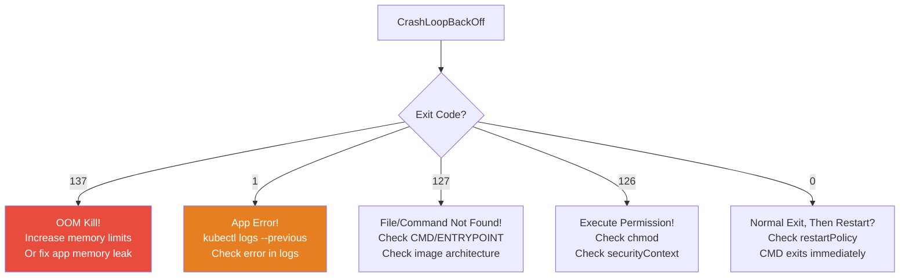
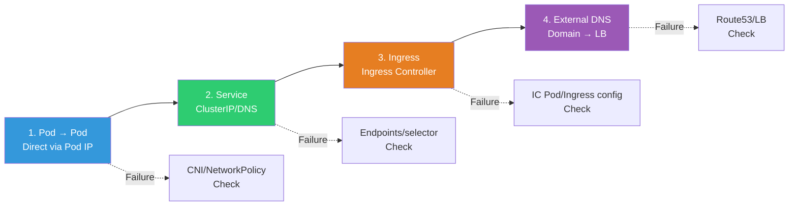

# Complete K8s Troubleshooting

> You've learned debugging piecemeal in each lesson. Now let's bring it all together into a **systematic framework for diagnosing K8s failures**. This is the K8s integrated version combining [container troubleshooting](../03-containers/08-troubleshooting) and [network debugging](../02-networking/08-debugging).

---

## 🎯 Why Learn This?

```
Most time spent on K8s operations goes to troubleshooting:
• "Pod is Pending"                          → Scheduling issue
• "Pod is CrashLoopBackOff"                 → App/config issue
• "Pod Running but no response"             → Probe/network issue
• "Deployment not progressing"              → Rollout issue
• "Can't access service"                    → Service/Ingress issue
• "Node is NotReady"                        → Node issue
• "PVC is Pending"                          → Storage issue
```

---

## 🧠 K8s Troubleshooting Master Framework



### Step 1: Understand Overall Status (Always Start Here!)

```bash
# === 30-second full health check ===

# Pod status
kubectl get pods -n production
# NAME        READY   STATUS             RESTARTS   AGE
# myapp-abc   1/1     Running            0          5d     ← Normal
# myapp-def   0/1     CrashLoopBackOff   5          10m    ← Issue!
# myapp-ghi   0/1     Pending            0          5m     ← Issue!

# Node status
kubectl get nodes
# NAME     STATUS     ROLES    AGE   VERSION
# node-1   Ready         30d   v1.28.0
# node-2   NotReady      30d   v1.28.0    ← Issue!

# Recent events (⭐ Fastest to identify root cause!)
kubectl get events -n production --sort-by='.lastTimestamp' | tail -15

# All resources
kubectl get all -n production
```

---

### Pod Troubleshooting Decision Tree



---

## 🔍 Pod Issue — Pending

### "Scheduling Failed!"

```bash
kubectl get pods -n production
# myapp-ghi   0/1   Pending   0   5m

# === Immediately describe! ===
kubectl describe pod myapp-ghi -n production | grep -A 10 "Events"
# Events:
#   Warning  FailedScheduling  default-scheduler
#   0/3 nodes are available:
#   2 Insufficient cpu.                    ← Cause 1: CPU shortage!
#   1 node(s) had taint ... NoSchedule.    ← Cause 2: taint!
```

**Pending Solutions by Cause:**

```bash
# === Cause 1: Resource shortage (most common!) ===
# "Insufficient cpu" or "Insufficient memory"

# Check node resources
kubectl describe node node-1 | grep -A 10 "Allocated resources"
# Allocated resources:
#   CPU Requests: 3500m (89%)    ← 89% used! No room!
#   Memory Requests: 6000Mi (80%)

kubectl top nodes
# NAME     CPU%   MEMORY%
# node-1   85%    78%
# node-2   90%    82%
# node-3   NotReady

# Solutions:
# a. Add nodes (Cluster Autoscaler/Karpenter — ./10-autoscaling)
# b. Reduce Pod's requests (if set too high)
# c. Clean up unnecessary Pods
# d. Upgrade node instance type

# === Cause 2: nodeSelector/affinity mismatch ===
# "didn't match Pod's node affinity/selector"

kubectl get pod myapp-ghi -o jsonpath='{.spec.nodeSelector}'
# {"disk":"ssd"}    ← Only on nodes with disk=ssd label!

kubectl get nodes --show-labels | grep disk
# (None!) → No ssd-labeled nodes!

# Solutions:
# a. Add label to node: kubectl label node node-1 disk=ssd
# b. Modify/remove nodeSelector

# === Cause 3: taint/toleration ===
# "had taint {key: NoSchedule}"

kubectl describe node node-1 | grep Taints
# Taints: dedicated=gpu:NoSchedule

# Add toleration to Pod:
# tolerations:
# - key: "dedicated"
#   operator: "Equal"
#   value: "gpu"
#   effect: "NoSchedule"

# === Cause 4: PVC binding wait ===
# "persistentvolumeclaim 'mydata' is not bound"
kubectl get pvc mydata -n production
# STATUS: Pending    ← PVC not attached!
# → See ./07-storage PVC troubleshooting!
```

---

## 🔍 Pod Issue — CrashLoopBackOff

### "Crashes Immediately!"

```bash
kubectl get pods
# myapp-def   0/1   CrashLoopBackOff   5   10m
#                                       ^
#                                       5 restarts!

# === Check Exit Code first! ===
kubectl get pod myapp-def -o jsonpath='{.status.containerStatuses[0].lastState.terminated.exitCode}'
# 137 → OOM Kill! (Memory exceeded)
# 1   → App error (check logs)
# 127 → File/command not found (check image)
# 126 → Execute permission denied

# (See ../03-containers/08-troubleshooting for detailed Exit Code info!)
```



```bash
# === Exit Code 137: OOM Kill ===
kubectl describe pod myapp-def | grep -i oom
# Last State: Terminated
#   Reason: OOMKilled

# Check current limits
kubectl get pod myapp-def -o jsonpath='{.spec.containers[0].resources.limits.memory}'
# 256Mi    ← Too small?

# Solutions:
# a. Increase memory limits (in Deployment)
# b. Check VPA recommendation (./10-autoscaling)
# c. Fix app's memory leak (profiling)

# === Exit Code 1: App Error ===
kubectl logs myapp-def --previous    # ⭐ Previous run logs!
# Error: Cannot find module 'express'
# → npm install didn't run! Check Dockerfile (../03-containers/03-dockerfile)

# Or
# Error: ECONNREFUSED 10.0.2.10:5432
# → DB connection failed! Check DB Pod/Service

# Or
# Error: EACCES: permission denied, open '/app/data/config.json'
# → File permission issue! Check securityContext/USER (../03-containers/09-security)

# === Exit Code 127: File Not Found ===
# Pod's CMD/ENTRYPOINT is wrong
kubectl get pod myapp-def -o jsonpath='{.spec.containers[0].command}'
# ["/app/nonexistent"]    ← This file doesn't exist in image!

# Check image:
kubectl run debug --image=myapp:v1.0 --rm -it --restart=Never --command -- ls -la /app/

# Alpine with glibc binary? (../03-containers/06-image-optimization)
# AMD64 binary on ARM? (Multi-architecture check)

# === Exit Code 0: Immediate Exit ===
# CMD is an instant-exit command like echo "hello"?
# → Web server must run in foreground!
# CMD ["node", "server.js"]    ← Run in foreground!
```

---

## 🔍 Pod Issue — ImagePullBackOff

```bash
kubectl get pods
# myapp-xyz   0/1   ImagePullBackOff   0   3m

kubectl describe pod myapp-xyz | grep -A 5 "Events"
# Warning  Failed  Failed to pull image "myapp:v9.9.9":
#   rpc error: code = NotFound desc = failed to pull and unpack image:
#   manifest not found

# (See ../03-containers/07-registry for image pull failure debugging!)
```

```bash
# Cause 1: Image/tag doesn't exist
# → Check image name, tag typo!
kubectl get pod myapp-xyz -o jsonpath='{.spec.containers[0].image}'
# myapp:v9.9.9    ← Does this tag exist in registry?

# Cause 2: Registry authentication failed
# → Check imagePullSecrets (./04-config-secret)
kubectl get pod myapp-xyz -o jsonpath='{.spec.imagePullSecrets}'
# → If empty, pull attempted without auth!

# Cause 3: Private registry access denied
# → ECR token expires (12 hours!), network/firewall

# Cause 4: Docker Hub rate limit
# → Anonymous: 100 requests/6 hours → Use ECR Pull Through Cache (../03-containers/07-registry)
```

---

## 🔍 Pod Issue — Running But No Response

```bash
kubectl get pods
# myapp-abc   1/1   Running   0   5d    ← Running, but not responding!

# === 1. Check Probes ===
kubectl describe pod myapp-abc | grep -A 15 "Liveness\|Readiness"
# Liveness: http-get http://:3000/health
#   → Is it passing? If failing, it restarts

# If readiness is failing:
kubectl get endpoints myapp-service
# ENDPOINTS:     ← Empty! No traffic!
# → (See ./08-healthcheck!)

# === 2. Test app directly inside ===
kubectl exec myapp-abc -- curl -s localhost:3000/health
# → Does app respond?

# If not responding:
kubectl exec myapp-abc -- ps aux
# → App process alive?
kubectl exec myapp-abc -- top -bn1
# → Who's using CPU?

# === 3. Network issue ===
# Test from another Pod
kubectl run test --image=busybox --rm -it --restart=Never -- \
    wget -qO- --timeout=3 http://myapp-abc-ip:3000/health
# → Can reach Pod IP?

# Via Service
kubectl run test --image=busybox --rm -it --restart=Never -- \
    wget -qO- --timeout=3 http://myapp-service/health
# → (See ./05-service-ingress Service debugging!)

# === 4. Resource issue ===
kubectl top pod myapp-abc
# CPU: 490m/500m (98%!)    ← CPU throttling!
# Memory: 500Mi/512Mi      ← Near OOM!
# → Increase resources.limits (./02-pod-deployment)
```

---

## 🔍 Service/Ingress Issue

### Network Troubleshooting Flow



### "Can't Access Service!"

```bash
# (See ./05-service-ingress debugging flowchart!)

# === Quick Checklist ===

# 1. Check Endpoints (⭐ Most Important!)
kubectl get endpoints myapp-service -n production
# ENDPOINTS:     ← Empty means check below!

# Why empty:
# a. Selector doesn't match any Pod
kubectl get svc myapp-service -o jsonpath='{.spec.selector}'
# {"app":"myapp"}
kubectl get pods -l app=myapp    # Any Pods with this label?

# b. Pods exist but not Ready
kubectl get pods -l app=myapp
# myapp-abc   0/1   Running    ← READY 0/1! readinessProbe failing!

# 2. Direct Service → Pod test
POD_IP=$(kubectl get pod myapp-abc -o jsonpath='{.status.podIP}')
kubectl run test --image=busybox --rm -it --restart=Never -- wget -qO- http://$POD_IP:3000
# → Can reach Pod directly?

# 3. DNS check
kubectl run test --image=busybox --rm -it --restart=Never -- nslookup myapp-service
# → DNS resolving? (../02-networking/12-service-discovery)

# 4. Ingress check
kubectl get ingress -n production
# ADDRESS empty → Ingress Controller issue!
kubectl get pods -n ingress-nginx    # Check IC Pod status

# 5. Full external path (through Ingress)
curl -v https://api.example.com/health
# → Where does it break? DNS → LB → Ingress → Service → Pod?
# → (See ../02-networking/08-debugging 5-step framework!)
```

---

## 🔍 Node Issue

### "Node is NotReady!"

```bash
kubectl get nodes
# node-2   NotReady      30d   v1.28.0

# === 1. Check Conditions ===
kubectl describe node node-2 | grep -A 15 "Conditions:"
# Type                Status   Reason
# MemoryPressure      True     KubeletHasMemoryPressure    ← Memory shortage!
# DiskPressure        True     KubeletHasDiskPressure      ← Disk shortage!
# PIDPressure         False    KubeletHasSufficientPID
# Ready               False    KubeletNotReady

# === 2. SSH to node and check ===
ssh node-2

# Memory (../01-linux/12-performance)
free -h
# total  used   free   available
# 7.8G   7.5G   100M   200M    ← Almost full!

# Disk (../01-linux/07-disk)
df -h /
# /dev/sda1   50G   48G   0   100%    ← 100%!

# kubelet status
systemctl status kubelet
# Active: active (running)    ← Still running

# kubelet logs (key!)
sudo journalctl -u kubelet --since "10 min ago" | tail -30
# PLEG is not healthy    ← PLEG(Pod Lifecycle Event Generator) issue!
# eviction manager: attempting to reclaim memory
# → Kubelet evicting Pods due to memory shortage!

# containerd status (../03-containers/04-runtime)
systemctl status containerd
sudo crictl ps

# === 3. Solutions ===
# Memory shortage:
# → Terminate unnecessary processes
# → Docker/containerd image cleanup: sudo crictl rmi --prune
# → Upgrade node instance type

# Disk shortage:
# → Docker image/log cleanup
sudo crictl rmi --prune
sudo find /var/log -name "*.log" -size +100M -exec truncate -s 0 {} \;
# → Cleanup /var/lib/containerd
# → Grow node EBS volume

# kubelet restart:
sudo systemctl restart kubelet
# → After a while, NotReady → Ready
```

### "Node Keeps Evicting Pods"

```bash
kubectl get pods -A --field-selector=status.phase=Failed | grep Evicted
# myapp-abc   0/1   Evicted   0   5m
# myapp-def   0/1   Evicted   0   3m

# Cause: kubelet evicting Pods due to resource shortage
# → Low memory/disk causes kubelet to evict lower-priority Pods

# Clean Evicted Pods
kubectl get pods -A --field-selector=status.phase=Failed -o name | xargs kubectl delete

# Root cause fix:
# → Monitor node resources (Prometheus — 08-observability)
# → Alert on shortage → Add nodes or clean Pods
# → Set Pod resources.requests properly (./02-pod-deployment)
```

---

## 🔍 Deployment Issue

### "Rollout Not Progressing!"

```bash
kubectl rollout status deployment/myapp -n production
# Waiting for deployment "myapp" rollout to finish: 1 out of 3 new replicas...
# → Stuck for 5 minutes!

# === 1. Check new Pod status ===
kubectl get pods -l app=myapp -n production
# myapp-new-abc   0/1   Running       0   5m     ← Ready 0/1!
# myapp-old-def   1/1   Running       0   1d     ← Old version OK

# Why new Pod not Ready?
kubectl describe pod myapp-new-abc | tail -15
# Warning  Unhealthy  Readiness probe failed: connection refused
# → New app version not responding to /ready!

# === 2. Check new Pod logs ===
kubectl logs myapp-new-abc
# Error: DATABASE_URL is not defined
# → Environment variable missing! Check ConfigMap/Secret (./04-config-secret)

# === 3. Rollback! ===
kubectl rollout undo deployment/myapp -n production
# → Immediately restore to previous stable version!
# → (See ./09-operations)

# === 4. Fix and redeploy ===
# Add environment variable → Fix image/deploy → Retry
```

### "helm upgrade Failed!"

```bash
helm list -n production
# NAME    REVISION   STATUS   CHART
# myapp   3          failed   myapp-1.2.0    ← failed!

# Check history
helm history myapp -n production
# REVISION   STATUS       DESCRIPTION
# 1          superseded   Install complete
# 2          deployed     Upgrade complete    ← Previous success
# 3          failed       Upgrade "myapp" failed

# Rollback
helm rollback myapp 2 -n production
# Rollback was a success!
# → (See ./12-helm-kustomize)

# Diagnose failure
helm get manifest myapp -n production | kubectl apply --dry-run=server -f -
# → Which resource fails?
```

---

## 🔍 Storage Issue

### "PVC is Pending!"

```bash
kubectl get pvc -n production
# NAME       STATUS    STORAGECLASS   CAPACITY   AGE
# mydata     Pending   gp3                5m

kubectl describe pvc mydata | tail -10
# Events:
#   Warning  ProvisioningFailed  ...

# (See ./07-storage for detailed PVC troubleshooting!)

# Quick checks:
# 1. StorageClass exists?
kubectl get storageclass

# 2. CSI driver installed?
kubectl get pods -n kube-system | grep csi

# 3. volumeBindingMode is WaitForFirstConsumer but Pod not up?
kubectl get sc gp3 -o jsonpath='{.volumeBindingMode}'
# WaitForFirstConsumer → Pod must be scheduled before PV created!

# 4. IAM permission (EBS CSI)
kubectl logs -n kube-system -l app=ebs-csi-controller --tail 10
# UnauthorizedOperation → IAM Role needs ec2:CreateVolume!
```

---

## 🔍 DNS Issue

### "Can't Resolve Service Name!"

```bash
# (See ../02-networking/12-service-discovery CoreDNS troubleshooting!)

# 1. CoreDNS Pod status
kubectl get pods -n kube-system -l k8s-app=kube-dns
# coredns-xxx   1/1   Running    ← Running?

# 2. Direct DNS test
kubectl run test --image=busybox --rm -it --restart=Never -- nslookup myapp-service
# Server: 10.96.0.10
# Name: myapp-service
# Address: 10.96.100.50    ← Resolves!
# Or
# ** server can't find myapp-service: NXDOMAIN    ← Not found!

# 3. Service exists?
kubectl get svc myapp-service
# → If not found, DNS won't resolve!

# 4. Different namespace needs FQDN!
nslookup myapp-service.other-namespace.svc.cluster.local

# 5. External DNS working?
kubectl run test --image=busybox --rm -it --restart=Never -- nslookup google.com
# If not → CoreDNS forward config or node DNS issue

# 6. NetworkPolicy blocking DNS(53)?
# → (See ./06-cni → 15-security NetworkPolicy!)
```

---

## 🔍 RBAC Issue

### "Forbidden!"

```bash
kubectl get pods -n production
# Error from server (Forbidden): pods is forbidden:
# User "dev@example.com" cannot list resource "pods" in namespace "production"

# (See ./11-rbac Forbidden debugging!)

# Quick checks:
# 1. Current user
kubectl config current-context
kubectl whoami    # krew whoami plugin

# 2. Check permission
kubectl auth can-i list pods -n production
# no

kubectl auth can-i --list -n production
# → List all permissions

# 3. Check RoleBinding
kubectl get rolebindings -n production -o wide

# 4. EKS aws-auth check
kubectl get cm aws-auth -n kube-system -o yaml | grep -A 5 $(kubectl whoami 2>/dev/null || echo "user")
```

---

## 💻 Practice Examples

### Practice 1: Comprehensive Troubleshooting

```bash
# Create problems intentionally and diagnose!

# Problem 1: Missing image
kubectl create deployment broken1 --image=nginx:nonexistent
sleep 5
kubectl get pods -l app=broken1
# STATUS: ErrImagePull

kubectl describe pod -l app=broken1 | grep "Failed"
# Failed to pull image "nginx:nonexistent": ... not found

# Fix
kubectl set image deployment/broken1 nginx=nginx:1.25

# Problem 2: Pending due to resource shortage
kubectl apply -f - << 'EOF'
apiVersion: apps/v1
kind: Deployment
metadata:
  name: broken2
spec:
  replicas: 1
  selector:
    matchLabels:
      app: broken2
  template:
    metadata:
      labels:
        app: broken2
    spec:
      containers:
      - name: app
        image: nginx
        resources:
          requests:
            cpu: "100"        # 100 cores! Impossible!
            memory: "100Gi"
EOF

sleep 5
kubectl get pods -l app=broken2
# STATUS: Pending

kubectl describe pod -l app=broken2 | grep "FailedScheduling"
# 0/3 nodes are available: 3 Insufficient cpu

# Fix
kubectl patch deployment broken2 -p '{"spec":{"template":{"spec":{"containers":[{"name":"app","resources":{"requests":{"cpu":"100m","memory":"128Mi"}}}]}}}}'

# Problem 3: CrashLoopBackOff (CMD error)
kubectl apply -f - << 'EOF'
apiVersion: v1
kind: Pod
metadata:
  name: broken3
spec:
  containers:
  - name: app
    image: busybox
    command: ["/nonexistent"]
  restartPolicy: Always
EOF

sleep 15
kubectl get pod broken3
# STATUS: CrashLoopBackOff

kubectl describe pod broken3 | grep "Exit Code"
# Exit Code: 127    ← File not found!

# Cleanup
kubectl delete deployment broken1 broken2
kubectl delete pod broken3
```

### Practice 2: Quick Diagnosis Routine

```bash
# 60-second diagnosis routine as script!

cat << 'SCRIPT' > /tmp/k8s-diagnose.sh
#!/bin/bash
NS="${1:-default}"
echo "=== Namespace: $NS ==="
echo ""

echo "--- Pod Status ---"
kubectl get pods -n $NS | grep -v "Running\|Completed" | grep -v "NAME" || echo "All Normal! ✅"
echo ""

echo "--- Pods with Many Restarts ---"
kubectl get pods -n $NS -o custom-columns=NAME:.metadata.name,RESTARTS:.status.containerStatuses[0].restartCount 2>/dev/null | awk 'NR>1 && $2>2'
echo ""

echo "--- Recent Warning Events ---"
kubectl get events -n $NS --field-selector type=Warning --sort-by='.lastTimestamp' 2>/dev/null | tail -5
echo ""

echo "--- Endpoints Check ---"
kubectl get endpoints -n $NS 2>/dev/null | awk '$2 == "" || $2 == "" {print "⚠️ " $1 " — Endpoints empty!"}'
echo ""

echo "--- Node Status ---"
kubectl get nodes | grep -v Ready | grep -v NAME || echo "All Nodes Ready ✅"
echo ""

echo "=== Diagnosis Complete ==="
SCRIPT

chmod +x /tmp/k8s-diagnose.sh
/tmp/k8s-diagnose.sh production
```

---

## 🏢 In Practice

### Scenario 1: Friday 5PM — Complete Service Outage

```bash
# Slack Alert: "Production API is 502!"
# Heart sinks. Let's diagnose calmly with 30-second routine!

# Step 1: Full picture (10 seconds)
kubectl get nodes
# node-1   Ready
# node-2   Ready
# node-3   NotReady    ← Node down!

kubectl get pods -n production | grep -v Running
# myapp-abc   0/1   Pending        ← node-3's Pod!
# myapp-def   0/1   Pending
# payment-a   0/1   Pending        ← Payment service too!

# Step 2: Root cause (20 seconds)
kubectl describe node node-3 | grep -A 5 "Conditions"
# MemoryPressure: True
# Ready: False — kubelet stopped posting node status

# Step 3: Immediate action (2 minutes)
# → Why can't Pending Pods fit on other nodes?
kubectl describe pod myapp-abc | grep FailedScheduling
# "Insufficient memory" — remaining nodes are tight!

# → Emergency: Reduce non-critical Pods or add nodes
kubectl scale deployment monitoring-heavy --replicas=0 -n production  # Temporary scale down
# → 5 minutes later, Pending Pods Running!

# Step 4: Root cause (after action)
# → Why didn't Cluster Autoscaler trigger? → max node limit was hit
# → Change max from 3 to 5
# → Add memory shortage alert (80% threshold)
```

### Scenario 2: Post-Deploy Error Rate Spike

```bash
# Monitoring: "5xx errors jumped from 0.1% to 15%!"
# Deployed v2.3.0 10 minutes ago

# Step 1: Check new Pod status
kubectl get pods -l app=api-server -n production
# api-server-new-xxx   1/1   Running   0   10m   ← Running...
# api-server-new-yyy   1/1   Running   0   10m
# api-server-old-zzz   1/1   Running   0   3d    ← Old version also

# Step 2: New Pod error pattern
kubectl logs -l app=api-server --since=10m | grep -i error | head -5
# Error: Redis connection timeout
# Error: ETIMEDOUT 10.0.5.20:6379
# → Redis connection issue! New version changed Redis config?

# Step 3: Rollback immediately! (minimize customer impact)
kubectl rollout undo deployment/api-server -n production
# → 30 seconds later, restored to old version, error rate back to 0.1%

# Step 4: Analyze (with time now)
# → v2.3.0 Redis pool config changed
# → Staging uses same-AZ Redis (low latency), but prod is cross-AZ (longer latency)
# → Timeout too short for cross-AZ
# → Fix: Adjust timeout, redeploy as v2.3.1
```

### Scenario 3: 3AM PagerDuty — Repeating Pod Restarts

```bash
# Alert: "api-worker Pod restarted 15 times in 30 minutes"

# Step 1: Pattern check
kubectl get pod api-worker-xxx -n production -o jsonpath='{.status.containerStatuses[0].restartCount}'
# 15

# Exit Code check
kubectl get pod api-worker-xxx -o jsonpath='{.status.containerStatuses[0].lastState.terminated}'
# {"exitCode":137,"reason":"OOMKilled"}    ← Memory!

# Step 2: Memory trend
kubectl top pod api-worker-xxx
# MEMORY: 490Mi/512Mi    ← limits near max!

# Step 3: Temporary fix (3AM, act fast!)
kubectl patch deployment api-worker -n production \
  -p '{"spec":{"template":{"spec":{"containers":[{"name":"worker","resources":{"limits":{"memory":"1Gi"}}}]}}}}'
# → limits 512Mi → 1Gi, restarts stop

# Step 4: Next day root cause
# → High memory usage at certain times (batch processing spike)
# → Adjust batch size + enable VPA for auto-tuning
```

---

## ⚠️ Common Mistakes

### 1. Trying to Check Logs Before describe

```bash
# ❌ Pending Pod, trying to check logs first
kubectl logs pending-pod
# Error: container "app" in pod "pending-pod" is waiting to start

# ✅ Pending/ImagePull → describe's Events are the answer!
kubectl describe pod pending-pod | grep -A 10 "Events"
# → Scheduling failure reason right there!

# Rule:
# Running → kubectl logs
# Anything else → kubectl describe
```

### 2. Not Knowing --previous Flag and Saying "No Logs"

```bash
# ❌ CrashLoopBackOff Pod's current logs (empty after recent restart)
kubectl logs crashing-pod
# (Empty or just startup logs)

# ✅ Previous run (before crash) logs!
kubectl logs crashing-pod --previous
# Error: Cannot connect to database
# → Real cause!
```

### 3. Forgetting Namespace

```bash
# ❌ "Pod not found!"
kubectl get pods
# No resources found in default namespace.

# ✅ Specify namespace!
kubectl get pods -n production
# myapp-abc   1/1   Running

# Tip: Set default namespace
kubectl config set-context --current --namespace=production
```

### 4. Spending Debug Time Instead of Rollback

```bash
# ❌ Production outage, spending 30 minutes debugging...
# → Customer still seeing errors!

# ✅ Rollback first → Verify recovery → Then analyze!
kubectl rollout undo deployment/myapp -n production  # 30 seconds recovery
# → Take time to investigate later

# Practice principle: MTTR (recovery time) > MTTD (diagnosis time)
# "Why it died" comes after "get it alive"!
```

### 5. Leaving Debug Pods Behind

```bash
# ❌ Debug Pods pile up
kubectl get pods -n production
# debug-test-1   1/1   Running   0   7d     ← Week-old debug!
# busybox-temp   1/1   Running   0   3d
# curl-test      1/1   Running   0   5d

# ✅ Use --rm for auto-delete!
kubectl run test --image=busybox --rm -it --restart=Never -- nslookup myapp
# → Auto-deleted on exit!

# Cleanup existing ones:
kubectl delete pod -l run=test -n production
kubectl delete pod -l run=debug -n production
```

---

## 📝 Summary

### Symptom → Cause → Solution Quick Reference

```
Pending
  → FailedScheduling + Insufficient cpu/memory → Add nodes/reduce requests
  → FailedScheduling + taint                   → Add toleration
  → FailedScheduling + node selector           → Check labels
  → PVC not bound                              → Check StorageClass/CSI

CrashLoopBackOff
  → Exit 137 (OOM)     → Increase memory limits
  → Exit 1 (app error) → Check logs --previous
  → Exit 127 (not found) → Check CMD/image
  → Exit 126 (permission) → Check chmod/securityContext

ImagePullBackOff
  → manifest not found  → Check image/tag typo
  → unauthorized        → Check imagePullSecrets/auth
  → too many requests   → Docker Hub rate limit

Running but no response
  → readiness failing   → Endpoints missing → Check probe
  → CPU throttling      → Increase resources.limits.cpu
  → App hang            → liveness restarts → Restart needed

Service unreachable
  → Endpoints <none>    → Check selector/readiness
  → DNS fails           → Check CoreDNS
  → Ingress ADDRESS     → Check Ingress Controller
empty

Node NotReady
  → MemoryPressure      → Clean memory/expand
  → DiskPressure        → Clean disk/expand
  → kubelet dead        → systemctl restart kubelet
```

### Diagnosis Command Cheatsheet

```bash
# Overall status
kubectl get pods/nodes/events -n NS

# Pod diagnosis
kubectl describe pod NAME                    # Events!
kubectl logs NAME [--previous]               # Logs
kubectl get pod NAME -o jsonpath='{.status.containerStatuses[0].lastState.terminated.exitCode}'

# Service diagnosis
kubectl get endpoints NAME                   # Empty?
kubectl get pods -l app=NAME                 # Match selector?

# Node diagnosis
kubectl describe node NAME                   # Conditions
ssh NODE && journalctl -u kubelet --tail 30  # kubelet logs

# Resources
kubectl top pods/nodes
kubectl describe node NAME | grep Allocated

# Network
kubectl run test --image=busybox --rm -it -- nslookup SERVICE
kubectl run test --image=busybox --rm -it -- wget -qO- http://SERVICE

# RBAC
kubectl auth can-i VERB RESOURCE [-n NS]
```

---

## 🔗 Next Lesson

Next is **[15-security](./15-security)** — NetworkPolicy / PSS / OPA / Falco.

You've learned how to fix problems. Now let's learn to **prevent them with security**. You learned "who can do what" in [RBAC](./11-rbac). Now learn "what Pods can do" with NetworkPolicy, Pod Security Standards, policy engines(OPA), and runtime security(Falco).
